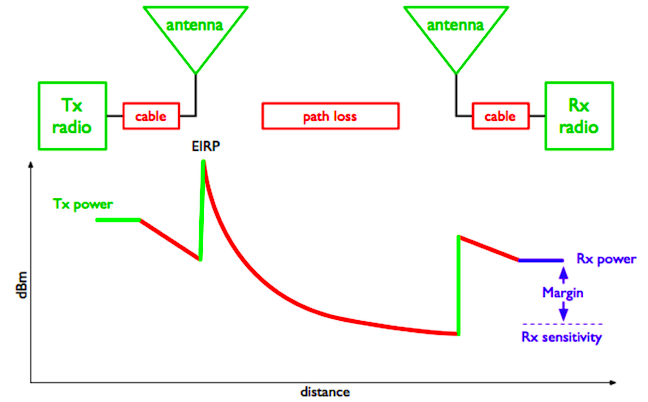
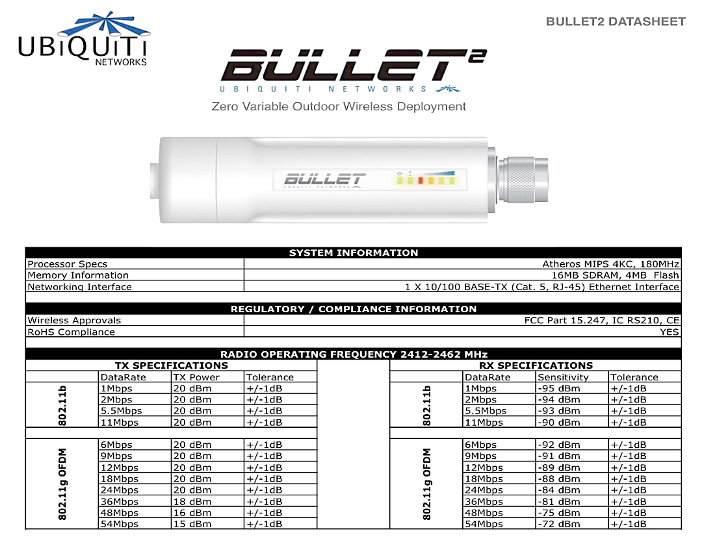
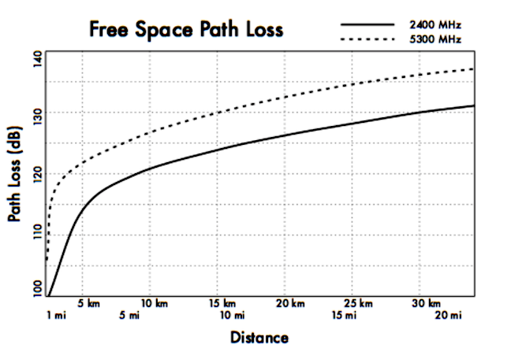
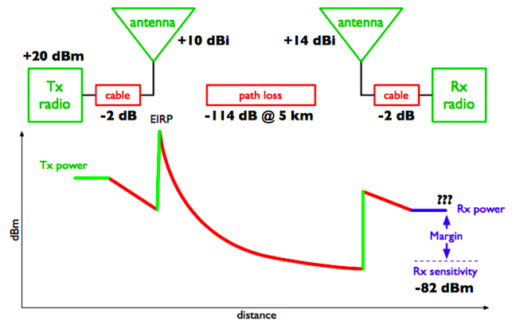
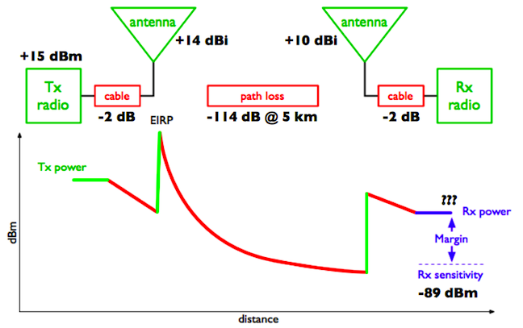
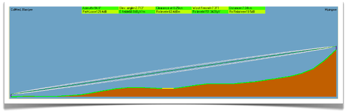
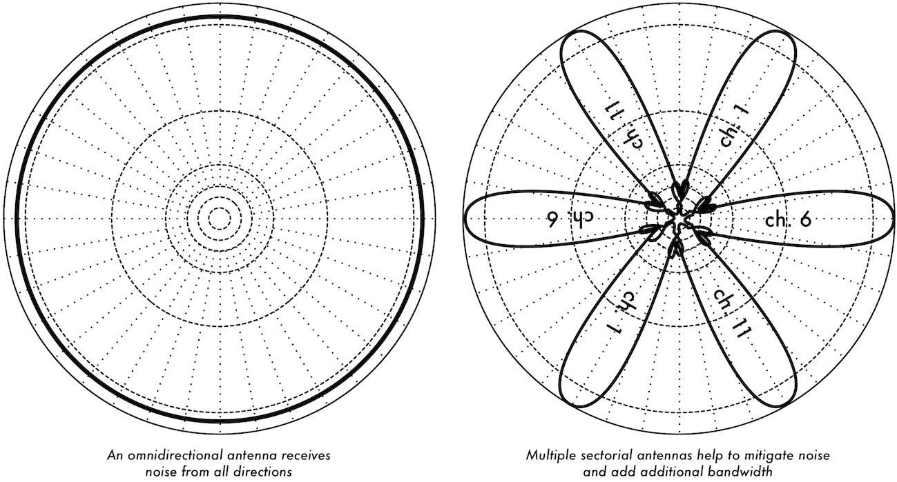
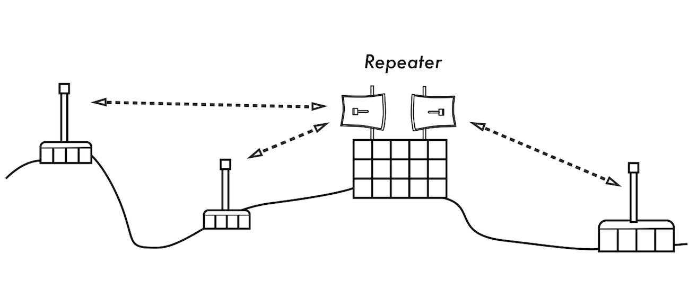
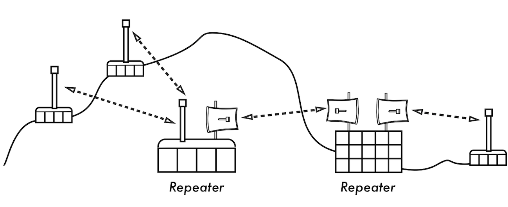
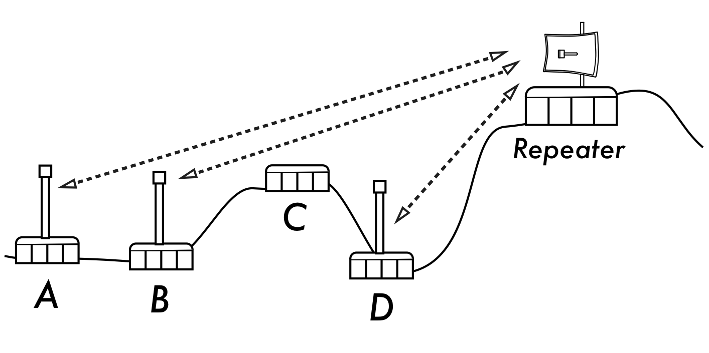

10. DEPLOYMENT PLANNING
-----------------------

### Estimating capacity

In order to estimate capacity, it is important to understand that a
wireless device’s listed speed (the so called data rate) refers to the
rate at which the radios can exchange symbols, not the useable
throughput you will observe. Throughput is also referred to as channel
capacity, or simply bandwidth (although this term is different from
radio bandwidth!

 

The bandwidth-throughput is measured in Mbps, while the radio bandwidth
is measures in MHz.). For example, a single 802.11g link may use 54 Mbps
radios, but it will only provide up to 22 Mbps of actual throughput. The
rest is overhead that the radios need in order to coordinate their
signals using the 802.11g protocol.

 

Note that throughput is a measurement of bits over time. 22 Mbps means
that in any given second, up to 22 megabits can be sent from one end of
the link to the other. If users attempt to push more than 22 megabits
through the link, it will take longer than one second.

Since the data can’t be sent immediately, it is put in a queue, and
transmitted as quickly as possible.

 

This backlog of data increases the time needed for the most recently
queued bits to the traverse the link.

The time that it takes for data to traverse a link is called latency,
and high latency is commonly referred to as lag.

 

Your link will eventually send all of the queued traffic, but your users
will likely complain as the lag increases.

How much throughput will your users really need?

It depends on how many users you have, and how they use the wireless
link.

Various Internet applications require different amounts of throughput.

 

Application

Requirement/ User

Notes

Text messaging / IM

\< 1 kbps

As traffic is infrequent and asynchronous, IM will tolerate high
latency.

Email

1 to 100 kbps

As with IM, email is asynchronous and intermittent, so it will tolerate
latency. Large attachments, viruses, and spam significantly add to
bandwidth usage.

Note that web email services (such as Yahoo or Hotmail) should be
considered as web browsing, not as email.

Web browsing

50 - 100+ kbps

Web browsers only use the network when data is requested. Communication
Is asynchronous, so a fair amount of lag can be tolerated.

As web browsers request more data (large images, long downloads, etc.)
bandwidth usage will go up significantly.

Streaming audio

96 - 160 kbps

Each user of a streaming audio service will use a constant amount of
relatively large bandwidth for as long as it plays.

It can tolerate some transient latency by using large buffers on the
client. But extended periods of lag will cause audio “skips” or outright
session failures.

Voice over IP (VoIP)

24 - 100+ kbps

As with streaming audio, VoIP commits a constant amount of bandwidth to
each user for the duration of the call. But with VoIP, the bandwidth is
used roughly equally in both directions. Latency on a VoIP connection is
immediate and annoying to users.

Lag greater than a few milliseconds is unacceptable for VoIP.

Streaming video

64 - 200+ kbps

As with streaming audio, some intermittent latency is avoided by using
buffers on the client. Streaming video requires high throughput and low
latency to work properly.

Peer-to-peer file sharing applications

0 - infinite Mbps

While peer to peer applications will tolerate any amount of latency,
they tend to use up all available throughput by transmitting data to as
many clients as possible, as quickly as possible. Use of these
applications will cause latency and throughput problems for all other
network users unless you use careful bandwidth shaping.

To estimate the necessary throughput you will need for your network,
multiply the expected number of users by the requirements of
applications they will probably use.

 

For example, 50 users who are chiefly browsing the web will likely
consume 2.5 to 5 Mbps or more of throughput at peak times, and will
tolerate some latency.

 

On the other hand, 50 simultaneous VoIP users would require 5 Mbps or
more of throughput in both directions with low latency. Since 802.11g
wireless equipment is half duplex (that is, it only transmits or
receives, never both at once) you should accordingly double the required
throughput, for a total of 10 Mbps.

 

Your wireless links must provide that capacity every second, or
conversations will lag.

Since all of your users are unlikely to use the connection at precisely
the same moment, it is common practice to oversubscribe available
throughput by some factor (that is, allow more users than the maximum
available bandwidth can support).

 

Oversubscribing by a factor of 5 to 10 is quite common. In all
likelihood, you will oversubscribe by some amount when building your
network infrastructure.

 

By carefully monitoring throughput throughout your network, you will be
able to plan when to upgrade various parts of the network, and how much
additional resources will be needed.

### Calculating the link budget

Determining if a link is feasible or not is a process called link budget
calculation and can be either performed manually or using specialised
tools.

A basic communication system consists of two radios, each with its
associated antenna, the two being separated by the path to be covered as
shown in following Figure DP 1.

 

 

Figure DP 1: Components of a Basic Communication System.

 

In order to have a communication between the two, the radios require a
certain minimum signal to be collected by the antennas and presented at
their input ports.

Whether or not signals can be passed between the radios depends on the
characteristics of the equipment and on the diminishment of the signal
due to distance, called path loss. In such a system, some of the
parameters can be modified (the equipment used) while others are fixed
(the distance between the radios). Let’s start by examining the
parameters that can we can modify.

 

​1. The characteristics of the equipment to be considered when
calculating the link budget are:

 

Transmit (TX) Power. It is expressed in milliwatts or in dBm. TX power
is often dependent on the transmission rate.

The TX power of a given device should be specified in the literature
provided by the manufacturer.

 

An example is shown here following, where you can see that using 802.11g
there is a difference of 5 dB in output power when using 6 Mbs or 54
Mbs.

 

 

Figure DP 2: Ubiquiti Bullet2 Datasheet

 

Antenna Gain.

Antennas are passive devices that create the effect of amplification by
virtue of their physical shape.

Antennas have the same characteristics when receiving and transmitting.
So a 12 dBi antenna is simply a 12 dBi antenna, without specifying if it
is in transmission or reception mode.

Typical values are as follows: parabolic antennas have a gain of 19-24
dBi; omnidirectional antennas have 5- 12 dBi; sectorial antennas have
roughly a 12-15 dBi gain.

 

Minimum Received Signal Level (RSL), or simply, the sensitivity of the
receiver.

The minimum RSL is always expressed as a negative dBm (-dBm) and is the
lowest signal level the radio can distinguish.

The minimum RSL is dependent upon rate, and as a general rule the lowest
rate (1 Mbps) has the greatest sensitivity.

The minimum will be typically in the range of -75 to -95 dBm.

 

Like TX power, the RSL specifications should be provided by the
manufacturer of the equipment.

In the datasheet presented above you can see that there is a 20 dB
difference in receiver sensitivity, with -92 dBm at 6 Mbs and -72 dBm at
54 Mbs. Don’t forget that a difference of 20 dB means a ratio of 100 in
terms of power!

 

Cable Losses. Some of the signal's energy is lost in the cables, the
connectors and other devices, going from the radios to the antennas. T

he loss depends on the type of cable used and on its length.

 

Signal loss for short coaxial cables including connectors is quite low,
in the range of 2-3 dB. It is better to have cables as short as
possible. Equipment now tends to have embedded antennas and thus the
cable length is very short.

 

​2. When calculating the path loss, several effects must be considered.
One has to take into account the free space loss, attenuation and
scattering.

 

Free Space Loss.

Geometric spreading of the wavefront, commonly known as free space loss,
diminishes signal power. Ignoring everything else, the further away the
two radios, the smaller the received signal is due to free space loss.
This is independent of the environment, it depends only on the distance.
This loss happens because the radiated signal energy expands as a
function of the distance from the transmitter.

 

Using decibels to express the loss and using a generic frequency f, the
equation for the Free Space Loss is:

 

Lfsl = 32.4+20\*log10(D)+20\*log10(f)

 

where Lfsl is expressed in dB and D is in kilometres and f is in MHz.

When plotting the free space loss vs the distance, one gets a figure
like the one below. What should be noted is that the difference between
using 2400 MHz and 5300 MHz is 6 dB in terms of free space loss.

So the higher frequency gives a higher free space loss, which is usually
balanced by a higher gain in the parabolic antennas.

 

A parabolic antenna operating at 5 GHz is 6 dB more powerful than one
operating at 2.4 GHz, for the same antenna dimensions.

Having two antennas of 6 dB higher gain on each side, provides a net 6
dB advantage when migrating from 2.4 to 5 GHz.

 

 

Figure DP 3: Free Space Path Loss calculation graph.

 

Attenuation

The second contribution to the path loss is attenuation.

This takes place as some of the power is absorbed when the wave passes
through solid objects such as trees, walls, windows and floors of
buildings.

Attenuation can vary greatly depending upon the structure of the object
the signal is passing through, and it is very difficult to quantify.

 

Scattering

Along the link path, the RF energy leaves the transmitting antenna and
energy spreads out. Some of the RF energy reaches the receiving antenna
directly, while some bounces off the ground. Part of the RF energy which
bounces off the ground reaches the receiving antenna. Since the
reflected signal has a longer way to travel, it arrives at the receiving
antenna later than the direct signal. This effect is called multipath,
or signal dispersion. In some cases reflected signals add together and
cause no problem.

When they add together out of phase, the received signal is almost
worthless. In some cases, the signal at the receiving antenna can be
zeroed by the reflected signals.

This is known as extreme fading, or nulling. There is a simple technique
that is used to deal with multipath, called antenna diversity.

It consists of adding a second antenna to the radio. Multipath is in
fact a very location-specific phenomenon.

 

If two signals add out of phase at one location, they will not add
destructively at a second, nearby location.

If there are two antennas, at least one of them should be able to
receive a useable signal, even if the other is receiving a faded one. In
commercial devices, antenna switching diversity is used: there are
multiple antennas on multiple inputs, with a single receiver.

 

The signal is received through only one antenna at a time.

When transmitting, the radio uses the antenna last used for reception.
The distortion given by multipath degrades the ability of the receiver
to recover the signal in a manner much like signal loss.

Putting all these parameters together leads to the link budget
calculation. If you are using different radios on the two sides of the
link, you should calculate the path loss twice, once for each direction
(using the appropriate TX power, RX power, TX antenna gain, RX antenna
gain for each calculation).

 

Adding up all the gains and subtracting all the losses gives:

 

                TX Power                 Radio 1

                +Antenna Gain                Radio 1

                -Cable Losses                 Radio 1

                +Antenna Gain                Radio 2

                -Cable Losses                 Radio 2

                =Total Gain

 

Subtracting the Path Loss from the Total Gain:

 

Total Gain - Path Loss = Signal Level at receiving side of the link

 

If the resulting signal level is greater than the minimum received
signal level of the receiving radio, then the link is feasible!

The received signal is powerful enough for the radio to use it.

 

Remember that the minimum RSL is always expressed as a negative dBm, so
-56 dBm is greater than -70 dBm.

 

On a given path, the variation in path loss over a period of time can be
large, so a certain margin should be considered.

This margin is the amount of signal above the sensitivity of radio that
should be received in order to ensure a stable, high quality radio link
during bad weather and other atmospheric disturbances.

 

A margin of 10 to 15 dB is fine. To give some space for attenuation and
multipath in the received radio signal, a margin of 20dB should be safe
enough.

 

Once you have calculated the link budget in one direction, repeat the
calculation for the other direction.

Substitute the transmit power for that of the second radio, and compare
the result against the minimum received signal level of the first radio.

 

Example link budget calculation

As an example, we want to estimate the feasibility of a 5 km link, with
one access point and one client radio.

 

-   The access point is connected to an omni directional antenna with a
    10dBi gain, while the client is connected to a directional antenna
    with 14 dBi gain.  

-   The transmitting power of the AP is 100 mW (or 20 dBm) and its
    sensitivity is -89 dBm.  

-   The transmitting power of the client is 30 mW (or 15 dBm) and its
    sensitivity is -82 dBm.  

-   The cables are short, so we can estimate a loss of 2 dB at each
    side.  

 

Let’s start by calculating the link budget from the AP to the client, as
shown in Figure DP 4.

 

 

 

 

Figure DP 4: Link Budget calculation from AP to client.

 

Adding up all the gains and subtracting all the losses for the AP to
client link gives:

 

                 20 dBm        (TX Power Radio 1)

                +10 dBi                (Antenna Gain Radio 1)

                 -2 dB                (Cable Losses Radio 1)

                +14 dBi                (Antenna Gain Radio 2)

                 -2 dB                (Cable Losses Radio 2)

                 40 dB=        Total Gain

 

The path loss for a 5 km link, considering the free space loss is
-114dB. Subtracting the path loss from the total gain:

 

40 dB - 114 dB = -74 dB

 

Since -74 dB is greater than the minimum receive sensitivity of the
client radio (-82 dBm), the signal level is just enough for the client
radio to be able to hear the access point. There is only 8 dB of margin
(82 dB - 74 dB) which will likely work fine in fair weather, but may not
be enough to protect against extreme weather conditions.

Next we calculate the link from the client back to the access point, as
shown on the next page.

 

Figure DP 5: Link Budget calculation from client to AP.

 

                 15 dBm        (TX Power Radio 2)

                +14 dBi                (Antenna Gain Radio 2)

                -2 dB                (Cable Losses Radio 2)

                +10 dBi                (Antenna Gain Radio 1)

                -2 dB                (Cable Losses Radio 1)

                 35 dB =        Total Gain

 

Obviously, the path loss is the same on the return trip. So our received
signal level on the access point side is:

 

35 dB - 114 dB = -79 dB

 

Since the receive sensitivity of the AP is -89dBm, this leaves us 10dB
of margin (89dB - 79dB). Overall, this link will probably work fine.

By using a 24dBi dish on the client side rather than a 14dBi antenna, we
will get an additional 10dBi of gain on both directions of the link
(remember, antenna gain is reciprocal).

 

A more expensive option would be to use higher power radios on both ends
of the link, but note that adding an amplifier or higher-powered card to
one end generally does not help the overall quality of the link.

 

 

 

#### Tables for calculating link budget

To calculate the link budget, simply approximate your link distance, and
then fill in the following tables:

 

Free Space Path Loss at 2.4 GHz

Distance (m)

100

500

1000

3000

5000

10000

Loss (dB)

80

94

100

110

114

120

 

 

Antenna Gain:

Radio 1 Antenna

+ Radio 2 Antenna

= Total Antenna Gain

 

 

 

Losses:

Radio 1 + Cable Loss (dB)

Radio 2 + Cable Loss (dB)

Free Space Path Loss (dB)

= Total Loss (dB)

 

 

 

 

Link Budget for Radio 1        Radio 2:

Radio 1 TX Power

+ Antenna Gain

- Total Loss

= Signal

\> Radio 2 Sensitivity

 

 

Link Budget for Radio 2        Radio 1:

Radio 2 TX Power

+ Antenna Gain

- Total Loss

= Signal

\> Radio 1 Sensitivity

 

 

If the received signal is greater than the minimum received signal
strength in both directions of the link, as well as any noise received
along the path, then the link is possible.

### Link planning software

While calculating a link budget by hand is straightforward, there are a
number of tools available that will help automate the process. In
addition to calculating free space loss, these tools will take many
other relevant factors into account as well (such as tree absorption,
terrain effects, climate, and even estimating path loss in urban areas).
Most commercial tools are very expensive and are often designed to be
used with specific hardware. In this section we will discuss a free tool
called RadioMobile.

#### RadioMobile

Radio Mobile is a tool for the design and simulation of wireless
systems. It predicts the performance of a radio link by using
information about the equipment and a digital map of the area. It is
public domain software but it is not open source. Radio Mobile uses a
digital terrain elevation model for the calculation of coverage,
indicating received signal strength at various points along the path. It
automatically builds a profile between two points in the digital map
showing the coverage area and first Fresnel zone. An example is shown in
Figure DP 6 below.

 

 

Figure DP 6: Radio Mobile simulation showing a digital terrain elevation
and first Fresnel zone.

 

During the simulation, it checks for line of sight and calculates the
Path Loss, including losses due to obstacles.

It is possible to create networks of different topologies, including net
master/slave, point-to-point, and point-to-multipoint. The software
calculates the coverage area from the base station in a
point-to-multipoint system. It works for systems having frequencies from
100 kHz to 200 GHz. Digital elevation maps (DEM) are available for free
from several sources, and are available for most of the world.

DEMs do not show coastlines or other readily identifiable landmarks, but
they can easily be combined with other kinds of data (such as aerial
photos or topographical charts) in several layers to obtain a more
useful and readily recognisable representation. You can digitise your
own maps and combine them with DEMs. The digital elevation maps can be
merged with scanned maps, satellite photos and Internet map services
(such as Google Maps) to produce accurate prediction plots.

There are two versions of RadioMobile: a version running on Windows and
a version running online via a web interface. Here are the main
differences between the two.

 

Web version:

-   it can run on any machine (Linux, Mac, Windows, tablet, phone,
    etc) 

-   it does not require big downloads. As it runs online, data is
    stored on the server and only the necessary data is downloaded. 

-   it saves sessions. If you run a simulation and login after some
    time, you will still find your simulation and the results. 

-   it is easier to use, especially for beginners. 

-   it requires connectivity. It is not possible to run a simulation if
    you are offline. 

-   as it has been developed for the community of radio amateurs, it
    can work only for certain frequency bands. As an example, it is not
    possible to simulate links at 5.8GHz but only at 5.3GHz. This is
    good enough from a practical point of view, but one has to keep it
    in mind. 

 

Windows version:

-   it can run offline. Once the maps are downloaded, there is no need
    to be online to run the simulation. 

-   one can use an external GPS to get the exact position of the
    station. While this is not often used, it could be useful
    sometimes. 

-   it runs on Windows (it does run in Linux but not directly). 

-   it requires big downloads. If your bandwidth is limited,
    downloading many maps might be a problem. The online version
    requires smaller downloads. 

-   It is not user friendly, especially for beginners. 

 

The main RadioMobile webpage, with examples and tutorials, is available
at:
[http://www.cplus.org/rmw/english1.html](http://www.cplus.org/rmw/english1.html)

Follow the instructions to install the software on Windows.

#### RadioMobile online

To use the online version of RadioMobile you must first create an
account. Go to:
[http://www.cplus.org/rmw/rmonline.html](http://www.cplus.org/rmw/rmonline.html)and
create a new account. You will receive a confirmation email in few
minutes and will be ready to go.

Simulating a link requires some steps that require following the menu on
the left, from top to bottom as shown in Figure DP 7 below.

 

 

Figure DP 7: Preparing to simulate a link using Radio Mobile.

 

The first step is to click on New Site. You will be presented a Map,
similar to Google Maps. You can zoom into the map to find the location
of your first site. Drag the Orange Placemark and place it in the
desired position. Once you are done, click on Submit.

 

Give the location a meaningful name, and click on Add to My Sites. In
this way, you will be able to use this location for the simulation.

Repeat the same process for the second site.

Once you have at least two sites, you can proceed with the next step.
The interface will not allow you to enter directly the coordinates of
the site, so you might want to enter an approximate position for the
cursor and then afterward correct the value of the coordinates in the
table.

The second step involves entering information about the link: the
equipment characteristics, the antennas, etc.

Click on New Link in the menu on the left. Select the two sites from the
drop-down menus. Enter a meaningful name for the link and enter the
information about the equipment use. The sensitivity of the receiver is
expressed in microVolts, while we usually use dBm.

 

To translate from microVolts to dBm, here are some examples:

 

-90dBm is 7.07 microvolts

-85dBm is 12.6 microvolts

-80dBm is 22.4 microvolts

-75dBm is 39.8 microvolts

-70dBm is 70.7 microvolts

 

It is very important to choose a frequency that RadioMobile online can
handle.

Here are the most important frequencies for WiFi links:

 

Use 2300 MHz for 2.4 GHz links and 5825 MHz for 5.8 GHz links.

 

Once you have entered all the information, click on Submit. In a short
time, you will be presented a figure similar to the one below.

 

 

Figure DP 8: Output of the simulation.

 

This page has all the necessary information to understand if the link is
feasible or not.

It gives information on: the link length, the azimuth, elevation and
tilt you should give to antennas, the free space loss, the total space
loss including the statistical loss and, most importantly, the received
signal level.

With the receiver sensitivity you entered, you will be presented with
the fade margin and you will be able to determine if the link is
feasible or not. If you are happy with the result, at the top of the
page you should click on Add to my sites and the link will be stored. If
you are not satisfied and want to simulate a different equipment setup,
click on Modify this link.

#### Radio Mobile for Windows in simple steps

This is an abridged guide to start using Radio Mobile after
installation. Every parameter not specified here can be left at the
default value and later modified if needed.

 

Step 1: download the digital elevation maps (DEMs) of your area of
interest. choose SRTM format.

Step 2: create a map. In “File” →” Map properties”, choose the midpoint
of your area of interest as the coordinates for your map and a size in
km large enough to encompass all your points. Use 514X514 pixels for
now. You can add another type of map (like one with roads) to the raw
DEM if you like.

Step 3: Create systems. In “File” →” Network properties” →”Systems”.
Each one is a combination of TX power, RX sensitivity and antenna gain.
Select omni antenna even if your antenna is directional, but insert the
real gain.

Step 4: create units. Each unit has a name and a geographical
position.You can use degrees, minutes, seconds or degrees and fractions,
but make sure to select the proper hemisphere (N or S, E or W).

Step 5: Assign roles: select item “Networks properties” from the menu
“File”. Then go to the tab “Membership” where you will be allowed to
edit the system and role for each unit. Enable each unit in the list
with a checkmark. Assign a name to your network and in the ”parameters”
tab set the minimum and maximum frequency of operation in MHz.

Step 6: View your network on the map. Select “View” →”Show
networks”→”All”

 

Step 7: Obtain the profile and point to point link budget. “Tools”
→”Radio link”. You can switch to the detailed view that gives you a

textual description of the output of the simulation.

Step 8: View coverage: go to “Tools” → “Radio coverage” → “Single polar”
to obtain the coverage of each station. Here the type of antenna becomes
relevant. If it is not an omni you should edit the antenna pattern and
the orientation of the boresight (direction where the beam is pointing).

#### Using Google Earth to obtain an elevation profile

Google Earth is a very popular mapping application. It can be used to
obtain the elevation profile between two points and therefore determine
the existence (or not) of the optical line of sight. The radioelectric
line of sight can be derived from the optical one by adding the effect
of the earth curvature (by using the modified radius of the earth) and
the requirements for clearing the first Fresnel zone.

#### The procedure is the following:

Install Google Earth in your device, launch the application and zoom
into the map so you can see the two points that you want to link.

 

1.  1.In the upper menu, click on "Add path" 

2.  2.Click to set the first point and then for the second point 

3.  3.Give the connection a name ("Link" for example) and click OK in
    the pop-up window 

4.  4.The connection appears in the menu on the left 

5.  5.Right click on the name of the connection ("Link" in our example) 

6.  6.Select "Show elevation profile" 

7.  7.The elevation profile appears at the bottom on the screen 

8.  8.If you move along the profile, you will see a red arrow showing
    where the point is in the map 

### Avoiding noise

The unlicensed ISM and U-NII bands represent a very tiny piece of the
known electromagnetic spectrum. Since this region can be utilised
without paying license fees, many consumer devices use it for a wide
range of applications.

 

Cordless phones, analog video senders, Bluetooth, baby monitors, and
even microwave ovens compete with wireless data networks for use of the
very limited 2.4 GHz band.

These signals, as well as other local wireless networks, can cause
significant problems for long-range wireless links. Here are some steps
you can use to reduce reception of unwanted signals.

 

Increase antenna gain on both sides of a point-to-point link. Antennas
not only add gain to a link, but their increased directionality tends to
reject noise from areas around the link.

 

Two high gain dishes that are pointed at each other will reject noise
from directions that are outside the path of the link. Using
omnidirectional antennas will receive noise from all directions.

 

 

 

Figure DP 9: A single omnidirectional antenna vs. multiple sectorials.

 

Use sectorials instead of using an omnidirectional.

 

By making use of several sectorial antennas, you can reduce the overall
noise received at a distribution point.

 

By staggering the channels used on each sectorial, you can also increase
the available bandwidth to your clients.

Don’t use an amplifier. Amplifiers can make interference issues worse by
indiscriminately amplifying all received signals, including sources of
interference. Amplifiers also cause interference problems for other
nearby users of the band.

 

Use the best available channel. Remember that 802.11b/g channels are 22
MHz wide, but are only separated by 5 MHz.

Perform a site survey, and select a channel that is as far as possible
from existing sources of interference. Remember that the wireless
landscape can change at any time as people add new devices (cordless
phones, other networks, etc.) If your link suddenly has trouble sending
packets, you may need to perform another site survey and pick a
different channel.

 

If possible, use 5.8 GHz. While this is only a short-term solution,
there is currently far more consumer equipment installed in the field
that uses 2.4 GHz. Using 802.11a you will avoid this congestion
altogether.

 

If all else fails, use licensed spectrum. There are places where all
available unlicensed spectrum is actually used. In these cases, it may
make sense to spend the additional money for obtaining the respective
license and deploy equipment that uses a less congested band. For long
distance point-to-point links that require very high throughput and
maximum uptime, this is certainly an option. Of course, these features
come at a much higher price tag compared to unlicensed equipment.

Recently equipment in the 17 GHz and 24 GHz bands have become available.

Although it is considerably more expensive, it also offers much greater
bandwidth, and in many countries these frequencies are unlicensed.

 

To identify sources of noise, you need tools that will show you what is
happening in the air at 2.4 GHz. We will see some examples of these
tools in the chapters called Network Monitoring and Maintenance and
Troubleshooting.

 

 

 

### Repeaters

The most critical component to building long distance network links is
line of sight (often abbreviated as LOS).

Terrestrial microwave systems simply cannot tolerate large hills, trees,
or other obstacles in the path of a long distance link. You must have a
clear idea of the lay of the land between two points before you can
determine if a link is even possible. But even if there is a mountain
between two points, remember that obstacles can sometimes be turned into
assets.

 

Mountains may block your signal, but assuming power can be provided they
also make very good repeater sites.

Repeaters are nodes that are configured to rebroadcast traffic that is
not destined for the node itself. In a mesh network, every node is a
repeater. In a traditional infrastructure network, repeater nodes must
be configured to pass along traffic to other nodes. A repeater can use
one or more wireless devices.

When using a single radio (called a one-arm repeater), overall
efficiency is slightly less than half of the available bandwidth, since
the radio can either send or receive data, but never both at once. These
devices are cheaper, simpler, and have lower power requirements.

 

A repeater with two (or more) radio cards can operate all radios at full
capacity, as long as they are each configured to use non-overlapping
channels.

Of course, repeaters can also supply an Ethernet connection to provide
local connectivity.

Repeaters can be purchased as a complete hardware solution, or easily
assembled by connecting two or more wireless nodes together with
Ethernet cable.

 

When planning to use a repeater built with 802.11 technology, remember
that nodes must be configured for master, managed, or ad-hoc mode.

Typically, both radios in a repeater are configured for master mode, to
allow multiple clients to connect to either side of the repeater. But
depending on your network layout, one or more devices may need to use
ad-hoc or even client mode.

 

Figure DP 10: The repeater forwards packets over the air between nodes
that have no direct line of sight.

 

Typically, repeaters are used to overcome obstacles in the path of a
long distance link. For example, there may be buildings in your path,
but those buildings contain people. Arrangements can often be worked out
with building owners to provide bandwidth in exchange for roof rights
and electricity. If the building owner isn’t interested, tenants on high
floors may be able to be persuaded to install equipment in a window. If
you can’t go over or through an obstacle, you can often go around it.
Rather than using a direct link, try a multi-hop approach to avoid the
obstacle.

 

Figure DP 11: No power was available at the top of the hill, but it was
circumvented by using multiple repeater sites around the base.

 

Finally, you may need to consider going backwards in order to go
forwards. If there is a high site available in a different direction,
and that site can see beyond the obstacle, a stable link can be made via
an indirect route.

 

Figure DP 12: Site D could not make a clean link to site A or B, since
site C is in the way and is not hosting a node. By installing a high
repeater, nodes A, B, and D can communicate with each other. Note that
traffic from node D actually travels further away from the rest of the
network before the repeater forwards it along.

### Deployment planning for IPv6

As we mentioned in the chapter called Networking, most regions of the
world have either exhausted or nearly exhausted their IPv4 addresses.
Therefore it is important that you build into your planning the
deployment of IPv6 based networks.

 

It is understood that at the time of writing there are still many sites
and services that are still only available by IPv4.

 

So in order to become a leader in deploying IPv6, you will need to be
able to interconnect with legacy IPv4 networks as well as teach and
guide your users and developers how to handle IPv6 alongside IPv4.

 

By leading the way in deploying IPv6 in your network you will be at the
forefront of the Internet and recognised as someone who is prepared to
be aware of and support the next generation of networking.

 

 

 

 

In preparing for IPv6 here are some steps you can take to help move you
in the right direction -

 

1.  1.Dont buy routers, firewalls and other IP equipment that process
    IPv4 packets in hardware at full speed and only process IPv6 packets
    more slowly in software or worse still dont handle IPv6 at all. The
    vast majority of available network devices support IPv6. RIPE has
    prepared some requirements to be added into any call for tender to
    ensure that IPv6 is included: 

    http://www.ripe.net/ripe/docs/current -ripe-documents/ripe-554 

    You may also look for the IPv6-Ready logo on the data sheets of the
    devices. 

2.  2.When deploying new software, make sure it works over IPv6. 

3.  3.When discussing your backhaul link with a local ISP, check that
    they have deployed or have plans to deploy and offer IPv6 services.
    If not discuss with them how you might co-operate and interconnect
    your IPv6 network with them. The cost of IPv6 should be included in
    the overall cost; this means that you will not pay anything more to
    get IPv6. The Service Level Agreement (SLA) for IPv6 should be
    identical (throughput, latency, incident response time, ...) as for
    IPv4. There are several IPv4/IPv6 transition techniques that can be
    deployed.  

 

Here are some urls that you can read that will give you up to date
information about these -

[http://www.petri.co.il/ipv6](http://www.petri.co.il/ipv6-transition.htm)-[transition.htm](http://www.petri.co.il/ipv6-transition.htm)

[http://en.wikipedia.org/wiki/IPv6\_transition\_mechanisms](http://en.wikipedia.org/wiki/IPv6_transition_mechanisms)

[http://www.6diss.org/tutorials/transitioning.pdf](http://www.6diss.org/tutorials/transitioning.pdf)

 

There is more information about the growth of IPv6 and the lack of
available IPv4 adresses in this article published in late 2012.

http://arstechnica.com/business/2013/01/ipv6-takes-one-step-forward-ipv4-two-steps-back-in-2012/

 

There is also an EC funded project called 6Deploy who offer training and
helpdesk services for network engineers starting their IPv6 deployments.
It is highly recommended that you contact them to discuss your project.

http://www.6deploy.eu/index.php?page=home
