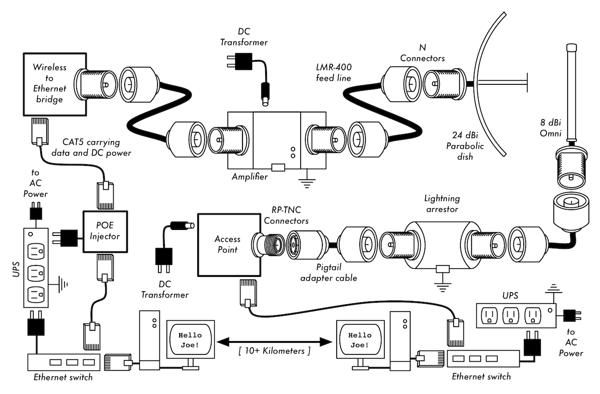
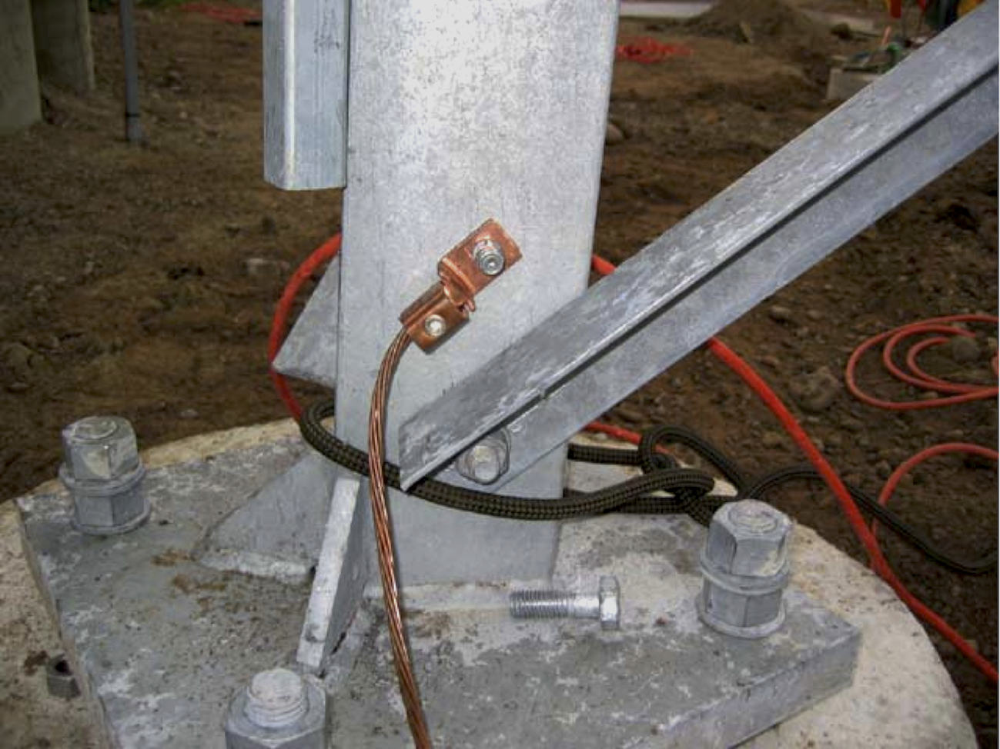
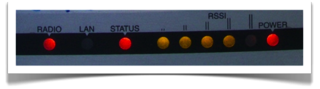
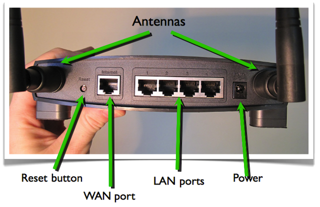
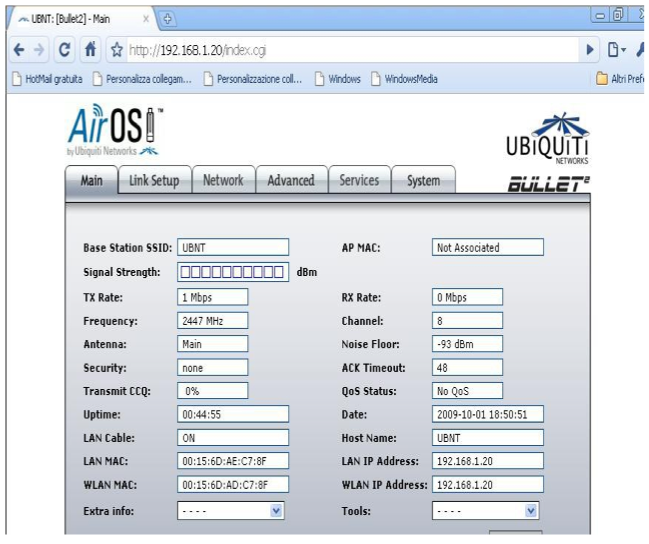
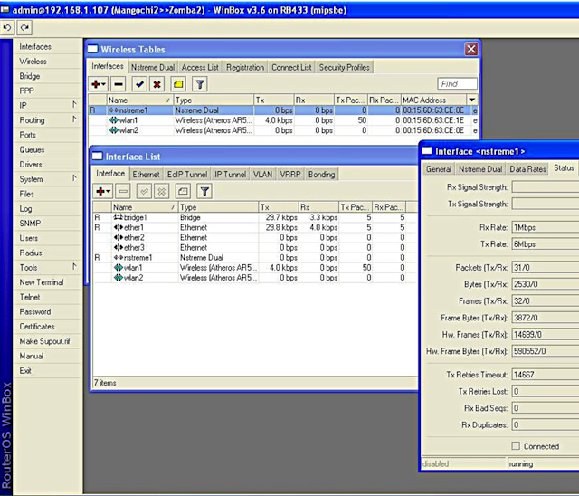
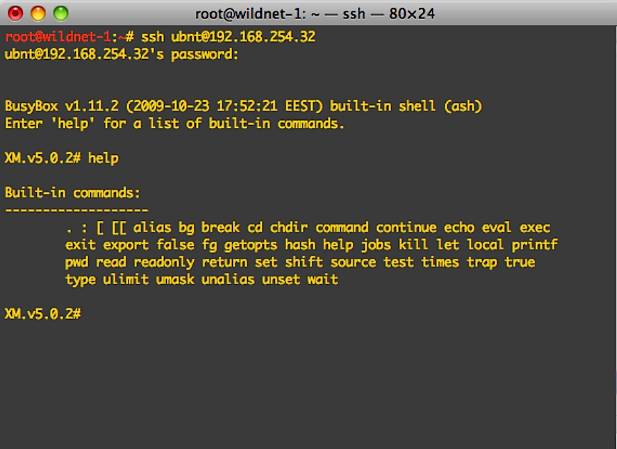

11. HARDWARE SELECTION AND CONFIGURATION
----------------------------------------

 

In the last few years, an unprecedented surge of interest in wireless
networking hardware has brought a huge variety of inexpensive equipment
to the market.

So much variety, in fact, that it would be impossible to catalog every
available component. In this chapter, we’ll look at the sort of features
and attributes that are desirable in a wireless component.

### Wired wireless

With a name like “wireless”, you may be surprised at how many wires are
involved in making a simple point-to-point link.

A wireless node consists of many components, which must all be connected
to each other with appropriate cabling.

You obviously need at least one computer connected to an Ethernet
network, and a wireless router or bridge attached to the same network.
Radio components need to be connected to antennas, but along the way
they may need to interface with a lightning arrestor or other device.

 

Many components require power, either via an AC mains line or using a DC
transformer.

All of these components use various sorts of connectors, not to mention
a wide variety of cable types and thicknesses.

Now multiply those cables and connectors by the number of nodes you will
bring online, and you may well be wondering why this stuff is referred
to as “wireless”.

 

The diagram on the next page will give you some idea of the cabling
required for a typical point-to-point link.

Note that this diagram is not to scale, nor is it necessarily the best
choice of network design. But it will introduce you to many common
interconnects and components that you will likely encounter in the real
world.

 

Figure HW 1: Common Interconnects and Components for a Wireless PtP
link.

 

While the actual components used will vary from node to node, every
installation will incorporate these parts:

 

1.  1.  1.An existing computer or network connected to an Ethernet
        switch. 

    2.  2.A device that connects that network to a wireless device (a
        wireless router, bridge, or repeater). 

    3.  3.An antenna that is connected via feed line, or is integrated
        into the wireless device itself. 

    4.  4.Electrical components consisting of power supplies,
        conditioners, and lightning arrestors. 

 

The actual selection of hardware should be determined by establishing
the requirements for the project, determining the available budget, and
verifying that the project is feasible using the available resources
(including providing for spares and ongoing maintenance costs).

 

As discussed in other chapters of this book, establishing the scope of
your project is critical before any purchasing decisions are made.

### Choosing wireless components

Unfortunately, in a world of competitive hardware manufacturers and
limited budgets, the price tag is the single factor that usually
receives the most attention.

The old saying that “you get what you pay for” often holds true when
buying high tech equipment, but should not be considered an absolute
truth. While the price tag is an important part of any purchasing
decision, it is vital to understand precisely what you get for your
money so you can make a choice that fits your needs.

 

When comparing wireless equipment for use in your network, be sure to
consider these variables:

 

Interoperability. Will the equipment you are considering work with
equipment from other manufacturers? If not, is this an important factor
for this segment of your network? If the gear in question is standard
(such as 802.11b/g), then it will likely interoperate with equipment
from other sources.

 

Range. This is not something inherent in a particular piece of
equipment. A device’s range depends on the antenna connected to it, the
surrounding terrain, the characteristics of the device at the other end
of the link, and other factors.

Rather than relying on a semi- fictional “range” rating supplied by the
manufacturer, it is more useful to know the transmission power of the
radio as well as the antenna gain (if an antenna is included).

 

With this information, you can calculate the theoretical range as done
when looking at link budget calculations as we did in the chapter called
Deployment Planning.

 

Radio sensitivity. How sensitive is the radio device at a given bit
rate? The manufacturer should supply this information, at least at the
fastest and slowest speeds.

This can be used as a measure of the quality of the hardware, as well as
allow you to complete a link budget calculation.

When considering radio sensitivity, a lower number is better.

 

Throughput. Manufacturers consistently list the highest possible bit
rate as the “speed” of their equipment. Keep in mind that the radio
symbol rate (eg. 54 Mbps) is never the actual throughput rating of the
device (eg. about 22 Mbps for 802.11g).

If throughput rate information is not available for the device you are
evaluating, a good rule of thumb is to divide the device “speed” by two,
and subtract 20% or so. When in doubt, perform throughput testing on an
evaluation unit before committing to purchasing a large amount of
equipment that has no official throughput rating.

 

Required accessories. To keep the initial price tag low, vendors often
leave out accessories that are required for normal use. Does the price
tag include all power adapters? For example DC supplies are typically
included; Power over Ethernet injectors typically are not. Double-check
input voltages as well, as equipment is sometimes provided with a US
power supply.

What about pigtails, adapters, cables, antennas, and radio cards? If you
intend to use it outdoors, does the device include a weatherproof case?

 

Availability. Will you be able to easily replace failed components? Can
you order the part in large quantity, should your project require it?
What is the projected life span of this particular product, both in
terms of useful running time in-the-field and likely availability from
the vendor?

 

Power consumption. For remote installations, power consumption is the
most critical issue. If the devices are to be powered with solar panels,
it is very important to select the ones that require the lowest possible
power.

The cost of solar panels and batteries can be much higher than the cost
of wireless devices; so lower power consumption can result in a much
lower overall budget.

 

Other factors. Be sure that other features are provided to meet your
particular needs. For example, does the device include an external
antenna connector? If so, what type is it? Are there user or throughput
limits imposed by software, and if so, what is the cost to increase
these limits?

What is the physical form factor of the device?

Does it support POE as a power source? Does the device provide
encryption, NAT, bandwidth monitoring tools, or other features critical
to the intended network design?

 

By answering these questions first, you will be able to make intelligent
buying decisions when the time comes to choosing networking hardware. It
is unlikely that you will be able to answer every possible question
before buying gear, but if you prioritise the questions and press the
vendor to answer them before committing to a purchase, you will make the
best use of your budget and build a network of components that are well
suited to your needs.

### Commercial vs. DIY solutions

Your network project will almost certainly consist of components
purchased from vendors as well as parts that are sourced or even
fabricated locally. This is a basic economic truth in most areas of the
world. At this stage of human technology, global distribution of
information is quite trivial compared to global distribution of goods.
In many regions, importing every component needed to build a network is
prohibitively expensive for all but the largest budgets.

You can save considerable money in the short term by finding local
sources for parts and labour, and only importing components that must be
purchased.

 

Of course, there is a limit to how much work can be done by any
individual or group in a given amount of time. To put it another way, by
importing technology, you can exchange money for equipment that can
solve a particular problem in a comparatively short amount of time. The
art of building local telecommunications infrastructure lies in finding
the right balance of money to effort needed to be expended to solve the
problem at hand.

 

Some components, such as radios and antenna feed line, are likely far
too complex to consider having them fabricated locally. Other
components, such as antennas and towers, are relatively simple and can
be made locally for a fraction of the cost of importing. Between these
extremes lie the communication devices themselves.

By using off-the-shelf radio cards, motherboards, and other components,
you can build devices that provide features comparable (or even
superior) to most commercial implementations. Combining open hardware
platforms with open source software can yield significant “bang for the
buck” by providing custom, robust solutions for very low cost.

This is not to say that commercial equipment is inferior to a
do-it-yourself solution.

By providing so-called “turn-key solutions”, manufacturers not only save
development time, but they can also allow relatively unskilled people to
install and maintain equipment.

The chief strengths of commercial solutions are that they provide
support and a (usually limited) equipment warranty. They also provide a
consistent platform that tends to lead to very stable, often
interchangeable network installations.

 

If a piece of equipment simply doesn’t work or is difficult to configure
or troubleshoot, a good manufacturer will assist you.

Should the equipment fail in normal use (barring extreme damage, such as
a lightning strike) then the manufacturer will typically replace it.

Most will provide these services for a limited time as part of the
purchase price, and many offer support and warranty for an extended
period for a monthly fee. By providing a consistent platform, it is
simple to keep spares on hand and simply “swap out” equipment that fails
in the field, without the need for a technician to configure equipment
on-site.

Of course, all of this comes at comparatively higher initial cost for
the equipment compared to off-the-shelf components.

From a network architect’s point of view, the three greatest hidden
risks when choosing commercial solutions are vendor lock-in,
discontinued product lines, and ongoing licensing costs.

 

It can be costly to allow the lure of ill-defined new “features” drive
the development of your network.

Manufacturers will frequently provide features that are incompatible
with their competition by design, and then issue marketing materials to
convince you that you simply cannot live without them (regardless of
whether the feature contributes to the solution of your communications
problem).

As you begin to rely on these features, you will likely decide to
continue purchasing equipment from the same manufacturer in the future.

 

This is the essence of vendor lock-in.

If a large institution uses a significant amount of proprietary
equipment, it is unlikely that they will simply abandon it to use a
different vendor.

 

Sales teams know this (and indeed, some rely on it) and use vendor
lock-in as a strategy for price negotiations.

 

When combined with vendor lock-in, a manufacturer may eventually decide
to discontinue a product line, regardless of its popularity. This
ensures that customers, already reliant on the manufacturer’s
proprietary features, will purchase the newest (and nearly always more
expensive) model. The long term effects of vendor lock-in and
discontinued products are difficult to estimate when planning a
networking project, but should be kept in mind.

 

Finally, if a particular piece of equipment uses proprietary computer
code, you may need to license use of that code on an ongoing basis. The
cost of these licenses may vary depending on features provided, number
of users, connection speed, or other factors. If the license fee is
unpaid, some equipment is designed to simply stop working until a valid,
paid-up license is provided! Be sure that you understand the terms of
use for any equipment you purchase, including ongoing licensing fees.

 

By using equipment that supports standards and open source software, you
can avoid some of these pitfalls.

For example, it is very difficult to become locked-in to a vendor that
uses open protocols (such as TCP/IP over 802.11a/b/g). If you encounter
a problem with the equipment or the vendor, you can always purchase
equipment from a different vendor that will interoperate with what you
have already purchased. It is for these reasons that we recommend using
proprietary protocols and licensed spectrum only in cases where the open
equivalent (such as 802.11a/b/g) is not technically feasible.

Likewise, while individual products can always be discontinued at any
time, you can limit the impact this will have on your network by using
generic components.

For example, a particular motherboard may become unavailable on the
market, but you may have a number of PC motherboards on hand that will
perform effectively the same task.

Obviously, there should be no ongoing licensing costs involved with open
source software (with the exception of a vendor providing extended
support or some other service, without charging for the use of the
software itself).

 

There have occasionally been vendors who capitalise on the gift that
open source programmers have given to the world by offering the code for
sale on an ongoing licensed basis, thereby violating the terms of
distribution set forth by the original authors.

It would be wise to avoid such vendors, and to be suspicious of claims
of “free software” that come with an ongoing license fee.

The disadvantage of using open source software and generic hardware is
clearly the question of support.

 

As problems with the network arise, you will need to solve those
problems for yourself. This is often accomplished by consulting free
online resources and search engines, and applying code patches directly.

 

If you do not have team members who are competent and dedicated to
designing a solution to your communications problem, then it can take a
considerable amount of time to get a network project off the ground.

Of course, there is never a guarantee that simply “throwing money at the
problem” will solve it either.

 

While we provide many examples of how to do much of the work yourself,
you may find this work very challenging. You will need to find the
balance of commercial solutions and the do-it-yourself approach that
works for your project.

 

In short, always define the scope of your network first, identify the
resources you can bring to bear on the problem, and allow the selection
of equipment to naturally emerge from the results.

Consider commercial solutions as well as open components, while keeping
in mind the long- term costs of both.

 

When considering which equipment to use, always remember to compare the
expected useful distance, reliability, and throughput, in addition to
the price.

 

And finally, make sure that the radios you purchase operate in an
unlicensed band where you are installing them, or if you must use
licensed spectrum, that you have budget and permission to pay for the
appropriate licenses.

### Professional lightning protection

Lightning is a natural predator of wireless equipment. A map showing the
global distribution of lightning from 1995 to 2003 is shown here
following.

 

 

 

Figure HW 2: Global distribution of lightning from 1995 to 2003

 

 

There are two different ways lightning can strike or damage equipment:
direct hits or induction hits.

 

Direct hits happen when lightning actually hits the tower or antenna.
Induction hits are caused when lightning strikes near the tower.

 

Imagine a negatively charged lightning bolt.

Since like charges repel each other, that bolt will cause the electrons
in the cables to move away from the strike, creating current on the
lines.

This can be much more current than the sensitive radio equipment can
handle.

Either type of strike will usually destroy unprotected equipment.

 

 

Figure HW 3: A tower with a heavy copper grounding wire.

 

Protecting wireless networks from lightning is not an exact science, and
there is no guarantee that a lightning strike will not happen, even if
every single precaution is taken. Many of the methods used will help
prevent both direct and induction strikes.

While it is not necessary to use every single lightning protection
method, using more methods will help further protect the equipment.

The amount of lightning historically observed within a service area will
be the biggest guide to how much needs to be done.

Start at the very bottom of the tower. Remember, the bottom of the tower
is below the ground. After the tower foundation is laid, but before the
hole is backfilled, a ring of heavy braided ground wire should have been
installed with the lead extending above ground surfacing near a tower
leg.

The wire should be American Wire Gauge (AWG) \#4 or thicker.

In addition, a backup ground or earthing rod should be driven into the
ground, and a ground wire run from the rod to the lead from the buried
ring.

It is important to note that not all steel conducts electricity the same
way.

Some types of steel act as better electrical conductors than others, and
different surface coatings can also affect how tower steel handles
electrical current. Stainless steel is one of the worst conductors, and
rust proof coatings like galvanizing or paint lessen the conductivity of
the steel.

For this reason, a braided ground wire is run from the bottom of the
tower all the way to the top. The bottom needs to be properly attached
to the leads from both the ring and the backup ground rod.

The top of the tower should have a lightning rod attached, and the top
of that needs to be pointed. The finer and sharper the point, the more
effective the rod will be.

The braided ground wire from the bottom needs to be terminated at the
grounding of the lightning rod. It is very important to be sure that the
ground wire is connected to the actual metal. Any sort of coating, such
as paint, must be removed before the wire is attached. Once the
connection is made, the exposed area can be repainted, covering the wire
and connectors if necessary to save the tower from rust and other
corrosion.

 

The above solution details the installation of the basic grounding
system. It provides protection for the tower itself from direct hits,
and installs the base system to which everything else will connect.

The ideal protection for indirect induction lightning strikes are gas
tube arrestors at both ends of the cable.

These arrestors need to be grounded directly to the ground wire
installed on the tower if it is at the high end.

The bottom end needs to be grounded to something electrically safe, like
a ground plate or a copper pipe that is consistently full of water. It
is important to make sure that the outdoor lightning arrestor is
weatherproofed.

Many arresters for coax cables are weatherproofed, while many arresters
for CAT5 cable are not. In the event that gas arrestors are not being
used, and the cabling is coax based, then attaching one end of a wire to
the shield of the cable and the other to the ground wire installed on
the towers will provide some protection.

This can provide a path for induction currents, and if the charge is
weak enough, it will not affect the conductor wire of the cable. While
this method is by no means as good a protection as using the gas
arrestors, it is better than doing nothing at all.

### Access Point Configuration

This section will provide a simple procedure for the basic configuration
of WiFi Access Points and Clients by reviewing the main settings and
analysing their effects on the behaviour of the network.

It will also suggest some practical tips and tricks and troubleshooting
advice.

#### Before you start

When you receive some new wireless equipment take some time to get
acquainted with its main features and make sure you:

 

-   Download or otherwise obtain all user’s manuals and specification
    sheets available for the devices you are going to deploy. 

-   If you have second-hand devices, be sure to receive full
    information on their current –or last-known– configuration (e.g.
    password, IP addresses, etc.) 

-   You should already have a plan on hand for the network you are
    going to deploy (including link budget, network topology, channels
    and IP settings). 

-   Be ready to take written notes of all settings that you are going
    to apply (especially passwords!) 

-   Make backups of last known good configuration files. 

#### Getting in touch with the device

As a first step, it is important that you learn the meaning of all LEDs
on the device.

The figure below shows the typical front of an Access Point, with
several LEDs lit.

 

 

Figure HW 4: The front of a typical Access Point.

 

LEDs typically indicate:

 

-   Presence of power 

-   Active ports / traffic (yellow/green colour) 

-   Error status (red colour) 

-   Received signal strength (LED bars, sometimes multicolour; some
    devices can even be set to light each LED at specific thresholds,
    e.g. Ubiquiti) 

 

Sometimes, different meanings are associated with the same LED, using
different colours and dynamics (e.g. LED is on/off/blinking at different
speeds).

 

You should identify the different ports and interfaces on the device:

 

-   Radio interfaces, sometimes called WLANs. They should have one or
    more antenna connectors (or non-detachable antennas). 

-   One or more Ethernet interfaces: 

-   One or more ports for local network (LAN) 

-   One port for uplink (also called WAN) 

-   Power input (5, 6, 7.5, 12V or other, usually DC). It is really
    (really) important that the power supply matches the voltage!
    Sometimes the power is provided to the device through the same UTP
    cable that carries the Ethernet data: this is called
    Power-over-Ethernet (PoE). 

-   Power button (not always present). 

-   Reset button (often “hidden” in a small hole, can be pressed using
    a straightened paperclip). 

 

The reset button may have different effects (from a simple restart to a
factory full reset) if pressed briefly vs. for a longer time. It can
take 30 seconds or more to trigger a full reset.

NOTE: to fully reset (i.e. reset to factory settings) a device that is
in an unknown state may be a painful task!

Be sure to keep written notes of critical parameters like the device IP
address and network mask, and the administrator username and password.

The following figure shows a common Linksys Access Point, with the power
input, the network ports, the reset button and two antennas.

 

 

Figure HW 5: Linksys Access Point

#### User interfaces

You can interact (i.e. issue commands and change settings) with the
Access Point in several ways, depending on the hardware you are using.
The possible ways are the following:

 

-   Graphical User Interface (web page) 

-   Graphical User Interface (proprietary software application) 

-   Command Line Interface (telnet, ssh) 

-   Software interface embedded in the system (when the AP/client is a
    computer or smartphone with a display and its own OS) 

 

#### User interfaces: GUI (web page)

This system is used in Linksys, Ubiquiti and most modern Aps.

Once you are connected to the AP, you interact with the device using a
normal browser.

Advantages: it works with most browsers and operating systems

Disadvantages: the static interface does not reflect changes
immediately; poor feedback; can be incompatible with some web browsers;
requires a working TCP/IP configuration. Some recent implementations
(e.g. Ubiquiti, shown below) are very good and use modern dynamic web
features to provide feedback and advanced tools.

 

Figure HW 6: Ubiquiti user interface.

 

#### User interfaces: GUI (software application)

In this case you need a special piece of software to interact with the
device.

This system is used in Mikrotik (called Winbox), Apple (called Airport
Utility), Motorola (called Canopy), many old APs.

 

Advantages: usually powerful and appealing interfaces; allow batch
configuration of multiple devices.

Disadvantages: proprietary solutions; usually available for only one
operating system; software must be installed before starting
configuration.

Mikrotik Winbox, shown below, is a very powerful solution and can manage
large networks.

 

 

 

Figure HW 7: Mikrotik WinBox.

 

#### User interfaces: Command Line Interface (sometimes called text shell)

In this case you connect to the device using a serial or Ethernet
connection, via telnet or ssh. ssh is much safer than telnet from a
security perspective (the latter should be avoided if possible).

Configuration is performed with commands executed in the host operating
system, usually a flavour of Linux or a proprietary OS, as shown on the
next page.

 

This is system is used by Mikrotik (called RouterOS), Ubiquiti (called
AirOS), high-end APs (Cisco) and embedded PC-based Aps.

 

Advantages: very powerful as it can be scripted.

 

Disadvantages: difficult to learn.

 

Figure HW 8: Command Line Interface.

#### Configure the AP

Before configuring the AP, remember to:

 

-   Start from a known state, or reset the device to factory settings
    (always a good idea!). 

-   Connecting to the device via Ethernet is usually easier than via
    wireless. Most devices with a web GUI have a default IP
    configuration on the network 192.168.0.0, but this is not a rule!
    Read the manual. 

-   If convenient, upgrade the firmware to the latest stable version
    (but be careful!) 

-   Change the default admin username and password first! 

-   Change the device name with something that clearly identifies it
    (e.g. something like “AP\_conference\_room\_3” or
    “hotspot\_public\_area”). This will help you to recognise the AP in
    future when you connect to it over the network. 

 

 

-   Firmware upgrade is often a risky procedure, be sure to adopt all
    precautions before attempting it - such as - connecting the device
    and the computer to a UPS, then do not perform the firmware update
    while doing other tasks on the computer, and check that you have a
    valid firmware binary image, READ THE INSTRUCTIONS CAREFULLY! If the
    procedure fails, you can end up with an unusable device that cannot
    be recovered (the so-called “brick”). 

-   Remember to write down (and store in a safe place) all these
    settings, especially the admin username/password. 

#### Configure the AP - IP layer

If you are confident with what you are doing, you can perform the IP
configuration after the wireless setup to avoid the reconfiguration and
reconnection of your PC or laptop. But in this way, if you make any
mistake in both the wired and wireless setup, you may end up with an
unreachable AP. We'd strongly advise that you do the critical
configuration steps one at a time, checking the status of the device
after each step.

Remember to write down (and store in a safe place) all IP settings!

 

Configure the Ethernet interface of the AP according to your wired
network setup:

 

-   IP address/netmask/gateway or DHCP 

-   DNS address(es) 

-   Double check the new settings and apply them (sometimes you may
    have to reboot the AP) 

-   Now you may need to reconfigure your PC/laptop to match the new
    Ethernet setup, and reconnect to the AP. 

#### Configure the AP - physical layer

-   Configure the mode: master (or access point or base station). The
    device’s mode can usually be configured as: “master” (also called
    “access point” or “base station” or “BS”), “client” (also called
    “managed” or “station” or “client station” or “CPE”), “monitor”,
    “WDS” (Wireless Distribution System), and rarely some other
    variants. 

 

-   Configure the SSID (Service Set Identifier, the name of the
    wireless network created by the AP, up to 32 characters long): it is
    best to choose a meaningful name. Remember that “security through
    obfuscation is not real security”, so a hidden or fake/random SSID
    does not add much security to your network. 

-   Configure the wireless channel, according to the local regulations
    and the result of the site survey.  

-   Do not use a channel that is already occupied by another AP or
    other sources of RF power. You should already have planned the
    channel in advance, during the design phase. The choice of the best
    channel is sometimes a hard task, and you may need to perform a site
    survey with software tools (wireless sniffers) or hardware spectrum
    analysers (like the WiSpy from Metageek and the AirView from
    Ubiquiti). 

-   Configure the transmit power and network speed (these values may
    also be set to “automatic” in some devices). The value of transmit
    power is also subject to local regulation, check in advance the
    maximum power allowed by law, and try always to use the minimum
    value that fit your needs, in order to avoid interference with other
    networks (yours or others). 

 

The choice of network speed is limited to the values that are part of
802.11a/b/g/n standards (up to 54 Mbps), but some vendors created
extensions to the standards (often called “turbo” modes) of 100 Mbps or
higher. These are non-standard and may not be able to interoperate with
equipment from other vendors.

 

Configuring “backwards compatibility” modes (such as supporting 802.11b
on 802.11g networks) will reduce the overall throughput available to
your fastest clients. The Access Point must send the preamble at a
slower rate for 802.11b clients, and actual communications between the
client and the AP happen at 802.11b speeds. This takes more time, and
slows down the otherwise faster 802.11g clients.

#### Configure the AP – security

Security settings are often a hard choice, and it may be difficult to
balance good protection from unintentional users with easy access for
authorised users.

 

More complex security needs will require a more complex configuration
and additional software.

 

Configure the security features of the network:

 

-   No encryption (all traffic is in clear) 

-   WEP (Wired Equivalent Privacy), 40 or 104 bits keys, it is flawed
    and therefore deprecated 

-   WPA / WPA2 (WiFi Protected Access): PSK, TKIP and EAP 

-   Enable or disable (hide) the SSID broadcast (“beacon”). Hidden SSID
    and MAC filtering do not add much security, and are hard to maintain
    and a source of troubles for inexperienced users of the network. 

-   Enable or disable an Access Control List (based on MAC addresses of
    clients). MAC filtering is a weak security measure:– A malicious
    client can capture packets and find out which MAC addresses have the
    right to associate– It can then change its own MAC address to one of
    the accepted ones and “fool” the access point. 

 

For more information about how to design the security of your wireless
network please read the chapter called Security in Wireless Networks.

#### Configure the AP - routing/NAT

Advanced IP layer and routing configuration features are often included
in modern access points. This can include functionality for routing and
Network Address Translation (NAT), in addition to basic bridging.

 

Advanced IP configuration includes:

 

-   Static routing 

-   Dynamic routing 

-   NAT (masquerading, port forwarding) 

-   Firewalling 

-   Some APs can also act as file servers and print servers (external
    HD and printers can be connected via USB) 

#### Configure the AP – advanced

A few more advanced settings may be available for your AP, depending on
the model/vendor/firmware/etc.:

 

-   Beacon interval 

-   RTS/CTS. RTS/CTS (ready to send, clear to send) mechanism can help
    alleviate the problem of hidden nodes (clients that can “hear” the
    AP but not the other clients, therefore creating interferences). 

-   Fragmentation. Configuration of the fragmentation can be used to
    increase performance in the case of low signal areas, those with
    marginal coverage, or long links. 

-   Interference robustness 

-   Vendor extensions to the WiFi standards 

-   Other settings for long distance links (10 to 100 kilometres) and
    better security. 

### Configure the client

The client side configuration is much simpler:

 

-   Configure the mode: client (or managed, station, client station,
    CPE) 

-   Configure the SSID of the network to be joined 

-   The channel, speed, and other parameters will be set automatically
    to match the AP 

-   If WEP or WPA is enabled on the AP, you will have to enter the
    matching password (key) 

-   Clients may also have additional (often vendor-specific) settings.
    For example, some clients can be configured to associate only with
    an AP with a specified MAC address. 

### Hints - working outdoors

-   You should try to configure the devices (both APs and clients) well
    in advance and in a comfortable place such as a laboratory. Working
    outdoors is more difficult and may lead to mistakes (“on-site”
    configuration = trouble). 

     

-   If you must configure devices outdoors, be sure to have enough
    battery charge on your laptop, to carry all the required information
    with you (on paper, not only in electronic format!) and to carry a
    notepad to take notes. Good documentation is paramount for future
    maintenance in the field! 

### Troubleshooting

-   Organise your work in logical steps and follow them. 

-   Read the manual, study the meaning of parameters and settings, run
    tests and experiments (don’t be scared!). 

-   In the case of problems, do a factory reset and try again. 

-   If the problem persists, try again changing one parameter/setting
    at a time. 

-   It still doesn’t work? Try to search on the web for relevant
    keywords (name of the device, etc.), search in forums and on
    manufacturer / vendors websites. 

-   Upgrade the firmware to the latest version. 

-   If you still have problems try with a different client/AP, to check
    if you have a hardware issue with the original one. 
