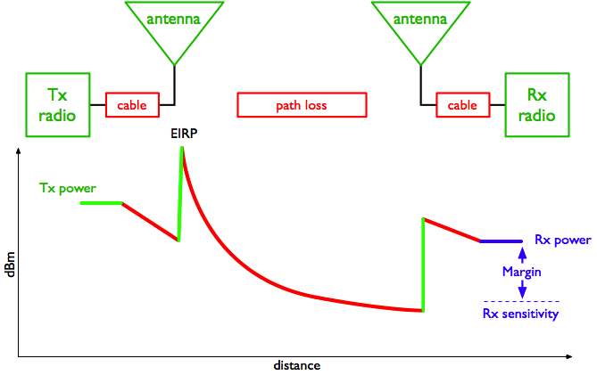
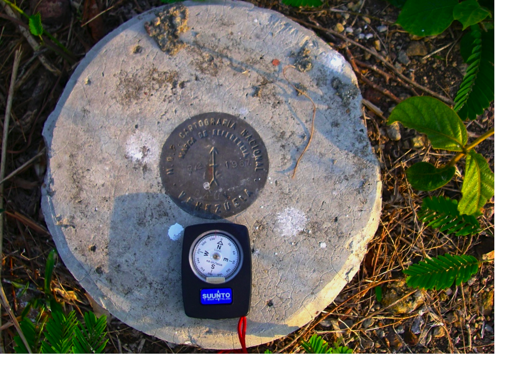
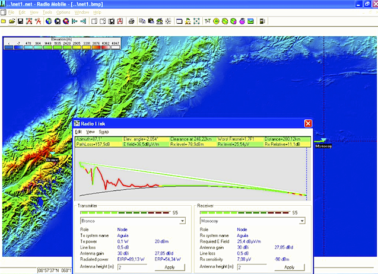
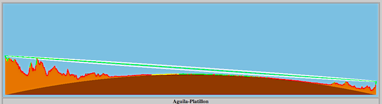
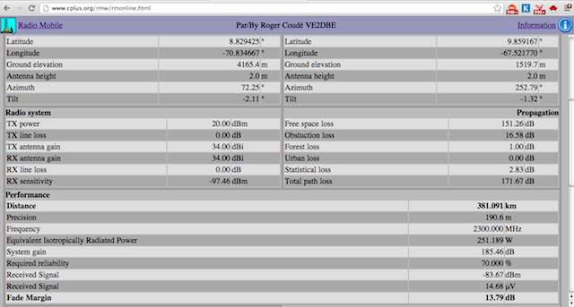

13. OUTDOOR INSTALL
-------------------

 

Although WiFi technology was designed for local area networks, its
impact in developing countries is more dramatic in long-distance
applications.

 

In developed countries, fibre optic cables offering large bandwidths
have been installed satisfying the communication needs of most cities.
The penetration of optical fibre in the developing world is not nearly
as great and nowhere near enough to cover the needs. And the cost of its
expansion often does not meet the ROI (Return on Investment) goals of
telcos within a reasonable period of time. Wireless technologies, on the
other hand, have been much more successful in developing countries and
the potential for increasing the penetration using wireless networks is
enormous.

 

Telcos have installed traditional microwave radio links in most
countries. This is a mature technology that offers high reliability and
availability reaching 99.999%. However, these systems cost many
thousands of dollars and require specially trained personnel for
installation.

 

Satellite systems have proved well suited for broadcast traffic like TV
and certain other applications. However, satellite solutions are still
expensive for bidirectional traffic, while WiFi is quite cost effective
in outdoor point to point networks as well as in typical access networks
where a Base Station (BS) is serving many Clients/CPEs (point to
multipoint). In this chapter we will be concentrating on the outdoor
long- distance point to point links.

 

Two significant hurdles had to be overcome before applying WiFi to long
distance: Power budget limitations and timing limitations. The remaining
limitations for using WiFi over long distances are the requirement for
the existence of radio line of sight between the endpoints and the
vulnerability to interference in the unlicensed band. The first
limitation can often be addressed by taking advantage of the terrain
elevations, or by using towers to overcome obstacles such as the
curvature of the earth and to provide Fresnel zone clearance.

For indoor applications, line of sight is not required since the
stations are very close together and most obstacles can be cleared by
reflections on walls, ceiling, etc. But for long distance applications,
line of sight is absolutely critical. The second limitation is less
pronounced in rural areas and can be alleviated by migrating to the less
crowded 5 GHz band.

The power budget issue can be handled by using high gain antennas and
powerful and highly sensitive radios attached directly to the antenna to
avoid RF cable loss. The timing limitation has to do with the media
access techniques. WiFi uses a random access method to share the
communications medium. This makes it subject to collisions, which cannot
be detected over the air, therefore the transmitter relies on receiving
an acknowledgment for every successfully received frame.

If, after a specified amount of time, called the "ACKtimeout", the
acknowledge frame is not received, the transmitter will resend the
frame.

Since the transmitter will not send a new frame until the ACK for the
previous one has been received, the ACKtimeout must be kept short.

This works well in the original scenario intended for WiFi (indoor
networks), in which the propagation time of 33.3 microseconds per
kilometre is negligible, but breaks down for links over a few
kilometres.

 

Although many WiFi devices do not have provisions for modifying the
ACKtimeout, newer equipment meant for outdoor applications (or third
party firmware like Open WRT) will give you this possibility, often by
means of a distance field in the GUI (Graphical User Interface).

Changing this parameter will allow for a reasonable throughput, which
will anyway decrease proportionally to the distance. The contention
window slot-time also needs to be increased to adapt to longer
distances.

Other manufacturers have chosen to move from random access to Time
Division Multiple Access (TDMA) instead. TDMA divides access to a given
channel into multiple time slots, and assigns these slots to each node
on the network. Each node transmits only in its assigned slot, thereby
avoiding collisions. In a point to point link this provides a great
advantage since ACKs are not needed because each station takes turns at
transmitting and receiving.

While this method is much more efficient, it is not compliant with the
WiFi standard, so several manufacturers offer it as an optional
proprietary protocol, alongside the standard WiFi. WiMAX and proprietary
protocols (such as Mikrotik Nstreme, or Ubiquiti Networks AirMAX) use
TDMA to avoid these ACK timing issues.

The 802.11 standard defines the receiver sensitivity as the received
signal level required to guarantee a BER (Bit Error Rate) below 10−5.

This determines the amount of energy per bit required to overcome the
ambient noise plus the noise generated by the receiver itself. As the
number of bits/second transmitted increases, more receiver power will be
needed to provide the same energy per bit. Therefore the receiver
sensitivity decreases as the transmitter rate increases, so to maintain
the same signal/noise ratio as the distance increases the throughput
diminishes, or, alternatively, for longer distances one should choose
lower data rates to compensate for the reduction of the signal strength
with distance.

### What is needed for a long distance link?

There are four aspects that need to be considered to adapt WiFi devices
to long distance: increase the radio dynamic range; increase the antenna
gain; decrease the antenna cable loss; and make provisions for the the
signal propagation time.

 

 

Figure OI 1: Power in dBm vs distance in a radio link (Power budget).

 

The graph above shows the power level at each point in a wireless link.

The transmitter provides some amount of power.

A small amount is lost in attenuation between the transmitter and the
antenna in the RF cable or waveguide. The antenna then focuses the
power, providing a gain. At this point, the power is at the maximum
possible value for the link. This value is called the EIRP (Equivalent
Isotropic Radiated Power) since it corresponds to the power that a
transmitter would have to emit if the antenna had no gain.

 

Between the transmitting and receiving antennas there are free space and
environmental losses, which increase with the distance between the link
endpoints. The receiving antenna provides some additional gain. Then
there is a small amount of loss between the receiving antenna and the
receiving radio.

 

If the received amount of energy at the far end is greater than the
receive sensitivity of the radio, the link is possible. Increasing the
transmission power can lead to violations of the regulatory framework of
the country.

Increasing the antenna gain is by far the most effective way to improve
range. Make sure that the radio to be employed has connectors for an
external antenna (some devices have an embedded or otherwise non
removable antenna).

 

Decreasing loss in antenna cables is still an important issue, and the
most radical way to attain it is to place the radio outside, directly
attached to the antenna, employing a weatherproof box. Often this lends
to powering the radio using PoE (Power over Ethernet).

 

Improving the receiver sensitivity implies choosing a model with better
performance, or settle for lower transmission speeds where sensitivity
is higher.

 

Although high gain antennas can be expensive, in many countries one can
find satellite antennas that are no longer being used and can be
modified for the WiFi bands.

 

In a perfect world, we would use the highest gain antennas with the
loudest and most sensitive radios possible. But a number of practical
considerations make this impossible. Amplifiers introduce an additional
point of failure, in addition they might violate maximum power permitted
by local regulations and add noise in reception, so they should be
avoided. High power transmitters are available from many manufacturers
that offer up to 1 W of output power which could be used instead of
amplifiers in those countries where this is legal.

 

In general, it is better to use high gain antennas than high transmitter
power. Greater antenna gain will help both in transmission and reception
making a double impact in the link budget. It will also cause less
interference to other users and receive less interference from other
users and limit multipath effects But a high antenna gain implies a very
narrow beamwidth, which means that special alignment techniques are
required.

### Antenna alignment

For short distances, when the corresponding antenna is visible, the
antenna alignment procedure reduces to pointing the antenna in the
direction of the correspondent, both in the horizontal plane (azimuth)
and in the vertical plane (elevation). This should suffice to establish
the connection. Once the connection is attained a fine adjustment can be
made by reading the RSSL (Receiver Signal Strength Level) in the local
radio. This value is provided by the user interface, and can also be
obtained from programs like netstumbler. The procedure consists of
moving the antenna in the horizontal plane in small steps while reading
the RSSL. Do not touch the antenna when reading, since your body will
affect the measurement. Once satisfied that a maximum value is obtained,
the procedure is repeated in the vertical plane, moving the antenna
first up and then down until a maximum value of received power is
obtained, at which point the bolts that secure the antenna are
tightened. This is all that is needed to aim a client device at an
Access Point or Base Station. If you have a point to point link, the
same procedure should be repeated at the other end of the link.

 

For long distances and when the other end of the link is not visible,
some extra steps are required. First, the horizontal direction (bearing)
to aim the antenna must be obtained from the coordinates of the end
points. Then a compass is used to determine the direction in which the
antenna should be aimed.

Keep in mind that in general there is a difference between the magnetic
bearing measured by the compass and the geographical bearing obtained
from the coordinates of the end points or from a map.

This difference is called the magnetic declination, it can be very
significant in some places and must be accounted for to properly aim the
antenna. Fig. OI 2 shows the 10° difference between the magnetic north
shown by the compass and the geographical or true north indicated by the
brass plate.

 

 

Figure OI 2: Difference between Magnetic and Geographical North at El
Baul, Venezuela in 2006.

 

Keep in mind that iron and other magnetic metals will affect the reading
of the compass, so stay away from those when making the measurement. If
the antenna is to be mounted in an steel tower, it might be impossible
to get an accurate reading near it. Instead, one must walk away a
certain distance, use the compass to determine the direction the antenna
must be aimed and then try to locate some easily recognisable object
that can be used as a reference for pointing the antenna at later. Since
the beamwidth of a highly directive antenna might be just a few degrees,
after pointing with the compass we need to do some fine adjustment for
the proper aiming of the antenna by measuring the strength of the
received signal.

Unfortunately the RSSL indicated by the radio software will only work
after a proper packet has been satisfactorily received and decoded, and
this will only happen when the antenna is well aimed.

So we need an instrument that can reveal the strength of the received
signal independently from the modulation that it might have.

The instrument needed for this task is the Spectrum Analyser.

There are a great variety of spectrum analysers on the market, some of
them costing thousands of dollars, but if we are only interested in the
WiFi bands we can make do with some inexpensive solutions like the
following:

 

"RF Explorer" offers inexpensive devices for several frequency bands.

The "RF Explorer model 2.4G" costs 120\$ from

[http://www.seeedstudio.com/depot](http://www.seeedstudio.com/depot/-p-924.html?cPath=174)[/-](http://www.seeedstudio.com/depot/-p-924.html?cPath=174)[p](http://www.seeedstudio.com/depot/-p-924.html?cPath=174)[-](http://www.seeedstudio.com/depot/-p-924.html?cPath=174)[924.htm](http://www.seeedstudio.com/depot/-p-924.html?cPath=174)[l](http://www.seeedstudio.com/depot/-p-924.html?cPath=174)[?](http://www.seeedstudio.com/depot/-p-924.html?cPath=174)[cPath=174](http://www.seeedstudio.com/depot/-p-924.html?cPath=174)

and is a stand alone unit that can measure signals from 2.4 to 2.485
GHz, with a sensitivity of -105 dBm. It has an SMA connector for the
antenna and therefore is well suited for antenna alignment.

 

"WiSpy" is a spectrum analyser in a USB dongle that attaches to a
laptop. You will need the models with SMA RP connector, there is one for
2.4 GHz moderately priced and another one that covers both the 2.4 and
the 5 GHz bands sold for 600\$ at
[www.metageek.net.](http://www.metageek.net/)

 

"Ubiquiti Networks" ,
[www.ubnt.com,](http://www.ubnt.com/)used to
sell USB dongle spectrum analysers for 2.4 GHz at 70\$.

 

Unfortunately they seem to have discontinued this product after
incorporating the spectrum analyser capability in their M series radios.

So when using these radios you can take advantage of their "airView"
alignment tool. In principle one of these inexpensive radios like the
"Bullet M" which comes with a N Male connector can also be used to align
antennas for other radios in both the 2.4 and 5 GHz bands.

Unfortunately the digitally modulated signal transmitted by WiFi radios
is not well suited for antenna alignment, since its power is spread over
the 20 MHz bandwidth. For antenna alignment a single frequency with a
stable output power is required.

This type of signal is produced by a microwave signal generator, but
they are quite expensive.

The "RF Explorer model 2.4G" incorporates a 2.4 GHz signal generator,
but the maximum output power of 1 dBm is not well suited for long
distance antenna pointing.Instead, we have repurposed devices called
"video senders", meant for transmitting video signals, which act as
powerful microwave single frequency signal sources when no modulation is
applied.

They are available for both the 2.4 GHz and the 5 GHz bands with output
power up to 33 dBm. For our purposes it is necessary to buy a model with
an antenna connector, so that we can attach our own antenna.

There are many vendors to choose from, see for instance:
[http://www.lightinthebox.com/Popular/Wifi\_Video\_Transmitter.html](http://www.lightinthebox.com/Popular/Wifi_Video_Transmitter.html)

 

As an example of long distance link using modified WiFi devices, we can
mention an experiment performed in April 2005 in Venezuela between Pico
del Aguila (8.83274638° N, 70.83074570°W,4100 m elevation) and El Baul
(8.957667° N, 68.297528° W, 155 m elevation).

 

Using the Radio Mobile software, we find that the distance to El Baul is
280 km, the azimuth is 97°, the antenna elevation angle is -2.0°, and
the place at which the beam is closest to the ground happens at 246 km,
where it clears 1.7 times the first Fresnel zone at the 2.412 GHz
frequency.

 

Fig. OI 3 shows the output of the program:

 

 

Figure OI 3: Profile of a 280 km path over which standard WiFi gear with
OpenWRT firmware which allows for the ACKtimeout increase was used to
transfer files at about 65 kb/s in April 2006 between Pico del Aguila
and El Baul in Venezuela.

 

Notice that the earth curvature is quite apparent, and was overcome
because one of the stations was at 4100 m altitude and the other at

155 m. Frequency was 2412 MHz, output power 100 mW, antenna gain around
30 dBi. Streaming video was successfully transmitted despite the limited
bandwidth.

 

A year later the experiment was repeated with the same WiFi gear but
with commercial 32 dBi antennas at both ends and similar results were
obtained. Then, another type of firmware developed by the TIER group at
UC Berkeley University that implements TDD (Time Division Duplexing) was
tried which showed a remarkable bidirectional throughput of 6 Mbit/s
with standard 802.11b hardware.

Moving the remote site to a 1400 m high hill called Platillon
(9.88905350°N, 67.50552400°W), provided a 380 km testbed over which the
experiment was again successfully repeated as described in the Case
Studies section in this book.

This can be illustrated by using an on-line version of Radio Mobile,
available at
[http://www.cplus.org/rmw/rmonline.htm](http://www.cplus.org/rmw/rmonline.html)l,
which is simpler to use, although it has some limitation as compared
with the downloadable version. One must register in the site, enter the
coordinates of the points over which the radio link has to be
established, the power values for the radios and the antennas gains and
height, and the software will fetch the relevant elevation data required
to perform the simulation of the link.

Keep in mind that only radio amateurs frequency are supported in the web
version, so 2.3 GHz should be used instead of 2.4 GHZ, but the results
are close enough and where validated by the experiment on the field.

 

In Figure OI 4 we show the output of the Radio Mobile on- line for this
experiment that can be replicated by the reader as an exercise.

 

 

Figure OI 4: Profile of a 380 km test at 2.4 GHz performed in April and
August 2007, Venezuela.

 

Notice that the earth curvature is even more noticeable over the 380 km
path, but the height of the end points combined with flat land in
between allows for ample clearance of the first Fresnel zone.

 

Figure OI 5 shows the numerical values of the Radio Mobile on-line
simulation:

 

 

Figure OI 5: Results of the Radio Mobile on-line simulation for the 380
km link between Aguila and Platillon.
