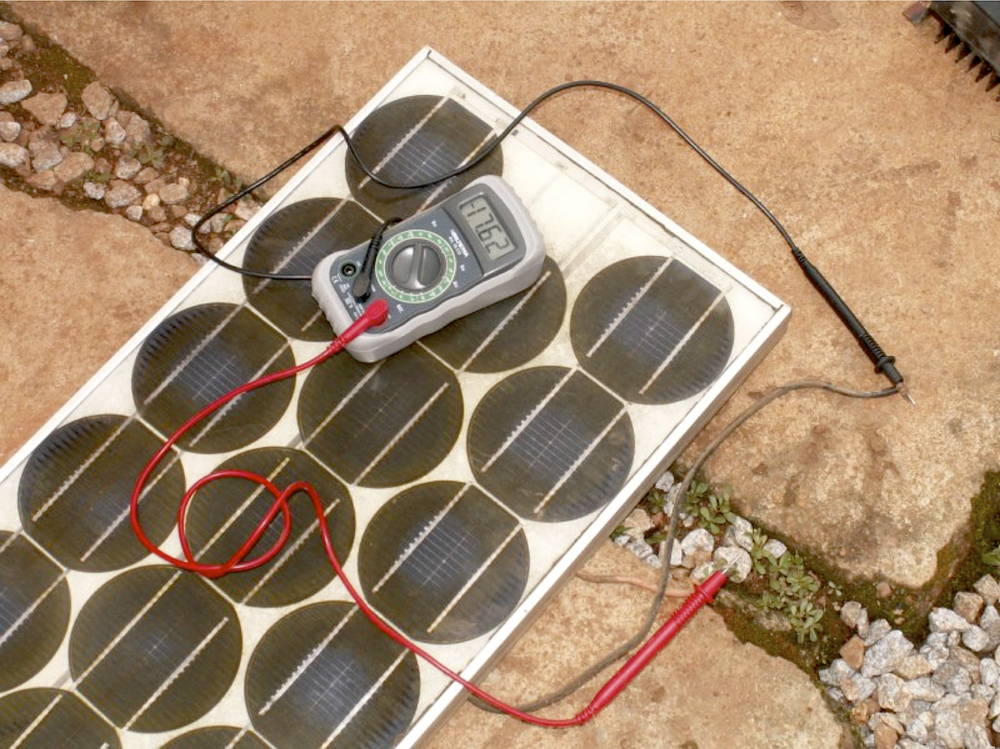
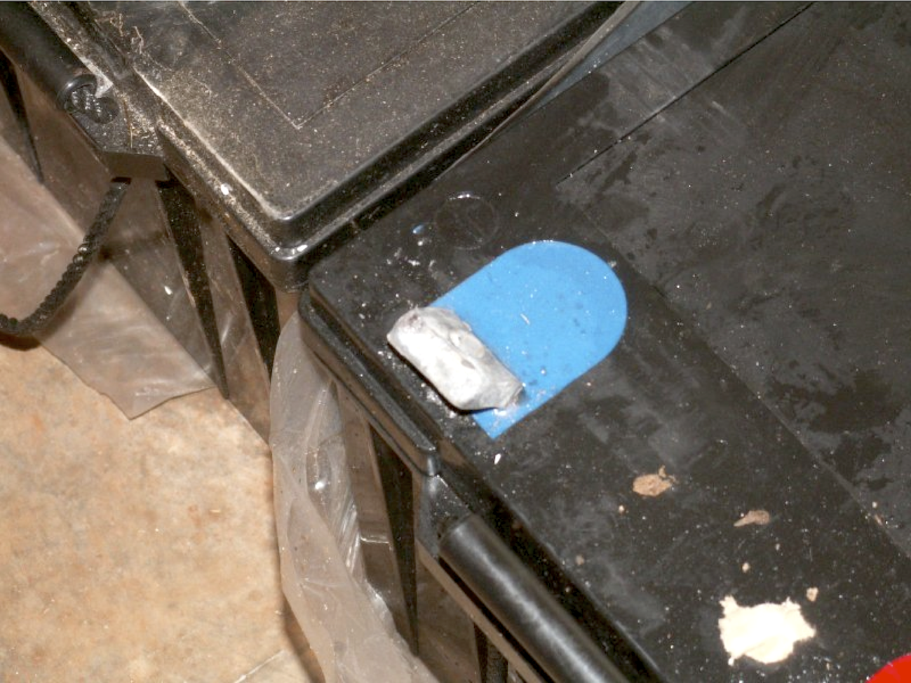
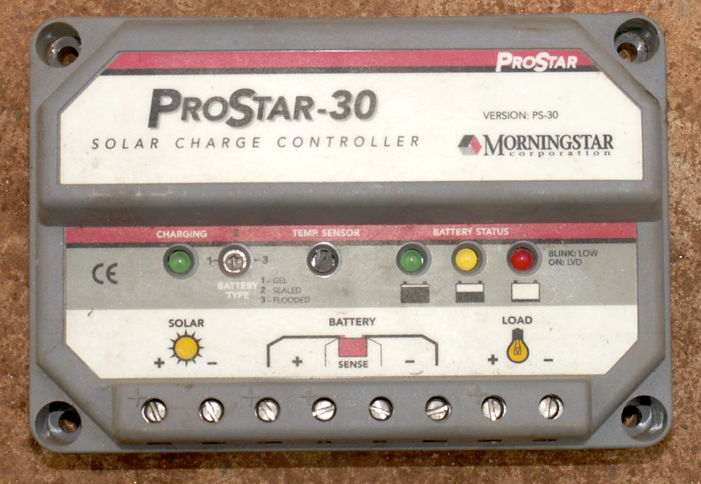
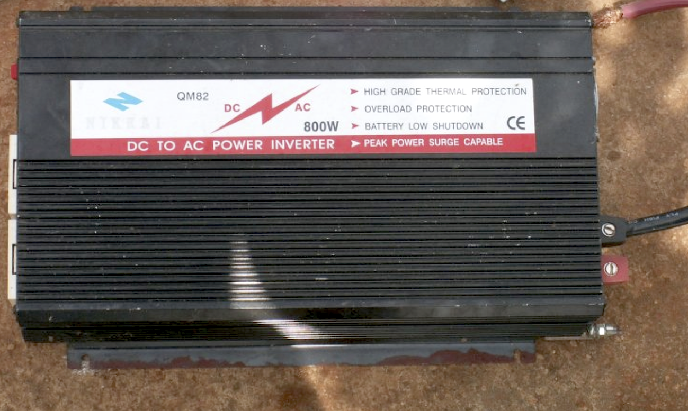
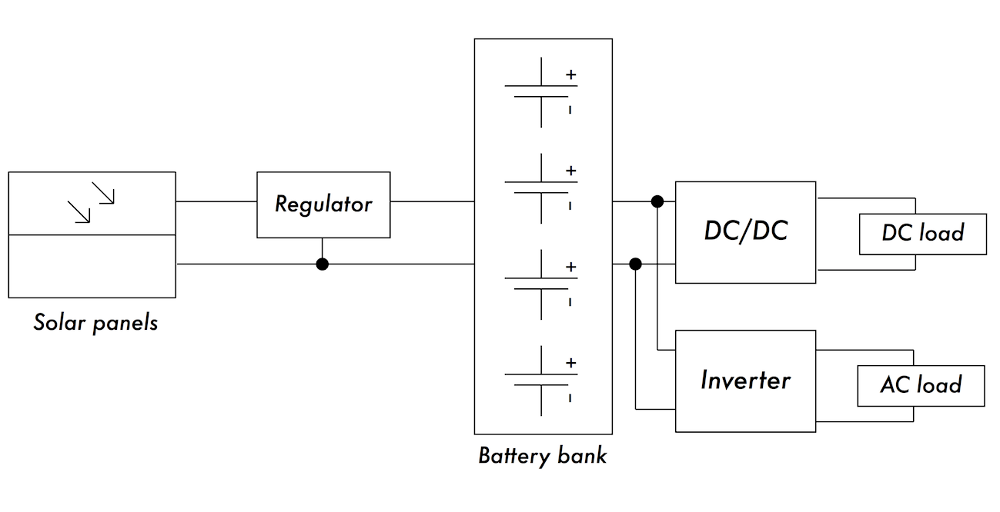
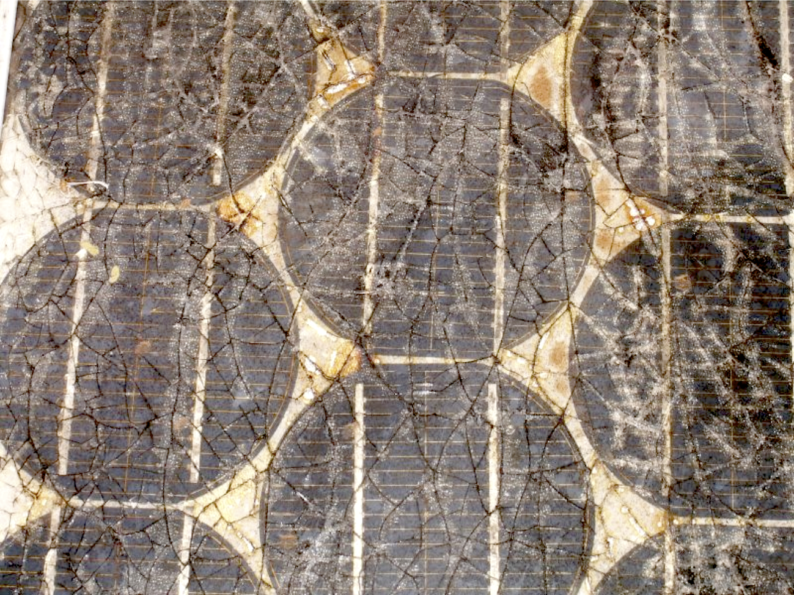
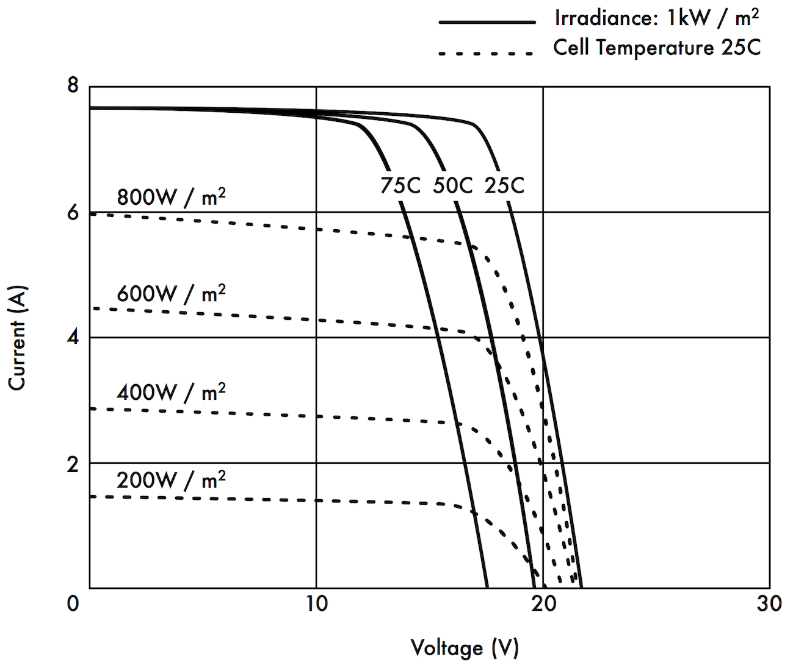
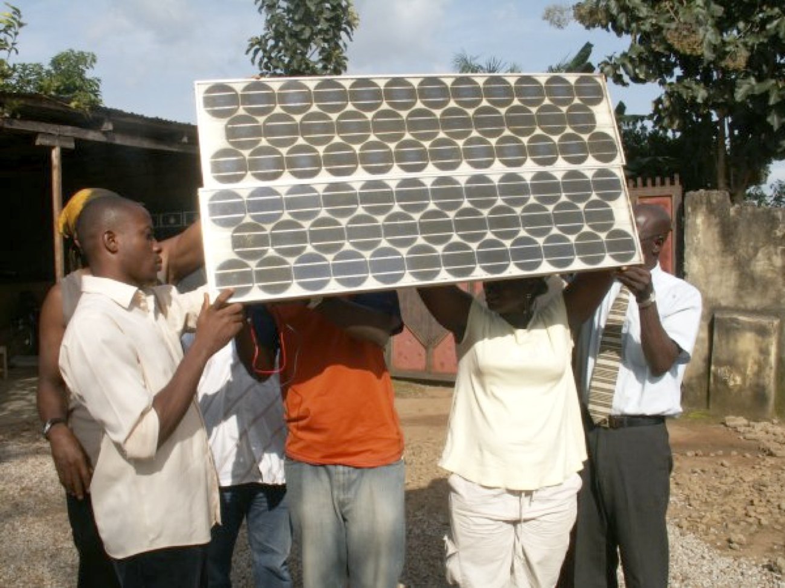
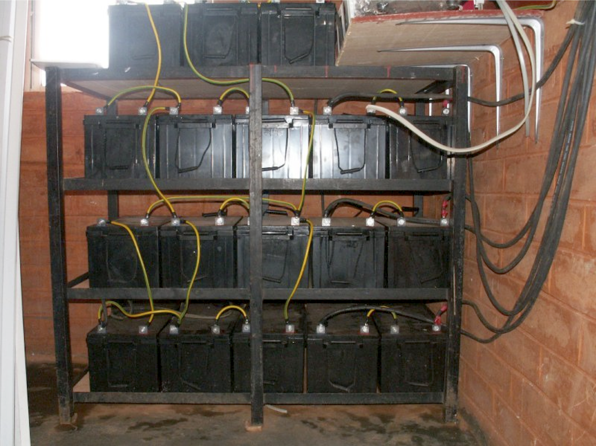

14. OFF-GRID POWER
------------------

### Solar Power

This chapter provides an introduction to standalone photovoltaic
systems. Standalone systems work without connection to an established
power grid. This chapter presents the basic concepts of the generation
and storage of photovoltaic solar energy. We will also provide a method
for designing a solar system with limited access to information and
resources. This chapter only discusses solar systems for the direct
production of electricity (photovoltaic solar energy). Thermal solar
energy systems are beyond the scope of this chapter.

#### Solar Energy

A photovoltaic system is based on the ability of photovoltaic panels to
convert sun radiation directly into electrical energy. The total amount
of solar energy that lights a given area is known as irradiance (G) and
it is measured in watts per square metre (W/m2). The instantaneous
values are normally averaged over a period of time, so it is common to
talk about total irradiance per hour, day or month. The amount of
irradiance that arrives at the surface of the Earth varies due to
natural weather variations and depends on the location. Therefore it is
necessary to work with statistical data based on the "solar history" of
a particular place. For many areas it can be difficult to acquire
detailed information, so we will need to work with approximate values in
this case.

A few organisations produce maps that include average values of daily
global irradiation for different regions. These values are known as peak
sun hours or PSHs. You can use the PSH value for your region to simplify
your calculations. One unit of "peak sun hours" corresponds to a
radiation of 1000 Watts per square metre for the duration of an hour. If
an area has 4 PSH per day in the worst of the months, it means we can
expect a daily irradiation of 4000 Wh/m2. Low resolution PSH
maps/calculation tools are available from a number of online sources
such as: http://www.wunderground.com/calculators/solar.html

For more detailed information, consult a local solar energy vendor or
weather station.

Airports normally record meteorological data including insolation.

#### What about wind power?

It is possible to use a wind generator in place of solar panels when an
autonomous system is being designed for installation on a hill or
mountain. To be effective, the average wind speed over the year should
be at least 3 to 4 metres per second, and the wind generator should be 6
metres higher than other objects within a distance of 100 metres.

A location far away from the coast usually lacks sufficient wind energy
to support a wind powered system.

Generally speaking, photovoltaic systems are more reliable than wind
generators, as sunlight is more available than consistent wind in most
places. On the other hand, wind generators are able to charge batteries
even at night, as long as there is sufficient wind. It is of course
possible to use wind in conjunction with solar power to help cover times
when there is extended cloud cover, or when there is insufficient wind.
In the Highlands and Islands of Scotland there is a project that uses
both solar and wind power generation. See the following link for more
information:
[http://www.wirelesswhitespace.org/projects/wind](http://www.wirelesswhitespace.org/projects/wind-fi-renewable-energy-basestation.aspx)-firenewable-energy-[basestation.aspx](http://www.wirelesswhitespace.org/projects/wind-fi-renewable-energy-basestation.aspx)

For most locations however, the cost of a good wind generator is not
justified by the meagre amount of power it will add to the overall
system. This chapter will therefore focus on the use of solar panels for
generating electricity.

### Photovoltaic system components

A basic photovoltaic system consists of four main components: solar
panel, battery, regulator, and load.

The panel is generating electricity. The battery stores electrical
energy. The regulator protects the battery against excessive charge and
discharge. The load refers to any device that requires electrical power.
It is important to remember that solar panels and batteries produce
direct current (DC). If the range of operational voltage of your
equipment does not fit the voltage supplied by your battery, it will
also be necessary to include some type of converter. If the equipment
that you want to power uses a different DC voltage than the one supplied
by the battery, you will need to use a DC/DC converter. If some of your
equipment requires AC power, you will need to use a DC/AC converter,
also known as an inverter. Every electrical system should also
incorporate various safety devices in the event that something goes
wrong.

These devices include proper wiring, circuit breakers, surge protectors,
fuses, ground rods, lighting arrestors, etc.

#### The solar panel

The solar panel is composed of solar cells that collect solar radiation
and transform it into electrical energy. This part of the system is
sometimes referred to as a solar module or photovoltaic generator.

Solar panel arrays can be made by connecting a set of panels in series
and/or parallel in order to provide the necessary energy for a given
load. The electrical current supplied by a solar panel varies
proportionally to the solar radiation. This will vary according to
climatic conditions, the hour of the day, and the time of the year.

 

Figure OGP 1: A solar panel

 

Several technologies are used in the manufacture of solar cells.

The most common is crystalline silicon, and can be either
monocrystalline or polycrystalline. Amorphous silicon can be cheaper but
is less efficient at converting solar energy to electricity.  With a
reduced life expectancy and a 6 to 8% transformation efficiency,
amorphous silicon is typically used for low power equipment, such as
portable calculators.

New solar technologies, such as silicon ribbon and thin film
photovoltaics, are currently under development. These technologies
promise higher efficiencies but are not yet widely available.

#### The battery

The battery stores the energy produced by the panels that is not
immediately consumed by the load. This stored energy can then be used
during periods of low solar irradiation. The battery component is also
sometimes called the accumulator. Batteries store electricity in the
form of chemical energy. The most common type of batteries used in solar
applications are maintenance-free lead-acid batteries, also called
recombinant or VRLA (valve regulated lead acid) batteries.

 

 

Figure OGP 2: A 200 Ah lead-acid battery. The negative terminal was
broken due to weight on the terminals during transportation.

 

Aside from storing energy, sealed lead-acid batteries also serve two
important functions:

-   They are able to provide an instantaneous power superior to that of
    the array of panels. This instantaneous power is needed to start
    some appliances, such as the motor of a refrigerator or a pump. 

-   They determine the operating voltage of your installation. 

For a small power installation and where space constraints are
important, other types of batteries (such as NiCd, NiMh, or Li-ion) can
be used.

These types of batteries need a specialised charger/regulator and cannot
directly replace lead-acid batteries.

#### The regulator

The regulator (or more formally, the solar power charge regulator)
assures that the battery is working in appropriate conditions. It avoids
overcharging or overdischarging the battery, both of which are very
detrimental to the life of the battery. To ensure proper charging and
discharging of the battery, the regulator maintains knowledge of the
state of charge (SoC) of the battery. The SoC is estimated based on the
actual voltage of the battery.

By measuring the battery voltage and being programmed with the type of
storage technology used by the battery, the regulator will know the
precise points where the battery would be overcharged or excessively
discharged.

 

Figure OGP 3: A 30 Amp solar charge controller

 

The regulator can include other features that add valuable information
and security control to the equipment. These features include ammeters,
voltmeters, measurement of ampere-hour, timers, alarms, etc. While
convenient, none of these features are required for a working
photovoltaic system.

#### The converter

The electricity provided by the panel array and battery is DC at a fixed
voltage. The voltage provided might not match what is required by your
load. A direct/alternating (DC/AC) converter, also known as inverter,
converts the DC current from your batteries into AC. This comes at the
price of losing some energy during the conversion. If necessary, you can
also use converters to obtain DC at voltage level other than what is
supplied by the batteries. DC/DC converters also lose some energy during
the conversion. For optimal operation, you should design your
solar-powered system so that the generated DC voltage matches the load.

 

 

Figure OGP 4: An 800 Watt DC/AC converter (power inverter)

#### The load

The load is the equipment that consumes the power generated by your
energy system.

The load may include wireless communications equipment, routers,
workstations, lamps, TV sets, VSAT modems, etc.

Although it is not possible to precisely calculate the exact total
consumption of your equipment, it is vital to be able to make a good
estimate.

In this type of system it is absolutely necessary to use efficient and
low power equipment to avoid wasting energy.

#### Putting it all together

The complete photovoltaic system incorporates all of these components.
The solar panels generate power when solar energy is available.

The regulator ensures the most efficient operation of the panels and
prevents damage to the batteries. The battery bank stores collected
energy for later use.

Converters and inverters adapt the stored energy to match the
requirements of your load. Finally, the load consumes the stored energy
to do work.

 

When all of the components are in balance and are properly maintained,
the system will support itself for years.

 

 

Figure OGP 5: A solar installation with DC and AC loads

 

We will now examine each of the individual components of the

photovoltaic system in greater detail.

### The solar panel

An individual solar panel is made of many solar cells.

The cells are electrically connected to provide a particular value of
current and voltage.

The individual cells are properly encapsulated to provide isolation and
protection from humidity and corrosion.

 

Figure OGP 6: The effect of water and corrosion in a solar panel

 

There are different types of modules available on the market, depending
on the power demands of your application. The most common modules are
composed of 32 or 36 solar cells of crystalline silicon. These cells are
all of equal size, wired in series, and encapsulated between glass and
plastic material, using a polymer resin (EVA) as a thermal insulator.

The surface area of the module is typically between 0.1 and 0.5 m2.
Solar panels usually have two electrical contacts, one positive and one
negative.

Some panels also include extra contacts to allow the installation of
bypass diodes across individual cells.

Bypass diodes protect the panel against a phenomenon known as
“hot-spots”. A hot-spot occurs when some of the cells are in shadow
while the rest of the panel is in full sun. Rather than producing
energy, shaded cells behave as a load that dissipates energy. In this
situation, shaded cells can see a significant increase in temperature
(about 85 to 100ºC.)

Bypass diodes will prevent hot-spots on shaded cells, but reduce the
maximum voltage of the panel. They should only be used when shading is
unavoidable. It is a much better solution to expose the entire panel to
full sun whenever possible.

 

Figure OGP 7: Different IV Curves. The current (A) changes with the
irradiance, and the voltage (V) changes with the temperature.

 

The electrical performance of a solar module is represented by the IV
characteristic curve, which represents the current that is provided
based on the voltage generated for a certain solar radiation.

 

The curve represents all the possible values of voltage-current.

The curves depend on two main factors: the temperature and the solar
radiation received by the cells.

For a given solar cell area, the current generated is directly
proportional to solar irradiance (G), while the voltage reduces slightly
with an increase of temperature.

 

A good regulator will try to maximise the amount of energy that a panel
provides by tracking the point that provides maximum power (V x I). The
maximum power corresponds to the knee of the IV curve.

#### Solar Panel Parameters

The main parameters that characterise a photovoltaic panel are:

 

1.  1.  1.  1.Short Circuit Current (ISC): the maximum current provided
            by the panel when the connectors are short circuited. 

        2.  2.Open Circuit Voltage (VOC): the maximum voltage that the
            panel provides when the terminals are not connected to any
            load (an open circuit). This value is normally 22 V for
            panels that are going to work in 12 V systems, and is
            directly proportional to the number of cells connected in
            series. 

        3.  3.Maximum Power Point (Pmax): the point where the power
            supplied by the panel is at maximum, where Pmax = Imax x
            Vmax. 

 

The maximum power point of a panel is measured in Watts (W) or peak
Watts (Wp). It is important not to forget that in normal conditions the
panel will not work at peak conditions, as the voltage of operation is
fixed by the load or the regulator. Typical values of Vmax and Imax
should be a bit smaller than the ISC and VOC.

 

1.  1.  1.  1.Fill Factor (FF): the relation between the maximum power
            that the panel can actually provide and the product ISC .
            VOC. This gives you an idea of the quality of the panel
            because it is an indication of the type of IV characteristic
            curve. The closer FF is to 1, the more power a panel can
            provide. Common values usually are between 0.7 and 0.8. 

        2.  2.Efficiency (η): the ratio between the maximum electrical
            power that the panel can give to the load and the power of
            the solar radiation (pl) incident on the panel. This is
            normally around 10-12%, depending on the type of cells
            (monocrystalline, polycrystalline, amorphous or thin film). 

 

Considering the definitions of point of maximum power and the fill
factor we see that:

η = Pmax / PL = FF . ISC . VOC / PL

 

The values of ISC, VOC, IPmax and VPmax are provided by the manufacturer
and refer to standard conditions of measurement with irradiance G = 1000
W/m2, at sea-level, for a temperature of cells of Tc = 25ºC.

 

The panel parameter values change for other conditions of irradiance and
temperature. Manufacturers will sometimes include graphs or tables with
values for conditions different from the standard. You should check the
performance values at the panel temperatures that are likely to match
your particular installation.

Be aware that two panels can have the same Wp but very different
behaviour in different operating conditions. When acquiring a panel, it
is important to verify, if possible, that their parameters (at least,
ISC and VOC) match the values promised by the manufacturer.

#### Panel parameters for system sizing

To calculate the number of panels required to cover a given load, you
just need to know the current and voltage at the point of maximum power:
IPmax and VPmax.

You should always be aware that the panel is not going to perform under
perfect conditions as the load or regulation system is not always going
to work at the point of maximum power of the panel. You should assume a
loss of efficiency of 5% in your calculations to compensate for this.

#### Interconnection of panels

A solar panel array is a collection of solar panels that are
electrically interconnected and installed on some type of support
structure. Using a solar panel array allows you to generate greater
voltage and current than is possible with a single solar panel. The
panels are interconnected in such a way that the voltage generated is
close to (but greater than) the level of voltage of the batteries, and
that the current generated is sufficient to feed the equipment and to
charge the batteries.

 

Connecting solar panels in series increases the generated voltage.
Connecting panels in parallel increases the current.

The number of panels used should be increased until the amount of power
generated slightly exceeds the demands of your load.

 

It is very important that all of the panels in your array are as
identical as possible. In an array, you should use panels of the same
brand and characteristics because any difference in their operating
conditions will have a big impact on the health and performance of your
system.

 

Even panels that have identical performance ratings will usually display
some variance in their characteristics due to manufacturing processes.

 

The actual operating characteristics of two panels from the same
manufacturer can vary by as much as ±10%.

Whenever possible, it is a good idea to test the real-world performance
of individual panels to verify their operating characteristics before
assembling them into an array.

 

 

Figure OGP 8: Interconnection of panels in parallel. The voltage remains
constant while the current duplicates. (Photo: Fantsuam Foundation,
Nigeria)

#### How to choose a good panel

One obvious metric to use when shopping for solar panels is to compare
the ratio of the nominal peak power (Wp) to the price. This will give
you a rough idea of the cost per Watt for different panels. But there
are a number of other considerations to keep in mind as well.

If you are going to install solar panels in geographical areas where
soiling (from dust, sand, or grit) will likely be a problem, consider
purchasing panels with a low affinity for soil retention.

These panels are made of materials that increase the likelihood that the
panel will be automatically cleaned by wind and rain.

Always check the mechanical construction of each panel. Verify that the
glass is hardened and the aluminum frame is robust and well built. The
solar cells inside the panel can last for more than 20 years, but they
are very fragile and the panel must protect them from mechanical
hazards. Look for the manufacturer's quality guarantee in terms of
expected power output and mechanical construction.

 

Finally, be sure that the manufacturer provides not only the nominal
peak power of the panel (Wp) but also the variation of the power with
irradiation and temperature. This is particularly important when panels
are used in arrays, as variations in the operating parameters can have a
big impact on the quality of power generated and the useful lifetime of
the panels.

### The battery

The battery “hosts” a certain reversible chemical reaction that stores
electrical energy that can later be retrieved when needed. Electrical
energy is transformed into chemical energy when the battery is being
charged, and the reverse happens when the battery is discharged. A
battery is formed by a set of elements or cells arranged in series.
Lead-acid batteries consist of two submerged lead electrodes in an
electrolytic solution of water and sulphuric acid. A potential
difference of about 2 volts takes place between the electrodes,
depending on the instantaneous value of the charge state of the battery.

The most common batteries in photovoltaic solar applications have a
nominal voltage of 12 or 24 volts. A 12 V battery therefore contains 6
cells in series.

The battery serves two important purposes in a photovoltaic system: to
provide electrical energy to the system when energy is not supplied by
the array of solar panels, and to store excess energy generated by the
panels whenever that energy exceeds the load. The battery experiences a
cyclical process of charging and discharging, depending on the presence
or absence of sunlight.

During the hours that there is sun, the array of panels produces
electrical energy. The energy that is not consumed immediately is used
to charge the battery.

During the hours of absence of sun, any demand of electrical energy is
supplied by the battery, thereby discharging it.

These cycles of charge and discharge occur whenever the energy produced
by the panels does not match the energy required to support the load.
When there is sufficient sun and the load is light, the batteries will
charge.

 

Obviously, the batteries will discharge at night whenever any amount of
power is required. The batteries will also discharge when the irradiance
is insufficient to cover the requirements of the load (due to the
natural variation of climatological conditions, clouds, dust, etc.)

 

If the battery does not store enough energy to meet the demand during
periods without sun, the system will be exhausted and will be
unavailable for consumption. On the other hand, oversizing the system
(by adding far too many panels and batteries) is expensive and
inefficient. When designing a stand-alone system we need to reach a
compromise between the cost of components and the availability of power
from the system.

 

One way to do this is to estimate the required number of days of
autonomy. In the case of a telecommunications system, the number of days
of autonomy depends on its critical function within your network design.
If the equipment is going to serve as a repeater and is part of the
backbone of your network, you will likely want to design your
photovoltaic system with an autonomy of up to 5-7 days.

On the other hand, if the solar system is responsible for a providing
energy to client equipment you can probably reduce number of days of
autonomy to two or three. In areas with low irradiance, this value may
need to be increased even more. In any case, you will always have to
find the proper balance between cost and reliability.

#### Types of batteries

Many different battery technologies exist, and are intended for use in a
variety of different applications. The most suitable type for
photovoltaic applications is the stationary battery, designed to have a
fixed location and for scenarios where the power consumption is more or
less irregular. "Stationary" batteries can accommodate deep discharge
cycles, but they are not designed to produce high currents in brief
periods of time.

Stationary batteries can use an electrolyte that is alkaline (such as
Nickel-Cadmium) or acidic (such as Lead-Acid).

Stationary batteries based on Nickel-Cadmium are recommended for their
high reliability and resistance whenever possible. Unfortunately, they
tend to be much more expensive and difficult to obtain than sealed
lead-acid batteries. In many cases when it is difficult to find local,
good and cheap stationary batteries (importing batteries is not cheap),
you will be forced to use batteries targeted to the automobile market.

#### Using car batteries

Automobile batteries are not well suited for photovoltaic applications
as they are designed to provide a substantial current for just few
seconds (when starting then engine) rather than sustaining a low current
for long period of time. This design characteristic of car batteries
(also called traction batteries) results in a shortened effective life
when used in photovoltaic systems. Traction batteries can be used in
small applications where low cost is the most important consideration,
or when other batteries are not available.

 

Traction batteries are designed for vehicles and electric wheelbarrows.
They are cheaper than stationary batteries and can serve in a
photovoltaic installation, although they require very frequent
maintenance. These batteries should never be deeply discharged, because
doing so will greatly reduce their ability to hold a charge. A truck
battery should not be discharged to more than 70% of its total capacity.
This means that you can only use a maximum of 30% of a lead-acid
battery's nominal capacity before it must be recharged.

You can extend the life of a lead-acid battery by using distilled water.
By using a densimeter or hydrometer, you can measure the density of the
battery's electrolyte. A typical battery has specific gravity of 1.28.

Adding distilled water and lowering the density to 1.2 can help reduce
the anode's corrosion, at a cost of reducing the overall capacity of the
battery. If you adjust the density of battery electrolyte, you must use
distilled water, as tap water or well water will permanently damage the
battery.

#### States of charge

There are two special states of charge that can take place during the
cyclic charge and discharge of the battery. They should both be avoided
in order to preserve the useful life of the battery.

 

1.  ​1. Overcharge

Overcharge takes place when the battery arrives at the limit of its
capacity. If energy is applied to a battery beyond its point of maximum
charge, the electrolyte begins to break down.

 

This produces bubbles of oxygen and hydrogen, in a process is known as
gasification. This results in a loss of water, oxidation on the positive
electrode, and in extreme cases, a danger of explosion.

On the other hand, the presence of gas avoids the stratification of the
acid. After several continuous cycles of charge and discharge, the acid
tends to concentrate itself at the bottom of the battery thereby
reducing the effective capacity. The process of gasification agitates
the electrolyte and avoids stratification.

 

Again, it is necessary to find a compromise between the advantages
(avoiding electrolyte stratification) and the disadvantages (losing
water and production of hydrogen). One solution is to allow a slight
overcharge condition every so often. One typical method is to allow a
voltage of 2.35 to 2.4 Volts for each element of the battery every few
days, at 25ºC. The regulator should ensure a periodic and controlled
overcharges.

 

1.  ​2. Overdischarge

In the same way that there is a upper limit, there is also a lower limit
to a battery's state of charge. Discharging beyond that limit will
result in deterioration of the battery. When the effective battery
supply is exhausted, the regulator prevents any more energy from being
extracted from the battery. When the voltage of the battery reaches the
minimum limit of 1.85 Volts per cell at 25°C, the regulator disconnects
the load from the battery.

 

If the discharge of the battery is very deep and the battery remains
discharged for a long time, three effects take place: the formation of
crystallised sulphate on the battery plates, the loosening of the active
material on the battery plate, and plate buckling. The process of
forming stable sulphate crystals is called hard sulphation. This is
particularly negative as it generates big crystals that do not take part
in any chemical reaction and can make your battery unusable.

#### Battery Parameters

The main parameters that characterise a battery are:

 

        Nominal Voltage, VNBat: the most common value being 12 V.

 

        Nominal Capacity, CNBat: the maximum amount of energy that can
be extracted from a fully charged battery. It is expressed in
Ampere-hours (Ah) or Watt-hours (Wh).

The amount of energy that can be obtained from a battery depends on the
time in which the extraction process takes place. Discharging a battery
over a long period will yield more energy compared to discharging the
same battery over a short period. The capacity of a battery is therefore
specified at different discharging times. For photovoltaic applications,
this time should be longer than 100 hours (C100).

 

        Maximum Depth of Discharge, DoDmax: The depth of discharge is
the amount of energy extracted from a battery in a single

discharge cycle, expressed as a percentage. The life expectancy of a
battery depends on how deeply it is discharged in each cycle. The
manufacturer should provide graphs that relate the number of
charge-discharge cycles to the life of the battery. As a general rule
you should avoid discharging a deep cycle battery beyond 50%. Traction
batteries should only be discharged by as little as 30%.

 

        Useful Capacity, CUBat: It is the real (as in usable) capacity
of a battery. It is equal to the product of the nominal capacity and the
maximum DoD. For example, a stationary battery of nominal capacity
(C100) of 120 Ah and depth of discharge of 70% has a useful capacity of
(120 x 0.7) = 84 Ah.

#### Measuring the state of charge of the battery

A sealed lead-acid battery of 12 V provides different voltages depending
on its state of charge. When the battery is fully charged in an open
circuit, the output voltage is about 12.8 V.

The output voltage lowers quickly to 12.6 V when loads are attached. As
the battery is providing constant current during operation, the battery
voltage reduces linearly from 12.6 to 11.6 V depending on the state of
charge.

A sealed lead- acid batteries provides 95% of its energy within this
voltage range. If we make the broad assumption that a fully loaded
battery has a voltage of 12.6 V when "full" and 11.6 V when "empty", we
can estimate that a battery has discharged 70% when it reaches a voltage
of 11.9 V.

 

These values are only a rough approximation since they depend on the
life and quality of the battery, the temperature, etc.

 

State of Charge

12V Battery Voltage

Volts per Cell

100%

12.7

2.12

90%

12.5

2.08

80%

12.42

2.07

70%

12.32

2.05

60%

12.2

2.03

50%

12.06

2.01

40%

11.9

1.98

30%

11.75

1.96

20%

11.58

1.93

10%

11.31

1.89

 

According to this table, and considering that a truck battery should not
be discharged more than 20% to 30%, we can determine that the useful
capacity of a 170 Ah truck battery is 34 Ah (20%) to 51 Ah (30%). Using
the same table, we find that we should program the regulator to prevent
the battery from discharging below 12.3 V.

#### Battery and regulator protection

Thermomagnetic circuit breakers or one time fuses must be used to
protect the batteries and the installation from short circuit and
malfunctions. There are two types of fuses: slow blow, and quick blow.
Slow blow fuses should be used with inductive or capacitive loads where
a high current can occur at power up. Slow blow fuses will allow a
higher current than their rating to pass for a short time. Quick blow
fuses will immediately blow if the current flowing through them is
higher than their rating.

 

The regulator is connected to the battery and the loads, so two
different kinds of protection need to be considered. One fuse should be
placed between the battery and the regulator, to protect the battery
from short-circuit in case of regulator failure. A second fuse is needed
to protect the regulator from excessive load current.

This second fuse is normally integrated into the regulator itself.

 

 

Figure OGP 9: A battery bank of 3600 Ah, currents reach levels of 45 A
during charging

 

Every fuse is rated with a maximum current and a maximum usable voltage.
The maximum current of the fuse should be 20% bigger than the maximum
current expected. Even if the batteries carry a low voltage, a short
circuit can lead to a very high current which can easily reach several
hundred amperes.

Large currents can cause fire, damage the equipment and batteries, and
possibly cause electric shock to a human body. If a fuse breaks, never
replace a fuse with a wire or a higher rated fuse. First determine the
cause of the problem, then replace the fuse with another one which has
the same characteristics.

### Temperature effects

The ambient temperature has several important effects on the
characteristics of a battery:

 

-   The nominal capacity of a battery (that the manufacturer usually
    gives for 25°C) increases with temperature at the rate of about
    1%/°C.  But if the temperature is too high, the chemical reaction
    that takes place in the battery accelerates, which can cause the
    same type of oxidation that takes place during overcharging. This
    will obviously reduce the life expectancy of a battery. This problem
    can be compensated partially in car batteries by using a low density
    of dissolution (a specific gravity of 1.25 when the battery is
    totally charged). 

     

-   As the temperature is reduced, the useful life of the battery
    increases. But if the temperature is too low, you run the the risk
    of freezing the electrolyte. The freezing temperature depends on the
    density of the solution, which is also related to the state of
    charge of the battery. The lower the density, the greater the risk
    of freezing. In areas of low temperatures, you should avoid deeply
    discharging the batteries (that is, DoDmax is effectively reduced.) 

     

-   The temperature also changes the relation between voltage and
    charge. It is preferable to use a regulator which adjusts the low
    voltage disconnect and reconnect parameters according to
    temperature. The temperature sensor of the regulator should be fixed
    to the battery using tape or some other simple method. 

-   In hot areas it is important to keep the batteries as cool as
    possible. The batteries must be stored in a shaded area and never
    get direct sunlight. It's also desirable to place the batteries on a
    small support to allow air to flow under them, thus increase the
    cooling. 

#### How to choose a good battery

Choosing a good battery can be very challenging.

High capacity batteries are heavy, bulky and expensive to import.

 

A 200 Ah battery weighs around 50 kg (120 pounds) and it cannot be
transported as hand luggage.

If you want long-life (as in \> 5 years) and maintenance free batteries
be ready to pay the price.

 

A good battery should always come with its technical specifications,
including the capacity at different discharge rates (C20, C100),
operating temperature, cut-off voltage points, and requirements for
chargers.

 

The batteries must be free of cracks, liquid spillage or any sign of
damage, and battery terminals should be free of corrosion.

As laboratory tests are necessary to obtain complete data about real
capacity and aging, expect lots of low quality batteries (including
fakes) in the local markets. A typical price (not including transport
and import tax) is \$3-4 USD per Ah for 12 V lead-acid batteries.

#### Life expectancy versus number of cycles

Batteries are the only component of a solar system that should be
amortised over a short period and regularly replaced.

You can increase the useful lifetime of a battery by reducing the depth
of discharge per cycle. Even deep cycle batteries will have an increased
battery life if the number of deep discharge (\>30%) cycles is reduced.

If you completely discharge the battery every day, you will typically
need to change it after less than one year. If you use only 1/3 of the
capacity the battery, it can last more than 3 years. It can be cheaper
to buy a battery with 3 times the capacity than to change the battery
every year.

### The charge regulator

The charge regulator is also known as a charge controller, a voltage
regulator, a charge-discharge controller or a charge-discharge and load
controller. The regulator sits between the array of panels, the
batteries, and your equipment or loads.

Remember that the voltage of a battery, although always close to 2 V per
cell, varies according to its state of charge. By monitoring the voltage
of the battery, the regulator prevents overcharging or overdischarging.

Regulators used in solar applications should be connected in series:
they disconnect the array of panels from the battery to avoid
overcharging, and they disconnect the battery from the load to avoid
overdischarging.

The connection and disconnection is done by means of switches which can
be of two types: electromechanical (relays) or solid state (bipolar
transistor, MOSFET). Regulators should never be connected in parallel.

In order to protect the battery from gasification, the switch opens the
charging circuit when the voltage in the battery reaches its high
voltage disconnect (HVD) or cut-off set point. The low voltage
disconnect (LVD) prevents the battery from overdischarging by
disconnecting or shedding the load. To prevent continuous connections
and disconnections the regulator will not connect back the loads until
the battery reaches a low reconnect voltage (LRV).

 

Typical values for a 12 V lead-acid battery are:

 

Voltage Point

Voltage

LVD

11.5

LRV

12.6

Constant Voltage Regulated

14.3

Equalisation

14.6

HVD

15.5

 

The most modern regulators are also able to automatically disconnect the
panels during the night to avoid discharging of the battery.

They can also periodically overcharge the battery to improve its life,
and they may use a mechanism known as pulse width modulation (PWM) to
prevent excessive gassing.

As the peak power operating point of the array of panels will vary with
temperature and solar illumination, new regulators are capable of
constantly tracking the maximum point of power of the solar array. This
feature is known as maximum power point tracking (MPPT).

#### Regulator Parameters

When selecting a regulator for your system, you should at least know the
operating voltage and the maximum current that the regulator can handle.
The operating voltage will be 12, 24, or 48 V. The maximum current must
be 20% bigger than the current provided by the array of panels connected
to the regulator.

 

Other features and data of interest include:

-   Specific values for LVD, LRV and HVD. 

-   Support for temperature compensation. The voltage that indicates
    the state of charge of the battery varies with temperature. For that
    reason some regulators are able to measure the battery temperature
    and correct the different cut-off and reconnection values.  

-   Instrumentation and gauges. The most common instruments measure the
    voltage of the panels and batteries, the state of charge (SoC) or
    Depth of Discharge (DoD). Some regulators include special alarms to
    indicate that the panels or loads have been disconnected, LVD or HVD
    has been reached, etc. 

### Converters

The regulator provides DC power at a specific voltage.

Converters and inverters are used to adjust the voltage to match the
requirements of your load.

#### DC/DC Converters

DC/DC converters transform a continuous voltage to another continuous
voltage of a different value. There are two conversion methods which can
be used to adapt the voltage from the batteries: linear conversion and
switching conversion.Linear conversion lowers the voltage from the
batteries by converting excess energy to heat. This method is very
simple but is obviously inefficient. Switching conversion generally uses
a magnetic component to temporarily store the energy and transform it to
another voltage. The resulting voltage can be greater, less than, or the
inverse (negative) of the input voltage. The efficiency of a linear
regulator decreases as the difference between the input voltage and the
output voltage increases. For example, if we want to convert from 12 V
to 6 V, the linear regulator will have an efficiency of only 50%.

A standard switching regulator has an efficiency of at least 80%.

#### DC/AC Converter or Inverter

Inverters are used when your equipment requires AC power. Inverters chop
and invert the DC current to generate a square wave that is later
filtered to approximate a sine wave and eliminate undesired harmonics.
Very few inverters actually supply a pure sine wave as output. Most
models available on the market produce what is known as "modified sine
wave", as their voltage output is not a pure sinusoid. When it comes to
efficiency, modified sine wave inverters perform better than pure
sinusoidal inverters.

Be aware that not all the equipment will accept a modified sine wave as
voltage input. Most commonly, some laser printers will not work with a
modified sine wave inverter. Motors will work, but they may consume more
power than if they are fed with a pure sine wave. In addition, DC power
supplies tend to warm up more, and audio amplifiers can emit a buzzing
sound.

Aside from the type of waveform, some important features of inverters
include:

        Reliability in the presence of surges. Inverters have two power
ratings: one for continuous power, and a higher rating for peak power.
They are capable of providing the peak power for a very short amount of
time, as when starting a motor. The inverter should also be able to
safely interrupt itself (with a circuit breaker or fuse) in the event of
a short circuit, or if the requested power is too high.

 

        Conversion efficiency. Inverters are most efficient when
providing 50% to 90% of their continuous power rating.

You should select an inverter that most closely matches your load
requirements.

The manufacturer usually provides the performance of the inverter at 70%
of its nominal power.

 

        Battery charging. Many inverters also incorporate the inverse
function: the possibility of charging batteries in the presence of an
alternative source of current (grid, generator, etc). This type of
inverter is known as a charger/inverter.

 

        Automatic fall-over. Some inverters can switch automatically
between different sources of power (grid, generator, solar) depending on
what is available.

 

When using telecommunication equipment, it is best to avoid the use of
DC/AC converters and feed them directly from a DC source. Most
communications equipment can accept a wide range of input voltage.

### Equipment or load

It should be obvious that as power requirements increase, the expense of
the photovoltaic system also increases. It is therefore critical to
match the size of the system as closely as possible to the expected
load.

When designing the system you must first make a realistic estimate of
the maximum consumption.

Once the installation is in place, the established maximum consumption
must be respected in order to avoid frequent power failures.

#### Home Appliances

The use of photovoltaic solar energy is not recommended for
heat-exchange applications (electrical heating, refrigerators, toasters,
etc.).Whenever possible, energy should be used sparingly using low power
appliances.

Here are some points to keep in mind when choosing appropriate equipment
for use with a solar system:

-   The photovoltaic solar energy is suitable for illumination. In this
    case, the use of halogen light bulbs or fluorescent lamps is
    mandatory. Although these lamps are more expensive, they have much
    better energy efficiency than incandescent light bulbs. LED lamps
    are also a good choice as they are very efficient and are fed with
    DC. 

-   It is possible to use photovoltaic power for appliances that
    require low and constant consumption (as in a typical case, the TV).
    Smaller televisions use less power than larger televisions. Also
    consider that a black-and-white TV consumes about half the power of
    a colour TV. 

-   Photovoltaic solar energy is not recommended for any application
    that transforms energy into heat (thermal energy). Use solar heating
    or butane as an alternative. 

-   Conventional automatic washing machines will work, but you should
    avoid the use of any washing programs that include centrifugal water
    heating. 

-   If you must use a refrigerators, it should consume as little power
    as possible. There are specialised refrigerators that work on DC,
    although their consumption can be quite high (around 1000 Wh/day). 

     

The estimation of total consumption is a fundamental step in sizing your
solar system. Here is a table that gives you a general idea of the power
consumption that you can expect from different appliances.

 

Equipment

Consumption (Watts)

Portable Computer

30-50

Low Power Lamp

6-10

Router with one radio

4-10

VSAT modem

15-30

PC without LCD

20-30

PC with LCD

200-300

16 port Network switch

6-8

#### Wireless telecommunications equipment

Saving power by choosing the right gear saves a lot of money and
trouble. For example, a long distance link doesn't necessarily need a
strong amplifier that draws a lot of power.

A Wi-Fi card with good receiver sensitivity and a Fresnel zone that is
at least 60% clear will work better than an amplifier, and save power
consumption as well.

A well known saying of radio amateurs applies here, too: the best
amplifier is a good antenna. Further measures to reduce power
consumption include throttling the CPU speed, reducing transmit power to
the minimum value that is necessary to provide a stable link, increasing
the length of beacon intervals, and switching the system off during
times it is not needed.

Most autonomous solar systems work at 12 or 24 volts. Preferably, a
wireless device that runs on DC voltage should be used, operating at the
12 Volts that most lead acid batteries provide.

Transforming the voltage provided by the battery to AC or using a
voltage at the input of the access point different from the voltage of
the battery will cause unnecessary energy loss. A router or access point
that accepts 8-20 Volts DC is perfect.

Most cheap Access Points have a switched mode voltage regulator inside
and will work through such a voltage range without modification or
becoming hot (even if the device was shipped with a 5 or 12 Volt power
supply).

WARNING: Operating your Access Point with a power supply other than the
one provided by your manufacturer will certainly void any warranty, and
may cause damage to your equipment. While the following technique will
typically work as described, remember that should you attempt it, you do
so at your own risk.

 

Open your Access Point and look near the DC input for two relatively big
capacitors and an inductor (a ferrite toroid with copper wire wrapped
around it). If they are present then the device has a switched mode
input, and the maximum input voltage should be somewhat below the
voltage printed on the capacitors. Usually the rating of these
capacitors is 16 or 25 volts.

Be aware that an unregulated power supply has a ripple and may feed a
much higher voltage into your Access Point than the typical voltage
printed on it may suggest. So, connecting an unregulated power supply
with 24 Volts to a device with 25 Volt-capacitors is not a good idea.

Of course, opening your device will void any existing warranty. Do not
try to operate an Access Point at higher voltage if it doesn't have a
switched mode regulator. It will get hot, malfunction, or burn.

Equipment based on traditional Intel x86 CPUs are power hungry in
comparison with RISC-based architectures as ARM or MIPS.

One of the boards with lowest power consumptions is the Soekris platform
that uses an AMD ElanSC520 processor. Another alternative to AMD (ElanSC
or Geode SC1100) is the use of equipment with MIPS processors. MIPS
processors have a better performance than an AMD Geode at the price of
consuming between 20-30% of more energy.

The amount of power required by wireless equipment depends not only on
the architecture but on the number of network interfaces, radios, type
of memory/storage and traffic.

As a general rule, a wireless board of low consumption consumes 2 to 3
W, and a 200 mW radio card consumes as much as 3 W. High power cards
(such as the 400 mW Ubiquiti) consume around 6 W. A repeating station
with two radios can range between 8 and 10 W.

 

Although the standard IEEE 802.11 incorporates a power saving mode (PS)
mechanism, its benefit is not as good as you might hope. The main
mechanism for energy saving is to allow stations to periodically put
their wireless cards to "sleep" by means of a timing circuit.

 

When the wireless card wakes up it verifies if a beacon exists,
indicating pending traffic. The energy saving therefore only takes place
on the client side, as the access point always needs to remain awake to
send beacons and store traffic for the clients. Power saving mode may be
incompatible between implementations from different manufacturers, which
can cause unstable wireless connections. It is nearly always best to
leave power saving mode disabled on all equipment, as the difficulties
created will likely outweigh the meagre amount of saved power.

#### Selecting the voltage

Most low power stand-alone systems use 12 V battery power as that is the
most common operational voltage in sealed lead-acid batteries.

When designing a wireless communication system you need to take into
consideration the most efficient voltage of operation of your equipment.
While the input voltage can accept a wide range of values, you need to
ensure that the overall power consumption of the system is minimal.

#### Wiring

An important component of the installation is the wiring, as proper
wiring will ensure efficient energy transfer. Some good practices that
you should consider include:

-   Use a screw to fasten the cable to the battery terminal. Loose
    connections will waste power. 

-   Spread Vaseline or mineral jelly on the battery terminals. Corroded
    connections have an increased resistance, resulting in loss. 

 

Wire size is normally given in American Wire Gauge (AWG).

 

During your calculations you will need to convert between AWG and mm2 to
estimate cable resistance. For example, an AWG \#6 cable has a diameter
of 4.11 mm and can handle up to 55 A.

A conversion chart, including an estimate of resistance and current
carrying capacity, is available in Appendix D: Cables Sizes. Keep in
mind that the current carrying capacity can also vary depending on the
type of insulation and application. When in doubt, consult the
manufacturer for more information.

### Orientation of the panels

Most of the energy coming from the sun arrives in a straight line. The
solar module will capture more energy if it is “facing” the sun,
perpendicular to the straight line between the position of the
installation and the sun. Of course, the sun's position is constantly
changing relative to the earth, so we need to find an optimal position
for our panels. The orientation of the panels is determined by two
angles, the azimuth a and the inclination or elevation ß. The azimuth is
the angle that measures the deviation with respect to the south in the
northern hemisphere, and with respect to the north in the southern
hemisphere. The inclination is the angle formed by the surface of the
module and the horizontal plane.

#### Azimuth

You should have the module turned towards the terrestrial equator
(facing south in the northern hemisphere, and north in the southern) so
that during the day the panel catches the greatest possible amount of
radiation (a = 0o). It is very important that no part of the panels are
ever in shade! Study the elements that surround the panel array (trees,
buildings, walls,

other panels, etc.) to be sure that they will not cast a shadow on the
panels at any time of the day or year. It is acceptable to turn the
panels

±20º towards the east or the west if needed (a = ±20º).

#### Inclination

Once you have fixed the azimuth, the parameter that is key in our
calculations is the inclination of the panel, which we will express as
the angle beta (ß). The maximum height that the sun reaches every day
will vary, with the maximum on the day of the summer solstice and the
minimum on the day of the winter solstice.

 

Ideally, the panels should track this variation, but this is usually not
possible for cost reasons. In installations with telecommunications
equipment it is normal to install the panels at a fixed inclination. In
most telecommunications scenarios the energy demands of the system are
constant throughout the year. Providing for sufficient power during the
"worst month" will work well for the rest of the year.

 

The value of ß should maximise the ratio between the offer and the
demand for energy.

For installations with consistent (or nearly consistent) consumption
throughout the year, it is preferable to optimise the installation to
capture the maximum radiation during "the winter" months.

You should use the absolute value of the latitude of the place (angle F)
increased by 10° (ß = | F | + 10 °).

 

For installations with less consumption during the winter, the value of
the latitude of the place can be used as the solar panel inclination.
This way the system is optimised for the months of spring and autumn (ß
= | F |).

For installations that are only used during summer, you should use the
absolute value of the latitude of the place (angle F) decreased by

10° (ß = | F | - 10°).

 

The inclination of the panel should never be less than 15° to avoid the
accumulation of dust and/or humidity on the panel. In areas where snow
and ice occur, it is very important to protect the panels and to incline
them at an angle of 65° or greater.

If there is a considerable increase in consumption during the summer,
you might consider arranging for two fixed inclinations, one position
for the months of summer and another for the months of winter.

This would require special support structures and a regular schedule for
changing the position of the panels.

### How to size your photovoltaic system

When choosing equipment to meet your power needs, you will need to
determine the following, at a minimum:

 

-   The number and type of solar panels required to capture enough
    solar energy to support your load. 

-   The minimum capacity of the battery. The battery will need to store
    enough energy to provide power at night and through days with little
    sun, and will determine your number of days of autonomy. 

     

-   The characteristics of all other components (the regulator, wiring,
    etc.) needed to support the amount of power generated and stored. 

     

System sizing calculations are important, because unless the system
components are balanced, energy (and ultimately, money) is wasted. For
example, if we install more solar panels to produce more energy, the
batteries should have enough capacity to store the additional energy
produced. If the bank of batteries is too small and the load is not
using the energy as it is generated, then energy must be thrown away. A
regulator of a smaller amperage than needed, or one single cable that is
too small, can be a cause of failure (or even fire) and render the
installation unusable.

 

Never forget that the ability of the photovoltaic energy to produce and
store electrical energy is limited. Accidentally leaving on a light bulb
during the day can easily drain your reserves before nighttime, at which
point no additional power will be available.

The availability of "fuel" for photovoltaic systems (i.e. solar
radiation) can be difficult to predict. In fact, it is never possible to
be absolutely sure that a standalone system is going to be able to
provide the necessary energy at any particular moment. Solar systems are
designed for a certain consumption, and if the user exceeds the planned
limits the provision of energy will fail. The design method that we
propose consists of considering the energy requirements, and based on
them to calculate a system that works for the maximum amount of time so
it is as reliable as possible.

Of course, if more panels and batteries are installed, more energy will
be able to be collected and stored.

 

This increase of reliability will also have an increase in cost.

In some photovoltaic installations (such as the provision of energy for
telecommunications equipment on a network backbone) the reliability
factor is more important that the cost.

In a client installation, low cost is likely to be the most important
factor. Finding a balance between cost and reliability is not a easy
task, but whatever your situation, you should be able to determine what
it is expected from your design choices, and at what price.

The method we will use for sizing the system is known as the method of
the worst month. We simply calculate the dimensions of the standalone
system so it will work in the month in which the demand for energy is
greatest with respect to the available solar energy. It is the worst
month of the year, as this month will have the largest ratio of demanded
energy to available energy.

Using this method, reliability is taken into consideration by fixing the
maximum number of days that the system can work without receiving solar
radiation (that is, when all consumption is made solely at the expense
of the energy stored in the battery.) This is known as the maximum
number of days of autonomy (N), and can be thought of as the number of
consecutive cloudy days when the panels do not collect any significant
amount of energy. When choosing N, it is necessary to know the
climatology of the place, as well as the economic and social relevance
of the installation.

Will it be used to illuminate houses, a hospital, a factory, for a radio
link, or for some other application? Remember that as N increases, so
does the investment in equipment and maintenance.

 

It is also important to evaluate all possible logistics costs of
equipment replacement.

It is not the same to change a discharged battery from an installation
in the middle of a city versus one at the top of a telecommunication
tower that is several hours or days of walking distance. Fixing the
value of N is not an easy task as there are many factors involved, and
many of them cannot be evaluated easily. Your experience will play an
important role in this part of the system sizing. One commonly used
value for critical telecommunications equipment is N = 5, whereas for
low cost client equipment it is possible to reduce the autonomy to N =
3.

 

In Appendix E: Solar Dimensioning, we have included several tables that
will facilitate the collection of required data for sizing the system.
The rest of this chapter will explain in detail what information you
need to collect and explain how to use the method of the "worst month".

### Data to collect

Latitude of the installation. Remember to use a positive sign in the
northern hemisphere and negative in the south.

Solar radiation data. For the method of the "worst month" it is enough
to know just twelve values, one for every month. The twelve numbers are
the monthly average values of daily global irradiation on the horizontal
plane, Gdm(0), in kWh/m2 per day. The monthly value is the sum of the
values of global irradiation for every day of the month, divided by the
number of days of the month.

If you have the data in Joules (J), you can apply the following
conversion:

 

1 J = 2.78 × 10-7 kWh

 

The irradiation data Gdm(0) of many places of the world is gathered in
tables and databases.

You should check for this information from a weather station close to
your implementation site, but do not be surprised if you cannot find the
data in electronic format.

It is a good idea to ask companies that install photovoltaic systems in
the region, as their experience can be of great value.

 

Do not confuse "sun hours" with the number of "peak sun hours".

The number of peak sun hours has nothing to do with the number of hours
without clouds, but refers to the amount of daily irradiation.

A day of 5 hours of sun without clouds does not necessarily have all
those hours with the sun at its zenith.

A peak sun hour is a normalised value of solar radiation of 1000 W/m2 at
25degC. So when we refer to 5 peak sun hours, this implies a daily solar
radiation of 5000 W/m2.

### Electrical characteristics of system components

The electrical characteristics of the components of your system should
be provided by the manufacturer. It is advisable to make your our own
measurements to check for any deviation from the nominal values.
Unfortunately, deviation from promised values can be large and should be
expected.

These are the minimum values that you need to gather before starting
your system sizing:

 

Panels

You need to know the voltage VPmax and the current IPmax at the point of
maximum power in standard conditions.

 

Batteries

Nominal capacity (for 100 hours discharge) CNBat, operational voltage
VNBat, and either the maximum depth of discharge DoDmax or useful
capacity CUBat.

You also need to know the type of battery that you plan to use, whether
sealed lead-acid, gel, AGM, modified traction etc.

The type of battery is important when deciding the cut-off points in the
regulator.

 

Regulator

You need to know the nominal voltage VNReg, and the maximum operational
current ImaxReg.

 

DC/AC Converter/Inverter

If you are going to use a converter, you need to know the nominal
voltage VNConv, instantaneous power PIConv and performance at 70% of
maximum load H70.

 

Equipment or load

It is necessary to know the nominal voltage VNC and the nominal power of
operation PC for every piece of equipment powered by the system.

In order to know the total energy that our installation is going to
consume, it is also very important to consider the average time each
load will be used.

Is it constant? Or will it be used daily, weekly, monthly or annually?

Consider any changes in the usage that might impact the amount of energy
needed (seasonal usage, training or school periods, etc.).

 

Other variables

Aside from the electrical characteristics of the components and load, it
is necessary to decide on two more pieces of information before being
able to size a photovoltaic system.

These two decisions are the required number of days of autonomy and the
operational voltage of the system.

 

N, number of days of autonomy

You need to decide on a value for N that will balance meteorological
conditions with the type of installation and overall costs. It is
impossible to give a concrete value of N that is valid for every
installation, but the next table gives some recommended values.

Take these values as a rough approximation, and consult with an
experienced designer to reach a final decision.

 

Available Sunlight

Domestic Installation

Critical Installation

Very Cloudy

5

10

Variable

4

8

Sunny

3

6

 

VN, nominal voltage of the installation

The components of your system need to be chosen to operate at a nominal
voltage VN. This voltage is usually 12 or 24 Volts for small systems,
and if the total power of consumption surpasses 3 kW, the voltage will
be 48 V. The selection of VN is not arbitrary, and depends on the
availability of equipment. If the equipment allows it, try to fix the
nominal voltage to 12 or 24 V. Many wireless communications boards
accept a wide range of input voltage and can be used without a
converter.

If you need to power several types of equipment that work at different
nominal voltages, calculate the voltage that minimises the overall power
consumption including the losses for power conversion in DC/DC and DC/AC
converters.

### Procedure of calculation

There are three main steps that need to be followed to calculate the
proper size of a system:

 

1.  1.  1.Calculate the available solar energy (the offer). Based on
        statistical data of solar radiation, and the orientation and
        optimal inclination of the solar panels, we can calculate the
        solar energy available.  

        The estimation of solar energy available is done in monthly
        intervals, reducing the statistical data to 12 values. This
        estimation is a good compromise between precision and
        simplicity. 

         

    2.  2.Estimate the required electrical energy (the demand). Record
        the power consumption characteristics of the equipment chosen as
        well as estimated usage.  

        Then calculate the electrical energy required on a monthly
        basis. You should consider the expected fluctuations of usage
        due to the variations between winter and summer, the rainy
        period / dry season, school / vacation periods, etc. The result
        will be 12 values of energy demand, one for each month of the
        year. 

    3.  3.Calculate the ideal system size (the result).  

        With the data from the “worst month”, when the relation between
        the solar demanded energy and the energy available is greatest,
        we calculate: 

-   The current that the array of panels needs to provide, which will
    determine the minimum number of panels. 

-   The necessary energy storage capacity to cover the minimum number
    of days of autonomy, which will determine the required number of
    batteries. 

-   The required electrical characteristics of the regulator. 

-   The length and the necessary sections of cables for the electrical
    connections. 

#### Required current in the worst month

For each month you need to calculate the value of Im, which is the
maximum daily current that an array of panels operating at nominal
voltage of VN needs to provide, in a day with a irradiation of Gdm for
month "m", for panels with an inclination of ß degrees.

 

The Im(WORST MONTH) will be the largest value of Im, and the system
sizing is based on the data of that worst month.  

The calculations of Gdm(ß) for a certain place can be made based on
Gdm(0) using computer software such as PVSYST
([http://www.pvsyst.com](http://www.pvsyst.com/)/) or PVSOL
[(http://www.solardesign.co.uk/).](http://www.solardesign.co.uk/))

Due to losses in the regulator and batteries, and due to the fact that
the panels do not always work at the point of maximum power, the
required current ImMAX is calculated as:

 

ImMAX = 1.21 Im (WORST MONTH)

 

Once you have determined the worst month, the value of ImMAX, and the
total energy that you require ETOTAL(WORST MONTH) you can proceed to the
final calculations. ETOTAL is the sum of all DC and AC loads, in Watts.
To calculate ETOTAL see Appendix E: Solar Dimensioning.

#### Number of panels

By combining solar panels in series and parallel, we can obtain the
desired voltage and current.

When panels are connected in series, the total voltage is equal to the
sum of the individual voltages of each module, while the current remains
unchanged. When connecting panels in parallel, the currents are summed
together while the voltage remains unchanged.

It is very important, to use panels of nearly identical characteristics
when building an array.

 

You should try to acquire panels with VPmax a bit bigger than the
nominal voltage of the system (12, 24 or 48 V).

 

Remember that you need to provide a few volts more than the nominal
voltage of the battery in order to charge it. If it is not possible to
find a single panel that satisfies your requirements, you need to
connect several panels in series to reach your desired voltage.

The number of panels in series Nps is equal to the nominal voltage of
the system divided by the voltage of a single panel, rounded up to the
nearest integer.

 

Nps = VN / VPmax

 

In order to calculate the number of panels in parallel (Npp), you need
to divide the ImMAX by the current of a single panel at the point of
maximum power Ipmax, rounded up to the nearest integer.

 

Npp = ImMAX / IPmax

 

The total number of panels is the result of multiplying the number of
panels in series (to set the voltage) by the number of panels in
parallel (to set the current).

 

NTOTAL = Nps \* Npp

#### Capacity of the battery or accumulator

The battery determines the overall voltage of the system and needs to
have enough capacity to provide energy to the load when there is not
enough solar radiation.

To estimate the capacity of our battery, we first calculate the required
energy capacity of our system (necessary capacity, CNEC).

 

The necessary capacity depends on the energy available during the "worst
month" and the desired number of days of autonomy (N).

 

CNEC (Ah)= ETOTAL(WORST MONTH)(Wh) / VN(V) \* N

 

The nominal capacity of the battery CNOM needs to be bigger than the
CNEC as we cannot fully discharge a battery.

 

To calculate the size of the battery we need to consider the maximum
depth of discharge (DoD) that the battery allows:

 

CNOM(Ah) = CNEC(Ah) / DoDMAX

 

In order to calculate the number of batteries in series (Nbs), we divide
the nominal voltage of our installation (VN) by the nominal voltage of a
single battery (VNBat):

Nbs = VN / VNBat

#### Regulator

One important warning: always use regulators in series, never in
parallel. If your regulator does not support the current required by
your system, you will need to buy a new regulator with a larger working
current.

For security reasons, a regulator needs to be able to operate with a
current ImaxReg at least 20% greater than the maximum intensity that is
provided by the array of panels:

ImaxReg = 1.2 Npp IPMax

#### DC/AC Inverter

The total energy needed for the AC equipment is calculated including all
the losses that are introduced by the DC/AC converter or inverter.

When choosing an inverter, keep in mind that the performance of the
inverter varies according to the amount of requested power.

An inverter has better performance characteristics when operating close
to its rated power.

 

Using a 1500 Watt inverter to power a 25 Watt load is extremely
inefficient.

 

In order to avoid this wasted energy, it is important to consider not
the peak power of all your equipment, but the peak power of the
equipment that is expected to operate simultaneously.

### Cables

Once you know the numbers of panels and batteries, and type of
regulators and inverters that you want to use, it is necessary to
calculate the length and the thickness of the cables needed to connect
the components together.

The length depends on the location of your the installation. You should
try to minimise the length of the cables between the regulator, panels,
and batteries. Using short cables will minimise lost power and cable
costs.

The thickness chosen is based on the length of the cable and the maximum
current it must carry.

 

The goal is to minimise voltage drops.

In order to calculate the thickness S of the cable it is necessary to
know:

 

-   the maximum current IMC that is going to circulate in the cable. In
    the case of the panel-battery subsystem, it is ImMAX calculated for
    every month. In the battery-load subsystem it depends on the way
    that the loads are connected; 

-   the voltage drop (Va-Vb) that we consider acceptable in the cable.
    The voltage drop that results from adding all possible individual
    drops is expressed as a percent of the nominal voltage of the
    installation.  

 

Typical maximum values are:

 

Component

Voltage Drop (%of VN)

Panel Array -\> Battery

1.00%

Battery -\> Converter

1.00%

Main Line

3.00%

Main Line (Illumination)

3.00%

Main Line (Equipment)

5.00%

Typical acceptable voltage drops in cables

 

The section of the cable is determined by Ohm's Law:

 

S(mm2) = r(Ωmm2/m)L(m) ImMAX(A)/ (Va-Vb)(V)

 

where S is the section, r is resistivity (intrinsic property of the
material: for copper, 0.01286 Ωmm2/m), and L the length.

 

S is chosen taking into consideration the cables available in the
market.

 

You should choose the immediately superior section to the one that is
obtained from the formula. For security reasons there are some minimum
values, for the cable that connects the panels and battery, this is a
minimum of 6 mm2. For the other sections, the minimum is 4 mm2.

### Cost of a solar installation

While solar energy itself is free, the equipment needed to turn it into
useful electric energy is not.

 

You not only need to buy equipment to transform the solar energy in
electricity and store it for use, but you must also replace and maintain
various components of the system.

The problem of equipment replacement is often overlooked, and a solar
system is sometimes implemented without a proper maintenance plan.

In order to calculate the real cost of your installation, we include an
illustrative example.

The first thing to do it is to calculate the initial investment costs.

 

Description

Number

Unit Cost

 Subtotal

60W Solar Panel (about \$4/W)

4

\$300

\$1,200

30A Regulator

1

\$100

\$100

Wiring (metres)

25

\$1/metre

\$25z

50 Ah Deep Cycle Batteries

6

\$150

\$900

 

 

Total

\$2,225

The calculation of the investment cost is relatively easy once the
system has been dimensioned.

You just need to add the price for each piece equipment and the labour
cost to install and wire the equipment together.

 

For simplicity, we do not include the costs of transport and
installation but you should not overlook them.

To figure out how much a system will really cost to operate we must
estimate how long each part will last and how often you must replace it.
In accounting terminology this is known as amortisation.

 

Our new table will look like this:

 

Description

Number

Unit Cost

Subtotal

Lifetime(yrs)

Yearly Cost

60W Solar Panel

4

\$300

\$1,200

20

\$60

30A Regulator

1

\$100

\$100

5

\$20

Wiring (metres)

25

\$1/

metre

\$25

10

\$2.50

50Ah Deep cycle batteries

6

\$150

\$900

5

\$180

 

 

Total

\$2,225

Annual Cost

\$262.50

 

As you see, once the first investment has been done, an annual cost of
\$262.50 is expected.

 

The annual cost is an estimation of the required capital per year to
replace the system components once they reach the end of their useful
life.

 
