16. NETWORK MONITORING
----------------------

### Introduction

Network monitoring is the use of logging and analysis tools to
accurately determine traffic flows, utilisation, and other performance
indicators on a network.

Good monitoring tools give you both hard numbers and graphical aggregate
representations of the state of the network. This helps you to visualise
precisely what is happening, so you know where adjustments may be
needed.

These tools can help you answer critical questions, such as:

 

-   What are the most popular services used on the network?  

-   Who are the heaviest network users? 

-   What other wireless channels are in use in my area? 

-   Are users installing wireless access points on my private wired
    network?  

-   At what time of the day is the network most utilised? 

-   What sites do your users frequent? 

-   Is the amount of inbound or outbound traffic close to the available
    network capacity? 

-   Are there indications of an unusual network situation that is
    consuming bandwidth or causing other problems? 

-   Is our Internet Service Provider (ISP) providing the level of
    service that we are paying for?  

 

This should be answered in terms of available bandwidth, packet loss,
latency, and overall availability.

And perhaps the most important question of all:

 

-   Do the observed traffic patterns fit our expectations? 

 

Monitoring and metrics tools are vitally important programs to have on
hand to check on the health of your network and diagnose/troubleshoot
problems.

Throughout previous chapters in this book we've mentioned or given brief
examples of using certain tools for specific tasks like configuration
and setup, troubleshooting, gathering statistics and metrics data about
the health of your network, etc.

This section discusses some of these tools in a more detailed manner. It
should be noted that this is by no means an exhaustive list of all the
tools available for wired and wireless networks. It is also important to
realise that diagnostic and monitoring tools change just like all other
software and hardware does. Staying up to date on the latest versions,
bugs in existing versions, new tools in the field, etc. can be an almost
full-time job in itself.

For this book, where we've found that a certain tool is no longer being
actively maintained between the previous edition and this one, we have
left it out of this text. The tools discussed in this section are all
being currently developed as of this writing, but it is left as an
exercise to the reader to determine if a particular tool is suitable for
their situation.

### Network monitoring example

Let's look at how a typical system administrator can make good use of
network monitoring tools.

#### An effective network monitoring example

For the purposes of example, let's assume that we are in charge of a
network that has been running for three months. It consists of 50
computers and three servers: email, web, and proxy servers. While
initially things are going well, users begin to complain of slow network
speeds and an increase in spam emails. As time goes on, computer
performance slows to a crawl (even when not using the network), causing
considerable frustration in your users. With frequent complaints and
very low computer usage, the Board is questioning the need for so much
network hardware. The Board also wants evidence that the bandwidth they
are paying for is actually being used. As the network administrator, you
are on the receiving end of these complaints.

How can you diagnose the sudden drop in network and computer performance
and also justify the network hardware and bandwidth costs?

#### Monitoring the LAN (local traffic)

To get an idea of exactly what is causing the slow down, you should
begin by looking at traffic on the local LAN.

There are several advantages to monitoring local traffic:

 

1.  1.Troubleshooting is greatly simplified. Viruses can be detected and
    eliminated. 

2.  2.Malicious users can be detected and dealt with. 

3.  3.Network hardware and resources can be justified with real
    statistics. 

 

Assume that all of the switches support the Simple Network Management
Protocol (SNMP). SNMP is an application-layer protocol designed to
facilitate the exchange of management information between network
devices. By assigning an IP address to each switch, you are able to
monitor all the interfaces on that switch, observing the entire network
from a single point. This is much easier than enabling SNMP on all
computers in a network. By using a free tool such as MRTG,
[http://oss.oetiker.ch/mrtg](http://oss.oetiker.ch/mrtg/)/, you can
monitor each port on the switch and present data graphically, as an
aggregate average over time.

The graphs are accessible from the web, so you are able to view the
graphs from any machine at anytime. With MRTG monitoring in place, it
becomes obvious that the internal LAN is swamped with far more traffic
than the Internet connection can support, even when the lab is
unoccupied. This is a pretty clear indication that some of the computers
are infested with a network virus. After installing good anti-virus and
anti-spyware software on all of the machines, the internal LAN traffic
settles down to expected levels. The machines run much more quickly,
spam emails are reduced, and the users' morale quickly improves.

#### Monitoring the WAN (external traffic)

In addition to watching the traffic on the internal LAN, you need to
demonstrate that the bandwidth the organisation is paying for is
actually what they are getting from their ISP. You can achieve this by
monitoring external traffic. External traffic is generally classified as
anything sent over a Wide Area Network (WAN). Anything received from (or
sent to) a network other than your internal LAN also qualifies as
external traffic.

The advantages of monitoring external traffic include:

Internet bandwidth costs are justified by showing actual usage, and
whether that usage agrees with your ISP's bandwidth charges.

Future capacity needs are estimated by watching usage trends and
predicting likely growth patterns. Intruders from the Internet are
detected and filtered before they can cause problems.

Monitoring this traffic is easily done with the use of MRTG on an SNMP
enabled device, such as a router. If your router does not support SNMP,
then you can add a switch between your router and your ISP connection,
and monitor the port traffic just as you would with an internal LAN.

### Detecting network outages

With monitoring tools in place, you now have an accurate measurement of
how much bandwidth the organisation is using.

This measurement should agree with your ISP's bandwidth charges.

It can also indicate the actual throughput of your connection if you are
using close to your available capacity at peak times. A "flat top" graph
is a fairly clear indication that you are operating at full capacity.

The following figure NM 1 shows flat tops in peak outbound traffic in
the middle of every day except Sunday. It is clear that your current
Internet connection is overutilised at peak times, causing network lag.

After presenting this information to the Board, you can make a plan for
further optimising your existing connection (by upgrading your proxy
server and using other techniques in this book) and estimate how soon
you will need to upgrade your connection to keep up with the demand.

This is also an excellent time to review your operational policy with
the Board, and discuss ways to bring actual usage in line with that
policy.

 

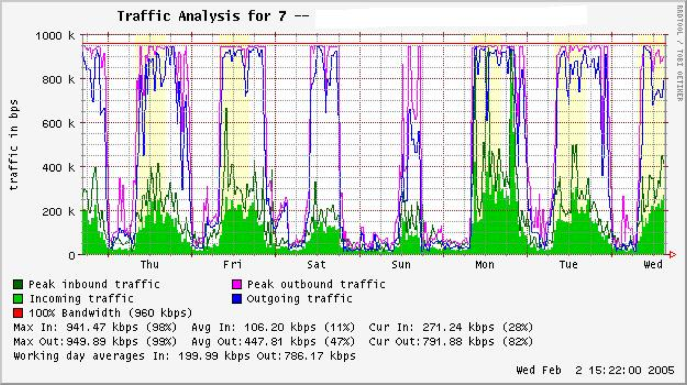

Figure NM 1: A graph with a "flat top" is one indication of
overutilisation.

 

Later in the week, you receive an emergency phone call in the evening.
Apparently, no one in the lab can browse the web or send email. You rush
to the lab and hastily reboot the proxy server, with no results.
Browsing and email are still broken. You then reboot the router, but
there is still no success. You continue eliminating the possible fault
areas one by one until you realise that the network switch is off - a
loose power cable is to blame. After applying power, the network comes
to life again.

 

How can you troubleshoot such an outage without such time consuming
trial and error? Is it possible to be notified of outages as they occur,
rather than waiting for a user to complain? One way to do this is to use
a program such as Nagios
[(http://www.nagios.org/)](http://www.nagios.org/)))that
continually polls network devices and notifies you of outages. Nagios
will report on the availability of various machines and services, and
will alert you to machines that have gone down. In addition to
displaying the network status graphically on a web page, it will send
notifications via SMS or email, alerting you immediately when problems
arise.

 

With good monitoring tools in place, you will be able to justify the
cost of equipment and bandwidth by effectively demonstrating how it is
being used by the organisation.

You are notified automatically when problems arise, and you have
historical statistics of how the network devices are performing. You can
check the current performance against this history to find unusual
behaviour, and head off problems before they become critical. When
problems do come up, it is simple to determine the source and nature of
the problem. Your job is easier, the Board is satisfied, and your users
are much happier.

### Monitoring your network

Managing a network without monitoring is similar to driving a vehicle
without a speedometer or a fuel gauge.

 

How do you know how fast you are going? Is the car consuming fuel as
efficiently as promised by the dealers? If you do an engine overhaul
several months later, is the car any faster or more efficient than it
was before?

Similarly, how can you pay for an electricity or water bill without
seeing your monthly usage from a meter? You must have an account of your
network bandwidth utilisation in order to justify the cost of services
and hardware purchases, and to account for usage trends.

There are several benefits to implementing a good monitoring system for
your network:

 

-   Network budget and resources are justified. Good monitoring tools
    can demonstrate without a doubt that the network infrastructure
    (bandwidth, hardware, and software) is suitable and able to handle
    the requirements of network users. 

     

-   Network intruders are detected and filtered. By watching your
    network traffic, you can detect attackers and prevent access to
    critical internal servers and services. 

     

-   Network viruses are easily detected. You can be alerted to the
    presence of network viruses, and take appropriate action before they
    consume Internet bandwidth and destabilise your network. 

     

-   Troubleshooting of network problems is greatly simplified. Rather
    than attempting "trial and error" to debug network problems, you can
    be instantly notified of specific problems. Some kinds of problems
    can even be repaired automatically. 

     

-   Network performance can be highly optimised. Without effective
    monitoring, it is impossible to fine tune your devices and protocols
    to achieve the best possible performance. 

     

-   Capacity planning is much easier. With solid historical performance
    records, you do not have to "guess" how much bandwidth you will need
    as your network grows. 

     

-   Proper network usage can be enforced. When bandwidth is a scarce
    resource, the only way to be fair to all users is to ensure that the
    network is being used for its intended purpose. 

     

 Fortunately, network monitoring does not need to be an expensive
undertaking. There are many freely available open source tools that will
show you exactly what is happening on your network in considerable
detail. This section will help you identify many invaluable tools and
how best to use them.

#### The dedicated monitoring server

While monitoring services can be added to an existing network server, it
is often desirable to dedicate one machine (or more, if necessary) to
network monitoring. Some applications (such as ntop
[http://www.ntop.org/)](http://www.ntop.org/)))require
considerable resources to run, particularly on a busy network.

 

But most logging and monitoring programs have modest RAM and storage
requirements, typically with little CPU power required. Since open
source operating systems (such as Linux or BSD) make very efficient use
of hardware resources, this makes it possible to build a very capable
monitoring server from recycled PC parts. There is usually no need to
purchase a brand new server to relegate to monitoring duties.

 

The exception to this rule is in very large installations.

If your network includes more than a few hundred nodes, or if you
consume more than 50 Mbps of Internet bandwidth, you will likely need to
split up monitoring duties between a few dedicated machines.

 

This depends largely on exactly what you want to monitor.

If you are attempting to account for all services accessed per MAC
address, this will consume considerably more resources than simply
measuring network flows on a switch port.

But for the majority of installations, a single dedicated monitoring
machine is usually enough.

While consolidating monitoring services to a single machine will
streamline administration and upgrades, it can also ensure better
ongoing monitoring.

 

For example, if you install monitoring services on a web server, and
that web server develops problems, then your network may not be
monitored until the problem is resolved. To a network administrator, the
data collected about network performance is nearly as important as the
network itself.

 

Your monitoring should be robust and protected from service outages as
well as possible.

Without network statistics, you are effectively blind to problems with
the network.

 

#### Where does the server fit in your network?

If you are only interested in collecting network flow statistics from a
router, you can do this from just about anywhere on the LAN.

This provides simple feedback about utilisation, but cannot give you
comprehensive details about usage patterns.

 

Figure NM 2 below shows a typical MRTG graph generated from the Internet
router.

While the inbound and outbound utilisation are clear, there is no detail
about which computers, users, or protocols are using bandwidth.

 

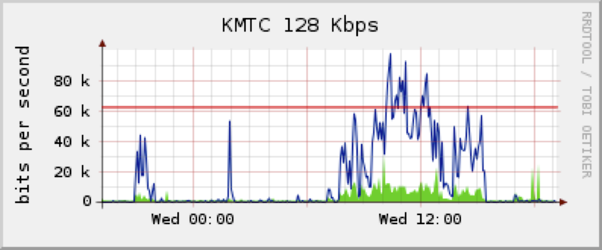

 

Figure NM 2: Polling the edge router can show you the overall network
utilisation, but you cannot break the data down further into machines,
services, and users.

 

For more detail, the dedicated monitoring server must have access to
everything that needs to be watched.

Typically, this means it must have access to the entire network.

To monitor a WAN connection, such as the Internet link to your ISP, the
monitoring server must be able to see the traffic passing through the
edge router.

To monitor a LAN, the monitoring server is typically connected to a
monitor port on the switch. If multiple switches are used in an
installation, the monitoring server may need a connection to all of
them.

That connection can either be a physical cable, or if your network
switches support it, a VLAN specifically configured for monitoring
traffic.

 

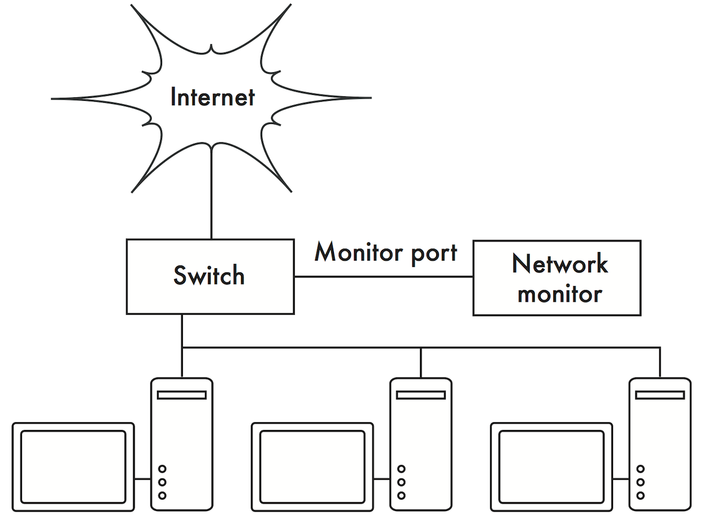

 

If monitor port functionality is not available on your switch, the
monitoring server may be installed between your internal LAN and the
Internet. While this will work, it introduces a single point of failure
for the network, as the network will fail if the monitoring server
develops a problem. It is also a potential performance bottleneck, if
the server cannot keep up with the demands of the network.

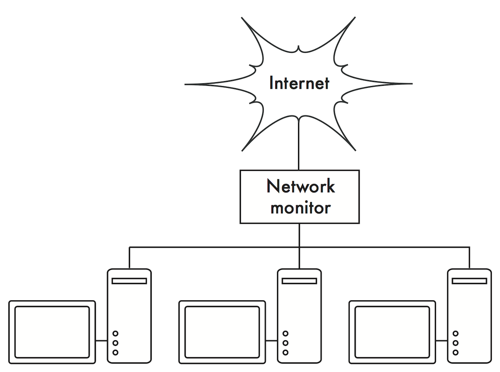

Figure NM 4: By inserting a network monitor between the LAN and your
Internet connection, you can observe all network traffic.

 

A better solution is to use a simple network hub (not a switch) which
connects the monitoring machine to the internal LAN, external router,
and the monitoring machine.

While this does still introduce an additional point of failure to the
network (since the entire network will be unreachable if the hub dies),
hubs are generally considered to be much more reliable than routers.

They are also very easily replaced should they fail.

 

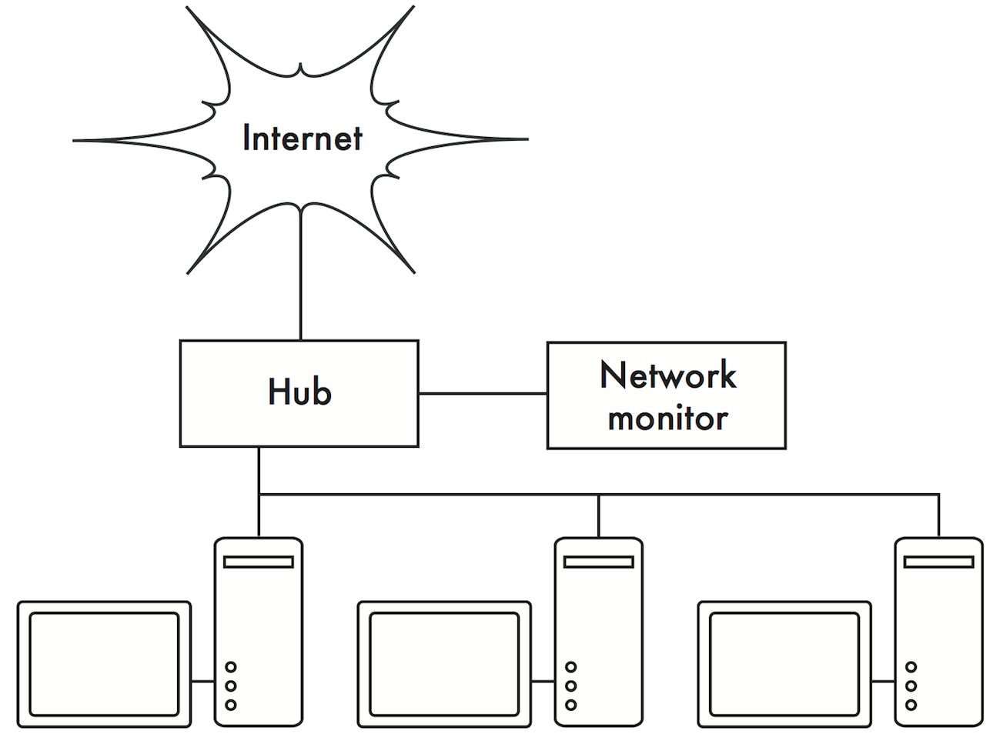

 

Figure NM 5: If your switch does not provide monitor port functionality,
you can insert a network hub between your Internet router and the LAN,
and connect the monitoring server to the hub.

 

Once your monitoring server is in place, you are ready to start
collecting data.

#### What to monitor

It is possible to plot just about any network event and watch its value
on a graph over time. Since every network is slightly different, you
will have to decide what information is important in order to gauge the
performance of your network.

Here are some important indicators that many network administrators will
typically track.

Wireless statistics

-   Received signal and noise from all backbone nodes  

-   Number of associated stations 

-   Detected adjacent networks and channels  

-   Excessive retransmissions 

-   Radio data rate, if using automatic rate scaling 

Switch statistics

-   Bandwidth usage per switch port  

-   Bandwidth usage broken down by protocol 

-   Bandwidth usage broken down by MAC address  

-   Broadcasts as a percentage of total packets  

-   Packet loss and error rate 

Internet statistics

-   Internet bandwidth use by host and protocol  

-   Proxy server cache hits 

-   Top 100 sites accessed  

-   DNS requests 

-   Number of inbound emails / spam emails / email bounces  

-   Outbound email queue size 

-   Availability of critical services (web servers, email servers,
    etc.).  

-   Ping times and packet loss rates to your ISP 

-   Status of backups 

System health statistics

-   Memory usage  

-   Swap file usage 

-   Process count / zombie processes  

-   System load 

-   Uninterruptible Power Supply (UPS) voltage and load  

-   Temperature, fan speed, and system voltages 

-   Disk SMART status  

-   RAID array status 

 

You should use this list as a suggestion of where to begin. As your
network matures, you will likely find new key indicators of network
performance, and you should of course track those as well.

There are many freely available tools that will show you as much detail
as you like about what is happening on your network.

You should consider monitoring the availability of any resource where
unavailability would adversely affect your network users.

Don't forget to monitor the monitoring machine itself, for example its
CPU usage and disk space, in order to receive advance warning if it
becomes overloaded or faulty. A monitoring machine that is low on
resources can affect your ability to monitor the network effectively.

### Types of monitoring tools

We will now look at several different classes of monitoring tools.

1.  1.Network detection tools listen for the beacons sent by wireless
    access points, and display information such as the network name,
    received signal strength, and channel. 

     

2.  2.Spot check tools are designed for troubleshooting and normally run
    interactively for short periods of time. A program such as ping may
    be considered an active spot check tool, since it generates traffic
    by polling a particular machine. 

     

3.  3.Passive spot check tools include protocol analysers, which inspect
    every packet on the network and provide complete detail about any
    network conversation (including source and destination addresses,
    protocol information, and even application data). 

     

4.  4.Trending tools perform unattended monitoring over long periods,
    and typically plot the results on a graph. 

     

5.  5.Throughput testing tools tell you the actual bandwidth available
    between two points on a network. 

     

6.  6.Realtime monitoring tools perform similar monitoring, but notify
    administrators immediately if they detect a problem. Intrusion
    detection tools watch for undesirable or unexpected network traffic,
    and take appropriate action (typically denying access and/or
    notifying a network administrator). 

 

 

 

 

### Network detection

The simplest wireless monitoring tools simply provide a list of
available networks, along with basic information (such as signal
strength and channel). They let you quickly detect nearby networks and
determine if they are in range or are causing interference.

#### The built-in client.

All modern operating systems provide built-in support for wireless
networking. This typically includes the ability to scan for available
networks, allowing the user to choose a network from a list. While
virtually all wireless devices are guaranteed to have a simple scanning
utility, functionality can vary widely between implementations. These
tools are typically only useful for configuring a computer in a home or
office setting.

They tend to provide little information apart from network names and the
available signal to the access point currently in use.

 

Netstumbler
([http://www.wirelessdefence.org/Contents/NetstumblerMain.ht](http://www.wirelessdefence.org/Contents/NetstumblerMain.htm)m).
This is the most popular tool for detecting wireless networks using
Microsoft Windows. It supports a variety of wireless cards, and is very
easy to use. It will detect open and encrypted networks, but cannot
detect “closed” wireless networks. It also features a signal/noise meter
that plots radio receiver data as a graph over time. It also integrates
with a variety of GPS devices, for logging precise location and signal
strength information.

This makes Netstumbler a handy tool to have for an informal site survey.

Macstumbler
([http://www.macstumbler.co](http://www.macstumbler.com/)m/). While not
directly related to the Netstumbler, Macstumbler provides much of the
same functionality but for the Mac OS X platform. It works with all
Apple Airport cards.

### Spot check tools

What do you do when the network breaks? If you can’t access a web page
or email server, and clicking the reload button doesn’t fix the problem,
then you’ll need to be able to isolate the exact location of the
problem.

These tools will help you to determine just where a connection problem
exists.

 

This section is simply an introduction to commonly used troubleshooting
tools.

For more discussion of common network problems and how to diagnose them,
see the chapter called Maintenance and Troubleshooting.

#### ping

Just about every operating system (including Windows, Mac OS X, and of
course Linux and BSD) includes a version of the ping utility. It uses
ICMP packets to attempt to contact a specified host, and tells you how
long it takes to get a response.

 

Knowing what to ping is just as important as knowing how to ping. If you
find that you cannot connect to a particular service in your web browser
(say, [http://yahoo.com/),](http://yahoo.com/)))you
could try to ping it:

 

\$ ping yahoo.com

 

PING yahoo.com (66.94.234.13): 56 data bytes

 

64 bytes from 66.94.234.13: icmp\_seq=0 ttl=57 time=29.375 ms

64 bytes from 66.94.234.13: icmp\_seq=1 ttl=56 time=35.467 ms

64 bytes from 66.94.234.13: icmp\_seq=2 ttl=56 time=34.158 ms

\^C

 

--- yahoo.com ping statistics ---

 

3 packets transmitted, 3 packets received, 0% packet loss

 

round-trip min/avg/max/stddev = 29.375/33.000/35.467/2.618 ms

 

Hit control-C when you are finished collecting data.

If packets take a long time to come back, there may be network
congestion.

If return ping packets have an unusually low Time To Live (TTL), you may
have routing problems between your machine and the remote end. But what
if the ping doesn’t return any data at all?

If you are pinging a name instead of an IP address, you may be running
into DNS problems.

 

Try pinging an IP address on the Internet. If you can’t reach it, it’s a
good idea to see if you can ping your default router:

 

\$ ping 69.90.235.230

 

PING 69.90.235.230 (69.90.235.230): 56 data bytes

 

64 bytes from 69.90.235.230: icmp\_seq=0 ttl=126 time=12.991 ms

64 bytes from 69.90.235.230: icmp\_seq=1 ttl=126 time=14.869 ms

64 bytes from 69.90.235.230: icmp\_seq=2 ttl=126 time=13.897 ms

\^C

 

--- 216.231.38.1 ping statistics ---

 

3 packets transmitted, 3 packets received, 0% packet loss

 

round-trip min/avg/max/stddev = 12.991/13.919/14.869/0.767 ms

 

If you can’t ping your default router, then chances are you won’t be
able to get to the Internet either. If you can’t even ping other IP
addresses on your local LAN, then it’s time to check your connection. If
you’re using Ethernet, is it plugged in? If you’re using wireless, are
you connected to the proper wireless network, and is it in range?

While it is generally accurate to assume that a machine that does not
respond to a ping is likely to be down or cut off from the network this
is not always 100% the case.

Particularly on a WAN or the Internet itself, it is also possible that
some router/firewall between you and the target host(even the target
itself) is blocking pings. If you find a machine is not responding to
pings, try another well-known service like ssh or http.

If you can reach the target through either of these services then you
know the machine is up and simply blocking pings. It is also worth
noting that different systems treat ping differently. The classic UNIX
ping utility sends an ICMP ECHO protocol packet to the target host. Some
network devices will respond to a ping automatically regardless of
whether ICMP is being blocked further up the protocol stack.

This can also be misleading because it can indicate a host is up when
actually all that's really going on is that the NIC (Network Interface
Card) is powered and the machine itself is not actually up and running.

As we stated above, it's always good to check connectivity with multiple
methods. Network debugging with ping is a bit of an art, but it is
useful to learn. Since you will likely find ping on just about any
machine you will work on, it’s a good idea to learn how to use it well.

#### traceroute and mtr

[http://www.bitwizard.nl/mtr](http://www.bitwizard.nl/mtr/)[/](http://www.bitwizard.nl/mtr/)

As with ping, traceroute is found on most operating systems (it’s called
tracert in some versions of Microsoft Windows). By running traceroute,
you can find the location of problems between your computer and any
point on the Internet:

 

\$ traceroute -n google.com

 

traceroute to google.com (72.14.207.99), 64 hops max, 40 byte packets

 

1 10.15.6.1 4.322 ms 1.763 ms 1.731 ms

 

2 216.231.38.1 36.187 ms 14.648 ms 13.561 ms

 

3 69.17.83.233 14.197 ms 13.256 ms 13.267 ms

 

4 69.17.83.150 32.478 ms 29.545 ms 27.494 ms

 

5 198.32.176.31 40.788 ms 28.160 ms 28.115 ms

 

6 66.249.94.14 28.601 ms 29.913 ms 28.811 ms

 

7 172.16.236.8 2328.809 ms 2528.944 ms 2428.719 ms

 

8 \* \* \*

 

The -n switch tells traceroute not to bother resolving names in DNS, and
makes the trace run more quickly. You can see that at hop seven, the
round trip time shoots up to more than two seconds, while packets seem
to be discarded at hop eight.

 

This might indicate a problem at that point in the network.

If this part of the network is in your control, it might be worth
starting your troubleshooting effort there.

My TraceRoute (mtr) is a handy program that combines ping and traceroute
into a single tool. By running mtr, you can get an ongoing average of
latency and packet loss to a single host, instead of the momentary
snapshot that ping and traceroute provide.

 

My traceroute [v0.69]

 

tesla.rob.swn (0.0.0.0) (tos=0x0 psize=64 bitpat Sun Jan 8 20:01:26
2006)

 

Keys: Help Display mode Restart statistics Order of fields quit

 

Packets        

Pings

Host

Loss%

Snt

Last

Avg

Best

Wrst

StDev

​1. gremlin.rob.swn

0.0%

4

1.9

2.0

1.7

2.6

0.4

​2. er1.sea1.speakeasy.net

0.0%

4

15.5

14.0

12.7

15.5

1.3

​3. 220.ge-0-1-0.cr2.sea1.

Speakeasy.net

0.0%

4

11.0

11.7

10.7

14.0

1.6

​4. fe-0-3-0.cr2.sfo1.

speakeasy.net

0.0%

4

36.0

34.7

28.7

38.1

4.1

​5. bas1-m.pao.yahoo.com

0.0%

4

27.9

29.6

27.9

33.0

2.4

​6. so-1-1-0.pat1.dce.

yahoo.com

0.0%

4

89.7

91.0

89.7

93.0

1.4

​7. ae1.p400.msr1.dcn.

yahoo.com  

0.0%

4

91.2

93.1

90.8

99.2

4.1

​8. ge5-2.bas1-m.dcn.

yahoo.com

0.0%

4

89.3

91.0

89.3

93.4

1.9

9.w2.rc.vip.dcn.yahoo.com

0.0%

3

91.2

93.1

90.8

99.2

4.1

 

The data will be continuously updated and averaged over time.

As with ping, you should hit control-C when you are finished looking at
the data. Note that you must have root privileges to run mtr.

While these tools will not reveal precisely what is wrong with the
network, they can give you enough information to know where to continue
troubleshooting.

### Protocol analysers

Network protocol analysers provide a great deal of detail about
information flowing through a network, by allowing you to inspect
individual packets. For wired networks, you can inspect packets at the
data-link layer or above. For wireless networks, you can inspect
information all the way down to individual 802.11 frames. Here are
several popular (and free) network protocol analysers:

#### Kismet

[http://www.kismetwireless.net](http://www.kismetwireless.net/)[/](http://www.kismetwireless.net/)

Kismet is a powerful wireless protocol analyser for many platforms
including Linux, Mac OS X, and even the embedded OpenWRT Linux
distribution. It works with any wireless card that supports passive
monitor mode.

In addition to basic network detection, Kismet will passively log all
802.11 frames to disk or to the network in standard PCAP format, for
later analysis with tools like Wireshark. Kismet also features
associated client information, AP hardware fingerprinting, Netstumbler
detection, and GPS integration.

Since it is a passive network monitor, it can even detect “closed”
wireless networks by analysing traffic sent by wireless clients.

You can run Kismet on several machines at once, and have them all report
over the network back to a central user interface. This allows for
wireless monitoring over a large area, such as a university or corporate
campus. Since Kismet uses the radio card's passive monitor mode, it does
all of this without transmitting any data.

Kismet is an invaluable tool for diagnosing wireless network problems.

#### KisMAC

[http://kisma](http://kismac-ng.org/)c-ng.org

Exclusively for the Mac OS X platform, KisMAC does much of what Kismet
can do, but with a slick Mac OS X graphical interface. It is a passive
scanner that will log data to disk in PCAP format compatible with
Wireshark. It supports passive scanning with AirportExtreme cards as
well as a variety of USB wireless adapters.

#### tcpdump

[http://www.tcpdump.org/](http://www.tcpdump.org/)

tcpdump is a command-line tool for monitoring network traffic.

It does not have all the bells and whistles of wireshark but it does use
fewer resources. Tcpdump can capture and display all network protocol
information down to the link layer. It can show all of the packet
headers and data received, or just the packets that match particular
criteria.

Packets captured with tcpdump can be loaded into wireshark for visual
analysis and further diagnostics. This is very useful if you wish to
monitor an interface on a remote system and bring the file back to your
local machine for analysis. The tcpdump tool is available as a standard
tool in Unix derivatives (Linux, BSD, and Mac OS X). There is also a
Windows port called WinDump available at
[http://www.winpcap.org/windump](http://www.winpcap.org/windump/)/

#### Wireshark

[http://www.wireshark.org](http://www.wireshark.org/)/

Formerly known as Ethereal, Wireshark is a free network protocol
analyser for Unix and Windows.

 

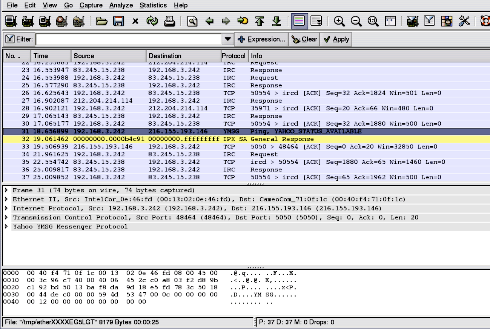

 

Figure NM 6: Wireshark (formerly Ethereal) is a powerful network
protocol analyser that can show you as much detail as you like about any
packet.

Wireshark allows you to examine data from a live network or from a
capture file on disk, and interactively browse and sort the captured
data.

 

Both summary and detailed information is available for each packet,
including the full header and data portions.

 

Wireshark has several powerful features, including a rich display filter
language and the ability to view the reconstructed stream of a TCP
session.

It can be daunting to use for first time users or those that are not
familiar with the OSI layers.

It is typically used to isolate and analyse specific traffic to or from
an IP address, but it can be also used as a general purpose fault
finding tool.

For example, a machine infected with a network worm or virus can be
identified by looking for the machine that is sending out the same sort
of TCP/IP packets to large groups of IP addresses.

### Trending tools

Trending tools are used to see how your network is used over a long
period of time. They work by periodically monitoring your network
activity, and displaying a summary in a human-readable form (such as a
graph). Trending tools collect data as well as analyse and report on it.

 

Below are some examples of trending tools. Some of them need to be used
in conjunction with each other, as they are not stand-alone programs.

#### MRTG

[http://oss.oetiker.ch/mrtg](http://oss.oetiker.ch/mrtg/)/

The Multi Router Traffic Grapher (MRTG) monitors the traffic load on
network links using SNMP. MRTG generates graphs that provide a visual
representation of inbound and outbound traffic.

These are typically displayed on a web page.

 

MRTG can be a little confusing to set up, especially if you are not
familiar with SNMP.

But once it is installed, MRTG requires virtually no maintenance, unless
you change something on the system that is being monitored (such as its
IP address).

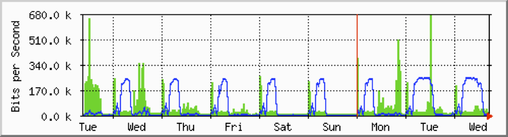

 

Figure NM 7: MRTG is probably the most widely installed network flow
grapher.

#### RRDtool

RRD is short for Round Robin Database. RRD is a database that stores
information in a very compact way that does not expand over time.
RRDtool refers to a suite of tools that allow you to create and modify
RRD databases, as well as generate useful graphs to present the data.

It is used to keep track of time-series data (such as network bandwidth,
machine room temperature, or server load average) and can display that
data as an average over time.

 

Note that RRDtool itself does not contact network devices to retrieve
data. It is merely a database manipulation tool.

You can use a simple wrapper script (typically in shell or Perl) to do
that work for you. RRDtool is also used by many full featured front-ends
that present you with a friendly web interface for configuration and
display. RRD graphs give you more control over display options and the
number of items available on a graph as compared to MRTG.

 

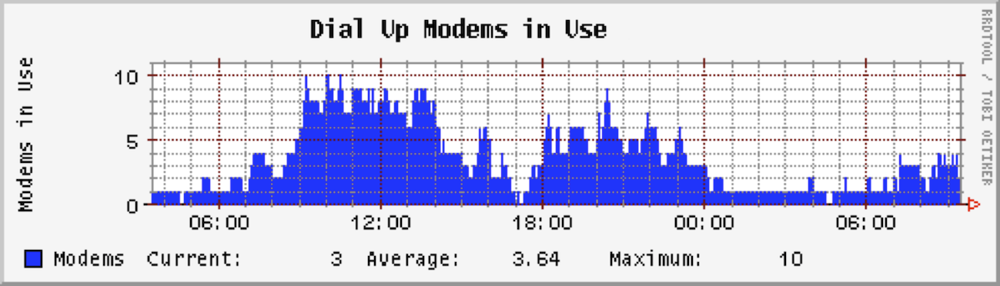

 

Figure NM 8: RRDtool gives you a lot of flexibility in how your
collected network data may be displayed.

 

RRDtool is included in virtually all modern Linux distributions, and can
be downloaded from
[http://oss.oetiker.ch/rrdtool](http://oss.oetiker.ch/rrdtool/)/

#### ntop

For historical traffic analysis and usage, you will certainly want to
investigate ntop.

This program builds a detailed real-time report of observed network
traffic, displayed in your web browser. It integrates with rrdtool, and
makes graphs and charts visually depicting how the network is being
used.

On very busy networks, ntop can use a lot of CPU and disk space, but it
gives you extensive insight into how your network is being used. It runs
on Linux, BSD, Mac OS X, and Windows.

 

Some of its more useful features include:

 

Traffic display can be sorted by various criteria (source, destination,
protocol, MAC address, etc.).

 

Traffic statistics grouped by protocol and port number.

 

An IP traffic matrix which shows connections between machines Network
flows for routers or switches that support the NetFlow protocol Host
operating system identification, P2P traffic, identification, numerous
graphical charts, Perl, PHP, and Python API.

 

ntop is available from
[http://www.ntop.org/](http://www.ntop.org/)and
is available for most operating systems.

It is often included in many of the popular Linux distributions,
including RedHat, Debian, and Ubuntu.

 

While it can be left running to collect historical data, ntop can be
fairly CPU intensive, depending on the amount of traffic observed.

 

If you are going to run it for long periods you should monitor the CPU
utilisation of the monitoring machine.

 

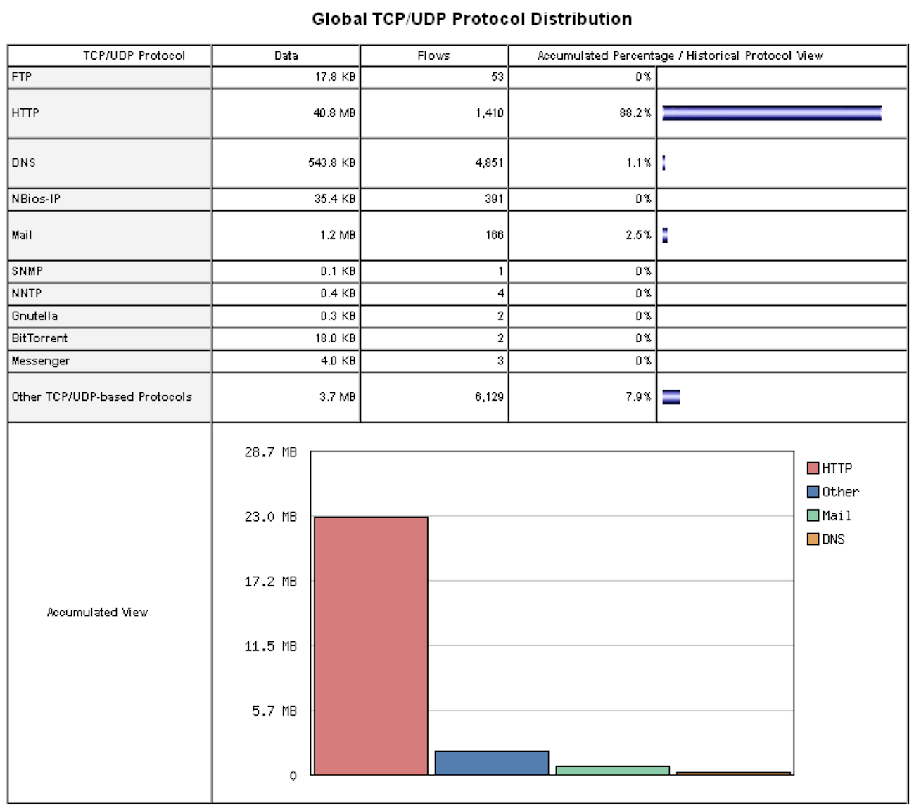

 

Figure NM 9: ntop displays a wealth of information about how your
network is utilised by various clients and servers.

 

The main disadvantage of ntop is that it does not provide instantaneous
information, only long-term totals and averages.

This can make it difficult to use to diagnose a problem that starts
suddenly.

#### Cacti

[http://www.cacti.net](http://www.cacti.net/)/

Cacti is a front-end for RRDtool. It stores all of the necessary
information to create graphs in a MySQL database. The front-end is
written in PHP.

Cacti does the work of maintaining graphs, data sources, and handles the
actual data gathering.

There is support for SNMP devices, and custom scripts can easily be
written to poll virtually any conceivable network event.

 

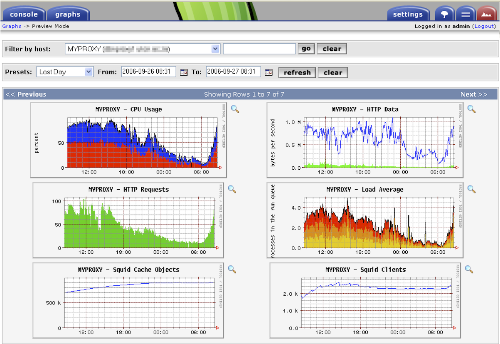

 

Figure NM 10: Cacti can manage the polling of your network devices, and
can build very complex and informative visualisations of network
behaviour.

 

Cacti can be somewhat confusing to configure, but once you work through
the documentation and examples, it can yield very impressive graphs.

There are hundreds of templates for various systems available on the
cacti website, and the code is under rapid development.

#### NetFlow

NetFlow is a protocol for collecting IP traffic information invented by
Cisco. From the Cisco website:

 

Cisco IOS NetFlow efficiently provides a key set of services for IP
applications, including network traffic accounting, usage-based network
billing, network planning, security, Denial of Service monitoring
capabilities, and network monitoring.

 

NetFlow provides valuable information about network users and
applications, peak usage times, and traffic routing.

 

Cisco routers can generate NetFlow information which is available from
the router in the form of UDP packets. NetFlow is also less CPU-
intensive on Cisco routers than using SNMP. It also provides more
granular information than SNMP, letting you get a more detailed picture
of port and protocol usage.This information is collected by a NetFlow
collector that stores and presents the data as an aggregate over time.

 

By analysing flow data, one can build a picture of traffic flow and
traffic volume in a network or on a connection. There are several
commercial and free NetFlow collectors available. Ntop is one free tool
that can act as a NetFlow collector and probe. Another is Flowc (see
below). It can also be desirable to use Netflow as a spot check tool, by
just looking at a quick snapshot of data during a network crisis. Think
of NetFlow as an alternative to SNMP for Cisco devices. For more
information about NetFlow, see
[http://en.wikipedia.org/wiki/Netflow](http://en.wikipedia.org/wiki/Netflow).

#### Flowc

[http://netacad.kiev.ua/flowc](http://netacad.kiev.ua/flowc/)/. Flowc is
an open source NetFlow collector (see NetFlow above). It is lightweight
and easy to configure. Flowc uses a MySQL database to store aggregated
traffic information. Therefore, it is possible to generate your own
reports from the data using SQL, or use the included report generators.
The built-in report generators produce reports in HTML, plain text or a
graphical format.

 

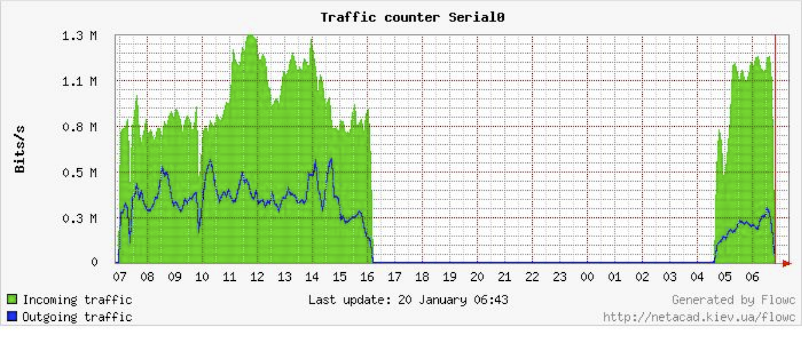

 

Figure NM 11: A typical flow chart generated by Flowc.

 

The large gap in data probably indicates a network outage.

Trending tools typically will not notify you of outages, but merely log
the occurrence.

To be notified when network problems occur, use a realtime monitoring
tool such as Nagios.

#### SmokePing

[http://oss.oetiker.ch/smokeping](http://oss.oetiker.ch/smokeping/)/.
SmokePing is a deluxe latency measurement tool written in Perl.

It can measure, store and display latency, latency distribution and
packet loss all on a single graph.

SmokePing uses the RRDtool for data storage, and can draw very
informative graphs that present up to the minute information on the
state of your network connection.

 

It is very useful to run SmokePing on a host with good connectivity to
your entire network.

Over time, trends are revealed that can point to all sorts of network
problems.

Combined with MRTG or Cacti, you can observe the effect that network
congestion has on packet loss and latency.

 

SmokePing can optionally send alerts when certain conditions are met,
such as when excessive packet loss is seen on a link for an extended
period of time. An example of SmokePing in action is shown in Figure NM
12.

 

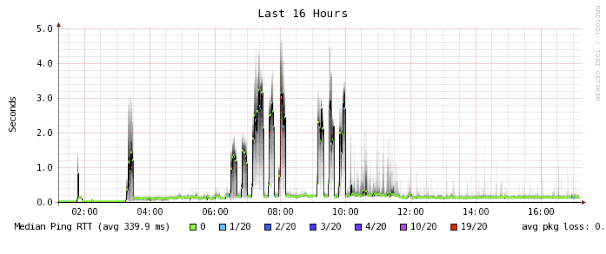

 

Figure NM 12: SmokePing can simultaneously display packet loss and
latency spreads in a single graph.

 

#### EtherApe

[http://etherape.sourceforge.net](http://etherape.sourceforge.net/)[/](http://etherape.sourceforge.net/)

EtherApe displays a graphical representation of network traffic. Hosts
and links change size depending on the amount of traffic sent and
received. The colours change to represent the protocol most used. As
with wireshark and tcpdump, data can be captured "off the wire" from a
live network connection or read from a tcpdump capture file. EtherApe
doesn't show quite as much detail as ntop, but its resource requirements
are much lighter.

#### iptraf

[http://iptraf.seul.org](http://iptraf.seul.org/)/

IPTraf is a lightweight but powerful LAN monitor. It has an ncurses
interface and runs in a command shell. IPTraf takes a moment to measure
observed traffic, and then displays various network statistics including
TCP and UDP connections, ICMP and OSPF information, traffic flows, IP
checksum errors, and more. It is a simple to use program that uses
minimal system resources. While it does not keep historical data, it is
very useful for displaying an instantaneous usage report.

 

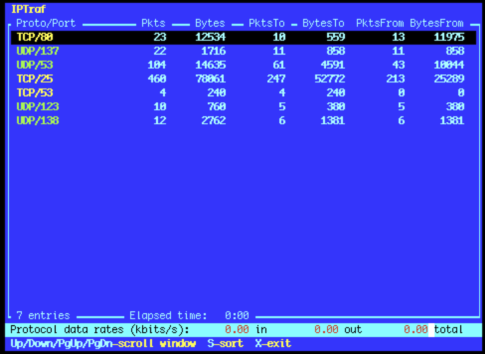

Figure NM 13: iptraf's statistical breakdown of traffic by port.

 

#### Argus

[http://qosient.com/argus](http://qosient.com/argus/)/.

Argus stands for Audit Record Generation and Utilisation System. Argus
is also the name of the mythological Greek god who had hundreds of eyes.

 

From the Argus website:

Argus generates flow statistics such as connectivity, capacity, demand,
loss, delay, and jitter on a per transaction basis. Argus can be used to
analyse and report on the contents of packet capture files or it can run
as a continuous monitor, examining data from a live interface;
generating an audit log of all the network activity seen in the packet
stream.

Argus can be deployed to monitor individual end-systems, or an entire
enterprises network activity. As a continuous monitor, Argus provides
both push and pull data handling models, to allow flexible strategies
for collecting network audit data. Argus data clients support a range of
operations, such as sorting, aggregation, archival and reporting. Argus
consists of two parts: a master collector that reads packets from a
network device, and a client that connects to the master and displays
the usage statistics. Argus runs on BSD, Linux, and most other UNIX
systems.

#### NeTraMet

[http://www.caida.org/tools/measurement/netramet](http://www.caida.org/tools/measurement/netramet/)/

NeTraMet is another popular flow analysis tool. Like Argus,

NeTraMet consists of two parts: a collector that gathers statistics via
SNMP, and a manager that specifies which flows should be watched.

Flows are specified using a simple programming language that defines the
addresses used on either end, and can include Ethernet, IP, protocol
information, or other identifiers. NeTraMet runs on DOS and most UNIX
systems, including Linux and BSD.

### Throughput testing

How fast can the network go?

What is the actual usable capacity of a particular network link?

You can get a very good estimate of your throughput capacity by flooding
the link with traffic and measuring how long it takes to transfer the
data.

 

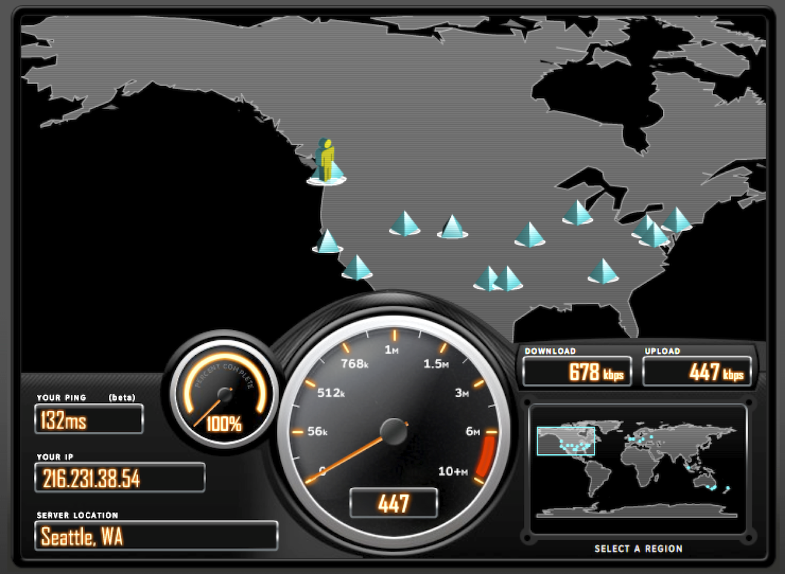

 

Figure NM 14: Tools such as this one from SpeedTest.net are pretty, but
don't always give you an accurate picture of network performance.

 

While there are web pages available that will perform a “speed test” in
your browser (such as
[http://www.dslreports.com/stest](http://www.dslreports.com/stest)or
[http://speedtest.net](http://speedtest.net/)/),

these tests are increasingly inaccurate as you get further from the
testing source. Even worse, they do not allow you to test the speed of a
given link, but only the speed of your link to a particular site on the
Internet.

Here are a few tools that will allow you to perform throughput testing
on your own networks.

#### ttcp

Now a standard part of most Unix-like systems, ttcp is a simple network
performance testing tool.

One instance is run on either side of the link you want to test.

The first node runs in receive mode, and the other transmits:

 

node\_a\$ ttcp -r -s

node\_b\$ ttcp -t -s node\_a

ttcp-t: buflen=8192, nbuf=2048, align=16384/0, port=5001 tcp -\> node\_a

ttcp-t: socket

ttcp-t: connect

ttcp-t: 16777216 bytes in 249.14 real seconds = 65.76 KB/sec +++

ttcp-t: 2048 I/O calls, msec/call = 124.57, calls/sec = 8.22

ttcp-t: 0.0user 0.2sys 4:09real 0% 0i+0d 0maxrss 0+0pf 7533+0csw

 

After collecting data in one direction, you should reverse the transmit
and receive partners to test the link in the other direction. It can
test UDP as well as TCP streams, and can alter various TCP parameters
and buffer lengths to give the network a good workout. It can even use a
user-supplied data stream instead of sending random data. Remember that
the speed readout is in kilobytes, not kilobits. Multiply the result by
8 to find the speed in kilobits per second. The only real disadvantage
to ttcp is that it hasn’t been developed in years. Fortunately, the code
has been released in the public domain and is freely available. Like
ping and traceroute, ttcp is found as a standard tool on many systems.

#### iperf

[http://iperf.sourceforge.net/.](http://iperf.sourceforge.net/)Much like
ttcp, iperf is a command line tool for estimating the throughput of a
network connection. It supports many of the same features as ttcp, but
uses a “client” and “server” model instead of a “receive” and “transmit”
pair.

To run iperf, launch a server on one side and a client on the other:

 

node\_a\$ iperf -s

node\_b\$ iperf -c node\_a

------------------------------------------------------------

Client connecting to node\_a, TCP port 5001

TCP window size: 16.0 KByte (default)

------------------------------------------------------------

[ 5] local 10.15.6.1 port 1212 connected with 10.15.6.23 port 5001

[ ID] Interval Transfer  Bandwidth

[ 5] 0.0-11.3 sec 768 KBytes         558 Kbits/sec

The server side will continue to listen and accept client connections on
port 5001 until you hit control-C to kill it. This can make it handy
when running multiple test runs from a variety of locations.

The biggest difference between ttcp and iperf is that iperf is under
active development, and has many new features (including IPv6 support).
This makes it a good choice as a performance tool when building new
networks.

#### bing

http://fgouget.free.fr/bing/indx-en.shtml

Rather than flood a connection with data and see how long the transfer
takes to complete, bing attempts to estimate the available throughput of
a point-to-point connection by analysing round trip times for various
sized ICMP packets. While it is not always as accurate as a flood test,
it can provide a good estimate without transmitting a large number of
bytes.

Since bing works using standard ICMP echo requests, it can estimate
available bandwidth without the need to run a special client on the
other end, and can even attempt to estimate the throughput of links
outside your network. Since it uses relatively little bandwidth, bing
can give you a rough idea of network performance without running up the
charges that a flood test would certainly incur.

### Realtime tools and intrusion detection

It is desirable to find out when people are trying to break into your
network, or when some part of the network has failed.

Because no system administrator can be monitoring a network all the
time, there are programs that constantly monitor the status of the
network and can send alerts when notable events occur.

 

The following are some open source tools that can help perform this
task.

#### Snort

Snort (http://www.snort.org/) is a packet sniffer and logger which can
be used as a lightweight network intrusion detection system.

It features rule-based logging and can perform protocol analysis,
content searching, and packet matching.

 

It can be used to detect a variety of attacks and probes, such as
stealth port scans, CGI attacks, SMB probes, OS fingerprinting attempts,
and many other kinds of anomalous traffic patterns.

Snort has a real-time alert capability that can notify administrators
about problems as they occur with a variety of methods.

Installing and running Snort is not trivial, and depending on the amount
of network traffic, will likely require a dedicated monitoring machine
with considerable resources.

Fortunately, Snort is very well documented and has a strong user
community.

By implementing a comprehensive Snort rule set, you can identify
unexpected behaviour that would otherwise mysteriously eat up your
Internet bandwidth.

See [http://snort.org/docs/](http://snort.org/docs/) for an extensive
list of installation and configuration resources.

#### Apache: mod\_security

ModSecurity ([http://www.modsecurity.org](http://www.modsecurity.org/)/)
is an open source intrusion detection and prevention engine for web
applications.

This kind of security tool is also known as a web application firewall.

ModSecurity increases web application security by protecting web
applications from known and unknown attacks.

It can be used on its own, or as a module in the Apache web server
(http://www.apache.org/).

 

There are several sources for updated mod\_security rules that help
protect against the latest security exploits.

 

One excellent resource is GotRoot, which maintains a huge and frequently
updated repository of rules:

[http://www.atomicorp.com/wiki/index.php/Atomic\_ModSecurity\_Rules](http://www.atomicorp.com/wiki/index.php/Atomic_ModSecurity_Rules)

 

Web application security is important in defending against attacks on
your web server, which could result in the theft of valuable or personal
data, or in the server being used to launch attacks or send spam to
other Internet users. As well as being damaging to the Internet as a
whole, such intrusions can seriously reduce your available bandwidth.

#### Nagios

Nagios ([http://nagios.org](http://nagios.org/)/) is a program that
monitors hosts and services on your network, notifying you immediately
when problems arise.

It can send notifications via email, SMS, or by running a script, and
will send notifications to the relevant person or group depending on the
nature of the problem.

Nagios runs on Linux or BSD, and provides a web interface to show
up-to-the-minute system status.

Nagios is extensible, and can monitor the status of virtually any
network event.

It performs checks by running small scripts at regular intervals, and
checks the results against an expected response.

This can yield much more sophisticated checks than a simple network
probe.

For example, ping may tell you that a machine is up, and nmap may report
that a TCP port responds to requests, but Nagios can actually retrieve a
web page or make a database request, and verify that the response is not
an error.

 

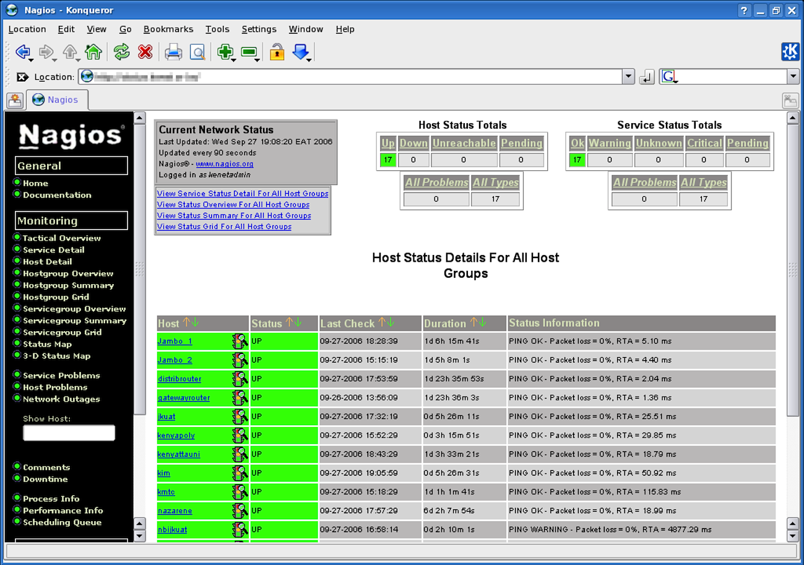

 

Figure NM 15: Nagios keeps you informed the moment a network fault or
service outage occurs.

 

Nagios can even notify you when bandwidth usage, packet loss, machine
room temperature, or other network health indicator crosses a particular
threshold.

This can give you advance warning of network problems, often allowing
you to respond to the problem before users have a chance to complain.

#### Zabbix

Zabbix ([http://www.zabbix.org](http://www.zabbix.org/)/) is an open
source realtime monitoring tool that is something of a hybrid between
Cacti and Nagios.

It uses a SQL database for data storage, has its own graph rendering
package, and performs all of the functions you would expect from a
modern realtime monitor (such as SNMP polling and instant notification
of error conditions). Zabbix is released under the GNU General Public
License.

### Other useful tools

There are thousands of free network monitoring tools that fill very
specialised needs. Here are a few of our favourites that don't quite fit
into the above categories.

#### ngrep

Ngrep provides most of GNU grep's pattern matching features, but applies
them to network traffic. It currently recognises IPv4 and IPv6, TCP,
UDP, ICMP, IGMP, PPP, SLIP, FDDI, Token Ring, and much more. As it makes
extensive use of regular expression matches, it is a tool suited to
advanced users or those that have a good knowledge of regular
expressions. You don't necessarily need to be a regex expert to be able
to make basic use of ngrep. For example, to view all packets that
contain the string GET (presumably HTTP requests), try this:

 

\# ngrep -q GET

 

Pattern matches can be constrained further to match particular
protocols, ports, or other criteria using BPF filters. This is the
filter language used by common packet sniffing tools, such as tcpdump
and snoop. To view GET or POST strings sent to destination port 80, use
this command line:

 

\# ngrep -q 'GET|POST' port 80

 

By using ngrep creatively, you can detect anything from virus activity
to spam email. You can download ngrep at
[http://ngrep.sourceforge.net](http://ngrep.sourceforge.net/)/.

#### nmap/Zenmap

nmap is a network diagnostic tool for showing the state and availability
of network ports on a network interface. A common use is to scan a
network host on a TCP/IP network for what ports are open, thereby
allowing one to create a "map" of the network services that the machine
provides. The nmap tool does this by sending specially crafted packets
to a target network host and noticing the response(s). For example, a
web server with an open port 80 but no running web server will respond
differently to an nmap probe than one that not only has the port open
but is running httpd.

Similarly, you will get a different response to a port that is simply
shut off vs. one that is open on a host but blocked by a firewall.

Over time, nmap has evolved from being a simple port-scanner to
something that can detect OS versions, network drivers, the type of NIC
hardware being used by an interface, driver versions, etc. In addition
to scanning individual machines, it can also scan entire networks of
hosts. This does mean that nmap is potentially also useful by malicious
network users as a way to "scope out" a system before attacking it. Like
many diagnostic tools, nmap can be used for good or ill and network
administrators would do well to be aware of both sides. The nmap tool is
released under the GPL license and the latest version can be found at
[http://www.nmap.or](http://www.nmap.org/)g.

#### Zenmap

Zenmap is a cross-platform GUI for nmap which runs under Linux, Windows,
Mac OS X, BSD, etc. and can be downloaded from the nmap.org site as
well.

#### netcat

Somewhat between nmap and tcpdump, netcat is another diagnostic tool for
poking and prodding at ports and connections on a network. It takes its
name from the UNIX cat(1) utility, which simply reads out whatever file
you ask it to. Similarly, netcat reads and writes data across any
arbitrary TCP or UDP port. The netcat utility is not a packet analyser
but works on the data(payload) contained in the packets.

For example, here is how to run a very simple 1-line, 1-time web server
with netcat:

 

{ echo -ne "HTTP/1.0 200 OK\\r\\n\\r\\n"; cat some.file; } | nc -l 8080

The file some.file will be sent to the first host that connects to port
8080 on the system running netcat.

The -l command tells netcat to "listen" on port 8080 and wait until it
gets a connection.

Once it does, it stops blocking, reads the data off the pipe and sends
it to the client connected on port 8080. Some other good examples of
netcat usage can be found in the Wikipedia entry for netcat:

[https://secure.wikimedia.org/wikipedia/en/wiki/Netcat\#Examples](https://secure.wikimedia.org/wikipedia/en/wiki/Netcat#Examples)

You can download the latest version of netcat from

[http://nc110.sourceforge.net/](http://nc110.sourceforge.net/)

It is available under a Permissive Free Software License.

### What is normal?

If you are looking for a definitive answer as to what your traffic
patterns should look like, you are going to be disappointed.

There is no absolute right answer to this question, but given some work
you can determine what is normal for your network.

While every environment is different, some of the factors that can
influence the appearance of your traffic patterns are:

 

-   The capacity of your Internet connection 

-   The number of users that have access to the network 

-   The social policy (byte charging, quotas, honour system, etc.).  

-   The number, types, and level of services offered 

-   The health of the network (presence of viruses, excessive
    broadcasts, routing loops, open email relays, denial of service
    attacks, etc.).  

-   The competence of your computer users 

-   The location and configuration of control structures (firewalls,
    proxy servers, caches, and so on) 

     

This is not a definitive list, but should give you an idea of how a wide
range of factors can affect your bandwidth patterns.

 

With this in mind, let's look at the topic of baselines.

### Establishing a baseline

Since every environment is different, you need to determine for yourself
what your traffic patterns look like under normal situations. This is
useful because it allows you to identify changes over time, either
sudden or gradual. These changes may in turn indicate a problem, or a
potential future problem, with your network.

For example, suppose that your network grinds to a halt, and you are not
sure of the cause. Fortunately, you have decided to keep a graph of
broadcasts as a percentage of the overall network traffic. If this graph
shows a sudden increase in the amount of broadcast traffic, it may mean
that your network has been infected with a virus.

Without an idea of what is "normal" for your network (a baseline), you
would not be able to see that the number of broadcasts had increased,
only that it was relatively high, which may not indicate a problem.

Baseline graphs and figures are also useful when analysing the effects
of changes made to the network. It is often very useful to experiment
with such changes by trying different possible values. Knowing what the
baseline looks like will show you whether your changes have improved
matters, or made them worse.

 

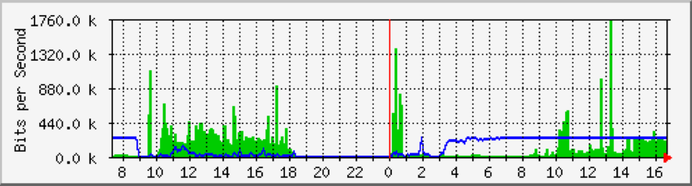

 

Figure NM 16: By collecting data over a long period of time, you can
predict the growth of your network and make changes before problems
develop.

 

In Figure NM 16, we can see the effect of the implementation of delay
pools on Internet utilisation around the period of May.

If we did not keep a graph of the line utilisation, we would never know
what the effect of the change over the long term was.

When watching a total traffic graph after making changes, don't assume
that just because the graph does not change radically that your efforts
were wasted. You might have removed frivolous usage from your line only
to have it replaced by genuine legitimate traffic.

You could then combine this baseline with others, say the top 100 sites
accessed or the average utilisation by your top twenty users, to
determine if habits have simply changed. As we will see later, MRTG,
RRDtool, and Cacti are excellent tools you can use to keep a baseline.

 

 

Figure NM 17: The traffic trend at Aidworld logged over a single day.

 

Figure NM 17 shows traffic on an Aidworld firewall over a period of 24
hours. There is nothing apparently wrong with this graph, but users were
complaining about slow Internet access.

Figure NM 18 shows that the upload bandwidth use (blue) was higher
during working hours on the last day than on previous days. A period of
heavy upload usage started every morning at 03:00, and was normally
finished by 09:00, but on the last day it was still running at 16:30.
Further investigation revealed a problem with the backup software, which
ran at 03:00 every day.

 

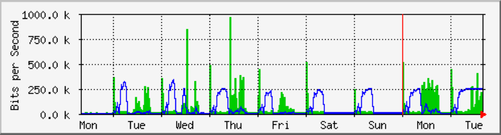

 

Figure NM 18: The same network logged over an entire week reveals a
problem with backups, which caused unexpected congestion for network
users.

 

Figure NM 19 shows measurements of latency on the same connection as
measured by the program called SmokePing. The position of the dots shows
the average latency, while the grey smoke indicates the distribution of
latency (jitter).

The colour of the dots indicates the number of lost packets. This graph
over a period of four hours does not help to identify whether there are
any problems on the network.

 

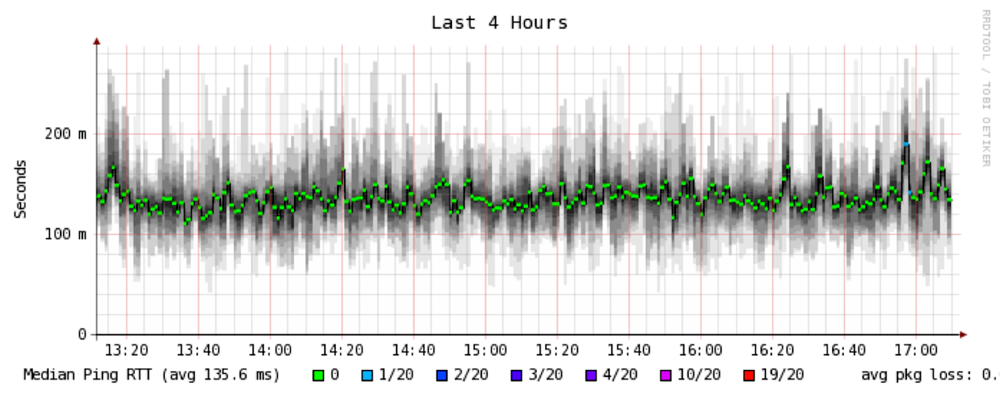

 

Figure NM 19: Four hours of jitter and packet loss.

 

The next graph (Figure NM 20) shows the same data over a period of 16
hours.

This indicates that the values in the graph above are close to the
normal level (baseline), but that there were significant increases in
latency at several times during the early morning, up to 30 times the
baseline value.

This indicates that additional monitoring should be performed during
these periods to establish the cause of the high latency to avoid
problems such as the backup not completing in the future.

 

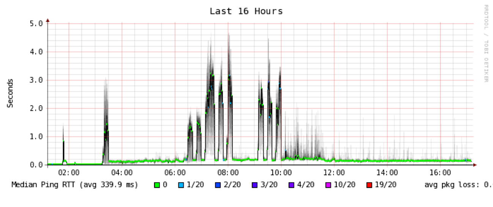

 

Figure NM 20: A higher spread of jitter is revealed in the 16 hour log.

 

Figure NM 21 shows that Tuesday was significantly worse than Sunday or
Monday for latency, especially during the early morning period.

This might indicate that something has changed on the network.

 

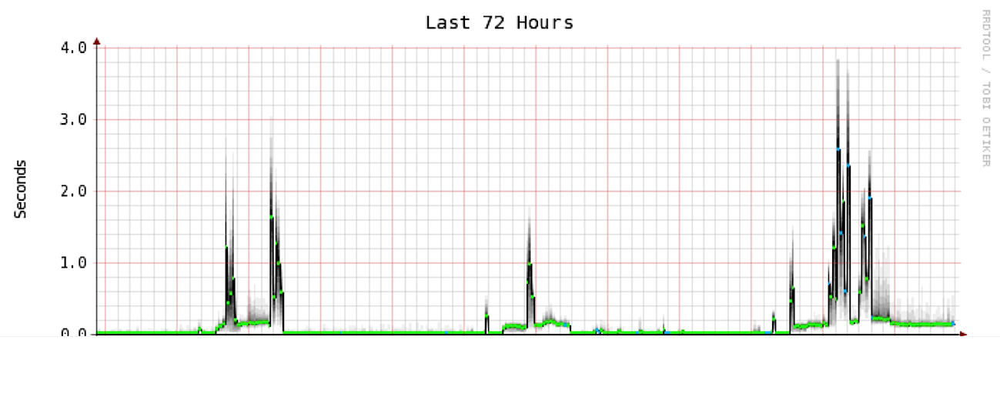

Figure NM 21: Zooming out to the week long view reveals a definite
repetition of increased latency and packet loss in the early morning
hours.

 

#### How do I interpret the traffic graph?

In a basic network flow graph (such as that generated by the network
monitor tool MRTG), the green area indicates inbound traffic, while the
blue line indicates outbound traffic.

 

Inbound traffic is traffic that originates from another network
(typically the Internet) and is addressed to a computer inside your
network. Outbound traffic is traffic that originates from your network,
and is addressed to a computer somewhere on the Internet.

 

Depending on what sort of network environment you have, the graph will
help you understand how your network is actually being used. For
example, monitoring of servers usually reveals larger amounts of
outbound traffic as the servers respond to requests (such as sending
mail or serving web pages), while monitoring client machines might
reveal higher amounts of inbound traffic to the machines as they receive
data from the servers.

 

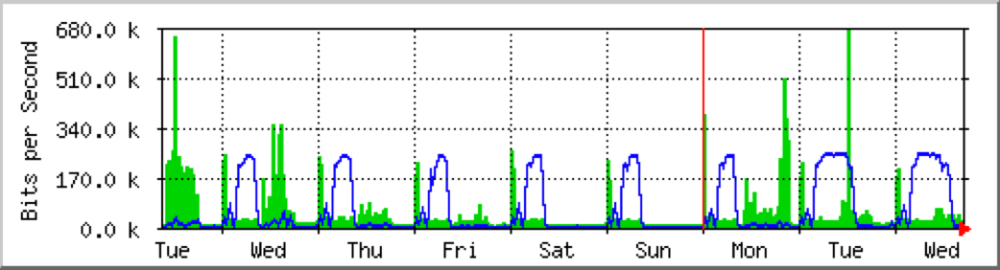

 

Figure NM 22: The classic network flow graph. The green area represents
inbound traffic, while the blue line represents outbound traffic. The
repeating arcs of outbound traffic show when the nightly backups have
run.

 

Traffic patterns will vary with what you are monitoring. A router will
normally show more incoming traffic than outgoing traffic as users
download data from the Internet. An excess of outbound traffic that is
not transmitted by your network servers may indicate a peer-to-peer
client, unauthorised server, or even a virus on one or more of your
clients. There are no set metrics that indicate what outgoing traffic to
incoming traffic should look like.It is up to you to establish a
baseline to understand what normal network traffic patterns look like on
your network.

#### Detecting network overload

Figure NM 23 shows traffic on an overloaded Internet connection.

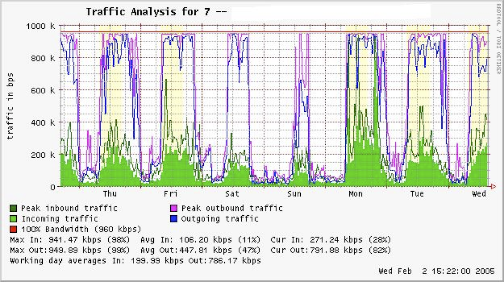

 

Figure NM 23: Flat-topped graphs indicate overloading of available
bandwidth.

The most apparent sign of overloading is the flat tops on outbound
traffic during the middle of every day.

Flat tops may indicate overloading, even if they are well below the
maximum theoretical capacity of the link.

In this case it may indicate that you are not getting as much bandwidth
from your service provider as you expect.

#### Measuring 95th percentile

The 95th percentile is a widely used mathematical calculation to
evaluate regular and sustained utilisation of a network pipe.

Its value shows the highest consumption of traffic for a given period.

 

Calculating the 95th percentile means that 95% of the time the usage is
below a certain amount, and 5% of the time usage is above that amount.

The 95th percentile is a good guideline to show bandwidth that is
actually used at least 95% of the time.

 

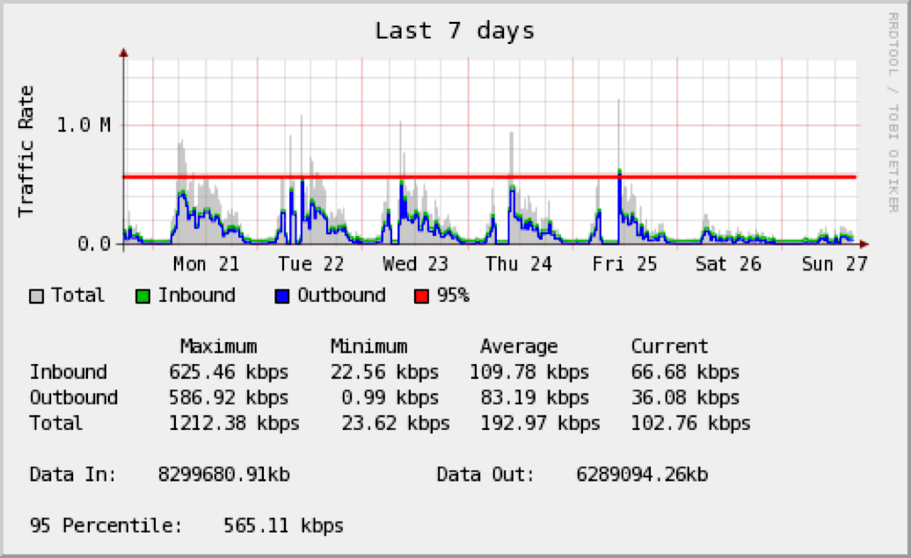

 

Figure NM 24: The horizontal line shows the 95th percentile amount.

 

MRTG and Cacti will calculate the 95th percentile for you.

This is a sample graph of a 960 kbps connection.

The 95th percentile came to 945 kbps after discarding the highest 5% of
traffic.

### Monitoring RAM and CPU usage

By definition, servers provide critical services that should always be
available. Servers receive and respond to client machine requests,
providing access to services that are the whole point of having a
network in the first place. Therefore, servers must have sufficient
hardware capabilities to accommodate the work load. This means they must
have adequate RAM, storage, and processing power to accommodate the
number of client requests. Otherwise, the server will take longer to
respond, or in the worst case, may be incapable of responding at all.
Since hardware resources are finite, it is important to keep track of
how system resources are being used. If a core server (such as a proxy
server or email server) is overwhelmed by requests, access times become
slow.

This is often perceived by users as a network problem. There are several
programs that can be used to monitor resources on a server. The simplest
method on a Windows machine is to access the Task Manager using the Ctrl
Alt + Del keys, and then click on the Performance tab. On a Linux or BSD
box, you can type top in a terminal window. To keep historical logs of
such performance, MRTG or RRDtool can also be used.

 

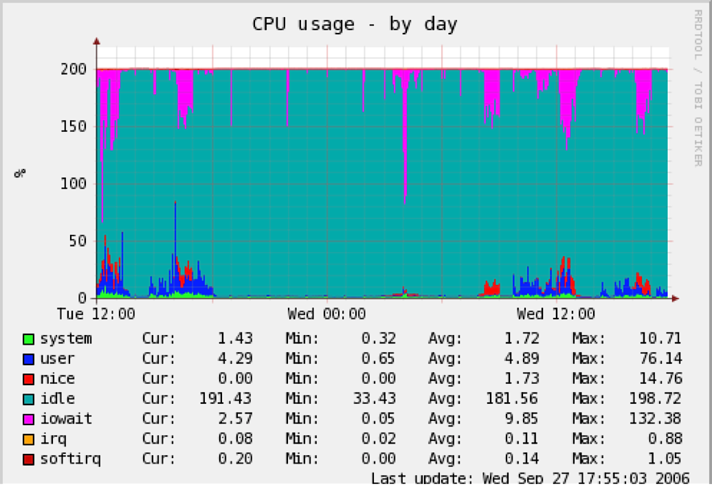

 

Figure NM 25: RRDtool can show arbitrary data, such as memory and CPU
usage, expressed as an average over time.

Mail servers require adequate space, as some people may prefer to leave
their email messages on the server for long periods of time.

The messages can accumulate and fill the hard disk, especially if quotas
are not in use.

If the disk or partition used for mail storage fills up, the mail server
cannot receive mail. If that disk is also used by the system, all kinds
of system problems may occur as the operating system runs out of swap
space and temporary storage.

File servers need to be monitored, even if they have large disks.

Users will find a way to fill any size disk more quickly than you might
think.

Disk usage can be enforced through the use of quotas, or by simply
monitoring usage and telling people when they are using too much.

Nagios can notify you when disk usage, CPU utilisation, or other system
resources cross a critical threshold.

 

If a machine becomes unresponsive or slow, and measurements show that a
system resource is being heavily used, this may be an indication that an
upgrade is required. If processor usage constantly exceeds 60% of the
total, it may be time to upgrade the processor. Slow speeds could also
be as a result of insufficient RAM. Be sure to check the overall usage
of CPU, RAM, and disk space before deciding to upgrade a particular
component.

A simple way to check whether a machine has insufficient RAM is to look
at the hard disk light.

When the light is on constantly, it usually means that the machine is
constantly swapping large amounts of data to and from the disk.

This is known as thrashing, and is extremely bad for performance.

 

It can usually be fixed by investigating which process is using the most
RAM, and killing or reconfiguring that process. Failing that, the system
needs more RAM. You should always determine whether it is more cost
effective to upgrade an individual component or purchase a whole new
machine. Some computers are difficult or impossible to upgrade, and it
often costs more to replace individual components than to replace the
entire system. Since the availability of parts and systems varies widely
around the world, be sure to weigh the cost of parts vs. whole systems,
including shipping and taxes, when determining the cost of upgrading.

### Summary

In summary in this chapter we've tried to give you an insight into how
to monitor your network and computing resources cost effectively and
efficiently. We've introduced many of our favourite tools to assist you.
Many of them are tried and tested by many network operators.

Hopefully you have understood the importance of monitoring to enable you
to both justify upgrades when necessary to those funding the upgrades,
plus minimise the impact of problems as they occur.

The end result is keeping your network and computing resources healthy
and keeping all of your users happy with the service you are providing
them.
