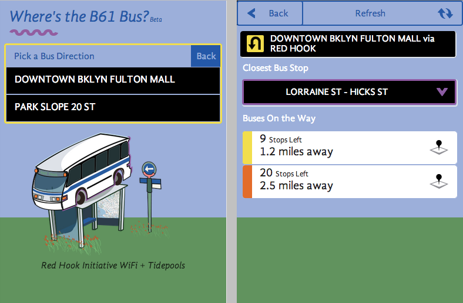

17. ECONOMIC SUSTAINABILITY
---------------------------

 

### Introduction

Achieving long-term sustainability is perhaps the most difficult goal
when designing and operating wireless networks. The prohibitive cost of
Internet connectivity in many countries, particularly those who are
heavily regulated by the government, imposes a substantial operating
expense that makes these networks sensitive to economic fluctuations and
necessitates innovation to attain viability.

 

Substantial progress in the use of wireless networks for rural
communications has been accomplished over the past few years, due in
large part to technological breakthroughs.

 

Long-distance links have been constructed, high bandwidth designs are
possible and secure means to access networks are available. In contrast,
there have been fewer successes with the development of sustainable
business models for wireless networks, particularly for remote areas.

 

Based on experiences and observations of existing networks, as well as
knowledge from entrepreneurial development best practices, this chapter
will focus on documenting methods for building sustainable wireless
networks.

 

In the past decade, there has been tremendous growth in Internet access
across the world. Most cities now have wireless or DSL networks and
fibre optic connections to the Internet, which is a substantial
improvement.

Nevertheless, outside urban areas, Internet access is still a formidable
challenge. There is little wired infrastructure beyond principal cities
in many countries. Therefore, wireless remains one of the few choices
for providing affordable Internet access.

 

There are now proven models for rural access using wireless. This book
was written for those wishing to connect their communities.

The models described here are smaller in scale and use affordable
designs.

Our aim is to provide examples of how wireless networks can be designed
to expand sustainable access where large telecommunications operators
have not yet installed their networks into areas that would otherwise
not be economically feasible by traditional models.

 

Two common misconceptions must be dispelled. First, many people assume
that there is one preferred business model that will work in every
community, and the key to success is to find that one “eureka” solution.

 

In practice, this is not the case. Each community, town or village is
different. There is no prescribed model that meets the needs of all
areas. Despite the fact that some places may be similar in economic
terms, the characteristics of a sustainable business model vary from
community to community.

 

Although one model may work in one village, another village nearby may
not possess the same necessary qualities for this model to be
sustainable. In this circumstance, other innovative models must be
customised to fit the context of this particular community.

 

Another misconception is that sustainability has the same definition for
all people. Although this term generally means that a system is built to
persist indefinitely, this chapter focuses more on the discussion of the
economic conditions (financial and managerial) than other aspects of
sustainability. Also, instead of the horizon being indeterminate, it
centres on a time period of five years – the period in which these ICT
infrastructure and wireless technologies are expected to be useful.

 

Thus, the term sustainability will be used to encapsulate a system
designed to persist for approximately five years. As we explained
earlier in the book, wireless networks in local communities often
stimulate the growth of connectivity and usage, and the installation of
fibre begins to become a reality.

 

So creating a sustainable model for your wireless network may lead to
growth of other networks and installation of longer term greater
bandwidth fibre links.

Wireless will then likely continue to co-habit alongside fibre in your
network as it grows in size and reach.

When determining and implementing the best model for a wireless network,
several key factors will help to ensure its success.

 

This chapter is not meant to be a guide for managing sustainable
wireless networks.

 

Rather, this is a “how-to” guide seeking to present an approach that
will enable you to find the model that best fits your situation.

 

The tools and information contained within this chapter will help people
starting wireless networks to ask the right questions and gather the
necessary data to define the most appropriate components of their model.
Keep in mind that determining the best model is not a sequential process
where each step is followed until completion.

In fact, the process is ongoing and iterative.

 

All of the steps are integrally connected to each other, and often you
will revisit steps several times as you progress.

### Create a mission statement

 What do you want to accomplish by setting up your network?

 

It seems like a simple question. However, many wireless networks are
installed without a clear vision of what they are doing and what they
hope to accomplish in the future. The first step involves documenting
this vision with the input of your entire team or staff.

 

-   What is the purpose of the wireless network?  

-   Who does the network seek to serve?  

-   What does the network do to address the community’s needs and to
    create value?  

-   What are the principles that guide the network?  

 

A good mission statement expresses the purpose of your network in a
concise, meaningful way while articulating your values and services.

Above all, your mission provides a vision of the aspirations for your
wireless network.

 

It is important that every team member working to build the wireless
network is included in the process of developing your mission, which
helps create further buy-in. It will garner support and commitment not
only from your staff, but also from customers, partners and donors,
which will further your overall objectives.

 

In the dynamic world of technology, the needs of customers and the best
way to satisfy those needs change rapidly; therefore, the development of
your mission is an ongoing process.

After defining the initial mission with your team, you must conduct
research to determine whether this first conception is aligned with the
realities of your environment. Based on an analysis of the external
environment and your internal competencies, you must constantly modify
the mission throughout the life-cycle of the wireless network.

### Evaluate the demand for potential offerings

The next step in deriving your business model involves assessing the
community’s demand for the network’s products and services. First,
identify the individuals, groups and organisations in the community that
have a need for information and would benefit from the wireless
network’s offerings. Potential users could consist of a wide variety of
individuals and organisations that include, but are not limited to:

 

-   Farmers’ associations and cooperatives  

-   Women’s groups 

-   Schools and universities  

-   Businesses and local entrepreneurs  

-   Health clinics and hospitals  

-   Religious groups 

-   International and local non-governmental organizations (NGOs) Local
    and national government agencies 

-   Radio stations 

-   Organisations in the tourist industry 

 

Once you establish a list of all the potential user groups of the
network, you must determine their needs for access to information and
communication. Often, people confuse services with needs.

A farmer may need to gather information on market prices and climatic
conditions to improve his crop yield and sales. Perhaps the way in which
he gets this information is through the Internet; however, the farmer
could also receive this information through SMS over a mobile phone or
through Voice over Internet Protocol (VoIP). It is important to
differentiate between needs and services because there may be various
ways to satisfy the farmer’s needs. Your wireless network should look
for the best way to fulfill the farmer’s needs, thereby creating value
at the lowest cost for the user.

When assessing the needs of the community, it is important to figure out
where the network can bring the most value to its users.

For instance, in the small town of Douentza, Mali, a telecentre manager
evaluated the potential benefits of establishing a wireless network
through discussions with several local organisations. He interviewed one
local NGO that discussed its need to send monthly reports to its
headquarters office in Bamako. At that time, there was no Internet
access in Douentza. In order to email a copy of the report, the NGO sent
one of its employees to Mopti once a month, resulting in transportation
and lodging costs, as well as the opportunity cost of having the
employee out of the office for several days each month.

When the telecentre manager calculated the total monthly costs incurred
by the NGO, he was able to demonstrate the value of an Internet
connection through cost savings to the organisation.

Assistance from key partners may also be necessary to secure
sustainability for your wireless network. During this phase, you should
connect with potential partners and explore mutually beneficial
collaborations.

You can evaluate the demand in your community by contacting your
potential customers and asking questions directly or through surveys,
focus groups, interviews or town hall meetings. Conducting research
through a review of statistical documentation, industry reports,
censuses, magazines, newspapers and other secondary data sources will
also help to give you a better picture of your local environment.

The goal of this data collection is to obtain a thorough understanding
of the demand for information and communication in your community so
that the network being created responds to those needs.

Often, wireless networks that do not succeed forget this key step.

Your entire network should be based on the demand in the community.

If you set up a wireless network in which the community does not find
value or cannot afford its services, it will ultimately fail.

### Establish appropriate incentives

Often, there is little economic incentive for subsistence-based economic
participants to access the Internet.

In addition, the cost of acquiring a computer or mobile smart phone,
learning to use it, and getting an Internet connection far outweighs the
economic returns that it can provide.

There has recently been some development of applications that address
this lack of incentive, such as market information systems, quality
standards imposed by importing countries, and commodities exchanges.
Internet access becomes an obvious advantage in situations where knowing
the day-to-day prices of products can make a significant difference in
income. Establishing appropriate economic incentives is paramount to the
success of the network. The network must provide economic value to its
users in a way that outweighs its costs, or it must be cheap enough that
its costs are marginal and affordable to its users. It is crucial to
design a network with viable economic uses and with costs that are less
than the economic value provided by it.

Additionally, to create a proper incentive structure, you must involve
the community in the creation of the network from the beginning of the
project, making sure that this initiative is organic and not imposed
from the outside.

To begin, you should try to answer the following questions:

 

1.  1.  1.What economic value can this network generate for the local
        economy and for whom? 

    2.  2.How much perceivable economic value can be generated? 

    3.  3.Can present impediments be overcome to allow the achievement
        of these economic returns? 

 

By answering these questions, the network will be able to clearly
articulate its value proposition for its users. For example, “By using
this network you can improve your margins on commodity sales by 2%,” or
“Internet access will allow you to save \$X in phone charges and
transportation costs per month.” You must figure out how your network
can improve efficiencies, reduce costs, or increase revenues for these
customers.

For example, if providing market information for the local maize
industry, the network should be located near to where farmers bring
their crop for sale to merchants.

Your network would then likely need to tie-into market information
systems, providing daily price sheets (\$1 each), or terminals to
sellers and merchants (\$2/hr). Your network might also provide the
means for farmers to read about new techniques and to buy new products.
You might also provide wireless connections to merchants and rent them
thin-client terminals for Internet access.

If the market was small, you might be able to reduce costs by limiting
access to images and other bandwidth intensive services. Again, knowing
how much value your network will create for these merchants will allow
you to gauge how much they will be able to afford for your services.

### Research the regulatory environment for wireless

The regulatory environment for wireless networks also affects the type
of business model that can be implemented.

First, research whether any organisation has the right to use 2.4 GHz
frequencies without a license.

In most situations, 2.4 GHz is free to use worldwide; however, some
countries restrict who can operate a network or require expensive
licenses to do so.

So although wireless networks might be legal in a country, the operator
of a network might have to acquire a license to use 2.4 GHz frequencies,
which renders this usage prohibitive for anyone other than established
Internet Service Providers who have sufficient cash flow to pay the
license fees. This restriction makes it difficult for small communities
to share a wireless network with other potentially interested parties or
organisations.

Other countries are more permissive with no such restrictions on
wireless networks, so the possibility to share Internet connectivity in
small communities is a viable solution.

The lesson is to do your research at the onset, ensuring your network
will comply with the laws of the country and local community. Some
project managers have been forced to shut down their wireless networks
simply because they were unknowingly breaking the law.

You should also check into the legality of Voice over Internet Protocol
(VoIP) services.

In some countries there are complicated rules surrounding VoIP. The
rules for VoIP services and VoIP gateways vary a lot so please check in
your own country what is legally allowed. You can start by checking
wikipedia -
[http://en.wikipedia.org/wiki/Voice\_over\_I](http://en.wikipedia.org/wiki/Voice_over_IP)P

### Analyse the competition

The next phase in the evaluation of your community involves an analysis
of the wireless network’s competition. Competitors include organisations
that provide similar products and services (e.g., another wireless
Internet Service provider or WISP), organisations viewed as substitutes
or alternatives to the products and services your network provides
(e.g., a cybercafé), and organisations defined as new entrants to the
wireless market.

Once you have identified your competitors, you should research them
thoroughly. You can obtain information about your competitors through
the Internet, telephone calls, their advertisements and marketing
materials, surveys of their customers and visits to their site. Create a
file for each competitor. The competitive information you gather can
include a list of services (including price and quality information),
their target clients, customer service techniques, reputation,
marketing, etc.

Be sure to collect anything that will help you determine how to position
your network in the community.

It is important to evaluate your competition for many reasons. First, it
helps you determine the level of market saturation. Knowing what already
exists will allow you to determine how your network can contribute value
to the community. In addition, analysing the competition can stimulate
innovative ideas for your service offerings. Is there something that you
can do better than the competitors to make your services more
effectively fit the needs of the community?

Finally, by analysing your competitors from the customers’ point of view
and understanding their strengths and weaknesses, you can determine your
competitive advantages in the community.

Competitive advantages are those which cannot be easily replicated by
the competition.

For example, a wireless network that can exclusively offer a faster
Internet connection than a competitor is a competitive advantage.

### Determine initial and recurring costs and pricing

When you are planning to set up and operate your wireless network, you
must determine the resources needed to start your project and the
recurring operating costs. Start-up costs include everything you must
purchase to start your wireless network.

 

These expenses can range from the initial investment you make in
hardware, access to towers and so on plus equipment for access points,
hubs, switches, cables, solar equipment, UPS, etc. to the costs to
register your organisation as a legal entity.

Recurring costs are what you must pay to continue to operate your
wireless network, including the cost of Internet access, telephones,
loans, electricity, salaries, office rental fees, equipment maintenance
and repairs, and regular investments to replace malfunctioning or
obsolete equipment.

Every piece of equipment will eventually break down or become outdated
at some point, and you should set aside extra money for this purpose.

 

An advisable and very common method to deal with this is to take the
price of the device and divide it by the period of time you estimate
that it will last.

This process is called depreciation. Here is an example. An average
computer is supposed to last for two to five years. If the initial cost
to purchase the computer was \$1,000 USD, and you will be able to use
the computer for five years, your annual depreciation will be \$200 USD.
In other words, you will lose \$16.67 USD every month so that you can
eventually replace this computer. To make your project sustainable, it
is of fundamental importance that you save the money to compensate for
the depreciation of equipment each month.

Keep these savings until you finally have to spend them for equipment
replacement. Some countries have tax laws that determine the period of
depreciation for different types of devices.

In any case, you should try to be very realistic about the life-cycle of
all the implemented gear and plan for their depreciation carefully.

It is important to research all your start-up costs in advance, and make
realistic estimations of your recurring expenses.

It is always better to over-budget for expenses than to under-budget.

 

With every wireless project, there are always unforeseen costs,
especially during the first year of operations as you learn how to
better manage your network. Following, is a non-exhaustive list of
categories of costs that you should include, both in start-up phase and
for your recurring costs, just to give you an idea of how to get started
on calculating your costs:-

### Categories of Costs

Labour costs -

-   Check ups (analyses) and consultancies 

-   Development costs for programming, testing, integration etc.  

-   Installation costs 

-   Recruiting costs 

-   Training costs (introduction and on-going) 

-   Handling costs / salaries for employees or freelancers, including
    yourself  

-   Equipment maintenance staff costs 

-   Software support staff costs  

-   Security personnel 

 

Non-labour costs -

-   Acquisition and production costs (for hardware like PCs, VSAT,
    radio link equipment and software)  

-   Ancillary equipment (e.g., switches, cables and cabling, generator,
    UPS, etc.) 

-   Data protection and security 

-   Start-up inventory (chairs, tables, lighting, curtains, tiles and
    carpeting) 

-   Premises costs (new building, modification, air conditioning,
    electrical wiring and boxes, security grills)  

-   Legal costs, such as business registration 

-   Initial license costs (VSAT) 

-   Initial marketing costs (flyers, stickers, posters, opening party) 

-   Operating costs for hardware and operating systems (Internet
    access, telephone, etc.)  

-   Rent or leasing rates (for tower space for example) 

-   Depreciation of hardware and equipment  

-   License fees 

-   Consumables and office supplies (e.g., data media, paper, binds,
    clips)  

-   Operational costs to maintain data protection and security 

-   Insurance premiums 

-   Costs for energy and to ensure power supply 

-   Loan payments, capital costs for paying back your setup costs 

-   Costs for advertising 

-   Local fees 

-   Legal and accounting services 

     

To improve your chances of sustainability, it is generally best to
maintain the lowest cost structure for your network.

 

In other words, keep your expenses as low as possible.

Take time to thoroughly research all of your suppliers, particularly the
ISPs, and shop around for the best deals on quality service. Once again,
be certain that what you purchase from suppliers corresponds with the
demand in the community.

Before installing an expensive VSAT, ensure there is a sufficient number
of individuals and organisations in your community willing and able to
pay for using it.

Depending upon demand for information access and ability to pay, an
alternative method of connectivity may be more appropriate. Do not be
afraid to think outside the box and be creative when determining the
best solution.

 

Keeping your costs down should not be at the cost of quality. Because
low-quality equipment is more likely to malfunction, you could be
spending more on maintenance in the long run.

The amount of money you will spend to maintain your ICT infrastructure
is hard to guess. The larger and more complicated your infrastructure
becomes, the more financial and labour resources you must allocate for
its maintenance.

Many times this relation is not linear but exponential. If you have a
quality problem with your equipment once it is rolled out, it can cost
you an enormous amount of money to fix it. Concurrently, your sales will
decrease because the equipment is not up and running.

There is an interesting example of a major wireless Internet Service
Provider (WISP) who had more than 3,000 access points in operation for a
while. However, the WISP never managed to break-even because it had to
spend too much money to maintain all the access points.

In addition, the company underestimated the short life-cycle of such
devices. ICT hardware tends to get cheaper and better as time goes on.
As soon as the company had invested time and money to install the
version of expensive first generation 802.11b access points, the new “g”
standard was created.

New competitors designed better and cheaper access points and offered
faster Internet access for less money. Finally the first WISP was forced
to close down the company, although it was initially the market leader.

Keep in mind the rapid advancement and changes in technology and think
about how and when it may be time for you to reinvest in newer and
cheaper (or better) devices to keep your infrastructure competitive and
up-to-date. As mentioned before, it is highly important that you save
enough to be able to do so, when necessary.

 

Once you have identified and mapped out your costs, you should also
determine what and how to charge for your services. This is a
complicated and time-consuming process to do correctly. These key tips
will assist when making pricing decisions:

 

-   Calculate the prices you charge so that you cover all costs to
    provide the service, including all recurring expenses  

-   Examine the prices of your competitors. 

-   Evaluate what your customers are willing and able to pay for your
    services, and make sure your prices correspond with these 

 

It is absolutely essential to make a financial plan before you start to
find out if your project can be sustainable.

### Secure the financing

Once you have determined your initial and recurring costs and created
your financial plan, you know how much financing you will need to run a
successful wireless network.

The next step is to research and secure the appropriate amount of money
to start up and run your wireless network.

The most traditional method of receiving funding for wireless networks
is through grants given by donors. A donor typically will contribute
funding and other types of donations to an organisation or consortium of
organisations to help them manage projects or support causes.

Because this funding is provided in the form of grants or other
donations, it is not expected to be repaid by the organisations
implementing the wireless projects or by the project’s beneficiaries.

Such donors include large international organisations like the United
Nations (UN) and various specialised UN agencies like the United Nations
Development Program (UNDP) and United Nations Educational, Scientific
and Cultural Organization (UNESCO). Government agencies that specialise
in international development, such as the United States Agency for
International Development (USAID), the United Kingdom’s Department for
International Development (DFID), and the Canadian International
Development Agency (CIDA), are also considered donors. Large foundations
like the Gates Foundation and the Soros Foundation and private
commercial companies are other types of donors.

 

Typically, receiving funding involves a competitive or a non-competitive
process. The non-competitive process is more infrequent, so we will
focus on the competitive process at a very high level. Most donors have
complicated procedures surrounding the distribution of funding. During
the competitive bid process, the donor creates a request for proposal
(RFP) or a request for application (RFA), which solicits various
non-governmental organisations, private companies and their partners to
submit proposals outlining their plans for projects within the
constraints of the donors’ objectives and guidelines.

In response to this RFP or RFA, NGOs and other organisations compete
through the submittal of their proposals, which are then evaluated by
the donors based on specific established criteria. Finally, the donor
organisation selects the most appropriate and highest ranking proposal
to fund the project.

Sometimes donors also supply funding to support an organisation’s
operations, but this type of funding is more unusual than the
competitive bid process for a specific project.

 

Another way of accessing the necessary funds to start and maintain a
wireless network is through microfinance, or the provision of loans,
savings and other basic financial services to the world’s poorest
people. Pioneered in the 1970’s by organisations like ACCION
International and Grameen Bank, microcredit, a type of microfinance,
enables entrepreneurs to receive loans in small amounts of money to
start up small enterprises.

Despite the fact that often individuals lack many of the traditional
qualifications needed to obtain loans like verifiable credit, collateral
or steady employment, microcredit programs have been highly successful
in many countries.

Typically, the process involves an individual or a group completing and
submitting a loan application in the hopes of receiving a loan, and the
lender, the individual or organisation that provides the loan, giving
money on condition that it is returned with interest.

 

The use of microcredit to fund wireless networks does pose one
constraint. Usually, microcredit involves very small sums of money.
Unfortunately, because a large amount of capital is needed to purchase
the initial equipment for wireless network set up, sometimes a
microcredit loan is not sufficient.

However, there have been many successful applications of microcredit
that have brought technology to communities. An example includes the
story of village phone operators. These entrepreneurs use their
microcredit loans to purchase mobile phones and phone credits.

They then rent the use of their mobile phones to community members on a
per-call basis and earn enough money to repay their debt and make a
profit for themselves and their families.

 

Another mechanism for getting funding to start a wireless network is
angel funding. Angel investors are normally wealthy individuals that
provide capital for business start-up in exchange for a high rate of
return on their investment.

Because the ventures in which they invest are start ups and, therefore,
often high risk, angel investors tend to expect different things in
addition to their return.

Many expect a Board position and maybe a role in the organisation.

Some angels want to have a stake in the company, while others prefer
shares in the company that can be easily redeemable at face value, thus
providing a clear exit for the investor.

To protect their investments, angels frequently ask the businesses not
to make certain key decisions without their approval. Because of the
high risk involved in developing markets, it is often challenging to
find angel investors to help setup a wireless network, but not
impossible.

The best way to find potential investors is through your social network
and through research online.

### Evaluate the strengths and weaknesses of the internal situation

A network is only as good as the people who work and operate it.

The team you put in place can mean the difference between success and
failure.

That is why it is important to reflect on your team’s qualifications and
skills, including those of staff and volunteers, in comparison to the
competencies needed for a wireless project.

First, make a list of all the competencies needed to run a wireless
project successfully. Capacity areas should include technology, human
resources, accounting, marketing, sales, negotiation, legal, and
operations, among others. Afterwards, identify local resources to
fulfill these skills.

Map your team’s skill sets to the competencies needed, and identify key
gaps. One tool often used to assist with this self-evaluation is an
analysis of strengths, weaknesses, opportunities and threats, called
SWOT.

 

To conduct this analysis, specify your internal strengths and
weaknesses, and elaborate upon the external opportunities and threats in
your community. It is important to be realistic and honest about what
you do well and what you are lacking.

Be sure to distinguish between where your organisation is at the
beginning of this endeavour from where it could be in the future. Your
strengths and weaknesses allow you to evaluate your capacities
internally and better understand what your organisation can do, as well
as its limits.

 

By understanding your strengths and weaknesses and comparing them to
those of your competitors, you can determine your competitive advantages
in the market.

You can also note the areas where you can improve. Opportunities and
threats are external, which enable you to analyse real world conditions
and how these conditions influence your network.

 

The diagram on the next page will help you in creating your own SWOT
analysis for your organisation.

Be sure to respond to the questions asked and list your strengths,
weaknesses, opportunities and threats in the spaces designated.

 

 

Strengths

Weaknesses

What do you do well?

What unique resources can you draw on? What do others see as your
strengths?

What could you improve?

Where do you have fewer resources than others?

What are others likely to see as weaknesses?

Opportunities

Threats

What good opportunities are open to you? What trends could you take
advantage of? How can you turn your strengths into opportunities?

What trends could harm you? What is your competition doing?

What threats do your weaknesses expose you to?

### Putting it all together

Once you have gathered all of the information, you are ready to put
everything together and decide upon the best model for the wireless
network in your community. Based on the results of your external and
internal analyses, you must refine your mission and service offerings.
All of the factors that you researched in the preceding steps come into
play when determining your overall strategy. It is essential to employ a
model that capitalises on opportunities and works within the constraints
of the local environment.

To do this, you must often find innovative solutions to attain
sustainability. By exploring several examples and discussing the
components of the models implemented in those instances, you will better
understand how to arrive at an appropriate model.

In the distant jungles of the Democratic Republic of Congo, there is a
rural hospital in a village called Vanga in the province of Bandundu. It
is so remote that patients travel for weeks to get there often through a
combination of travel by foot and by river.

This village, founded by Baptist missionaries in 1904, has served as a
hospital for many years.

Although it is extremely remote, it is renowned for being an excellent
facility and has had the support of German and American missionaries who
have kept this facility in operation.

In 2004, a project sponsored by USAID established a telecentre in this
village to help improve education in this isolated community; this
Internet facility was also heavily used by the educated class in the
community – the hospital's staff.

The centre had been a great boon to the community, offering access to
the world's knowledge and even providing consultation with distant
colleagues in Switzerland, France and Canada.

The centre required near total subsidisation to operate and cover its
costs, and funding was to end by 2006.

Although the centre added great value to the community, it did have some
shortcomings, primarily technical, economic, and political issues that
limited its sustainability.

 

A study was commissioned to consider options for its future.

After reviewing the centre’s cost structure, it was determined that it
needed to cut its costs and look for new ways to increase its revenues.

 

The largest expenses were electricity and Internet access; therefore,
creative models needed to be constructed to reduce the telecentre’s
costs and provide access in a way that was sustainable.

 

 

 

Figure ES 1: Shared Internet over wireless

 

 

In this instance, a traditional VSAT had been used for connectivity.

However, there was a unique way of accommodating local community groups’
limited ability to pay for Internet services. Various organisations in
the community shared this Internet access through a local wireless
network; this meant that they also shared the costs associated with the
VSAT connection and local wireless network. This model led to greater
sustainability for everyone. In Vanga, several organisations, including
a hospital, a pharmacy, several missionary groups, a community resource
centre, and some non-profit organisations, had a need for Internet
access and the means to pay for it. This arrangement enabled the network
of organisations to have a higher quality connection at a lower cost.
Additionally, one organisation in the village had the capacity and
willingness to manage several aspects of the network’s operations,
including the billing and payment collection, technical maintenance and
general business operations of the entire network.

Therefore, this model worked well in Vanga because it had been tailored
to meet community demand and leverage local economic resources.

 

 

Figure ES 2: DakNet's roaming access point

 

Another example of a model adapted to fit the local context is that of
First Mile Solutions’ DakNet. This model has been deployed in villages
in India, Cambodia, Rwanda, and Paraguay. By taking into account the
limited buying power of villagers, this model addresses their
communication needs in an innovative way.

In the DakNet model, there is a franchise that exists in the country,
and local entrepreneurs are recruited and trained to operate kiosks
equipped with Wi-Fi antennas.

Using pre-paid cards, villagers are able to asynchronously send and
receive emails, texts, and voice mails, conduct web searches, and
participate in e-commerce. Afterwards, these communications are stored
in the local kiosk’s server. When a bus or motorcycle with a mobile
access point drives past a kiosk, the vehicle automatically receives the
kiosk’s stored data and delivers any incoming data.

Once the vehicle reaches a hub with Internet connectivity, it processes
all requests, relaying emails, messages, and shared files. DakNet
integrates both mobile access and franchise models to bring value to
people in remote villages. For such a model to be sustainable, several
key conditions need to be present.

First, a franchise organisation must exist to provide financial and
institutional support, including an initial investment, working capital
for certain recurring costs, advice on start-up practices, management
training, standardised processes, reporting mechanisms, and marketing
tools.

Additionally, this model requires a highly motivated and dynamic
individual in the village, with the appropriate skills to manage a
business and willingness to accept certain requirements of the franchise
organisation. Because these entrepreneurs are often asked to commit
their own resources to the start-up costs, they need to have sufficient
access to financial resources.

Finally, to ensure this model will sustain itself, there should be
sufficient demand for information and communication and few competitors
in the community.

### Conclusion

No single business model will enable wireless networks to be sustainable
in all environments; different models must be used and adapted as the
circumstances dictate. Every community has unique characteristics, and
sufficient analysis must be conducted at the onset of a project to
determine the most appropriate model. This analysis should consider
several key factors in the local environment, including community
demand, competition, costs, economic resources, etc. Although
appropriate planning and execution will maximise the chances of making
your network sustainable, there are no guarantees of success. However,
by using the methods detailed in this chapter, you will help to ensure
that your network brings value to the community in a way that
corresponds with the users’ needs.

 

 

5 GLOSSARY
=========

Glossary
--------

0 - 9

802.11. While 802.11 is a wireless protocol in its own right, 802.11 is
often used to refer to a family of wireless networking protocols used
mainly for local area networking. Three popular variants include
802.11b, 802.11g, and 802.11a. See also: Wi-Fi.

A

AC see Alternating Current

access point (AP). A device that creates a wireless network that is
usually connected to a wired Ethernet network. See also: CPE, master
mode

accumulator. Another name for a battery.

ad-hoc mode. A radio mode used by 802.11 devices that allows the
creation of a network without an access point. Mesh networks often use
radios in ad-hoc mode. See also: managed mode, master mode, monitor mode

Address Resolution Protocol (ARP). A protocol widely used on Ethernet
networks to translate IP addresses into MAC addresses.

address space. A group of IP addresses that all reside within the same
logical subnet.

advertised window. The portion of a TCP header that specifies how many
additional bytes of data the receiver is prepared to accept.

Alternating Current (AC). An electrical current which varies over time
in a cyclic manner. AC current is typically used for lighting and
appliances. See also: Direct Current

amortization. An accounting technique used to manage the expected cost
of replacement and obsolescence of equipment over time.

amplifier. A device used to increase the transmitted power of a wireless
device.

amplitude. The distance from the center of a wave to the extreme of one
of its peaks.

anchor clients. Business clients of a subscription system who are
reliable and can be considered low-risk.

AND logic. A logical operation that only evaluates as true if all of the
items being compared also evaluate as true. See also: OR logic.

anonymizing proxy. A network service that hides the source or
destination of communications. Anonymizing proxies can be used to
protect people's privacy and to reduce an organization's exposure to
legal liability for the actions of its users.

anonymity. In computer networks, communications that cannot be linked to
a unique individual are said to be anonymous. The trade-off of anonymity
versus accountability in communications is an ongoing debate online, and
rules about anonymous communications vary widely around the world. See
also: authenticated

antenna diversity. A technique used to overcome multipath interference
by using two or more physically separated receiving antennas.

antenna gain. The amount of power concentrated in the direction of
strongest radiation of an antenna, usually expressed in dBi. Antenna
gain is reciprocal, which means that the effect of gain is present when
transmitting as well as receiving.

antenna pattern. A graph that describes the relative strength of a
radiated field in various directions from an antenna. See also:
rectangular plot, polar plot, linear polar coordinates, logarithmic
polar coordinates

AP see Access Point

application layer. The topmost layer in the OSI and TCP/IP network
models.

Argus see Audit Record Generation and Utilization System

ARP see Address Resolution Protocol

associated. An 802.11 radio is associated to an access point when it is
ready to communicate with the network. This means that it is tuned to
the proper channel, in range of the AP, using the correct SSID and other
authentication parameters, etc.

at. A Unix facility that allows timed, one-shot execution of programs.
See also: cron

attenuation. The reduction of available radio power as it is absorbed
along a path, such as through trees, walls, buildings, or other objects.
See also: free space loss, scattering

Audit Record Generation and Utilization System (Argus). An open source
network monitoring tool used for tracking flows between hosts. Argus is
available from http://www.qosient.com/argus .

authenticated. A network user that has proven their identity to a
service or device (such as an access point) beyond a shadow of a doubt,
usually by some means of cryptography. See also: anonymity

azimuth. The angle that measures deviation with respect to the south in
the northern hemisphere, and with respect to the north in the southern
hemisphere. See also: inclination

B

bandwidth. A measure of frequency ranges, typically used for digital
communications. The word bandwidth is also commonly used interchangeably
with capacity to refer to the theoretical maximum data rate of a digital
communications line. See also: capacity, channel, throughput

battery. A device used to store energy in a photovoltaic system. See
also: solar panel, regulator, load, converter, inverter

beamwidth. The angular distance between the points on either side of the
main lobe of an antenna, where the received power is half that of the
main lobe. The beamwidth of an antenna is usually stated for both the
horizontal and vertical planes.

benchmarking. Testing the maximum performance of a service or device.
Benchmarking a network connection typically involves flooding the link
with traffic and measuring the actual observed throughput, both on
transmit and receive.

BGAN see Broadband Global Access Network

BNC connector. A coaxial cable connector that uses a "quick-connect"
style bayonet lug. BNC connectors are typically found on 10base2 coaxial
Ethernet.

bridge. A network device that connects two networks together at the data
link layer. Bridges do not route packets at the network layer. They
simply repeat packets between two link-local networks. See also: router
and transparent bridging firewall.

bridge-utils. A Linux software package that is required for creating
802.1d Ethernet bridges. http://bridge.sourceforge.net/

Broadband Global Access Network (BGAN). One of several standards used
for satellite Internet access. See also: Digital Video Broadcast (DVB-S)
and Very Small Aperture Terminal (VSAT).

broadcast address. On IP networks, the broadcast IP address is used to
send data to all hosts in the local subnet. On Ethernet networks, the
broadcast MAC address is used to send data to all machines in the same
collision domain.

bypass diodes. A feature found on some solar panels that prevents the
formation of hot-spots on shaded cells, but reduces the maximum voltage
of the panel.

C

CA see Certificate Authority

Cacti (http://www.cacti.net/). A popular web-based monitoring tool
written in PHP.

capacity. The theoretical maximum amount of traffic provided by a
digital communications line. Often used interchangeably with bandwidth.

captive portal. A mechanism used to transparently redirect web browsers
to a new location. Captive portals are often used for authentication or
for interrupting a user's online session (for example, to display an
Acceptable Use Policy).

cell. Solar panels are made up of several individual cells, which are
electrically connected to provide a particular value of current and
voltage. Batteries are also made up of individual cells connected in
series, each of which contributes about 2 volts to the battery.

Certificate Authority. A trusted entity that issues signed cryptographic
keys. See also: Public Key Infrastructure, SSL

channel capacity. The maximum amount of information that can be sent
using a given bandwidth. See also: bandwidth, throughput, data rate

channel. A well defined range of frequencies used for communications.
802.11 channels use 22 MHz of bandwidth, but are only separated by 5
MHz. See also: Appendix B.

CIDR see Classless Inter-Domain Routing

CIDR notation. A method used to define a network mask by specifying the
number of bits present. For example, the netmask 255.255.255.0 can be
specified as /24 in CIDR notation.

circular polarization. An electro-magnetic field where the electric
field vector appears to be rotating with circular motion about the
direction of propagation, making one full turn for each RF cycle. See
also: horizontal polarization, vertical polarization

Class A, B, and C networks. For some time, IP address space was
allocated in blocks of three different sizes. These were Class A (about
16 million addresses), Class B (about 65 thousand addresses), and Class
C (255 addresses). While CIDR has replaced class-based allocation, these
classes are often still referred to and used internally in organizations
using private address space. See also: CIDR notation.

Classless Inter-Domain Routing. CIDR was developed to improve routing
efficiency on the Internet backbone by enabling route aggregation and
network masks of arbitrary size. CIDR replaces the old class-based
addressing scheme. See also: Class A, B, and C networks.

client. An 802.11 radio card in managed mode. Wireless clients will join
a network created by an access point, and automatically change the
channel to match it. See also: access point, mesh

closed network. An access point that does not broadcast its SSID, often
used as a security measure.

coax. A round (coaxial) cable with a center wire surrounded by a
dielectric, outer conductor, and tough insulating jacket. Antenna cables
are usually made of coax. Coax is short for "of common axis".

collision. On an Ethernet network, a collision occurs when two devices
connected to the same physical segment attempt to transmit at the same
time. When collisions are detected, devices delay retransmission for a
brief, randomly selected period.

conductor. A material that easily allows electric or thermal energy to
flow through without much resistance. See also: dielectric, insulator

connectionless protocol. A network protocol (such as UDP) that requires
no session initiation or maintenance. Connectionless protocols typically
require less overhead than session oriented protocols, but do not
usually offer data protection or packet reassembly. See also: session
oriented protocol.

consistent platform. Maintenance costs can be reduced by using a
consistent platform, with the same hardware, software, and firmware for
many components in a network.

constructive interference. When two identical waves merge and are in
phase, the amplitude of the resulting wave is twice that of either of
the components. This is called constructive interference. See also:
destructive interference

controls. In NEC2, controls define the RF source in an antenna model.
See also: structure

converter. A device used to convert DC signals into a different DC or AC
voltage. See also: inverter

CPE see Customer Premises Equipment

cron. A Unix facility that allows timed and repeated execution of
programs. See also: at

Customer Premises Equipment. Network equipment (such as a router or
bridge) that is installed at a customer's location.

D

data link layer. The second layer in both the OSI and TCP/IP network
models. Communications at this layer happen directly between nodes. On
Ethernet networks, this is also sometimes called the MAC layer.

data rate. The speed at which 802.11 radios exchange symbols, which is
always higher than the available throughput. For example, the nominal
data rate of 802.11g is 54 Mbps, while the maximum throughput is about
20 Mbps). See also: throughput

dB see decibel

DC see Direct Current

DC/AC Converter. A device that converts DC power into AC power, suitable
for use with many appliances. Also known as an inverter.

DC/DC Converter. A device that changes the voltage of a DC power source.
See also: linear conversion, switching conversion

decibel (dB). A logarithmic unit of measurement that expresses the
magnitude of power relative to a reference level. Commonly used units
are dBi (decibels relative to an isotropic radiator) and dBm (decibels
relative to a milliwatt).

default gateway. When a router receives a packet destined for a network
for which it has no explicit route, the packet is forwarded to the
default gateway. The default gateway then repeats the process, possibly
sending the packet to its own default gateway, until the packet reaches
its ultimate destination.

default route.  A network route that points to the default gateway.

Denial of Service (DoS). An attack on network resources, usually
achieved by flooding a network with traffic or exploiting a bug in an
application or network protocol.

depreciation. An accounting method used to save money to cover the
eventual break down of equipment.

destructive interference. When two identical waves merge and are exactly
out of phase, the amplitude of the resulting wave is zero. This is
called destructive interference. See also: constructive interference

DHCP see Dynamic Host Configuration Protocol

dielectric. A non-conductive material that separates conducting wires
inside a cable.

Digital Elevation Map (DEM). Data that represents the height of terrain
for a given geographic area. These maps are used by programs such as
Radio Mobile to model electromagnetic propagation.

Digital Video Broadcast (DVB-S). One of several standards used for
satellite Internet access. See also: Broadband Global Access Network
(BGAN) and Very Small Aperture Terminal (VSAT).

dipole antenna. The simplest form of omnidirectional antenna.

Direct Current (DC). An electrical current which remains constant over
time. DC current is typically used for network equipment, such as access
points and routers. See also: Alternating Current

Direct Sequence Spread Spectrum (DSSS). The radio modulation scheme used
by 802.11b.

directional antenna. An antenna that radiates very strongly in a
particular direction. Examples of directional antennas include the yagi,
dish, and waveguide antennas. See also: omnidirectional antenna,
sectorial antenna

directivity. The ability of an antenna to focus energy in a particular
direction when transmitting, or to receive energy from a particular
direction when receiving.

diversity see antenna diversity

DNS see Domain Name Service

DNS caching. By installing a DNS server on your local LAN, DNS requests
for an entire network may be cached locally, improving response times.
This technique is called DNS caching.

dnsmasq. An open source caching DNS and DHCP server, available from
http://thekelleys.org.uk/

Domain Name Service (DNS). The widely used network protocol that maps IP
addresses to names.

dominant mode. The lowest frequency that can be transmitted by a
waveguide of a given size.

DoS see Denial of Service

DSSS see Direct Sequence Spread Spectrum

DVB-S see Digital Video Broadcast.

Dynamic Host Configuration Protocol (DHCP). A protocol used by hosts to
automatically determine their IP address.

E

eavesdropper. Someone who intercepts network data such as passwords,
email, voice data, or online chat.

edge. The place where one organization's network meets another. Edges
are defined by the location of the external router, which often acts as
a firewall.

electromagnetic spectrum. The very wide range of possible frequencies of
electromagnetic energy. Parts of the electromagnetic spectrum include
radio, microwave, visible light, and X rays.

electromagnetic wave. A wave that propagates through space without the
need for a propagating medium. It contains an electric and a magnetic
component. See also: mechanical wave

elevation see inclination

end span injectors. An 802.3af Power over Ethernet device that provides
power via the Ethernet cable. An Ethernet switch that provides power on
each port is an example of an end span injector. See also: mid span
injectors

end-to-end encryption. An encrypted connection negotiated by both ends
of a communications session. End-to-end encryption can provide stronger
protection than link layer encryption when used on untrusted networks
(such as the Internet).

EtherApe. An open source network visualization tool. Available at
http://etherape.sourceforge.net/

Ethereal see Wireshark.

Extended Service Set Identifier (ESSID). The name used to identify an
802.11 network. See also: closed network

external traffic. Network traffic that originates from, or is destined
for, an IP address outside your internal network, such as Internet
traffic.

F

firestarter. A graphical front-end for configuring Linux firewalls
available from http://www.fs-security.com/.

filter. The default table used in the Linux netfilter firewall system is
the filter table. This table is used for determining traffic that should
be accepted or denied.

firewall. A router that accepts or denies traffic based on some
criteria. Firewalls are one basic tool used to protect entire networks
from undesirable traffic.

flush. To remove all entries in a routing table or netfilter chain.

forwarding. When routers receive packets that are destined for a
different host or network, they send the packet to the next router
closest to its ultimate destination. This process is called forwarding.

forwarding loops. A routing misconfiguration where packets are forwarded
cyclically between two or more routers. Catastrophic network failure is
prevented by using the TTL value on every packet, but forwarding loops
need to be resolved for proper network operations.

free space loss. Power diminished by geometric spreading of the
wavefront, as the wave propagates through space. See also: attenuation,
free space loss, Appendix C

frequency. The number of whole waves that pass a fixed point in a period
of time. See also: wavelength, Hertz

front-to-back ratio. The ratio of the maximum directivity of an antenna
to its directivity in the opposite direction.

full duplex. Communications equipment that can send and receive at the
same time (such as a telephone). See also: half duplex

fwbuilder. A graphical tool that lets you create iptables scripts on a
machine separate from your server, and then transfer them to the server
later. http://www.fwbuilder.org/

G

gain. The ability of a radio component (such as an antenna or amplifier)
to increase the power of a signal. See also: decibel

gain transfer. Comparing an antenna under test against a known standard
antenna, which has a calibrated gain.

gasification. The production bubbles of oxygen and hydrogen that occurs
when a battery is overcharged.

globally routable. An address issued by an ISP or RIR that is reachable
from any point on the Internet. In IPv4, there are approximately four
billion possible IP addresses, although not all of these are globally
routable.

H

half duplex. Communications equipment that can send or receive, but
never both at once (such as a handheld radio). See also: full duplex.

Heliax. High quality coaxial cable that has a solid or tubular center
conductor with a corrugated solid outer conductor which enables it to
flex. See also: coax

Hertz (Hz). A measure of frequency, denoting some number of cycles per
second.

HF (High-Frequency). Radio waves from 3 to 30 MHz are referred to as HF.
Data networks can be built on HF that operate at very long range, but
with very low data capacity.

hop. Data that crosses one network connection. A web server may be
several hops away from your local computer, as packets are forwarded
from router to router, eventually reaching their ultimate destination.

horizontal polarization. An electromagnetic field with the electric
component moving in a linear horizontal direction. See also: circular
polarization, vertical polarization

hot-spot. In wireless networks, a hot-spot is a location that provides
Internet access via Wi-Fi, typically by use of a captive portal. In
photovoltaic systems, a hot-spot occurs when a single cell in a solar
panel is shaded, causing it to act as a resistive load rather than to
generate power.

hub. An Ethernet networking device that repeats received data on all
connected ports. See also: switch.

Huygens principle. A wave model that proposes an infinite number of
potential wavefronts along every point of an advancing wavefront.

Hz see Hertz

I

IANA see Internet Assigned Numbers Authority

ICMP see Internet Control Message Protocol

ICP see Inter-Cache Protocol

impedance. The quotient of voltage over current of a transmission line,
consisting of a resistance and a reactance. The load impedance must
match the source impedance for maximum power transfer (50Ω for most
communications equipment).

inbound traffic. Network packets that originate from outside the local
network (typically the Internet) and are bound for a destination inside
the local network. See also: outbound traffic.

inclination. The angle that marks deviation from a horizontal plane. See
also: azimuth

infrastructure mode see master mode

insulator see dielectric

Inter-Cache Protocol (ICP). A high performance protocol used to
communicate between web caches.

Internet Assigned Numbers Authority (IANA). The organization that
administers various critical parts of Internet infrastructure, including
IP address allocation, DNS root name servers, and protocol service
numbers.

Internet Control Message Protocol (ICMP). A Network Layer protocol used
to inform nodes about the state of the network. ICMP is part of the
Internet protocol suite. See also: Internet protocol suite.

Internet layer see network layer

Internet Protocol (IP). The most com-mon network layer protocol in use.
IP defines the hosts and networks that make up the global Internet.

Internet protocol suite (TCP/IP). The family of communication protocols
that make up the Internet. Some of these protocols include TCP, IP,
ICMP, and UDP. Also called the TCP/IP protocol suite, or simply TCP/IP.

Intrusion Detection System (IDS). A program that watches network
traffic, looking for suspicious data or behavior patterns. An IDS may
make a log entry, notify a network administrator, or take direct action
in response to undesirable traffic.

inverter see DC/AC Converter

IP see Internet Protocol

iproute2. The advanced routing tools package for Linux, used for traffic
shaping and other advanced techniques. Available from
http://linux-net.osdl.org/

iptables. The primary command used to manipulate netfilter firewall
rules.

irradiance. The total amount of solar energy that lights a given area,
in W/m2

ISM band. ISM is short for Industrial, Scientific, and Medical. The ISM
band is a set of radio frequencies set aside by the ITU for unlicensed
use.

isotropic antenna. A hypothetical antenna that evenly distributes power
in all directions, approximated by a dipole.

IV characteristic curve. A graph that represents the current that is
provided based on the voltage generated for a certain solar radiation.

K

knetfilter. A graphical front-end for configuring Linux firewalls.
Available from http://venom.oltrelinux.com/

known good. In troubleshooting, a known good is any component that can
be substituted to verify that its counterpart is in good, working
condition.

L

lag. Common term used to describe a network with high latency.

lambda (λ) see wavelength

LAN see Local Area Network

latency. The amount of time it takes for a packet to cross a network
connection. It is often (incorrectly) used interchangeably with Round
Trip Time (RTT), since measuring the RTT of a wide-area connection is
trivial compared to measuring the actual latency. See also: Round Trip
Time.

lead-acid batteries. Batteries consisting of two submerged lead
electrodes in an electrolytic solution of water and sulfuric acid. See
also: stationary batteries

lease time. In DHCP, IP addresses are assigned for a limited period of
time, known as the lease time. After this time period expires, clients
must request a new IP address from the DHCP server.

Line of Sight (LOS). If a person standing at point A has an unobstructed
view of point B, then point A is said to have a clear Line of Sight to
point B.

linear polar coordinates. A graph system with equally spaced, graduated
concentric circles representing an absolute value on a polar projection.
Such graphs are typically used to represent antenna radiation patterns.
See also: logarithmic polar coordinates

linear conversion. A DC voltage conversion method that lowers the
voltage by converting excess energy to heat. See also: switching
conversion

linear polarization. An electro-magnetic wave where the electric field
vector stays in the same plane all the time. The electric field may
leave the antenna in a vertical orientation, a horizontal orientation,
or at some angle between the two. See also: vertical polarization,
horizontal polarization

link budget. The amount of radio energy available to overcome path
losses. If the available link budget exceeds the path loss, minimum
receive sensitivity of the receiving radio, and any obstacles, then
communications should be possible.

link layer encryption. An encrypted connection between link-local
devices, typically a wireless client and an access point. See also:
end-to-end encryption

link-local. Network devices that are connected to the same physical
segment communicate with each other directly are said to be link-local.
A link-local connection cannot cross a router boundary without using
some kind of encapsulation, such as a tunnel or a VPN.

listen. Programs that accept connections on a TCP port are said to
listen on that port.

load. Equipment in a photovoltaic system that consumes energy. See also:
battery, solar panel, regulator, converter, inverter

Local Area Network (LAN). A network (typically Ethernet) used within an
organization. The part of a network that exists just behind an ISP's
router is generally considered to be part of the LAN. See also: WAN.

logarithmic polar coordinates. A graph system with logarithmically
spaced, graduated concentric circles representing an absolute value on a
polar projection. Such graphs are typically used to represent antenna
radiation patterns. See also: linear polar coordinates

long fat pipe network. A network connection (such as VSAT) that has high
capacity and high latency. In order to achieve the best possible
performance, TCP/IP must be tuned to match the traffic on such links.

LOS see Line of Sight

M

MAC layer see data link layer

MAC address. A unique 48 bit number assigned to every networking device
when it is manufactured. The MAC address is used for link-local
communications.

MAC filtering. An access control method based on the MAC address of
communicating devices.

MAC table. A network switch must keep track of the MAC addresses used on
each physical port, in order to efficiently distribute packets. This
information is kept in a table called the MAC table.

maintenance-free lead-acid batteries see lead-acid batteries

Man-In-The-Middle (MITM). A network attack where a malicious user
intercepts all communications between a client and a server, allowing
information to be copied or manipulated.

managed hardware. Networking hardware that provides an administrative
interface, port counters, SNMP, or other interactive features is said to
be managed.

managed mode. A radio mode used by 802.11 devices that allows the radio
to join a network created by an access point. See also: master mode,
ad-hoc mode, monitor mode

master browser. On Windows networks, the master browser is the computer
that keeps a list of all the computers, shares and printers that are
available in Network Neighborhood or My Network Places.

master mode. A radio mode used by 802.11 devices that allows the radio
to create networks just as an access point does. See also: managed mode,
ad-hoc mode, monitor mode

match condition. In netfilter, a match condition specifies the criteria
that determine the ultimate target for a given packet. Packets may be
matched on MAC address, source or destination IP address, port number,
data contents, or just about any other property.

Maximum Depth of Discharge (DoDmax). The amount of energy extracted from
a battery in a single discharge cycle, expressed as a percentage.

Maximum Power Point (Pmax). The point where the power supplied by a
solar panel is at maximum.

MC-Card. A very small microwave connector found on Lucent / Orinoco /
Avaya equipment.

mechanical wave. A wave caused when some medium or object is swinging in
a periodic manner. See also: electromagnetic wave

Media Access Control layer see data link layer

mesh. A network with no hierarchical organization, where every node on
the network carries the traffic of every other as needed. Good mesh
network implementations are self-healing, which means that they
automatically detect routing problems and fix them as needed.

message types. Rather that port numbers, ICMP traffic uses message types
to define the type of information being sent. See also: ICMP.

method of the worst month. A method for calculating the dimensions of a
standalone photovoltaic system so it will work in the month in which the
demand for energy is greatest with respect to the available solar
energy. It is the worst month of the year, as this month with have the
largest ratio of demanded energy to available energy.

MHF see U.FL

microfinance. The provision of small loans, savings and other basic
financial services to the world’s poorest people.

mid span injectors. A Power over Ethernet device inserted between an
Ethernet switch and the device to be powered. See also: end span
injectors

milliwatts (mW). A unit of power representing one thousandth of a Watt.

MITM see Man-In-The-Middle

​MMCX. A very small microwave connector commonly found on equipment
manufactured by Senao and Cisco.

monitor mode. A radio mode used by 802.11 devices not normally used for
communications that allows the radio passively monitor radio traffic.
See also: master mode, managed mode, ad-hoc mode

monitor port. On a managed switch, one or more monitor ports may be
defined that receive traffic sent to all of the other ports. This allows
you to connect a traffic monitor server to the port to observe and
analyze traffic patterns.

Multi Router Traffic Grapher (MRTG). An open source tool used for
graphing traffic statistics. Available from http://oss.oetiker.ch/mrtg/

multipath. The phenomenon of reflections of a signal reaching their
target along different paths, and therefore at different times.

multipoint-to-multipoint see mesh

mW see milliwatt

My TraceRoute (mtr). A network diagnostic tool used as an alternative to
the traditional traceroute program. http://www.bitwizard.nl/mtr/. See
also: traceroute / tracert.

N

N connector. A sturdy microwave connector commonly found on outdoor
networking components, such as antennas and outdoor access points.

Nagios (http://nagios.org/) A realtime monitoring tool that logs and
notifies a system administrator about service and network outages.

NAT see Network Address Translation

nat. The table used in the Linux netfilter firewall system to configure
Network Address Translation.

NEC2 see Numerical Electromagnetics Code

NetBIOS. A session layer protocol used by Windows networking for file
and printer sharing. See also: SMB.

netfilter. The packet filtering framework in modern Linux kernels is
known as netfilter. It uses the iptables command to manipulate filter
rules. http://netfilter.org/

netmask (network mask). A netmask is a 32-bit number that divides the 16
million available IP addresses into smaller chunks, called subnets. All
IP networks use IP addresses in combination with netmasks to logically
group hosts and networks.

NeTraMet. An open source network flow analysis tool available from
freshmeat.net/projects/netramet/

network address. The lowest IP number in a subnet. The network address
is used in routing tables to specify the destination to be used when
sending packets to a logical group of IP addresses.

Network Address Translation (NAT). NAT is a networking technology that
allows many computers to share a single, globally routable IP address.
While NAT can help to solve the problem of limited IP address space, it
creates a technical challenge for two-way services, such as Voice over
IP.

network detection. Network diagnostic tools that display information
about wireless networks, such as the network name, channel, and
encryption method used.

network layer. Also called the Internet layer. This is the third layer
of the OSI and TCP/IP network models, where IP operates and Internet
routing takes place.

network mask see netmask

ngrep. An open source network security utility used to find patterns in
data flows. Available for free from http://ngrep.sourceforge.net/

node. Any device capable of sending and receiving data on a network.
Access points, routers, computers, and laptops are all examples of
nodes.

Nominal Capacity (CN). The maximum amount of energy that can be
extracted from a fully charged battery. It is expressed in Ampere-hours
(Ah) or Watt-hours (Wh).

Nominal Voltage (VN). The operating voltage of a photovoltaic system,
typically 12 or 24 volts.

ntop. A network monitoring tool that provides extensive detail about
connections and protocol use on a local area network.
 http://www.ntop.org/

null. In an antenna radiation pattern, a null is a zone in which the
effective radiated power is at a minimum.

nulling. A specific case of multipath interference where the signal at
the receiving antenna is zeroed by the destructive interference of
reflected signals.

number of days of autonomy (N). The maximum number of days that a
photovoltaic system can operate without significant energy received from
the sun.

Numerical Electromagnetics Code (NEC2). A free antenna modeling package
that lets you build an antenna model in 3D, and then analyze the
antenna’s electromagnetic response.
[http://www.nec2.org/](http://www.nec2.org/)

O

OFDM see Orthogonal Frequency Division Multiplexing

omnidirectional antenna. An antenna that radiates almost equally in
every direction in the horizontal plane. See also: directional antenna,
sectorial antenna

one-arm repeater. A wireless repeater that only uses a single radio, at
significantly reduced throughput. See also: repeater

onion routing. A privacy tool (such as Tor) that repeatedly bounces your
TCP connections across a number of servers spread throughout the
Internet, wrapping routing information in a number of encrypted layers.

OR logic. A logical operation that evaluates as true if any of the items
being compared also evaluate as true. See also: AND logic.

Orthogonal Frequency Division Multiplexing (OFDM)

OSI network model. A popular model of network communications defined by
the ISO/IEC 7498-1 standard. The OSI model consists of seven
interdependent layers, from the physical through the application. See
also: TCP/IP network model.

outbound traffic. Network packets that originate from the local network
and are bound for a destination outside the local network (typically
somewhere on the Internet). See also: inbound traffic.

overcharge. The state of a battery when charge is applied beyond the
limit of the battery's capacity. If energy is applied to a battery
beyond its point of maximum charge, the electrolyte begins to break
down. Regulators will allow a small amount of overcharge time to a
battery to avoid gasification, but will remove power before the battery
is damaged.

overdischarge. Discharging a battery beyond its Maximum Depth of
Discharge, which results in deterioration of the battery.

oversubscribe. To allow more users than the maximum available bandwidth
can support.

P

packet. On IP networks, messages sent between computers are broken into
small pieces called packets. Each packet includes a source, destination,
and other routing information that is used to route it to its ultimate
destination. Packets are reassembled again at the remote end by TCP (or
another protocol) before being passed to the application.

packet filter. A firewall that operates at the Internet layer by
inspecting source and destination IP addresses, port numbers, and
protocols. Packets are either permitted or discarded depending on the
packet filter rules.

partition. A technique used by network hubs to limit the impact of
computers that transmit excessively.  Hubs will temporarily remove the
abusive computer (partition it) from the rest of the network, and
reconnect it again after some time. Excessive partitioning indicates the
presence of an excessive bandwidth consumer, such as a peer-to-peer
client or network virus.

passive POE injector see Power over Ethernet

path loss. Loss of radio signal due to the distance between
communicating stations.

Peak Sun Hours (PSH). Average value of daily irradiation for a given
area.

photovoltaic generator see solar panel

photovoltaic solar energy. The use of solar panels to collect solar
energy to produce electricity. See also: thermal solar energy

photovoltaic system. An energy system that generates electrical energy
from solar radiation and stores it for later use. A standalone
photovoltaic system does this without any connection to an established
power grid. See also: battery, solar panel, regulator, load, converter,
inverter

physical layer. The lowest layer in both the OSI and TCP/IP network
models. The physical layer is the actual medium used for communications,
such as copper cable, optic fiber, or radio waves.

pigtail. A short microwave cable that converts a non-standard connector
into something more robust and commonly available.

ping. A ubiquitous network diagnostic utility that uses ICMP echo
request and reply messages to determine the round trip time to a network
host. Ping can be used to determine the location of network problems by
"pinging" computers in the path between the local machine and the
ultimate destination.

PKI see Public Key Infrastructure

plomb. A heavy piece of metal buried in the earth to improve a ground
connection.

PoE see Power over Ethernet

point-to-multipoint. A wireless network where several nodes connect back
to a central location. The classic example of a point-to-multipoint
network is an access point at an office with several laptops using it
for Internet access. See also: point-to-point, multipoint-to-multipoint

point-to-point. A wireless network consisting of only two stations,
usually separated by a great distance. See also: point-to-multipoint,
multipoint-to-multipoint

Point-to-Point Protocol (PPP). A network protocol typically used on
serial lines (such as a dial-up connection) to provide IP connectivity.

polar plot. A graph where points are located by projection along a
rotating axis (radius) to an intersection with one of several concentric
circles. See also: rectangular plot

polarization. The direction of the electric component of an
electro-magnetic wave as it leaves the transmitting antenna. See also:
horizontal polarization, vertical polarization, circular polarization

polarization mismatch. A state where a transmitting and receiving
antenna do not use the same polarization, resulting in signal loss.

policy. In netfilter, the policy is the default action to be taken when
no other filtering rules apply. For example, the default policy for any
chain may be set to ACCEPT or DROP.

port counters. Managed switches and routers provide statistics for each
network port called port counters. These statistics may include inbound
and outbound packet and byte counts, as well as errors and
retransmissions.

power. The amount of energy in a certain amount of time.

Power over Ethernet (PoE). A technique used to supply DC power to
devices using the Ethernet data cable. See also: end span injectors, mid
span injectors

PPP see Point to Point Protocol

presentation layer. The sixth layer of the OSI networking model. This
layer deals with data representation, such as MIME encoding or data
compression.

private address space. A set of reserved IP addresses outlined in
RFC1918. Private address space is frequently used within an
organization, in conjunction with Network Address Translation (NAT). The
reserved private address space ranges include 10.0.0.0/8, 172.16.0.0/12,
and 192.168.0.0/16. See also: NAT.

Privoxy (http://www.privoxy.org/). A web proxy that provides anonymity
through the use of filters. Privoxy is often used in conjunction with
Tor.

proactive routing. A mesh implementation where every node knows about
the existence of every other node in the mesh cloud as well as which
nodes may be used to route traffic to them. Each node maintains a
routing table covering the whole mesh cloud. See also: reactive routing

protocol analyzer. A diagnostic program used to observe and disassemble
network packets. Protocol analyzers provide the greatest possible detail
about individual packets.

protocol stack. A set of network protocols that provide interdependent
layers of functionality. See also: OSI network model and TCP/IP network
model.

PSH see Peak Sun Hours

Public key cryptography. A form of encryption used by SSL, SSH, and
other popular security programs. Public key cryptography allows
encrypted information to be exchanged over an untrusted network without
the need to distribute a secret key.

Public Key Infrastructure (PKI). A security mechanism used in
conjunction with public key cryptography to prevent the possibility of
Man-In-The-Middle attacks. See also: certificate authority

Q

quick blow. A type of fuse that immediately blows if the current flowing
through it is higher than their rating. See also: slow blow

R

radiation pattern see antenna pattern.

radio. The portion of the electromagnetic spectrum in which waves can be
generated by applying alternating current to an antenna.

reactive routing. A mesh implementation where routes are computed only
when it is necessary to send data to a specific node. See also:
proactive routing

realtime monitoring. A network monitoring tool that performs unattended
monitoring over long periods, and notifies administrators immediately
when problems arise.

reciprocity. An antenna's ability to maintain the same characteristics
regardless if whether it is transmitting or receiving.

recombinant batteries see lead-acid batteries

rectangular plot. A graph where points are located on a simple grid. See
also: polar plot

Regional Internet Registrars (RIR). The 4 billion available IP addresses
are administered by the IANA. The space has been divided into large
subnets, which are delegated to one of the five regional Internet
registries, each with authority over a large geographic area.

regulator. The component of a photovoltaic system that assures that the
battery is working in appropriate conditions. It avoids overcharging or
undercharging the battery, both of which are very detrimental to the
life of the battery. See also: solar panel, battery, load, converter,
inverter

repeater. A node that is configured to rebroadcast traffic that is not
destined for the node itself, often used to extend the useful range of a
network.

Request for Comments (RFC). RFCs are a numbered series of documents
published by the Internet Society that document ideas and concepts
related to Internet technologies. Not all RFCs are actual standards, but
many are either approved explicitly by the IETF, or eventually become de
facto standards. RFCs can be viewed online at http://rfc.net/.

return loss. A logarithmic ratio measured in dB that compares the power
reflected by the antenna to the power that is fed into the antenna from
the transmission line. See also: impedance

reverse polarity (RP). Proprietary microwave connectors, based on a
standard connector but with the genders reversed. The RP-TNC is probably
the most common reverse polarity connector, but others (such as RP-SMA
and RP-N) are also commonplace.

RF transmission line. The connection (typically coax, Heliax, or a
waveguide) between a radio and an antenna.

RIR see Regional Internet Registrars

Round Trip Time (RTT). The amount of time it takes for a packet to be
acknowledged from the remote end of a connection. Frequently confused
with latency.

rogue access points. An unauthorized access point incorrectly installed
by legitimate users, or by a malicious person who intends to collect
data or do harm to the network.

Round Robin Database (RRD). A database that stores information in a very
compact way that does not expand over time. This is the data format used
by RRDtool and other network monitoring tools.

router. A device that forwards packets between different networks. The
process of forwarding packets to the next hop is called routing.

routing. The process of forwarding packets between different networks. A
device that does this is called a router.

routing table. A list of networks and IP addresses kept by a router to
determine how packets should be forwarded. If a router receives a packet
for a network that is not in the routing table, the router uses its
default gateway. Routers operate at the Network Layer. See also: bridge
and default gateway.

RP see Reverse Polarity

RP-TNC. A common proprietary version of the TNC microwave connector,
with the genders reversed. The RP-TNC is often found on equipment
manufactured by Linksys.

RRD see Round Robin Database

RRDtool. A suite of tools that allow you to create and modify RRD
databases, as well as generate useful graphs to present the data.
RRDtool is used to keep track of time-series data (such as network
bandwidth, machine room temperature, or server load average) and can
display that data as an average over time. RRDtool is available from
http://oss.oetiker.ch/rrdtool/

rsync (http://rsync.samba.org/). An open source incremental file
transfer utility used for maintaining mirrors.

RTT see Round Trip Time

S

SACK see Selective Acknowledgment

scattering. Signal loss due to objects in the path between two nodes.
See also: free space loss, attenuation

sectorial antenna. An antenna that radiates primarily in a specific
area. The beam can be as wide as 180 degrees, or as narrow as 60
degrees. See also: directional antenna, omnidirectional antenna

Secure Sockets Layer (SSL). An end-to-end encryption technology built
into virtually all web browsers. SSL uses public key cryptography and a
trusted public key infrastructure to secure data communications on the
web. Whenever you visit a web URL that starts with https, you are using
SSL.

Selective Acknowledgment (SACK). A mechanism used to overcome TCP
inefficiencies on high latency networks, such as VSAT.

Server Message Block (SMB). A network protocol used in Windows networks
to provide file sharing services. See also: NetBIOS.

Service Set ID (SSID) see Extended Service Set Identifier

session layer. Layer five of the OSI model, the Session Layer manages
logical connections between applications.

session oriented protocol. A network protocol (such as TCP) that
requires initialization before data can be exchanged, as well as some
clean-up after data exchange has completed. Session oriented protocols
typically offer error correction and packet reassembly, while
connectionless protocols do not. See also: connectionless protocol.

shared medium. A link-local network where every node can observe the
traffic of every other node.

Shorewall (http://shorewall.net/). A configuration tool used for setting
up netfilter firewalls without the need to learn iptables syntax.

sidelobes. No antenna is able to radiate all the energy in one preferred
direction. Some is inevitably radiated in other directions. These
smaller peaks are referred to as sidelobes.

signal generator. A transmitter that emits  continuously at a specific
frequency.

Simple Network Management Protocol (SNMP). A protocol designed to
facilitate the exchange of management information between network
devices. SNMP is typically used to poll network switches and routers to
gather operating statistics.

site-wide web cache. While all modern web browsers provide a local data
cache, large organizations can improve efficiency by installing a
site-wide web cache, such as Squid. A site-wide web cache keeps a copy
of all requests made from within an organization, and serves the local
copy on subsequent requests. See also: Squid.

slow blow. A fuse that allows a current higher than its rating to pass
for a short time. See also: quick blow

SMA. A small threaded microwave connector.

SMB see Server Message Block

SmokePing. A latency measurement tool that measures, stores and displays
latency, latency distribution and packet loss all on a single graph.
SmokePing is available from http://oss.oetiker.ch/smokeping/

SNMP see Simple Network Management Protocol

Snort (http://www.snort.org/). A very popular open source intrusion
detection system. See also: Intrusion Detection System.

SoC see State of Charge

solar module see solar panel

solar panel. The component of a photovoltaic system used to convert
solar radiation into electricity. See also: battery, regulator, load,
converter, inverter

solar panel array. A set of solar panels wired in series and/or parallel
in order to provide the necessary energy for a given load.

solar power charge regulator see regulator

spectrum see electromagnetic spectrum

spectrum analyzer. A device that provides a visual representation of the
electromagnetic spectrum. See also: Wi-Spy

Speed. A generic term used to refer to the responsiveness of a network
connection. A "high-speed" network should have low latency and more than
enough capacity to carry the traffic of its users. See also: bandwidth,
capacity, and latency.

split horizon DNS. A technique used to serve different answers to DNS
requests based on the source of the request. Split horizon is used to
direct internal users to a different set of servers than Internet users.

spoof. To impersonate a network device, user, or service.

spot check tools. Network monitoring tools that are run only when needed
to diagnose a problem. Ping and traceroute are examples of spot check
tools.

Squid. A very popular open source web proxy cache. It is flexible,
robust, full-featured, and scales to support networks of nearly any
size. http://www.squid-cache.org/

SSID see Extended Service Set Identifier

SSL see Secure Sockets Layer

standalone photovoltaic system see photovoltaic system

State of Charge (SoC). The amount of charge present in a battery,
determined by the current voltage and type of battery.

stateful inspection. Firewall rules that are aware of the the state
associated with a given packet. The state is not part of the packet as
transmitted over the Internet, but is determined by the firewall itself.
New, established, and related connections may all be taken into
consideration when filtering packets. Stateful inspection is sometimes
called connection tracking.

stationary batteries. Batteries designed to have a fixed location and in
scenarios where the power consumption is more or less irregular.
Stationary batteries can accommodate deep discharge cycles, but they are
not designed to produce high currents in brief periods of time. See
also: lead-acid batteries

structure. In NEC2, a numerical description of where the different parts
of the antenna are located, and how the wires are connected up. See
also: controls

subnet mask see netmask

subnets. A subset of a range of IP networks, defined by netmasks.

switch. A network device that provides a temporary, dedicated connection
between communicating devices. See also: hub.

switching conversion. A DC voltage conversion method that uses a
magnetic component to temporarily store the energy and transform it to
another voltage. Switching conversion is much more efficient than linear
conversion.

T

target. In netfilter, the action to be taken once a packet matches a
rule.  Some possible netfilter targets include  ACCEPT, DROP, LOG, and
REJECT.

TCP see Transmission Control Protocol

TCP acknowledgment spoofing

TCP window size. The TCP parameter that defines how much data that may
be sent before an ACK packet is returned from the receiving side. For
instance, a window size of 3000 would mean that two packets of 1500
bytes each will be sent, after which the receiving end will either ACK
the chunk or request retransmission.

TCP/IP see Internet protocol suite

TCP/IP network model. A popular simplification of the OSI network model
that is used with Internet networks. The TCP/IP model consists of five
interdependent layers, from the physical through the application. See
also: OSI network model.

tcpdump. A popular open source packet capture and analysis tool
available at http://www.tcpdump.org/. See also: WinDump and Wireshark.

Temporal Key Integrity Protocol (TKIP). An encryption protocol used in
conjunction with WPA to improve the security of a communications
session.

thermal solar energy. Energy collected from the sun in the form of heat.
See also: photovoltaic solar energy

thrashing. The state when a computer has exhausted the available RAM and
must use the hard disk for temporary storage, greatly reducing system
performance.

throughput. The actual amount of information per second flowing through
a network connection, disregarding protocol overhead.

throughput testing tools. Tools that measure the actual bandwidth
available between two points on a network.

Time To Live (TTL). A TTL value acts as a deadline or emergency brake to
signal a time when the data should be discarded. In TCP/IP networks, the
TTL is a counter that starts at some value (such as 64) and is
decremented at each router hop. If the TTL reaches zero, the packet is
discarded. This mechanism helps reduce damage caused by routing loops.
In DNS, the TTL defines the amount of time that a particular zone record
should be kept before it must be refreshed. In Squid, the TTL defines
how long a cached object may be kept before it must be again retrieved
from the original website.

TKIP see Temporal Key Integrity Protocol

TNC connector. A common, sturdy threaded microwave connector.

Tor (http://www.torproject.org/). An onion routing tool that provides
good protection against traffic analysis.

traceroute / tracert. A ubiquitous network diagnostic utility often used
in conjunction with ping to determine the location of network problems.
The Unix version is called traceroute, while the Windows version is
tracert. Both use ICMP echo requests with increasing TTL values to
determine which routers are used to connect to a remote host, and also
display latency statistics. Another variant is tracepath, which uses a
similar technique with UDP packets. See also: mtr.

traction batteries see lead-acid batteries

Transmission Control Protocol (TCP). A session oriented protocol that
operates at the Transport Layer, providing packet reassembly, congestion
avoidance, and reliable delivery. TCP is an integral protocol used by
many Internet applications, including HTTP and SMTP. See also: UDP.

transmission power. The amount of power provided by the radio
transmitter, before any antenna gain or line losses.

transparent bridging firewall. A firewall technique that introduces a
bridge that selectively forwards packets based on firewall rules. One
benefit of a transparent bridging firewall is that it does not require
an IP address. See also: bridge.

transparent cache. A method of implementing a site-wide web cache that
requires no configuration on the web clients. Web requests are silently
redirected to the cache, which makes the request on behalf of the
client. Transparent caches cannot use authentication, which makes it
impossible to implement traffic accounting at the user level. See also:
site-wide web cache, Squid.

transparent proxy. A caching proxy installed so that users’ web requests
are automatically forwarded to the proxy server, without any need to
manually configure web browsers to use it.

transport layer. The third layer of the OSI and TCP/IP network models,
which provides a method of reaching a particular service on a given
network node. Examples of protocols that operate at this layer are TCP
and UDP.

trending. A type of network monitoring tool that performs unattended
monitoring over long periods, and plots the results on a graph. Trending
tools allow you to predict future behavior of your network, which helps
you plan for upgrades and changes.

TTL see Time To Live

tunnel. A form of data encapsulation that wraps one protocol stack
within another. This is often used in conjunction with encryption to
protect communications from potential eavesdroppers, while eliminating
the need to support encryption within the application itself. Tunnels
are often used conjunction with VPNs.

U

U.FL. A very tiny microwave connector commonly used on mini-PCI radio
cards.

UDP see User Datagram Protocol

unintentional users. Laptop users who accidentally associate to the
wrong wireless network.

Unshielded Twisted Pair (UTP). Cable used for 10baseT and 100baseT
Ethernet, consisting of four pairs of twisted wires.

Useful Capacity (Cu ). The usable capacity of a battery, equal to the
product of the Nominal Capacity and the Maximum Depth of Discharge.

User Datagram Protocol (UDP). A connectionless protocol (at the
transport layer) commonly used for video and audio streaming.

UTP see Unshielded Twisted Pair

V

valve regulated lead acid battery (VRLA) see lead-acid batteries

vertical polarization. An electro-magnetic field with the electric
component moving in a linear vertical direction. Most wireless consumer
electronic devices use vertical polarization. See also: circular
polarization, vertical polarization

Very Small Aperture Terminal (VSAT). One of several standards used for
satellite Internet access. VSAT is the most widely deployed satellite
technology used in Africa. See also: Broadband Global Access Network
(BGAN) and Digital Video Broadcast (DVB-S).

video sender. A 2.4 GHz video transmitter that can be used as an
inexpensive signal generator.

Virtual Private Network (VPN). A tool used to join two networks together
over an untrusted network (such as the Internet). VPNs are often used to
connect remote users to an organization's network when traveling or
working from home. VPNs use a combination of encryption and tunneling to
secure all network traffic, regardless of the application being used.
See also: tunnel.

VoIP (Voice over IP). A technology that provides telephone-like features
over an Internet connection. Examples of popular VoIP clients include
Skype, Gizmo Project, MSN Messenger, and iChat.

VPN see Virtual Private Network.

VRLA see valve regulated lead acid battery

VSAT see Very Small Aperture Terminal

Very Small Aperture Terminal (VSAT). One of several standards used for
satellite Internet access. VSAT is the most widely deployed satellite
technology used in Africa. See also: Broadband Global Access Network
(BGN) and Digital Video Broadcast (DVB-S).

W

WAN see Wide Area Network

War drivers. Wireless enthusiasts who are interested in finding the
physical location of wireless networks.

wavelength. The distance measured from a point on one wave to the
equivalent part of the next, for example from the top of one peak to the
next. Also known as lambda (λ).

WEP see Wired Equivalent Privacy

wget. An open source command line tool for downloading web pages.
http://www.gnu.org/software/wget/

Wi-Fi. A marketing brand owned by the Wi-Fi Alliance that is used to
refer to various wireless networking technologies (including 802.11a,
802.11b, and 802.11g). Wi-Fi is short for Wireless Fidelity.

Wi-Fi Protected Access (WPA). A fairly strong link layer encryption
protocol supported by most modern Wi-Fi equipment.

Wi-Spy. An inexpensive 2.4 GHz spectrum analysis tool available from
http://www.metageek.net/.

Wide Area Network (WAN). Any long distance networking technology. Leased
lines, frame relay, DSL, fixed wireless, and satellite all typically
implement wide area networks. See also: LAN.

wiki. A web site that allows any user to edit the contents of any page.
One of the most popular public wikis is http://www.wikipedia.org/

window scale. A TCP enhancement defined by RFC1323 that allows TCP
window sizes larger than 64KB.

WinDump. The Windows version of tcpdump. It is available from
http://www.winpcap.org/windump/

Wired Equivalent Privacy (WEP). A somewhat secure link layer encryption
protocol supported by virtually all 802.11a/b/g equipment.

Wireless Fidelity see Wi-Fi.

wireshark. A free network protocol analyzer for Unix and Windows.
http://www.wireshark.org/

WPA see Wi-Fi Protected Access

Z

Zabbix (http://www.zabbix.org/) A realtime monitoring tool that logs and
notifies a system administrator about service and network outages.

 

 

6 APPENDICES
===========

 

APPENDIX A: ANTENNA CONSTRUCTION
--------------------------------

### Guidelines for building some simple types of antennas

### Collinear omni

This antenna is very simple to build, requiring just a piece of wire, an
N socket and a square metallic plate. It can be used for indoor or
outdoor point-to-multipoint short distance coverage.

The plate has a hole drilled in the middle to accommodate an N type
chassis socket that is screwed into place.

The wire is soldered to the centre pin of the N socket and has coils to
separate the active phased elements.

Two versions of the antenna are possible: one with two phased elements
and two coils and another with four phased elements and four coils. For
the short antenna the gain will be around 5 dBi, while the long one with
four elements will have 7 to 9 dBi of gain.

We are going to describe how to build the long antenna only.

#### Parts list and tools required

-   One screw-on N-type female connector 

-   50 cm of copper or brass wire of 2 mm of diameter  

-   10x10 cm or greater square metallic plate 

-   Ruler  

-   Pliers  

-   File 

-   Soldering iron and solder 

-   Drill with a set of bits for metal (including a 15 mm diameter bit)
     

-   A piece of pipe or a drill bit with a diameter of 1 cm 

-   Vice or clamp  

-   Hammer 

-   
    
     
    Spanner or monkey wrench 

Figure AC 1: 10 cm x 10 cm aluminum plate.

#### Construction

Straighten the wire using the vice.

 

Figure AC 2: Make the wire as straight as you can.

 

With a marker, draw a line at 2.5 cm starting from one end of the wire.
On this line, bend the wire at 90 degrees with the help of the vice and
of the hammer.

 

Figure AC 3: Gently tap the wire to make a sharp bend.

 

Draw another line at a distance of 3.6 cm from the bend.

Using the vice and the hammer, bend once again the wire over this second
line at 90 degrees, in the opposite direction to the first bend but in
the same plane. The wire should look like a ‘Z’.

 

Figure AC 4: Bend the wire into a “Z” shape.

 

We will now twist the ‘Z’ portion of the wire to make a coil with a
diameter of 1 cm. To do this, we will use the pipe or the drill bit and
curve the wire around it, with the help of the vice and of the pliers.

 

Figure AC 5: Bend the wire around the drill bit to make a coil.

 

The coil will look like this:

 

Figure AC 6: The completed coil.

 

You should make a second coil at a distance of 7.8 cm from the first
one. Both coils should have the same turning direction and should be
placed on the same side of the wire.

Make a third and a fourth coil following the same procedure, at the same
distance of 7.8 cm one from each other.

 

Trim the last phased element at a distance of 8.0 cm from the fourth
coil.

 

Figure AC 7: Try to keep it as straight possible.

 

If the coils have been made correctly, it should now be possible to
insert a pipe through all the coils as shown.

 

Figure AC 8: Inserting a pipe can help to straighten the wire.

 

With a marker and a ruler, draw the diagonals on the metallic plate,
finding its centre.

With a small diameter drill bit, make a pilot hole at the centre of the
plate. Increase the diameter of the hole using bits with an increasing
diameter.

 

 

Figure AC 9: Drilling the hole in the metal plate.

 

The hole should fit the N connector exactly. Use a file if needed.

 

Figure AC 10: The N connector should fit snugly in the hole.

 

To have an antenna impedance of 50 Ohms, it is important that the
visible surface of the internal insulator of the connector (the white
area around the central pin) is at the same level as the surface of the
plate.

 

For this reason, cut 0.5 cm of copper pipe with an external diameter of
2 cm, and place it between the connector and the plate.

 

Figure AC 11: Adding a copper pipe spacer helps to match the impedance
of the antenna to 50 Ohms.

 

Screw the nut to the connector to fix it firmly on the plate using the
spanner.

 

 

Figure AC 12: Secure the N connector tightly to the plate.

 

Smooth with the file the side of the wire which is 2.5 cm long, from the
first coil. Tin the wire for around 0.5 cm at the smoothed end helping
yourself with the vice.

 

Figure AC 13: Add a little solder to the end of the wire to “tin” it
prior to soldering.

 

With the soldering iron, tin the central pin of the connector. Keeping
the wire vertical with the pliers, solder its tinned side in the hole of
the central pin. The first coil should be at 3.0 cm from the plate.

 

Figure AC 14: The first coil should start 3.0 cm from the surface of the
plate.

 

We are now going to stretch the coils extending the total vertical
length of the wire. Using the vice and the pliers, you should pull the
cable so that the final length of the coil is of 2.0 cm.

 

Figure AC 15: Stretching the coils. Be very gentle and try not to scrape
the surface of the wire with the pliers.

 

Repeat the same procedure for the other three coils, stretching their
length to 2.0 cm.

Figure AC 16: Repeat the stretching procedure for all of the remaining
coils.

 

 

At the end the antenna should measure 42.5 cm from the plate to the top.

 

 

 

Figure AC 17: The finished antenna should be 42.5 cm from the plate to
the end of the wire.

 

If you have a spectrum analyzer with a tracking generator and a
directional coupler, you can check the curve of the reflected power of
the antenna.

 

The following picture shows the display of the spectrum analyzer.

 

Figure AC 18: A spectrum plot of the reflected power of the collinear
omni.

 

If you intend to use this antenna outside, you will need to weatherproof
it. The simplest method is to enclose the whole thing in a large piece
of PVC pipe closed with caps. Cut a hole at the bottom for the
transmission line, and seal the antenna shut with silicone or PVC glue.

### Cantenna

The waveguide antenna, sometimes called a Cantenna, uses a tin can as a
waveguide and a short wire soldered on an N connector as a probe for
coaxial-cable-to-waveguide transition. It can be easily built at just
the price of the connector, recycling a food, juice, or other tin can.
It is a directional antenna, useful for short to medium distance
point-to-point links. It may be also used as a feeder for a parabolic
dish or grid.

 

Not all cans are good for building an antenna because there are
dimensional constraints.

 

​1. The acceptable values for the diameter D of the feed are between
0.60 and 0.75 wavelength in air at the design frequency. At 2.44 GHz the
wavelength λ is 12.2 cm, so the can diameter should be in the range of
7.3 - 10 cm.

 

​2. The length L of the can preferably should be at least 0.75 λG ,
where λG is the guide wavelength and is given by:

 

λG = λ/(sqrt(1 - (λ / 1.706D)2))

 

For D = 7.3 cm, we need a can of at least 56.4 cm, while for D = 9.2 cm
we need a can of at least 14.8 cm. Generally the smaller the diameter,
the longer the can should be. For our example, we will use oil cans that
have a diameter of 8.3 cm and a height of about 21 cm.

​3. The probe for coaxial cable to waveguide transition should be
positioned at a distance S from the bottom of the can, given by:

 

S = 0.25 λG

 

Its length should be 0.25 λ, which at 2.44 GHz corresponds to 3.05 cm.

 

 

Figure AC 19: Dimensional constraints on the cantenna

 

The gain for this antenna will be in the order of 10 to 14 dBi, with a
beamwidth of around 60 degrees.

 

Figure AC 20: The finished cantenna.

#### Parts list

-   one screw-on N-type female connector 

-   4 cm of copper or brass wire of 2 mm of diameter  

-   an oil can of 8.3 cm of diameter and 21 cm of height 

     

 

Figure AC 21: Parts needed for the cantenna.

#### Tools required

-   Can opener  

-   Ruler  

-   Pliers 

-   File 

-   Soldering iron  

-   Solder 

-   Drill with a set of bits for metal (with a 1.5 cm diameter bit)  

-   Vice or clamp 

-   Spanner or monkey wrench  

-   Hammer 

-   Punch 

#### Construction

With the can opener, carefully remove the upper part of the can.

 

 

Figure AC 22: Be careful of sharp edges when opening the can.

 

The circular disk has a very sharp edge. Be careful when handling it!

Empty the can and wash it with soap. If the can contained pineapple,
cookies, or some other tasty treat, have a friend serve the food.

 

With the ruler, measure 6.2 cm from the bottom of the can and draw a
point. Be careful to measure from the inner side of the bottom. Use a
punch (or a small drill bit or a Phillips screwdriver) and a hammer to
mark the point. This makes it easier to precisely drill the hole. Be
careful not to change the shape of the can doing this by inserting a
small block of wood or other object in the can before tapping it.

 

 

With a small diameter drill bit, make a hole at the centre of the plate.
Increase the diameter of the hole using bits with an increasing
diameter. The hole should fit exactly the N connector.

Use the file to smooth the border of the hole and to remove the painting
around it in order to ensure a better electrical contact with the
connector.

 

 

Figure AC 24: Carefully drill a pilot hole, then use a larger bit to
finish the job.

 

Smooth with the file one end of the wire. Tin the wire for around 0.5 cm

at the same end helping yourself with the vice.

 

Figure AC 25: Tin the end of the wire before soldering.

 

With the soldering iron, tin the central pin of the connector.

Keeping the wire vertical with the pliers, solder its tinned side in the
hole of the central pin.

 

 

Figure AC 26: Solder the wire to the gold cup on the N connector.

 

Insert a washer and gently screw the nut onto the connector.

Trim the wire at 3.05 cm measured from the bottom part of the nut.

 

Figure AC 27: The length of the wire is critical.

 

Unscrew the nut from the connector, leaving the washer in place.

Insert the connector into the hole of the can.

Screw the nut on the connector from inside the can.

 

 

Use the pliers or the monkey wrench to screw firmly the nut on the
connector. You are done!

 

 

Figure AC 29: Your finished cantenna.

 

As with the other antenna designs, you should make a weatherproof
enclosure for the antenna if you wish to use it outdoors. PVC works well
for the can antenna. Insert the entire can in a large PVC tube, and seal
the ends with caps and glue.

You will need to drill a hole in the side of the tube to accommodate the
N connector on the side of the can.

### Cantenna as dish feed

As with the USB dongle parabolic, you can use the cantenna design as a
feeder for a parabolic reflector thus attaining a significantly higher
gain. Mount the can on the parabolic with the opening of the can pointed
at the centre of the dish. Use the technique described in the USB dongle
antenna example (watching signal strength changes over time) to find the
optimum location of the can for the dish you are using.

By using a well-built cantenna with a properly tuned parabolic, you can
achieve an overall antenna gain of 30dBi or more. As the size of the
parabolic increases, so does the potential gain and directivity of the
antenna. With very large parabolas, you can achieve significantly higher
gain.

### NEC2

NEC2 stands for Numerical Electromagnetics Code (version 2) and is a
free antenna modeling package. NEC2 lets you build an antenna model in
3D, and then analyses the antenna’s electromagnetic response. It was
developed more than ten years ago and has been compiled to run on many
different computer systems. NEC2 is particularly effective for analysing
wire-grid models, but also has some surface patch modeling capability.

The antenna design is described in a text file, and then the model is
built using this text description. An antenna described in NEC2 is given
in two parts: its structure and a sequence of controls.

The structure is simply a numerical description of where the different
parts of the antenna are located, and how the wires are connected up.
The controls tell NEC where the RF source is connected.

Once these are defined, the transmitting antenna is then modelled.
Because of the reciprocity theorem the transmitting gain pattern is the
same as the receiving one, so modelling the transmission characteristics
is sufficient to understand the antenna's behaviour completely.

A frequency or range of frequencies of the RF signal must be specified.
The next important element is the character of the ground. The
conductivity of the earth varies from place to place, but in many cases
it plays a vital role in determining the antenna gain pattern.

To run NEC2 on Linux, install the NEC2 package from the URL below. To
launch it, type nec2 and enter the input and output filenames. It is
also worth installing the xnecview package for structure verification
and radiation pattern plotting. If all went well you should have a file
containing the output. This can be broken up into various sections, but
for a quick idea of what it represents a gain pattern can be plotted
using xnecview. You should see the expected pattern, horizontally
omnidirectional, with a peak at the optimum angle of takeoff. Windows
and Mac versions are also available.

 

The advantage of NEC2 is that we can get an idea of how the antenna
works before building it, and how we can modify the design in order to
get the maximum gain. It is a complex tool and requires some research to
learn how to use it effectively, but it is an invaluable tool for
antenna designers.

NEC2 is available from [http://www.nec2.org/](http://www.nec2.org/)

APPENDIX B: CHANNEL ALLOCATIONS
-------------------------------

The following tables list the channel numbers and centre frequencies
used for 802.11a and 802.11b/g.

Note that while all of these frequencies are in the unlicensed ISM and
 U-NII bands, not all channels are available in all countries. Many
regions impose restrictions on output power and indoor / outdoor use on
some channels.

These regulations are rapidly changing, so always check your local
regulations before transmitting. Note that these tables show the center
frequency for each channel. Channels are 22MHz wide in 802.11b/g, and
20MHz wide in 802.11a.

802.11b / g

Channel \#

Center Frequency (GHz)

Channel \#

Center Frequency (GHz)

1

2.412

8

2.447

2

2.417

9

2.452

3

2.422

10

2.457

4

2.427

11

2.462

5

2.432

12

2.467

6

2.437

13

2.472

7

2.442

14

2.484

802.11a

Channel

Center Frequency (GHz)

34

5.170

36

5.180

38

5.190

40

5.200

42

5.210

44

5.220

46

5.230

48

5.240

52

5.260

56

5.280

60

5.300

64

5.320

149

5.745

153

5.765

157

5.785

161

5805

 

APPENDIX C: PATH LOSS
---------------------

 

 

 

 

APPENDIX D: CABLE SIZES
-----------------------

 

Wire gauge, diameter, current capacity, and resistance at 20°C. These
values can vary from cable to cable. When in doubt, consult the
manufacturer's specifications.

 

AWG Gauge

Diameter (mm)

Ohms / Meter

Max Amperes

0000

11.68

0.000161

302

000

10.40.00

0.000203

239

00

9.27

0.000256

190

0

8.25

0.000322

150

1

7.35

0.000406

119

2

6.54

0.000513

94

3

5.83

0.000646

75

4

5.19

0.000815

60

5

4.62

0.001028

47

6

4.11

0.001296

37

7

3.67

0.001634

30

8

3.26

0.002060

24

9

2.91

0.002598

19

10

2.59

0.003276

15

APPENDIX E: SOLAR DIMENSIONING
------------------------------

Use these tables to collect the necessary data to estimate the required
size of your solar energy system.

General Data

Site Name

 

Site Latitude (°)

 

Irradiation Data

Gdm(0), in kWh / m2 per day)

Jan

Feb

Mar

Apr

May

Jun

Jul

Aug

Sep

Oct

Nov

Dec

 

 

 

 

 

 

 

 

 

 

 

 

Worst Irradiation Month

 

Reliability and System Operational Voltage

Days of Autonomy (N)

 

Nominal Voltage (VNEquip)

 

Component Characteristics

Solar Panels

Voltage @ Maximum Power (Vpmax)

 

Current @ Maximum Power (Ipmax)

 

Panel Type/Model and Power (Wp)

 

Batteries

Nominal Capacity @ 100 H (CNBat)

 

Nominal Voltage (VNBat)

 

Maximum Depth of Discharge (DoDMAX)

or Usable Capacity (CUBat)

 

Regulator

Nominal Voltage (VNReg)

 

Maximum Current (ImaxReg)

 

DC/AC Inverter (if needed)

Nominal Voltage (VNConv)

 

Instantaneous Power (PIConv)

 

Performance @ 70% Load

 

Loads

Estimated Energy Consumed by the Loads (DC)

Month of Greatest Consumption

 

Description

\# of Units

x Nominal Power

x Usage

Hours / Day

= Energy

(Wh/day)

 

 

 

 

 

 

 

 

 

 

 

 

 

 

 

 

 

 

 

 

ETOTAL DC

 

Estimated Energy Consumed by the Loads (AC)

Month of Greatest Consumption

 

Description

\# of Units

x Nominal Power

x Usage

Hours / Day

= Energy

(Wh/day)

 

 

 

 

 

 

 

 

 

 

 

 

 

 

 

 

 

 

 

 

ETOTAL AC (before converter)

 

ETOTAL AC (after converter) = ETOTAL AC / 70%

 

### Finding the Worst Month

Site Name

 

Site Latitude (°)

 

Nominal Voltage of the Installation VN

 

(Month)

J

F

M

A

M

J

J

A

S

O

N

D

Inclination ß

 

 

 

 

 

 

 

 

 

 

 

 

Gdm (ß) (kWh/m2 × day)

 

 

 

 

 

 

 

 

 

 

 

 

ETOTAL (DC) (Wh/day)

 

 

 

 

 

 

 

 

 

 

 

 

ETOTAL (AC) (Wh/day)

 

 

 

 

 

 

 

 

 

 

 

 

ETOTAL (AC + DC)=

 

 

 

 

 

 

 

 

 

 

 

 

Im (A) = ETOTAL (Wh/day) × 1kW/m2/ (Gdm(ß) x VN)

 

 

 

 

 

 

 

 

 

 

 

 

Worst Month Summary

Worst Month

 

Im (A)

 

ImMAX (A) = 1.21 x Im

 

ETOTAL (AC + DC)

 

### Final Calculations

Panels

Panels in Series (NPS)

NPS = VN / VPmax =

 

Panels in Parallel (NPP)

NPP = ImMAX / IPmax =

 

Total Number of Panels

NTOT = NPS x NPP =

 

Batteries

Necessary Capacity (CNEC)

ETOTAL(WORST MONTH) / VN x N

 

Nominal Capacity (CNOM)

CNEC / DoDMAX

 

Number of Batteries in Series (NBS)

VN / VNBAT

 

Cables

 

Panels \> Batteries

Batteries \> Converter

Main Line

Voltage Drop (Va - Vb)

 

 

 

Thickness (Section)

r x L x ImMAX / (Va - Vb)

 

 

 

For cable thickness computation, r = 0.01286 Ω mm2/m (for copper) and L
is the length in metres.

APPENDIX F: RESOURCES
---------------------

 

We recommend these resources for learning more about the various aspects
of wireless networking.

#### Antennas And Antenna Design

Free antenna designs,
[http://www.freeantennas.com/](http://www.freeantennas.com/)

Hyperlink Tech, [http://hyperlinktech.com/](http://hyperlinktech.com/)

Pasadena Networks LLC,
[http://www.wlanparts.com/](http://www.wlanparts.com/)

SuperPass, [http://www.superpass.com/](http://www.superpass.com/)

Unofficial NEC2 code archives,
[http://www.nec2.org/](http://www.nec2.org/)

USB WiFi dish designs,
[http://www.usbwifi.orcon.net.nz/](http://www.usbwifi.orcon.net.nz/)

#### Network Troubleshooting Tools

Bing throughput measurement
tool,[http://fgouget.free.fr/bing/inde](http://fgouget.free.fr/bing/index-en.shtml)x-en.shtml

Cacti network monitoring package,
[http://www.cacti.net/](http://www.cacti.net/)

DSL Reports bandwidth speed tests,
[http://www.dslreports.com/stest](http://www.dslreports.com/stest)
EtherApe network traffic monitor,
[http://etherape.sourceforge.net/](http://etherape.sourceforge.net/)

Flowc open source NetFlow collector,
[http://netacad.kiev.ua/flowc/](http://netacad.kiev.ua/flowc/)

iptraf network diagnostic tool,
[http://iptraf.seul.org/](http://iptraf.seul.org/)

My TraceRoute network diagnostic tool,
[http://www.bitwizard.nl/mtr/](http://www.bitwizard.nl/mtr/)

Nagios network monitoring and event notification tool,

[http://www.nagios.org/](http://www.nagios.org/)

NetFlow, the Cisco protocol for collecting IP traffic information,
[http://en.wikipedia.org/wiki/Netflow](http://en.wikipedia.org/wiki/Netflow)

ngrep network security utility for finding patterns in data flows,
[http://ngrep.sourceforge.net/](http://ngrep.sourceforge.net/)

Network monitoring implementation guides and tutorials,
[http://wiki.debian.org/Network\_Monitoring](http://wiki.debian.org/Network_Monitoring)

Ntop network monitoring tool,
[http://www.ntop.org/](http://www.ntop.org/)

SoftPerfect network analysis tools,
[http://www.softperfect.com/](http://www.softperfect.com/)

Squid transparent http proxy HOWTO,
[http://tldp.org/HOWTO/TransparentProxy.html](http://tldp.org/HOWTO/TransparentProxy.html)

Wireshark network protocol analyzer,
[http://www.wireshark.org/](http://www.wireshark.org/)

MRTG, [http://oss.oetiker.ch/mrtg/](http://oss.oetiker.ch/mrtg/)

rrdtool,
[http://oss.oetiker.ch/rrdtool/](http://oss.oetiker.ch/rrdtool/)

Smokeping,
[http://oss.oetiker.ch/smokeping/](http://oss.oetiker.ch/smokeping/)

Argus, [http://qosient.com/argus/](http://qosient.com/argus/)

Netramet,
[http://www.caida.org/tools/measurement/netramet/](http://www.caida.org/tools/measurement/netramet/)

Snort, [http://www.snort.org/](http://www.snort.org/)

Mod Security, [http://www.modsecurity.org/](http://www.modsecurity.org/)

Apache, [http://www.apache.org/](http://www.apache.org/)

Zabbix, [http://www.zabbix.org/](http://www.zabbix.org/)

ngrep, [http://ngrep.sourceforge.net/](http://ngrep.sourceforge.net/)

nmap, [http://www.nmap.org](http://www.nmap.org/)

netcat, [http://nc110.sourceforge.net/](http://nc110.sourceforge.net/)

#### Security

AntiProxy http proxy circumvention tools and information,
[http://www.antiproxy.com/](http://www.antiproxy.com/)

Anti-spyware tools,
[http://www.spychecker.com/](http://www.spychecker.com/)

Driftnet network monitoring utility,
[http://www.ex](http://www.ex-parrot.com/%7Echris/driftnet/)[parrot.com/\~chris/driftnet/](http://www.ex-parrot.com/%7Echris/driftnet/)

Introduction to OpenVPN,
[http://www.linuxjournal.com/article/7949](http://www.linuxjournal.com/article/7949)

Linux security and admin software,
[http://www.linux.org/apps/all/Networking/Security\_/\_Admin.html](http://www.linux.org/apps/all/Networking/Security_/_Admin.html)

OpenSSH secure shell and tunneling tool,
[http://openssh.org/](http://openssh.org/)

OpenVPN encrypted tunnel setup guide,
[http://openvpn.net/howto.html](http://openvpn.net/howto.html) Privoxy
filtering web proxy, [http://www.privoxy.org/](http://www.privoxy.org/)

PuTTY SSH client for Windows,
[http://www.putty.nl/](http://www.putty.nl/)

Sawmill log analyzer, [http://www.sawmill.net/](http://www.sawmill.net/)

Security of the WEP algorithm,
http://www.isaac.cs.berkeley.edu/isaac/wep-faq.html

Stunnel Universal SSL Wrapper,
[http://www.stunnel.org/](http://www.stunnel.org/)

TOR onion router,
[http://www.torproject.org/](http://www.torproject.org/)

Weaknesses in the Key Scheduling Algorithm of RC4,
[http://www.crypto.com/papers/others/rc4\_ksaproc.ps](http://www.crypto.com/papers/others/rc4_ksaproc.ps)

Windows SCP client, [http://winscp.net/](http://winscp.net/)

Your 802.11 Wireless Network has No Clothes,
[http://www.cs.umd.edu/\~waa/wireless.pdf](http://www.cs.umd.edu/%7Ewaa/wireless.pdf)

ZoneAlarm personal firewall for Windows,
[http://www.zonelabs.com/](http://www.zonelabs.com/)

Logging, [http://wigle.net](http://wigle.net/)/,
[http://www.nodedb.com](http://www.nodedb.com/)/,

or [http://www.stumbler.net](http://www.stumbler.net/)/.
[http://www.isaac.cs.berkeley.edu/isaac/we](http://www.isaac.cs.berkeley.edu/isaac/wep-faq.html)p-[faq.html](http://www.isaac.cs.berkeley.edu/isaac/wep-faq.html)
[http://www.cs.umd.edu/\~waa/wireless.pdf](http://www.cs.umd.edu/%7Ewaa/wireless.pdf)

[http://dl.aircrack](http://dl.aircrack-ng.org/breakingwepandwpa.pdf)-[ng.org/breakingwepandwpa.pdf](http://dl.aircrack-ng.org/breakingwepandwpa.pdf)

[http://download.aircrac](http://download.aircrack-ng.org/wiki-files/doc/enhanced_tkip_michael.pdf)k[ng.org/wiki](http://download.aircrack-ng.org/wiki-files/doc/enhanced_tkip_michael.pdf)[files/doc/enhanced\_tkip\_michael.pdf](http://download.aircrack-ng.org/wiki-files/doc/enhanced_tkip_michael.pdf)

Captive Portals, CoovaChilli, CoovaAP
([http://coova.org/CoovaChilli](http://coova.org/CoovaChilli/)/) WiFidog
([http://www.wifidog.org](http://www.wifidog.org/)/)

M0n0wall, pfSense ([http://m0n0.ch/wall](http://m0n0.ch/wall/)/)

Putty, [http://www.putty.nl/](http://www.putty.nl/)

Win SCP, [http://winscp.net/](http://winscp.net/)

Cygwin, [http://www.cygwin.com/](http://www.cygwin.com/)

OpenVPN Journal,
[http://www.linuxjournal.com/article/7949](http://www.linuxjournal.com/article/7949)

Tor, [http://www.torproject.org/](http://www.torproject.org/)

Spychecker, [http://www.spychecker.com/](http://www.spychecker.com/)

#### Bandwidth Optimisation

Cache hierarchies with Squid,

http://squid-docs.sourceforge.net/latest/html/c2075.html

dnsmasq caching DNS and DHCP server,
[http://www.thekelleys.org.uk/dnsmasq/doc.html](http://www.thekelleys.org.uk/dnsmasq/doc.html)

Enhancing International World Wide Web Access in Mozambique Through the
Use of Mirroring and Caching Proxies,
[http://www.isoc.org/inet97/ans97/cloet.htm](http://www.isoc.org/inet97/ans97/cloet.htm)

Fluff file distribution utility,
[http://www.bristol.ac.uk/fluff/](http://www.bristol.ac.uk/fluff/)

Linux Advanced Routing and Traffic Control HOWTO,
[http://lartc.org/](http://lartc.org/)

Microsoft Internet Security and Acceleration Server,
[http://www.microsoft.com/isaserver/](http://www.microsoft.com/isaserver/)

Microsoft ISA Server Firewall and Cache resource site,
[http://www.isaserver.org/](http://www.isaserver.org/)

Optimising Internet Bandwidth in Developing Country Higher Education,
[http://www.inasp.info/pubs/bandwidth/index.html](http://www.inasp.info/pubs/bandwidth/index.html)

Planet Malaysia blog on bandwidth management,
[http://planetmy.com/blog](http://planetmy.com/blog/?p=148)/?[p=148](http://planetmy.com/blog/?p=148)

RFC 3135: Performance Enhancing Proxies Intended to Mitigate
Link-Related Degradations,
[http://www.ietf.org/rfc/rfc3135](http://www.ietf.org/rfc/rfc3135)

Squid web proxy cache, http://squid-cache.org/

#### Mesh Networking

Freifunk OLSR mesh firmware for the Linksys WRT54G,
[http://www.freifunk.net/wiki/FreifunkFirmware](http://www.freifunk.net/wiki/FreifunkFirmware)

MIT Roofnet Project,
[http://pdos.csail.mit.edu/roofnet/doku.php](http://pdos.csail.mit.edu/roofnet/doku.php)

OLSR mesh networking daemon,
[http://www.olsr.org/](http://www.olsr.org/)

AirJaldi Mesh Router,
[http://drupal.airjaldi.com/node/9](http://drupal.airjaldi.com/node/9)

Open WRT,
[http://wiki.openwrt.org/toh/start](http://wiki.openwrt.org/toh/start)

Village Telco,
[www.villagetelco.org](http://objavi.booki.cc/tmp/wirelessnetworkinginthedevelopingworld-en-2013.02.13-23.20.02.odtQlyYWy/appendix-e/www.villagetelco.org)

#### Wireless Operating Systems And Drivers

DD-WRT wireless router OS,http://www.dd-wrt.com/

HostAP wireless driver for the Prism 2.5 chipset,
[http://hostap.epitest.fi/](http://hostap.epitest.fi/)

m0n0wall wireless router OS,
[http://m0n0.ch/wall/](http://m0n0.ch/wall/)

MadWiFi wireless driver for the Atheros chipset,
[http://madwifi.org/](http://madwifi.org/) Metrix Pyramid wireless
router OS,
[http://code.google.com/p/pyramidlinux/](http://code.google.com/p/pyramidlinux/)

OpenWRT wireless router OS for Linksys access points,
[http://openwrt.org/](http://openwrt.org/)

Tomato wireless router OS for Linksys access points,
[http://www.polarcloud.com/tomato](http://www.polarcloud.com/tomato)

#### Wireless Tools

Chillispot captive portal,
[http://www.chillispot.info/](http://www.chillispot.info/)

Interactive Wireless Network Design Analysis Utilities,
[http://www.qsl.net/n9zia/wireless/page09.ht](http://www.qsl.net/n9zia/wireless/page09.htm)ml

KisMAC wireless monitor for Mac OS X, http://kismac-ng.org/

Kismet wireless network monitoring tool,
[http://www.kismetwireless.net/](http://www.kismetwireless.net/)

MacStumbler wireless network detection tool for Mac OS X,
[http://www.macstumbler.com/](http://www.macstumbler.com/)

NetStumbler wireless network detection tool for Windows,
[http://www.wirelessdefence.org/Contents/NetstumblerMain.htm](http://www.wirelessdefence.org/Contents/NetstumblerMain.htm)

Netspot wireless network detection for Mac OS X,
[http://www.netspotapp.com/](http://www.netspotapp.com/)

PHPMyPrePaid prepaid ticketing system,
[http://sourceforge.net/projects/phpmyprepaid/](http://sourceforge.net/projects/phpmyprepaid/)

RadioMobile radio performance modeling tool,

[http://www.cplus.org/rmw/](http://www.cplus.org/rmw/)

Radio Mobile online,
[http://www.cplus.org/rmw/rmonline.html](http://www.cplus.org/rmw/rmonline.html)

Wellenreiter wireless network detection tool for Linux,
[http://sourceforge.net/projects/wellenreiter/](http://sourceforge.net/projects/wellenreiter/)

WiFiDog captive portal,
[http://www.wifidog.org/](http://www.wifidog.org/)

Proxim,
[http://www.proxim.com/technology](http://www.proxim.com/technology)

WiSpy spectrum analysis tool,
[http://www.metageek.net/](http://www.metageek.net/)

Spectrum Analyser,
http://www.seeedstudio.com/depot/rf-explorer-model-wsub1g-p-922.html?cPath=174

"RF Explorer model 2.4G",

http://www.seeedstudio.com/depot/-p-924.htmlcPath=174

VideoSend.
[http://www.lightinthebox.com/Popular/Wifi\_Video\_Transmitter.html](http://www.lightinthebox.com/Popular/Wifi_Video_Transmitter.html)

#### General Wireless Related Information

Homebrew wireless hardware designs,
[http://www.w1ghz.org/](http://www.w1ghz.org/)

Linksys wireless access point information,
[http://linksysinfo.org/](http://linksysinfo.org/)

Linksys WRT54G resource guide,
[http://seattlewireless.net/index.cgi/LinksysWrt54g](http://seattlewireless.net/index.cgi/LinksysWrt54g)

Ronja optical data link hardware,
[http://ronja.twibright.com/](http://ronja.twibright.com/)

SeattleWireless community wireless group,
[http://seattlewireless.net/](http://seattlewireless.net/)

SeattleWireless Hardware comparison page,
[http://www.seattlewireless.net/HardwareComparison](http://www.seattlewireless.net/HardwareComparison)

Stephen Foskett's Power Over Ethernet (PoE) Calculator,
[http://www.gweep.net/\~sfoskett/tech/poecalc.html](http://www.gweep.net/%7Esfoskett/tech/poecalc.html)

White Spaces project,
[http://www.wirelesswhitespace.org/projects.aspx](http://www.wirelesswhitespace.org/projects.aspx)

#### General Computing Tools

File sharing, [http://sparkleshare.org](http://sparkleshare.org/),
[https://github.com/philcryer/lipsyn](https://github.com/philcryer/lipsync)c,
[http://rsync.samba.org/](http://rsync.samba.org/)

Open Relay testing,
[http://www.mailradar.com/openrelay](http://www.mailradar.com/openrelay/),
[http://www.checkor.com/](http://www.checkor.com/)

Disk imaging, [http://www.partimage.org](http://www.partimage.org/),
[http://www.powerquest.com/](http://www.powerquest.com/)

#### Networking Services And Training

Wireless Toolkit,
[http://wtkit.org/groups/wtkit/wiki/820cb/download\_page.html](http://wtkit.org/groups/wtkit/wiki/820cb/download_page.html)

wire.less.dk consultancy and services,
[http://wire.less.dk/](http://wire.less.dk/)

Wireless Lab and training at ICTP,
[http://wireless.ictp.it/](http://wireless.ictp.it/)

WirelessU, [http://wirelessu.org/](http://wirelessu.org/)

Network Startup Resource Center, Oregon,
[http://www.nsrc.org/](http://www.nsrc.org/)

Inveneo, [http://www.inveneo.org/](http://www.inveneo.org/)

6Deploy (EC FP7 project),
[http://www.6deploy.org](http://www.6deploy.org/)

Association for Progressive Communications wireless connectivity
projects, [http://www.apc.org/wireless/](http://www.apc.org/wireless/)

International Network for the Availability of Scientific Publications,
[http://www.inasp.info/](http://www.inasp.info/)

Makere University, Uganda, [http://mak.ac.ug/](http://mak.ac.ug/)

Access Kenya ISP,
[http://www.accesskenya.com/](http://www.accesskenya.com/)

Broadband Access Ltd. wireless broadband carrier,
[http://www.blue.co.ke/](http://www.blue.co.ke/)

Virtual IT outsourcing,
[http://www.virtualit.biz/](http://www.virtualit.biz/)

Collection of looking glasses,
[http://www.traceroute.org/](http://www.traceroute.org/)

#### Regional Internet Registrars

IANA, [http://www.iana.org/](http://www.iana.org/)

AfriNIC, [http://www.afrinic.net/](http://www.afrinic.net/)

APNIC, [http://www.apnic.net/](http://www.apnic.net/)

ARIN, [http://www.arin.net/](http://www.arin.net/)

LACNIC, [http://www.lacnic.net/](http://www.lacnic.net/)

RIPE NCC, [http://www.ripe.net/](http://www.ripe.net/)

#### IPv6 Transitioning

http://www.petri.co.il/ipv6-transition.htm

[http://www.6diss.org/tutorials/transitioning.pdf](http://www.6diss.org/tutorials/transitioning.pdf)

http://arstechnica.com/business/2013/01/ipv6-takes-one-step-forward-ipv4-two-steps-back-in-2012/

http://www.6deploy.eu/index.php?page=home

RIPE IPv6 transiton,
[http://www.ipv6actnow.org/](http://www.ipv6actnow.org/)

Test your IPv6,
[http://te](http://test-ipv6.org/)t-[ipv6.org](http://test-ipv6.org/)

IPv6 Deployment status, [http://6lab.cisco.com](http://6lab.cisco.com/)

#### Dynamic Routing Protocols

http://www.ciscopress.com/store/routing-tcp-ip-volume-i-ccie-professional-development-9781578700417?w\_ptgrevartcl=Dynamic%20Routing%20Protocols\_24090

[http://www.ciscopress.com/articles/article.as](http://www.ciscopress.com/articles/article.asp?p=24090&amp;seqNum=5)p?[p=24090&seqNum=5](http://www.ciscopress.com/articles/article.asp?p=24090&amp;seqNum=5)
[http://ptgmedia.pearsoncmg.com/images/9781587132063/samplechapter/](http://ptgmedia.pearsoncmg.com/images/9781587132063/samplechapter/1587132060_03.pdf)[1587132060\_03.pdf](http://ptgmedia.pearsoncmg.com/images/9781587132063/samplechapter/1587132060_03.pdf)

http://www.inetdaemon.com/tutorials/internet/ip/routing/dyamic\_vs\_static.shtml
https://learningnetwork.cisco.com/docs/DOC-7985

OSPF Design guide:
[http://www.cisco.com/warp/public/104/1.pdf](http://www.cisco.com/warp/public/104/1.pdf)

#### Solar Panel Design

Low resolution PSH maps/calculation tools,

[http://re.jrc.ec.europa.eu/pvgis/apps4/pvest.ph](http://re.jrc.ec.europa.eu/pvgis/apps4/pvest.php)p?map=africa&lang=en

Highlands And Islands project,

[http://www.wirelesswhitespace.org/projects/wind-fi-renewable-energy-basestation.aspx](http://www.wirelesswhitespace.org/projects/wind-fi-renewable-energy-basestation.aspx)

PVSYST, [http://www.pvsyst.com/](http://www.pvsyst.com/)

Solar Design,
[http://www.solardesign.co.uk/](http://www.solardesign.co.uk/)

#### Miscellaneous Links

Cygwin Linux-like environment for Windows,
[http://www.cygwin.com/](http://www.cygwin.com/) Graphviz network graph
visualization tool, [http://www.graphviz.org/](http://www.graphviz.org/)
ICTP bandwidth simulator,
[http://wireless.ictp.trieste.it/simulator/](http://wireless.ictp.trieste.it/simulator/)
ImageMagick image manipulation tools and libraries,
[http://www.imagemagick.org/](http://www.imagemagick.org/)

NodeDB war driving map database,
[http://www.nodedb.com/](http://www.nodedb.com/)

Partition Image disk utility for Linux,
[http://www.partimage.org/](http://www.partimage.org/)

RFC 1918: Address Allocation for Private Internets,
[http://www.ietf.org/rfc/rfc1918](http://www.ietf.org/rfc/rfc1918)

Rusty Russell's Linux Networking Concepts,

http://www.netfilter.org/documentation/HOWTO/networkig-concepts-HOWTO.html

Ubuntu Linux, [http://www.ubuntu.com/](http://www.ubuntu.com/)

VoIP-4D Primer,
[http://www.it46.se/voip4d/voip4d.php](http://www.it46.se/voip4d/voip4d.php)

wget web utility for Windows,
[http://users.ugent.be/\~bpuype/wget/](http://users.ugent.be/%7Ebpuype/wget/)

ISO Standard,
[http://standards.iso.org/ittf/PubliclyAvailableStandards](http://standards.iso.org/ittf/PubliclyAvailableStandards/)

 

 

 

 

 

 

 

 

 

 

 

 

#### Books

802.11 Networks: The Definitive Guide, 2nd Edition. Matthew Gast,
O’Reilly Media. ISBN \#0-596-10052-3

 

802.11 Wireless Network Site Surveying and Installation. Bruce
Alexander, Cisco Press. ISBN \#1-587-05164-8

 

The ARRL UHF/Microwave Experimenter’s Manual. American Radio Relay
League. ISBN \#0-87259-312-6

 

Building Wireless Community Networks, 2nd Edition. Rob Flickenger,
O’Reilly Media. ISBN \#0-596-00502-4

 

Deploying License-Free Wireless Wide-Area Networks. Jack Unger, Cisco
Press. ISBN \#1-587-05069-2

 

Wireless Hacks, 2nd Edition. Rob Flickenger and Roger Weeks, O’Reilly
Media. ISBN \#0-596-10144-9

 

IPv6 Security (Cisco Press Networking Technology). Scott Hogg, Eric
Vyncke, Cisco Press. ISBN \# 1587055945

 

LAN Switch Security: What Hackers Know About Your Switches. Eric Vyncke
and Christopher Paggen. ISBN \#1587052563

 

 Building the Mobile Internet. Mark Grayson, Kevin Shatzkamer, Klaas
Wierenga. ISBN \# 1587142430

 

7 CASE STUDIES
=============

1.   

Case Studies - Introduction
---------------------------

 

No matter how much planning goes into building a link or node location,
you will inevitably have to jump in and actually install something. This
is the moment of truth that demonstrates just how accurate your
estimates and predictions prove to be.

 

It is a rare day when everything goes precisely as planned. Even after
you install your 1st, 10th, or 100th node, you will still find that
things do not always work out as you might have intended. This section
describes some of our more memorable and recent network projects.
Whether you are about to embark on your first wireless project or you
are an old hand at this, it is reassuring to remember that there is
always more to learn and even the experts who have contributed to this
book still learn from each field project they are involved in!

 

Below are a few last minute tips and thoughts before we embark on
telling you about our latest field adventures.

### Equipment enclosures

Cheap plastics are often easy to find, but they maybe made of poor
materials and are thin, thus mostly unsuitable for enclosing equipment.
PVC tubing is far more resilient and is made to be waterproof.

In West Africa, the most common PVC is found in plumbing, sized from
90mm to 220mm. Sometimes Access Points can fit into such tubing, and
with end-caps that are torched-on or glued, they can make very robust
waterproof enclosures.

They also have the added benefit of being aerodynamic and uninteresting
to passers-by. The resulting space left around the equipment assures
adequate air circulation.

Also, it is often best to leave an exhaust hole at the bottom of the PVC
enclosure, although in one instance ants decided to nest 25 metres above
ground inside the PVC holding the access point. A wire mesh cover made
from locally available screen material was used to secure the exhaust
hole from infestations.

### Antenna masts

Recovering used materials for use to build antenna masts is a good plan.
Local metal workers may already be familiar with how to make

television masts from scrap metal. A few quick adaptations and these
same masts can be re-purposed for wireless networks.

 

The typical mast is the 5 metre pole, comprised of a single 30mm
diameter pipe which is then planted into cement. It's best to construct
the mast in two parts, with a removable mast that fits into a base which
is slightly larger in diameter. Alternatively, the mast may be made with
arms that can be securely cemented into a wall.

 

This type of mast can be augmented by several metres with the use of guy
lines.

To steady the pole, plant three lines 120 degrees apart, forming an
angle of at least 33 degrees with the tower.

 

Details of how to earth the mast can be found in the chapter called
Hardware Selection and Configuration.

### Involve the local community

Community involvement is imperative in assuring the success and
sustainability of a project. Involving the community in a project can be
the greatest challenge, but if the community is not involved the
technology will not serve their needs, nor will it be accepted.
Moreover, a community might be afraid and could subvert an initiative.
Regardless of the complexity of the undertaking, a successful project
needs support and buy-in from those it will serve.

 

Take your time and be selective in finding the right people for your
project. No other decision will affect your project more than having
effective, trusted local people on your team.

 

In addition, take note of key players in an institution, or community.
Identify those people who are likely to be opponents and proponents of
your project. As early as possible, attempt to earn the support of the
potential proponents and to diffuse the opponents.

 

This is a difficult task and one that requires intimate knowledge of the
institution or community.

If the project does not have a local ally, the project must take time to
acquire this knowledge and trust from the community.

 

Do not try to introduce a technology to a community without
understanding which applications will serve the community.

 

When gathering information, verify the facts that you are given. Most
often, local partners who trust you will be very frank, honest, and
helpful.

 

When looking at payment methods for your new wireless service, pre-paid
services are ideal, as they do not require a legal contract. Commitment
is assured by the investment of funds before service is given.

 

Buy-in also requires that those involved invest in the project
themselves. A project should ask for reciprocal involvement from the
community.

 

Above all, the “no-go” option should always be evaluated. If a local
ally and community buy-in cannot be had, the project should consider
choosing a different community or beneficiary.

 

There must be a negotiation; equipment, money, and training cannot be
gifts. The community must be involved and they too must contribute.

### Now read on

In the next chapters of this section you will find some of our projects
described, which hopefully you will find useful to learn from.

 

We havent included Case Studies from earlier versions of this book
except for the one in Venezuela which was extremely instrumental in
establishing the viability of long distance outdoor point to point links
for rural connectivity.

One Case Study not included in this section but undertaken by Inveneo
who are working closely with the team involved in writing this book can
be found at the following URL. Led by Andris Bjornson who is Inveneo's
CTO, there is some very useful information in his writeup of the
project.

http://www.inveneo.org/90km-wireless-link-for-mfangano-island/

We hope you now enjoy reading each of the Case Studies following this
intro. You will see who was involved and of course their profile is
included in the Acknowledgements of this book.

 

All of the authors have been involved in field deployments and also
monitor our Facebook page which you can find here.

 

[https://www.facebook.com/groups/wirelessu](https://www.facebook.com/groups/wirelessu/?fref=ts)

 

So as you begin to plan your next deployment, please do post any
questions you have for the experts to respond to.

 

Case Study: Long Distance 802.11 in Venezuela
---------------------------------------------

 

### Introduction

Although this Case Study is several years old now, we have left it in
this version of the book as it still to this day is the longest ever
successful point to point outdoor 802.11 test. Here you will find the
pioneering work of those who are still authoring this book. And in fact
some of the preparation work involved in the setup of this test is still
relevant for those planning long distance outdoor links. Enjoy reading!

### Background

Thanks to a favourable topography, Venezuela already had some long range
WLAN links, like the 70 km long operated by Fundacite Mérida between
Pico Espejo and Canagua.

 

To test the limits of the WiFi technology, it is necessary to find a
path with an unobstructed line of sight and a clearance of at least 60%
of the first Fresnel zone.

 

While looking at the terrain in Venezuela, in search of a stretch with
high elevation at the ends and low ground in between, I first focused in
the Guayana region. Although plenty of high grounds are to be found, in
particular the famous "tepuys" (tall mesas with steep walls), there were
always obstacles in the middle ground. My attention shifted to the
Andes, whose steep slopes (rising abruptly from the plains) proved
adequate for the task. For several years, I have been travelling through
sparsely populated areas due to my passion for mountain biking. In the
back of my head, I kept a record of the suitability of different spots
for long distance communications.

Pico del Aguila is an outstanding place for long distance communication.
It has an altitude of 4100 m and is about a two hour drive from my home
town of Mérida. For the other end, I finally located the town of El
Baúl, in Cojedes State.

Using the free software Radio Mobile

(available at
[http://www.cplus.org/rmw/english1.html](http://www.cplus.org/rmw/english1.html))I
found that there was no obstruction of the first Fresnel zone, over a
280 km path between Pico del Aguila and El Baúl.

### Action Plan

Once satisfied with the existence of a suitable trajectory, we looked at
the equipment needed to achieve the goal.

We have been using Orinoco cards for a number of years.

Sporting an output power of 15 dBm and receive threshold of -84 dBm,
they are robust and trustworthy. The free space loss at 280 km is 149
dB. So, we would need 30 dBi antennas at both ends and even that would
leave very little margin for other losses.

 

On the other hand, the Linksys WRT54G wireless router runs Linux.

The Open Source community has written several firmware versions for it
that allow for complete customisation of every transmission parameter.

In particular, OpenWRT firmware allows for the adjustment of the
acknowledgment time of the MAC layer, as well as the output power.
Another firmware, DD-WRT, has a GUI interface and a very convenient site
survey utility.

 

Furthermore, the Linksys can be located closer to the antenna than a
laptop.

So, we decided to go with a pair of these boxes. One was configured as
an AP (access point) and the other as a client. The WRT54G can operate
at 100 mW output power with good linearity, and can even be pushed up to
200 mW.

But at this value, non linearity is very severe and spurious signals are
generated, which should be avoided.

Although this is consumer grade equipment and quite inexpensive, after
years of using it, we felt confident that it could serve our purpose.

Of course, we kept a spare set handy just in case.

 

By setting the output power to 100 mW (20 dBm), we could obtain a 5dB
advantage compared with the Orinoco card.

Therefore, we settled for a pair of WRT54Gs.

### Pico del Aguila Site Survey

On January 15, 2006, I went to Pico Águila to check out the site that
Radio Mobile had reported as suitable.

The azimuth towards El Baúl is 86°, but since the magnetic declination
is 8° 16’, our antenna should be pointed to a magnetic bearing of 94°.

 

Unfortunately, when I looked towards 94°, I found the line of sight
obstructed by an obstacle that had not been shown by the software, due
to the limited resolution of the digital elevation maps that are freely
available.

 

I rode my mountain bike for several hours examining the surrounding area
looking for a clear path towards the East. Several promising spots were
identified, and for each of them I took photos and recorded the
coordinates with a GPS for later processing with the Radio Mobile
software.

 

This led me to refine my path selection, resulting in the one depicted
in Figure CsLD 1 using Google Earth:

 

 

Figure CsLD 1: View of the 280 km link. Maracaibo’s Lake is to the West,
and the Peninsula of Paraguaná is to the North.

 

The radio profile obtained with Radio Mobile is shown in Figure CsLD 2:

 

 

Figure CsLD 2: Map and profile of the proposed path between Pico Aguila,
and Morrocoy Hill, near the town of El Baúl.

 

The details of the wireless link are displayed in Figure CsLD 3:

 

 

Figure CsLD 3: Propagation details of the 280 km link.

In order to achieve a reasonable margin of some 12 dB for the link, we
needed antennas with at least 30 dBi gain at each end.

### Antennas

High gain antennas for the 2.4 GHz band were not available in Venezuela.

The import costs are considerable, so we decided instead to recycle
parabolic reflectors (formerly used for a satellite service) and replace
the feed with one designed for 2.4 GHz. We proved the concept with an 80
cm dish. The gain was way too low, so we tried an offset fed 2.4 m
reflector. This offered ample gain, albeit with some difficulties in the
aiming of the 3.5° beam. The 22.5° offset meant that the dish appeared
to be pointing downwards when it was horizontally aligned.

 

Several tests were performed using various cantennas and a 12 dBi Yagi
as a feed. We pointed the antenna at a base station of the university
wireless network that was located 11 km away on a 3500m mountain. The
test site sits at 2000m and therefore the elevation angle is 8°. Because
of the offset feed, we pointed the dish 14° downward, as can be seen in
the following picture:

 

 

Figure CsLD 4: 2.4 m offset fed reflector with a 12 dBi antenna at its
focus, looking 14° down. The actual elevation is 8° up.

We were able to establish a link with the base station at Aguada, but
our efforts to measure the gain of the setup using Netstumbler were not
successful. There was too much fluctuation on the received power values
of live traffic.

For a meaningful measurement of the gain, we needed a signal generator
and a spectrum analyser. These instruments were also required for the
field trip in order to align the antennas properly.

 

While waiting for the required equipment, we looked for an antenna to be
used at the other end, and also a pointing system better suited to the
narrow radio beam of a high gain antenna.

In February 2006, I travelled to Trieste to participate in the annual
wireless training event that I have been attending since 1996. While
there, I mentioned the project to my colleague Carlo Fonda, who was
immediately thrilled and eager to participate.

 

The collaboration between the Latin American Networking School (EsLaRed)
and the Abdus Salam International Centre for Theoretical Physics (ICTP)
goes back to 1992, when the first Networking School was held in Mérida
with ICTP support.

Since then, members of both institutions have collaborated on several
activities. Some of these include an annual training school on wireless
networking (organized by ICTP) and another on computer networks
(organized by EsLaRed) that are hosted in several countries throughout
Latin America.

 

Accordingly, it was not difficult to persuade Professor Sandro
Radicella, the head of the Aeronomy and Radio Propagation Laboratory at
ICTP, to support Carlo Fonda’s trip in early April to Venezuela in order
to participate in the experiment.

Back at home, I found a 2.75 m parabolic central fed mesh antenna at a
neighbours house. Mr. Ismael Santos graciously lent his antenna for the
experiment.

 

Figure CsLD 5 shows the disassembly of the mesh reflector.

 

 

 

 

Figure CsLD 5: Carlo and Ermanno disassembling the satellite dish
supplied by Mr. Ismael Santos.

 

We exchanged the feed for a 2.4 GHz one, and aimed the antenna at a
signal generator that was located on top of a ladder some 30 m away.

With a spectrum analyser, we measured the maximum of the signal and
located the focus. We also pinpointed the boresight for both the central
fed and the offset antennas. This is shown in Figure CsLD 6:

 

Figure CsLD 6: Finding the focus of the antennas with the 2.4 GHz feed

 

We also compared the power of the received signal with the output of a
commercial 24 dBi antenna. This showed a difference of 8 dB, which led
us to believe that the overall gain of our antenna was about 32 dBi. Of
course, there is some uncertainty about this value. We were receiving
reflected signals, but the value agreed with the calculation from the
antenna dimension.

### El Baùl Site Survey

Once we were satisfied with the proper functioning and aim of both
antennas, we decided to do a site survey at the other end of the El Baúl
link. Carlo Fonda, Gaya Fior and Ermanno Pietrosemoli reached the site
on April 8th. The following day, we found a hill (south of the town)
with two telecom towers from two cell phone operators and one belonging
to the Major of El Baúl. The hill of Morrocoy is some 75 m above the
surrounding area, about 155 m above sea level. It provides an
unobstructed view towards El Aguila. There is a dirt road to the top, a
must for our purpose, given the weight of the antenna.

#### Performing the experiment

On Wednesday April 12th, Javier Triviño and Ermanno Pietrosemoli
travelled towards Baúl with the offset antenna loaded on top of a four-
wheel drive truck. Early in the morning of April 13th, we installed the
antenna and pointed it at a compass bearing of 276°, given that the
declination is 8° and therefore the true Azimuth is 268°. At the same
time, the other team (composed by Carlo Fonda and Gaya Fior from ICTP,
with assistance of Franco Bellarosa, Lourdes Pietrosemoli and José
Triviño) rode to the previously surveyed area at Pico del Aguila in a
Bronco truck that carried the 2.7 m mesh antenna.

 

Figure CsLD 7: Pico del Águila and surrounds map with Bronco truck.

 

Poor weather is common at altitudes of 4100 m above sea level. The
Aguila team was able to install and point the mesh antenna before the
fog and sleet began. Figure CsLD 8 shows the antenna and the rope used
as an aid in aiming the 3° radio beam.Power for the signal generator was
supplied from the truck by means of a 12 V DC to 120 V AC inverter. At
11 A.M in El Baúl, we were able to observe a -82 dBm signal at the
agreed upon 2450 MHz frequency using the spectrum analyser. To be sure
we had found the proper source, we asked Carlo to switch off the signal.
Indeed, the trace on the spectrum analyser showed only noise. This
confirmed that we were really seeing the signal that originated some 280
km away. After turning the signal generator on again, we performed a
fine tuning in elevation and azimuth at both ends. Once we were
satisfied that we had attained the maximum received signal, Carlo
removed the signal generator and replaced it with a Linksys WRT54G
wireless router configured as an access point. Javier substituted the
spectrum analyser on our end for another WRT54G configured as a client.

 

Figure CsLD 8: Aiming the antenna at el Águila.

 

At once, we started receiving "beacons" but ping packets did not get
through. This was expected, since the propagation time of the radio wave
over a 300 km link is 1 ms. It takes at least 2 ms for an acknowledgment
to reach the transmitter. Fortunately, the OpenWRT firmware allows for
adjusting the ACK timing. After Carlo adjusted for the 3 orders of
magnitude increase in delay above what the standard WiFi link expects,
we began receiving packets with a delay of about 5 ms.

 

Figure CsLD 9: El Baúl antenna installation. Actual elevation was 1°
upward, since the antenna has an offset of 22.5°.

 

We proceeded to transfer several PDF files between Carlo’s and Javier’s
laptops. The results are shown in Figure CsLD 10.

 

 

Figure CsLD 10: Screenshot of Javier’s laptop showing details of PDF
file transfer from Carlo’s laptop 280 km away, using two WRT54G wireless
routers, no amplifiers.

 

Note the ping time of a few milliseconds.

 

Figure CsLD 11: Javier Triviño (right) and Ermanno Pietrosemoli beaming
from the El Baúl antenna.

 

 

 

Figure CsLD 12: Carlo Fonda at the Aguila Site

### Mérida, Venezuela, 17 April 2006.

 

One year after performing the experiment just described, we found the
time and resources to repeat it.

We used commercial 30 dBi antennas, and also a couple of wireless
routers which had been modified by the TIER group led by Dr. Eric Brewer
of Berkeley University.

 

The purpose of the modification of the standard WiFi MAC is to make it
suitable for long distance applications by replacing the CSMA Media
Access Control with TDMA. The latter is better suited for long distance
point-to-point links since it does not require the reception of ACKs.

This eliminates the need to wait for the 2 ms round trip propagation
time on a 300 km path.

 

On April 28th, 2007, a team formed by Javier Triviño, José Torres and
Francisco Torres installed one of the antennas at El Aguila site. The
other team, formed by Leonardo González V., Leonardo González G.,
Alejandro González and Ermanno Pietrosemoli, installed the other antenna
at El Baúl.

 

A solid link was quickly established using the Linksys WRT54G routers.
This allowed for video transmission at a measured throughput of 65 kbps.
With the TDMA routers, the measured throughput was 3 Mbps in each
direction.

 

This produced the total of 6 Mbps as predicted by the simulations done
at Berkeley.

### Can we do better?

Thrilled by these results, which pave the way for really inexpensive
long distance broadband links, the second team moved to another location
previously identified at 382 km from El Aguila, in a place called
Platillón. Platillón is 1500 m above sea level and there is an
unobstructed first Fresnel zone towards El Aguila (located at 4200 m
above sea level).

 

 

 

The proposed path is shown in Figure CsLD 13:

 

 

Figure CsLD 13: Map and profile of the 380 km path.

 

 

Again, the link was quickly established with the Linksys and the TIER
supplied routers.

 

The Linksys link showed approximately 1% packet loss, with an average
round trip time of 12 ms.

The TIER equipment showed no packet loss, with unidirectional
propagation times of 1 ms.

This allowed for video transmission, but the link was not stable.

 

We noticed considerable signal fluctuations that often interrupted the
communication.

However, when the received signal was about -78 dBm, the measured
throughput was a total of 6 Mbps bidirectional with the TIER routers
implementing TDMA.

 

Figure CsLD 14: The team at el Aguila, José Torres (left), Javier
Triviño (centre) and Francisco Torres (right).

 

Although further tests must be conducted to ascertain the limits for
stable throughput, we are confident that Wi-Fi has a great potential for
long distance broadband communication. It is particularly well suited
for rural areas were the spectrum is still not crowded and interference
is not a problem, provided there is good radio line of sight.

### Acknowledgments

We wish to express our gratitude to Mr. Ismael Santos for lending the
mesh antenna to be installed at El Aguila and to Eng. Andrés
Pietrosemoli for supplying the special scaffolding joints used for the
installation and transportation of the antennas.

 

We'd also like to thank the Abdus Salam International Centre of
Theoretical Physics for supporting Carlo Fonda’s trip from Italy to
Venezuela.

 

Figure CsLD 15: The team at Platillon. From left to right: Leonardo
González V., Leonardo González G., Ermanno Pietrosemoli and Alejandro
González.

 

The 2006 experiment was performed by Ermanno Pietrosemoli, Javier
Triviño from EsLaRed, Carlo Fonda, and Gaya Fior from ICTP. With the
help of Franco Bellarosa, Lourdes Pietrosemoli, and José Triviño.

For the 2007 experiments, Dr. Eric Brewer from Berkeley University
provided the wireless routers with the modified MAC for long distance,
as well as enthusiastic support through his collaborator, Sonesh Surana.
RedULA, CPTM, Dirección de Servicios ULA Universidad de los Andes and
Fundacite Mérida contributed to this trial.

The second experiment work was funded by Canada's IDRC. References:

Fundación Escuela Latinoamericana de Redes, Latin American Networking
School, [http://www.eslared.org.ve/](http://www.eslared.org.ve/)

Abdus Salam International Centre for Theoretical Physics,

[http://wireless.ictp.it/](http://wireless.ictp.it/)

OpenWRT Open Source firmware for Linksys,

[http://openwrt.org/](http://openwrt.org/)
[www.idrc.ca](http://objavi.booki.cc/tmp/wirelessnetworkinginthedevelopingworld-en-2013.02.13-23.20.02.odtQlyYWy/case-study-long-distance-80211-in-venezuela/www.idrc.ca)

Fundacite Mérida,

[http://www.fundacit](http://www.fundacite-merida.gob.ve/)e-[merida.gob.ve/](http://www.fundacite-merida.gob.ve/)

--Ermanno Pietrosemoli

Case Study: Pisces Project
--------------------------

Solar Powered Wifi Links in Micronesia

By Bruce Baikie and Laura Hosman, assisted in the field by Marco Zennaro
and Ermanno Pietrosemoli from Ictp.

 

Two long-distance, solar-powered wireless point to point connections
were set up in the Micronesian Region of the Pacific in early August
2012 as part of the Pacific Island Schools Connectivity, Education, and
Solar (PISCES) Project
([http://www.piscespacific.org/livesite](http://www.piscespacific.org/livesite/)[/](http://www.piscespacific.org/livesite/)),a
multi-partnered endeavour focused on training and local capacity
building vis-à-vis solar-powered information and communications
technology (ICT) within the Pacific region.

 

Figure CSP 1 : Hands On Training

 

The first half of the PISCES project was a hands-on training workshop on
Solar-powered long-distance WiFi technology at the University of Guam.

The workshop focused on WiFi technology, standards, solar power, site
surveys, project safety, and link planning tools. The workshop provided
plenty of opportunities for hands-on experiences, with each afternoon’s
activity consisting of a one-to-three hour lab in which students
actualised the practical information from the morning’s lecture. On the
final day, the students set up a solar powered point to point high
bandwidth link in the Centre for Island Sustainability, replacing an
older, slower link to the Internet.

 

Fig. CSP 2: A new faster Internet connection for the Centre for Island
Sustainability

 

For the second half of the PISCES project, the team travelled to Chuuk,
one of the Federated States of Micronesia (FSM), and installed both a
solar-powered long distance WiFi Internet connection and a
Solar-Computer-Lab-in-a-Box at a primary school on a previously un-
connected island, Udot, in the Chuuk lagoon.

 

 

Figure CSP 3 : The Internet connection for the Udot School originated
from Chuuk’s main Island, Weno, 15 km away.

 

Figure CSP 4 : Mounting the pole mast in Udot

 

The Ubiquiti Networks WiFi hardware installed in Weno was mounted on the
3rd story roof of the Truk Stop Hotel, which offered the height
necessary for line-of-sight to provide connectivity across the Chuuk
Lagoon to Udot Island.

 

The single-level school on Udot required a 40-foot (12 m) pole mast on
which to mount the Ubiquiti Networks WIFI antenna/radio.

 

Local community members joined in to help when the heft of the pole mast
proved too heavy for the PISCES team to raise alone.

With team members on each island, the antennas were lined up and
connected to each other.

 

The network was then routed through a local DSL Internet connection to
provide Internet connectivity to the school, and the surrounding local
community.

 

Each WiFi unit is powered with a solar photovoltaic system, which
consists of a 30 watt solar panel from SolarLand USA, solar charge
controller with Power over Ethernet, and 38 amp hours of battery back
up.

 

 

 

Figure CSP 5 : Udot

 

The unique Solar-Computer-Lab-in-a-Box deployed at Udot school was
developed by students at Illinois Institute of Technology.

This turnkey computer lab is designed to be as close to plug-and-play as
possible for off-grid environments.

It includes six Intel Classmate laptops, solar panels and mounting gear,
a charge controller, wiring, and laptop security equipment, all
contained within a uniquely-designed and ready-to-ship box that
straightforwardly transforms into the computer lab’s table.

 

 

Figure CSP 6

 

 

The PISCES Project received funding support from Google, the Pacific
Telecommunications Council, and the Internet Society.

 

In addition to the Partners mentioned above, PISCES Project partners
include:

 

-   University of Guam 

-   Illinois Institute of Technology 

-   Green WiFi, Inveneo 

-   iSolutions 

-   International Centre for Theoretical Physics (ICTP) 

-   University of California, Berkeley’s TIER research group. 

Case Study: University Of Ghana campus wireless network
-------------------------------------------------------

### Introduction

 

The University of Ghana is one of six public universities and the
premier university in Ghana with a student population of about 41,000.
With the growing number of students and faculty it was obvious that we
could not continue expanding our computer labs to facilitate learning
and research, since we had limited space and limited funds to equip
these computer labs.

 

The solution was to go wireless so that any student with his/her laptop
could access the network. This however could not be achieved immediately
due the status of the network at the time. It was a big flat, un-managed
network, with lots of problems - IP conflicts, rogue DHCP severs, large
broadcast domains just to mention a few.

 

Because the IT unit was not providing a wireless service to the
community, users became impatient and started connecting their own
wireless routers to the network. This made network management even more
difficult. It became obvious that if we did not provide a wireless
service to the user community, they would find their own way of doing
it.

 

Our first step in addressing the problem was to redesign our network
from a flat network to a more structured one with core, distribution and
access layers.

 

This brought a lot of stability to the network. Because of the managed
switches, identifying problems became much easier too. The structured
wired network gave us a good foundation to build a wireless network that
complements the wired network and meets the growing needs of our users.

 

### Wifi setup and installation

A number of factors were considered in determining the type of Access
Point (AP) to deploy. Some of these were:

-    

-   Cost 

-   Support 

-   Management 

-   Security 

     

Because of the size of our network we decided to go for an Enterprise
Solution which would make management much easier. Due to the high cost
of these Enterprise Solutions (\$600 per Access Point and above + cost
of the controller ) we ended up in a long debate over which product to
use for the WiFi implementation.

 

We consulted NSRC (the Network Startup Resource Center at University of
Oregon) who were also looking into affordable and scalable wireless
solutions and they pointed us to Ubiquiti UniFi which costs about \$80
per Access Point and has a free software controller. Together with NSRC
personnel we did a survey and ran a successful pilot with 10 Access
Points. Because of the cost, functionality, manageability and ease of
deployment, University of Ghana decided to scale up from the pilot using
Ubiquiti UniFi Access Points and the network quickly grew from 10 Access
Points to 90.

 

For security, UniFi APs support both WPA Personal and WPA Enterprise
which allows users to authenticate with a radius server. In addition to
all of the deployment advantages of Ubiquiti, we found that there was a
large UniFi user community that provided good technical help in the
event of problems.

 

AP Setup

Initial AP setup and configuration involved connecting an AP to a
network switch port in the same vlan as the controller server.

The AP goes through adoption when connected; this allows the new AP to
register itself with the controller for management. After initial setup,
the AP is then connected to the designated department’s wireless vlan on
a switch.

IP Addressing

Private IP addressing was adopted for the wireless network on campus.
There are on average 25 /24 wireless subnets in departments, faculties,
school and college.

 

Bandwidth

Bandwidth allocation to the wireless network is 10% of the University’s
STM1 bandwidth.

Current growing wireless users coupled with growing emerging
applications will require more bandwidth to give a good browsing
experience.

 

Security/Authentication

Users and APs authenticate with a radius server using 802.1x. Both
student and staff account details are stored in a Mysql database. The
campus wireless network exists in separate vlans from the wired for easy
identification and management.

### Connecting to the UG campus wireless network

The University Of Ghana Campus Wireless Network has three major
Networks/SSIDs - STAFF, STUDENT, GUEST.

 

1.  STAFF

This SSID/Network is available to active staff of the University.

Staff are required to authenticate with their staff ID and PIN as
username and password respectively to login.

 

1.  STUDENT

This SSID/Network is available to students of the University who have
registered for a given academic year. Students authenticate with their
student ID and PIN as username and password respectively to login.

 

1.  GUEST

This SSID/Network is available to guests who visit the University within
a period of time.

Guests are required to request authentication account details from the
IT department by submitting their details.

### Pictures of our project and installation

Figure CSG 1: Our campus

 

Figure CSG 2: Our campus

 

Figure CSG 3: A classroom

 

Figure CSG 4: The library

 

 

Figure CSG 6: Layout of University of Ghana campus with AP's.

 

Figure CSG 7: With UniFi we are able to simulate the coverage of the
wireless signal as shown above.

 

 

Figure CSG 9: Above are statistics per Access Point.

 

Figure CSG 10: We are also able to get statistics per user from the
controller.

 

### Challenges we faced

One of our main challenges was getting a good Cat5 cable for the
installation. In addition it was somewhat challenging to get the cable
to the right location since the buildings were not designed with this in
mind.

Bandwidth is also a challenge but we are trying to limit peer-to-peer
activity on the network using cyberoam.

### Next steps

We (the IT Department of the University of Ghana) operate the wireless
network ourselves. We have immediate plans to expand the wireless
network until we get as much coverage of our campus buildings as we can.
This will then reduce the need for our students to setup their own APs
making our job managing the network much easier!

 

Author: Emmanuel Togo, Head of the Networking Unit of the University of
Ghana's Computing Systems (UGCS).

 

Case Study: Airjaldi's Garhwal Network, India
---------------------------------------------

 

### Introduction

In version 2 of this book we included a case study about the Dharamsala
Community Wireless Mesh Network. Following on from this original
deployment in the subsequent years, a new set of networks and a
commercial wireless ISP has emerged in the same region led by the same
people. Here we describe one of their major projects.

### Airjaldi’s Garhwal Network:

Working Towards Technical and Economic Viability in the Himalayan Range

 

About Rbb/Airjaldi

Rural Broadband Pvt. Ltd., is a leading innovator and implementer of
technically and economically viable connectivity solutions for rural
areas. We design, build and operate broadband networks in rural areas in
India. Incorporated in India in 2009, RBB presently owns and operates
networks in the Indian states of Himachal Pradesh, Uttarakhand,
Jharkhand, and Karnataka. RBB uses AirJaldi as a brand name for its
network and other connectivity-related initiatives.

The company’s activities are carried out from our management office in
Delhi, our operations office in Dharamsala, Himachal Pradesh and offices
in each network location.

Our diverse team includes local Indian villagers, Tibetan refugees,
skilled professionals from metropolitan areas in India and people from
outside India.

We believe that rural networks need to be technically viable – they need
to provide a quality and consistency of services that is at the very
least similar to that offered anywhere else.

They also need to be economically sustainable – they need to be able to
stand on their own within a relatively short period of time (around 18
months) while offering clients services at reasonable prices.

Further, we are strong advocates of an all-inclusive “retail ecosystem”
approach – once we reach an area, we seek to connect all clients who are
in need of connectivity, regardless of the size of their operation or
package demand. We aspire to make all our clients pay for their
connectivity, although subsidies are offered to selected clients, mainly
those dedicated to social and developmental causes and showing financial
need.

 

RBB works closely with AirJaldi Research and Innovation, a
non-for-profit (section 25) enterprise registered in India. Created in
2007, AirJaldi Research & Innovation identifies suitable and affordable
networking solutions for rural areas, tests them in real-life
environments and shares its learning with like-minded organizations and
individuals. AirJaldi also operates a training and capacity-building
centre in Dharamsala, where network operators and activists can acquire
the skills to build and manage rural wireless networks.

 

Most of our deployment team members have been trained by AirJaldi
Research and Innovation.

Team members normally take the basic one-month “Wireless 108” and the
more advanced “Wireless 216” courses offered at the AirJaldi Network
Academy. After an additional 3-month internship where they work under
the close supervision of senior team members in one of our networks,
they are enrolled as permanent team members.

 

### The Airjaldi Garhwal Network – Vital Statistics

Date of initiation/inception | January 2010

Size/spread | about 100 km, ranging from the Dehradun valley to the
heights of Tehri Garwal Mountains (height of about 2,000 metres).
Primary clients | Micro banking enterprise, Schools, Community based
Organizations, Business and Private users

Longest link | 55 Km.

Population density | 169/km (in comparison: Delhi: 9,294/km; Overall
India: 363/km; USA: 33.7/km)

 

 

### Realities, needs

The Tehri and Pauri Garhwal districts of Uttarakhand, which stretches
from the Himalayan peaks of Thalaiya Sagar, Jonli and the Gangotri group
to the Dheradun Valley and Rishikesh, are one of India’s most
mountainous areas. Renowned for its many religious temples, located on
the banks of the River Ganges and on hilltops leading to the Himalayan
range, the region is known for its rugged beauty. This ruggedness is
however also a cause for the relative poverty of the region: its
inhabitants live mostly in small villages separated from each other by
tall mountains and deep valleys. The main local sources of income are
subsistence agriculture and cottage industries. Many work outside the
region, in large cities, in the plains and in military and government
services across India.

 

In 2009, KGFS Rural Services[1](#ftn2), a micro-banking institution
affiliated with IFMR Trust[2](#ftn3), decided to set up operations in
this hilly area. Their aim was to reach potential clients in the
villages of Tehri and Pauri who until then had little or no access to
regular banking services and were also considered “barely bankable” by
most banks.

Using population density mapping, KGFS sought locations for its bank
branches at the centre of “catchment areas” reaching about 10,000
people. It soon became clear to KGFS that, having solved the density and
accessibility pre-requisites, they were faced with severe connectivity
limitations, as most of their proposed locations had no Internet
infrastructure. initial deployment of VSATs and use of local ADSL
services proved expensive, slow and prone to breakdowns.

That was when we received a call from IFMR’s IT team, asking if we’d be
interested in proposing a connectivity solution for their first 15
branches.

 

The initial deployment: approach, design, deployment

When responding to the call, as we do with similar requests, AirJaldi
forms its response based on information on the following network
essentials:

how far is the closest available backhaul location (the place from where
we can avail access to the Internet cloud) from the proposed deployment
area?

Our surveys suggested that there were relatively few backhaul locations
in the area.

Most were located in Dehradun and neighbouring towns (see Figure CSD 1).
Reaching from there to the proposed deployment area proved problematic.
After much effort we located a backhaul “drop” at a BTS in the town of
Narrandar Nagar (see Figure CSD 1). Although very close to some of the
branches, there was no line of site from the drop to any of the
branches. This led us to come up with a somewhat counter-intuitive
solution: use the Narrandar Nagar location as backhaul to connect a
Network Operation Center (NOC) that will be placed in the valley below,
where better LoS to favourable mountain tops for potential relays was
available.

 

 

Figure CSD 1: Garhwal Network Backhaul, NOC and some IFMR branches, 2009

 

Can we propose a deployment plan that is technically solid but at the
same time affordable to the “anchor client” [3](#ftn4) and additional
future clients?

Our initial survey of the area consisted of collecting latitude and
longitude data of proposed branch locations, identification of possible
relay locations, assessment of overall client potential in the area and
assessment of the public infrastructure of the area.

 

We were not surprised to find that the branches were mostly located in
valleys (easier access for clients, close to roads) and separated from
each other by high mountain ranges preventing direct LoS between them.

Power supply to relays promised to be a challenge – most potential relay
locations were either away from the grid or located at weak points where
power was at times down for days and wild power fluctuations caused
routers to “hang” or burn when power spikes hit them.

 

Having decided that we will pursue this deployment, our deployment team
had to make sense of it all.

The solution we reached was based on placing solar-powered relays on as
few strategic locations as possible.

 

This led to additional field surveys, involving hours of preliminary
office research using topographic maps, Google Earth and other tools,
followed by days of trekking to identified locations in order to see if
a location could be secured through a rent deal, and the safety and
integrity of the relay guaranteed by the land owners.

 

What is the overall client potential in the area and will it be
sufficient to, at a minimal level, ensure that the network is
economically self-sustainable within around 18 months?

Client potential did not seem bright as well.

Besides the proposed bank branches we found few additional clients –
mainly schools and other organizations.

 

We were sure that the client base will grow in time, but had to find a
way to ensure viability in a relatively short time.

We decided to extend the network to more densely-populated areas at the
foothills of the Garhwal range.

 The actual deployment work began in October 2009.

After around two months of deployment work, the core network was ready.

Its size was around 50x70km.

It provided connectivity to 15 bank branches and around five schools and
institutions in the valley.

Most of its stand-alone relays were solar-powered and its longest
single-hop link was 54 km.

 

 

Figure CSD 3: Field survey in the Garhwal region

 

 

Figure CSD 5: Preparing for relay installation, Kumaon Network

 

 

Figure CSD 7: Last touches to solar relay, Kumaon Network

 

Figure CSD 8: Backhaul Relay, Garhwal Network

 

 

Figure CSD 10: Client Relay, Kangra Valley Network

 

Three years on – operation, economic viability, challenges and
responses.

Three years on, the present network still caters to the initial 15
branches and original clients. It has also grown significantly. Its
present size is around 120x100 km.

Travel time between our NOC/Office to its furthest reaches takes around
seven hours (!), and the number of clients on the mountain ranges and
valley has grown significantly. In its ongoing efforts to maintain this
challenging network, our team has had to deal with land slides, snow,
rain and thunder storms, wild elephants, leopards (yes!) and of course
clients for whom much of this mattered little when their line is down.

We are very proud of the fact that our average uptime in our years of
operation in the area exceeds 95% and that the network has attracted
much attention and praise from its users, other Internet players and the
media.

 

This said, challenges still abound and the struggle to keep it all
running is still very much an ongoing effort. The main challenges we
faced since the inception of the network are:

 

Energy – power is still a major challenge. The grid-provision is erratic
and problematic. Using the grid as the power source for our relays (even
with battery backup) has led to burnt routers and hours of travel to
troubleshoot links drained of their power backup after the line went
down.

 

Solar power, on the other hand, although almost trouble-free[4](#ftn5)
is however still costly.

Bearing the capital costs for these relays ourselves stretches a
challenging economic proposition even further, while having clients pay
the full costs for a relay limits the type of clients who can avail our
connections.

 

Relays – a good relay is one that is placed in a location covering as
much space as possible. In the Garhwal area, this means mountain tops.
These places are normally and naturally hard to get to and quite
isolated. Building, maintenance and security in these sites is an
ongoing challenge. At the time of writing we are busy rebuilding a relay
whose solar panels, battery, charger and other equipment were stolen.

Some of our new connections have proven to be so challenging as to
require a relay for each new locations, clearly not an easy economic
proposition.

 

Size – as proud as we are in the size of the network, a travel distance
of over 10 hours between its to extreme points is stretching out team,
who move mostly on bikes, to the limit, with some trouble-shooting trips
lasting over two days on account of travel.

 

Economic viability – the dual mountain-valley/sparse population-high
density model, which is an implicit a cross-subsidy has proven
successful, but has not fully solved the challenge of economic viability
in marginal mountainous areas. Our responses to these challenges evolve
constantly. Present observations and steps implemented include:

 

Energy – we have learnt that solar-powered relays are the only real
option for the Garhwal network (as for many other locations).

In trying to rationalize the costs for clients we have limited our
deployment to private/small business clients to clusters where a minimum
of 10 clients with a demand of at least 1Mbps per client can be
identified within a 5-6 month period. A lower density means higher
prices and is usually requested by clients for whose operations
connectivity is essential.

We have also begun to offer a “payment spread for time commitment”
deals: clients pay for the cost of equipment and relays (or their share
of it) over a period of time, if they agree to a contractual lock-in
period of over two years.

 

Relays – the best location is not necessarily the one with the best
coverage ONLY, but one that present an optimal combination of
visibility, security, accessibility and price. In certain cases this
means a higher number of relays, but we believe that on the whole this
is a cheaper and more rational option.

 

Size – a simple solution to the size problem would be to break the
network to smaller sub or autonomous network. We are using this approach
in other networks, where the size limit is considered by a role of thumb
of a max. of three hour travel to a site.

This however makes little sense in a sparse network such as the upper
Garhwal reaches.

The compromise solution we came across was placement of “staging posts”
in strategic network junctions.

Essentially, these “posts” are storage spaces where equipment is kept in
sufficient quantities to serve a defined catchment area.

While not saving the travel time, it allows our team to move quickly
without having to carry along heavy and bulky equipment. The evolution
of a staging post to an operational base will come when keeping a team
of two people at such a location could be justified by its client
density and revenues.

 

Economic viability – AirJaldi’s over-arching goal is to reach un-served
and under-served areas with high quality internet connectivity. As such,
the cross-subsidy model is justified as a partial solution to the
challenges faced by many aspiring rural internet providers lacking the
skills or desire to build networks of the scale of the Garhwal network.

 

That is however cannot be the only economic avenue for deployment in
such challenging environments.

Our attempts to increase the viability of “mountain provision” include
aggressive pricing of higher bandwidth packages – the marginal cost for
higher bandwidth is relatively low, allowing us higher marginal revenues
while still being able to offer very reasonable deals for such packages.

This stands in major contrast to the non-scalable dongle and VSAT
solutions that are often the alternatives to our services in these
areas. At the other end of the spectrum, we have begun offering limited
time/bandwidth packages.

Although more expensive on a per-unit basis, these packages are
appealing to clients who wish to limit their consumption to their
economic willingness to pay.

 

Future plans include introduction of “4-C”: local centers where users
can utilize bandwidth for Classroom setup (online individual learning,
live teaching to a classroom etc.) Cinema (watching films or other
online content at a local center), Café (internet café where people can
use individual computers) and Connectivity (through local hotspot in the
area of the center or through connectivity deals to houses and offices
sold at the Café).

### Summary

The Garhwal network was created in response to a request from an “anchor
client”, a micro-banking enterprise for whom connectivity was a
necessary condition for a successful implementation of its vision of
rural banking. AirJaldi responded to the deployment challenge with the
hope of ensuring high-quality and high-availability broadband internet
connection and long-term economic sustainability. These objectives were
reached through a combination of carful deployment planning, utilization
of natural topographic assets, expansion of the network from the
sparsely-populated mountain terrains to the more densely inhabited
Dherdun valley, and aggressive pricing on higher bandwidth packages.
Future plans include further expansion of the network, “thickening” of
the client density in existing areas and enriching of packages and
services offered by AirJaldi.

 

Case Study: Open Technology Institute
-------------------------------------

### Red Hook initiative Wifi & Tidepools

Red Hook Initiative WiFi is a collaboratively designed mesh network.

It provides Internet access to the Red Hook section of Brooklyn, NY, and
serves as a platform for developing local applications and services.

Red Hook Initiative has built the network in partnership with the Open
Technology Institute, putting human-centered design and community
engagement at the core of the project.

The community expanded the network significantly following a natural
disaster in the Fall of 2012.

 

Key aspects

1.  1.Main network anchors are trusted community organizations. 

2.  2.Solid relationship with technical support provider from outside
    the community. 

3.  3.Community-led design process emphasizes local needs and enhances
    engagement. 

4.  4.Rapid prototyping of applications designed for the local area
    network. 

### History of the network

Beginning in Fall 2011, the Red Hook Initiative (RHI), a Brooklyn
non-profit focused on creating social change through youth engagement,
approached the Open Technology Institute about collaborating on a
community wireless network. RHI wanted a way to communicate with the
residents immediately around its community center. OTI was initially
unable to support the effort directly, but introduced Anthony Schloss,
RHI Media Programs Coordinator, to Jonathan Baldwin, a Parsons School of
Design graduate student who had been experimenting with wireless mesh as
a local digital platform.

 

 

Figure CsOTI 1: Red Hook West Houses - public housing buildings

 

Red Hook is the northwestern corner of Brooklyn, jutting out into the
Hudson Bay. It is cut off from the rest of the borough by the Gowanus
Expressway, which carries traffic from points south into lower
Manhattan.

 

The neighborhood is home to approximately 5000 residents of Red Hook
Houses public housing and other low income areas near an expressway, as
well as a gentrifying section with many small businesses closer to the
water.

 

Many industrial sites, an Ikea and a number of public parks fill out the
area.

 

 

Figure CsOTI 2: Walking from RHI Offices to Gowanus Expressway

 

 

Figure CsOTI 3: Gowanus Expressway which divides the Red Hook
neighborhood from the rest of Brooklyn.

 

RHI WiFi’s initial plan was to provide wireless access to the Internet
in and around RHI’s building, which is near the expressway and the Red
Hook Houses.

 

Schloss and Baldwin installed a Ubiquiti Nanostation on the roof and a
Linksys router inside the building, connected via ethernet.

They connected the Linksys router to the center’s modem. This
installation provided an opportunity to prototype early versions of RHI
WiFi local applications. When residents or visitors to RHI connected to
the wireless access point named “Red Hook Initiative WiFi,”they were
directed to a website on a local server.

On this website was a “Shout Box,” a local digital message board
allowing everyone to leave a comment or a note behind and participate in
the project.

 

Figure CsOTI 4: First RHI WiFi node (Ubiquiti Nanostation) installed on
the rooftop of the building that houses the RHI offices.

 

In March of 2012, Baldwin and Schloss installed an additional Ubiquiti
Nanostation on the roof of an apartment building overlooking Coffey Park
and much of the rest of the neighborhood.

 

A resident of the building with social ties to RHI donated the
electricity and rooftop access.

 

With this vantage point on the neighborhood, the possibility of a
wireless network connecting public spaces began to take shape.

 

Initially, the Coffey Park wireless access point was not connected to
the Internet, but was connected to a GuruPlug Server.

The basic, low power server hosted a local web page on the network and a
“Shout Box” similar to the one running in RHI.

 

Figure CsOTI 5: Running cable to install a node on the roof of an
apartment building north of Coffey Park.

 

 

Figure CsOTI 6: Node installed on the roof of an apartment building.

RHI WiFi uses OTI’s Commotion Wireless firmware running on Ubiquiti
routers.

Commotion is a free and open-source communication tool that uses mobile
phones, computers, and other wireless devices to create decentralized
mesh networks.

 

Most importantly, Commotion allows network development to occur
dynamically and organically - so the community can decide where and how
the network should grow.

 

Commotion networks are sustainable without a connection to the Internet,
which makes them resilient to outages; they can distribute access to
applications hosted on local servers or on the routers themselves.

### Social software and growth of the network

Based on research into community wireless networks around the world,
Baldwin had identified a need for social software that would add value
and a distinct identity to the community wireless network, specifically
to:

 

-   Spark civic and community engagement by addressing local needs,
    interests and culture.  

-   Foster trust, interdependence, and reciprocity throughout the
    community. 

-   Merge digital and physical community spaces. 

-   Ensure that people know about mesh / have software installed before
    a communication outage occurs. 

 

Schloss and Baldwin began working with participants in RHI’s established
media programs on a collaborative, human-centered design process that
called upon the knowledge and interests of local residents.

 

Throughout the first year, Baldwin and Schloss held workshops with
community members to determine local needs and gather design ideas for
Tidepools, developed by Baldwin for piloting on the RHI network.
Tidepools is an open-source customizable local mapping platform built
using Javascript, LeafletJS, PHP and MongoDB.

Baldwin designed it for local communication, placemaking, and organizing
around events, issues, and community assets.

 

Figure CsOTI 7: Workshop to identify local needs for RHI WiFi network.
(Photo by Becky Kazansky).

 

 

Figure CsOTI 8: Tidepools map of RHI WiFi network.

 

 

The community workshops produced ideas for local applications that would
address specific needs identified by the community.

 

The needs identified in the community workshops were:

 

-   Access to the Internet (at home, via mobile, and at neighborhood
    kiosks). 

-   Accountable community participation (FAQs, electronic bulletin
    boards, SMS enabled features).  

-   Access to resources (employment and skills sharing).  

-   Local Information System (historical archive, landmarks).  

-   Multilingual (Spanish, Arabic and Tagalog).  

-   Playful interface to promote exploration. 

     

In the summer of 2012, Baldwin joined OTI’s staff, and OTI brought
additional tech expertise to the collaboration along with experience
closing digital divides and developing community-controlled
infrastructure.

 

The organization’s experience in Detroit and Philadelphia provided
guidance on how to collaborate with communities that have been socially,
geographically and technologically isolated within cities.

 

During the months following the initial tests of the local network, OTI
and RHI focused on realizing three initial applications that would use
the Tidepools platform and run over the local wireless network:

 

-   Where’s the B61 Bus? - An application for accessing real-time bus
    locations and arrival times using data from the Metropolitan Transit
    Authority’s BusTime API (launched October 9, 2012). 

-   Stop & Frisk Survey - A survey application that residents can use
    to document police interactions in Red Hook and improve public
    safety (launched October 17, 2012). 

-   RHI Radio - An online radio station, streaming content produced by
    the Youth Radio Group at RHI (under development). 

     

 

Figure CsOTI 10-11: Mobile user interface for "Where's the B61 Bus?"
application.

 

### Expansion after superstorm Sandy

On October 29, 2012, Superstorm Sandy devastated low-lying Red Hook
along with much of the surrounding region. Amid power outages and
flooding, the need for access to communications systems for information
about what was happening and where help was needed became crucial.

The RHI building was one of the few locations that had managed to keep
power and, as a result, RHI WiFi had stayed up through the storm.

In the days immediately following the storm, up to 300 people per day
were accessing the network to communicate with loved ones, learn what
was happening in the rest of the city, and seek recovery assistance. “We
immediately saw communications as one of the critical needs in the
community,” says Tony Schloss. “We wanted it to be as easy as possible
for people to contact their networks to find housing, gain access to
information, and report their safety status.” Text messaging was the
most widely – and in some cases the only – means of communication for
neighborhood residents after the storm, so in a matter of days, OTI
developed RHI Status - an SMS to Map plugin for Tidepools using the
Tropo Application Programming Interface (API) for handling SMS messages
and the Google Geocoding API for handling natural language addresses.
RHI Status provided a means for residents to text their location and
needs to a contact number, which automatically maps the information in
Tidepools with threaded discussion so others in the community can
respond.

Figure CsOTI 12: Screenshot of RHI/Status application, which plots SMS
messages on a Tidepools map.

 

As recovery progressed, Frank Sanborn, a Federal Emergency Management
Administration (FEMA) Innovation Fellow, reached out to RHI about
expanding the network to further support recovery efforts in Red Hook.
Sanborn recruited volunteers from NYC Mesh and HacDC, a Washington, DC
based hackerspace, and coordinated with the International Technology
Disaster Resource Center (ITDRC).

OTI already had a store of routers at RHI from before the storm.

With technical direction from OTI and operating according to the goals
established by RHI, the team set up a FEMA satellite link on the roof of
RHI and installed a Commotion router on the roof of an auto body shop
down the block from RHI.

Previously, the owner of the shop had been reluctant to host a router,
as he did not see a benefit in doing so. However, as the community
rallied in response to the crisis, the auto body shop became a key link
between the Internet gateway at RHI and the router overlooking Coffey
Park, which had by then become an important aid distribution point for
Red Hook.

Although the satellite uplink was offered for only 30 days and provided
modest bandwidth, the mesh network could distribute the Internet
connection to key locations where residents, first responders, and
recovery volunteers needed it most.

 

As the community came together to respond to the storm, the need to grow
this resilient communications infrastructure became clear.

 

With power and water still off in much of Red Hook in the following
month, many local organizations and residents reached out to help.
Brooklyn Fiber, a local Internet service provider (ISP), volunteered an
additional gateway to RHI WiFi.

 

To add the gateway into the mesh, OTI, RHI and Brooklyn Fiber installed
a 5 GHz Ubiquiti Nanostation Loco router running AirOS (to receive the
fiber signal), and a Ubiquiti Nanostation running Commotion (as a
wireless access point), on the 3rd floor of the Visitation Church
Rectory on the west side of Coffey Park.

The church was also without power at the time, but the team installed an
uninterruptible power supply that could run the routers for 12 hours at
a time.

 

 

Figure CsOTI 14: Rooftop node installed after Superstorm Sandy.

 

Since the storm, RHI WiFi has supported approximately 100 users per week
even without promotion of the resource.

 

Data collected by Commotion on current DHCP leases, as well as the
Google Analytics on the landing webpage, show that residents appear to
be primarily connecting using Android devices and Apple iPod Touches.

 

In addition, many residents use the computer workstations in the RHI
media lab as well as the wireless available in RHI. RHI is serving as
both a physical and social anchor for the wireless network, driving
digital adoption, educating the neighborhood, and coordinating relief
efforts.

 

 

Figure CsOTI 15: RHI WiFi network map. Base map (c) Google Maps 2013.

 

 

Figure CsOTI 16: Mesh network topology viewed in OLSRViz.

 

Figure CsOTI 17: Mesh network topology viewed in OLSRViz.

 

### Sustainability & future goals

RHI will continue to develop the project with the goal of supporting
community-wide recovery from Superstorm Sandy.

 

With support from New York City Workforce Development funding, RHI and
OTI are launching a training program in January 2013 to engage
neighborhood residents in maintaining and growing the wireless network.

Modeled on the “Digital Stewards” curriculum developed by OTI and Allied
Media Projects in Detroit, Michigan, the curriculum will train young
adults to install new routers, maintain existing ones, and promote
adoption of the RHI WiFi network throughout Red Hook.

 

The RHI Digital Stewards will prioritize additional public spaces for
network expansion and work with other residents to design new, local
applications.

 

OTI will continue to assist in the development of the applications and
support the engineering of the network in close collaboration with the
community.

 

### Cost of the network

Donated labor from local residents and technologist. Institutional
support from RHI and OTI. Hardware (\~\$50 to \~\$85 each router).

Installation (3-5 work hours for two people per site).

Bandwidth (donated by RHI, Brooklyn Fiber, and FEMA).

Training program for local residents to maintain and expand network as
part of a municipal employment program.

### Lessons learned

Having relationships and anchor wireless nodes in place prior to a
disaster facilitates rapid network deployment through:

 

1.  -   Already-established relationships with key community
        stakeholders. 

1.  -   A heightened level of technological literacy in the community. 

1.  -   Pre-positioned wireless network equipment in the neighborhood. 

 

The most challenging investment is in the initial organizing and design
phase before any value is realized.

Community-designed applications add value to a local network, even at a
small scale.

### Related articles & websites

RELEASE:

New Community-Tech Tool to Help in Sandy's Aftermath

[http://oti.newamerica.net/pressroom/2012/release\_new\_community\_tech\_tool\_to\_help\_in\_sandys\_aftermath](http://oti.newamerica.net/pressroom/2012/release_new_community_tech_tool_to_help_in_sandys_aftermath)

What Sandy Has Taught Us About Technology, Relief and Resilience

[http://www.forbes.com/sites/deannazandt/2012/11/10/wha](http://www.forbes.com/sites/deannazandt/2012/11/10/what-sandy-has-taught-us-about-technology-relief-and-resilience/)[t](http://www.forbes.com/sites/deannazandt/2012/11/10/what-sandy-has-taught-us-about-technology-relief-and-resilience/)[-](http://www.forbes.com/sites/deannazandt/2012/11/10/what-sandy-has-taught-us-about-technology-relief-and-resilience/)[sand](http://www.forbes.com/sites/deannazandt/2012/11/10/what-sandy-has-taught-us-about-technology-relief-and-resilience/)[y-](http://www.forbes.com/sites/deannazandt/2012/11/10/what-sandy-has-taught-us-about-technology-relief-and-resilience/)[ha](http://www.forbes.com/sites/deannazandt/2012/11/10/what-sandy-has-taught-us-about-technology-relief-and-resilience/)[s-](http://www.forbes.com/sites/deannazandt/2012/11/10/what-sandy-has-taught-us-about-technology-relief-and-resilience/)[taught](http://www.forbes.com/sites/deannazandt/2012/11/10/what-sandy-has-taught-us-about-technology-relief-and-resilience/)[-](http://www.forbes.com/sites/deannazandt/2012/11/10/what-sandy-has-taught-us-about-technology-relief-and-resilience/)[u](http://www.forbes.com/sites/deannazandt/2012/11/10/what-sandy-has-taught-us-about-technology-relief-and-resilience/)[s](http://www.forbes.com/sites/deannazandt/2012/11/10/what-sandy-has-taught-us-about-technology-relief-and-resilience/)[-](http://www.forbes.com/sites/deannazandt/2012/11/10/what-sandy-has-taught-us-about-technology-relief-and-resilience/)[abou](http://www.forbes.com/sites/deannazandt/2012/11/10/what-sandy-has-taught-us-about-technology-relief-and-resilience/)[t](http://www.forbes.com/sites/deannazandt/2012/11/10/what-sandy-has-taught-us-about-technology-relief-and-resilience/)[-](http://www.forbes.com/sites/deannazandt/2012/11/10/what-sandy-has-taught-us-about-technology-relief-and-resilience/)[technology](http://www.forbes.com/sites/deannazandt/2012/11/10/what-sandy-has-taught-us-about-technology-relief-and-resilience/)[-](http://www.forbes.com/sites/deannazandt/2012/11/10/what-sandy-has-taught-us-about-technology-relief-and-resilience/)[relie](http://www.forbes.com/sites/deannazandt/2012/11/10/what-sandy-has-taught-us-about-technology-relief-and-resilience/)[f](http://www.forbes.com/sites/deannazandt/2012/11/10/what-sandy-has-taught-us-about-technology-relief-and-resilience/)[-](http://www.forbes.com/sites/deannazandt/2012/11/10/what-sandy-has-taught-us-about-technology-relief-and-resilience/)[and](http://www.forbes.com/sites/deannazandt/2012/11/10/what-sandy-has-taught-us-about-technology-relief-and-resilience/)[-](http://www.forbes.com/sites/deannazandt/2012/11/10/what-sandy-has-taught-us-about-technology-relief-and-resilience/)[resilience/](http://www.forbes.com/sites/deannazandt/2012/11/10/what-sandy-has-taught-us-about-technology-relief-and-resilience/)

A Community Wireless Mesh Prototype in Detroit, MI

[http://www.newamerica.net/node/34925](http://www.newamerica.net/node/34925)

 

Tidepools

[http://tidepools.co](http://tidepools.co/)

[http://www.animalnewyork.com/2012/tidepool](http://www.animalnewyork.com/2012/tidepools-a-social-networktool-in-the-service-of-the-community/)[s](http://www.animalnewyork.com/2012/tidepools-a-social-networktool-in-the-service-of-the-community/)[-](http://www.animalnewyork.com/2012/tidepools-a-social-networktool-in-the-service-of-the-community/)[a](http://www.animalnewyork.com/2012/tidepools-a-social-networktool-in-the-service-of-the-community/)[-](http://www.animalnewyork.com/2012/tidepools-a-social-networktool-in-the-service-of-the-community/)[socia](http://www.animalnewyork.com/2012/tidepools-a-social-networktool-in-the-service-of-the-community/)[l](http://www.animalnewyork.com/2012/tidepools-a-social-networktool-in-the-service-of-the-community/)[-](http://www.animalnewyork.com/2012/tidepools-a-social-networktool-in-the-service-of-the-community/)[networktoo](http://www.animalnewyork.com/2012/tidepools-a-social-networktool-in-the-service-of-the-community/)[l](http://www.animalnewyork.com/2012/tidepools-a-social-networktool-in-the-service-of-the-community/)[-](http://www.animalnewyork.com/2012/tidepools-a-social-networktool-in-the-service-of-the-community/)[i](http://www.animalnewyork.com/2012/tidepools-a-social-networktool-in-the-service-of-the-community/)[n](http://www.animalnewyork.com/2012/tidepools-a-social-networktool-in-the-service-of-the-community/)[-](http://www.animalnewyork.com/2012/tidepools-a-social-networktool-in-the-service-of-the-community/)[th](http://www.animalnewyork.com/2012/tidepools-a-social-networktool-in-the-service-of-the-community/)[e](http://www.animalnewyork.com/2012/tidepools-a-social-networktool-in-the-service-of-the-community/)[-](http://www.animalnewyork.com/2012/tidepools-a-social-networktool-in-the-service-of-the-community/)[servic](http://www.animalnewyork.com/2012/tidepools-a-social-networktool-in-the-service-of-the-community/)[e](http://www.animalnewyork.com/2012/tidepools-a-social-networktool-in-the-service-of-the-community/)[-](http://www.animalnewyork.com/2012/tidepools-a-social-networktool-in-the-service-of-the-community/)[o](http://www.animalnewyork.com/2012/tidepools-a-social-networktool-in-the-service-of-the-community/)[f-](http://www.animalnewyork.com/2012/tidepools-a-social-networktool-in-the-service-of-the-community/)[th](http://www.animalnewyork.com/2012/tidepools-a-social-networktool-in-the-service-of-the-community/)[e](http://www.animalnewyork.com/2012/tidepools-a-social-networktool-in-the-service-of-the-community/)[-](http://www.animalnewyork.com/2012/tidepools-a-social-networktool-in-the-service-of-the-community/)[community/](http://www.animalnewyork.com/2012/tidepools-a-social-networktool-in-the-service-of-the-community/)

http://wlan-si.net/en/blog/2012/05/26/introducing-tidepools-social-wifi

[http://www.core77.com/blog/social\_design/a\_communit](http://www.core77.com/blog/social_design/a_community-owned_map_accessed_via_mesh_networks_23319.asp)y-[owned\_map\_accessed\_via\_mesh\_networks\_23319.asp](http://www.core77.com/blog/social_design/a_community-owned_map_accessed_via_mesh_networks_23319.asp)

[http://www.jrbaldwin.com/tidepoolswifi/](http://www.jrbaldwin.com/tidepoolswifi/)

 

Stop & Frisk App

[http://animalnewyork.com/2012/](http://animalnewyork.com/2012/stop-and-frisk-app-from-red-hook-initiative/)stop-and-frisk-app-launched-by-red-hook-initiative

http://www.dnainfo.com/new-york/20121017/red-hook/stop-and-frisk-app-launched-by-red-hook-initiative

 

Red Hook

[http://www.nycgovparks.org/parks/redhookpark/history](http://www.nycgovparks.org/parks/redhookpark/history)

 

 

 

 

 

[1](#body_ftn1). While the WRT54GL is still available on the market, at
prices of 60 US-\$ it is overpriced. The WRT54G revision 4.0 was sold as
WRT54GL revision 1.0 by Linksys in 2005, after Linksys had introduced
the WRT54G revision 5.0, which wasn't Linux compatible anymore. The
WRT54G revision 5.0 has only half the flash storage and RAM capacity.
The WRT54G model is the WiFi router with the longest production
lifetime. For the money you need to spend on a Linksys WRT54GL in 2011
you can buy two or three similar devices from other brands that are
faster in terms of CPU and data rate.

[1](#body_ftn2)       
[http://ruralchannels.ifmr.co.in/kgf](http://ruralchannels.ifmr.co.in/kgfs-model/what-is-a-kgfs/)[s](http://ruralchannels.ifmr.co.in/kgfs-model/what-is-a-kgfs/)[-](http://ruralchannels.ifmr.co.in/kgfs-model/what-is-a-kgfs/)[model/wha](http://ruralchannels.ifmr.co.in/kgfs-model/what-is-a-kgfs/)[t](http://ruralchannels.ifmr.co.in/kgfs-model/what-is-a-kgfs/)[-](http://ruralchannels.ifmr.co.in/kgfs-model/what-is-a-kgfs/)[i](http://ruralchannels.ifmr.co.in/kgfs-model/what-is-a-kgfs/)[s](http://ruralchannels.ifmr.co.in/kgfs-model/what-is-a-kgfs/)[-](http://ruralchannels.ifmr.co.in/kgfs-model/what-is-a-kgfs/)[a](http://ruralchannels.ifmr.co.in/kgfs-model/what-is-a-kgfs/)[-](http://ruralchannels.ifmr.co.in/kgfs-model/what-is-a-kgfs/)[kgfs/](http://ruralchannels.ifmr.co.in/kgfs-model/what-is-a-kgfs/)

 [http://www.ifmr.co.in/](http://www.ifmr.co.in/)

[3](#body_ftn4) Each of our networks has one or more clients which are
referred to as “anchor clients”. The term denotes their role as the
first clients in a network, and the ones that contribute mostly to its
initial economic feasibility.

[4](#body_ftn5) The monsoon months, with their very heavy rains and
perpetually overcast skies create limiting charging conditions, and have
forced us to equip most of our relay with extra charging capacity, which
further increases the costs of relays
