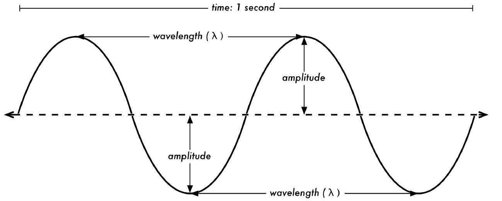
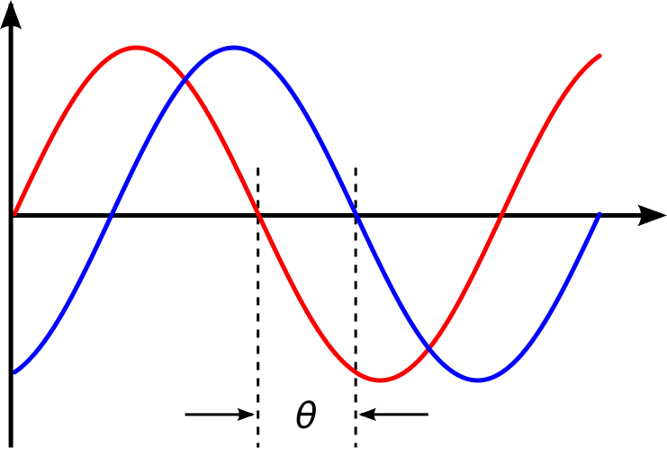
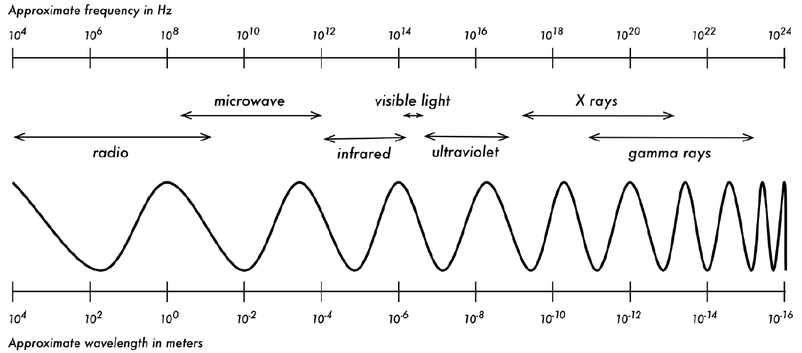
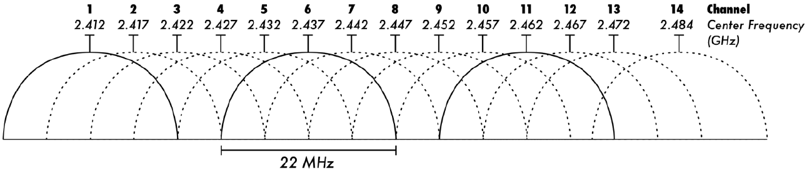
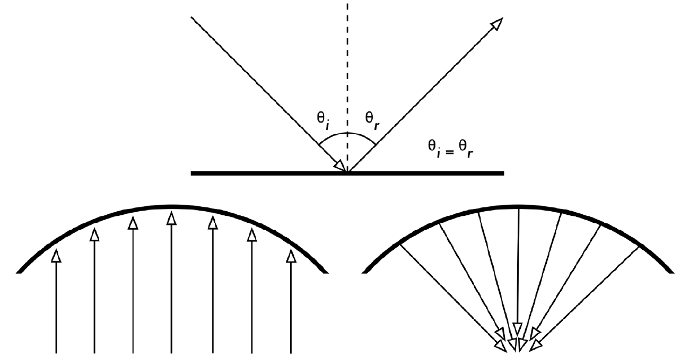
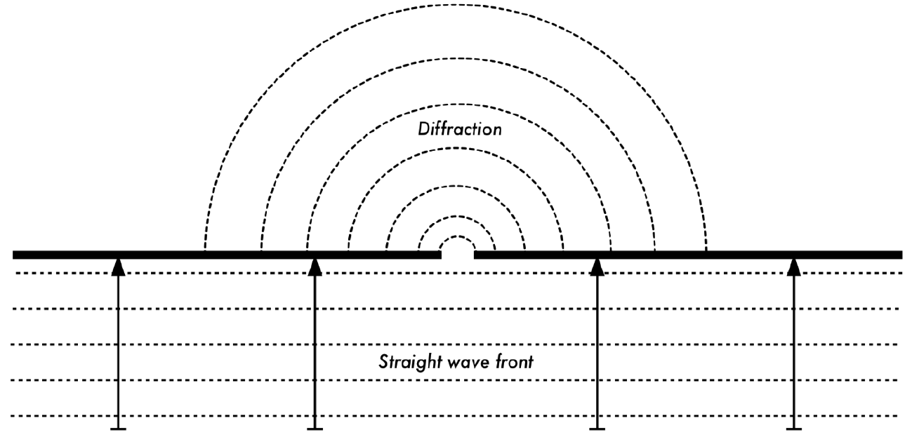
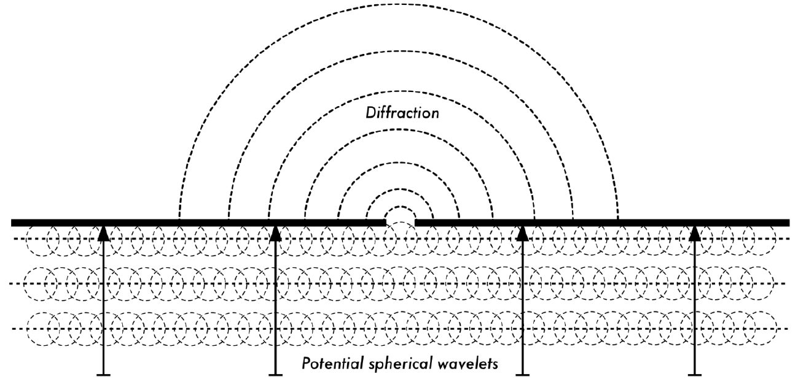
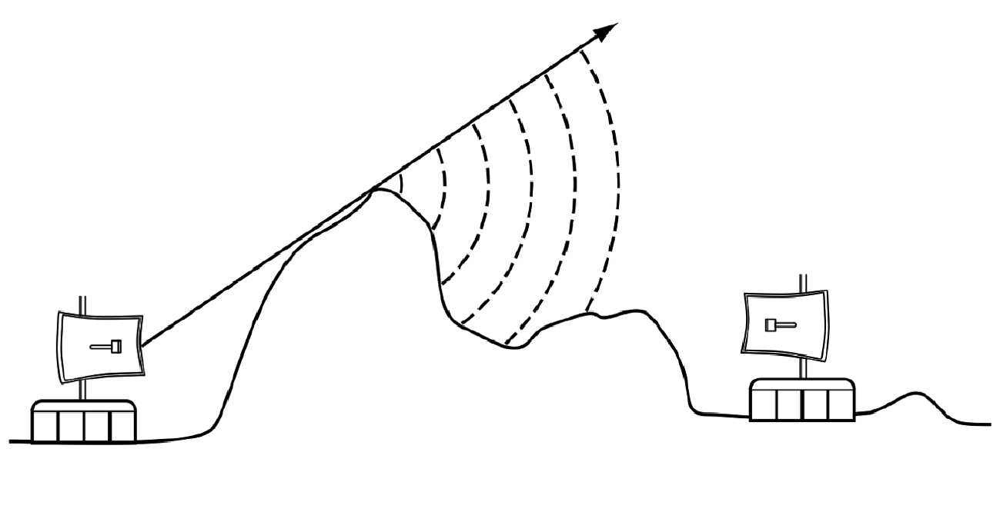
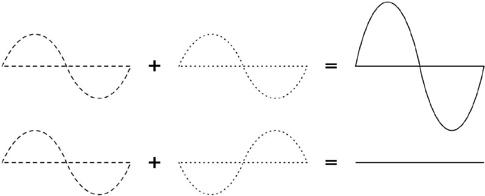
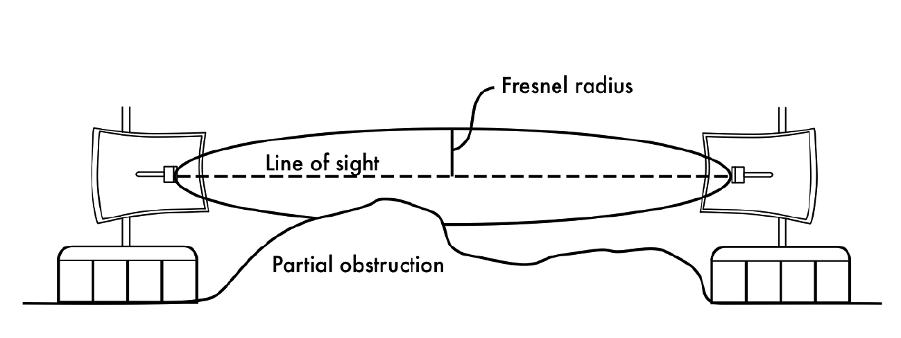

1. RADIO PHYSICS
----------------

 

Wireless communications make use of electromagnetic waves to send
signals across long distances. From a user’s perspective, wireless
connections are not particularly different from any other network
connection: your web browser, email, and other applications all work as
you would expect. But radio waves have some unexpected properties
compared to Ethernet cable. For example, it’s very easy to see the path
that an Ethernet cable takes: locate the plug sticking out of your
computer, follow the cable to the other end, and you’ve found it! You
can also be confident that running many Ethernet cables alongside each
other won’t cause problems, since the cables effectively keep their
signals contained within the wire itself.

But how do you know where the waves emanating from your wireless device
are going? What happens when these waves bounce off objects in the room
or other buildings in an outdoor link? How can several wireless cards be
used in the same area without interfering with each other?

In order to build stable high-speed wireless links, it is important to
understand how radio waves behave in the real world.

### What is a wave?

We are all familiar with vibrations or oscillations in various forms: a
pendulum, a tree swaying in the wind, the string of a guitar - these are
all examples of oscillations.

What they have in common is that something, some medium or object, is
swinging in a periodic manner, with a certain number of cycles per unit
of time. This kind of wave is sometimes called a mechanical wave, since
it is defined by the motion of an object or its propagating medium.

When such oscillations travel (that is, when the swinging does not stay
bound to one place) then we speak of waves propagating in space. For
example, a singer singing creates periodic oscillations in his or her
vocal cords. These oscillations periodically compress and decompress the
air, and this periodic change of air pressure then leaves the singers
mouth and travels, at the speed of sound.

A stone plunging into a lake causes a disturbance, which then travels
across the lake as a wave.

A wave has a certain speed, frequency, and wavelength.

These are connected by a simple relation:

 

Speed = Frequency \* Wavelength

 

The wavelength (sometimes referred to as lambda, λ) is the distance
measured from a point on one wave to the equivalent part of the next
(or, in a more technical way, to the next point that is in the same
phase), for example from the top of one peak to the next.

The frequency is the number of whole waves that pass a fixed point in a
period of time. Speed is measured in metres/second, frequency is
measured in cycles per second (or Hertz, represented by the symbol Hz),
and wavelength is measured in metres. For example, if a wave on water
travels at one metre per second, and it oscillates five times per
second, then each wave will be twenty centimetres long:

 

1 metre/second = 5 cycles/second \*W

        W = 1 / 5 metres

                    W = 0.2 metres = 20 cm

 

Waves also have a property called amplitude. This is the distance from
the centre of the wave to the extreme of one of its peaks, and can be
thought of as the “height” of a water wave. Frequency, wavelength, and
amplitude are shown in Figure RP 1.

 

 

 

Figure RP 1: Wavelength, amplitude, and frequency. For this wave, the
frequency is 2 cycles per second, or 2 Hz, while the speed is 1 m/s.

 

Waves in water are easy to visualize.

Simply drop a stone into the lake and you can see the waves as they move
across the water over time. In the case of electromagnetic waves, the
part that might be hardest to understand is: “What is it that is
oscillating?”

In order to understand that, you need to understand electromagnetic
forces.

### Electromagnetic forces

Electromagnetic forces are the forces between electrical charges and
currents. Our most direct access to those is when our hand touches a
door handle after walking on synthetic carpet, or brushing up against an
electrical fence.

A more powerful example of electromagnetic forces is the lightning we
see during thunderstorms.

The electrical force is the force between electrical charges.

The magnetic force is the force between electrical currents.

Electrons are particles that carry a negative electrical charge. There
are other charged particles too, but it is the electrons that are
responsible for most of what we need to know about how radio behaves.

Let us look at what is happening in a piece of straight vertical wire,
in which we push the electrons from one end to the other and back,
periodically. At one moment, the top of the wire is negatively charged -
all the negative electrons are gathered there. This creates an electric
field from the positively charged end to the negatively charged one
along the wire.

The next moment, the electrons have all been driven to the other side,
and the electric field points the other way. As this happens again and
again, the electric field vectors (represented by arrows from plus to
minus) are leaving the wire, so to speak, and are radiated out into the
space around the wire.

What we have just described is known as a dipole (because of the two
differently charged poles, plus and minus, that are created in the
straight vertical wire), or more commonly a dipole antenna.

This is the simplest form of an omnidirectional antenna. The moving
electric field is commonly referred to as an electromagnetic wave
because there is also an associated magnetic field. A moving electric
field, such as a wave, always comes together with a magnetic field - you
will not find one with out the other. Why is this the case?

An electric field is caused by electrically charged objects.

A moving electric field is produced by moving electrically charged
objects, such as we have just described above in a dipole antenna.

 

Wherever electrical charges are moving, they induce a magnetic field.
Mathematically, this is formulated in Maxwell's equations:
[https://en.wikipedia.org/wiki/Electromagnetic\_field\#Mathematical\_description](https://en.wikipedia.org/wiki/Electromagnetic_field#Mathematical_description)

 

Since the electrical and magnetic components are tied together in this
way, we speak of an electromagnetic field.

In practical wireless networking, we focus in the electrical component
but there be always a magnetic component as well.

 

Let us come back to the relation:

 

Speed = Frequency \* Wavelength

 

In the case of electromagnetic waves, the speed is c, the speed of
light.

 

c = 300,000 km/s = 300,000,000 m/s = 3\*108 m/s

 

c = f \* λ

 

Electromagnetic waves differ from mechanical waves in that they require
no medium in which to propagate. Electromagnetic waves will even
propagate through perfect vacuum.

The light from the stars is a good example: it reaches us through the
vacuum of space.

### Symbols of the international system of units

In physics, maths, and engineering, we often express numbers by powers
of ten.

We will meet these terms again, and the symbols used to represent them,
e.g. gigahertz (GHz), centimetres (cm), microseconds (µs), and so on.

 

These symbols are part of the international system of measurement SI
([http://www.bipm.org/utils/common/pdf/si\_brochure\_8\_en](http://www.bipm.org/utils/common/pdf/si_brochure_8_en.pdf).pdf),
they are not abbreviations and should not be changed.

The case is significant and should not be altered.

SI symbols

atto

10 − 18

 

1/1000000000000000000

a

femto

10 − 15

 

1/1000000000000000

f

pico

10 − 12

 

1/1000000000000

p

nano

10 − 9

 

1/1000000000

n

micro

10 − 6

 

1/1000000

µ

milli

10 − 3

 

1/1000

m

centi

10 − 2

 

1/100

c

kilo

10 3

 

1000

k

mega

10 6

 

1000000

M

giga

10 9

 

1000000000

G

tera

10 12

 

1000000000000

T

peta

10 15

 

1000000000000000

P

exa

10 18

 

1000000000000000000

E

 

Knowing the speed of light, we can calculate the wavelength for a given
frequency. Let us take the example of the frequency of 802.11b wireless
networking, which is:

 

f = 2.4 GHz = 2,400,000,000 cycles / second

 

wavelength (λ) = c / f = 3\*108 / 2.4\*109 = 1.25\*10-1 m = 12.5 cm

 

Frequency and therefore wavelength determine most of an electromagnetic
wave’s behaviour. It governs the dimensions of the antennas that we
build as well as the effect of the interactions with objects that are in
the propagation path, including the biological effects in living beings.

Wireless standards of course are distinguished by more than just the
frequency they are working at - for example, 802.11b, 802.11g, 802.11n
and 802.16 can all work at 2.4 GHz -, yet they are very different from
one another.

The chapter called Telecommunications Basics will discuss modulation
techniques, media access techniques, and other relevant features of
wireless communications standards. However, the basic capabilities of
electromagnetic waves to penetrate objects, to go long distances, and so
forth - these are determined by physics alone. The electromagnetic wave
"does not know or care" what modulation or standard or technique you put
on top of it. So, while different standards may implement advanced
techniques to deal with NLOS (Non Line of Sight), multipath and so forth
- they still cannot make a wave go through a wall, if that wall is
absorbing the respective frequency. Therefore, an understanding of the
basic ideas of frequency and wavelength helps a lot in practical
wireless work.

### Phase

Later in this chapter, we will talk about concepts like interference,
multipath and Fresnel zones. In order to understand these, we will need
to know about the phase of a wave, or rather, phase differences between
waves. Look at the sine wave shown in Fig RP 1 - now imagine we have two
such waves moving. These can be in exactly the same position: Where the
one has its peak, the other one also has a peak. Then, we would say,
they are in phase, or, their phase difference is zero. But one wave
could also be displaced from the other, for example it could have its
peak where the other wave is at zero. In this case, we have a phase
difference. This phase difference can be expressed in fractions of the
wavelength, e.g. λ//4, or in degrees, e.g. 90 degrees - with one full
cycle of the wave being 360 degrees. A phase difference of 360 degrees
is the same as that of 0 degrees: no phase difference.

 

 

### Polarization

Another important quality of electromagnetic waves is polarization.
Polarization describes the direction of the electrical field vector.

If you imagine a vertically aligned dipole antenna (the straight piece
of wire), electrons can only move up and down, not sideways (because
there is no room to move) and thus electrical fields only ever point up
or down, vertically. The field leaving the wire and travelling as a wave
has a strict linear (and in this case, vertical) polarization. If we put
the antenna flat on the ground, we would find horizontal linear
polarization.

 

 

Figure RP 3: Vertically polarized electromagnetic wave

 

Linear polarization is just one special case, and is never quite so
perfect: in general, we will always have some component of the field
pointing in other directions too. If we combine two equal dipoles fed
with the same signal, we can generate a circularly polarized wave, in
which the electric field vector keeps rotating perpendicularly to the
wave's trajectory.

The most general case is elliptical polarization, in which the electric
field vector maximum value is not the same in the vertical and
horizontal direction. As one can imagine, polarization becomes important
when aligning antennas. If you ignore polarization, you might have very
little signal even though you have the best antennas. We call this
polarization mismatch.

Much in the same way, polarization may also be used in a smart way, to
keep two wireless links independent and without interference, even
though they might use the same end points (or even share a common
reflector) and therefore the same trajectory: if one link is polarized
vertically and the other horizontally, they will not "see" each other.
This is a convenient way to double data rates over one link using a
single frequency.

The antennas used in this kind of application must be carefully built in
order to reject the "unwanted" polarization, i.e. an antenna meant for
vertical polarization must not receive or transmit any horizontally
polarized signal, and vice versa. We say they must have a high "cross
polarization" rejection.

### The electromagnetic spectrum

Electromagnetic waves span a wide range of frequencies (and,
accordingly, wavelengths). This range of frequencies or wavelengths is
called the electromagnetic spectrum. The part of the spectrum most
familiar to humans is probably light, the visible portion of the
electromagnetic spectrum. Light lies roughly between the frequencies of
7.5\*1014 Hz and 3.8\*1014 Hz, corresponding to wavelengths from circa
400 nm (violet/blue) to 800 nm (red).

We are also regularly exposed to other regions of the electromagnetic
spectrum, including Alternating Current (AC) or grid electricity at
50/60 Hz, AM and FM radio, Ultraviolet (at frequencies higher than those
of visible light), Infrared (at frequencies lower than those of visible
light),

X-Ray radiation, and many others.

 

Radio is the term used for the portion of the electromagnetic spectrum
in which waves can be transmitted by applying alternating current to an
antenna. This is true for the range from 30 kHz to 300 GHz, but in the
more narrow sense of the term, the upper frequency limit would be about
1 GHz, above which we talk of microwaves and millimetric waves.

When talking about radio, many people think of FM radio, which uses a
frequency around 100 MHz. In between radio and infrared we find the
region of microwaves - with frequencies from about 1 GHz to 300 GHz, and
wavelengths from 30 cm to 1 mm.

The most popular use of microwaves might be the microwave oven, which in
fact works in exactly the same region as the wireless standards we are
dealing with. These regions lie within the bands that are being kept
open for general unlicensed use. This region is called the ISM band,
which stands for Industrial, Scientific, and Medical.

Most other parts of the electromagnetic spectrum are tightly controlled
by licensing legislation, with license values being a huge economic
factor. In many countries the right to use portions of the spectrum have
been sold to communications companies for millions of dollars. In most
countries, the ISM bands have been reserved for unlicensed use and
therefore do not have to be paid for when used.

 

 

 

Figure RP 4: The electromagnetic spectrum.

 

The frequencies most interesting to us are 2.400 - 2.495 GHz, which is
used by the 802.11b and 802.11g standards (corresponding to wavelengths
of about 12.5 cm), and 5.150 - 5.850 GHz (corresponding to wavelengths
of about 5 to 6 cm), used by 802.11a. The 802.11n standard can work in
either of these bands.

See the Chapter called WiFi Family for an overview of standards and
frequencies. In addition you can find out more about the Radio portion
of the electromagnetic spectrum in the Chapter called Radio Spectrum.

### Bandwidth

A term you will meet often in radio physics is bandwidth. Bandwidth is
simply a measure of frequency range. If a range of 2.40 GHz to 2.48 GHz
is used by a device, then the bandwidth would be 0.08 GHz (or more
commonly stated as 80 MHz).

It is easy to see that the bandwidth we define here is closely related
to the amount of data you can transmit within it - the more room in
frequency space, the more data you can fit in at a given moment. The
term bandwidth is often used for something we should rather call data
rate, as in “my Internet connection has 1 Mbps of bandwidth”, meaning it
can transmit data at 1 megabit per second. How much exactly you can fit
into a physical signal will depend on the modulation, encoding and other
techniques. For example, 802.11g uses the same bandwidth as 802.11b,
however it fits more data into those same frequency ranges transmitting
up to 5 times more bits per second.

Another example we have mentioned: you may double your data rate by
adding a second link at perpendicular polarization to an existing

radio link. Here, frequency and bandwidth have not changed, however the
data rate is doubled.

### Frequencies and channels

Let us look a bit closer at how the 2.4 GHz band is used in 802.11b. The
spectrum is divided into evenly sized pieces distributed over the band
as individual channels. Note that channels are 22 MHz wide, but are only
separated by 5 MHz.

 

 

Figure RP 5: Channels and centre frequencies for 802.11b.

Note that channels 1, 6, and 11 do not overlap.

### Behaviour of radio waves

There are a few simple rules of thumb that can prove extremely useful
when making first plans for a wireless network:

 

-   the longer the wavelength, the further it goes; 

-   the longer the wavelength, the better it travels through and around
    things; 

-   the shorter the wavelength, the more data it can transport. 

 

All of these rules, simplified as they may be, are rather easy to
understand by example.

 

Longer waves travel further

Waves with longer wavelengths tend to travel further than waves with
shorter wavelengths. As an example, AM radio stations have a much
greater range than FM stations, which use a frequency 100 times higher.
Lower frequency transmitters tend to reach much greater distances than
high frequency transmitters at the same power.

 

Longer waves pass around obstacles

A wave on water which is 5 metres long will not be affected by a 5 mm
piece of wood floating on the water. If instead the piece of wood were
50 metres big (e.g. a ship), it would modify the behavior of the wave.

 

The distance a wave can travel depends on the relationship between the
wavelength of the wave and the size of obstacles in its path of
propagation. It is harder to visualize waves moving “through” solid
objects, but this is the case with electromagnetic waves. Longer
wavelength (and therefore lower frequency) waves tend to penetrate
objects better than shorter wavelength (and therefore higher frequency)
waves.

 

For example, FM radio (88-108 MHz) can travel through buildings and
other obstacles easily, while shorter waves (such as GSM phones
operating at 900 MHz or 1800 MHz) have a harder time penetrating
buildings.

This effect is partly due to the difference in power levels used for FM
radio and GSM, but is also partly due to the shorter wavelength of GSM
signals. At much higher frequencies, visible light does not go through a
wall or even 1 mm of wood - as we all know, from practical experience.

But metal will stop any kind of electromagnetic wave.

Shorter waves can carry more data

The faster the wave swings or beats, the more information it can carry -
every beat or cycle could for example be used to transport a digital
bit, a '0' or a '1', a 'yes' or a 'no'.

So the data rate scales with bandwidth, and can be further enhanced by
advanced modulation and media access techniques such as OFDM, and MIMO
(Multiple Input, Multiple Output).

### The Huygens Principle

There is another principle that can be applied to all kinds of waves,
and which is extremely useful for understanding radio wave propagation.

This principle is known as the Huygens Principle, named after Christiaan
Huygens, Dutch mathematician, physicist and astronomer, 1629 - 1695.

 

Imagine you are taking a little stick and dipping it vertically into a
still lake's surface, causing the water to swing and dance. Waves will
leave the centre of the stick - the place where you dip in - in circles.
Now, wherever water particles are swinging and dancing, they will cause
their neighbor particles to do the same: from every point of
disturbance, a new circular wave will start. This is, in simple form,
the Huygens principle. In the words of wikipedia.org:

“The Huygens' principle is a method of analysis applied to problems of
wave propagation in the far field limit. It recognizes that each point
of an advancing wave front is in fact the centre of a fresh disturbance
and the source of a new train of waves; and that the advancing wave as a
whole may be regarded as the sum of all the secondary waves arising from
points in the medium already traversed”.

 

This view of wave propagation helps better understand a variety of wave
phenomena, such as diffraction.” This principle holds true for radio
waves as well as waves on water, for sound as well as light, but for
light the wavelength is far too short for human beings to actually see
the effects directly.

This principle will help us to understand diffraction as well as Fresnel
zones, and the fact that sometimes we seem to be able to transmit around
corners, with no line of sight.

Let us now look into what happens to electromagnetic waves as they
travel.

### Absorption

When electromagnetic waves go through 'something' (some material), they
generally get weakened or dampened.

How much they lose in power will depend on their frequency and of course
the material.

Clear window glass is obviously transparent for light, while the glass
used in sunglasses filters out quite a share of the light intensity and
most of the ultraviolet radiation.

Often, an absorption coefficient is used to describe a material’s impact
on radiation.

 

For microwaves, the two main absorbent materials are:

 

Metal. Electrons can move freely in metals, and are readily able to
swing and thus absorb the energy of a passing wave.

Water. Microwaves cause water molecules to jostle around, thus taking
away some of the wave’s energy.

 

For the purpose of practical wireless networking, we may well consider
metal and water perfect absorbers: we will not be able to go through
them (although thin layers of water will let some power pass). They are
to microwave what a brick wall is to light.

 

When talking about water, we have to remember that it comes in different
forms: rain, fog and mist, low clouds and so forth, all will be in the
way of radio links. They have a strong influence, and in many
circumstances a change in weather can bring a radio link down.

 

When talking about metal, keep in mind that it may be found in
unexpected places: it may be hidden in walls (for example, as metal
grids in concrete) or be a thin coat on modern types of glass (tinted
glass, colored glass).

However thin the layer of metal, it might be enough to significantly
absorb a radio wave.

 

There are other materials that have a more complex effect on radio
absorption. For trees and wood, the amount of absorption depends on how
much water they contain.

Old dead dry wood is more or less transparent, wet fresh wood will
absorb a lot. Plastics and similar materials generally do not absorb a
lot of radio energy, but this varies depending on the frequency and type
of material.

Lastly, let us talk about ourselves: humans (as well as other animals)
are largely made out of water.

 

As far as radio networking is concerned, we may well be described as big
bags of water, with the same strong absorption.

Orienting an office access point in such a way that its signal must pass
through many people is a key mistake when building office networks.

The same goes for hotspots, cafe installations, libraries, and outdoor
installations.

### Reflection

Just like visible light, radio waves are reflected when they come in
contact with materials that are suited for that: for radio waves, the
main sources of reflection are metal and water surfaces.

The rules for reflection are quite simple: the angle at which a wave
hits a surface is the same angle at which it gets deflected.

 

Note that in the eyes of a radio wave, a dense grid of bars acts just
the same as a solid surface, as long as the distance between bars is
small compared to the wavelength.

 

At 2.4 GHz, a one cm metal grid will act much the same as a metal plate.

 

Although the rules of reflection are quite simple, things can become
very complicated when you imagine an office interior with many many
small metal objects of various complicated shapes.

The same goes for urban situations: look around you in city environment
and try to spot all of the metal objects.

This explains why multipath effects (i.e. signal reaching their target
along different paths, and therefore at different times) play such an
important role in wireless networking.

Water surfaces, with waves and ripples changing all the time,
effectively make for a very complicated reflection object which is more
or less impossible to calculate and predict precisely.

 

 

Figure RP 6: Reflection of radio waves. The angle of incidence is always
equal to the angle of reflection. A metal parabolic surface uses this
effect to concentrate radio waves spread out over it in a common
direction.

 

We should also add that polarization has an impact: waves of different
polarization in general will be reflected differently.

We use reflection to our advantage in antenna building: e.g. we put huge
parabolas behind our radio transmitter/receiver to collect and bundle
the radio signal into a single point, the focal point.

### Diffraction

Diffraction is the apparent bending of waves when hitting an object.

It is the effect of “waves going around corners”. Imagine a wave on
water traveling in a straight wave front, just like a wave that we see
rolling onto an ocean beach.

Now we put a solid barrier, say a wooden solid fence, in its way to
block it. We cut a narrow slit opening into that wall, like a small
door.

From this opening, a circular wave will start, and it will of course
reach points that are not in a direct line behind this opening, but also
on either side of it. If you look at this wavefront - and it might just
as well be an electromagnetic wave - as a beam (a straight line), it
would be hard to explain how it can reach points that should be hidden
by a barrier.

When modelled as a wavefront, the phenomenon makes sense.

 

 

Figure RP 7: Diffraction through a narrow slit.

 

The Huygens Principle provides one model for understanding this
behavior. Imagine that at any given instant, every point on a wavefront
can be considered the starting point for a spherical “wavelet”.

This idea was later extended by Fresnel, and whether it adequately
describes the phenomenon is still a matter of debate. But for our
purposes, the Huygens model describes the effect quite well.

 

 

Figure RP 8: The Huygens Principle.

 

Through means of the effect of diffraction, waves will “bend” around
corners or spread through an opening in a barrier.

The wavelengths of visible light are far too small for humans to observe
this effect directly.

Microwaves, with a wavelength of several centimeters, will show the
effects of diffraction when waves hit walls, mountain peaks, and other
obstacles. It seems as if the obstruction causes the wave to change its
direction and go around corners.

 

Figure RP 9: Diffraction over a mountain top.

 

Note that diffraction comes at the cost of power: the energy of the
diffracted wave is significantly less than that of the wavefront that
caused it. But in some very specific applications, you can take
advantage of the diffraction effect to circumvent obstacles.

### Interference

Interference is one of the most misunderstood terms and phenonema in
wireless networking.

Interference often gets the blame when we are too lazy to find the real
problem, or when a regulator wants to shut down someone else's network
for business reasons. So, why all the misunderstandings?

It is mostly because different people mean different things though they
are using the same word.

A physicist and a telecommunications engineer will use the word
"Interference" in very different ways. The physicists' view will be
concerned with the "behaviour of waves". The telecommunications engineer
will talk about “... any noise that gets in the way”.

Both views are relevant in wireless, and it is important to be able to
know them both and know the difference. Let us start with the
physicists' view:

When working with waves, one plus one does not necessarily equal two. It
can also result in zero.

 

 

Figure RP 10: Constructive and destructive interference.

 

This is easy to understand when you draw two sine waves and add up the
amplitudes. When the phase difference is zero, peak hits peak, and you
will have maximum results (1 + 1 = 2).

This is called constructive interference.

When the phase difference is 180 degrees, or λ/2, peak hits valley, and
you will have complete annihilation ((1 + (-)1 = 0) - destructive
interference.

You can actually try this with waves on water and two little sticks to
create circular waves - you will see that where two waves cross, there
will be areas of higher wave peaks and others that remain almost flat
and calm. In order for whole trains of waves to add up or cancel each
other out perfectly, they have to have the exact same wavelength and a
fixed phase relation.

You can see obvious examples of interference in action when you look at
the way that antennas are arranged in what are called beamforming
arrays, in order to give maximum constructive interference in the
directions where you want the signal, and destructive interference (no
signal) where you want no signal.

Technically, this is achieved by a combination of physical dimensioning
and control of phase shifts.

 

Simplified, imagine that you have three antennas - and you don't want
antenna 3 to pick up signal from antenna 1 and 2. You would then place
antenna 3 at a position where the signals from antennas 1 and 2 cancel
each other out.

Now let us have a look at the way the word interference is typically
used: in a wider sense, for any disturbance through other RF sources,
any noise that might get in our way, e.g. from neighboring channels or
competing providers. So, when wireless networkers talk about
interference they typically talk about all these kinds of disturbance by
other networks, and any other sources of microwave, whether it has
exactly the same frequency and a fixed phase relation or not.
Interference of this kind is one of the main sources of difficulty in
building wireless links, especially in urban environments or closed
spaces (such as a conference space) where many networks may compete for
use of the spectrum.

But, interference of this kind is also often overrated: for example,
imagine you had to build a point to point link that has to cross a
crowded inner city area, before reaching its target on the other side of
the city. Such a highly directional beam will cross the "electric smog"
of the urban centre without any problem. You may imagine this like a
green and a red light beam crossing each other in a 90 degrees angle:
while both beams will overlap in a certain area, the one will not have
any impact on the other at all.

Generally, managing spectrum and coexistence has become a main issue
especially in dense indoor environments and urban areas.

### Line of sight

The term line of sight, often abbreviated as LOS, is quite easy to
understand when talking about visible light: if we can see a point B
from point A where we are, we have line of sight. Simply draw a line
from A to B, and if nothing is in the way, we have line of sight.

Things get a bit more complicated when we are dealing with microwaves.
Remember that most propagation characteristics of electromagnetic waves
scale with their wavelength.

This is also the case for the widening of waves as they travel.

Light has a wavelength of about 0.5 micrometres, microwaves as used in
wireless networking have a wavelength of a few centimetres.

Consequently, their beams are a lot wider - they need more space, so to
speak.

 

 

Note that visible light beams widen just the same, and if you let them
travel long enough, you can see the results despite their short
wavelength. When pointing a well focussed laser at the moon, its beam
will widen to well over 100 metres in radius by the time it reaches the
surface. You can see this effect for yourself using an inexpensive laser
pointer and a pair of binoculars on a clear night. Rather than pointing
at the moon, point at a distant mountain or unoccupied structure (such
as a water tower). The radius of your beam will increase as the distance
increases. This is due to the diffraction.

 

The line of sight that we need in order to have an optimal wireless
connection from A to B is more than just a thin line - its shape is more
like that of a cigar, an ellipsoid. Its width can be described by the
concept of Fresnel zones - see next section for an explanation. You will
also find the abbreviation NLOS, for "non line of sight", which is
mostly used to describe and advertise technologies that allow for
dealing with waves that reach the receiver through multiple trajectories
(multipath) or diffraction. It does not indicate that the single
electromagnetic beam goes "around corners" (other than through
diffraction) or "through obstacles" any better than that of other
technologies. For example, you might call White Space technology NLOS,
as its lower frequencies (longer wavelengths) allow it to permeate
objects and utilize diffraction much better than comparable 2.4 GHz or 5
GHz transmissions.

### Understanding the Fresnel zone

The exact theory of Fresnel (pronounced “Fray-nell”) zones is quite
complicated. However, the concept is quite easy to understand: we know
from the Huygens principle that at each point of a wavefront new
circular waves start, we know that microwave beams widen as they leave
the antenna, we know that waves of one frequency can interfere with each
other. Fresnel zone theory simply looks at a line from A to B, and then
at the space around that line that contributes to what is arriving at
point B. Some waves travel directly from A to B, while others travel on
paths off axis and reach the receiver by reflection.

Consequently, their path is longer, introducing a phase shift between
the direct and indirect beam.

Whenever the phase shift is one half wavelength, you get destructive
interference: the signals cancel.

Taking this approach you find that when the reflected path is less than
half a wavelength longer than the direct path, the reflections will add
to the received signal. Conversely, when the reflected path length
exceeds the direct path by more than one half wavelength, its
contribution will decrease the received power.

 

Figure RP 11: The Fresnel zone is partially blocked on this link,
although the visual line of sight appears clear.

 

Note that there are many possible Fresnel zones, but we are chiefly
concerned with the first zone, because the contributions from the second
zone are negative. The contributions from the third zone are positive
again, but there is no practical way to take advantage of those without
the penalty incurred in going through the second Fresnel Zone.

If the first Fresnel zone is partially blocked by an obstruction, e.g. a
tree or a building, the signal arriving at the far end would be
diminished. When building wireless links, we therefore need to be sure
that the first zone is kept free of obstructions. In practice, it is not
strictly necessary that the whole of this zone is clear, in wireless
networking we aim to clear about 60 percent of the radius of the first
Fresnel zone.

 

Here is one formula for calculating the radius of the first Fresnel
zone:

 

r = 17.31 ( ( d 1 ∗ d 2 ) ( f ∗ d ) )
![](data:image/*;base64,VkNMTVRGAQAxAAAAAAAAAAEAGwAAAAAAAAAAAAAAAAABAAAAAQAAAAEAAAABAAAAAckOAAC8BAAAmAAAAJYAAQACAAAACQCLAAEAAgAAAP//gQABABAAAAAAAAAAAAAAAMgOAAC7BAAAlQABAAQAAAAAAAAAlgABAAIAAAAJAIsAAQACAAAAHwCKAAEAQQAAAAMAOwAAAA8AVGltZXMgTmV3IFJvbWFuAAAAAAAApwEAAAAAAwAAAAUAAAAAAAIA/wMAAAAAAAAAAAD/AwAAAAAAiAABAAIAAAABAIcAAQAFAAAA/////wCGAAEABAAAAAAAAAByAAIAFwAAAHMAAAARAwAAAQBypQAAAAAA//8BAHIAjAABAAAAAACLAAEAAgAAAB8AigABADwAAAADADYAAAAKAE9wZW5TeW1ib2wAAAAAAACnAQAA//8AAAAABQAAAAAAAAD/AwAAAAAAAAAAAP8DAAAAAACIAAEAAgAAAAEAhwABAAUAAAD/////AIYAAQAEAAAAAAAAAHIAAgAaAAAAQwEAABEDAAABAAAAPQBQAQAAAAD//wEAPQCMAAEAAAAAAIsAAQACAAAAHwCKAAEAQQAAAAMAOwAAAA8AVGltZXMgTmV3IFJvbWFuAAAAAAAApwEAAAAAAwAAAAUAAAAAAAAA/wMAAAAAAAAAAAD/AwAAAAAAiAABAAIAAAABAIcAAQAFAAAA/////wCGAAEABAAAAAAAAAByAAIAIwAAAIcCAAARAwAABQAxNy4zMbgDAAAAAP//BQAxADcALgAzADEAjAABAAAAAACLAAEAAgAAAB8AigABADwAAAADADYAAAAKAE9wZW5TeW1ib2wAAKcBAABfBQAA//8AAAAABQAAAAAAAAD/AwAAAAAAAAAAAP8DAAAAAACIAAEAAgAAAAEAhwABAAUAAAD/////AIYAAQAEAAAAAAAAAHIAAgAaAAAAfwYAAGsEAAABAAAAGiLhAAAAAAD//wEAGiKMAAEAAAAAAIsAAQACAAAAHwCFAAEABQAAAAAAAAABhAABAAUAAAAAAAAAAIoAAQA8AAAAAwA2AAAACgBPcGVuU3ltYm9sAACnAQAAXwUAAP//AAAAAAUAAAAAAAAA/wMAAAAAAAAAAAD/AwAAAAAAiAABAAIAAAABAIcAAQAFAAAA/////wCGAAEABAAAAAAAAABnAAEAEAAAAGUHAAAXAAAAVg4AACUAAACMAAEAAAAAAIsAAQACAAAAHwCKAAEAPAAAAAMANgAAAAoAT3BlblN5bWJvbAAAAAAAAKcBAAD//wAAAAAFAAAAAAAAAP8DAAAAAAAAAAAA/wMAAAAAAIgAAQACAAAAAQCHAAEABQAAAP////8AhgABAAQAAAAAAAAAcgACABoAAABlBwAAEQMAAAEAAAAoAJAAAAAAAP//AQAoAIwAAQAAAAAAiwABAAIAAAAfAIoAAQA8AAAAAwA2AAAACgBPcGVuU3ltYm9sAAAAAAAApwEAAP//AAAAAAUAAAAAAAAA/wMAAAAAAAAAAAD/AwAAAAAAiAABAAIAAAABAIcAAQAFAAAA/////wCGAAEABAAAAAAAAAByAAIAGgAAADUIAADlAQAAAQAAACgAkAAAAAAA//8BACgAjAABAAAAAACLAAEAAgAAAB8AigABAEEAAAADADsAAAAPAFRpbWVzIE5ldyBSb21hbgAAAAAAAKcBAAAAAAMAAAAFAAAAAAACAP8DAAAAAAAAAAAA/wMAAAAAAIgAAQACAAAAAQCHAAEABQAAAP////8AhgABAAQAAAAAAAAAcgACABcAAADXCAAA5QEAAAEAZNMAAAAAAP//AQBkAIwAAQAAAAAAiwABAAIAAAAfAIoAAQBBAAAAAwA7AAAADwBUaW1lcyBOZXcgUm9tYW4AAAAAAAD9AAAAAAADAAAABQAAAAAAAAD/AwAAAAAAAAAAAP8DAAAAAACIAAEAAgAAAAEAhwABAAUAAAD/////AIYAAQAEAAAAAAAAAHIAAgAXAAAA1QkAAEECAAABADF+AAAAAAD//wEAMQCMAAEAAAAAAIsAAQACAAAAHwCKAAEAPAAAAAMANgAAAAoAT3BlblN5bWJvbAAAAAAAAKcBAAD//wAAAAAFAAAAAAAAAP8DAAAAAAAAAAAA/wMAAAAAAIgAAQACAAAAAQCHAAEABQAAAP////8AhgABAAQAAAAAAAAAcgACABoAAABICgAA5QEAAAEAAAAXIjIBAAAAAP//AQAXIowAAQAAAAAAiwABAAIAAAAfAIoAAQBBAAAAAwA7AAAADwBUaW1lcyBOZXcgUm9tYW4AAAAAAACnAQAAAAADAAAABQAAAAAAAgD/AwAAAAAAAAAAAP8DAAAAAACIAAEAAgAAAAEAhwABAAUAAAD/////AIYAAQAEAAAAAAAAAHIAAgAXAAAAdQsAAOUBAAABAGTTAAAAAAD//wEAZACMAAEAAAAAAIsAAQACAAAAHwCKAAEAQQAAAAMAOwAAAA8AVGltZXMgTmV3IFJvbWFuAAAAAAAA/QAAAAAAAwAAAAUAAAAAAAAA/wMAAAAAAAAAAAD/AwAAAAAAiAABAAIAAAABAIcAAQAFAAAA/////wCGAAEABAAAAAAAAAByAAIAFwAAAIoMAABBAgAAAQAyfgAAAAAA//8BADIAjAABAAAAAACLAAEAAgAAAB8AigABADwAAAADADYAAAAKAE9wZW5TeW1ib2wAAAAAAACnAQAA//8AAAAABQAAAAAAAAD/AwAAAAAAAAAAAP8DAAAAAACIAAEAAgAAAAEAhwABAAUAAAD/////AIYAAQAEAAAAAAAAAHIAAgAaAAAAFA0AAOUBAAABAAAAKQCQAAAAAAD//wEAKQCMAAEAAAAAAIsAAQACAAAAHwCFAAEABQAAAAAAAAABhAABAAUAAAAAAAAAAIoAAQA8AAAAAwA2AAAACgBPcGVuU3ltYm9sAAAAAAAApwEAAP//AAAAAAUAAAAAAAAA/wMAAAAAAAAAAAD/AwAAAAAAiAABAAIAAAABAIcAAQAFAAAA/////wCGAAEABAAAAAAAAABnAAEAEAAAAB4IAACeAgAAqg0AALICAACMAAEAAAAAAIsAAQACAAAAHwCKAAEAPAAAAAMANgAAAAoAT3BlblN5bWJvbAAAAAAAAKcBAAD//wAAAAAFAAAAAAAAAP8DAAAAAAAAAAAA/wMAAAAAAIgAAQACAAAAAQCHAAEABQAAAP////8AhgABAAQAAAAAAAAAcgACABoAAACSCAAAPQQAAAEAAAAoAJAAAAAAAP//AQAoAIwAAQAAAAAAiwABAAIAAAAfAIoAAQBBAAAAAwA7AAAADwBUaW1lcyBOZXcgUm9tYW4AAAAAAACnAQAAAAADAAAABQAAAAAAAgD/AwAAAAAAAAAAAP8DAAAAAACIAAEAAgAAAAEAhwABAAUAAAD/////AIYAAQAEAAAAAAAAAHIAAgAXAAAAkAkAAD0EAAABAGZ2AAAAAAD//wEAZgCMAAEAAAAAAIsAAQACAAAAHwCKAAEAPAAAAAMANgAAAAoAT3BlblN5bWJvbAAAAAAAAKcBAAD//wAAAAAFAAAAAAAAAP8DAAAAAAAAAAAA/wMAAAAAAIgAAQACAAAAAQCHAAEABQAAAP////8AhgABAAQAAAAAAAAAcgACABoAAABfCgAAPQQAAAEAAAAXIjIBAAAAAP//AQAXIowAAQAAAAAAiwABAAIAAAAfAIoAAQBBAAAAAwA7AAAADwBUaW1lcyBOZXcgUm9tYW4AAAAAAACnAQAAAAADAAAABQAAAAAAAgD/AwAAAAAAAAAAAP8DAAAAAACIAAEAAgAAAAEAhwABAAUAAAD/////AIYAAQAEAAAAAAAAAHIAAgAXAAAAowsAAD0EAAABAGTTAAAAAAD//wEAZACMAAEAAAAAAIsAAQACAAAAHwCKAAEAPAAAAAMANgAAAAoAT3BlblN5bWJvbAAAAAAAAKcBAAD//wAAAAAFAAAAAAAAAP8DAAAAAAAAAAAA/wMAAAAAAIgAAQACAAAAAQCHAAEABQAAAP////8AhgABAAQAAAAAAAAAcgACABoAAAChDAAAPQQAAAEAAAApAJAAAAAAAP//AQApAIwAAQAAAAAAiwABAAIAAAAfAIoAAQA8AAAAAwA2AAAACgBPcGVuU3ltYm9sAAAAAAAApwEAAP//AAAAAAUAAAAAAAAA/wMAAAAAAAAAAAD/AwAAAAAAiAABAAIAAAABAIcAAQAFAAAA/////wCGAAEABAAAAAAAAAByAAIAGgAAAM0NAAARAwAAAQAAACkAkAAAAAAA//8BACkAjAABAAAAAACVAAEABAAAAAAAAACWAAEAAgAAAAkAjAABAAAAAAA=)

 

...where r is the radius of the zone in metres, d1 and d2 are distances
from the obstacle to the link end points in metres, d is the total link
distance in metres, and f is the frequency in MHz.

The first Fresnel zone radius can also be calculated directly from the
wavelength as:

                        r = ( λ ∗ d 1 ∗ d 2 d )
![](data:image/*;base64,VkNMTVRGAQAxAAAAAAAAAAEAGwAAAAAAAAAAAAAAAAABAAAAAQAAAAEAAAABAAAAAb0LAACEBAAAdQAAAJYAAQACAAAACQCLAAEAAgAAAP//gQABABAAAAAAAAAAAAAAALwLAACDBAAAlQABAAQAAAAAAAAAlgABAAIAAAAJAIsAAQACAAAAHwCKAAEAQQAAAAMAOwAAAA8AVGltZXMgTmV3IFJvbWFuAAAAAAAApwEAAAAAAAAAAAUAAAAAAAIA/wMAAAAAAAAAAAD/AwAAAAAAiAABAAIAAAABAIcAAQAFAAAA/////wCGAAEABAAAAAAAAAByAAIAFwAAAHMAAAARAwAAAQBypQAAAAAA//8BAHIAjAABAAAAAACLAAEAAgAAAB8AigABADwAAAADADYAAAAKAE9wZW5TeW1ib2wAAAAAAACnAQAA//8AAAAABQAAAAAAAAD/AwAAAAAAAAAAAP8DAAAAAACIAAEAAgAAAAEAhwABAAUAAAD/////AIYAAQAEAAAAAAAAAHIAAgAaAAAAQwEAABEDAAABAAAAPQBQAQAAAAD//wEAPQCMAAEAAAAAAIsAAQACAAAAHwCKAAEAPAAAAAMANgAAAAoAT3BlblN5bWJvbAAApwEAAC0FAAD//wAAAAAFAAAAAAAAAP8DAAAAAAAAAAAA/wMAAAAAAIgAAQACAAAAAQCHAAEABQAAAP////8AhgABAAQAAAAAAAAAcgACABoAAACeAgAAPQQAAAEAAAAaIuEAAAAAAP//AQAaIowAAQAAAAAAiwABAAIAAAAfAIUAAQAFAAAAAAAAAAGEAAEABQAAAAAAAAAAigABADwAAAADADYAAAAKAE9wZW5TeW1ib2wAAKcBAAAtBQAA//8AAAAABQAAAAAAAAD/AwAAAAAAAAAAAP8DAAAAAACIAAEAAgAAAAEAhwABAAUAAAD/////AIYAAQAEAAAAAAAAAGcAAQAQAAAAhQMAABcAAABLCwAAJQAAAIwAAQAAAAAAiwABAAIAAAAfAIoAAQA8AAAAAwA2AAAACgBPcGVuU3ltYm9sAAAAAAAApwEAAP//AAAAAAUAAAAAAAAA/wMAAAAAAAAAAAD/AwAAAAAAiAABAAIAAAABAIcAAQAFAAAA/////wCGAAEABAAAAAAAAAByAAIAGgAAAIUDAAARAwAAAQAAACgAkAAAAAAA//8BACgAjAABAAAAAACLAAEAAgAAAB8AigABAEEAAAADADsAAAAPAFRpbWVzIE5ldyBSb21hbgAAAAAAAKcBAAAAAAAAAAAFAAAAAAACAP8DAAAAAAAAAAAA/wMAAAAAAIgAAQACAAAAAQCHAAEABQAAAP////8AhgABAAQAAAAAAAAAcgACABgAAACDBAAAzgEAAAIAzru3AAAAAAD//wEAuwOMAAEAAAAAAIsAAQACAAAAHwCKAAEAPAAAAAMANgAAAAoAT3BlblN5bWJvbAAAAAAAAKcBAAD//wAAAAAFAAAAAAAAAP8DAAAAAAAAAAAA/wMAAAAAAIgAAQACAAAAAQCHAAEABQAAAP////8AhgABAAQAAAAAAAAAcgACABoAAAAkBQAAzgEAAAEAAAAXIjIBAAAAAP//AQAXIowAAQAAAAAAiwABAAIAAAAfAIoAAQBBAAAAAwA7AAAADwBUaW1lcyBOZXcgUm9tYW4AAAAAAACnAQAAAAAAAAAABQAAAAAAAgD/AwAAAAAAAAAAAP8DAAAAAACIAAEAAgAAAAEAhwABAAUAAAD/////AIYAAQAEAAAAAAAAAHIAAgAXAAAAZwYAAM4BAAABAGTTAAAAAAD//wEAZACMAAEAAAAAAIsAAQACAAAAHwCKAAEAQQAAAAMAOwAAAA8AVGltZXMgTmV3IFJvbWFuAAAAAAAA/QAAAAAAAAAAAAUAAAAAAAAA/wMAAAAAAAAAAAD/AwAAAAAAiAABAAIAAAABAIcAAQAFAAAA/////wCGAAEABAAAAAAAAAByAAIAFwAAAGUHAABBAgAAAQAxfgAAAAAA//8BADEAjAABAAAAAACLAAEAAgAAAB8AigABADwAAAADADYAAAAKAE9wZW5TeW1ib2wAAAAAAACnAQAA//8AAAAABQAAAAAAAAD/AwAAAAAAAAAAAP8DAAAAAACIAAEAAgAAAAEAhwABAAUAAAD/////AIYAAQAEAAAAAAAAAHIAAgAaAAAA2QcAAM4BAAABAAAAFyIyAQAAAAD//wEAFyKMAAEAAAAAAIsAAQACAAAAHwCKAAEAQQAAAAMAOwAAAA8AVGltZXMgTmV3IFJvbWFuAAAAAAAApwEAAAAAAAAAAAUAAAAAAAIA/wMAAAAAAAAAAAD/AwAAAAAAiAABAAIAAAABAIcAAQAFAAAA/////wCGAAEABAAAAAAAAAByAAIAFwAAAAUJAADOAQAAAQBk0wAAAAAA//8BAGQAjAABAAAAAACLAAEAAgAAAB8AigABAEEAAAADADsAAAAPAFRpbWVzIE5ldyBSb21hbgAAAAAAAP0AAAAAAAAAAAAFAAAAAAAAAP8DAAAAAAAAAAAA/wMAAAAAAIgAAQACAAAAAQCHAAEABQAAAP////8AhgABAAQAAAAAAAAAcgACABcAAAADCgAAQQIAAAEAMn4AAAAAAP//AQAyAIwAAQAAAAAAiwABAAIAAAAfAIUAAQAFAAAAAAAAAAGEAAEABQAAAAAAAAAAigABADwAAAADADYAAAAKAE9wZW5TeW1ib2wAAAAAAACnAQAA//8AAAAABQAAAAAAAAD/AwAAAAAAAAAAAP8DAAAAAACIAAEAAgAAAAEAhwABAAUAAAD/////AIYAAQAEAAAAAAAAAGcAAQAQAAAAPQQAAIcCAACeCgAAmwIAAIwAAQAAAAAAiwABAAIAAAAfAIoAAQBBAAAAAwA7AAAADwBUaW1lcyBOZXcgUm9tYW4AAAAAAACnAQAAAAAAAAAABQAAAAAAAgD/AwAAAAAAAAAAAP8DAAAAAACIAAEAAgAAAAEAhwABAAUAAAD/////AIYAAQAEAAAAAAAAAHIAAgAXAAAA8gYAACYEAAABAGTTAAAAAAD//wEAZACMAAEAAAAAAIsAAQACAAAAHwCKAAEAPAAAAAMANgAAAAoAT3BlblN5bWJvbAAAAAAAAKcBAAD//wAAAAAFAAAAAAAAAP8DAAAAAAAAAAAA/wMAAAAAAIgAAQACAAAAAQCHAAEABQAAAP////8AhgABAAQAAAAAAAAAcgACABoAAADTCgAAEQMAAAEAAAApAJAAAAAAAP//AQApAIwAAQAAAAAAlQABAAQAAAAAAAAAlgABAAIAAAAJAIwAAQAAAAAA)

 

with all the variables in metres

 

It is apparent that the maximum value of the first Fresnel zone happens
exactly in the middle of the trajectory and its value can be found
setting d1=d2=d/2 in the preceding formulas. Note that the formulae give
you the radius of the zone, not the height above ground.

To calculate the height above ground, you need to subtract the result
from a line drawn directly between the tops of the two towers.

For example, let’s calculate the size of the first Fresnel zone in the
middle of a 2 km link, transmitting at 2.437 GHz (802.11b channel 6):

 

                        r = 17.31 [ ( 1000 ∗ 1000 ) ( 2437 ∗ 2000 ) ]
![](data:image/*;base64,VkNMTVRGAQAxAAAAAAAAAAEAGwAAAAAAAAAAAAAAAAABAAAAAQAAAAEAAAABAAAAAUISAACZBAAAigAAAJYAAQACAAAACQCLAAEAAgAAAP//gQABABAAAAAAAAAAAAAAAEESAACYBAAAlQABAAQAAAAAAAAAlgABAAIAAAAJAIsAAQACAAAAHwCKAAEAQQAAAAMAOwAAAA8AVGltZXMgTmV3IFJvbWFuAAAAAAAApwEAAAAAAAAAAAUAAAAAAAIA/wMAAAAAAAAAAAD/AwAAAAAAiAABAAIAAAABAIcAAQAFAAAA/////wCGAAEABAAAAAAAAAByAAIAFwAAAHMAAAD6AgAAAQBypQAAAAAA//8BAHIAjAABAAAAAACLAAEAAgAAAB8AigABADwAAAADADYAAAAKAE9wZW5TeW1ib2wAAAAAAACnAQAA//8AAAAABQAAAAAAAAD/AwAAAAAAAAAAAP8DAAAAAACIAAEAAgAAAAEAhwABAAUAAAD/////AIYAAQAEAAAAAAAAAHIAAgAaAAAAQwEAAPoCAAABAAAAPQBQAQAAAAD//wEAPQCMAAEAAAAAAIsAAQACAAAAHwCKAAEAQQAAAAMAOwAAAA8AVGltZXMgTmV3IFJvbWFuAAAAAAAApwEAAAAAAAAAAAUAAAAAAAAA/wMAAAAAAAAAAAD/AwAAAAAAiAABAAIAAAABAIcAAQAFAAAA/////wCGAAEABAAAAAAAAAByAAIAIwAAAIcCAAD6AgAABQAxNy4zMbgDAAAAAP//BQAxADcALgAzADEAjAABAAAAAACLAAEAAgAAAB8AigABADwAAAADADYAAAAKAE9wZW5TeW1ib2wAAKcBAAA0BQAA//8AAAAABQAAAAAAAAD/AwAAAAAAAAAAAP8DAAAAAACIAAEAAgAAAAEAhwABAAUAAAD/////AIYAAQAEAAAAAAAAAHIAAgAaAAAAfwYAAD0EAAABAAAAGiLhAAAAAAD//wEAGiKMAAEAAAAAAIsAAQACAAAAHwCFAAEABQAAAAAAAAABhAABAAUAAAAAAAAAAIoAAQA8AAAAAwA2AAAACgBPcGVuU3ltYm9sAACnAQAANAUAAP//AAAAAAUAAAAAAAAA/wMAAAAAAAAAAAD/AwAAAAAAiAABAAIAAAABAIcAAQAFAAAA/////wCGAAEABAAAAAAAAABnAAEAEAAAAGUHAAAXAAAA0REAACUAAACMAAEAAAAAAIsAAQACAAAAHwCKAAEAPAAAAAMANgAAAAoAT3BlblN5bWJvbAAAAAAAAKcBAAD//wAAAAAFAAAAAAAAAP8DAAAAAAAAAAAA/wMAAAAAAIgAAQACAAAAAQCHAAEABQAAAP////8AhgABAAQAAAAAAAAAcgACABoAAAB9BwAA+gIAAAEAAABbAHcAAAAAAP//AQBbAIwAAQAAAAAAiwABAAIAAAAfAIoAAQA8AAAAAwA2AAAACgBPcGVuU3ltYm9sAAAAAAAApwEAAP//AAAAAAUAAAAAAAAA/wMAAAAAAAAAAAD/AwAAAAAAiAABAAIAAAABAIcAAQAFAAAA/////wCGAAEABAAAAAAAAAByAAIAGgAAADUIAADlAQAAAQAAACgAkAAAAAAA//8BACgAjAABAAAAAACLAAEAAgAAAB8AigABAEEAAAADADsAAAAPAFRpbWVzIE5ldyBSb21hbgAAAAAAAKcBAAAAAAAAAAAFAAAAAAAAAP8DAAAAAAAAAAAA/wMAAAAAAIgAAQACAAAAAQCHAAEABQAAAP////8AhgABAAQAAAAAAAAAcgACACAAAADXCAAA5QEAAAQAMTAwME4DAAAAAP//BAAxADAAMAAwAIwAAQAAAAAAiwABAAIAAAAfAIoAAQA8AAAAAwA2AAAACgBPcGVuU3ltYm9sAAAAAAAApwEAAP//AAAAAAUAAAAAAAAA/wMAAAAAAAAAAAD/AwAAAAAAiAABAAIAAAABAIcAAQAFAAAA/////wCGAAEABAAAAAAAAAByAAIAGgAAABYMAADlAQAAAQAAABciMgEAAAAA//8BABcijAABAAAAAACLAAEAAgAAAB8AigABAEEAAAADADsAAAAPAFRpbWVzIE5ldyBSb21hbgAAAAAAAKcBAAAAAAAAAAAFAAAAAAAAAP8DAAAAAAAAAAAA/wMAAAAAAIgAAQACAAAAAQCHAAEABQAAAP////8AhgABAAQAAAAAAAAAcgACACAAAAArDQAA5QEAAAQAMTAwME4DAAAAAP//BAAxADAAMAAwAIwAAQAAAAAAiwABAAIAAAAfAIoAAQA8AAAAAwA2AAAACgBPcGVuU3ltYm9sAAAAAAAApwEAAP//AAAAAAUAAAAAAAAA/wMAAAAAAAAAAAD/AwAAAAAAiAABAAIAAAABAIcAAQAFAAAA/////wCGAAEABAAAAAAAAAByAAIAGgAAAJkQAADlAQAAAQAAACkAkAAAAAAA//8BACkAjAABAAAAAACLAAEAAgAAAB8AhQABAAUAAAAAAAAAAYQAAQAFAAAAAAAAAACKAAEAPAAAAAMANgAAAAoAT3BlblN5bWJvbAAAAAAAAKcBAAD//wAAAAAFAAAAAAAAAP8DAAAAAAAAAAAA/wMAAAAAAIgAAQACAAAAAQCHAAEABQAAAP////8AhgABAAQAAAAAAAAAZwABABAAAAAeCAAAbwIAAD4RAACDAgAAjAABAAAAAACLAAEAAgAAAB8AigABADwAAAADADYAAAAKAE9wZW5TeW1ib2wAAAAAAACnAQAA//8AAAAABQAAAAAAAAD/AwAAAAAAAAAAAP8DAAAAAACIAAEAAgAAAAEAhwABAAUAAAD/////AIYAAQAEAAAAAAAAAHIAAgAaAAAAHggAACYEAAABAAAAKACQAAAAAAD//wEAKACMAAEAAAAAAIsAAQACAAAAHwCKAAEAQQAAAAMAOwAAAA8AVGltZXMgTmV3IFJvbWFuAAAAAAAApwEAAAAAAAAAAAUAAAAAAAAA/wMAAAAAAAAAAAD/AwAAAAAAiAABAAIAAAABAIcAAQAFAAAA/////wCGAAEABAAAAAAAAAByAAIAIAAAANcIAAAmBAAABAAyNDM3TgMAAAAA//8EADIANAAzADcAjAABAAAAAACLAAEAAgAAAB8AigABADwAAAADADYAAAAKAE9wZW5TeW1ib2wAAAAAAACnAQAA//8AAAAABQAAAAAAAAD/AwAAAAAAAAAAAP8DAAAAAACIAAEAAgAAAAEAhwABAAUAAAD/////AIYAAQAEAAAAAAAAAHIAAgAaAAAAFgwAACYEAAABAAAAFyIyAQAAAAD//wEAFyKMAAEAAAAAAIsAAQACAAAAHwCKAAEAQQAAAAMAOwAAAA8AVGltZXMgTmV3IFJvbWFuAAAAAAAApwEAAAAAAAAAAAUAAAAAAAAA/wMAAAAAAAAAAAD/AwAAAAAAiAABAAIAAAABAIcAAQAFAAAA/////wCGAAEABAAAAAAAAAByAAIAIAAAAEINAAAmBAAABAAyMDAwTgMAAAAA//8EADIAMAAwADAAjAABAAAAAACLAAEAAgAAAB8AigABADwAAAADADYAAAAKAE9wZW5TeW1ib2wAAAAAAACnAQAA//8AAAAABQAAAAAAAAD/AwAAAAAAAAAAAP8DAAAAAACIAAEAAgAAAAEAhwABAAUAAAD/////AIYAAQAEAAAAAAAAAHIAAgAaAAAAmRAAACYEAAABAAAAKQCQAAAAAAD//wEAKQCMAAEAAAAAAIsAAQACAAAAHwCKAAEAPAAAAAMANgAAAAoAT3BlblN5bWJvbAAAAAAAAKcBAAD//wAAAAAFAAAAAAAAAP8DAAAAAAAAAAAA/wMAAAAAAIgAAQACAAAAAQCHAAEABQAAAP////8AhgABAAQAAAAAAAAAcgACABoAAABpEQAA+gIAAAEAAABdAHcAAAAAAP//AQBdAIwAAQAAAAAAlQABAAQAAAAAAAAAlgABAAIAAAAJAIwAAQAAAAAA)

 

                        r = 17.31 ( 1000000 4874000 )
![](data:image/*;base64,VkNMTVRGAQAxAAAAAAAAAAEAGwAAAAAAAAAAAAAAAAABAAAAAQAAAAEAAAABAAAAATgPAAA9BAAAUgAAAJYAAQACAAAACQCLAAEAAgAAAP//gQABABAAAAAAAAAAAAAAADcPAAA8BAAAlQABAAQAAAAAAAAAlgABAAIAAAAJAIsAAQACAAAAHwCKAAEAQQAAAAMAOwAAAA8AVGltZXMgTmV3IFJvbWFuAAAAAAAApgEAAAAAAwAAAAUAAAAAAAIA/wMAAAAAAAAAAAD/AwAAAAAAiAABAAIAAAABAIcAAQAFAAAA/////wCGAAEABAAAAAAAAAByAAIAFwAAAHMAAADMAgAAAQBypAAAAAAA//8BAHIAjAABAAAAAACLAAEAAgAAAB8AigABADwAAAADADYAAAAKAE9wZW5TeW1ib2wAAAAAAACmAQAA//8AAAAABQAAAAAAAAD/AwAAAAAAAAAAAP8DAAAAAACIAAEAAgAAAAEAhwABAAUAAAD/////AIYAAQAEAAAAAAAAAHIAAgAaAAAALAEAAMwCAAABAAAAPQBPAQAAAAD//wEAPQCMAAEAAAAAAIsAAQACAAAAHwCKAAEAQQAAAAMAOwAAAA8AVGltZXMgTmV3IFJvbWFuAAAAAAAApgEAAAAAAwAAAAUAAAAAAAAA/wMAAAAAAAAAAAD/AwAAAAAAiAABAAIAAAABAIcAAQAFAAAA/////wCGAAEABAAAAAAAAAByAAIAIwAAAIcCAADMAgAABQAxNy4zMbYDAAAAAP//BQAxADcALgAzADEAjAABAAAAAACLAAEAAgAAAB8AigABADwAAAADADYAAAAKAE9wZW5TeW1ib2wAAKYBAADVBAAA//8AAAAABQAAAAAAAAD/AwAAAAAAAAAAAP8DAAAAAACIAAEAAgAAAAEAhwABAAUAAAD/////AIYAAQAEAAAAAAAAAHIAAgAaAAAAfwYAAPgDAAABAAAAGiLhAAAAAAD//wEAGiKMAAEAAAAAAIsAAQACAAAAHwCFAAEABQAAAAAAAAABhAABAAUAAAAAAAAAAIoAAQA8AAAAAwA2AAAACgBPcGVuU3ltYm9sAACmAQAA1QQAAP//AAAAAAUAAAAAAAAA/wMAAAAAAAAAAAD/AwAAAAAAiAABAAIAAAABAIcAAQAFAAAA/////wCGAAEABAAAAAAAAABnAAEAEAAAAGUHAAAXAAAAxg4AACUAAACMAAEAAAAAAIsAAQACAAAAHwCKAAEAPAAAAAMANgAAAAoAT3BlblN5bWJvbAAAAAAAAKYBAAD//wAAAAAFAAAAAAAAAP8DAAAAAAAAAAAA/wMAAAAAAIgAAQACAAAAAQCHAAEABQAAAP////8AhgABAAQAAAAAAAAAcgACABoAAABlBwAAzAIAAAEAAAAoAI8AAAAAAP//AQAoAIwAAQAAAAAAiwABAAIAAAAfAIoAAQBBAAAAAwA7AAAADwBUaW1lcyBOZXcgUm9tYW4AAAAAAACmAQAAAAADAAAABQAAAAAAAAD/AwAAAAAAAAAAAP8DAAAAAACIAAEAAgAAAAEAhwABAAUAAAD/////AIYAAQAEAAAAAAAAAHIAAgApAAAANQgAAM4BAAAHADEwMDAwMDDFBQAAAAD//wcAMQAwADAAMAAwADAAMACMAAEAAAAAAIsAAQACAAAAHwCFAAEABQAAAAAAAAABhAABAAUAAAAAAAAAAIoAAQA8AAAAAwA2AAAACgBPcGVuU3ltYm9sAAAAAAAApgEAAP//AAAAAAUAAAAAAAAA/wMAAAAAAAAAAAD/AwAAAAAAiAABAAIAAAABAIcAAQAFAAAA/////wCGAAEABAAAAAAAAABnAAEAEAAAAB4IAABBAgAAHA4AAFUCAACMAAEAAAAAAIsAAQACAAAAHwCKAAEAQQAAAAMAOwAAAA8AVGltZXMgTmV3IFJvbWFuAAAAAAAApgEAAAAAAwAAAAUAAAAAAAAA/wMAAAAAAAAAAAD/AwAAAAAAiAABAAIAAAABAIcAAQAFAAAA/////wCGAAEABAAAAAAAAAByAAIAKQAAAEwIAADhAwAABwA0ODc0MDAwxQUAAAAA//8HADQAOAA3ADQAMAAwADAAjAABAAAAAACLAAEAAgAAAB8AigABADwAAAADADYAAAAKAE9wZW5TeW1ib2wAAAAAAACmAQAA//8AAAAABQAAAAAAAAD/AwAAAAAAAAAAAP8DAAAAAACIAAEAAgAAAAEAhwABAAUAAAD/////AIYAAQAEAAAAAAAAAHIAAgAaAAAAQA4AAMwCAAABAAAAKQCPAAAAAAD//wEAKQCMAAEAAAAAAJUAAQAEAAAAAAAAAJYAAQACAAAACQCMAAEAAAAAAA==)

 

                          r = 7.84 metres

 

Assuming both of our towers were ten metres tall, the first Fresnel zone
would pass just 2.16 metres above ground level in the middle of the
link.

But how tall could a structure at that point be to block no more than
60% of the first zone?

                          r = 0.6 \* 7.84 metres

                          r = 4.70 metres

 

Subtracting the result from 10 metres, we can see that a structure 5.3
metres tall at the centre of the link would block up to 40% of the first
Fresnel zone.

This is normally acceptable, but to improve the situation we would need
to position our antennas higher up, or change the direction of the link
to avoid the obstacle.

### Power

Any electromagnetic wave carries energy - we can feel that when we enjoy
(or suffer from) the warmth of the sun.

The amount of energy divided by the time during which we measure it is
called power. The power P is measured in W (watts) and is of key
importance for a wireless links to work: you need a certain minimum
power in order for a receiver to make sense of the signal.

 

We will come back to details of transmission power, losses, gains and
radio sensitivity in the chapter called Antennas/Transmission Lines.

 

Here we will briefly discuss how the power P is defined and measured.

The electric field is measured in V/m (potential difference per metre),
the power contained within it is proportional to the square of the
electric field:

 

P \~ E2

 

Practically, we measure the power in watts by means of some form of
receiver, e.g. an antenna and a voltmetre, power metre, oscilloscope,
spectrum analyser or even a radio card and laptop.

Looking at the signal’s power directly means looking at the square of
the signal in volts and dividing by the electrical resistance.

 

Calculating with dB

 

By far the most important technique when calculating power is
calculating with decibels (dB). There is no new physics hidden in this -
it is just a convenient method which makes calculations a lot simpler.

 

The decibel is a dimensionless unit, that is, it defines a relationship
between two measurements of power. It is defined by:

 

dB = 10 \* Log (P1 / P0)

 

where P1 and P0 can be whatever two values you want to compare.
Typically, in our case, this will be some amount of power.

Why are decibels so handy to use? Many phenomena in nature happen to
behave in a way we call exponential.

For example, the human ear senses a sound to be twice as loud as another
one if it has ten times the physical signal power.

 

Another example, quite close to our field of interest, is absorption.
Suppose a wall is in the path of our wireless link, and each metre of
wall takes away half of the available signal. The result would be:

 

                        0 metres = 1 (full signal)

                        1 metre  = 1/2

                        2 metres = 1/4

                        3 metres = 1/8

                        4 metres = 1/16

                        n metres = 1/2n = 2-n

 

This is exponential behaviour.

 

But once we have used the trick of applying the logarithm (log), things
become a lot easier: instead of taking a value to the n-th power, we
just multiply by n. Instead of multiplying values, we just add.

 

Here are some commonly used values that are important to remember:

 

                         +3 dB = double power

                          -3 dB = half the power

                        +10 dB = order of magnitude (10 times power)

                        -10 dB = one tenth power

 

In addition to dimensionless dB, there are a number of definitions that
are based on a certain base value P0. The most relevant ones for us are:

 

                dBm relative to P0 = 1 mW

                dBi relative to an ideal isotropic antenna

 

An isotropic antenna is a hypothetical antenna that evenly distributes
power in all directions.

 

It is approximated by a dipole, but a perfect isotropic antenna cannot
be built in reality. The isotropic model is useful for describing the
relative power gain of a real world antenna.

Another common (although less convenient) convention for expressing
power is in milliwatts. Here are equivalent power levels expressed in
milliwatts and dBm:

 

                        1 mW =  0 dBm

                        2 mW =  3 dBm

                        100 mW = 20 dBm

                          1 W = 30 dBm

 

For more details on dB refer to the dB math lecture of the Wireless
Training kit:
http://wtkit.org/sandbox/groups/wtkit/wiki/820cb/attachments/ebdac/02
-dB\_Math-v1.12\_with-notes.pdf

### Physics in the real world

Don’t worry if the concepts in this chapter seem challenging.
Understanding how radio waves propagate and interact with the
environment is a complex field of study in itself.

Most people find it difficult to understand phenomenon that they can’t
even see with their own eyes.

By now you should understand that radio waves don’t travel only in a
straight, predictable path.

To make reliable communication networks, you will need to be able to
calculate how much power is needed to cross a given distance, and
predict how the waves will travel along the way.
