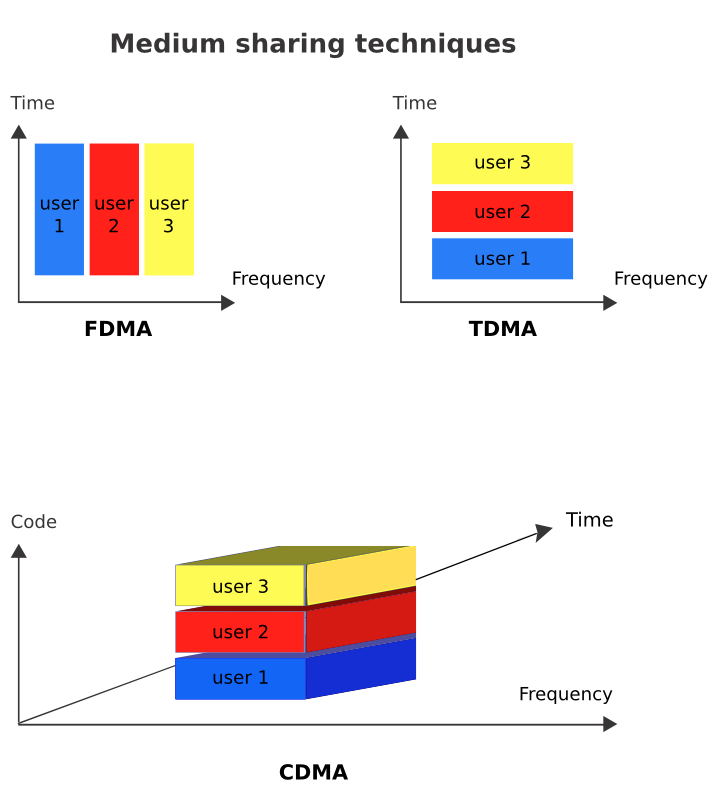

2. TELECOMMUNICATIONS BASICS
----------------------------

 

The purpose of any telecommunications system is to transfer information
from the sender to the receiver by a means of a communication channel.

The information is carried by a signal, which is certain physical
quantity that changes with time.

The signal can be a voltage proportional to the amplitude of the voice,
like in a simple telephone, a sequence of pulses of light in an optical
fibre, or a radio-electric wave irradiated by an antenna.

For analog signals, these variations are directly proportional to some
physical variable like sound, light, temperature, wind speed, etc. The
information can also be transmitted by digital binary signals, that will
have only two values, a digital one and a digital zero. Any analog
signal can be converted into a digital signal by appropriately sampling
and then coding it. The sampling frequency must be at least twice the
maximum frequency present in the signal in order to carry all the
information contained therein. Random signals are the ones that are
unpredictable and can be described only by statistical means.

Noise is a typical random signal, described by its mean power and
frequency distribution. A signal can be characterised by its behaviour
over time or by its frequency components, which constitute its spectrum.
Some examples of signals are shown in Figure TB 1.

 

 

Figure TB 1: Examples of signals

 

Any periodic signal is composed of many sinusoidal components, all of
them multiples of the fundamental frequency, which is the inverse of the
period of the signal. So a signal can be characterised either by a graph
of its amplitude over time, called a waveform, or a graph of of the
amplitudes of its frequency components, called a spectrum.

Figure TB 2: Waveforms, Spectrum and filters

 

Figure TB 2 shows how the same signal can be seen from two different
perspectives. The waveform can be displayed by an instrument called an
oscilloscope, while the spectrum can be displayed by what is called a
Spectrum Analyzer. The spectrum distribution relays very important
information about the signal and allows for the intuitive understanding
of the concept of filtering of electrical signals. In the example shown,
the signal is formed by the superposition of three sinusoidal components
of frequency f1, f2 and f3. If we pass this signal through a device that
will remove f2 and f3, the output is a pure sinusoidal at frequency f1.

We call this operation “Low Pass filtering” because it removes the
higher frequencies. Conversely, we can apply the signal to a “High Pass
Filter”, a device that will remove f1 and f2 leaving only a sinusoidal
signal at the f3 frequency.

Other combinations are possible, giving rise to a variety of filters. No
physical device can transmit all the infinite frequencies of the
radio-electric spectrum, so every device will always perform some extent
of filtering to the signal that goes through it.

The bandwidth of a signal is the difference between the highest and the
lowest frequency that it contains and is expressed in Hz (number of
cycles per second).

While travelling through the communication channel, the signal is
subject to interference caused by other signals and is also affected by
the electrical noise always present in any electrical or optical
component. Intra-channel interference originates in the same channel as
our signal. Co-channel interference is due to the imperfection of the
filters that will let in signals from adjacent channels.

Consequently, the received signal will always be a distorted replica of
the transmitted signal, from which the original information must be
retrieved by appropriate means to combat the effect of interference and
noise. Furthermore, the received signal will be subject to attenuation
and delay that increase with the distance between the transmitter and
the receiver.

Figure TB 3: Attenuation and delay

 

Although it is relatively simple to restore the amplitude of signal by
means of an electrical amplifier, the components of the amplifier will
add additional noise to the signal, so at very long distances where the
received signal is feeble, the amplifier will produce a signal so
garbled with noise that the information originally transmitted will no
longer be retrievable.

 

One way to address this problem consists in converting the continuous
quantity carrying the information into a sequence of very simple symbols
which can be easier to recognise even at great distance. For instance,
the flag of a ship is a convenient way to distinguish the nationality of
the ship even at distances at which the letters on the hull cannot be
read.

This technique has been extended to carry generalised messages by
assigning different position of flags to every letter of the alphabet,
in an early form of long distance telecommunications by means of digital
or numeric signals.

The limitation of this method is obvious; to be able to distinguish
among, say, 26 symbols corresponding to each letters of the alphabet,
one must be quite close to the communicating ship.

On the other hand, if we code each letter of the alphabet in a sequence
of only two symbols, these symbols can be distinguished at much longer
distance, for example the dot and dashes of the telegraph system.

The process of transforming a continuous analog signal into a
discontinuous digital one is called Analog to Digital Conversion (ADC),
and conversely we must have a Digital to Analog Converter (DAC) at the
receiving end to retrieve the original information.

This is the reason why most modern telecommunication systems use digital
binary signals to convey all sorts of information in a more robust way.
The receiver must only distinguish between two possible symbols, or in
other words between two possible values of the received bit (binary
digit). For instance, the CD has replaced the vinyl record, and analogue
television is being replaced by digital television. Digital signals can
use less bandwidth, as exemplified by the “digital dividend” currently
being harnessed in many countries which consists in bandwidth that has
become available thanks to the transition from analog to digital
transmission in TV broadcasting.

Although in the process of converting from an analog to a digital
information system there is always some loss of information, we can
engineer the system so as to make this loss negligible.

 

Figure TB 4: Undersampled Image

 

For example, in a digital camera we can choose the number of bits used
to record the image.

The greater the number of bits (proportional to the amount of
megapixels), the better the rendering, but more memory will be used and
longer time to transmit the image will be needed.

So most modern communication systems deal with digital signals, although
the original variable that we want to transmit might be analog, like the
voice. It can be shown that any analog signal can be reconstructed from
discrete samples if the sampling rate is at least twice as high as the
highest frequency content of the signal.

 

 

Figure TB 5: detection of a noisy signal

 

Then each sample is coded in as many bits as necessary to achieve the
desired amount of precision.

These bits can now be efficiently stored or transmitted, since for the
recovery of the information one needs to distinguish among only two
states, and not among the infinite nuances of an analog signal.

 

This is shown in Figure TB 5, where the original data consists of the 0
1 0 1 1 1 0 sequence. The 0's are represented as zero volts and the 1's
as 1 V. As the signal moves towards the receiver, its amplitude will
diminish. This effect is called "attenuation" and is shown in the
figure. Likewise, there will also be a delay as the signal moves from
the transmitter to the receiver, the variability in the delay of the
received signal is called jitter. Attenuation, noise or jitter (or their
combination) if severe enough, can cause a detection error. An amplifier
can be used to overcome the attenuation, but the electrical noise always
present in the system will add to the received signal.

 

The noisy received signal is therefore quite different from the original
signal, but in a digital system we can still recover the information
contained by sampling the received signal at the correct time and
comparing the value at the sampling time with a suitable threshold
voltage. In this example the noise received signal has a peak of 1.8 V,
so we might choose e threshold voltage of 1.1 V. If the received signal
is above the threshold, the detector will output a digital 1, otherwise,
it will output a 0. In this case we can see that because of the effect
of the noise the fifth bit was erroneously detected as a zero.

 

Transmission errors can also occur if the sampling signal period is
different from that of the original data (difference in the clock
rates), or if the receiver clock is not stable enough (jitter).

Any physical system will have an upper limit in the frequencies that
will transmit faithfully (the bandwidth of the system), higher
frequencies will be blocked, so the abrupt rise and fall of the voltage
will be smoothed out as the signal goes through the channel.

Therefore, we must make sure that each of the elements of the system has
enough bandwidth to handle the signal. On the other hand, the greater
the bandwidth of the receiver system, the greater the amount of the
noise that will affect the received signal.

### Modulation

The robustness of the digital signal is also exemplified by the fact
that it was chosen for the first trials of radio transmission. Marconi
showed the feasibility of long distance transmission, but pretty soon
realised that there was a need to share the medium among different
users.

 

This was achieved by assigning different carrier frequencies which were
modulated by each user’s message. Modulation is a scheme to modify the
amplitude, frequency or phase of the carrier according with the
information one wants to transmit. The original information is retrieved
at destination by the corresponding demodulation of the received signal.

 

 

Figure TB 6: Sinusoidal Carrier Signal

 

Figure TB 6 shows a carrier signal with Amplitude A, phase θ, and
frequency fo which is the reciprocal of the period T.

 

The combination of different modulation schemes has resulted in a
plethora of modulation techniques depending on which aspect one wants to
optimise: robustness against noise, amount of information transmitted
per second (capacity of the link in bits/second) or spectral efficiency
(number of bits/s per Hertz).

 

For instance, BPSK -Binary Phase Shift Keying- is a very robust
modulation technique but transmits only one bit per symbol, while 256
QAM -Quaternary Amplitude Modulation- will carry 8 bits per symbol, thus
multiplying by a factor of eight the amount of information transmitted
per second, but to correctly distinguish amongst the 256 symbols
transmitted, the received signal must be very strong as compared with
the noise (a very high S/N -Signal/Noise ratio- is required).

The ultimate measure of quality in digital transmission is the BER -Bit
Error Rate- which corresponds to the fraction of erroneously decoded
bits. Typical values of BER range between 10-3 and 10-9.

The modulation also allows us to choose which range of frequency we want
to use for a given transmission. All frequencies are not created equal
and the choice of the carrier frequency is determined by legal,
commercial and technical constraints.

### Multiplexing and duplexing

In general, the sharing of a channel among different users is called
multiplexing.

This is shown in Figure TB 7.

 

Figure TB 7: Multiplexing

 

Assigning different carrier frequencies to different users is called
FDMA -Frequency Division Multiple Access-.

 

An alternative technique consists in assigning different time slots to
different users, in what is known as TDMA -Time Division Multiple
Access-, or even different codes in CDMA -Code Division Multiple Access-
where the different users are recognised at the receiver by the
particular mathematical code assigned to them. See Figure TB 8.

By using two or more antennas simultaneously, one can take advantage of
the different amount of fading introduced in the different paths to the
receiver establishing a difference among users in what is known as SDMA
- Space Division Multiple Access-, a technique employed in the MIMO
-Multiple Input,Multiple Output- systems that have gained popularity
recently.

 

 

Figure TB 8: Medium Sharing techniques

 

Most communication systems transmit information in both directions, for
instance from the Base Station to the subscriber in what is called the
downlink, and from the subscriber to the base station in the uplink.

To accomplish this, the channel must be shared between the two
directions giving rise respectively to FDD -Frequency Division
Duplexing- and TDD -Time Division Duplexing-.

### Conclusions

The communication system must overcome the noise and interference to
deliver a suitable replica of the signal to the receiver.

 

The capacity of the communication channel in bits/second is proportional
to the bandwidth in Hz and to the logarithm of the S/N ratio.

 

Modulation is used to adapt the signal to the channel and to allow
several signals to share the same channel. Higher order modulation
schemes allow for a higher transmission rate, but require higher S/N
ratio.

 

The channel can be shared by several users that occupy different
frequencies, different time slots, different codes or by taking
advantage of different propagation characteristics in what is called
spatial multiplexing.

 

For more information and slides covering this topic please visit
[http://wtkit.org/groups/wtkit/wiki/820cb/download\_page.html](http://wtkit.org/groups/wtkit/wiki/820cb/download_page.html)
