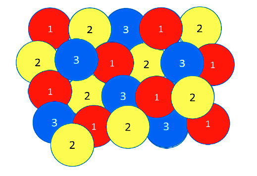
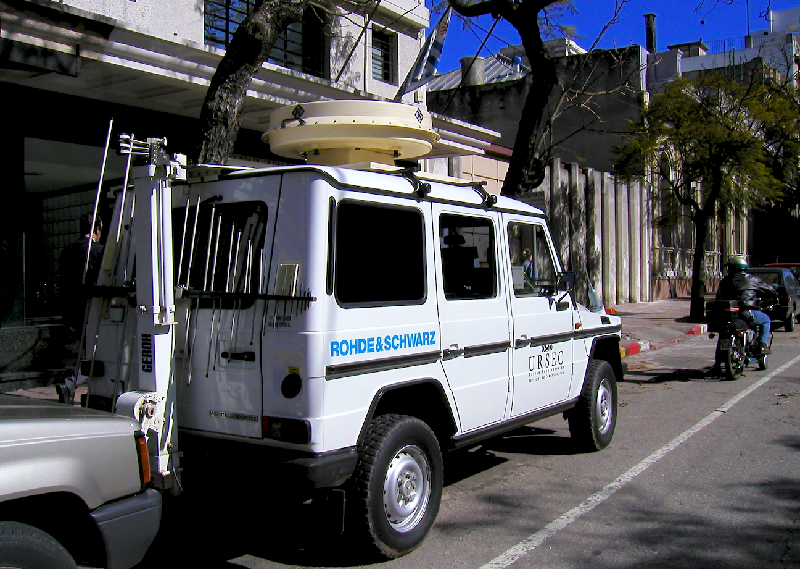
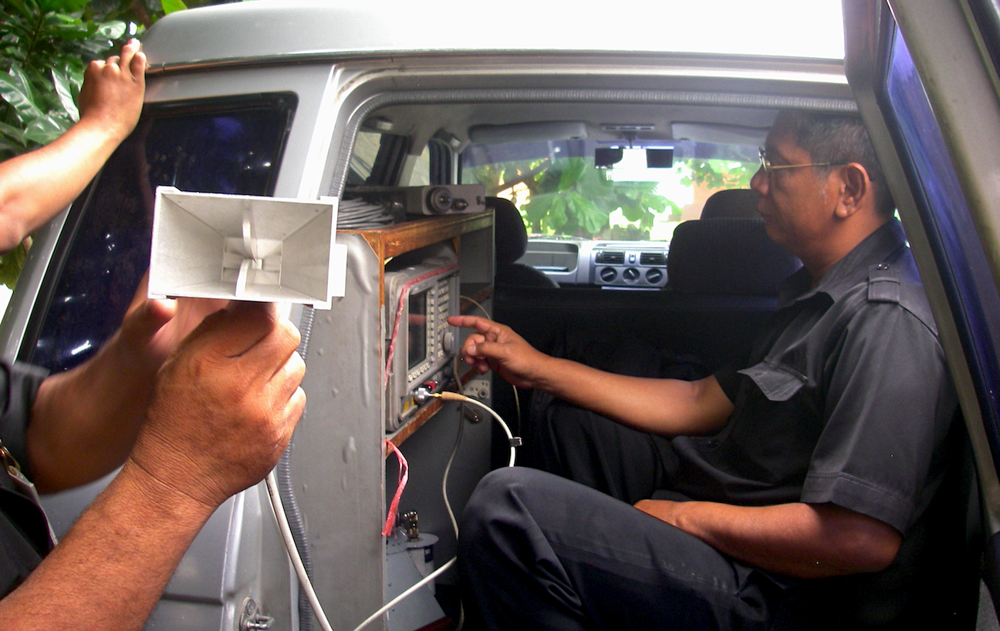
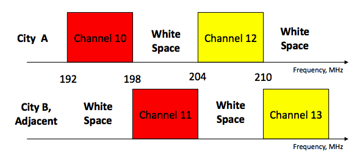
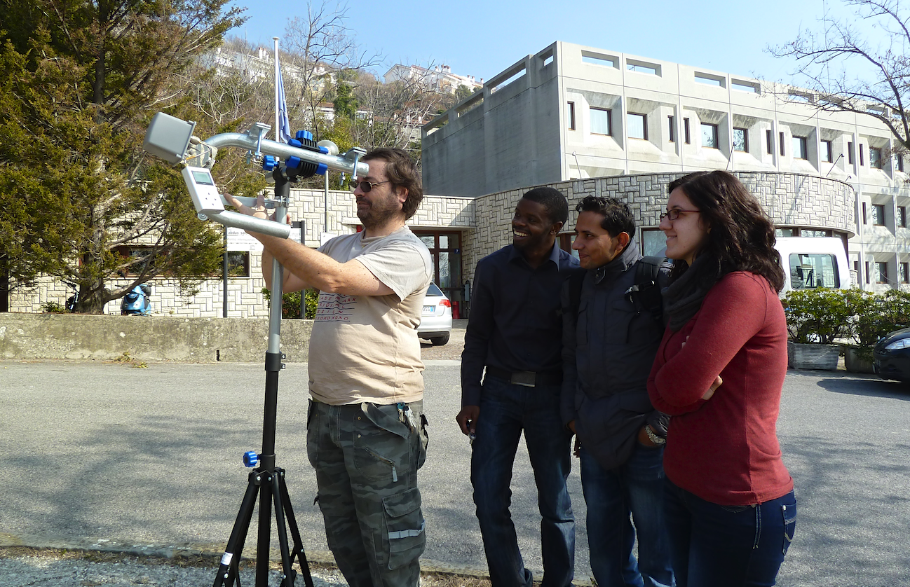

4. RADIO SPECTRUM
-----------------

### What is the electromagnetic spectrum?

There is not a simple definition of the spectrum. From the technical
viewpoint the spectrum is simply the range of electromagnetic waves that
can be used to transmit information, but from the practical viewpoint
the economic and political aspects, as well as the technology actually
used to convey the information by means of these waves, play pivotal
roles.

As an example, when Marconi in 1902 first spanned the Atlantic with his
“wireless telegraph message”, he used the whole spectrum available at
the time to send a few bits/s over an area of thousands of square
kilometres.

With the spark transmitter used for this achievement that occupied all
the frequencies that the existing receivers were able to understand,
nobody else could use radio for communications on a radius of some 3500
km from the transmitting station in England. So, if other users wanted
to send messages in the same area, they would need to coordinate their
transmissions in different “time slots” in order to share the medium.
This technique is called “TDMA”, Time Division Multiple Access.

 

Users located at distances much greater than 3500 km from Marconi’s
transmitter could use the spectrum again, since the power of the radio
waves decreases as we move farther away from the transmitter. Reusing
the spectrum in different geographical areas is called “SDMA”, Space
Division Multiple Access. Marconi was later able to build a transmitter
that could restrict emissions to just a range of frequencies, and a
receiver that could be “tuned” to a particular frequency range. Now,
many users could transmit simultaneously in the same area (space) and at
the same time. “FDMA”, Frequency Division Multiple Access was borne.
Radio then became a practical means of communications, and the only one
that was available to reach a ship in the open seas. The coordination of
the frequencies allocated to different users was done by national
agencies created to this effect, but since radio waves are not stopped
by national borders, international agreements were needed. The
international organization that had been created to regulate the
transmission of telegrams among different countries was commissioned to
allocate the use of the electromagnetic spectrum.

Nowadays, ITU, International Telecommunications Union, is the oldest
International Organization, tasked with issuing recommendations about
which frequencies to use for which services to its 193 nation members.

 

The use of the spectrum for military applications raised a new issue;
“jamming”, the intentional interference introduced by the enemy to
impede communication. To avoid jamming, a new technique was developed in
which the information to be transmitted was combined with a special
mathematical code; only receivers with the knowledge of that particular
code could interpret the information. The coded signal was transmitted
at low power but using a very wide interval of frequencies to make
jamming more difficult.

 

This technique was later adapted to civilian applications in what is
called “CDMA”, Code Division Multiple Access, one of the flavours of
spread spectrum communication, extensively used in modern communications
systems. In summary, the spectrum can be shared among many users by
assigning different time slots, different frequency intervals, different
regions of space, or different codes. A combination of these methods is
used in the latest cellular systems. Besides issues of sovereignty and
its defence, very strong economic and political interests play a
determinant role in the management of the spectrum, which also needs to
be constantly updated to take advantage of the advances in the
communications technology.

Telecommunications engineers keep finding more efficient ways to
transmit information using time, frequency and space diversity by means
of ever advancing modulation and coding techniques. The goal is to
increase the “spectrum efficiency”, defined as the amount of bits per
second (bit/s) that can be transmitted in each Hz of bandwidth per
square kilometre of area. For example, the first attempts to provide
mobile telephone services were done by using a powerful transmitter,
conveniently located to give coverage to a whole city.

This transmitter (called a Base Station in this context), divided the
allocated frequency band into say, 30 channels. So only 30 conversations
could be held simultaneously in the whole city.

As a consequence, the service was very expensive and only the extremely
wealthy could afford it. This situation prevailed for many years, until
the advances in electronic technology allowed the implementation of a
scheme to take advantage of “Space Diversity”.

Instead of using a single powerful transmitter to cover the whole city,
the area to be serviced was divided into many “cells”, each one served
by a low power transmitter. Now cells that are sufficiently apart can
utilize the same channels without interference, in what is known as
“frequency reuse”. With the cellular scheme, the first 10 channels are
to use frequency band 1, the second 10 channels frequency band 2 and the
remaining 10 channels frequency band 3. This is shown in Figure RS 1, in
which the colours correspond to different frequency bands. Notice that
the colours repeat only at distances far enough to avoid interference.
If we divide the city in say, 50 cells, we can now have 10X50 = 500
simultaneous users in the same city instead of 30. Therefore, by adding
cells of smaller dimensions (specified by lower transmission power) we
can increase the number of available channels until we reach a limit
imposed by the interference.

 

 

Figure RS 1: Cellular sharing of spectrum

 

This example shows that a clever use of existing resources can
dramatically increase its usefulness. Although the main use of the
spectrum is for communication purposes, there are also other uses, like
cooking food in microwave ovens, medical applications, garage door
openers and so on.

So some frequency bands are allocated for these purposes in what is
known as the ISM (Industrial, Scientific and Medical) bands.

This spectrum usage is normally for short distance applications.

A breakthrough occurred in 1985 when the FCC (Federal Commission of
Communications), the agency that oversees the spectrum in the U.S.,
allowed the use of this spectrum for communications applications as
well, provided that the transmission power was kept to a very low level
to minimize interference.

People could freely use these “Unlicensed” bands without previously
applying for a permit, provided that the equipment used had been
certified by an authorized laboratory that ensured compliance with
interference mitigation measures.

Several manufacturers began taking advantage of this opportunity by
offering equipment that could be used to communicate between computers
without the need for cables, and some wireless data networks covering
significant geographic areas were built with them, but the turning point
happened after the 1997 approval of the IEEE (Institute of Electrical
and Electronics Engineers) 802.11 Standard, the basis of what is known
as WiFi.

The existence of a standard that guaranteed the interoperability of
equipment produced by different manufacturers fuelled an impressive
growth of the market, which in turn drove the competition that fostered
a dramatic decrease in the cost of the devices.

In particular, the portion of the ISM band between 2400 and 2483 MHz is
nowadays available in most of the world without the need for previously
applying for a license and is widely used by laptops, tablets, smart
phones and even photographic cameras.

It is important to stress the role of the unlicensed spectrum in the
enormous success of WiFi high speed Internet access.

Many airports, hotels and cafes all over the world offer free WiFi
Internet access on their premises, and low cost wireless community
networks have been built both in rural area and in cities covering
considerable geographic areas, thanks to the availability of free
spectrum.

Mobile phone operators, who have to pay dearly for frequency licenses to
use the spectrum, were quite hostile to this apparently unfair
competition.

But when they started offering smart phones, which make very intensive
use of the Internet, they pretty soon realized that off-loading the
traffic to WiFi was in their best interest, because it relieved the
traffic in their distribution network (known as the backhaul).

So now they encourage their customers to use WiFi wherever it is
available and use the more expensive cellular service only when out of
range of any WiFi Access Point.

This is a remarkable example of the usefulness of the unlicensed
spectrum even to traditional telecommunications operators who often have
lobbied against it.

### How is the spectrum adjudicated?

Currently the main methods to gain access to a given spectrum band are
auctions and the so called “beauty contest”.

The auction method is straightforward; interested parties bid for a
given spectrum chunk; whoever commits the higher sum gets the right to
use the frequencies.

In theory this method guarantees that the adjudication will be
transparent, in practice this has often been circumvented and there have
been instances of powerful commercial interests that acquire frequencies
only to avoid their use by the competition, with the result of highly
valuable spectrum not being used.

Also there is the temptation on the part of governments to use this
method as a means to generate revenues and not necessarily in the best
public interest.

As an example, in the year 2000 there were auctions in several countries
of Europe to adjudicate spectrum for mobile phones, which resulted in a
total income of 100 billion (100 000 000 000) euros to the government
coffers.

 

The “beauty contest” method is for the interested parties to submit
proposals about how they intend to use the spectrum.

A committee of the spectrum regulating agency then decides which of the
proposals better serves the public goals.

This method relies on the objectivity, technical proficiency and honesty
of the members of the deciding committee, which is not always
guaranteed.

In many countries there are rules for spectrum adjudication that call
for the relinquishing of spectrum bands that have been acquired but are
not being used; however their enforcement is often lacking due to the
strong economic interests affected.

 

 

 

Figure RS 2 shows a photograph of a spectrum monitoring vehicle in
Montevideo, Uruguay and Figure RS 3 that of the same kind of equipment
being used in Jakarta, Indonesia.

 

Figure RS 3: The “spectrum Police” at work in Jakarta

 

Note that the open spectrum used in the unlicensed bands cannot prevent
interference issues, especially in very crowded areas, but nevertheless
it has proved a fantastic success for short distance applications in
cities and also for long distance applications in rural areas.

It is therefore advisable to investigate new forms of spectrum
allocation, taking into consideration the needs of many stakeholders and
striking a balance among them.

A dynamic spectrum allocation mechanism seems to be the best choice
given the advances in technology that make this viable nowadays.

As an example, the current method of spectrum allocation is similar to
the railway system, the railroads can be idle a considerable amount of
time, whereas the dynamic spectrum allocation is akin to the freeway
system that can be used at all times by different users.

### Political issues

The importance of the spectrum as a communications enabler cannot be
overstated. Television and radio broadcasting have a strong influence in
shaping public perception of any issue, and have been used overtly for
political propaganda (It has been said that the election of Kennedy as
president of the U.S. was due mainly to his television campaign).

During the cold war, The Voice of America, Moscow Radio and Radio Havana
Cuba were very effective ways to sway a global audience.

 

More recent examples include the influence of CNN and Al Jazeera in the
public interpretation of the Arab Spring. Spectrum used for two way
communications has also been subject to government interventions,
especially in cases of political unrest. On the other hand, economic
interests also play a vital role in broadcasting; the consumer society
relies heavily on radio and television to create artificial needs or to
veer the consumer towards a particular brand. We can conclude that the
electromagnetic spectrum is a natural resource whose usefulness is
heavily conditioned by technological, economic and political factors.

### Explosion in spectrum demand

As the number of tablets and smart phones grows, telecom operators are
trying to get access to new frequency bands, but the traditional way of
adjudicating the spectrum is facing a dead end.

 

Keep in mind that the spectrum is used for radio and television
broadcasts, for satellite communications, for airplane traffic control,
for geolocalisation (Global Postioning Systems-GPS), as well as for
military, police and other governmental purposes. Traditionally, the
demand for additional spectrum has been met thanks to the advances of
electronics that have permitted the use of higher frequencies at an
affordable cost. Higher frequencies are well suited for high speed
transmissions, but they have a limited range and are highly attenuated
by walls and other obstacles as well as by rain.

 

This is exemplified by comparing the coverage of an AM radio
broadcasting station to that of an FM one: the greatest range of the AM
station is due to its use of lower frequencies. On the other hand, FM
stations can make use of higher bandwidths and as consequence can offer
greater audio quality at the expense of a more limited range.

Current cellular operators use even higher frequencies, usually above
800 MHz. Accordingly, the TV broadcasting frequencies are coveted by the
cellular telephone providers, because by using lower frequencies they
will need less base stations, with huge savings in deployment, operation
and maintenance costs. This is why these frequencies are commonly
referred to as “beach front property”.

 

Techniques for more efficient spectrum usage by means of advanced
modulation and coding methods have had the greatest impact in allowing
more bits/s per Hz of bandwidth availability. This, in turn, was made
possible by the great strides in electronics (fabrication of ever
advanced integrated circuits) that now make it economically feasible to
implement the required sophisticated modulation and coding techniques.

 

According to the calculations performed in 1948 by Claude Shannon - the
father of modern telecommunications, a typical telephone line could
carry up to 30 kbit/s. But this was only achieved in the 90's when
integrated circuits implementing the required techniques were actually
built. In particular, the transition to digital terrestrial television
broadcasting, which is more efficient in spectrum usage compared with
analogue transmission, has freed some spectrum in the so called “White
Spaces”, the frequencies that had to be left fallow in between analogue
television channels to prevent interference.

 

 

In traditional analogue TV broadcasting, adjacent channels cannot be
used at the same time, because the signal from one channel will “spill”
over to the two adjacent channels and would cause interference. This is
similar to the central reservation used in freeways to separate the two
directions of traffic in order to prevent collisions. So a “White Space”
must be left between two contiguous analogue TV channels to prevent
interference. Digital TV broadcasting is much more efficient in spectrum
utilization, and several digital TV channels can be accommodated in the
same frequency band formerly used by a single analogue channel without
“spillover” into adjacent channels. So, in places where Analog TV is
replaced by Digital TV a “digital dividend” is being harvested.

In conclusion, the concept of white spaces can be applied to three
different frequency chunks:

 

-   The spectrum that has been assigned to TV broadcasting but it is
    not currently being used. This applies particularly to developing
    countries, in which there has been no economic incentive for
    broadcaster to use every available TV channel. 

-   The spectrum that must be left free in between two analogous TV
    channels to prevent interference. 

-   The spectrum that has been reclaimed as a consequence of the
    transition to digital terrestrial TV, which is more spectrum
    efficient. This currently applies to developed countries, but will
    soon apply to developing countries as well. 

In the last 20 years there has been a tremendous growth in the demand
for more spectrum for mobile communication services, in which data

services are consuming much more bandwidth than voice and the growing
use of video is presenting an additional challenge.

Not surprisingly, telecom operators everywhere are trying to get a
portion of these “White Spaces” allocated to them to fulfill their
needs. Broadcasters, on the other hand, are very reluctant to concede
any spectrum at all to what are now their direct competitors.

### Spectrum scarcity or spectrum hoarding?

Although the available spectrum is currently totally adjudicated in
developed countries, many independent studies have found that the actual
simultaneous usage of the spectrum is a tiny fraction of the total. This
is caused by the way spectrum was originally adjudicated and also
because often spectrum is used intermittently; for instance some TV
broadcasting stations do not transmit 24 hours a day.

As a consequence, a radically new way to use the spectrum has been
suggested; instead of leasing spectrum to a given organization in an
exclusive basis, the new dynamic spectrum management paradigm proposes
to use whatever spectrum is available in a certain place at a certain
time and switch to another frequency whenever interference is detected
in a given band.

An analogy can be made to explain this concept: the current way to
allocate the spectrum is similar to a railroad system; the railroads are
never used 100% of the time, a more efficient use of the same amount of
terrain can be done with a highway in which many different users can
share the same path according to their current needs.

Of course to implement dynamic spectrum access requires new technologies
and new legislation; many vested interests are fighting it alleging the
possibility of interference. The key issue is how to determine when a
particular chunk of spectrum is really being used in a particular place
and how to move quickly to a new frequency band when an existing user
with higher priority is detected. The technology to accomplish this feat
has already being demonstrated and implemented in the new IEEE 802.22
standard recently approved, as well as in others currently being
considered.

### IEE 802.22

Stimulated by the impressive success of WiFi (due mostly to the use of
unlicensed, open spectrum), the IEEE created a working group to address
the requirements of a Wireless Regional Area Network. The challenge was
to develop a technology suitable for long distance transmission that
could be deployed in different countries (with quite different spectrum
allocations), so they focused on the spectrum currently allocated to TV
broadcasting which spans approximately from 50 to 800 MHz. Nowhere is
this spectrum being used in its entirety all the time, so there are
“White Spaces”, fallow regions that could be “re-farmed” and put to use
for bidirectional communications. In rural areas all over the world, but
specially in developing countries there are large portions of spectrum
currently under utilised. It is expected that IEEE 802.22 will enable
dynamic spectrum access in a similar way to IEEE 802.11 (WiFi), allowing
access to open spectrum. Of course not all the spectrum can be liberated
at once, a gradual process is required as the many technical, legal,
economic and political hurdles are solved, but there is no doubt that
this is the trend and that IEE 802.22 paves the way to the future of
spectrum allocation. In order to assess the availability of a given
frequency channel at a given time two methods are being considered:
channel sensing and a database of primary users in a given geographic
location at a given time.

Channel sensing means that prior to an attempt to use a channel, the
base stations will listen to the channel; if it is being used it will
try another one, repeating the procedure until a free channel is found.
This procedure is repeated at regular intervals to account for the
possibility of stations coming alive at any time. This method should
suffice, nevertheless current spectrum holders have successfully lobbied
the regulators to enforce the implementation of the second method, which
is much more complicated and imposes additional complexity and costs in
the consumer equipment.

The second method consists in the building of a database of all the
existing incumbent transmission stations, with their position and
respective coverage area in order to establish an “off limit” zone in a
given channel.

A new station wishing to transmit must first determine its exact
position (so it must have a GPS receiver or other means to determine its
geographic location) and then interrogate the database to ascertain that
its present location is not in the forbidden zone of the channel it is
attempting to use.

To interrogate the database, it must have Internet access by some other
means (ADSL-Asymmetrical Digital Subscriber Loop, Cable, Satellite, or
Cellular), besides the 802.22 radio (which cannot be used until the
channel is confirmed as usable), so this adds a considerable additional
burden to the station hardware which translates into additional cost,
beside the cost of building and maintaining the database.

In the US the FCC (Federal Communications Commission, the spectrum
regulatory agency) has been promoting the building of the database of
registered users and have authorised 10 different private enterprises to
build, operate and maintain such repositories.

Furthermore, field trials of the standard are been conducted. In the UK,
OFCOM (the spectrum regulator) is also conducting IEE 802.22 trials and
concentrating on the database method having ruled out the spectrum
sensing method for interference mitigation. Although IEEE 802.22 is the
formally approved standard that has received the most publicity, there
are several competing candidates that are being explored to leverage the
TV White Spaces to provide two-way communication services, among them:

#### IEEE 802.11af

This amendment takes advantage of the enormous success of IEEE 802.11 by
adapting the same technology to work in the frequency bands allocated to
TV transmission, thus relieving the spectrum crowding of the 2.4 GHz
band and offering greater range due to the use of lower transmission
frequencies. Its details are still being discussed by the corresponding
IEEE 802.11 working group.

#### IEEE 802.16h

This amendment of the 802.16 standard was ratified in 2010 and describes
the mechanism for implementing the protocol in uncoordinated operation,
licensed or license exempt applications. Although most deployments have
been in the 5 GHz band, it can also be applied to the TV band
frequencies and can profit from the significant deployments of WiMAX
(Wireless Microwave Access) systems in many countries.

### Developing countries advantage

It is noteworthy that in developing countries the spectrum allocated to
broadcast television is only partially used. This presents a magnificent
opportunity to introduce wireless data networking services in the
channels that are not currently allocated, and to start reaping the
benefits of 802.22 in a more benign environment, where the spectrum
sensing and agile frequency changing required to share the crowded
spectrum in developed countries can be dispensed with. The usefulness of
the lower frequencies for two-way data communications has been proved by
the the successful deployment of CDMA (Code Division Modulation Access)
cellular systems in the 450 MHz band, right in the middle of the TV
allocated frequencies, in rural areas like the Argentinian Patagonian,
currently served by “Cooperativa Telefonica de Calafate-COTECAL”.
COTECAL offer voice and data services to customers at distances up to 50
km from the Base Station, in the beautiful area shown in the figure
below:

 

 

Figure RS 5: Region served with voice and data services by COTECAL, in
Calafate and El Chalten, Argentina.

 

So there is an opportunity for stakeholders to lobby for the
introduction of TV Band Device based solutions at an early stage, while
the issues of the digital transition are being considered. This will
help ensure that commercial interests of a few do not prevail over the
interests of society at large. Activists/lobbyists should emphasize the
need for transparency in the frequency allocation process and for
accountability of the administration of spectrum in their country or
region.

Also it is important that those who wish to deploy networks gain an
understanding of the real spectrum usage by spectrum holders in each
region of their country. The monitoring of the spectrum requires
expensive instruments with a steep learning curve to use them, but
recently an affordable and easy to use device has become available that
permits analysis of the frequency band between 240 MHz and 960 MHz,
which encompasses the higher part of the TV band. Details of this open
hardware based RF Explorer Spectrum Analyzer for the upper TV band are
at:

[http://www.seeedstudio.com/depot/rf-explorer-model-wsub1g-p-922.html](http://www.seeedstudio.com/depot/rf-explorer-model-wsub1g-p-922.html)

Figure RS 6 shows the RF Explorer for the 2.4 GHz band being used to
test an antenna built by participants of the 2012 ICTP Wireless training
workshop in Trieste, Italy.

 

 

Figure RS 6: Participants from Albania, Nepal, Malawi and Italy testing
an antenna with the RF Explorer Spectrum Analyzer in Trieste, February
2012.

 

This low cost instrument paves the way for a wide involvement of people
in the measurement of the real spectrum usage on their own country which
hopefully can lead to a better spectrum management.

For additional information see:

http://www.apc.org/en/faq/citizens -guide-airwaves
