5. ANTENNAS / TRANSMISSION LINES
--------------------------------

The transmitter that generates the RF power to drive the antenna is
usually located at some distance from the antenna terminals. The
connecting link between the two is the RF transmission line. Its purpose
is to carry RF power from one place to another, and to do this as
efficiently as possible. From the receiver side, the antenna is
responsible for picking up any radio signals in the air and passing them
to the receiver with the minimum amount of distortion and maximum
efficiency, so that the radio has its best chance to decode the signal.
For these reasons, the RF cable has a very important role in radio
systems: it must maintain the integrity of the signals in both
directions.

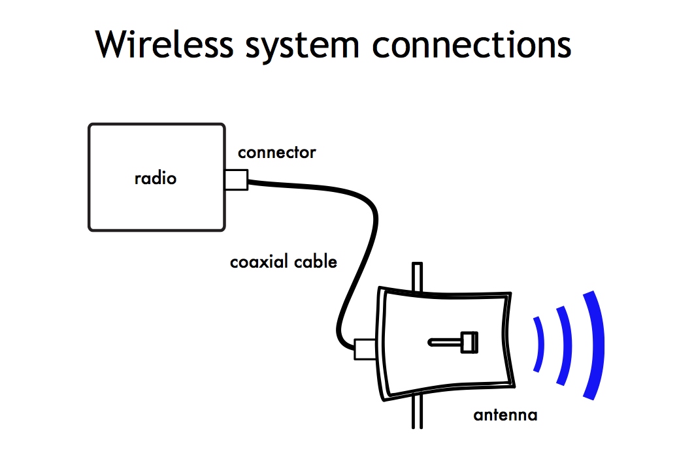

Figure ATL 1: Radio, transmission line and antenna

 

The simplest transmission line one can envisage is the bifilar or twin
lead, consisting of two conductors separated by a dielectric or
insulator. The dielectric can be air or a plastic like the one used for
flat transmission lines used in TV antennas. A bifilar transmission line
open at one end will not radiate because the current in each wire has
the same value but opposite direction, so that the fields created on a
given point at some distance from the line cancel.

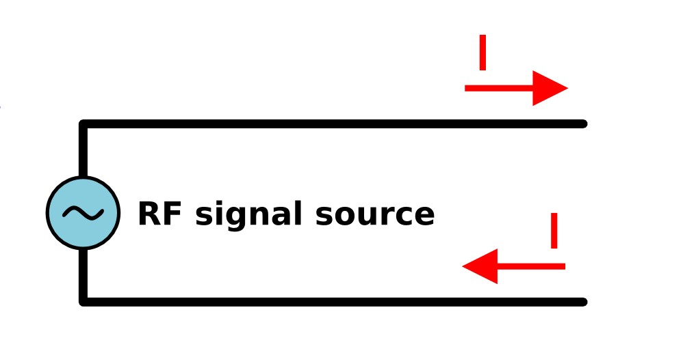

 

Figure ATL 2: Bifilar transmission line

 

If we bend the open ends of the transmission line in opposite
directions, the currents will now generate electric fields that are in
phase and reinforce each other and will therefore radiate and propagate
at a distance. We now have an antenna at the end of the transmission
line.

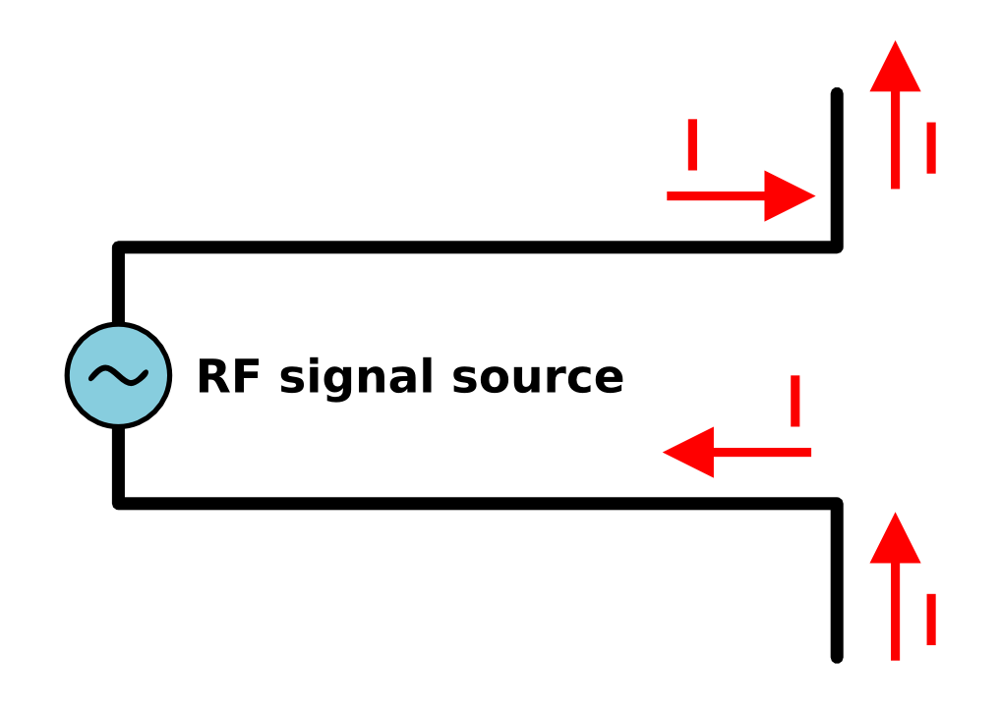

Figure ATL 3: Antenna from transmission line

 

The length of the bent portion of the transmission line will determine
the antenna feature. If this length corresponds to a quarter of a
wavelength we will have a half wave dipole antenna with a gain of 2.15
dBi.

The functioning of the bifilar transmission line just described is
strongly affected by any metal in its proximity, so a better solution is
to confine the electrical fields by means of an external conductor that
shields the internal one. This constitutes a coaxial cable.
Alternatively, a hollow metallic pipe of the proper dimensions will also
effectively carry RF energy in what is known as a waveguide.

### Cables

For frequencies higher than HF the coaxial cables (or coax for short,
derived from the words “of common axis”) are used almost exclusively.
Coax cables have a core conductor wire surrounded by a non-conductive
material called dielectric, or simply insulation.

The dielectric is then surrounded by an encompassing shielding which is
often made of braided wires. The dielectric prevents an electrical
connection between the core and the shielding. Finally, the coax is
protected by an outer casing which is generally made from a PVC
material.

The inner conductor carries the RF signal, and the outer shield prevents
the RF signal from radiating to the atmosphere, and also prevents
outside signals from interfering with the signal carried by the core.
Another interesting fact is that high frequency electrical signal
travels only along the outer layer of a conductor, the inside material
does not contribute to the conduction, hence the larger the central
conductor, the better the signal will flow. This is called the “skin
effect”.

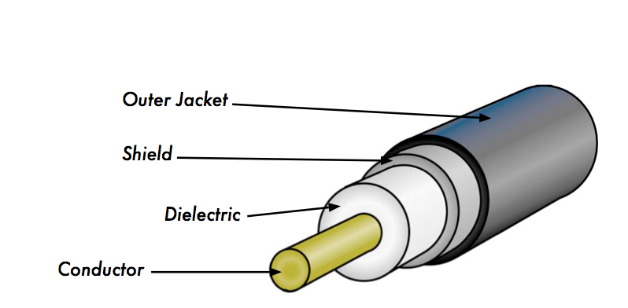

 

Figure ATL 4: Coaxial cable with jacket, shield, dielectric, and core
conductor.

 

Even though the coaxial construction is good at transporting the signal,
there is always resistance to the electrical flow: as the signal travels
along, it will fade away.

This fading is known as attenuation, and for transmission lines it is
measured in decibels per metre (dB/m).

The rate of attenuation is a function of the signal frequency and the
physical construction of the cable itself. As the signal frequency
increases, so does its attenuation.

Obviously, we need to minimise the cable attenuation as much as possible
by keeping the cable very short and using high quality cables.

 

Here are some points to consider when choosing a cable for use with
microwave devices:

 

1.  1.  1.“The shorter the better!” The first rule when you install a
        piece of cable is to try to keep it as short as possible. The
        power loss is not linear, so doubling the cable length means
        that you are going to lose much more than twice the power. In
        the same way, reducing the cable length by half gives you more
        than twice the power at the antenna. The best solution is to
        place the transmitter as close as possible to the antenna, even
        when this means placing it on a tower. 

    2.  2.“The cheaper the worse!” The second golden rule is that any
        money you invest in buying a good quality cable is a bargain.
        Cheap cables can be used at low frequencies, such as VHF.
        Microwaves require the highest quality cables available. 

    3.  3.Avoid RG-58. It is intended for thin Ethernet networking, CB
        or VHF radio, not for microwave. 

    4.  4.Avoid RG-213 or RG-8. They are intended for CB and HF radio.
        In this case even if the diameter is large the attenuation is
        significant due to the cheap insulator used. 

    5.  5.Whenever possible, use the best rated LMR cable or equivalent
        you can find. LMR is a brand of coax cable available in various
        diameters that works well at microwave frequencies. The most
        commonly used are LMR-400 and LMR-600. Heliax cables are also
        very good, but expensive and difficult to use. 

    6.  6.Whenever possible, use cables that are pre-crimped and tested
        in a proper lab. Installing connectors to cable is a tricky
        business, and is difficult to do properly even with the specific
        tools. Never step over a cable, bend it too much, or try to
        unplug a connector by pulling the cable directly. All of these
        behaviours may change the mechanical characteristic of the cable
        and therefore its impedance, short the inner conductor to the
        shield, or even break the line.  

    7.  7.Those problems are difficult to track and recognise and can
        lead to unpredictable behaviour on the radio link. 

    8.  8.For very short distances, a thin cable of good quality maybe
        adequate since it will not introduce too much attenuation. 

 

### Waveguides

Above 2 GHz, the wavelength is short enough to allow practical,
efficient energy transfer by different means. A waveguide is a
conducting tube through which energy is transmitted in the form of
electromagnetic waves. The tube acts as a boundary that confines the
waves in the enclosed space. The Faraday cage phenomenon prevents
electromagnetic effects from being evident outside the guide. The
electromagnetic fields are propagated through the waveguide by means of
reflections against its inner walls, which are considered perfect
conductors. The intensity of the fields is greatest at the center along
the X dimension, and must diminish to zero at the end walls because the
existence of any field parallel to the walls at the surface would cause
an infinite current to flow in a perfect conductor.

The X, Y and Z axis of a rectangular waveguide can be seen in the
following figure:

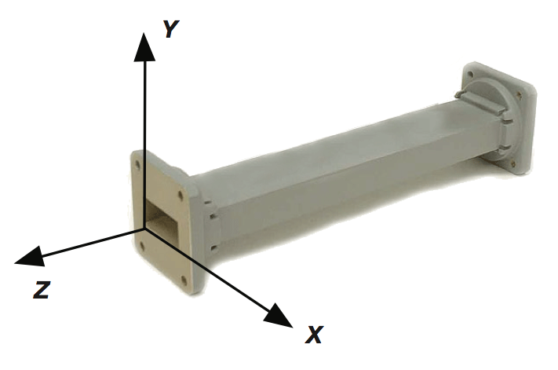

Figure ATL 5: The X, Y, and Z axis of a rectangular waveguide.

 

There are an infinite number of ways in which the electric and magnetic
fields can arrange themselves in a waveguide for frequencies above the
low cutoff. Each of these field configurations is called a mode. The
modes may be separated into two general groups. One group, designated TM
(Transverse Magnetic), has the magnetic field entirely transverse to the
direction of propagation, but has a component of the electric field in
the direction of propagation. The other type, designated TE (Transverse
Electric) has the electric field entirely transverse, but has a
component of magnetic field in the direction of propagation.

The mode of propagation is identified by the group letters followed by
two subscript numerals. For example, TE 10, TM 11, etc.

The number of possible modes increases with the frequency for a given
size of guide, and there is only one possible mode, called the dominant
mode, for the lowest frequency that can be transmitted. In a rectangular
guide, the critical dimension is X. This dimension must be more than 0.5
λ at the lowest frequency to be transmitted. In practice, the Y
dimension is usually about 0.5 X to avoid the possibility of operation
in other than the dominant mode. Cross-sectional shapes other than the
rectangle can be used, the most important being the circular pipe. Much
the same considerations apply as in the rectangular case. Wavelength
dimensions for rectangular and circular guides are given in the
following table, where X is the width of a rectangular guide and r is
the radius of a circular guide. All figures apply to the dominant mode.

 

Type of guide

Rectangular

Circular

Cutoff wavelength

2X

3.41r

Longest wavelength transmitted with little attenuation

1.6X

3.2r

Shortest wavelength before next mode becomes possible

1.1X

2.8r

 

Energy may be introduced into or extracted from a waveguide by means of
either the electric or magnetic field. The energy transfer typically
happens through a coaxial line. Two possible methods for coupling to a
coaxial line are using the inner conductor of the coaxial line, or
through a loop. A probe which is simply a short extension of the inner
conductor of the coaxial line can be oriented so that it is parallel to
the electric lines of force. A loop can be arranged so that it encloses
some of the magnetic lines of force. The point at which maximum coupling
is obtained depends upon the mode of propagation in the guide or cavity.
Coupling is maximum when the coupling device is in the most intense
field.

If a waveguide is left open at one end, it will radiate energy (that is,
it can be used as an antenna rather than a transmission line).

This radiation can be enhanced by flaring the waveguide to form a
pyramidal horn antenna.

 

There are examples of practical waveguide antennas for WiFi shown in
Appendix A called Antenna Construction.

### Connectors and adapters

Connectors allow a cable to be connected to another cable or to a
component in the RF chain. There are a wide variety of fittings and
connectors designed to go with various sizes and types of coaxial lines.

We will describe some of the most popular ones.

 

BNC connectors were developed in the late 40s. BNC stands for Bayonet
Neill Concelman, named after the men who invented it: Paul Neill and
Carl Concelman.

The BNC product line is a miniature quick connect/disconnect connector.
It features two bayonet lugs on the female connector, and mating is
achieved with only a quarter turn of the coupling nut. BNCs are ideally
suited for cable termination for miniature to subminiature coaxial cable
(RG-58 to RG-179, RG-316, etc.). They are most commonly found on test
equipment and 10base2 coaxial Ethernet cables.

TNC connectors were also invented by Neill and Concelman, and are a
threaded variation of the BNC. Due to the better interconnect provided
by the threaded connector, TNC connectors work well through about 12
GHz. TNC stands for Threaded Neill Concelman.

Type N (again for Neill, although sometimes attributed to “Navy”)
connectors were originally developed during the Second World War. They
are usable up to 18 GHz, and very commonly used for microwave
applications. They are available for almost all types of cable. Both the
plug / cable and plug / socket joints are supposedly waterproof,
providing an effective cable clamp. Nevertheless for outdoor use they
should be wrapped in self agglomerating tape to prevent water from
seeping in.

SMA is an acronym for Sub Miniature version A, and was developed in the
60s. SMA connectors are precision, subminiature units that provide
excellent electrical performance up to 18 GHz. These threaded
high-performance connectors are compact in size and mechanically have
outstanding durability.

The SMB name derives from Sub Miniature B, and it is the second
subminiature design. The SMB is a smaller version of the SMA with
snap-on coupling. It provides broadband capability through 4 GHz with a
snap-on connector design.

MCX connectors were introduced in the 80s.

While the MCX uses identical inner contact and insulator dimensions as
the SMB, the outer diameter of the plug is 30% smaller than the SMB.
This series provides designers with options where weight and physical
space are limited. MCX provides broadband capability though 6 GHz with a
snap-on connector design. In addition to these standard connectors, most
WiFi devices use a variety of proprietary connectors. Often, these are
simply standard microwave connectors with the centre conductor parts
reversed, or the thread cut in the opposite direction. These parts are
often integrated into a microwave system using a short, flexible jumper
called a pigtail that converts the non-standard connector into something
more robust and commonly available.

Some of these connectors include:

RP-TNC. This is a TNC connector with the genders reversed.

U.FL (also known as MHF). This is possibly the smallest microwave
connector currently in wide use. The U.FL/MHF is typically used to
connect a mini-PCI radio card to an antenna or larger connector (such as
an N or TNC) using a thin cable in waht is known as a pigtail.

The MMCX series, which is also called a MicroMate, is one of the
smallest RF connector line and was developed in the 90s. MMCX is a
micro-miniature connector series with a lock-snap mechanism allowing for
360 degrees rotation enabling flexibility.

MC-Card connectors are even smaller and more fragile than MMCX. They
have a split outer connector that breaks easily after just a few
interconnects. Adapters are short, two-sided devices which are used to
join two cables or components which cannot be connected directly. For
example, an adapter can be used to connect an SMA connector to a BNC.

Adapters may also be used to fit together connectors of the same type,
but of different gender.

 

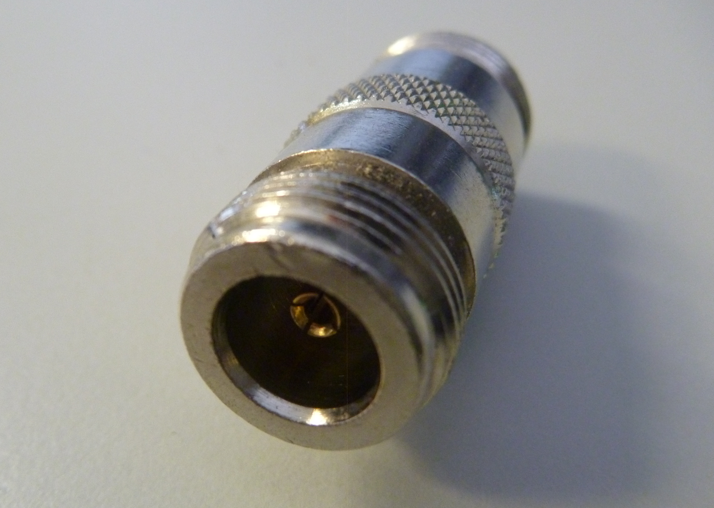

Figure ATL 6: An N female barrel adapter.

 

For example a very useful adapter is the one which enables to join two
Type N connectors, having socket (female) connectors on both sides.

#### Choosing the proper connector

“The gender question.” Most connectors have a well defined gender. Male
connectors have an external housing or sleeve (frequently with an inner
thread) that is meant to surround the body of the female connector. They
normally have a pin that inserts in the corresponding socket of the
female connector, which has a housing threaded on the outer surface or
two bayonet struds protruding from a cylinder. Beware of reverse
polarity connectors, in which the male has an inner socket and the
female an inner pin. Usually cables have male connectors on both ends,
while RF devices (i.e. transmitters and antennas) have female
connectors. Lightning arrestors, directional couplers and line-through
measuring devices may have both male and female connectors. Be sure that
every male connector in your system mates with a female connector.

“Less is best!” Try to minimise the number of connectors and adapters in
the RF chain. Each connector introduces some additional loss (up to a dB
for each connection, depending on the connector!)

“Buy, don’t build!” As mentioned earlier, buy cables that are already
terminated with the connectors you need whenever possible. Soldering
connectors is not an easy task, and to do this job properly is almost
impossible for small connectors as U.FL and MMCX. Even terminating
“Foam” cables is not an easy task. Don’t use BNC for 2.4 GHz or higher.
Use N type connectors (or SMA, SMB, TNC, etc.)

 

Microwave connectors are precision-made parts, and can be easily damaged
by mistreatment. As a general rule, you should rotate the outer sleeve
to tighten the connector, leaving the rest of the connector (and cable)
stationary. If other parts of the connector are twisted while tightening
or loosening, damage can easily occur.

Never step over connectors, or drop connectors on the floor when
disconnecting cables (this happens more often than you may imagine,
especially when working on a mast over a roof).

Never use tools like pliers to tighten connectors. Always use your
hands. When working outside, remember that metals expand at high
temperatures and contract at low temperatures: connector too tight in
the summer can bind or even break in winter.

#### Antennas radiation patterns

Antennas are a very important component of communication systems. By
definition, an antenna is a device used to transform an RF signal
traveling on a transmission line into an electromagnetic wave in free
space. Antennas have a property known as reciprocity, which means that
an antenna will maintain the same characteristics regardless if whether
it is transmitting or receiving. All antennas operate efficiently over a
relatively narrow frequency band. An antenna must be tuned to the same
frequency band of the radio system to which it is connected, otherwise
the reception and the transmission will be impaired. In broadcasting, we
can make do with inefficient receiving antennas, because the
transmitters are very powerful, but in two-way communications we must
have properly sized antennas. When a signal is fed into an antenna, the
antenna will emit radiation distributed in space in a certain way. A
graphical representation of the relative distribution of the radiated
power in space is called a radiation pattern.

### Antenna term glossary

Before we talk about specific antennas, there are a few common terms
that must be defined and explained:

#### Input Impedance

For an efficient transfer of energy, the impedance of the radio,
antenna, and transmission cable connecting them must be the same.
Transceivers and their transmission lines are typically designed for 50
Ω impedance. If the antenna has an impedance different from 50 Ω there
will be a mismatch and reflections will occur unless an impedance
matching circuit is inserted. When any of these components are
mismatched, transmission efficiency suffers.

#### Return loss

Return loss is another way of expressing mismatch. It is a logarithmic
ratio measured in dB that compares the power reflected by the antenna Pr
to the power that is fed into the antenna from the transmission line Pi:

 

Return Loss (in dB) = 10 log10 Pi/Pr

 

While some energy will always be reflected back into the system, a high
return loss will yield unacceptable antenna performance.

The interaction between the wave travelling from the transmitter to the
antenna and the wave reflected by the antenna towards the transmitter
creates what is known as a stationary wave, therefore an alternative way
to measure the impedance mismatch is by means of the Voltage Standing
Wave Ratio (VSWR):

 

Return Loss (in dB) = 20 log10 (VSWR+1 / VSWR-1)

 

In a perfectly matched transmission line, VSWR = 1.

 

In practice, we strive to maintain a VSWR below 2.

#### Bandwidth

The bandwidth of an antenna refers to the range of frequencies FH - FL
over which the antenna can operate correctly. The antenna's bandwidth is

the number of Hz for which the antenna meets certain requirements, like
exhibiting a gain within 3 dB of the maximum gain or a VSWR less than
1.5.

The bandwidth can also be described in terms of percentage of the centre
frequency of the band.

 

Bandwidth = 100 (FH – FL )/FC

 

...where FH is the highest frequency in the band, FL is the lowest
frequency in the band, and FC is the centre frequency in the band.

In this way, bandwidth is constant relative to frequency. If bandwidth
was expressed in absolute units of frequency, it would be different
depending upon the center frequency.

Different types of antennas have different bandwidth limitations.

#### Directivity and Gain

Directivity is the ability of an antenna to focus energy in a particular
direction when transmitting, or to receive energy from a particular
direction when receiving.

If a wireless link uses fixed locations for both ends, it is possible to
use antenna directivity to concentrate the radiation beam in the wanted
direction.

In a mobile application where the transceiver is not fixed, it may be
impossible to predict where the transceiver will be, and so the antenna
should ideally radiate as well as possible in all directions. An
omnidirectional antenna is used in these applications. Gain cannot be
defined in terms of a physical quantity such as the watt or the ohm, but
it is a dimensionless ratio. Gain is given in reference to a standard
antenna.

The two most common reference antennas are the isotropic antenna and the
half-wave dipole antenna.

#### Directivity and Gain

Directivity is the ability of an antenna to focus energy in a particular
direction when transmitting, or to receive energy from a particular
direction when receiving. If a wireless link uses fixed locations for
both ends, it is possible to use antenna directivity to concentrate the
radiation beam in the wanted direction. In a mobile application where
the transceiver is not fixed, it may be impossible to predict where the
transceiver will be, and so the antenna should ideally radiate as well
as possible in all directions. An omnidirectional antenna is used in
these applications. Gain cannot be defined in terms of a physical
quantity such as the watt or the ohm, but it is a dimensionless ratio.
Gain is given in reference to a standard antenna.

The two most common reference antennas are the isotropic antenna and the
half-wave dipole antenna.

The isotropic antenna radiates equally well in all directions. Real
isotropic antennas do not exist, but they provide useful and simple
theoretical antenna patterns with which to compare real antennas. Any
real antenna will radiate more energy in some directions than in others.
Since antennas cannot create energy, the total power radiated is the
same as an isotropic antenna. Any additional energy radiated in the
direction it favours is offset by equally less energy radiated in some
other direction.The gain of an antenna in a given direction is the
amount of energy radiated in that direction compared to the energy an
isotropic antenna would radiate in the same direction when driven with
the same input power. Usually we are only interested in the maximum
gain, which is the gain in the direction in which the antenna is
radiating most of the power, the so called boresight. An antenna gain of
3 dB compared to an isotropic antenna would be written as 3 dBi.

The half-wave dipole can be a useful standard for comparing to other
antennas at one frequency or over a very narrow band of frequencies.

Unlike the isotropic, is very easy to build and sometimes manufacturers
will express the gain with reference to the half-wave dipole instead of
the isotropic. An antenna gain of 3 dB compared to a dipole antenna
would be written as 3 dBd. Since a half-wave dipole has a gain of 2.15
dBi, we can find the dBi gain of any antenna by adding 2.15 to its dBd
gain.

The method of measuring gain by comparing the antenna under test against
a known standard antenna, which has a calibrated gain, is technically
known as a gain transfer technique.

#### Radiation Pattern

The radiation pattern or antenna pattern describes the relative strength
of the radiated field in various directions from the antenna, at a
constant distance. The radiation pattern is a reception pattern as well,
since it also describes the receiving properties of the antenna, as a
consequence of reciprocity. The radiation pattern is three-dimensional,
but usually the published radiation patterns are a two-dimensional slice
of the three-dimensional pattern, in the horizontal and vertical planes.

These pattern measurements are presented in either a rectangular or a
polar format.

The following figure shows a rectangular plot presentation of a typical
ten-element Yagi antenna radiation pattern.

The detail is good but it is difficult to visualize the antenna
behaviour in different directions.

 

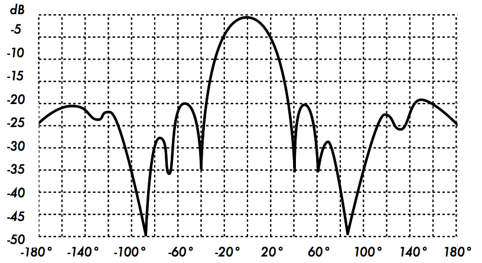

Figure ATL 7: A rectangular plot of the radiation pattern of a Yagi
antenna.

 

Polar coordinate systems are used almost universally.

In the polar-coordinate graph, points are located by projection along a
rotating axis (radius) to an intersection with one of several concentric
circles that represent the correspong gain in dB, referenced to 0 dB at
the outer edge of the plot.

This representation makes it easier to grasp the radial distribution of
the antenna power.

Figure ATL 8 is a polar plot of the same 10 element Yagi antenna.

 

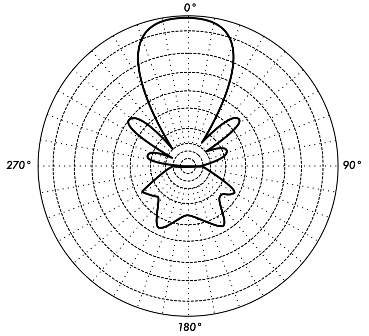

 

Figure ATL 8: The polar radiation pattern plot of the same antenna

 

The field pattern that exists close to the antenna is different from the
one at a distance, which is the one of interest.

The far-field is also called the radiation field.

For radiation pattern measurement it is important to choose a distance
sufficiently large.

The minimum permissible distance depends on the dimensions of the
antenna in relation to the wavelength.

The accepted formula for this distance is:

 

rmin = 2d2 /λ

 

where rmin is the minimum distance from the antenna, d is the largest
dimension of the antenna, and λ is the wavelength.

#### Beamwidth

An antenna's beamwidth is usually understood to mean the half-power
beamwidth. The peak radiation intensity is found, and then the points on
either side of the peak at which the power has reduced by half are
located. The angular distance between the half power points is defined
as the beamwidth. Half the power expressed in decibels is -3 dB, so the
half power beamwidth is sometimes referred to as the 3 dB beamwidth.
Both horizontal and vertical beamwidth are usually considered.

Assuming that most of the radiated power is not divided into sidelobes,
the directive and hence the gain is inversely proportional to the
beamwidth: as the beamwidth decreases, the gain increases. A very high
gain antenna can have a beamwidth of a few degrees and will have to be
pointed very carefully in order not to miss the target. The beamwidth is
defined by the half power points and in turn determines the coverage
area.

Coverage area refers to geographical space “illuminated” by the antenna
and it is roughly defined by the intersection of the beamwidth with the
earth surface. On a base station, it is normally desired to maximise the
coverage area, but sometimes one must resort to “downtilting” the
antenna, either mechanically or electrically, in order to provide
services to customers very close to the base station and therefore below
the beamwidth of a non tilted antenna. This down tilting could be
achieved by mechanically inclining the antenna, but often the beam can
be steered by changing the phase of the signal applied to the different
elements of the antenna in what is known as electrically downtilting.

#### Sidelobes

No antenna is able to radiate all the energy in one preferred direction.
Some is inevitably radiated in other directions. These smaller peaks are
referred to as sidelobes, commonly specified in dB down from the main
lobe. In antenna design, a balance must be struck between gain and
sidelobes.

#### Nulls

In an antenna radiation pattern, a null is a zone in which the effective
radiated power is at a minimum. A null often has a narrow directivity
angle compared to that of the main beam. Thus, the null is useful for
several purposes, such as suppression of interfering signals in a given
direction

#### Polarization

Polarization is defined as the orientation of the electric field of an
electromagnetic wave. The initial polarization of a radio wave is
determined by the antenna. Most antennas are either vertically or
horizontally polarized.

 

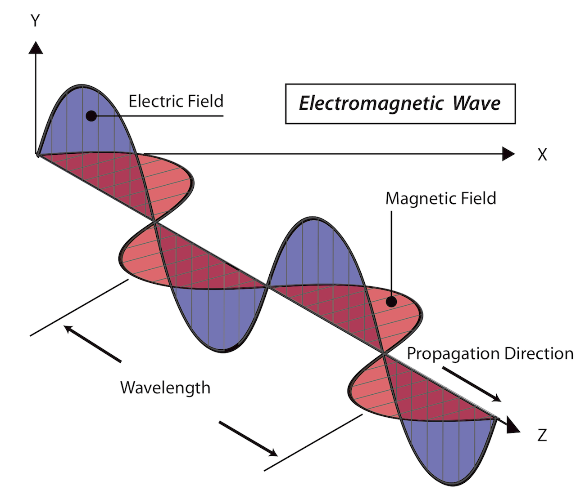

 

Figure ATL 9: The electric field is perpendicular to magnetic field,
both of which are perpendicular to the direction of propagation.

 

The polarization of the transmitting and the receiving antenna must
match, or a very big loss will be incurred.

 

Some modern systems take advantage of polarization by sending two
independent signals at the same frequency, separated by the
polarization. Polarization is in general described by an ellipse. Two
special cases of elliptical polarization are linear polarization and
circular polarization.

With linear polarization, the electric field vector stays in the same
plane all the time.

The electric field may leave the antenna in a vertical orientation, a
horizontal orientation, or at some angle between the two.

Vertically polarized radiation is somewhat less affected by reflections
over the transmission path.

Omnidirectional antennas normally have vertical polarization.

Horizontal antennas are less likely to pick up man- made interference,
which ordinarily is vertically polarized.

 

In circular polarization the electric field vector appears to be
rotating with circular motion about the direction of propagation, making
one full turn for each RF cycle. This rotation may be right-hand or
left-hand.

Choice of polarization is one of the design choices available to the RF
system designer.

#### Polarization Mismatch

In order to transfer maximum power between a transmit and a receive
antenna, both antennas must have the same spatial orientation, and the
same polarization sense.

When the antennas are not aligned or do not have the same polarization,
there will be a reduction in power transfer between the two antennas.
This reduction in power transfer will reduce the overall system
efficiency and performance.

When the transmit and receive antennas are both linearly polarized,
physical antenna misalignment will result in a polarization mismatch
loss, which can be determined using the following formula:

 

Loss (dB) = 20 log10(cos θ)

 

...where θ is the difference in the polarization angle between the two
antennas.

For 15° the loss is approximately 0.3 dB, for 30° we lose 1.25 dB, for
45° we lose 3 dB and for 90° we have an infinite loss.

In short, the greater the mismatch in polarization between a
transmitting and receiving antenna, the greater the loss.

 

In the real world, a 90° mismatch in polarization is quite large but not
infinite. Some antennas, such as Yagis or can antennas, can be simply
rotated 90° to match the polarization of the other end of the link.

You can use the polarization effect to your advantage on a
point-to-point link.

Use a monitoring tool to observe interference from adjacent networks,
and rotate one antenna until you see the lowest received signal. Then
bring your link online and orientate the other end to match
polarization.

This technique can sometimes be used to build stable links, even in
noisy radio environments.

Polarization mismatch can be exploited to send two different signals on
the same frequency at the same time, thus doubling the throughput of the
link. Special antennas that have dual feeds can be used for this
purpose. They have two RF connectors that attach to two independent
radios. The real life throughput is somewhat lower than twice the single
antenna throughput because of the inevitable cross polarization
interference.

#### Front-to-back ratio

It is often useful to compare the front-to-back ratio of directional
antennas. This is the ratio of the maximum directivity of an antenna to
its directivity in the opposite direction.

For example, when the radiation pattern is plotted on a relative dB
scale, the front-to-back ratio is the difference in dB between the level
of the maximum radiation in the forward direction and the level of
radiation at 180 degrees from it.

This number is meaningless for an omnidirectional antenna, but it is
quite relevant when building a system with repeaters, in which the
signal sent backward will interfere with the useful signal and must be
minimised.

#### Antenna Aperture

The electrical “aperture” of a receiving antenna is defined as the cross
section of a parabolic antenna that would deliver the same power to a
matched load.

It is easy to see that a parabolic grid has an aperture very similar to
a solid paraboloid.

The aperture of an antenna is proportional to the gain.

By reciprocity, the aperture is the same for a transmitting antenna.

Notice that the concept of aperture is not easily visualised in the case
of a wire antenna in which the physical area is negligible. In this case
the antenna aperture must be derived from the formula of the gain.

### Types of antennas

A classification of antennas can be based on:

#### Frequency and size.

Antennas used for HF are different from antennas used for VHF, which in
turn are different from antennas for microwave. The wavelength is
different at different frequencies, so the antennas must be different in
size to radiate signals at the correct wavelength.

We are particularly interested in antennas working in the microwave
range, especially in the 2.4 GHz and 5 GHz frequencies.

At 2.4 GHz the wavelength is 12.5 cm, while at 5 GHz it is 6 cm.

#### Directivity.

Antennas can be omnidirectional, sectorial or directive. Omnidirectional
antennas radiate roughly the same signal all around the antenna in a
complete 360° pattern.

 

The most popular types of omnidirectional antennas are the dipole and
the ground plane. Sectorial antennas radiate primarily in a specific
area. The beam can be as wide as 180 degrees, or as narrow as 60
degrees.

 

Directional or directive antennas are antennas in which the beamwidth is
much narrower than in sectorial antennas. They have the highest gain and
are therefore used for long distance links.

 

Types of directive antennas are the Yagi, the biquad, the horn, the
helicoidal, the patch antenna, the parabolic dish, and many others.

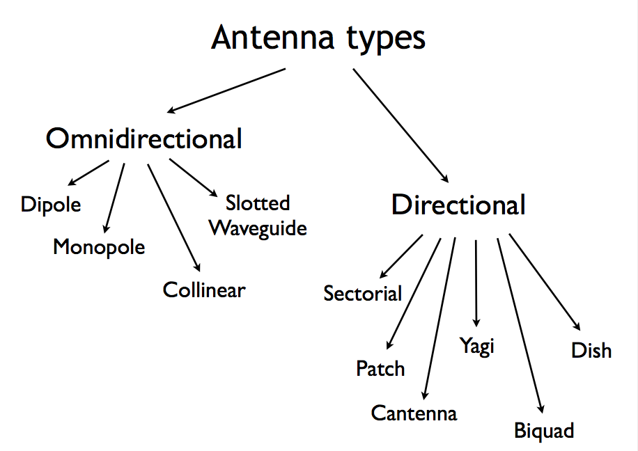

 

Figure ATL 10: Antenna types

 

Physical construction.

Antennas can be constructed in many different ways, ranging from simple
wires, to parabolic dishes, to coffee cans.

 

When considering antennas suitable for 2.4 GHz WLAN use, another
classification can be used:

 

Application.

Access points tend to make point-to-multipoint networks, while remote
links or backbones are point-to-point. Each of these suggest different
types of antennas for their purpose. Nodes that are used for multipoint
access will likely use omni antennas which radiate equally in all
directions, or several sectorial antennas each focusing into a small
area. In the point-to-point case, antennas are used to connect two
single locations together.

Directive antennas are the primary choice for this application.

A brief list of common type of antennas for the 2.4 GHz frequency is
presented now, with a short description and basic information about
their characteristics.

#### 1/4 wavelength ground plane.

The 1⁄4 wavelength ground plane antenna is very simple in its
construction and is useful for communications when size, cost and ease
of construction are important. This antenna is designed to transmit a
vertically polarized signal. It consists of a 1⁄4 wavelength element as
active element and three or four 1⁄4 wavelength ground elements bent 30
to 45 degrees down. This set of elements, called radials, is known as a
ground plane.

 

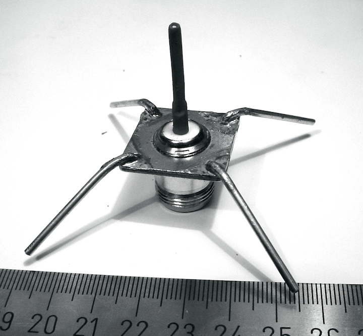

 

Figure ATL 11: Quarter wavelength ground plane antenna.

 

This is a simple and effective antenna that can capture a signal equally
from all directions. The gain of this antenna is in the order of 2 - 4
dBi.

#### Yagi-Uda antenna

A basic Yagi or more properly Yagi-Uda antenna consists of a certain
number of straight elements, each measuring approximately half
wavelength. The driven or active element of a Yagi is the equivalent of
a centre-fed, half-wave dipole antenna.

 

Parallel to the driven element, and approximately 0.2 to 0.5 wavelength
on either side of it, are straight rods or wires called reflectors and
directors, or simply passive elements.

A reflector is placed behind the driven element and is slightly longer
than half wavelength; directors are placed in front of the driven
element and are slightly shorter than half wavelength. A typical Yagi
has one reflector and one or more directors.

The antenna propagates electromagnetic field energy in the direction
running from the driven element toward the directors, and is most
sensitive to incoming electromagnetic field energy in this same
direction. The more directors a Yagi has, the greater the gain.

Following is the photo of a Yagi antenna with 5 directors and one
reflector. Yagi antennas are often enclosed in a cylindrical radome to
afford protection from the weather.

 

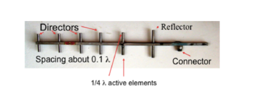

 

Figure ATL 12: Yagi-Uda

 

Yagi antennas are used primarily for Point-to-Point links, have a gain
from 10 to 20 dBi and a horizontal beamwidth of 10 to 20 degrees.

#### Horn

The horn antenna derives its name from the characteristic flared
appearance.

The flared portion can be square, rectangular, cylindrical or conical.

The direction of maximum radiation corresponds with the axis of the
horn.

It is easily fed with a waveguide, but can be fed with a coaxial cable
and a proper transition.

While it is cumbersome to make a horn antenna at home, a cylindrical can
with proper dimensions will have similar characteristics.

 

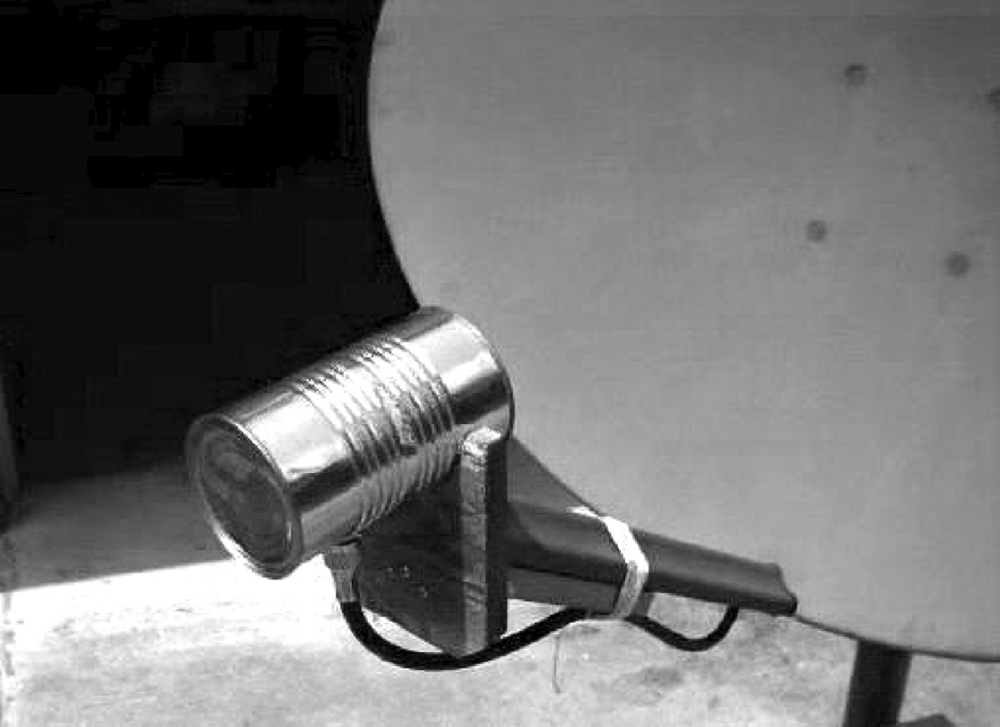

 

Figure ATL 13: Feed horn made from a food can.

 

Horn antennas are commonly used as the active element in a dish antenna.
The horn is pointed toward the centre of the dish reflector.

The use of a horn, rather than a dipole antenna or any other type of
antenna, at the focal point of the dish minimizes loss of energy around
the edges of the dish reflector.

 

At 2.4 GHz, a simple horn antenna made with a tin can has a gain in the
order of 10 dBi.

#### Parabolic Dish

Antennas based on parabolic reflectors are the most common type of
directive antennas when a high gain is required.

The main advantage is that they can be made to have gain and directivity
as large as required. The main disadvantage is that big dishes are
difficult to mount and are likely to have a large wind load.

Randomes can be used to reduce the wind load or windage, as well as for
weather protection.

 

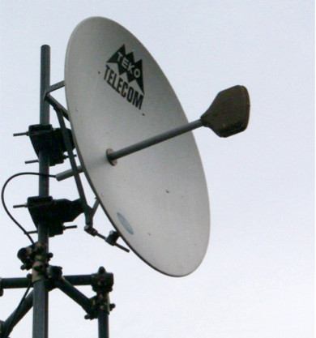

 

Figure ATL 14: A solid dish antenna.

 

Dishes up to one metre are usually made from solid material.

Aluminum is frequently used for its weight advantage, its durability and
good electrical characteristics.

Windage increases rapidly with dish size and soon becomes a severe
problem. Dishes which have a reflecting surface that uses an open mesh
are frequently used.

These have a poorer front-to-back ratio, but are safer to use and easier
to build.

Copper, aluminum, brass, galvanized steel and steel are suitable mesh
materials.

#### BiQuad

The BiQuad antenna is simple to build and offers good directivity and
gain for Point-to-Point communications. It consists of a two squares of
the same size of 1⁄4 wavelength as a radiating element and of a metallic
plate or grid as reflector. This antenna has a beamwidth of about 70
degrees and a gain in the order of 10-12 dBi. It can be used as
stand-alone antenna or as feeder for a Parabolic Dish.

The polarization is such that looking at the antenna from the front, if
the squares are placed side by side the polarization is vertical.

 

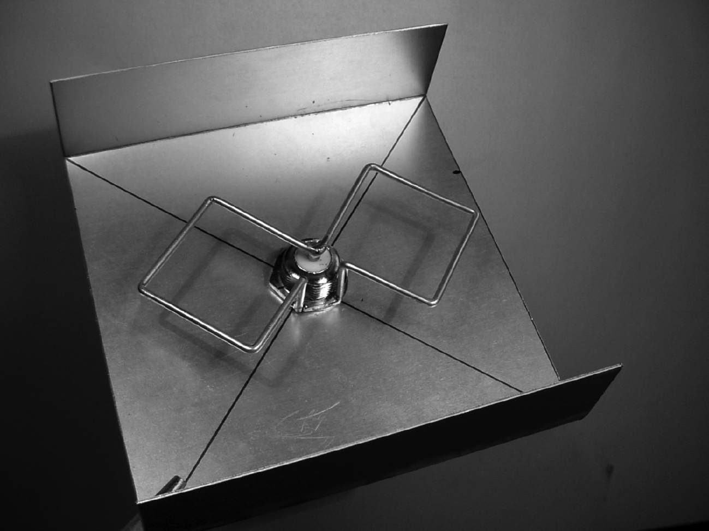

 

Figure ATL 15: The BiQuad.

#### Log Periodic Antennas

Log periodic antennas have moderate gain over a wide frequency band,
They are often used in spectrum analysers for testing purposes and are
also popular as TV receiving antennas since they can efficiently cover
from channel 2 up to channel 14. These antennas are used in White space
devices that require the ability to work in widely different channels.

 

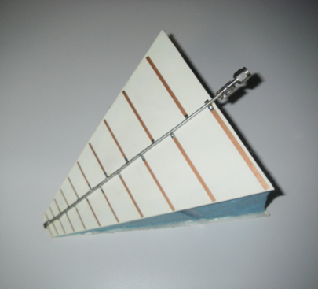

 

Figure ATL 16: Log periodic antenna

#### Other Antennas

Many other types of antennas exist and new ones are created following
advances in technology.

 

Sector or Sectorial antennas: they are widely used in cellular telephony
infrastructure and are usually built adding a reflective plate to one or
more phased dipoles.

Their horizontal beamwidth can be as wide as 180 degrees, or as narrow
as 60 degrees, while the vertical is usually much narrower.

Composite antennas can be built with many Sectors to cover a wider
horizontal range (multisectorial antenna).

Panel or Patch antennas: they are solid flat panels used for indoor
coverage, with a gain up to 23 dBi.

### Reflector theory

The basic property of a perfect parabolic reflector is that it converts
a spherical wave irradiating from a point source placed at the focus
into a plane wave. Conversely, all the energy received by the dish from
a distant source is reflected to a single point at the focus of the
dish. The position of the focus, or focal length, is given by:

 

f = D2 /16 c

 

...where D is the dish diameter and c is the depth of the parabola at
its centre.

 

The size of the dish is the most important factor since it determines
the maximum gain that can be achieved at the given frequency and the
resulting beamwidth. The gain and beamwidth obtained are given by:

 

                      Gain = ((3.14 D)2 / λ2) η

 

Beamwidth = 70 λ / D

 

...where D is the dish diameter and η is the efficiency. The efficiency
is determined mainly by the effectiveness of illumination of the dish by
the feed, but also by other factors. Each time the diameter of a dish is
doubled, the gain is four times or 6 dB greater. If both stations double
the size of their dishes, signal strength can be increased by 12 dB, a
very substantial gain. An efficiency of 50% can be assumed when hand-
building antennas.

 

The ratio f / D (focal length/diameter of the dish) is the fundamental
factor governing the design of the feed for a dish. The ratio is
directly related to the beamwidth of the feed necessary to illuminate
the dish effectively. Two dishes of the same diameter but different
focal lengths require different design of feed if both are to be
illuminated efficiently. The value of 0.25 corresponds to the common
focal-plane dish in which the focus is in the same plane as the rim of
the dish.

The optimum illumination of a dish is a compromise between maximising
the gain and minimising the sidelobes.

### Amplifiers

As mentioned earlier, antennas do not actually create power. They simply
direct all available power into a particular pattern. By using a power
amplifier, you can use DC power to augment your available signal. An
amplifier connects between the radio transmitter and the antenna, and
has an additional cable that connects to a power source.

Amplifiers are available that work at 2.4 GHz, and can add several Watts
of power to your transmission. These devices sense when an attached
radio is transmitting, and quickly power up and amplify the signal. They
then switch off again when transmission ends. When receiving, they also
add amplification to the signal before sending it to the radio.

Unfortunately, simply adding amplifiers will not magically solve all of
your networking problems.

We do not discuss power amplifiers at length in this book because there
are a number of significant drawbacks to using them:

 

-   They are expensive. Amplifiers must work at relatively wide
    bandwidths at 2.4 GHz, and must switch quickly enough to work for
    Wi- Fi applications. 

-   They provide no additional directionality. High gain antennas not
    only improve the available amount of signal, but tend to reject
    noise from other directions. Amplifiers blindly amplify both desired
    and interfering signals, and can make interference problems worse.  

-   Amplifiers generate noise for other users of the band. By
    increasing your output power, you are creating a louder source of
    noise for other users of the unlicensed band. Conversely, adding
    antenna gain will improve your link and can actually decrease the
    noise level for your neighbours. 

-   Using amplifiers is often illegal. Every country imposes power
    limits on use of unlicensed spectrum. Adding an antenna to a highly
    amplified signal will likely cause the link to exceed legal limits. 

 

Antennas cost far less than amps, and can improve a link simply by
changing the antenna on one end.

 

Using more sensitive radios and good quality cable also helps
significantly on long distance wireless links.

These techniques are unlikely to cause problems for other users of the
band, and so we recommend pursuing them before adding amplifiers.

Many manufacturers offer high power versions of their WiFi radios at
both 2 and 5 GHz, which have a built in amplifiers.

These are better than external amplifiers, but do not assume that it is
always smart to use the high power version, for many application the
standard power coupled with a high gain antenna is actually better.

### Practical antenna designs

The cost of 2.4 GHz antennas has fallen dramatically with the increased
popularity of WiFi. Innovative designs use simpler parts and fewer
materials to achieve impressive gain with relatively little machining.
Unfortunately, availability of good antennas is still limited in some
areas of the world, and importing them can be expensive.

While actually designing an antenna can be a complex and error-prone
process, constructing antennas from locally available components is very
straightforward, and can be a lot of fun.

 

In Appendix A called Antenna Construction we present some practical
antenna designs that can be built for very little money.

### Antenna measurements

Precise antenna instruments require expensive instruments and
installations. It is therefore advisable to obtain the antenna
parameters values directly from a reputable manufacturer.

An anechoic chamber is needed to perform accurate antenna measurements,
otherwise the reflections will cause false readings.

 

Ice affects the performance of all antennas to some degree and the
problem gets more serious at higher frequencies. The impedance of free
space is 377 ohms. If the air immediately surrounding the dipole
elements is replaced by ice which has a lower impedance than air, then
the impedance match and radiation patterns of the antenna will change.

 

These changes become progressively worse as the ice loading increases.

 

Antenna elements are usually encased in a plastic protective housing
(radome). This provides an air space between the elements and ice casing
so that the lower impedance of the ice layer has only a small effect on
the radiators.

 

Detuning is greatly reduced but radiation pattern distortion may still
be encountered (detuning reduces usable antenna bandwidth). For a given
ice thickness, deviation from nominal performance values become worse as
frequency increases.

In areas where severe icing and wet snow are common, it is prudent to
install a full radome over solid parabolic antennas, to use panel
antennas instead of corner reflectors, and to stay away from grid
parabolics.

 

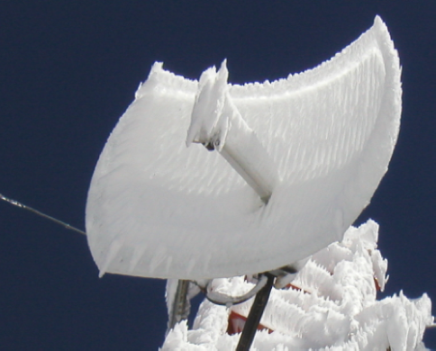

 

Figure ATL 17: Effect of ice on a parabolic grid antenna
