6. NETWORKING
-------------

 

Before purchasing equipment or deciding on a hardware platform, you
should have a clear idea of the nature of your communications problem.
Most likely, you are reading this book because you need to connect
computer networks together in order to share resources and ultimately
reach the larger global Internet.

The network design you choose to implement should fit the communications
problem you are trying to solve.

 

Do you need to connect a remote site to an Internet connection in the
centre of your campus? Will your network likely grow to include several
remote sites? Will most of your network components be installed in fixed
locations, or will your network expand to include hundreds of roaming
laptops and other devices?

 

In this chapter, we will review the networking concepts that define
TCP/IP, the primary family of networking protocols currently used on the
Internet.

We will also look at the hardware options that are likely to form the
underlying physical layer of your TCP/IP network and end with some
examples of wireless configurations. This will prepare you very well for
the chapter called Deployment Planning later in this book.

 

TCP/IP refers to the suite of protocols that allow conversations to
happen on the global Internet.

By understanding TCP/IP, you can build networks that will scale to
virtually any size, and will ultimately become part of the global
Internet.

 

This edition of the book now includes an introduction to IPv6 which is
the new numbering system of the Internet.

As it is very likely you will be deploying networks using IPv6, it is
highly recommended you become familiar with how this works and also how
it can work alongside the older IPv4 networks that will continue to
operate on the Internet for some while yet.

### Introduction

Venice, Italy is a fantastic city to get lost in. The roads are mere
foot paths that cross water in hundreds of places, and never go in a
simple straight line. Postal carriers in Venice are some of the most
highly trained in the world, specialising in delivery to only one or two
of the six sestieri (districts) of Venice. This is necessary due to the
intricate layout of that ancient city. Many people find that knowing the
location of the water and the sun is far more useful than trying to find
a street name on a map.

 

Imagine a tourist who happens to find papier-mâché mask as a souvenir,
and wants to have it shipped from the studio in S. Polo, Venezia to
their home in London, United Kingdom. This may sound like an ordinary
(or even trivial) task, but let's look at what actually happens.

 

 

Figure NG 1: Another kind of network mask.

 

The artist first packs the mask into a shipping box and addresses it to
the home of the tourist.

 

They then hand this to a postal employee in Venice, who attaches some
official forms and sends it to a central package processing hub for
international destinations.

 

After several days, the package clears Italian customs and finds its way
onto a flight to the UK, arriving at a central import processing depot
at Heathrow airport. Once it clears through customs, the package is sent
to a distribution point in the city of London, then on to the local
district postal processing centre of Camden where the tourist lives.

The package eventually makes its way onto a delivery van which has a
route that brings it to the correct house on the correct street in
Camden. A member of the family accepts and signs for the package from
the delivery van driver and then leaves it in the home studio of the
tourist who enjoys unpacking it some time later.

 

The sorting clerk at the office in Camden neither knows nor cares about
how to get to the sestiere of S. Polo, Venezia.

His job is simply to accept packages as they arrive, and deliver them to
the correct person in Camden.

Similarly, the postal employee in Venice has no need to worry about how
to get to the correct address in London. His job is to accept packages
from his local neighborhood and forward them to the next closest hub in
the delivery chain.

 

This is very similar to how Internet routing works. A message is split
up into many individual packets, and are labelled with their source and
destination.

The computer then sends these packets to a router, which decides where
to send them next.

 

The router needs only to keep track of a handful of routes (for example,
how to get to the local network, the best route to a few other local
networks, and one route to a gateway to the rest of the Internet). This
list of possible routes is called the routing table.

As packets arrive at the router, the destination address is examined and
compared against its internal routing table.

If the router has no explicit route to the destination in question, it
sends the packet to the closest match it can find, which is often its
own Internet gateway (via the default route).

And the next router does the same, and so forth, until the packet
eventually arrives at its destination.

Packages can only make their way through the international postal system
because we have established a standardised addressing scheme for
packages.

For example, the destination address must be written legibly on the
front of the package, and include all critical information (such as the
recipient's name, street address, city, country, and postal code).
Without this information, packages are either returned to the sender or
are lost in the system. Packets can only flow through the global
Internet because we have agreed on a common addressing scheme and
protocol for forwarding packets.

These standard communication protocols make it possible to exchange
information on a global scale.

 

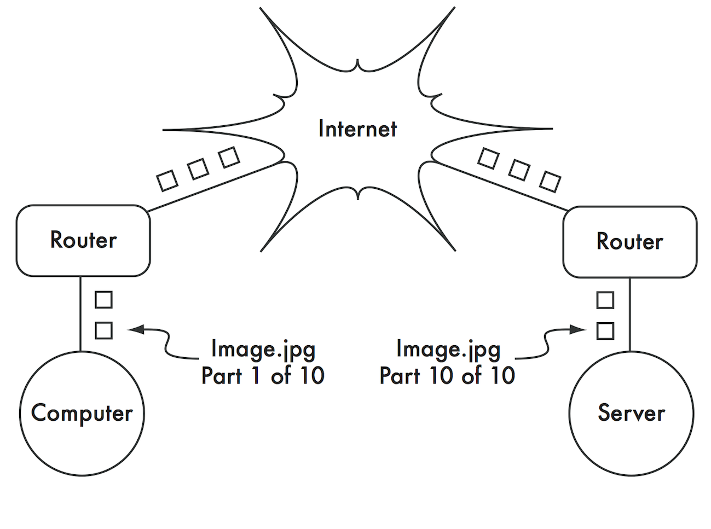

Figure NG 2: Internet networking. Packets are forwarded between routers
until they reach their ultimate destination.

 

### Cooperative communications

Communication is only possible when the participants speak a common
language. But once the communication becomes more complex than a simple
conversation between two people, protocol becomes just as important as
language.

All of the people in an auditorium may speak English, but without a set
of rules in place to establish who has the right to use the microphone,
the communication of an individual’s ideas to the entire room is nearly
impossible. Now imagine an auditorium as big as the world, full of all
of the computers that exist.

Without a common set of communication protocols to regulate when and how
each computer can speak, the Internet would be a chaotic mess where
every machine tries to speak at once. People have developed a number of
communications frameworks to address this problem. The most well-known
of these is the OSI model.

### The OSI model

The international standard for Open Systems Interconnection (OSI) is
defined by the document ISO/IEC 7498-1, as outlined by the International
Standards Organization and the International Electrotechnical
Commission. The full standard is available as publication "ISO/IEC
7498-1:1994," available from
[http://standards.iso.org/ittf/PubliclyAvailableStandards/.](http://standards.iso.org/ittf/PubliclyAvailableStandards/)

The OSI model divides network traffic into a number of layers. Each
layer is independent of the layers around it, and each builds on the
services provided by the layer below while providing new services to the
layer above. The abstraction between layers makes it easy to design
elaborate and highly reliable protocol stacks, such as the ubiquitous
TCP/IP stack. A protocol stack is an actual implementation of a layered
communications framework. The OSI model doesn't define the protocols to
be used in a particular network, but simply delegates each
communications "job" to a single layer within a well-defined hierarchy.

While the ISO/IEC 7498-1 specification details how layers should
interact with each other, it leaves the actual implementation details up
to the manufacturer. Each layer can be implemented in hardware (more
common for lower layers) or software.

As long as the interface between layers adheres to the standard,
implementers are free to use whatever means are available to build their
protocol stack.

 

This means that any given layer from manufacturer A can operate with the
same layer from manufacturer B (assuming the relevant specifications are
implemented and interpreted correctly).

Here is a brief outline of the seven-layer OSI networking model:

 

Layer

Name

Description

7

Application

The Application Layer is the layer that most network users are exposed
to; it is the level at which human communication happens. HTTP, FTP, and
SMTP are all application layer protocols.

The human sits above this layer, interacting with the application.

6

Presentation

The Presentation Layer deals with data representation, before it reaches
the application. This would include HTML, MIME encoding, data
compression, formatting checks, byte ordering, etc.

5

Session

The Session Layer manages the logical communications session between
applications. RPC is an example of a layer five protocol.

4

Transport

The Transport Layer provides a method of reaching a particular service
on a given network node. Examples of protocols that operate at this
layer are TCP, UDP and SCTP. Some protocols at the transport layer (such
as TCP) ensure that all of the data has arrived at the destination, and
is reassembled and delivered to the next layer in the proper order. UDP
is a "connectionless" protocol commonly used for video and audio
streaming and doesnt check arrival of data packets.

3

Network

IP (the Internet Protocol) is the most common Network Layer protocol.
This is the layer where routing occurs. Packets can leave the link local
network and be retransmitted on other networks. Routers perform this
function on a network by having at least two network interfaces, one on
each of the networks to be interconnected. Nodes on the Internet are
reached by their globally unique IP address. Another critical Network
Layer protocol is ICMP, which is a special protocol which provides
various management messages needed for correct operation of IP. This
layer is also sometimes referred to as the Internet Layer.

2

Data Link

Whenever two or more nodes share the same physical medium (for example,
several computers plugged into a hub, or a room full of wireless devices
all using the same radio channel) they use the Data Link Layer to
communicate. Common examples of data link protocols are Ethernet, Token
Ring, ATM, and the wireless networking protocols (IEEE 802.11A/B/G).
Communication on this layer is said to be link-local, since all nodes
connected at this layer communicate with each other directly. This layer
is sometimes known as the Media Access Control (MAC) layer. On Ethernet
networks, nodes are referred to by their MAC address. This is a unique
48-bit number assigned to every networking device when it is
manufactured.

1

Physical

The Physical Layer is the lowest layer in the OSI model, and refers to
the actual physical medium over which communicationstake place. This can
be a copper CAT5 cable, a fibre optic bundle, radio waves, or just about
any other medium capable of transmitting signals. Cut wires, broken
fibre, and RF interference are all physical layer problems.

 

The layers in this model are numbered one through seven, with seven at
the top. This is meant to reinforce the idea that each layer builds
upon, and depends upon, the layers below. Imagine the OSI model as a
building, with the foundation at layer one, the next layers as
successive floors, and the roof at layer seven. If you remove any single
layer, the building will not stand. Similarly, if the fourth floor is on
fire, then nobody can pass through it in either direction.

 

The first three layers (Physical, Data Link, and Network) all happen "on
the network." That is, activity at these layers is determined by the
configuration of cables, switches, routers, and similar devices. A
network switch can only distribute packets by using MAC addresses, so it
need only implement layers one and two. A simple router can route
packets using only their IP addresses, so it needs to implement only
layers one through three. A web server or a laptop computer runs
applications, so it must implement all seven layers. Some advanced
routers may implement layer four and above, to allow them to make
decisions based on the higher-level information content in a packet,
such as the name of a website, or the attachments of an email.

 

The OSI model is internationally recognised, and is widely regarded as
the complete and definitive network model. It provides a framework for
manufacturers and network protocol implementers that can be used to
build networking devices which interoperate in just about any part of
the world. From the perspective of a network engineer or troubleshooter,
the OSI model can seem needlessly complex. In particular, people who
build and troubleshoot TCP/IP networks rarely need to deal with problems
at the Session or Presentation layers. For the majority of Internet
network implementations, the OSI model can be simplified into a smaller
collection of five layers.

### The TCP/IP model

Unlike the OSI model, the TCP/IP model is not an international standard
and its definitions vary. Nevertheless, it is often used as a pragmatic
model for understanding and troubleshooting Internet networks.

The vast majority of the Internet uses TCP/IP, and so we can make some
assumptions about networks that make them easier to understand.

 

The TCP/IP model of networking describes the following five layers:

 

Layer

Name

5

Application

4

Transport

3

Internet

2

Data Link

1

Physical

 

In terms of the OSI model, layers five through seven are rolled into the
topmost layer (the Application layer). The first four layers in both
models are identical.

Many network engineers think of everything above layer four as "just
data" that varies from application to application.

Since the first three layers are interoperable between virtually all
manufacturers' equipment, and layer four works between all hosts using
TCP/IP, and everything above layer four tends to apply to specific
applications, this simplified model works well when building and
troubleshooting TCP/IP networks.

 

We will use the TCP/IP model when discussing networks in this book.

 

The TCP/IP model can be compared to a person delivering a letter to a
city office building.

The person first needs to interact with the road itself (the Physical
layer), pay attention to other traffic on the road (the Data Link
layer), turn at the correct junction to join another road and arrive at
the correct address (the Internet layer), go to the correct floor and
room number (the Transport layer), and finally give it to a receptionist
who can take the letter from there (the Application layer).

 

Once they have delivered the message to the receptionist, the delivery
person is free to go on their way. The five layers can be easily
remembered by using the mnemonic “Please Don’t Look In The Attic,” which
of course stands for “Physical / Data Link / Internet / Transport /
Application.”

 

### The Internet Protocols

TCP/IP is the protocol stack most commonly used on the global Internet.
The acronym stands for Transmission Control Protocol (TCP) and Internet
Protocol (IP), but actually refers to a whole family of related
communications protocols. TCP/IP is also called the Internet protocol
suite, and it operates at layers three and four of the TCP/IP model.

In this discussion, we will focus on version six of the IP protocol
(IPv6) as since 2012 this is the version to deploy in parallel with the
previous version four (IPv4). In 2012, about half of the Internet
content is available with a better user experience by using IPv6.

The previous version is explained in this chapter too because some old
content or old applications (Skype in 2012) still require IPv4. And
indeed many networks that you might have to interconnect to will still
have the legacy IPv4 technology deployed for some years to come.

 

Besides the length of the address, IPv4 and IPv6 are quite similar: they
are connectionless network protocols running on the same data-link layer
(WiFi, Ethernet...) and serving the same transport protocols (TCP, SCTP,
UDP...) In this book, when IP is written without any version, then it
means that it applies to both versions. A dual-stack network is a
network that runs IPv6 and IPv4 and the same time. It is expected that
dual-networks will be the norm at least until 2020 when IPv6-only will
become the norm.

#### IPv6 Addressing

The IPv6 address is a 128-bit number usually written as multiple
hexadecimal numbers. In order to make this address human-readable, it is
written in chunks of 32 bits or 4 hexadecimal numbers separated by a
colon ':'. The hexadecimal number should be written in lowercase but can
also be written in uppercase. An example of an IPv6 address is:

 

2001:0db8:1234:babe:0000:0000:0000:0001

 

This address corresponds to:

 

2001

0db8

1234

babe

0

0

0

1

 

As these addresses are quite long, it is common to remove the leading 0
in each chunk, so, the same address can also be written as:

 

2001:db8:1234:babe:0:0:0:1

 

This address can further be simplified by grouping one block of
consecutive chunks of '0' into the abbreviated form of '::', the same
address becomes then:

 

2001:db8:1234:babe::1

 

There are some specific IPv6 addresses:

 

-   ::1 (or 0000:00000:0000:0000:0000:0000:0000:0001) represents the
    loopback address, this is the node itself when the node wants to
    send packets to itself; 

-   :: (all zero) is the undetermined address, to be used by a node
    when it does not know its global address, for instance when it
    boots. 

#### IPv6 Prefixes

IPv6 nodes on the same link or network share the same IPv6 prefix, which
is defined as the most-significant part of the IPv6 address. The prefix
length is usually 64 bit on a LAN. So, our usual address of
2001:db8:babe::1 can be written as 2001:db8:1234:babe::1/64 (the prefix
length is added at the end of the address after a '/'). Defining a
prefix length on an address actually splits the address in two parts:
the prefix itself and the interface identifier (IID).

 

2001

0DB8

1234

babe

0

0

0

0

Prefix

  Interface Identifier

 

On a LAN or WLAN, the prefix length must be 64 bits else some protocols
will not work correctly. All nodes on the same LAN or WLAN usually share
the same prefix but their IID must be unique to avoid confusion.

The analogy with a postal address in big cities is that the street name
is the prefix and the house number is the IID.

The prefix length can be different on links that are neither LAN or
WLAN. The network itself is identified by the prefix without any IID but
with the prefix length, for example: 2001:db8:1234:babe::/64

#### IPv4 Addressing

In an IPv4 network, the address is a 32-bit number, normally written as
four 8-bit numbers expressed in decimal form and separated by periods.
Examples of IPv4 addresses are 10.0.17.1, 192.168.1.1, or 172.16.5.23.

 

If you enumerated every possible IPv4 address, they would range from
0.0.0.0 to 255.255.255.255.

This yields a total of more than four billion possible IPv4 addresses
(255 x 255 x 255 x 255 = 4,228,250,625); although many of these are
reserved for special purposes and should not be assigned to hosts.

 

Some IPv4 addresses that are special:

 

-   127.0.0.1 represents the loopback address (similar to ::1 for
    IPv6); 

-   0.0.0.0        represents the unspecified address (similar to ::
    for IPv6). 

#### IPv4 Subnets

By applying a subnet mask (also called a network mask, or simply netmask
or even prefix) to an IPv4 address, you can logically define both a host
and the network to which it belongs.

 

Traditionally, subnet masks are expressed using dotted decimal form,
much like an IPv4 address. For example, 255.255.255.0 is one common
netmask. You will find this notation used when configuring network
interfaces, creating routes, etc. However, subnet masks are more
succinctly expressed using CIDR notation, which simply enumerates the
number of bits in the mask after a forward slash (/).

Thus, 255.255.255.0 can be simplified as /24. CIDR is short for
Classless Inter-Domain Routing, and is defined in RFC1518. A subnet mask
determines the size of a given network. Using a /24 netmask, 8 bits are
reserved for hosts (32 bits total - 24 bits of netmask = 8 bits for
hosts). This yields up to 256 possible host addresses (28 = 256). By
convention, the first value is taken as the network address (.0 or
00000000), and the last value is taken as the broadcast address (.255 or
11111111).

This leaves 254 addresses available for hosts on this network.

Subnet masks work by applying AND logic to the 32 bit IPv4 number.

In binary notation, the "1" bits in the mask indicate the network
address portion, and "0" bits indicate the host address portion. A
logical AND is performed by comparing two bits. The result is "1" if
both of the bits being compared are also "1". Otherwise the result is
"0".

Here are all of the possible outcomes of a binary AND comparison between
two bits.

 

Bit 1

Bit 2

Result

0

0

0

0

1

0

1

0

0

1

1

1

 

To understand how a netmask is applied to an IPv4 address, first convert
everything to binary. The netmask 255.255.255.0 in binary contains
twenty-four "1" bits:

255 255 255 0

11111111.11111111.11111111.00000000

When this netmask is combined with the IPv4 address 10.10.10.10, we can
apply a logical AND to each of the bits to determine the network
address.

10.10.10.10: 00001010.00001010.00001010.00001010

255.255.255.0: 11111111.11111111.11111111.00000000

--------------------------------------------------------------------------------------

10.10.10.0: 00001010.00001010.00001010.00000000

This results in the network 10.10.10.0/24.

This network consists of the hosts 10.10.10.1 through 10.10.10.254, with
10.10.10.0 as the network address and 10.10.10.255 as the broadcast
address.

Subnet masks are not limited to entire octets. One can also specify
subnet masks like 255.254.0.0 (or /15 CIDR). This is a large block,
containing 131,072 addresses, from 10.0.0.0 to 10.1.255.255.

It could be further subdivided, for example into 512 subnets of 256
addresses each. The first one would be 10.0.0.0-10.0.0.255, then
10.0.1.0-10.0.1.255, and so on up to 10.1.255.0-10.1.255.255.
Alternatively, it could be subdivided into 2 blocks of 65,536 addresses,
or 8192 blocks of 16 addresses, or in many other ways. It could even be
subdivided into a mixture of different block sizes, as long as none of
them overlap, and each is a valid subnet whose size is a power of two.

While many netmasks are possible, common netmasks include:

 

CIDR

Decimal

\# of Hosts

/30

255.255.255.252

4

/29

255.255.255.248

8

/28

255.255.255.240

16

/27

255.255.255.224

32

/26

255.255.255.192

64

/25

255.255.255.128

128

/24

255.255.255.0

256

/16

255.255.0.0

65 536

/8

255.0.0.0

16 777 216

 

 

With each reduction in the CIDR value the IPv4 space is doubled.
Remember that two IPv4 addresses within each network are always reserved
for the network and broadcast addresses.

 

There are three common netmasks that have special names. A /8 network
(with a netmask of 255.0.0.0) defines a Class A network. A /16
(255.255.0.0) is a Class B, and a /24 (255.255.255.0) is called a Class
C.

These names were around long before CIDR notation, but are still often
used for historical reasons.

In many ways as you can already see IPv6 is easier to plan for than
IPv4.

#### Global IP Addresses

Interconnected networks must agree on an IP addressing plan for IPv6 and
IPv4 addresses.

 

IP addresses must be unique and generally cannot be used in different
places on the Internet at the same time; otherwise, routers would not
know how best to route packets to them.

 

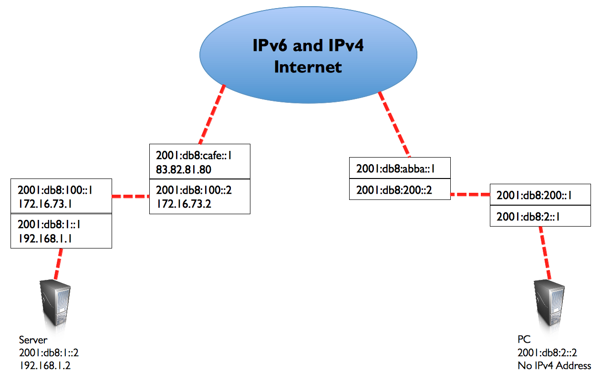

 

Figure NG 3: With unique IP addresses, ambiguous global routing is
impossible. If the PC requests a web page from 2001:db8:1::2, it will
reach the correct server.

 

In order to keep IP addresses unique and globally routable, they are
allocated by a central numbering authority that provides a consistent
and coherent numbering method. This ensures that duplicate addresses are
not used by different networks.

The authority assigns large blocks of consecutive addresses to smaller
authorities, who in turn assign smaller consecutive blocks within these
ranges to other authorities, or to their customers. The groups of
addresses are called subnets or prefixes as we have already mentioned.

A group of related addresses is referred to as an address space.

Both IPv4 and IPv6 addresses are administered by the Internet Assigned
Numbers Authority (IANA, [http://www.iana.org/](http://www.iana.org/)).

IANA has divided these address spaces into large subnets, and these
subnets are delegated to one of the five regional Internet registries
(RIRs), who have been given authority over large geographic areas.

 

IP addresses are assigned and distributed by Regional Internet
Registrars (RIRs) to ISPs. The ISP then allocates smaller IP blocks to
their clients as required. Virtually all Internet users obtain their IP
addresses from an ISP.

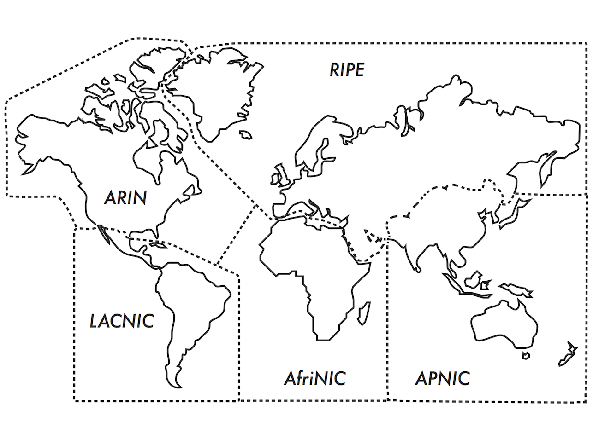

Figure NG 4: Authority for Internet IP address assignments is delegated
to the five Regional Internet Registrars.

 

The five RIRs are:

 

1.  1)African Network Information Centre  

    (AfriNIC, [http://www.afrinic.net](http://www.afrinic.net/)) 

2.  2)Asia Pacific Network Information Centre 

    (APNIC, [http://www.apnic.net](http://www.apnic.net/))  

3.  3)American Registry for Internet Numbers 

    (ARIN, [http://www.arin.net](http://www.arin.net/)) 

4.  4)Regional Latin-American and Caribbean IP Address Registry (LACNIC,
    [http://www.lacnic.net](http://www.lacnic.net/)) 

5.  5)Réseaux IP Européens  

    (RIPE NCC, [http://www.ripe.net](http://www.ripe.net/)) 

     

Your ISP will assign globally routable IP address space to you from the
pool allocated to it by your RIR.

 

The registry system assures that IP addresses are not reused in any part
of the network anywhere in the world.

Once IP address assignments have been agreed upon, it is possible to
pass packets between networks and participate in the global Internet.

The process of moving packets between networks is called routing.

#### Static IP Addresses

A static IP address is an address assignment that never changes.

Static IP addresses are important because servers using these addresses
may have DNS mappings pointing towards them, and typically serve
information to other machines (such as email services, web servers,
etc.).

Blocks of static IP addresses may be assigned by your ISP, either by
request or automatically depending on your means of connection to the
Internet.

#### Dynamic IP Addresses

Dynamic IP addresses are assigned by an ISP for non-permanent nodes
connecting to the Internet, such as a home computer which is on a
dial-up connection or a laptop connecting to a wireless hotspot.

Dynamic IP addresses can be assigned automatically using the Dynamic
Host Configuration Protocol (DHCP), or the Point-to-Point Protocol
(PPP), depending on the type of Internet connection.

 

A node using DHCP first requests an IP address assignment from the
network, and automatically configures its network interface. IP
addresses can be assigned randomly from a pool by your ISP, or might be
assigned according to a policy. IP addresses assigned by DHCP are valid
for a specified time (called the lease time).

 

The node must renew the DHCP lease before the lease time expires. Upon
renewal, the node may receive the same IP address or a different one
from the pool of available addresses.

 

While DHCP works for IPv6 and IPv4, IPv6 has another primary mechanism
which is more commonly used for address assignment - it is called
Stateless Address Auto-Configuration (SLAAC) which is the default on
routers and hosts running IPv6.

 

It does not require a DHCP server; the router sends periodically Router
Advertisement (RA) messages on all connected (W)LAN's which contain the
64-bit prefix to be used on that (W)LAN; hosts then generate their
64-bit interface identifier (usually a random number or a number based
on their MAC address – see further) and build their 128-bit address by
concatenating the 64-bit prefix from the RA and the newly created 64-bit
IID.

 

Dynamic addresses are popular with Internet Service Providers, because
it enables them to use fewer IP addresses than their total number of
customers.

They only need an address for each customer who is active at any one
time.

Globally routable IP addresses cost money, and there is now a shortage
of IPv4 addresses.

Assigning addresses dynamically allows ISPs to save money, and they will
often charge extra to provide a static IP address to their customers.

#### Private IPv4 addresses

Around 2000, it became clear that there would not be enough IPv4
addresses for everyone; this is the reason that IPv6 was specified and
developed.

But there was also a temporary trick as most private networks do not
require the allocation of globally routable, public IPv4 addresses for
every computer in the organisation.

In particular, computers which are not public servers do not need to be
addressable from the public Internet.

Organisations typically use IPv4 addresses from the private address
space for machines on the internal network.

 

There are currently three blocks of private address space reserved by
IANA: 10.0.0.0/8, 172.16.0.0/12, and 192.168.0.0/16.

 

These are defined in RFC1918.

These addresses are not intended to be routed on the Internet, and are
typically unique only within an organisation or group of organisations
that choose to follow the same numbering scheme.

 

 

This means that several distinct organisations can use the same
addresses as long as they never interconnect their networks directly.

 

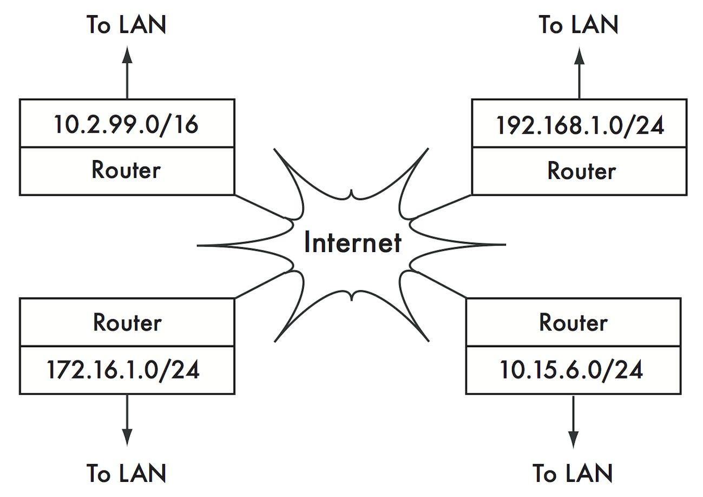

 

Figure NG 5: RFC1918 private addresses may be used within an
organisation, and are not routed on the global Internet.

 

If you ever intend to link together private networks that use RFC1918
address space, be sure to use unique addresses throughout all of the
networks.

 

For example, you might break the 10.0.0.0/8 address space into multiple
Class B networks (10.1.0.0/16, 10.2.0.0/16, etc.).

One block could be assigned to each network according to its physical
location (the campus main branch, field office one, field office two,
dormitories, and so forth).

 

The network administrators at each location can then break the network
down further into multiple Class C networks (10.1.1.0/24, 10.1.2.0/24,
etc.) or into blocks of any other logical size.

 

 

In the future, should the networks ever be linked (either by a physical
connection, wireless link, or VPN), then all of the machines will be
reachable from any point in the network without having to renumber
network devices.

 

Some Internet providers may allocate private addresses like these
instead of public addresses to their customers, although this has
serious disadvantages.

 

Since these addresses cannot be routed over the Internet, computers
which use them are not really "part" of the Internet, and are not
directly reachable from it. In order to allow them to communicate with
the Internet, their private addresses must be translated to public
addresses.

 

This translation process is known as Network Address Translation (NAT),
and is normally performed at the gateway between the private network and
the Internet.

 

We will look at NAT in more detail later on in this chapter.

As there are huge numbers of IPv6 addresses, there is no need for
private IPv6 addresses, although there are Unique Local Addresses (ULA)
that are suitable for non connected networks such as labs.

 

#### Discovering Neighbours

Imagine a network with three hosts: HA, HB, and HC. They use the
corresponding IP addresses A, B and C.

These hosts are part of the same subnet/prefix.

 

For two hosts to communicate on a local network, they must determine
each others' MAC addresses. It is possible to manually configure each
host with a mapping table from IP address to MAC address, but it is
easier to dynamically discover the neighbour's MAC address through
Neighbor Discovery Protocol (NDP) in IPv6 and Address Resolution
Protocol (ARP) in IPv4. NDP and ARP work in a very similar way.

 

 

 

 

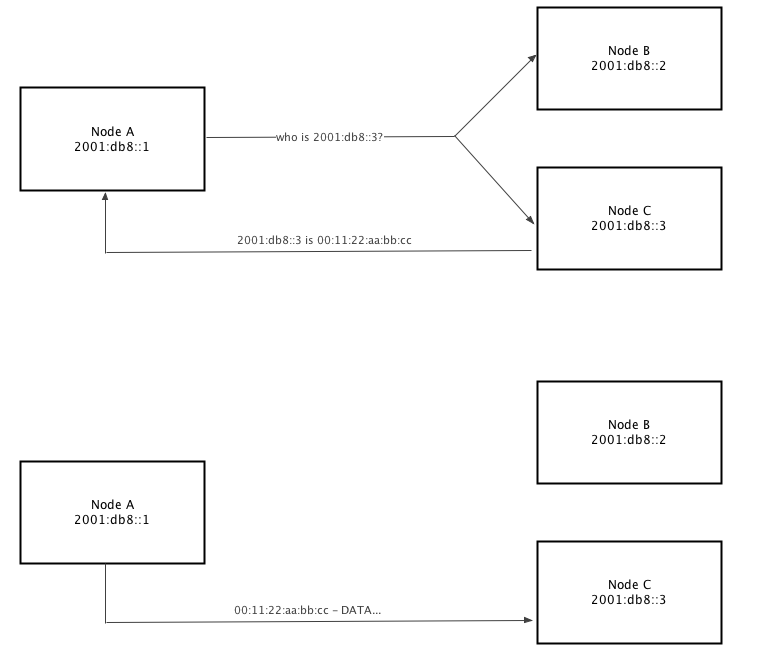

 

Figure NG 6: IPv6 node A, 2001:db8::1 needs to send data to 2001:db8::3
in the same network (2001:db8::/64 prefix). But it must first ask for
the MAC address that corresponds to 2001:db8::3.

 

When using NDP, node A multicasts to some hosts the question,

"Who has the MAC address for the IPv6 2001:db8::3?"

 

When node C sees a Neighbor Solicitation (NS) for an IPv6 address of its
own, it replies with its MAC address with a Neighbor Advertisement (NA)
message.

 

 

 

 

 

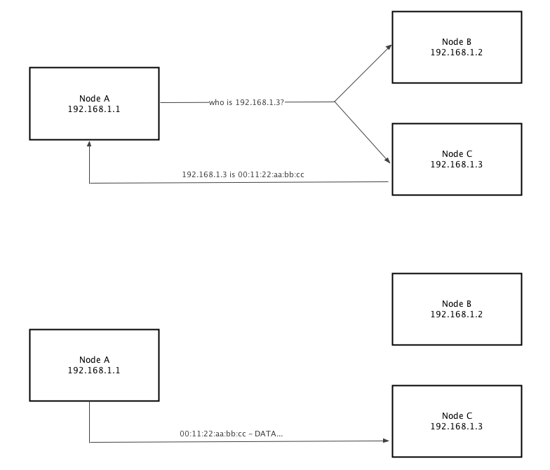

 

Figure NG 7: IPv4 node A, 192.168.1.1, needs to send data to 192.168.1.3
in the same subnet (192.168.1.0/24). But it must first ask the whole
network for the MAC address that corresponds to 192.168.1.3.

 

When using ARP, node A broadcasts to all hosts the question,

"Who has the MAC address for the IPv4 192.168.1.3?"

When node C sees an ARP request for its own IPv4 address, it replies
with its MAC address. Node B will also see the ARP request but will not
reply as 192.168.1.3 is not an address of it. This is very similar to
NDP for IPv6 except that an IPv4 node has only a single IPv4 address.

Also ARP broadcasts the request, this means that it is received by all
IPv4 nodes in the network causing more host CPU utilisation than IPv6
NDP which only multicasts to some hosts.

 

#### IP Routing to non-Neighbours

 

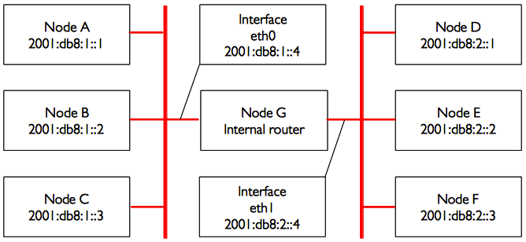

 

Figure NG 8: Two separate IPv6 networks.

 

Consider now another network with 3 nodes, D, E, and F, with the
corresponding IPv6 addresses 2001:db8:2::1, 2001:db8:2::2, and
2001:db8:2::3.

This is another /64 network, but it is not in the same range as the
network on the left hand side.

All three hosts can reach each other directly (first using NDP to
resolve the IPv6 address into a MAC address, and then sending packets to
that MAC address).

Now we will add node G. This node has two network cards (also called
interfaces), with one plugged into each network. The first network card
uses the IPv6 address 2001:db8:1::4, on interface eth0 and the other,
eth1, uses 2001:db8:2::4.

Node G is now link-local to both networks, and can forward packets
between them: node G can route packets between the two networks, it is
therefore called a router or sometimes a gateway.

But what if hosts A, B, and C want to reach hosts D, E, and F? They need
to know that they should use node G and so they will need to add a route
to the other network via host G. For example, hosts A-C would add a
static route via 2001:db8:1::4.

In Linux, this can be accomplished with the following command:

 

\# ip -6 route add 2001:db8:2::/64 via 2001:db8:1::4

 

...and hosts D-F would add the following:

\# ip -6 route add 2001:db8:1::/64 via 2001:db8:2::4

 

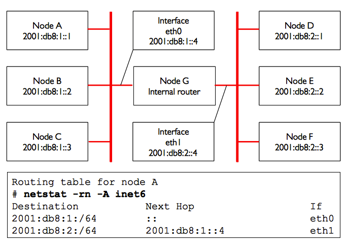

 

Figure NG 9: Node G acts as a router between the two networks, other
hosts use static routes.

 

The result for node A is shown in Figure NG 9.

 

Notice that the route is added via the IPv6 address on host G that is
link-local to the respective network.

 

Host A could not add a route via 2001:db8:2::4, even though it is the
same physical machine as 2001:db8:1::4 (node G), since that IPv6 is not
link-local.

The address of the next hop can be entered either as a global address
(2001:db8:2::4) or as a link-local address (fe80::...); it is usually
easier to configure a static route with a global address.

 

In IPv6, the router G also sends a solicitation and periodically router
advertisements that contain its own link-local address, hence, all nodes
using stateless auto-configuration or DHCP automatically add a default
route via the router link-local address as shown in Figure NG 10.

 

 

 

 

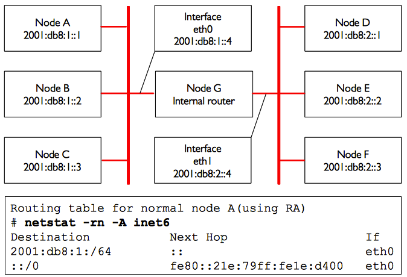

 

Figure NG 10: Node G acts as a router between the two networks, hosts
use stateless address autoconfiguration.

 

This is a very simple routing example, where the destination is only a
single hop away from the source. As networks get more complex, many hops
may need to be traversed to reach the ultimate destination. Since it
isn't practical for every machine on the Internet to know the route to
every other, we make use of a routing entry known as the default route
(also known as the default gateway).

 

When a router receives a packet destined for a network for which it has
no explicit route, the packet is forwarded to its default gateway.

The default gateway is typically the best route out of your network,
usually in the direction of your ISP.

 

An example of a router that uses a default gateway is shown in Figure NG
11. Figure NG 11 shows the routing table (which is the set of all
routes) on the internal router G which includes the two directly
connected networks 2001:db8:1::/64 and 2001:db8:2::/64 as well as a
route to all other hosts on the Internet ::/0.

 

 

A node always uses the most specific route; that is the route with the
longest match to the destination, in Figure NG 11 eth0 will be used for
destination 2001:db8:1::1 (match length /64) rather than the less
specific ::/0 (match length of 0).

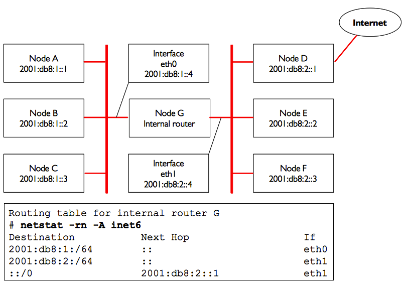

 

Figure NG 11: Node G is the internal router and uses the Internet
router.

 

A route tells the OS that the desired network doesn't lie on the
immediate link-local network, and it must forward the traffic through
the specified router.

 

If host A wants to send a packet to host F, it would first send it to
node G. Node G would then look up host F in its routing table, and see
that it has a direct connection to host F's network.

Finally, host G would resolve the hardware (MAC) address of host F and
forward the packet to it.

 

Routes can be updated manually, or can dynamically react to network
outages and other events.

Some examples of popular dynamic routing protocols are RIP, OSPF, BGP.

 

 

Configuring dynamic routing is beyond the scope of this book, but for
further reading on the subject, see the resources in Appendix F.

IPv4 behaves exactly the same way as depicted in figure NG 12.

 

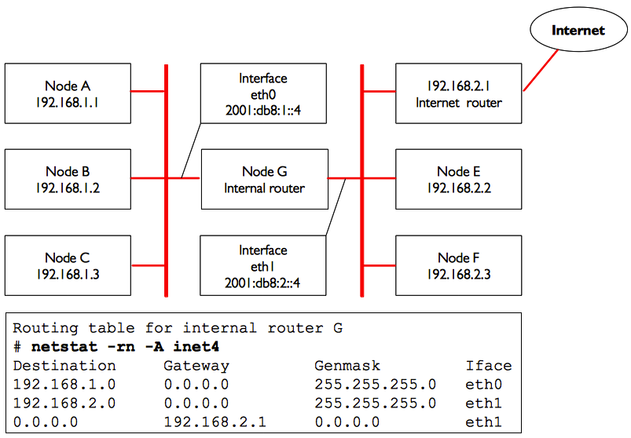

Figure NG 12: Node G is the Internet router on this IPv4 network.

 

As noted before, most networks and the Internet are dual-stack and all
hosts and routers have both IPv4 and IPv6 addresses, this also means
that the nodes will have routes for IPv4 and routes for IPv6. For
instance, the set of all routes on node G of the previous figures will
be:

 

\# netstat -rn -A inet6

 Destination           Next Hop     If

 2001:db8:1:/64         ::        eth0

 2001:db8:2:/64                ::          eth1

 ::/0                        2001:db8:2::1         eth1

 

\# netstat -rn -A inet4

Destination Gateway  Genmask  Iface

 192.168.1.0 0.0.0.0        255.255.255.0           eth0

 192.168.2.0 0.0.0.0       255.255.255.0           eth1

 0.0.0.0    192.168.2.1 0.0.0.0          eth1

#### Network Address Translation (NAT) for IPv4

In order to reach hosts on the Internet, private addresses must be
converted to global, publicly routable IPv4 addresses.

This is achieved using a technique known as Network Address Translation,
or NAT.

A NAT device is a router that manipulates the addresses of packets
instead of simply forwarding them.

On a NAT router, the Internet connection uses one (or more) globally
routed IPv4 addresses, while the private network uses an IPv4 address
from the RFC1918 private address range.

The NAT router allows the global address(es) to be shared with all of
the inside users, who all use private addresses.

It converts the packets from one form of addressing to the other as the
packets pass through it. As far as the network users can tell, they are
directly connected to the Internet and require no special software or
drivers.

They simply use the NAT router as their default gateway, and address
packets as they normally would.

The NAT router translates outbound packets to use the global IPv4
address as they leave the network, and translates them back again as
they are received from the Internet.

 

The major consequence of using NAT is that machines from the Internet
cannot easily reach servers within the organisation without setting up
explicit forwarding rules on the router.

 

Connections initiated from within the private address space generally
have no trouble, although some applications (such as Voice over IPv4 and
some VPN software) can have difficulty dealing with NAT.

 

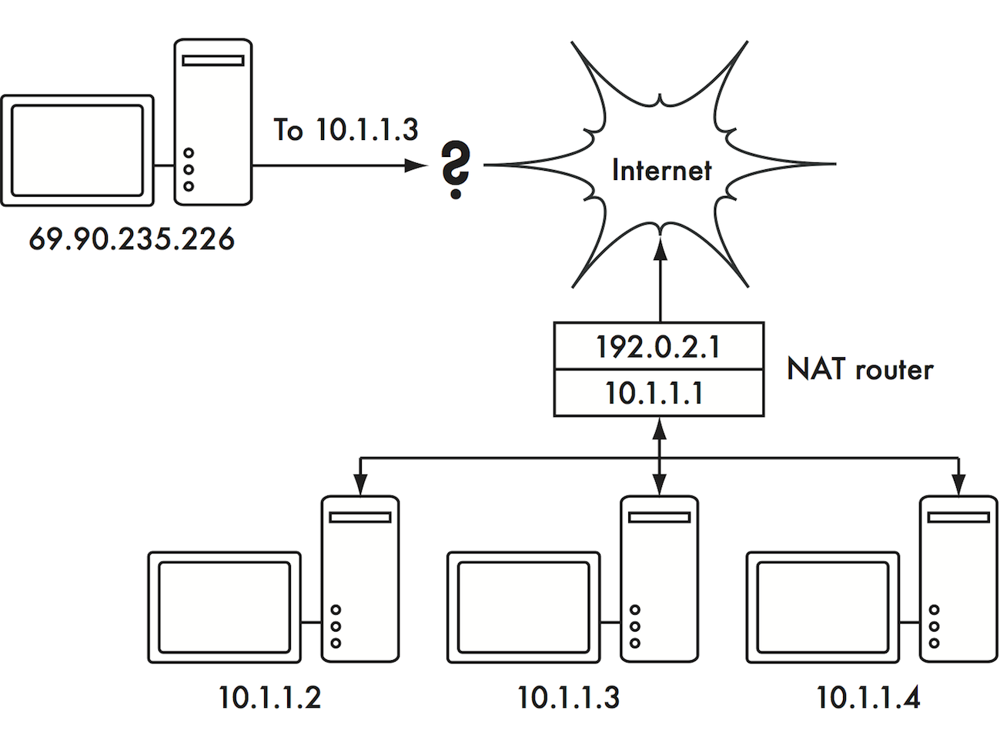

 

Figure NG 13: Network Address Translation allows you to share a single
IPv4 address with many internal hosts, but can make it difficult for
some services to work properly.

 

Depending on your point of view, this can be considered a bug (since it
makes it harder to set up two-way communication) or a feature. RFC1918
addresses should be filtered on the edge of your network to prevent
accidental or malicious RFC1918 traffic entering or leaving your
network.

 

While NAT performs some firewall-like functions, it is not a replacement
for a real firewall as most of the attacks happen now when an internal
user visits some web sites with hostile content (called malware for
malevolent software).

### Internet Protocol Suite

Machines on the Internet use the Internet Protocol (IP) to reach each
other, even when separated by many intermediary machines.

There are a number of protocols that are run in conjunction with IP that
provide features which are as critical to normal operations as IP
itself. Every packet specifies a protocol number that identifies the
packet as one of these protocols.

The most commonly used protocols are the Transmission Control Protocol
(TCP, number 6), User Datagram Protocol (UDP, number 17), and the
Internet Control Message Protocol (ICMP, number 1 for IPv4 and number 58
for IPv6). Taken as a group, these protocols (and others) are known as
the Internet Protocol Suite, or simply TCP/IP for short.

 

The TCP and UDP protocols introduce the concept of port numbers. Port
numbers allow multiple services to be run on the same IP address, and
still be distinguished from each other. Every packet has a source and
destination port number. Some port numbers are well-defined standards,
used to reach well-known services such as email and web servers. For
example, web servers normally listen on TCP port 80 for insecure traffic
and on TCP port 443 for encrypted/secure traffic, NTP time servers
listen on UDP port 123, DNS domain name servers listen on UDP port 53,
and SMTP email servers listen on TCP port 25.

 

When we say that a service "listens" on a port (such as port 80), we
mean that it will accept packets that use its IP as the destination IP
address, and 80 as the destination port.

 

Servers usually do not care about the source IP or source port, although
sometimes they will use them to establish the identity of the other
side.

When sending a response to such packets, the server will use its own IP
as the source IP, and 80 as the source port.

When a client connects to a service, it may use any source port number
on its side that is not already in use, but it must connect to the
proper port on the server (e.g. 80 for web, 25 for email).

 

TCP is a session-oriented protocol with guaranteed and ordered delivery
and transmission control features (such as detection and mitigation of
network congestion, retries, packet reordering and reassembly, etc.).

 

UDP is designed for connectionless streams of information, and does not
guarantee delivery at all, or in any particular order but can be faster
so it is often used for real-time protocols such as for timing, voice or
video.

 

The ICMP protocol is designed for debugging and maintenance on the
Internet.

Rather than port numbers, it has message types, which are also numbers.
Different message types are used to request a simple response from
another computer (echo request), notify the sender of another packet of
a possible routing loop (time exceeded), or inform the sender that a
packet that could not be delivered due to firewall rules or other
problems (destination unreachable).

By now you should have a solid understanding of how computers on the
network are addressed, and how information flows on the network between
them.

 

Now let's take a brief look at the physical hardware that implements
these network protocols.

### Physical hardware

#### Ethernet

Ethernet is the name of the most popular standard for connecting
together computers on a Local Area Network (LAN). It is sometimes used
to connect individual computers to the Internet, via a router, ADSL
modem, or wireless device.

However, if you connect a single computer to the Internet, you may not
use Ethernet at all.

The name comes from the physical concept of the ether, the medium which
was once supposed to carry light waves through free space. The official
standard is called IEEE 802.3.

 

One widely deployed Ethernet standard is called 100baseT also known as
Fast Ethernet.

This defines a data rate of 100 Megabits per second (hence the 100),
running over twisted (hence the T) pair wires, with modular RJ-45
connectors on the end.

 

The network topology is a star, with switches or hubs at the centre of
each star, and end nodes (devices and additional switches) at the edges.
Servers are also connected using Gigabit Ethernet with a rate of 1
Gigabit per second.

Increasingly Gigabit Ethernet is replacing Fast Ethernet in many
networks these days as demand for high volume video and other high data
rate applications become more prevalent.

#### Medium Access Control (MAC) addresses

Every device connected to an Ethernet or WiFi network has a unique MAC
address, assigned by the manufacturer of the network card. It serves as
a unique identifier that enables devices to talk to each other. However,
the scope of a MAC address is limited to a broadcast domain, which is
defined as all the computers connected together by wires, hubs,
switches, and bridges, but not crossing routers or Internet gateways.

MAC addresses are never used directly on the Internet, and are not
transmitted across routers.

MAC addresses for Ethernet and IEEE 802.11 WiFi networks are 48 bits
long and look like this - 00:1c:c0:17:78:8c or 40:6c:8f:52:59:41; for
the latter MAC address, the first 24 bits 40:6c:8f indicates that Apple
assigned this address.

#### Hubs

Ethernet hubs connect multiple twisted-pair Ethernet devices together.
They work at the physical layer (the lowest or first layer).

They repeat the signals received by each port out to all of the other
ports.

Hubs can therefore be considered to be simple repeaters.

Due to this design, only one port can successfully transmit at a time.
If two devices transmit at the same time, they corrupt each other's
transmissions, and both must back off and retransmit their packets
later. This is known as a collision, and each host remains responsible
for detecting and avoiding collisions before transmitting, and
retransmitting its own packets when needed.

 

When problems such as excessive collisions are detected on a port, some
hubs can disconnect (partition) that port for a while to limit its
impact on the rest of the network.

 

While a port is partitioned, devices attached to it cannot communicate
with the rest of the network.

 

Hubs are limited in their usefulness, since they can easily become
points of congestion on busy networks so they are no longer normally
deployed in networks nowadays. Its only important to note that a WiFi
access point acts as a hub on the radio side.

#### Switches

A switch is a device which operates much like a hub, but provides a
dedicated (or switched) connection between ports.

Rather than repeating all traffic on every port, the switch determines
which ports are communicating directly and temporarily connects them
together. There can be several such temporary port connections at the
same time.

Switches generally provide much better performance than hubs, especially
on busy networks with many computers. They are not much more expensive
than hubs, and are replacing them in most situations.

Switches work at the data link layer (the second layer), since they
interpret and act upon the MAC address in the packets they receive. When
a packet arrives at a port on a switch, it makes a note of the source
MAC address, which it associates with that port. It stores this
information in an internal MAC table often known as Content Addressable
Memory (CAM) table. The switch then looks up the destination MAC address
in its MAC table, and transmits the packet only on the matching port. If
the destination MAC address is not found in the MAC table, the packet is
then sent to all of the connected interfaces hoping to reach the right
MAC.

#### Hubs vs. Switches

Hubs are considered to be fairly unsophisticated devices, since they
inefficiently rebroadcast all traffic on every port. This simplicity
introduces both a performance penalty and a security issue. Overall
performance is slower, since the available bandwidth must be shared
between all ports. Since all traffic is seen by all ports, any host on
the network can easily monitor all of the network traffic.

Switches create temporary virtual connections between receiving and
transmitting ports. This yields better performance because many virtual
connections can be made simultaneously. More expensive switches can
switch traffic by inspecting packets at higher levels (at the transport
or application layer), allowing the creation of VLANs, and implementing
other advanced features.

 

A hub can be used when repetition of traffic on all ports is desirable;
for example, when you want to explicitly allow a monitoring machine to
see all of the traffic on the network. Most switches provide monitor
port functionality that enables repeating on an assigned port
specifically for this purpose.

Hubs were once cheaper than switches. However, the price of switches has
reduced dramatically over the years. Therefore, old network hubs should
be replaced whenever possible with new switches.

 

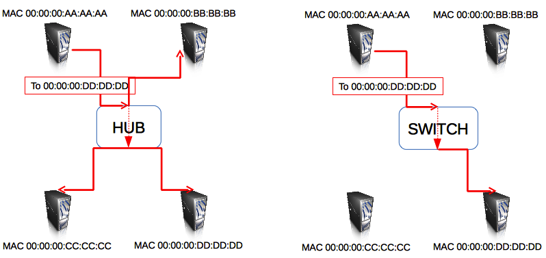

 

Figure NG 14: A hub simply repeats all traffic on every port, while a
switch makes a temporary, dedicated connection between the ports that
need to communicate.

 

Both hubs and switches may offer managed services.

Some of these services include the ability to set the link speed
(10baseT, 100baseT, 1000baseT, full or half-duplex) per port, enable
triggers to watch for network events (such as changes in MAC address or
malformed packets), and usually include port counters for easy bandwidth
accounting.

 

A managed switch that provides upload and download byte counts for every
physical port can greatly simplify network monitoring.

These services are typically available via SNMP, or they may be accessed
via telnet, ssh, a web interface, or a custom configuration tool.

#### Routers and Firewalls

While hubs and switches provide connectivity on a local network segment,
a router's job is to forward packets between different network segments.

A router typically has two or more physical network interfaces.

It may include support for different types of network media, such as
Ethernet, WiFi, optical fibre, DSL, or dial-up.

Routers can be dedicated hardware devices or they can be made from a
standard PC with multiple network cards and appropriate software.

Routers sit at the edge of two or more networks. By definition, they
have one connection to each network, and as border machines they may
take on other responsibilities as well as routing. Many routers have
firewall capabilities that provide a mechanism to filter or redirect
packets that do not fit security or access policy requirements.

They may also provide Network Address Translation (NAT) services for
IPv4.

 

Routers vary widely in cost and capabilities.

The lowest cost and least flexible are simple, dedicated hardware
devices, often with NAT functionality, used to share an Internet
connection between a few computers; well known brands include Linksys,
D-Link, Netgear.

 

The next step up is a software router, which consists of an operating
system running on a standard PC with multiple network interfaces.
Standard operating systems such as Microsoft Windows, Linux, and BSD are
all capable of routing, and are much more flexible than the low-cost
hardware devices; it is often called Internet Connection Sharing.

 

However, they suffer from the same problems as conventional PCs, with
high power consumption, a large number of complex and potentially
unreliable parts, and more involved configuration.

 

The most expensive devices are high-end dedicated hardware routers, made
by companies like Cisco and Juniper.

They tend to have much better performance, more features, and higher
reliability than software routers on PCs.

It is also possible to purchase technical support and maintenance
contracts for them.

 

Most modern routers offer mechanisms to monitor and record performance
remotely, usually via the Simple Network Management Protocol (SNMP),
although the least expensive devices often omit this feature.

#### Other equipment

Figure NG 15: Many DSL modems, cable modems, wireless access points, and
VSAT terminals terminate at an Ethernet jack.

 

Each physical network has an associated piece of terminal equipment. For
example, VSAT connections consist of a satellite dish connected to a
terminal that either plugs into a card inside a PC, or ends at a
standard Ethernet connection. DSL lines use a DSL modem that bridges the
telephone line to a local device, either an Ethernet network or a single
computer via USB. Cable modems bridge the television cable to Ethernet,
or to an internal PC card bus.

 

Standard dialup lines use modems to connect a computer to the telephone,
usually via a plug-in card or serial port. And there are many different
kinds of wireless networking equipment that connect to a variety of
radios and antennas, but nearly always end at an Ethernet jack. The
functionality of these devices can vary significantly between
manufacturers. Some provide mechanisms for monitoring performance, while
others may not.

Since your Internet connection ultimately comes from your ISP, you
should follow their recommendations when choosing equipment that bridges
their network to your Ethernet network.

### Putting it all together

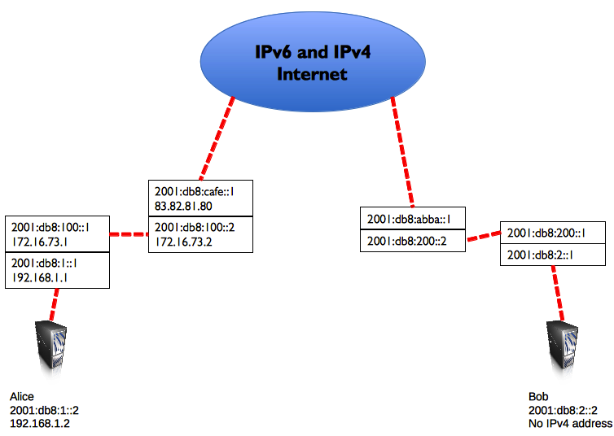

 

Figure NG 16: Internet networking. Each network segment has a router
with two IP addresses, making it “link local” to two different networks.
Packets are forwarded between routers until they reach their ultimate
destination.

 

Once all network nodes have an IP address, they can send data packets to
the IP address of any other node. Through the use of routing and
forwarding, these packets can reach nodes on networks that are not
physically connected to the originating node. This process describes
much of what “happens” on the Internet.

 

In this example, you can see the path that the packets take as Alice
chats with Bob using an instant messaging service.

Each dotted line represents an Ethernet cable, a wireless link, or any
other kind of physical network.

The cloud symbol is commonly used to stand in for “The Internet”, and
represents any number of intervening IP networks.

Neither Alice nor Bob need to be concerned with how those networks
operate, as long as the routers forward IP traffic towards the ultimate
destination.

If it weren’t for Internet protocols and the cooperation of everyone on
the net, this kind of communication would be impossible.

 

In Figure NG 16, Alice is dual-stack and has IPv4 and IPv6 addresses,
and as Bob has only IPv6 addresses, they will communicate by using IPv6
which is the common IP version between them.

### Designing the physical network

It may seem odd to talk about the “physical” network when building
wireless networks.

After all, where is the physical part of the network? In wireless
networks, the physical medium we use for communication is obviously
electromagnetic energy.

But in the context of this chapter, the physical network refers to the
mundane topic of where to put things. How do you arrange the equipment
so that you can reach your wireless clients?

Whether they fill an office building or stretch across many miles,
wireless networks are naturally arranged in these three logical
configurations: point-to-point links, point-to-multipoint links, and
multipoint-to-multipoint clouds. While different parts of your network
can take advantage of all three of these configurations, any individual
link will fall into one of these topologies.

#### Point-to-point

Point-to-point links typically provide an Internet connection where such
access isn’t otherwise available. One side of a point-to-point link will
have an Internet connection, while the other uses the link to reach the
Internet.

 

For example, a university may have a fast frame relay or VSAT connection
in the middle of campus, but cannot afford such a connection for an
important building just off campus. If the main building has an
unobstructed view of the remote site, a point-to-point connection can be
used to link the two together. This can augment or even replace existing
dial-up links. With proper antennas and clear line of sight, reliable
point-to-point links in excess of thirty kilometres are possible.

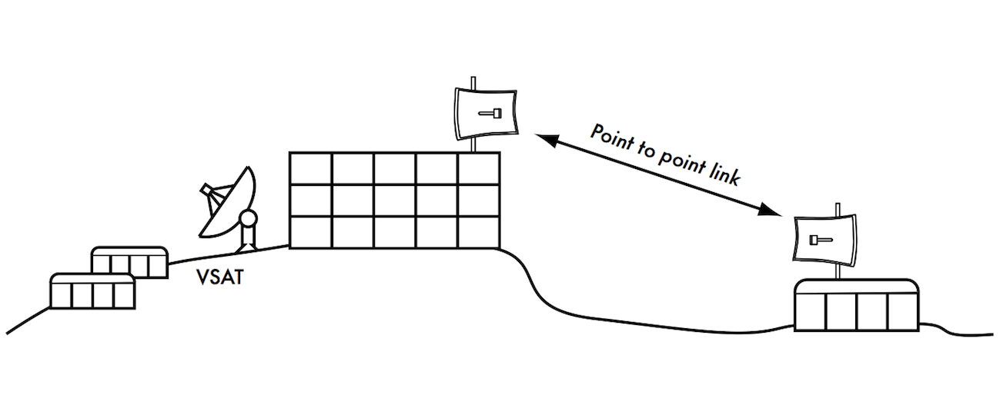

 

Figure NG 17: A point-to-point link allows a remote site to share a
central Internet connection.

 

Of course, once a single point-to-point connection has been made, more
can be used to extend the network even further. If the remote building
in our example is at the top of a tall hill, it may be able to see other
important locations that can’t be seen directly from the central campus.
By installing another point-to-point link at the remote site, another
node can join the network and make use of the central Internet
connection.

Point-to-point links don’t necessarily have to involve Internet access.
Suppose you have to physically drive to a remote weather monitoring
station, high in the hills, in order to collect the data which it
records over time. You could connect the site with a point-to-point
link, allowing data collection and monitoring to happen in realtime,
without the need to actually travel to the site.

Wireless networks can provide enough bandwidth to carry large amounts of
data (including audio and video) between any two points that have a
connection to each other, even if there is no direct connection to the
Internet.

#### Point-to-multipoint

The next most commonly encountered network layout is
point-to-multipoint. Whenever several nodes are talking to a central
point of access, this is a point-to-multipoint application. The typical
example of a point-to-multipoint layout is the use of a wireless access
point that provides a connection to several laptops. The laptops do not
communicate with each other directly, but must be in range of the access
point in order to use the network.

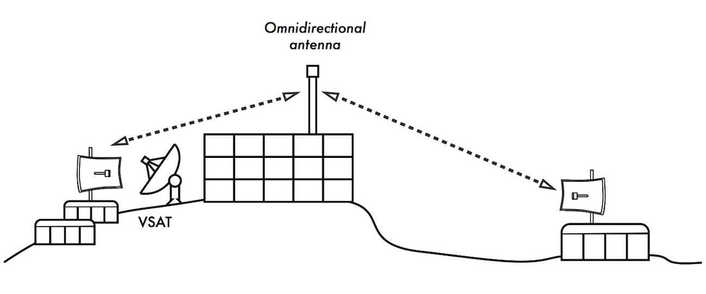

 

Figure NG 18: The central VSAT is now shared by multiple remote sites.
All three sites can also communicate directly at speeds much faster than
VSAT.

 

Point-to-multipoint networking can also apply to our earlier example at
the university. Suppose the remote building on top of the hill is
connected to the central campus with a point-to-point link.

Rather than setting up several point-to-point links to distribute the
Internet connection, a single antenna could be used that is visible from
several remote buildings. This is a classic example of a wide area point
(remote site on the hill) to multipoint (many buildings in the valley
below) connection.

 

Note that there are a number of performance issues with using
point-to-multipoint over very long distance, which will be addressed in
the chapter called Deployment Planning. Such links are possible and
useful in many circumstances, but don’t make the classic mistake of
installing a single high powered radio tower in the middle of town and
expecting to be able to serve thousands of clients, as you would with an
FM radio station. As we will see, two-way data networks behave very
differently than broadcast radio.

#### Multipoint-to-multipoint

The third type of network layout is multipoint-to-multipoint, which is
also referred to as an ad-hoc or mesh network. In a multipoint-to-
multipoint network, there is no central authority. Every node on the
network carries the traffic of every other as needed, and all nodes
communicate with each other directly.

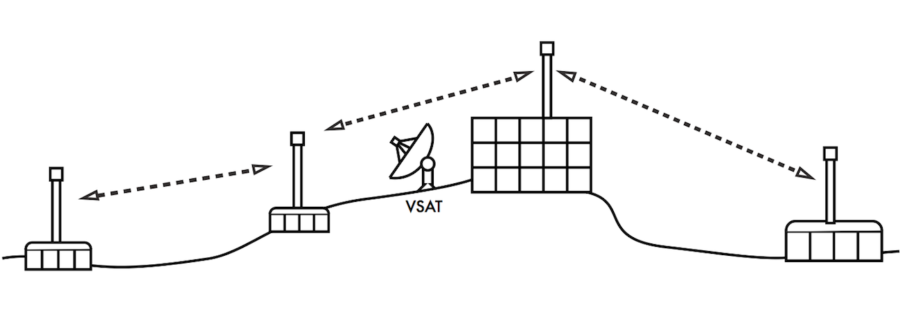

 

Figure NG 19: A multipoint-to-multipoint mesh. Every point can reach
every other at very high speed, or any of them can use the central
access point for a VSAT connection to the Internet.

 

The benefit of this network layout is that even if none of the nodes are
in range of a central access point, they can still communicate with each
other.

Good mesh network implementations are self-healing, which means that
they automatically detect routing problems and fix them as needed.
Extending a mesh network is as simple as adding more nodes.

If one of the nodes in the "cloud" happens to be an Internet gateway,
then that connection can be shared among all of the clients.

 

Several disadvantages of this topology include increased complexity and
lower performance.

 

Security in such a network is also a concern, since every participant
potentially carries the traffic of every other.

Multipoint-to-multipoint networks tend to be difficult to troubleshoot,
due to the large number of changing variables as nodes join and leave
the network.

Multipoint-to-multipoint clouds typically have reduced capacity compared
to point-to-point or point-to-multipoint networks, due to the additional
overhead of managing the network routing and increased contention in the
radio spectrum.

 

Nevertheless, mesh networks are useful in many circumstances.

For more information about them please read the chapter called Mesh
Networking.

#### Use the technology that fits

All of these network designs can be used to complement each other in a
large network, and additionally they can make use of traditional wired
networking techniques whenever possible. Wired networks still often have
higher bandwidth capacity than wireless so should be used whenever
appropriate or affordable.

But looking at the wireless, it is a common practice, for example, to
use a long distance wireless link to provide Internet access to a remote
location, and then set up an access point on the remote side to provide
local wireless access. One of the clients of this access point may also
act as a mesh node, allowing the network to spread organically between
laptop users who all ultimately use the original point-to-point link to
access the Internet.

 

This is just one common scenario for wireless deployments, there are
many others.

 

Now that we have a clear idea of how wireless networks are typically
arranged, we can begin to understand how communication is possible over
such networks.
