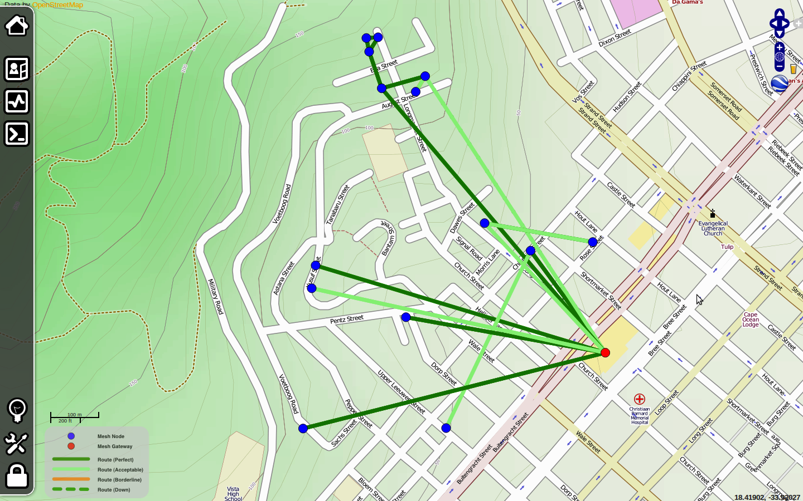
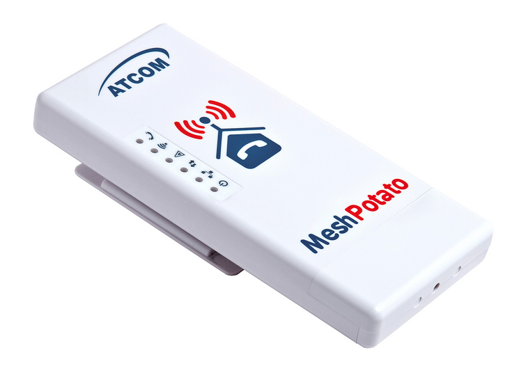

8. MESH NETWORKING
------------------

### Introduction

Mesh networks are based on multipoint-to-multipoint (m2m) networking. In
the nomenclature of IEEE 802.11, m2m networking is referred to as
'ad-hoc' or 'IBSS' mode.

 

Most wireless networks today are based on point-to-point (p2p) or
point-to-multipoint (p2m) communication.

 

 

Figure MN 1: A metropolitan area mesh network, providing local
connectivity and Internet access via multiple Internet gateways

 

A typical wireless hotspot operates in p2m infrastructure mode - it
consists of an access point (with a radio operating in master mode),
attached to a DSL line or other large scale wired network.

In a hotspot the access point acts as a master station that is
distributing Internet access to its clients.

 

 

 

This hub-and-spoke topology is also typically used for the mobile phone
(2G or 3G) service.

Mobile phones connect to a base station p2m - without the presence of a
base station mobiles can't communicate with each other.

If you make a joke call to a friend that is sitting on the other side of
the table, your phone sends data to the base station of your provider
that may be a mile away - the base station then sends data back to the
phone of your friend.

 

In a remote area without base stations a GSM phone is useless as a
communication device, simply because GSM radios are designed in such a
way that they can not communicate directly with each other.

This is unlike analog radio sets that can communicate m2m with each
other as long as they are within range.

Wireless radio is by default a broadcast medium, and any station which
can transmit and receive could communicate m2m.

 

With regards to the technological challenge, implementing m2m networking
is much more demanding then p2m and p2p.

Strategies to implement channel access coordination are more complex,
for example, there is no central authority to assign transmit time
slots.

 

Because there is no central management, m2m stations need to mutally
agree on cell coordination parameters such as the MAC like cell-id of
the wireless cell.

The fact that 802.11 names the m2m mode of WiFi "ad-hoc" suggests that
the IEEE board thought of a m2m network as a spontaneous, provisional,
sub-optimal solution.

 

Multipoint-to-multipoint communication is actually more versatile and
can be much more efficient than point-to-point or point-to-multipoint
communication: m2m communication includes the ability to communicate p2p
and p2m, because p2p and p2m are just subsets of m2m.

 

 

A network consisting of just two multipoint-to-multipoint capable
devices simply communicates p2p:

 

A--B

 

A network of three mesh-capable devices A, B, C can form a topology like
this, for example:

 

A--B--C

 

Here A can communicate only with B. C can only communicate with B, while
B can communicate with A and C. B actually does communicate p2m. Without
routing, A and C can not communicate with each other in 802.11 ad-hoc
mode.

By adding a routing protocol A can automatically learn that behind B
there is C and vice versa, and that B can be utilised as a communication
relay so all nodes can communicate with each other. In this case B will
act similarly to an access point in 802.11 infrastructure mode. WiFi
cards configured as infrastructure clients can't communicate directly,
so they would always need the access point B as a relay.

If the three devices move around, the topology might become a full mesh,
where every node can communicate with every other node directly:

 

A

/  \\

B----C

 

In this case relaying traffic is not necessary, given that the links are
all good enough. In infrastructure mode, communicating directly is not
possible. All the traffic between clients has to be relayed by the
access point. If we now add D to the little chain topology example, all
devices can communicate with each other if this is a mesh.

 

A--B--C--D

 

On the other hand, this would not be possible if the network is an
infrastructure mode network and B is an access point. C and D would both
be infrastructure clients, and as already mentioned before,
infrastructure clients can not communicate directly with each other.

 

So client D could not join the infrastructure network because it is out
of range of the access point B, while it would be still in the radio
range of client C.

### Bandwidth impact of multi-hop relaying routes

Mesh networks consisting of devices that feature only one radio are a
low cost way to establish a ubiquitous wireless network, but this comes
at a tradeoff. With only one wireless interface in each device, the
radios have to operate on the same channel. Simply sending data through
a routing path going from node A through B to C halves the available
bandwidth. While A is sending data to B, B and C have to remain silent.

While B is forwarding data to C, A has to remain silent as well - and so
on. Note that the same is true if two clients connected to an access
point in infrastructure want to communicate with each other.

 

If we assume that all wireless links in the A-B-C-D mesh chain operate
at the same speed, the communication between A and D would be roughly
1/3 of the speed of a single link, given that A and D can use the
network capacity exclusively. The bandwidth impact can be mitigated or
avoided by using devices with multiple radios, given that they are
operating on different frequencies that don't interfere with each other.

Despite the bandwidth tradeoff, single radio mesh devices still have
their merits. They are cheaper, less complex and consume less power than
multi-radio devices. This can be important if the systems are solar or
wind powered or require a battery backup. If the wireless links in a
three hop network (a chain with 4 nodes like above) operate at 12 Mbit
each, the total end-to-end bandwidth would still offer plenty bandwidth
to saturate a 2 Mbit Internet uplink.

### Summary

Mesh networking extends the range of wireless devices by multi-hop
relaying traffic. By means of dynamic routing, meshes can be self-
healing in case of node failure and grow organically if more nodes are
added. If the mesh nodes have only one radio, the benefit in coverage
comes at the tradeoff of reduced bandwidth. Here is an example of a
currently deployed mesh network. You can find more information about
this deployment at the url
[http://code.google.com/p/afrimesh/](http://code.google.com/p/afrimesh/)

 

 

Figure MN 2: Screenshot of the Villagetelco mesh at Bo-Kaap in Capetown,
South Africa

### Routing protocols for mesh networks

Routing protocols for wireless mesh networks have to be designed with
the challenges of radio communication in mind.

 

Wireless links and the topology of a mesh network are inherently
unstable, devices can go up and down, the available bandwidth varies,
and links are often flawed with packet loss.

A mesh routing protocol should be resilient against routing errors even
if routing protocol messages are delayed or lost.

At the same time the available communication bandwidth and computing
performance of mesh nodes is limited and shouldn't be wasted on protocol
decisions and traffic overhead.

 

In 2005, when the first edition of the WNDW book was written, there were
only few practically usable routing protocols for mesh networks. In
previous editions, this chapter has been focused on OLSR. Back then, the
OLSR daemon wasn't shipped with a working default configuration, so it
was necessary to wade into the depths of the olsrd.conf configuration
file to find out what the best configuration of the routing algorithm
was.

The situation has changed quite a bit since 2005.

There are now a number of mesh protocols and implementations, and all
the implementations which are mentioned in this chapter are readily
available as installation packages for OpenWRT.

Mesh protocol developers are competing in a challenge to deliver the
best mesh routing protocol. There is now a annual competition event for
mesh protocol developers, taking place once a year. It is called
"Battlemesh",
[www.battlemesh.org](http://objavi.booki.cc/tmp/wirelessnetworkinginthedevelopingworld-en-2013.02.13-23.20.02.odtQlyYWy/mesh-networking/www.battlemesh.org)

 

Most mesh routing protocols (BABEL, BATMAN, OLSR, BMX, BMX6) take care
of maintaining the IPv4 and IPv6 routing tables in a mesh node by
adding, updating and deleting routes. These mesh protocols are using
IP-based routing. They are layer 3 mesh protocols, since IP represents
the third layer of the OSI networking layer model.

Batman-adv(anced) is a relatively new protocol that operates on the
second layer of the networking model, hence it is a layer 2 mesh
protocol. To the higher layers (including IP), Batman-adv makes the
whole mesh appear as a switch, where all connections are link-local. A
Batman-adv mesh is transparent for the higher layers of the networking
model.

This simplifies the setup of a mesh network a great deal, since it is
possible to use DHCP, mDNS or MAC bridging with Batman-adv. Batman-adv
is a Linux kernel module, which is shipped with the official Linux
kernel sources. Mesh routing protocols should also manage the
announcement and selection of gateways to external networks like the
Internet. A common problem with gateway selection mechanisms is that the
routing protocol might decide to switch between gateways too often - for
example, because one routing path to one gateway just got slightly
better than the other. This is annoying because it can cause gateway
flapping and results in stateful connection sessions breaking down
frequently. If there is more than one Internet gateway in the mesh,
using an advanced method for gateway selection is strongly recommended.

#### How about 802.11s?

The roadmap of 802.11s is to scale up to 32 nodes. According to
Wikipedia it uses HWMP (Hybrid wireless mesh protocol) as the default
routing protocol, with the option to use other routing protocols. Quote:
"HWMP is inspired by a combination of AODV (RFC 3561[2]) and

tree-based routing". Since 802.11s is relatively new there is not much
practical experience so far.

### Devices and firmware for embedded devices

Not all WiFi devices on the market are suitable for mesh networking.

In 2005, when the first edition of this book was written, one of the
clear hardware recommendations for mesh networking was the Linksys
WRT54G router in combination with the Freifunk firmware.

While the WRT54G(L) is still on the market, it is no longer worth a
recommendation.[1](#ftn1)

 

OpenWRT is a very versatile firmware development environment for
developers and a firmware for advanced Linux users.

The old Freifunk firmware is based on the outdated OpenWRT version
"White Russian". "White Russian" supported only devices with Broadcom
chipsets with a proprietary binary wireless driver and is based on Linux
2.4. It has been ousted by the OpenWRT releases 'Kamikaze' and
'Backfire' (latest release). With 'Kamikaze' and 'Backfire' OpenWRT has
gained support for many different wireless chipsets, CPU architectures
and devices. The next stable release of OpenWRT will be named 'Attitude
Adjustment', which, at the time of writing, is at 'release candidate'
stage. The 'AR7xxx' and 'Atheros' platform ports of 'Attitude
Adjustment' can be considered stable.

The mesh routing protocols mentioned before are all available as
installation packages for OpenWRT.

A few open networking communities have developed their own customised
firmware images with OpenWRT Kamikaze and Backfire.

However they are mostly geared to meet their local preferences and
requirements and support a limited number of devices. Since they are
often localised they might be of limited use for the general public.

OpenWRT has a package management system, which comes to the rescue. It
is typical for OpenWRT to install software packages into the router
after it has been flashed. There is now a meta package named
'luci-freifunk-community', which will automatically convert a stock
OpenWRT image into a community mesh networking firmware.

 

The number of devices that can be converted to a mesh router has
increased dramatically. On the other hand the process of converting a
stock OpenWRT firmware into a mesh firmware via the package management
system is often more error-prone unfortunately.

 

Some manufacturers of WiFi routers are shipping devices that come with
OpenWRT as their factory firmware: Mesh-Potato, Dragino MS- 12, Allnet
0305.

 

 

 

Figure MN 3: Mesh-Potato outdoor mesh WiFi router with VoIP (with one
FXS port to connect analog telephone handsets).
[www.villagetelco.org](http://www.villagetelco.org/)

 

The Mesh-Potato is a low-power outdoor device designed for mesh
networking with an FXS (analog telephone) port, so you can plug an
analog telephone handset in and make telephone calls via the mesh.

The Mesh-Potato is shipped with a mesh firmware that uses the BATMAN
Layer 3 mesh protocol.

A second firmware named SECN (Small enterprise/campus network) is also
available for the Mesh- Potato, which uses the BATMAN-ADV Layer 2 mesh.

But these are not the only devices that should be considered for
purchase.

OpenWRT supports a very broad selection of wireless routers.

Replacing the factory firmware with OpenWRT is often quite easy.

 

Again, the selection of available devices is so diverse that there isn't
a single update method that works for the whole variety of hardware,
which could be described here.

 

The OpenWRT table of supported hardware is huge and it keeps expanding:

[http://wiki.openwrt.org/toh/start](http://wiki.openwrt.org/toh/start)

 

This site should be the place to start before you go and buy devices.

 

At the moment, if you are looking for a router based on a chipset that
supports 802.11n in ad-hoc mode, my recommendation are devices that are
supported by the AR7XXX port of OpenWRT.

 

Note that hardware manufacturers may change the chipsets of the devices
without explicitly stating it. Newer hardware revisions are not
guaranteed to work unless someone has tested and reported it in the
OpenWRT wiki.

 

Notable devices which can be flashed with OpenWRT are the outdoor units
made by Ubiquiti and the SOHO devices made by TP-Link.

 

TP- Link produces several low-cost SOHO devices with Atheros ar71xx
chipsets (802.11n).

The TP-Link MR3220 (802.11n single stream) and MR3420 (802.11n dual
stream) feature a 400 MHz Mips 24kc CPU, one USB 2.0 port, a 4 port 100
Mbit switch, WAN port, 4MB flash and 32MB RAM.

Prices start at around 30US \$.

 

Since the TP-Link devices have a USB 2.0 port it is possible to add
another WiFi interface via USB WiFi dongle.

Actually USB 2.0 adds many opportunities, like adding additional storage
space, audio support, webcams and so on.

 

Figure MN 4:DIY outdoor routers based on PCBs taken from SOHO routers
(Picture showing two devices based on TP-Link WR741 and WR941 and one
based on a Fonera router)

 

Another firmware distribution which initially orginated as an
alternative firmware of the WRT54G is DD-WRT. DD-WRT is a firmware
distribution designed for end-users. It only supports the OLSR routing
protocol.

### Frequently observed problems

The typical problems of multipoint-to-multipoint communication are
either on the physical radio or the MAC layer. The IEEE 802.11
suggestions about multipoint-to-multipoint mode were not up to the task.

The main challenges are:

#### Channel access coordination, namely the hidden node and exposed node problem

Going back to our little mesh with the topology A B C it can happen that
A and C start to send data to B at the same time because they don't
receive each other, resulting in a collision at the location of B.
802.11 has a mechanism to mitigate this: RTS/CTS (request to send, clear
to send)

 

Before a m2m node sends data it requests airtime by sending a short RTS
packet, in order to reserve the channel. It waits until it receives a
CTS signal. So A will send a short RTS packet, and B sends a short CTS
packet. This way C will detect that there will be a transmission of a
hidden node that it shouldn't interfere with.

 

However the current RTS/CTS mechanism of 802.11 works well only for 2
hop routes. On longer routes it can happen that multiple stations send
RTS signals, which results in all the nodes stopping their transmissions
and waiting for a CTS signal. This is called a RTS broadcast storm. For
mesh networks of considerable size it is not recommended to use the
RTS/CTS mechanism.

#### Timer synchronisation

The people designing the 802.11 ad-hoc protocol thought it would be
smart if the WiFi devices would synchronise their MAC timer clocks by
sending time stamps in beacons.

 

However bogus time stamps can occur due to bugs, and they often trigger
race conditions in the hardware, drivers and the 802.11 ad-hoc protocol,
which has not been designed to cope with such issues.

 

Failed attempts to synchronise time stamps often results in cell
splitting (see below). There are some hacks which have been introduced
to overcome the problem.

 

The best solution is to disable timer synchronisation entirely. However
timer synchronisation is often done in the wireless interface hardware
or firmware of a interface.

OpenWRT has a hack to disable timer synchronisation when using Atheros
802.11abg cards that work with the Madwifi driver. If you are using a
recent Linux kernel, certain wireless drivers (namely ath9k) which are
often used for mesh devices are quite robust against timer issues in
ad-hoc mode.

 

However this doesn't help if the WiFi device comes with a closed source
binary firmware which is not prepared to deal gracefully with timer
issues. There is not much we can do about it, other than using
drivers/firmwares/chipsets which are known to work reliably.

#### IBSS cell splitting

This is a typical problem of the way 802.11 suggests implementation of
the m2m mode. Ad-hoc devices may fail to agree on a certain cell-id
(IBSS-ID). If they don't manage to agree on using one certain cell-id,
they are logically separated wireless cells.

This is a real show stopper, because wireless devices will not be able
to communicate with each other. The problem is related to issues with
timer synchronisation. Since Linux 2.6.31 it is possible to manually fix
the IBSS-ID. This feature is also available in OpenWRT.
