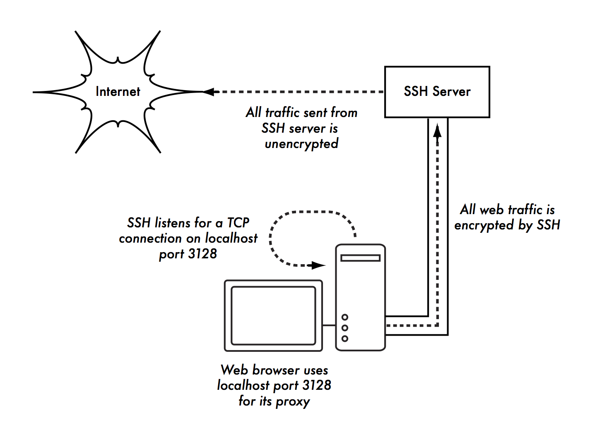

9. SECURITY FOR WIRELESS NETWORKS
---------------------------------

### Introduction

While unlicensed spectrum provides a huge cost savings to the user, it
has the unfortunate side effect that Denial of Service (DoS) attacks are
trivially simple. By simply turning on a high powered access point,
cordless phone, video transmitter, or other 2.4GHz device, a malicious
person could cause signifi cant problems on the network. Many network
devices are vulnerable to other forms of denial of service attacks as
well, such as disassociation fl ooding and ARP table overfl ows.

There are several categories of individuals who may cause problems on a
wireless network:

#### Unintentional users.

Densely populated areas such as city centres and university campuses can
lead to a density of wireless access points. In these populated areas,
it is common for laptop users to accidentally associate to the wrong
network. Most wireless clients will simply choose any available wireless
network, often the one with the strongest signal, when their preferred
network is unavailable.

The user may then make use of this network as usual, completely unaware
that they may be transmitting sensitive data on someone elses network.

Malicious people may even take advantage of this by setting up access
points in strategic locations, to try to attract unwitting users and
capture their data.

The first step in avoiding this problem is educating your users, and
stressing the importance of connecting only to known and trusted
networks.

Many wireless clients can be configured to only connect to trusted
networks, or to ask permission before joining a new network.

As we will see later in this chapter, users can safely connect to open
public networks by using strong encryption.

#### War drivers.

The “war driving” phenomenon draws its name from the popular 1983 hacker
film, “War Games”.

War drivers are interested in finding the physical location of wireless
networks.

They typically drive around with a laptop, GPS, and omnidirectional
antenna, logging the name and location of any networks they find. These
logs are then combined with logs from other war drivers, and are turned
into graphical maps depicting the wireless “footprint” of a particular
city.

The vast majority of war drivers likely pose no direct threat to
networks, but the data they collect might be of interest to a network
cracker. For example, it might be obvious that an unprotected access
point detected by a war driver is located inside a sensitive building,
such as a government or corporate office.

 

A malicious person could use this information to illegally access the
network there. Arguably, such an AP should never have been set up in the
first place, but war driving makes the problem all the more urgent. As
we will see later in this chapter, war drivers who use the popular
program NetStumbler can be detected with programs such as Kismet.

For more information about war driving, see sites such as:

[http://wigle.net/,](http://wigle.net/)

[http://www.nodedb.com/,](http://www.nodedb.com/)or
[http://www.stumbler.net/.](http://www.stumbler.net/)

#### Rogue access points.

There are two general classes of rogue access points:

 

Those incorrectly installed by legitimate users, and those installed by
malicious people who intend to collect data or do harm to the network.
In the simplest case, a legitimate network user may want better wireless
coverage in their office, or they might find security restrictions on
the corporate wireless network too difficult to comply with.

By installing an inexpensive consumer access point without permission,
the user opens the entire network up to potential attacks from the
inside. While it is possible to scan for unauthorised access points on
your wired network, setting a clear policy that prohibits them is a very
important first step.

The second class of rogue access point can be very difficult to deal
with. By installing a high powered AP that uses the same ESSID as an
existing network, a malicious person can trick people into using their
equipment, and log or even manipulate all data that passes through it.

Again, if your users are trained to use strong encryption, this problem
is significantly reduced.

#### Eavesdroppers.

As mentioned earlier, eavesdropping is a very difficult problem to deal
with on wireless networks. By using a passive monitoring tool (such as
Kismet), an eavesdropper can log all network data from a great distance
away, without ever making their presence known.

Poorly encrypted data can simply be logged and cracked later, while
unencrypted data can be easily read in real time.

 

If you have difficulty convincing others of this problem, you might want
to demonstrate tools such as

Driftnet (http://www.ex-parrot.com/\~chris/driftnet/).

Driftnet watches a wireless network for graphical data, such as GIF and
JPEG files. While other users are browsing the Internet, these tools
simply display all graphics found in a graphical collage. While you can
tell a user that their email is vulnerable without encryption, nothing
drives the message home like showing them the pictures they are looking
at in their web browser. Again, while it cannot be completely prevented,
proper application of strong encryption will discourage eavesdropping.

### Protecting the wireless network

In a traditional wired network, access control is relatively
straightforward: If a person has physical access to a computer or
network hub, they can use (or abuse) the network resources. While
software mechanisms are an important component of network security,
limiting physical access to the network devices is the ultimate access
control mechanism. Simply put, if all terminals and network components
are physically only accessible to trusted individuals, the network can
likely be trusted. The rules change significantly with wireless
networks. While the apparent range of your access point may seem to be
just a few hundred metres, a user with a high gain antenna may be able
to make use of the network from several blocks away.

Should an unauthorised user be detected, is impossible to simply “trace
the cable” back to the users location.

Without transmitting a single packet, a sufficiently talented nefarious
user can capture and log traffic on a wireless network to disk.

This data can later be used to launch a more sophisticated attack
against the network. Never assume that radio waves simply “stop” at the
edge of your property line, or inside your building. Physical security
in wireless networks is limited to preventing compromise of the active
components, cables and power supply.

Where physical access to the network cannot be prevented we have to rely
on electronic means for controlling access to the wireless
infrastructure in order to only allow authorised persons and systems to
use the wireless network. But remember, while a certain amount of access
control and authentication is necessary in any network, you have failed
in your job if legitimate users find it difficult to use the network to
communicate. Lastly, it is usually unreasonable to completely trust all
users of the network, also on wired networks. Disgruntled employees,
uneducated network users, and simple mistakes on the part of honest
users can cause significant harm to network operations. As the network
architect, your goal is to facilitate private communication between
legitimate users of the network and between legitimate users and
services.

 

There's an old saying that the only way to completely secure a computer
is to unplug it, lock it in a safe, destroy the key, and bury the whole
thing in concrete. While such a system might be completely “secure”, it
is useless for communication. When you make security decisions for your
network, remember that above all else, the network exists so that its
users can communicate with each other. Security considerations are
important, but should not get in the way of the network's users.

 

A simple rule-of-thumb as to whether or not the network is getting in
the way of its users is to look at how much time you or other staff
spend on helping people get on the network.

If regular users are repeatedly having problems simply gaining access to
the network, even after they have been provided instruction and training
on how to do so, it's possible that the access procedures are too
cumbersome and a review of them is in order.

Taking all of this into account, our goal is to provide adequate
physical security, control access protect the communication without
sacrificing ease of use.

### Physical security for wireless networks

When installing a network, you are building an infrastructure that
people depend on. Security measures exist to ensure that the network is
reliable. Wireless networks have physical components, such as wires and
boxes, which are easily disturbed. In many installations, people will
not understand the purpose of the installed equipment, or curiosity may
lead them to experiment.

They may not realise the importance of a cable connected to a port.
Someone may unplug an Ethernet cable so that they can connect their
laptop for 5 minutes, or move a switch because it is in their way. A
plug might be removed from a power bar because someone needs that
receptacle. Assuring the physical security of an installation is
paramount. Signs and labels will only be useful to those who can read
your language. Putting things out of the way and limiting access is the
best means to assure that accidents and tinkering do not occur. In your
locality, proper fasteners, ties, or boxes may not be easy to find.

You should be able to find electrical supplies that will work just as
well. Custom enclosures are also easy to manufacture and should be
considered essential to any installation. It is often economical to pay
a mason to make holes and install conduit. PVC can be embedded in cement
walls for passing cable from room to room. This avoids the need to smash
new holes every time a cable needs to be passed. Plastic bags can be
stuffed into the conduit around the cables for insulation. Small
equipment should be mounted on the wall and larger equipment should be
put in a closet or in a cabinet.

#### Switches

Switches, hubs or interior access points can be screwed directly onto a
wall with a wall plug. It is best to put this equipment as high as
possible to reduce the chance that someone will be able to touch the
device or its cables without significant effort.

#### Cables

At the very least, cables should be hidden and fastened. It is possible
to find plastic cable conduit that can be used in buildings. If you
cannot find it, simple cable attachments can be nailed into the wall to
secure the cable.

This will make sure that the cable doesn't hang where it can be snagged,
pinched or cut.

When fastening cable to the wall, it is important to not nail or screw
into the cable itself. The cable contains many tiny wires that the
network data travels over. Nailing through the cable will damage it and
make it useless for transmitting data. Take care also to not overly bend
or twist the cable as this will damage it as well.

It is preferable to bury cables, rather than to leave them hanging
across a yard. Hanging wires might be used for drying clothes, or be
snagged by a ladder, etc. To avoid vermin and insects, use plastic
electrical conduit. The marginal expense will be well worth the trouble.
The conduit should be buried about 30 cm deep, or below the frost level
in cold climates. It is worth the extra investment of buying larger
conduit than is presently required, so that future cables can be run
through the same tubing. Consider labeling buried cable with a "call
before you dig" sign to avoid future accidental outages.

#### Power

It is best to have power bars locked in a cabinet. If that is not
possible, mount the power bar under a desk, or on the wall and use duct
tape (or gaffer tape, a strong adhesive tape) to secure the plug into
the receptacle. On the UPS and power bar, do not leave any empty
receptacles. Tape them if necessary. People will have the tendency to
use the easiest receptacle, so make these critical ones difficult to
use. If you do not, you might find a fan or light plugged into your UPS;
though it is nice to have light, it is nicer to keep your server
running!

#### Water

Protect your equipment from water and moisture. In all cases make sure
that your equipment, including your UPS is at least 30 cm from the
ground, to avoid damage from fl ooding. Also try to have a roof over
your equipment, so that water and moisture will not fall onto it. In
moist climates, it is important that the equipment has proper
ventilation to assure that moisture can be exhausted. Small closets need
to have ventilation, or moisture and heat can degrade or destroy your
gear.

#### Masts

Equipment installed on a mast is often safe from thieves. Nevertheless,
to deter thieves and to keep your equipment safe from winds, it is good
to over-engineer mounts.

Painting equipment a dull white or grey colour reflects the sun and
makes it look plain and uninteresting. Panel antennas are often
preferred because they are much more subtle and less interesting than
dishes. Any installation on walls should be high enough to require a
ladder to reach. Try choosing well-lit but not prominent places to put
equipment. Also avoid antennae that resemble television antennae, as
those are items that will attract interest by thieves, whereas a wifi
antenna will be useless to the average thief.

### Authentication and access control

Talking about authentication a number of related terms like (digital)
identity, authorisation, privacy etc. pop up. So before we get into
authentication proper we need to introduce some terminology, without
trying to be exhaustive.

 

Digital identity is the electronic entity that is a representation of a
physical entity, like a person or a device. Authentication is the
process of verifying the claim that an (electronic) entity is allowed to
act on behalf of a given known (physical) entity. In other words,
authentication is the process of proving that the physical entity
corresponds to a certain electronic one. Authorisation in turn is the
process of establishing the rights of the identity to access certain
resources or to perform certain tasks. Privacy, finally, is a complex
issue but has to do with the right of a person not to have their
personal data and behaviour be known to parties that do not strictly
need it to provide the service the users request. So for example, it is
reasonable for a liquor shop to know that a customer is above a certain
age before selling alocholic drinks, but not to know the name of the
customer, and third parties should not have any knowledge of the
transaction at all. Privacy is of particular concern in a world in which
users increasingly use networks and services outside their home
environment. Without proper attention to privacy aspects it is too easy
to trace a users behaviour and movement.

It is worth mentioning that there is a trade-off between authentication
and privacy. Verifying the identity of a user in itself invades the
user's privacy, the authenticating party knows who is using what
resource at a particular time and location, but the challenge is to
minimise the amount of information about a user and the number of
parties that are privvy to that information.

In the context of this book we are mainly interested in techniques for
controlling access to the network. In other words, we want to be able to
decide who (authenticated identity) gets to access what (authorisation)
without sacrificing privacy.

Authentication is typically done by proof of knowledge of a secret (a
password, a signature), possession of a token or characteristic (a
certificate, a fingerprint) or both. Access control is often needed to
make sure that only authorised users can use the network, to prevent
exhaustion of scarce resources and/or compliance with rules and
regulations. In addition to access controlled networks there may also be
open networks with limited access or for a limited time, but due to the
need for organisations to control access to their scarce resources and
also anti-terrorist laws they become less ubiquitous. Over the years a
number of techniques have been employed to control access to wireless
networks. Subsequently they have been mostly abandoned due to security
or scalability issues as WiFi became increasingly popular.

#### Mac filtering

Access to a WiFi network can be based on the MAC address. This is the
48-bit number assigned by the manufacturer to every wireless and
Ethernet device, and that is supposed to be unique and persistent. By
employing mac filtering on our access points, we can authenticate users
based on their MAC address.

With this feature, the access point keeps an internal table of approved
MAC addresses.

 

When a wireless user tries to associate to the access point, the MAC
address of the client must be on the approved list, or the association
will be denied. Alternatively, the AP may keep a table of known “bad”
MAC addresses, and permit all devices that are not on the list.
Unfortunately, this is not an ideal security mechanism. Maintaining MAC
tables on every device can be cumbersome, requiring all client devices
to have their MAC addresses recorded and uploaded to the APs. Even
worse, MAC addresses can often be changed in software. By observing MAC
addresses in use on a wireless network, a determined attacker can spoof
(impersonate) an approved MAC address and successfully associate to the
AP.

While MAC filtering will prevent unintentional users and even most
curious individuals from accessing the network, MAC filtering alone
cannot prevent attacks from determined attackers.

MAC filters are useful for temporarily limiting access from misbehaving
clients. For example, if a laptop has a virus that sends large amounts
of spam or other traffic, its MAC address can be added to the filter
table to stop the traffic immediately. This will buy you time to track
down the user and fix the problem.

#### Closed networks

Another at one time popular "authentication feature" of WiFi networks is
the so-called closed network mode. In a typical network, APs will
broadcast their ESSID many times per second, allowing wireless clients
(as well as tools such as NetStumbler) to find the network and display
its presence to the user. In a closed network, the AP does not beacon
the ESSID ("hidden ESSID"), and users must know the full name of the
network before the AP will allow association. This prevents casual users
from discovering the network and selecting it in their wireless client.
There are a number of drawbacks to this feature. Forcing users to type
in the full ESSID before connecting to the network is error prone and
often leads to support calls and complaints. Since the network isn’t
obviously present in site survey tools like NetStumbler, this can
prevent your networks from showing up on war driving maps. But it also
means that other network builders cannot easily find your network
either, and specifically won’t know that you are already using a given
channel.

A conscientious neighbour may perform a site survey, see no nearby
networks, and install their own network on the same channel you are
using. This will cause interference problems for both you and your
neighbour.

Finally, using closed networks ultimately adds little to your overall
network security. By using passive monitoring tools (such as Kismet), a
malicious user can detect frames sent from your legitimate clients to
the AP. These frames necessarily contain the network name. The malicious
user can then use this name to associate to the access point, just like
a normal user would. Encryption is probably the best tool we have for
authenticating wireless users. Through strong encryption, we can
uniquely identify a user in a manner that is very difficult to spoof,
and use that identity to determine further network access. Encryption
also has the benefit of adding a layer of privacy by preventing
eavesdroppers from easily watching network traffic. Encryption is the
technique that is used for authenticating users in most current
deployments.

#### WEP

The first widely employed encryption method on WiFi networks was WEP
encryption. WEP stands for Wired Equivalent Privacy, and is supported by
virtually all 802.11a/b/g equipment. Incidentally, this is a complete
misnomer as the privacy that WEP provides is in no way equivalent to
that of wired connections. WEP uses a shared 40-bit key to encrypt data
between the access point and client. The key must be entered on the APs
as well as on each of the clients.

With WEP enabled, wireless clients cannot associate with the AP until
they use the correct key. An eavesdropper listening to a WEP-enabled
network will still see traffic and MAC addresses, but the data payload
of each packet is encrypted.

This provided an authentication mechanism while also adding a bit of
privacy to the network. WEP is definitely not the strongest encryption
solution available.

For one thing, the WEP key is shared between all users. If the key is
compromised (say, if one user tells a friend what the password is, or if
an employee is let go) then changing the password can be prohibitively
difficult, since all APs and client devices need to be changed.

 

This also means that legitimate users of the network can still eavesdrop
on each others’ traffic, since they all know the shared key.

The key itself is often poorly chosen, making offline cracking attempts
feasible. But most importantly, WEP itself is broken, making it very
easy to gain illegal access the network.

So WEP should not be used anymore.

 

For more details about the state of WEP encryption, see these papers:

http://www.isaac.cs.berkeley.edu/isaac/wep-faq.html
[http://www.cs.umd.edu/\~waa/wireless.pdf](http://www.cs.umd.edu/%7Ewaa/wireless.pdf)

#### "Switched" wireless networks

One critical difference between modern switched Ethernet networks and
wireless is that wireless networks are built on a shared medium.

They more closely resemble the old network hubs than modern switches, in
that every computer connected to the network can “see” the traffic of
every other user.

 

To monitor all network traffic on an access point, one can simply tune
to the channel being used, put the network card into monitor mode, and
log every frame.

This data might be directly valuable to an eavesdropper (including data
such as email, voice data, or online chat logs). It may also provide
passwords and other sensitive data, making it possible to compromise the
network even further. WPA and 802.1X are designed to make the wireless
network behave like a switched rather than a shared network.

#### WPA

Another data-link layer authentication protocol is Wi-Fi Protected
Access, or WPA. WPA was created specifically to deal with the known
problems with WEP mentioned earlier. WPA was intended to be a backwards
compatible interim solution while the full standard 802.11i (WPA2) was
developed.

WPA and WPA2 can operate in combination with the 802.1X umbrella
standard for wireless authentication (see below) but also much in the
same mode as WEP, with a shared secret between all clients and the AP,
the so-called Pre Shared Key (PSK) mode (the WiFi Alliance calls WPA-PSK
"WPA Personal", as opposed to "WPA Enterprise" that is used in
combination with 802.1X).

 

Overall, WPA provides significantly better authentication and privacy
than standard WEP, mainly by leveraging the Temporary Key Integrity
Protocol (TKIP) that continuously and automatically changes the keying
material between clients and access points.

Unfortunately precisely the backwards compatibility of TKIP has given
rise to some attack vectors against TKIP that allow for decrypting
certain encrypted packets, that in turn can be manipulated for further
attacks.

 

More information can be found in the following articles:

[http://dl.aircrack](http://dl.aircrack-ng.org/breakingwepandwpa.pdf)-[ng.org/breakingwepandwpa.pdf](http://dl.aircrack-ng.org/breakingwepandwpa.pdf)

http://download.aircrack-ng.org/wiki-files/doc/enhanced\_tkip\_michael.pdf

 

The consequence of these discoveries is that it is wise to move to the
next generation of secure WiFi access protocols: WPA2.

#### WPA2-PSK

WPA2 is the full IEEE 802.11i standard.

 

The main difference with WPA is the use of the Advanced Encryption
System (AES) instead of TKIP a (so far) not broken encryption standard.

 

So the use of WPA2 with AES can be considered secure for now!

### Summary

The major downside of any of these last three authentication methods is
that, regardless of the strength of the encryption, they are still built
upon the notion of a common shared secret between all clients and the
access point.

 

They don't allow for identifying individual users and frankly, a secret
shared by potentially tens of thousands of users can hardly be called a
secret.

 

Another serious problem with wireless networks to which access is
controlled by any of the methods mentioned, is that its users are
relatively anonymous.

 

While it is true that every wireless device includes a unique MAC
address that is supplied by the manufacturer, as mentioned these
addresses can often be changed with software.

And even when the MAC address is known, it can be very difficult to
judge where a wireless user is physically located.

 

Multi-path effects, high-gain antennas, and widely varying radio
transmitter characteristics can make it impossible to determine if a
wireless user is sitting in the next room or is in an apartment building
a mile away.

 

The concerns about security, accountability and scalability have led to
the rise of what is commonly called identity-based networking.

 

#### Identity-based networking

In identity based networking individual users are being authenticated
rather than secrets shared between many users.

 

Typically the authentication system verifies user credentials against
some sort of enterprise database or directory.

Commonly by using the RADIUS protocol, a protocol originally designed
for controlling access to dial-in modem pools but sufficiently versatile
to serve as generic access control protocol for network access.

#### Captive portals

One common authentication tool used on wireless networks is the captive
portal. A captive portal uses a standard web browser to give a wireless
user the opportunity to present login credentials.

It can also be used to present information (such as an Acceptable Use
Policy) to the user before granting further access.

By using a web browser instead of a custom program for authentication,
captive portals work with virtually all laptops and operating systems.
Captive portals are typically used on open networks with no other
authentication methods (such as WEP or MAC filters).

 

To begin, a wireless user opens their laptop browser and is directed to
the portal.

They will then be asked to accept the use policy or answer other
questions such as entering a user name and password, and click on a
“login” button, or perhaps type in numbers from a pre-paid ticket.

 

The user enters their credentials, which are checked by the access point
or another server on the network.

 

All other network access is blocked until these credentials are
verified.

After verification their computer will receive a DHCP lease.

They can then use their web browser to go to any site on the Internet.

 

 

 

 

 

Figure SWN 1: The user requests a web page and is redirected.

 

 

 

 

 

 

Figure SWN 2: The user’s credentials are verified before further network
access is granted. The authentication server can be the access point
itself,another machine on the local network, or a server anywhere on the
Internet.

 

Figure SWN 3: After authenticating, the user is permitted to access the
rest of the network and is typically redirected to the original site

requested - in this case Google.

 

Captive portals provide no encryption for the wireless users, instead
relying on the MAC and IP address of the client as a unique identifier,
which can be spoofed easily, many implementations will therefore require
the user to keep a connection window open. Since they, just like MAC- or
WEP-based, do not provide protection against eavesdropping (they use a
shared medium) and are vulnerable to session hijacking, captive portals
are not a very good choice for networks that need to be locked down to
only allow access from trusted users.

They are much more suited to cafes, hotels, and other public access
locations where casual network users are expected. Another downside of
captive portals is that they rely on the use of a browser for
authentication, which can be very counterintuitive for users that just
try to check their e-mail or send an instant message, not to mention the
fact that many wireless devices like sensors, printers and cameras don't
have a builtin browser.

In public or semi-public network settings, encryption techniques such as
WEP and WPA are effectively useless. There is simply no way to
distribute public or shared keys to members of the general public
without compromising the security of those keys.

 

In these settings, a simple application such as a captive portal
provides a level of service somewhere between completely open and
completely closed. Many vendors and open source projects exist that
provide captive portal capability, to name a few:

-   CoovaChilli, CoovaAP
    [(http://coova.org/CoovaChilli/),](http://coova.org/CoovaChilli/)))Coova
    is the successor of the no longer actively maintained Chillispot
    project. Coova allows for the use of a RADIUS authentication
    backend. 

-   WiFidog
    [(http://www.wifidog.org/),](http://www.wifidog.org/)))WiFi
    Dog provides a very complete captive portal authentication package
    in very little space (typically under 30kb). From a user’s
    perspective, it requires no pop-up or javascript support, allowing
    it to work on a wider variety of wireless devices. 

-   M0n0wall, pfSense
    [(http://m0n0.ch/wall/),](http://m0n0.ch/wall/)))m0n0wall
    is a complete embedded operating system based on FreeBSD. It
    includes a captive portal with RADIUS support, as well as a PHP web
    server. 

 

Many general networking vendors offer some form of integrated captive
portals, e.g. Microtik, Cisco, Aruba, Aptilo.

### 802.1X

In enterprise and campus deployments, the most common wireless network
authentication framework is that based on IEEE 802.1X. 802.1X is a layer
2 protocol that can be used both for wired and wireless network
authentication and in fact comprises a number of technologies. 802.1X
describes the interaction between the client device (supplicant in
802.1X) and the Access Point or Switch (Authenticator) as well as that
between the Access Point or Switch and a backend RADIUS server
(Authentication Server) that in turn verifies user credentials against
an enterprise directory (or flat file for that matter). Finally, 802.1X
describes how to transport user credentials from the supplicant to the
authentication server transparently to the authenticator or any other
device in the path by leveraging the Extensible Authentication Protocol
(EAP).

The encryption between the supplicant and the authenticator can be done
using rotating WEP-keys, WPA with TKIP or WPA2 with AES. For the reasons
mentioned in the paragraph on WEP, WPA-PSK and WPA2-PSK, WPA2 with AES
is highly recommended.

Probably the most interesting feature of the 802.1X is the use of EAP.
EAP defines a generic way of encapsulating credentials and transporting
them from a supplicant (client software) to an authentication server
(RADIUS server). So-called EAP-methods define how specific
authentication methods can be encapsulated into EAP. There are
EAP-methods for all common types of authentication methods like
certificates, SIM-cards, username/password, one-time passwords and
hardware tokens. Due to key or token distribution problems with handing
out tokens or certificates and revocation the vast majority of large
scale deployments use what are called tunnelled EAP- methods:
username/password based authentication using a TLS tunnel to the
authentication server through which the actual username and password are
transmitted. The user identity used for the TLS-envelope is typically of
the form anonymous@domain (this is called the outer identity) whereas
the inner identity (inside the TLS tunnel) is of the form
username@domain. This distinction is particularly interesting for
roaming to other organisations networks. It is possible to transport the
authentication credentials of a user over the Internet while only
revealing the home organisation of the user (the domain part), but that
is the topic of the next paragraph. So what happens in a typical 802.1X
authentication with a tunnelled EAP-method is the following:

 

Figure SWN 4: The use of 802.1X with tunnelled EAP for network access
(courtesy SURFnet)

The client associates with the Access Point (authenticator).

The Access Point requests the client (supplicant) to authenticate.

The client sends an EAP message containing a TLS packet with an outer
identity anonymous@domain and inside the TLS packet username@domain and
the password to the access point over the 802.11 link (EAP over LAN or
EAPoL).

The Access point receives the EAP-message, encapsulates it in RADIUS and
sends it to the organisational RADIUS server (authentication server).

The RADIUS server decapsulates the EAP-message and verifies the user
credntials against some sort of backend like a flat file, an LDAP
directory, Active Directory or something else.

If the credentials are valid the RADIUS server sends back a RADIUS
Access Accept message to the Access Point. The Access Point gives the
client access to the wireless LAN.

The client performs a DHCP request, gets an IP-address and is connected
to the network.

There are a number of tunnelled EAP-methods that essentially work the
same, the differences are in the support in common operating systems,
the vulnarability to dictionary and man-in-the-middle attacks and
whether they require storage of clear-text passwords in the backend.

 

The most widely deployed tunnelled EAP-methods nowadays are EAP-TTLS
(EAP Tunnelled Transport Layer Security) and PEAP (Protected EAP).

There have been incompatible implementations of PEAP due to
disagreements between the proponents of PEAP (Apple, Cisco and
Microsoft) resulting in a large uptake of TTLS. The fact that these
incompatibilities are largely solved and the lack of native support for
TTLS in a number of common OSes (Apple iOS and MS Windows variants) have
resulted in an increase in uptake of PEAP. A newer EAP-method that is
gaining traction is EAP-FAST due to its security properties. EAP-FAST
has also been chosen as the basis for the new to be developed tunnelled
EAP-method (TEAP) that the IETF expects to be the single endorsed one.

### Inter-organisational roaming

RADIUS has the interesting property that RADIUS messages can be proxied
to other RADIUS servers.

That means it is possible for an organisation to allow for each others
users to gain access to the network by authenticating to their home
organisation's RADIUS server.

When the RADIUS server of organisation A receives an authentication
request from
[anonymous@organisationB.org](mailto:anonymous@organisationB.org)it
can forward the request to organisation B's RADIUS-server instead of
verifying the credentials locally. Organisation B's RADIUS server in
turn can verify the credentials and send the access accept back to
organisation A's RADIUS server, that then tells the Access Point to
allow the user access. This so-called federated access allows for the
creation of very scalable and large deployments while at the same time
allowing the individual organisations to apply their own authentication
policies to their users.

 

While RADIUS proxying is certainly possible in captive portal
deployments it definitely shines in an 802.1X/EAP environment.

By using EAP the user credentials can be protected so that only the home
organisation of the user is able to see them.

This way large deployments can be created without the leakage of
credentials and without teaching users to enter their secret credentials
in every website that is thrown up in front of them. As an example,
eduroam, the roaming wireless access federation in education, that
extends the above concept slightly by instead of having direct RADIUS
connections between organisations, it builds a hierarchical system of
national and international RADIUS servers, allowing millions of students
to gain access to over 5000 campus networks in many countries in all
continents with the exception of Antarctica.

 

 

Figure SWN 5: The eduroam infrastructure for world-wide roaming in
academia

### End to end encryption

It should be noted that whereas WEP, WPA-PSK and WPA2-PSK are using
encryption techniques to provide access control and protect against
eavesdropping, they only protect the wireless traffic between client and
access point, not on the wired part of the communication path. In order
to protect the communication against unauthorised tampering or
eavesdropping end to end encryption is needed.

Most users are blissfully unaware that their private email, chat
conversations, and even passwords are often sent “in the clear” over
dozens of untrusted networks before arriving at their ultimate
destination on the Internet. However mistaken they may be, users still
typically have some expectation of privacy when using computer networks.
Privacy can be achieved, even on untrusted networks such as public
access points and the Internet. The only proven effective method for
protecting privacy is the use of strong end-to-end encryption. These
techniques work well even on untrusted public networks, where
eavesdroppers are listening and possibly even manipulating data coming
from an access point.

To ensure data privacy, good end-to-end encryption should provide the
following features:

#### Verified authentication of the remote end.

The user should be able to know without a doubt that the remote end is
who it claims to be. Without authentication, a user could give sensitive
data to anyone claiming to be the legitimate service.

#### Strong encryption methods.

The encryption algorithm should stand up to public scrutiny, and not be
easily decrypted by a third party. There is no security in obscurity,
and strong encryption is even stronger when the algorithm is widely
known and subject to peer review.

 

A good algorithm with a suitably large and protected key can provide
encryption that is unlikely to be broken by any effort in our lifetimes
using current technology. Beware of product vendors who assure you that
their proprietary encryption using trade-secret algorithms are better
than open, peer-reviewed ones.

#### Public key cryptography.

While not an absolute requirement for end-to-end encryption, the use of
public key cryptography instead of a shared key can ensure that an
individual's data remains private, even if the key of another user of
the service is compromised. It also solves certain problems with
distributing keys to users over untrusted networks.

#### Data encapsulation.

A good end-to-end encryption mechanism protects as much data as
possible. This can range from encrypting a single email transaction to
encapsulation of all IP traffic, including DNS lookups and other
supporting protocols. Some encryption tools simply provide a secure
channel that other applications can use. This allows users to run any
program they like and still have the protection of strong encryption,
even if the programs themselves dont support it.

 

Be aware that laws regarding the use of encryption vary widely from
place to place.

Some countries treat encryption as munitions, and may require a permit,
escrow of private keys, or even prohibit its use altogether.

Before implementing any solution that involves encryption, be sure to
verify that use of this technology is permitted in your local area.

In the following sections, we'll take a look at some specific tools that
can provide good protection for your user's data.

#### TLS

The most widely available end-to-end encryption technology is Transport
Layer Security, known simply as TLS (or its predecessor SSL: Secure
Sockets Layer).

Built into virtually all web browsers and many other applications, TLS
uses public key cryptography and a trusted public key infrastructure
(PKI) to secure data communications on the web.

Whenever you visit a web URL that starts with https, you are using TLS.

 

The TLS implementation built into web browsers includes a collection of
certificates from organisations called Certificate Authorities (CA).

A CA validates the identity of network users and/or providers and
ensures that they are who they say they are and issues a certificate
saying so.

Rather than doing this by a signed fancy document suitable for framing,
this is done through the exchange of cryptographic keys.

 

As an example, someone wanting a certificate for their website submits a
Certificate Request (CR), encoded ("signed") with a cryptographic key
created specifically for signing the certificate request.

 

They submit this request to the CA, who then "signs" the request with
their own key. These are encoded in the certificate along with the exact
name of the website that the requester wants the certificate to be valid
for.

 

For example,
[WWW.AIPOTU.GOV,](http://WWW.AIPOTU.GOV/)from
a certificate perspective, is not the same as AIPOTU.GOV. Each site
would require its own certificate to present to a browser to do
authenticated HTTPS transactions.

If the owner of AIPOTU.GOV domain only has their certificate issued for
AIPOTU.GOV and not also
[WWW.AIPOTU.GOV,](http://WWW.AIPOTU.GOV/)a
user accessing the "WWW" address will see a warning for an invalid
certificate for that site. This can be confusing to some users and, over
time, lead them to just expect TLS Certificate warnings from their
browser as normal when the truth is completely the opposite case.

 

When you browse to a website that uses TLS, the browser and the server
first exchange certificates.

 

The browser then verifies that the hostname in the certificate provided
by the server matches the DNS hostname that the browser knows the server
by, that the certificate has not expired or been revoked and that it has
been signed by a trusted certificate authority.

The server optionally verifies the validity of the browser's
certificate. If the certificates are approved, both sides then negotiate
a master session key using the previously exchanged certificates to
protect the session that is being established.

 

That key is then used to encrypt all communications until the browser
disconnects.

This kind of data encapsulation is known as a tunnel.

 

Figure SWN 6: Eavesdroppers must break strong encryption to monitor
traffic over an encrypted tunnel. The conversation inside the tunnel is
identical to any other unencrypted conversation.

 

The use of certificates with a PKI not only protects communication
against eavesdroppers but is also used to prevent the so-called Man-in-
the-Middle (MitM) attack. In a MitM attack, a malicious user intercepts
all communication between a client and a server. By presenting
counterfeit certificates to both the client and the server, a malicious
user could carry on two simultaneous encrypted sessions. Since this user
knows the secret on both connections, it is trivial to observe and
manipulate the data being passed between the client and the server.

 

 

Figure SWN 7: The man-in-the-middle effectively controls everything the
user sees, and can record and manipulate all traffic. Without a public
key infrastructure to verify the authenticity of keys, strong encryption
alone cannot protect against this kind of attack.

Use of a good PKI can significantly reduce the chances of this kind of
attack. In order to be successful, the malicious user would have to be
in possession of a certificate signed by a trusted CA that it can
present to the client to accept as authentic.

This is only possible if they can trick the end-user into accepting it
or if the CA is compromised.

 

Certificate Authorities bear a special burden to protect their systems
and network from unauthorised access and malicious users.

If a CA were to be compromised, the attacker who performed the
compromise could conduct MiTM attacks on any of the users trying to
connect to systems with a certificate issued by that CA.

They could also issue counterfeit certificates in response to legitimate
certificate requests, ensuring their ability to intercept or interfere
with encrypted communications between browser users and servers.

While CA compromise was once held to be very unlikely to happen, there
have been a number of incidents at the time of this writing proving this
is no longer the case.

Companies whose primary activity was in acting as a commercial CA have
gone out of business as a result of having their systems compromised and
counterfeit certificates issued under their name.

 

In September 2011, the certificate authority DigiNotar was found to have
been subverted by crackers, forcing all its certificates to be revoked
and sending it into bankruptcy.

 

These compromises were not the result of sophisticated computer
criminals employing exotic sophisticated attacks but simply lapses in
the security of their overall infrastructure and security policies and
procedures.

Finally, it is good to point out that TLS is not only used for web
browsing. Insecure email protocols such as IMAP, POP, and SMTP can be
secured by wrapping them in an TLS tunnel.

 

Most modern email clients support IMAPS and POPS (secure IMAP and POP)
as well as TLS protected SMTP. If your email server does not provide TLS
support, you can still secure it with TLS using a package like Stunnel
[(http://www.stunnel.org/).](http://www.stunnel.org/)))TLS
can be used to effectively secure just about any service that runs over
TCP.

#### SSH

Most people think of SSH as a secure replacement for telnet, just as SCP
and SFTP are the secure counterparts of RCP and FTP.

 

But SSH is much more than an encrypted remote shell. For example, it can
also act as a general purpose encrypting tunnel, or even an encrypting
web proxy.

 

By first establishing an SSH connection to a trusted location near (or
even on) a remote server, insecure protocols can be protected from
eavesdropping and attack.

 

Like TLS, it uses strong public key cryptography to verify the remote
server and encrypt data. Instead of a PKI, it uses a key fingerprint
cache that is checked before a connection is permitted.

It can use passwords and public keys for user authentication, and,
through its support for the Pluggable Authentication Modules (PAM)
system, it can also support other methods of authentication.

 

While this technique may be a bit advanced for many users, network
architects can use SSH to encrypt traffic across untrusted links, such
as wireless point-to-point links.

 

Since the tools are freely available and run over standard TCP, any
educated user can implement SSH connections for themselves, providing
their own end-to-end encryption without administrator intervention.
OpenSSH
[(http://openssh.org/](http://openssh.org/))))is
probably the most popular implementation on Unix-like platforms.

 

Free implementations such as Putty
[(http://www.putty.nl/](http://www.putty.nl/)))and WinSCP
([http://winscp.net/](http://winscp.net/)) are available for Windows.

OpenSSH will also run on Windows under the Cygwin package
[(http://www.cygwin.com](http://www.cygwin.com/))/) These examples will
assume that you are using a recent version of OpenSSH.

 

Figure SWN 8: The SSH tunnel protects web traffic up to the SSH server
itself.

 

To establish an encrypted tunnel from a port on the local machine to a
port on the remote side, use the -L switch. For example, suppose

you want to forward web proxy traffic over an encrypted link to the
squid server at squid.example.net. Forward port 3128 (the default proxy
port) using this command:

 

ssh -fN -g -L3128:squid.example.net:3128 squid.example.net

 

The -fN switches instruct ssh to fork into the background after
connecting.

 

The -g switch allows other users on your local segment to connect to the
local machine and use it for encryption over the untrusted link.

 

OpenSSH will use a public key for authentication if you have set one up,
or it will prompt you for your password on the remote side. You can then
configure your web browser to connect to localhost port 3128 as its web
proxy service.

All web traffic will then be encrypted before transmission to the remote
side. SSH can also act as a dynamic SOCKS4 or SOCKS5 proxy. This allows
you to create an encrypting web proxy, without the need to set up squid.
Note that this is not a caching proxy; it simply encrypts all traffic:

 

ssh -fN -D 8080 remote.example.net

 

Configure your web browser to use SOCKS4 or SOCKS5 on local port 8080,
and away you go.

 

SSH can encrypt data on any TCP port, including ports used for email. It
can even compress the data along the way, which can decrease latency on
low capacity links:

 

ssh -fNCg -L110:localhost:110 -L25:localhost:25 mailhost.example.net

 

The -C switch turns on compression.

 

You can add as many port forwarding rules as you like by specifying the
-L switch multiple times.

Note that in order to bind to a local port less than 1024, you must have
root privileges on the local machine. These are just a few examples of
the flexibility of SSH. By implementing public keys and using the ssh
forwarding agent, you can automate the creation of encrypted tunnels
throughout your wireless network, and protect your communications with
strong encryption and authentication.

#### OpenVPN

OpenVPN is a VPN implementation built on SSL encryption with both a
commercially-licensed and an Open Source "community" edition.

There are OpenVPN client implementations for a wide range of operating
systems including Linux, Window 2000/XP and higher, OpenBSD, FreeBSD,
NetBSD, and Mac OS X. Many users find it easier to understand and
configure than IPSEC VPNs.

OpenVPN has some disadvantages though, such as fairly high latency of
traffic over the VPN tunnel.

Some amount of latency is unavoidable since all encryption/decryption is
done in user space, but using relatively new computers on either end of
the tunnel can minimise this.

While it can use traditional shared keys for authentication, OpenVPN
really shines when used with SSL certificates and a certificate
authority.

OpenVPN has many advantages that make it a good option for providing
end-to-end security. Some of these reasons include:

 

-   it is based on proven, robust, encryption protocols (SSL and RSA) 

-   it is relatively easy to configure. It functions across many
    different platforms 

-   it is well-documented. An Open-Source "Community" version is
    maintained in addition to a for-pay commercial version. 

 

OpenVPN needs to connect to a single TCP or UDP port on the remote side.
Once established, it can encapsulate all data down to the Networking
layer, or even down to the Data-Link layer, if your solution requires
it. You can use it to create robust VPN connections between individual
machines, or simply use it to connect network routers over untrusted
wireless networks.

VPN technology is a complex field, and is a bit beyond the scope of this
section to go into more detail. It is important to understand how VPNs
fit into the structure of your network in order to provide the best
possible protection without opening up your organisation to
unintentional problems.

 

There are many good online resources that deal with installing OpenVPN
on a server and client, we recommend this article from Linux Journal:

[http://www.linuxjournal.com/article/7949](http://www.linuxjournal.com/article/7949)

as well as the official HOWTO:

[http://openvpn.net/howto.html](http://openvpn.net/howto.html)

### Tor & Anonymizers

The Internet is basically an open network based on trust.

 

When you connect to a web server across the Internet, your traffic
passes through many different routers, owned by a great variety of
institutions, corporations and individuals.

In principle, any one of these routers has the ability to look closely
at your data, seeing the source and destination addresses, and quite
often also the actual content of the data.

Even if your data is encrypted using a secure protocol, it is possible
for your Internet provider to monitor the amount of data transferred, as
well as the source and destination of that data.

Often this is enough to piece together a fairly complete picture of your
activities on-line. Privacy and anonymity are important, and closely
linked to each other. There are many valid reasons to consider
protecting your privacy by anonymizing your network traffic.

 

Suppose you want to offer Internet connectivity to your local community
by setting up a number of access points for people to connect to.

Whether you charge them for their access or not, there is always the
risk that people use the network for something that is not legal in your
country or region.

You could plead with the legal system that this particular illegal
action was not performed by yourself, but could have been performed by
anyone connecting to your network. The problem is neatly sidestepped if
it were technically infeasible to determine where your traffic was
actually headed.

 

And what about on-line censorship?

 

Publishing web pages anonymously may also be necessary to avoid
government censorship. There are tools that allow you to anonymize your
traffic in relatively easy ways.

The combination of Tor
([http://www.torproject.org](http://www.torproject.org/)) and Privoxy
([http://www.privoxy.org](http://www.privoxy.org/)) is a powerful way to
run a local proxy server that will pass your Internet traffic through a
number of servers all across the net, making it very difficult to follow
the trail of information.

Tor can be run on a local PC, under Microsoft Windows, Mac OSX, Linux
and a variety of BSD's, where it anonymizes traffic from the browser on
that particular machine.

 

Tor and Privoxy can also be installed on a gateway server, or even a
small embedded access point (such as a Linksys WRT54G) where it provides
anonymity to all network users automatically.

 

Tor works by repeatedly bouncing your TCP connections across a number of
servers spread throughout the Internet, and by wrapping routing
information in a number of encrypted layers (hence the term onion
routing), that get peeled off as the packet moves across the network.

This means that, at any given point in the network, the source and
destination addresses cannot be linked together.

 

This makes traffic analysis extremely difficult.

The need for the Privoxy privacy proxy in connection with Tor is due to
the fact that name server queries (DNS queries) in most cases are not
passed through the proxy server, and someone analysing your traffic
would easily be able to see that you were trying to reach a specific
site (say google.com) by the fact that you sent a DNS query to translate
google.com to the appropriate IP address.

 

Privoxy connects to Tor as a SOCKS4a proxy, which uses hostnames (not IP
addresses) to get your packets to the intended destination. In other
words, using Privoxy with Tor is a simple and effective way to prevent
traffic analysis from linking your IP address with the services you use
online.

 

Combined with secure, encrypted protocols (such as those we have seen in
this chapter), Tor and Privoxy provide a high level of anonymity on the
Internet.

 

 
