 

 

 

 

 

 

 

 

WIRELESS NETWORKING IN

THE DEVELOPING WORLD

Third Edition

 

Wireless Networking in the Developing World

For more information about this project please visit
[http://wndw.net](http://wndw.net/)

 

First Edition, January 2006

Second Edition, December 2007

Third Edition, February 2013

 

Many designations used by manufacturers and vendors to distinguish their
products are claimed as trademarks. Where those designations appear in
this book, and the authors were aware of a trademark claim, the
designations have been printed in all caps or initial caps. All other
trademarks are property of their respective owners. The authors and
publisher have taken due care in preparation of this book, but make no
expressed or implied warranty of any kind and assume no responsibility
for errors or omissions. No liability is assumed for incidental or
consequential damages in connection with or arising out of the use of
the information contained herein.

As we have discovered the developing world of wireless networking is all
around us, the authors of this book have included projects in North
America, Europe, and in Asia, South America, India and Africa. So we
have come to the conclusion that most places have the potential to find
affordable indoor and outdoor wireless networks useful. We hope you
enjoy reading this book and use it as the starting point of a wireless
project in your community.

The book and PDF file are published under a Creative Commons
Attribution-ShareAlike 3.0 license. This allows anyone to make copies,
and even sell them for a profit, as long as proper attribution is given
to the authors and any derivative works are made available under the
same terms.

 

Any copies or derivative works must include a prominent link to our
website, [http://wndw.net/](http://wndw.net/)

See
[http://creativecommons.org/licenses/b](http://creativecommons.org/licenses/by-sa/3.0/)[y](http://creativecommons.org/licenses/by-sa/3.0/)[-](http://creativecommons.org/licenses/by-sa/3.0/)[sa/3.0/](http://creativecommons.org/licenses/by-sa/3.0/)
for more information about these terms.

 

ISBN-13: 978-1484039359

 

Wireless Networking in the Developing World by The WNDW Authors is
licensed under a Creative Commons Attribution -ShareAlike 3.0

Unported License.

ABOUT THIS BOOK
---------------

 

This third version of this book was started as a BookSprint in September
2011 in the beautiful city of Copenhagen hosted by Sebastian Buettrich,
who is one of the authors.

 

A core team of eight people then finished this version over the
following months leading to publication in March 2013.

 

Throughout the project, the core group has actively solicited
contributions and feedback from the wireless networking community
worldwide. You can provide your own feedback or post technical questions
to the authors at our Facebook page:

[https://www.facebook.com/groups/wirelessu](https://www.facebook.com/groups/wirelessu/)

 

This book is available as an eBook for your mobile device, or it is
downloadable from the website [http://wndw.net/](http://wndw.net/) for
free (high and low resolution available), or it can be ordered as a
printed book from [http://www.lulu.com/](http://www.lulu.com/)

 

We do give out a copy to every student who attends a wireless training
course given by all of the Institutions we work with such as the
International Centre for Theoretical Physics (ICTP), the Network Startup
Resource Center (NSRC), the Asian Institute of Technology (AIT), The
Internet Society (ISOC) and AirJaldi, to name just a few.

And we would all strongly encourage you to sign up for a local course.

 

For information about upcoming courses or if you would like to arrange a
course in your region, please contact the editor, Jane
Butler[janesbutler@networktheworld.org](mailto:janesbutler@networktheworld.org)

 

If you are planning a wireless project and you need a copy of this book
and can neither download it as you have limited bandwidth nor afford to
order it online, please send an email to Jane or send a message on
Facebook and we'll mail a printed copy to you.

 

### Core Contributors

Jane Butler, who is lead editor of this version of the book. Jane is
currently President of the private Foundation called networktheworld.org
which promotes and supports the growth of Internet connectivity around
the world mainly by supporting wireless projects and training
[http://wirelessu.org](http://wirelessu.org/). Jane is also head of
industrial collaboration and outreach at University College London. Jane
holds an Honours Degree in Engineering, is a Chartered Engineer and
Fellow of the Institution of Electronics and Technology.

Jane can be reached at
[janesbutler@networktheworld.org](mailto:janesbutler@networktheworld.org)

 

The editor would like to acknowledge and thank the core group of
contributors who are listed below -

 

Ermanno Pietrosemoli. Ermanno is currently a researcher at the
Telecommunications/ICT for Development Lab of the International Centre
for Theoretical Physics in Trieste, Italy, and President of Fundación
Escuela Latinoamericana de Redes "EsLaRed", a non- profit organization
that promotes ICT in Latin America through training and development
projects. EsLaRed was awarded the 2008 Jonathan B. Postel Service Award
by the Internet Society. Ermanno has been deploying wireless data
communication networks focusing on low cost technology, and has
participated in the planning and building of wireless data networks in
Argentina, Colombia, Ecuador, Italy, Lesotho, Malawi, Mexico, Morocco,
Nicaragua, Peru, Trinidad, U.S.A. and Venezuela. He has presented in
many conferences and published several papers related to wireless data
communication and is coauthor and technical reviewer of the book
"Wireless Networking for the Developing World" freely available from
http://wndw.net. Ermanno holds a Master's Degree from Stanford
University and was Professor of Telecommunications at Universidad de los
Andes in Venezuela from 1970 to 2000.

Ermanno can be reached at [ermanno@ictp.it](mailto:ermanno@ictp.it)

 

Marco Zennaro. Marco received his M.Sc. Degree in Electronic Engineering
from University of Trieste in Italy. He defended his PhD thesis on
“Wireless Sensor Networks for Development: Potentials and Open Issues”
at KTH-Royal Institute of Technology, Stockholm, Sweden.

His research interest is in ICT4D, the use of ICT for Development.

In particular, he is interested in Wireless Networks and in Wireless
Sensor Networks in developing countries. He has been giving lectures on
Wireless technologies in more than 20 different countries. When not
travelling, he is the editor of
[wsnblog.](http://objavi.booki.cc/tmp/wirelessnetworkinginthedevelopingworld-en-2013.02.13-23.20.02.odtQlyYWy/list-of-contributors/wsnblog.com)com.
Marco can be reached at [mzennaro@ictp.it](mailto:mzennaro@ictp.it)

 

Carlo Fonda is a member of the Radio Communications Unit at the Abdus
Salam International Center for Theoretical Physics in Trieste, Italy.
Carlo can be reached at [cfonda@ictp.it](mailto:cfonda@ictp.it)

 

Stephen Okay. Steve is a geek-of-all-trades with over 20 years of
experience in systems/network programming and administration with a
particular passion for free/open networks and software. He has deployed
wireless networks in Laos, Malawi, Italy, and the United States. He is
an Inveneo co-founder and has taught workshops on VoIP and wireless
networking at Institutions around the world. He lives and hacks in San
Francisco, California. Steve can be reached at
[steve@inveneo.org](mailto:steve@inveneo.org)

 

Corinna "Elektra" Aichele. Elektra has been busy working on mesh
networking protocols for the Freifunk community in Germany. Before
inventing the B.A.T.M.A.N. routing protocol for wireless mesh networks
in 2006, she was working on improving the OLSR routing protocol. She is
one of the people behind the Mesh-Potato device, a rugged outdoor
open-source and open-hardware WiFi router with an FXS port. She is part
of the Villagetelco community, that strives to deploy mesh networks for
VOIP and data. She lives in a solar-powered home in Berlin, Germany. The
philosophy behind her ideas about ubiquitous communication for everyone
is: "The fact that you talk in your head doesn't mean that you think -
but only that you speak with yourself". Elektra can be reached
at[elektra@villagetelco.org](mailto:elektra@villagetelco.org)

[http://villagetelco.org](http://villagetelco.org/)

[http://open-mesh.net/](http://open-mesh.net/)

 

Sebastian Buettrich. Sebastian is Research Lab Manager at the IT
University of [Copenhagen, http://pit.itu.dk](http://pit.itu.dk/)

He works with embedded/pervasive systems, wireless technology, open
source / free software and solar energy to build networks, systems,
skills and capacity as a manager, developer, architect, consultant and
teacher.

This work focused on (but not limited to) developing countries and
communities, especially in Asia and Africa. One current focus is to help
develop campus networks for research and education, with emphasis on
global integration and sustainability. His current side affiliations
are:
[http://www.nsrc.org](http://www.nsrc.org/)- the
Network Startup Resource Center
[http://wire.less.dk](http://wire.less.dk/)- NGO
and company co-founded with Tomas Krag
[http://wirelessU.org](http://wirelessu.org/)-
a group of dedicated professionals working towards a world-wide,
people-centered, inclusive Information Society
[http://wndw.](http://wndw.net/)net/ - Co-author of the Wireless
Networking in the Developing World book. Sebastian holds a Ph.D. in
Quantum Physics from the Technical University of Berlin in Germany, with
a focus on optics, radio spectroscopy, photovoltaic systems and
scientific programming. He loves and plays music, is fascinated and
engaged with text, language and poetry in many forms. Sebastian can be
reached at [sebastian@less.dk](mailto:sebastian@less.dk)

Jim Forster. Jim is passionate about extending the Internet. He started
at Cisco in 1988 when it was quite small and spent 20 years there,
mostly in IOS Software Development and System Architecture, and becoming
a Distinguished Engineer. While at Cisco he started working on projects
and policies to improve Internet access in developing countries. Now he
is engaged in both for-profit and non-profit efforts to extend
communications in Africa and India. He founded networktheworld.org, a
foundation dedicated to improving communications and Internet,
especially in Africa and India. He is on several Board of Directors,
including Range Networks / OpenBTS and Inveneo in the US, Esoko Networks
in Ghana, and AirJaldi in India. Jim can be reached
at[jforster@networktheworld.org](mailto:jforster@networktheworld.org)

 

Klaas Wierenga. Klaas works in the Research and Advanced Development
group at Cisco Systems where he focuses on Identity, Security and
Mobility topics, often in collaboration with the Research and Education
Community. He is co-author of the Cisco Press book "Building the Mobile
Internet". Prior to joining Cisco he worked at SURFnet, the Dutch
Research and Education Network, where he created the global WiFi roaming
service in academia called eduroam. He is also the Chair of the Mobility
Task Force of TERENA, the European association of R&E Networks. Klaas
participates in a number of IETF working groups in the fields of
identity, security and mobility and chairs the abfab working group that
deals with federated identity for non-web applications. He can be
reached
at[klaas@wierenga.net](mailto:klaas@wierenga.net)

Eric Vyncke. Since 1997, Eric has worked as a Distinguished Engineer at
Cisco in the field of security by assisting customers to deploy secure
networks. Since 2005, Eric has also been active in the IPv6 area, he is
notably the co-chair of the Belgian IPv6 Council and has a well-known
site for monitoring IPv6 deployments:
[http://www.vyncke.org/ipv6status](http://www.vyncke.org/ipv6status/)/

He is also Associate Professor at the University of Liège in Belgium. He
participates in several IETF working groups related to security or to
IPv6. Eric can be reached at [eric@vyncke.org](mailto:eric@vyncke.org)

 

Bruce Baikie. Bruce is a member of the Broadband for Good team at
Inveneo as Senior Director Broadband Initiatives. He is leveraging his
extensive experience in the energy and telecom industries, and 16 years
at Sun Microsystems as telecom industry expert to advise on implementing
solar powered ICT4D projects. His areas of expertise include: wireless
networking, eco-data centers, DC telecom power systems, and solar power.
Bruce has published numerous white papers and articles on green data
center operations and solar power in ICT4D. His educational background
includes a B.S. in Mechanical Engineering from Michigan Technological
University and advanced studies in International Business from the
University of Wisconsin. Bruce is also a guest lecturer on solar powered
ICT4D at the Abdus Salam International Centre for Theoretical Physics in
Trieste, Italy. During past two years, Bruce has been mentoring
engineering students from Illinois Institute of Technology, University
of Colorado-Boulder, San Francisco State University, and San Jose State
University in ICT4D design and projects in Haiti, West Africa, and
Micronesia. Bruce can be reached at bruce@green-wifi.org

 

Laura Hosman. Laura is Assistant Professor of Political Science at
Illinois Institute of Technology. Prior to IIT, Professor Hosman held
postdoctoral research fellow positions at the University of California,
Berkeley and the University of Southern California (USC). She graduated
with a PhD in Political Economy and Public Policy from USC. Her current
research focuses on the role of information and communications
technology (ICT) in developing countries, particularly in terms of its
potential effects on socio-cultural factors, human development, and
economic growth.

Her work focuses on two main areas: Public-Private Partnerships and
ICT-in-education, both with a focus on the developing world.

Her blog, giving insights on her fieldwork experiences, is at

http://ict4dviewsfromthefield.wordpress.com

Michael Ginguld. Founder, Director - Strategy and Operations, Rural
Broad Band Pvt. Ltd.Co-Founder, CEO, AirJaldi Research and Innovation.
Michael was born and raised in Kibbutz Kissufim in Israel. He has more
than 20 years of experience working in ICT, community and rural
development projects in India, Indonesia, Cambodia, Nepal, and Israel.

Michael worked in the non-profit and for- profit sectors with start-up
grassroots organizations, advocacy groups, large international NGOs and
commercial enterprises working in developing countries.

Michael worked and lived in Dharamsala between 1998 and 2002 and
returned to India in the beginning of 2007 to join a rural connectivity
initiative that eventually led to the creation of AirJaldi Research and
Innovation, a non-profit organization dedicated to R&D and capacity
building work in the field of Wireless networks in 2007, and of RBB, a
for-profit working on the design, deployment and management of rural
broad band networks in rural areas, in 2009. Michael holds a B.Sc. in
Ag. Economics from the Hebrew University., Jerusalem, Israel, an MA in
Development Studies from the Institute of Social Studies, the Hague, the
Netherlands, and an MA in Public Administration from the Kennedy School
of Government, Harvard University, Cambridge, USA. Michael is based in
Dharamsala, Himachal Pradesh, India.

He can be reached at [Michael@airjaldi.net](mailto:Michael@airjaldi.net)

 

Emmanuel Togo. Emmanuel is from Ghana, and earned his first degree in
Computer Science and Physics from University of Ghana in 1999. He
currently works as the Head of the Networking Unit of the University of
Ghana's Computing Systems (UGCS).

He is also a founding member of the Ghanaian Academic and Research
Network's (GARNET) technical team working to build the national research
and education network in Ghana. Emmanuel's current focus is designing
and deploying an affordable, large-scale campus-wide WiFi network in
Ghana. Emmanuel can be reached at
[ematogo@ug.edu.gh](mailto:ematogo@ug.edu.gh)

 

The Open Technology Institute, (who provided a case study), strengthens
individuals and communities through policy research, applied learning,
and technological innovation.

 

 

### Support

The editorial team would especially like to recognise the support of our
technical illustrator, Paolo Atzori, who has over several months worked
tirelessly to ensure the book has some wonderful, as well as accurate,
easy to read illustrations. He has also ensured that we've been able to
publish successfully several versions of the book in high and low
resolution format.

 

Paolo Atzori. Paolo studied Architecture in Venice and Rome and Media
Arts in Cologne. After working as an architect in Vienna, Paolo
collaborated with the Cologne Academy of Media Arts (KHM); At NABA,
Milan he was named the Director of the Master Digital Environment Design
and Advisor of the PhD program of the Planetary Collegium, M- Node. He
has created many theatrical and artistic projects, introducing new
representations of space characterised by the dynamics of pervasiveness
and interaction.

Paolo has also curated exhibitions dedicated to digital arts, directed
educational programs, and published articles and essays on digital
culture.

He has lived and worked in Venice, Rome, New York, Vienna, Cologne,
Brussels, Tel Aviv. Since 2005 he has lived with his partner Nicole and
their children Alma and Zeno in Trieste, Italy. In 2011 he founded with
Nicole Leghissa the Agency "Hyphae”.

[http://hyphae.org](http://hyphae.org/)

[http://vimeo.com/groups/xtendedlab/videos](http://vimeo.com/groups/xtendedlab/videos)

[http://www.xtendedlab.com/](http://www.xtendedlab.com/)

[http://www.khm.de/\~Paolo](http://www.khm.de/%7EPaolo)

### Authors and editors of earlier versions of the book

Rob Flickenger. Rob has written and edited several books about wireless
networking and Linux, including Wireless Hacks (O’Reilly) and How To
Accelerate Your Internet ([http://bwmo.net/](http://bwmo.net/)). He is
proud to be a hacker, amateur mad scientist, and proponent of free
networks everywhere.

 

Laura M. Drewett is a Co-Founder of Adapted Consulting Inc., a social
enterprise that specialises in adapting technology and business
solutions for the developing world. Since Laura first lived in Mali in
the 1990s and wrote her thesis on girls’ education programs, she has
strived to find sustainable solutions for development.

Laura holds a Bachelors of Arts with Distinction in Foreign Affairs and
French from the University of Virginia and a Master’s Certificate in
Project Management from the George Washington University School of
Business.

 

Alberto Escudero-Pascual and Louise Berthilson are the founders of IT
+46, a Swedish consultancy company with focus on information technology
in developing regions. More information can be found at
[http://www.it46.se/](http://www.it46.se/)

 

Ian Howard. After flying around the world for seven years as a
paratrooper in the Canadian military, Ian Howard decided to trade his
gun for a computer. After finishing a degree in environmental sciences
at the University of Waterloo he wrote in a proposal, "Wireless
technology has the opportunity to bridge the digital divide. Poor
nations, who do not have the infrastructure for interconnectivity as we
do, will now be able to create a wireless infrastructure." As a reward,
Geekcorps sent him to Mali as the Geekcorps Mali Program Manager, where
he led a team equipping radio stations with wireless interconnections
and designed content sharing systems.

 

Kyle Johnston, [http://www.schoolnet.na/](http://www.schoolnet.na/)

 

Tomas Krag spends his days working with
[wire.less](http://objavi.booki.cc/tmp/wirelessnetworkinginthedevelopingworld-en-2013.02.13-23.20.02.odtQlyYWy/list-of-contributors/wire.less.dk).dk,
a registered non-profit, based in Copenhagen, which he founded with his
friend and colleague Sebastian Büttrich in early 2002. wire.less.dk
specialises in community wireless networking solutions, and has a
special focus on low-cost wireless networks for the developing world.
Tomas is also an associate of the Tactical Technology Collective
[http://www.tacticaltech.org](http://www.tacticaltech.org/), an
Amsterdam-based non-profit “to strengthen social technology movements
and networks in developing and transition countries, as well as promote
civil society’s effective, conscious and creative use of new
technologies.”

Currently most of his energy goes into the Wireless Roadshow
([http://www.thewirelessroadshow.org](http://www.thewirelessroadshow.org/)),
a project that supports civil society partners in the developing world
in planning, building and sustaining connectivity solutions based on
license-exempt spectrum, open technology and open knowledge.

 

 

Gina Kupfermann is graduate engineer in energy management and holds a
degree in engineering and business. Besides her profession as financial
controller she has worked for various self-organised community projects
and non-profit organisations. Since 2005 she is member of the executive
board of the development association for free networks, the legal entity
of freifunk.net

 

Adam Messer. Originally trained as an insect scientist, Adam Messer
metamorphosed into a telecommunications professional after a chance
conversation in 1995 led him to start one of Africa's first ISPs.
Pioneering wireless data services in Tanzania, Messer worked for 11
years in eastern and southern Africa in voice and data communications
for startups and multinational cellular carriers. He now resides in
Amman, Jordan.

 

Juergen Neumann ([http://www.ergomedia.de](http://www.ergomedia.de/))
started working with information technology in 1984 and since then has
been looking for ways to deploy ICT in useful ways for organizations and
society. As a consultant for ICT strategy and implementation, he worked
for major German and international companies and many non-profit
projects. In 2002 he co-founded
[www.freifunk.net,](http://www.freifunk.net/) for spreading knowledge
and social networking about free and open networks. Freifunk is globally
regarded as one of the most successful community-projects in this field.

 

Frédéric Renet is a co-founder of Technical Solutions at Adapted
Consulting, Inc. Frédéric has been involved in ICT for more than 10
years and has worked with computers since his childhood. He began his
ICT career in the early 1990s with a bulletin board system (BBS) on an
analog modem and has since continued to create systems that enhance
communication. Most recently, Frédéric spent more than a year at
IESC/Geekcorps Mali as a consultant. In this capacity, he designed many
innovative solutions for FM radio broadcasting, school computer labs and
lighting systems for rural communities.

 

 

Contents

ABOUT THIS BOOK        V

Core Contributors        VI

Support        XI

Authors and editors of earlier versions of the book        XI

INTRODUCTION        XXI

The country of Aipotu        XXI

Purpose of this book        XXII

Fitting wireless into your existing network        XXIV

How this book is organized        XXIV

PHYSICS

​1. RADIO PHYSICS        1

What is a wave?        1

Electromagnetic forces        3

Symbols of the international system of units        4

Phase        6

Polarization        7

The electromagnetic spectrum        8

Bandwidth        10

Frequencies and channels        10

Behaviour of radio waves        11

The Huygens Principle        12

Absorption        13

Reflection        14

Diffraction        15

Interference        17

Line of sight        19

Understanding the Fresnel zone        20

Power        23

Physics in the real world        25

​2. TELECOMMUNICATIONS BASICS        26

Modulation        32

Multiplexing and duplexing        33

Conclusions        35

​3. LICENSING AND REGULATION        36

Examples of relevant types of regulation        36

​4. RADIO SPECTRUM        40

What is the electromagnetic spectrum?        40

How is the spectrum adjudicated?        44

Political issues        46

Explosion in spectrum demand        46

Spectrum scarcity or spectrum hoarding?        49

IEE 802.22        50

Developing countries advantage        51

​5. ANTENNAS / TRANSMISSION LINES        54

Cables        56

Waveguides        58

Connectors and adapters        60

Antenna term glossary        63

Types of antennas        72

Reflector theory        80

Amplifiers        81

Practical antenna designs        82

Antenna measurements        82

NETWORKING       

​6. NETWORKING        85

Introduction        86

Cooperative communications        89

The OSI model        89

The TCP/IP model        91

The Internet Protocols        93

Internet Protocol Suite        112

Physical hardware        114

Putting it all together        120

Designing the physical network        121

​7. WIFI FAMILY        126

IEEE 802: What is it, and why should I care?        126

The 802.11 standard        128

Deployment planning for 802.11 wireless networks        129

The 802.22 Standard        131

Summary        133

​8. MESH NETWORKING        134

Introduction        134

Bandwidth impact of multi-hop relaying routes        137

Summary        137

Routing protocols for mesh networks        138

Devices and firmware for embedded devices        140

Frequently observed problems        143

​9. SECURITY FOR WIRELESS NETWORKS        146

Introduction        146

Protecting the wireless network        148

Physical security for wireless networks        150

Authentication and access control        152

Summary        157

802.1X        161

Inter-organisational roaming        163

End to end encryption        165

Tor & Anonymizers        173

PLANNING AND DEPLOYMENT       

​10. DEPLOYMENT PLANNING        177

Estimating capacity        177

Calculating the link budget        179

Link planning software        189

Avoiding noise        194

Repeaters        197

Deployment planning for IPv6        199

​11. HARDWARE SELECTION AND CONFIGURATION        201

Wired wireless        201

Choosing wireless components        203

Commercial vs. DIY solutions        205

Professional lightning protection        209

Access Point Configuration        212

Configure the client        221

Hints - working outdoors        221

Troubleshooting        222

​12. INDOOR INSTALLATION        223

Introduction        223

Preparations        223

Bandwidth requirements        224

Frequencies and data rates        224

Access Points choice and placement        225

SSID and Network Architecture        227

Post Installation        227

​13. OUTDOOR INSTALL        228

What is needed for a long distance link?        230

Antenna alignment        232

​14. OFF-GRID POWER        238

Solar Power        238

Photovoltaic system components        239

The solar panel        244

The battery        250

Temperature effects        257

The charge regulator        258

Converters        260

Equipment or load        262

Orientation of the panels        266

How to size your photovoltaic system        267

Data to collect        269

Electrical characteristics of system components        270

Procedure of calculation        272

Cables        276

Cost of a solar installation        277

MAINTENANCE, MONITORING AND SUSTAINABILITY       

​15. MAINTENANCE AND TROUBLESHOOTING        280

Introduction        280

Building your team        280

Proper troubleshooting techniques        283

Common network problems        286

Trouble tracking and reporting        293

 

​16. NETWORK MONITORING        295

Introduction        295

Network monitoring example        296

Detecting network outages        298

Monitoring your network        299

Types of monitoring tools        306

Network detection        307

Spot check tools        307

Protocol analysers        312

Trending tools        314

Throughput testing        322

Realtime tools and intrusion detection        325

Other useful tools        328

What is normal?        330

Establishing a baseline        331

Monitoring RAM and CPU usage        337

Summary        339

​17. ECONOMIC SUSTAINABILITY        340

Introduction        340

Create a mission statement        342

Evaluate the demand for potential offerings        343

Establish appropriate incentives        345

Research the regulatory environment for wireless        346

Analyse the competition        347

Determine initial and recurring costs and pricing        347

Categories of Costs        349

Secure the financing        351

Evaluate the strengths and weaknesses of the internal situation       
354

Putting it all together        355

Conclusion        358

 

GLOSSARY       

Glossary        360

 

 

APPENDICES       

APPENDIX A: ANTENNA CONSTRUCTION        393

Guidelines for building some simple types of antennas        393

Collinear omni        393

Cantenna        403

Cantenna as dish feed        410

NEC2        411

APPENDIX B: CHANNEL ALLOCATIONS        412

APPENDIX C: PATH LOSS        414

APPENDIX D: CABLE SIZES        415

APPENDIX E: SOLAR DIMENSIONING        416

Finding the Worst Month        420

Final Calculations        422

APPENDIX F: RESOURCES        424

CASE STUDIES       

Case Studies - Introduction        433

Equipment enclosures        433

Antenna masts        434

Involve the local community        434

Now read on        435

Case Study: Long Distance 802.11 in Venezuela        437

Introduction        437

Background        437

Action Plan        438

Pico del Aguila Site Survey        439

Antennas        441

El Baùl Site Survey        444

Mérida, Venezuela, 17 April 2006.        448

Can we do better?        448

Acknowledgments        450

 

 

Case Study: Pisces Project        452

Case Study: University Of Ghana campus wireless network        457

Introduction        457

Wifi setup and installation        458

Connecting to the UG campus wireless network        459

Pictures of our project and installation        460

Challenges we faced        464

Next steps        465

Case Study: Airjaldi's Garhwal Network, India        466

Introduction        466

Airjaldi’s Garhwal Network:        466

The Airjaldi Garhwal Network – Vital Statistics        467

Realities, needs        468

Summary        479

Case Study: Open Technology Institute        480

Red Hook initiative Wifi & Tidepools        480

History of the network        480

Social software and growth of the network        485

Expansion after superstorm Sandy        489

Sustainability & future goals        494

Cost of the network        494

Lessons learned        494

Related articles & websites        495

 

INTRODUCTION
------------

This book aims to empower people to build DIY networks using wireless
technologies. It has been compiled by a bunch of networking geeks that
have been busy designing, deploying and operating wireless networks for
quite some time, all of them actively participating in expanding the
reach of the Internet all over the world.

We believe that people can have a significant stake in building their
own communications infrastructure and also influence the wider community
around them to make sure networks become affordable and available.

We hope to not only convince you that this is possible, but also show
how we have done it, and to give you the information and tools you need
to start a network project in your local community.

By providing people in your local community with cheaper and easier
access to information, they will directly benefit from what the Internet
has to offer.

The time and effort saved by having access to the global network of
information translates into value on a local scale. Likewise, the
network becomes all the more valuable as more people are connected to
it. Communities connected to the Internet at high speed have a voice in
a global marketplace, where transactions happen around the world at the
speed of light.

People all over the world are finding that Internet access gives them a
voice to discuss their problems, politics, and whatever else is
important in their lives, in a way that the telephone and television
simply cannot compete. What has until recently sounded like science
fiction is now becoming a reality, and that reality is being built on
wireless networks.

### The country of Aipotu

Now lets for a moment look at a fictional country called 'Aipotu', in
the developing world. Aipotu has been connected to the Internet merely
by expensive VSAT links for a long time.

A brand new optical submarine telecommunications connection has finally
arrived at the shore of Aipotu.

The challenge for Aipotu is now to roll out a complete communication
infrastructure for a whole country from scratch.

 

The method of choice today is likely a three tier strategy. First and
foremost Aipotu should try to roll out optical fibre lines wherever
possible. Fibre lines offer the capability to transport a "sea of
bandwidth".

The cost of optical fibre is very low, considering the capacity. By
upgrading the optical transceivers the capacity of a optical fibre line
can be upgraded without laying new cable. If Aipotu can afford to
establish a fibre connection to every household there is no reason not
to go for it.

This would make our three tier model obsolete and we could stop here.
However, there are probably areas in Aipotu that cannot afford fibre
lines.

 

The second tier that the people of Aipotu can use in order to connect
remote villages or small cities are high speed point-to-point links
between high points. It is possible to establish high speed links (40
Mbps) of 30 km or more between towers of 30 metre height on flat
terrain.

If mountain tops, high buildings or hill tops are available, even longer
links are possible. The network technology experts of Aipotu don't have
to worry too much about the wireless technology that they are mounting
on top of their towers - the cost lies mostly in building the towers,
proper lightning protection, power supplies, power back-up and theft
protection, rather than in the actual wireless equipment and antennas.

Like the technology of optical transceivers, wireless transceivers also
keep advancing, but a wireless link will always be orders of magnitude
slower than the capacity of optical fibre.

 

The third challenge for Aipotu is to solve the problem of the last
mile(s): Distributing access to all the individual households, offices,
production facilities and so on. Not too long ago the method of choice
was to run copper wires but now there is a better choice. This third
tier of our network model is clearly the domain of wireless networking
technology.

### Purpose of this book

The overall goal of this book is to help you build affordable
communication technology in your local community by making best use of
whatever resources are available.

Using inexpensive off-the-shelf equipment, you can build high speed data
networks that connect remote areas together, provide broadband network
access in areas where even dialup does not exist, and ultimately connect
you and your neighbours to the global Internet.

By using local sources for materials and fabricating parts yourself, you
can build reliable network links with very little budget.

And by working with your local community, you can build a
telecommunications infrastructure that benefits everyone who
participates in it.

This book is not a guide to configuring wireless for your laptop or
choosing consumer grade gear for your home network. The emphasis is on
building infrastructure links intended to be used as the backbone for
wide area wireless networks as well as solving the last mile problem.

With those goals in mind, information is presented from many points of
view, including technical, social, and financial factors.

The extensive collection of case studies included present various
groups’ attempts at building these networks, the resources that were
committed to them, and the ultimate results of these attempts.

 

It is also important to note that all of the resources, techniques and
design methodologies described in this book are valid in any part of the
world. There are many rural parts all over the globe that remain
unconnected to the Internet for reasons of cost, geography, politics and
so on.

Deploying wireless networking can often lead to these problems being
solved thereby extending connectivity to those who as yet have not
achieved it. There are many community based networking projects emerging
everywhere. So whether you live in the United Kingdom, Kenya, Chile or
India or anywhere else, this book can be a useful practical guide.

 

Since the first spark gap experiments at the turn of the XIX century,
wireless has been a rapidly evolving area of communications technology.
While we provide specific examples of how to build working high speed
data links, the techniques described in this book are not intended to
replace existing wired infrastructure (such as telephone systems or
fibre optic backbone).

Rather, these techniques are intended to augment existing systems, and
provide connectivity in areas where running fibre or other physical
cable would be impractical.

We hope you find this book useful for solving your communication
challenges.

### Fitting wireless into your existing network

If you are a network administrator, you may wonder how wireless might
fit into your existing network infrastructure.

Wireless can serve in many capacities, from a simple extension (like a
several kilometre Ethernet cable) to a distribution point (like a large
hub).

 

Here just a few examples of how your network can benefit from wireless
technology.

 

 

Figure I 1: Some wireless networking examples.

 

### How this book is organized

This book has 4 main sections called -

 

 Physics

 Networking

 Planning and Deployment

 Maintenance, Monitoring and Sustainability

At the end you will find a Glossary as well as Appendices and Case
Studies.

Within the 4 main sections there are chapters written by key experts
with theoretical and practical hands on experience of the topics.

There are a broad range of topics in the chapters which have been
selected as being key to enabling you to start and grow a real wireless
deployment in your own community. Another resource you may find useful
is here -

[http://wtkit.org/groups/wtkit/wiki/820cb/download\_page.html](http://wtkit.org/groups/wtkit/wiki/820cb/download_page.html)

 

It is the set of presentation materials used by these same key experts
to deliver wireless networking training classes around the world.

In addition all of the key experts who have written this book regularly
check our Facebook page. So as you plan your deployment please do ask
questions on our page - we do answer quickly.

[https://www.facebook.com/groups/wirelessu](https://www.facebook.com/groups/wirelessu)

 

 

1PHYSICS
========

 

1. RADIO PHYSICS
----------------

 

Wireless communications make use of electromagnetic waves to send
signals across long distances. From a user’s perspective, wireless
connections are not particularly different from any other network
connection: your web browser, email, and other applications all work as
you would expect. But radio waves have some unexpected properties
compared to Ethernet cable. For example, it’s very easy to see the path
that an Ethernet cable takes: locate the plug sticking out of your
computer, follow the cable to the other end, and you’ve found it! You
can also be confident that running many Ethernet cables alongside each
other won’t cause problems, since the cables effectively keep their
signals contained within the wire itself.

But how do you know where the waves emanating from your wireless device
are going? What happens when these waves bounce off objects in the room
or other buildings in an outdoor link? How can several wireless cards be
used in the same area without interfering with each other?

In order to build stable high-speed wireless links, it is important to
understand how radio waves behave in the real world.

### What is a wave?

We are all familiar with vibrations or oscillations in various forms: a
pendulum, a tree swaying in the wind, the string of a guitar - these are
all examples of oscillations.

What they have in common is that something, some medium or object, is
swinging in a periodic manner, with a certain number of cycles per unit
of time. This kind of wave is sometimes called a mechanical wave, since
it is defined by the motion of an object or its propagating medium.

When such oscillations travel (that is, when the swinging does not stay
bound to one place) then we speak of waves propagating in space. For
example, a singer singing creates periodic oscillations in his or her
vocal cords. These oscillations periodically compress and decompress the
air, and this periodic change of air pressure then leaves the singers
mouth and travels, at the speed of sound.

A stone plunging into a lake causes a disturbance, which then travels
across the lake as a wave.

A wave has a certain speed, frequency, and wavelength.

These are connected by a simple relation:

 

Speed = Frequency \* Wavelength

 

The wavelength (sometimes referred to as lambda, λ) is the distance
measured from a point on one wave to the equivalent part of the next
(or, in a more technical way, to the next point that is in the same
phase), for example from the top of one peak to the next.

The frequency is the number of whole waves that pass a fixed point in a
period of time. Speed is measured in metres/second, frequency is
measured in cycles per second (or Hertz, represented by the symbol Hz),
and wavelength is measured in metres. For example, if a wave on water
travels at one metre per second, and it oscillates five times per
second, then each wave will be twenty centimetres long:

 

1 metre/second = 5 cycles/second \*W

        W = 1 / 5 metres

                    W = 0.2 metres = 20 cm

 

Waves also have a property called amplitude. This is the distance from
the centre of the wave to the extreme of one of its peaks, and can be
thought of as the “height” of a water wave. Frequency, wavelength, and
amplitude are shown in Figure RP 1.

 

 

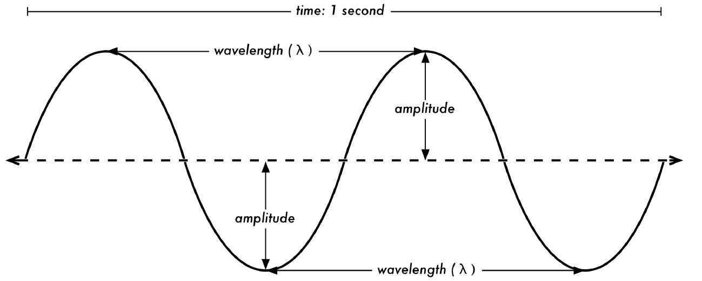

 

Figure RP 1: Wavelength, amplitude, and frequency. For this wave, the
frequency is 2 cycles per second, or 2 Hz, while the speed is 1 m/s.

 

Waves in water are easy to visualize.

Simply drop a stone into the lake and you can see the waves as they move
across the water over time. In the case of electromagnetic waves, the
part that might be hardest to understand is: “What is it that is
oscillating?”

In order to understand that, you need to understand electromagnetic
forces.

### Electromagnetic forces

Electromagnetic forces are the forces between electrical charges and
currents. Our most direct access to those is when our hand touches a
door handle after walking on synthetic carpet, or brushing up against an
electrical fence.

A more powerful example of electromagnetic forces is the lightning we
see during thunderstorms.

The electrical force is the force between electrical charges.

The magnetic force is the force between electrical currents.

Electrons are particles that carry a negative electrical charge. There
are other charged particles too, but it is the electrons that are
responsible for most of what we need to know about how radio behaves.

Let us look at what is happening in a piece of straight vertical wire,
in which we push the electrons from one end to the other and back,
periodically. At one moment, the top of the wire is negatively charged -
all the negative electrons are gathered there. This creates an electric
field from the positively charged end to the negatively charged one
along the wire.

The next moment, the electrons have all been driven to the other side,
and the electric field points the other way. As this happens again and
again, the electric field vectors (represented by arrows from plus to
minus) are leaving the wire, so to speak, and are radiated out into the
space around the wire.

What we have just described is known as a dipole (because of the two
differently charged poles, plus and minus, that are created in the
straight vertical wire), or more commonly a dipole antenna.

This is the simplest form of an omnidirectional antenna. The moving
electric field is commonly referred to as an electromagnetic wave
because there is also an associated magnetic field. A moving electric
field, such as a wave, always comes together with a magnetic field - you
will not find one with out the other. Why is this the case?

An electric field is caused by electrically charged objects.

A moving electric field is produced by moving electrically charged
objects, such as we have just described above in a dipole antenna.

 

Wherever electrical charges are moving, they induce a magnetic field.
Mathematically, this is formulated in Maxwell's equations:
[https://en.wikipedia.org/wiki/Electromagnetic\_field\#Mathematical\_description](https://en.wikipedia.org/wiki/Electromagnetic_field#Mathematical_description)

 

Since the electrical and magnetic components are tied together in this
way, we speak of an electromagnetic field.

In practical wireless networking, we focus in the electrical component
but there be always a magnetic component as well.

 

Let us come back to the relation:

 

Speed = Frequency \* Wavelength

 

In the case of electromagnetic waves, the speed is c, the speed of
light.

 

c = 300,000 km/s = 300,000,000 m/s = 3\*108 m/s

 

c = f \* λ

 

Electromagnetic waves differ from mechanical waves in that they require
no medium in which to propagate. Electromagnetic waves will even
propagate through perfect vacuum.

The light from the stars is a good example: it reaches us through the
vacuum of space.

### Symbols of the international system of units

In physics, maths, and engineering, we often express numbers by powers
of ten.

We will meet these terms again, and the symbols used to represent them,
e.g. gigahertz (GHz), centimetres (cm), microseconds (µs), and so on.

 

These symbols are part of the international system of measurement SI
([http://www.bipm.org/utils/common/pdf/si\_brochure\_8\_en](http://www.bipm.org/utils/common/pdf/si_brochure_8_en.pdf).pdf),
they are not abbreviations and should not be changed.

The case is significant and should not be altered.

SI symbols

atto

10 − 18

 

1/1000000000000000000

a

femto

10 − 15

 

1/1000000000000000

f

pico

10 − 12

 

1/1000000000000

p

nano

10 − 9

 

1/1000000000

n

micro

10 − 6

 

1/1000000

µ

milli

10 − 3

 

1/1000

m

centi

10 − 2

 

1/100

c

kilo

10 3

 

1000

k

mega

10 6

 

1000000

M

giga

10 9

 

1000000000

G

tera

10 12

 

1000000000000

T

peta

10 15

 

1000000000000000

P

exa

10 18

 

1000000000000000000

E

 

Knowing the speed of light, we can calculate the wavelength for a given
frequency. Let us take the example of the frequency of 802.11b wireless
networking, which is:

 

f = 2.4 GHz = 2,400,000,000 cycles / second

 

wavelength (λ) = c / f = 3\*108 / 2.4\*109 = 1.25\*10-1 m = 12.5 cm

 

Frequency and therefore wavelength determine most of an electromagnetic
wave’s behaviour. It governs the dimensions of the antennas that we
build as well as the effect of the interactions with objects that are in
the propagation path, including the biological effects in living beings.

Wireless standards of course are distinguished by more than just the
frequency they are working at - for example, 802.11b, 802.11g, 802.11n
and 802.16 can all work at 2.4 GHz -, yet they are very different from
one another.

The chapter called Telecommunications Basics will discuss modulation
techniques, media access techniques, and other relevant features of
wireless communications standards. However, the basic capabilities of
electromagnetic waves to penetrate objects, to go long distances, and so
forth - these are determined by physics alone. The electromagnetic wave
"does not know or care" what modulation or standard or technique you put
on top of it. So, while different standards may implement advanced
techniques to deal with NLOS (Non Line of Sight), multipath and so forth
- they still cannot make a wave go through a wall, if that wall is
absorbing the respective frequency. Therefore, an understanding of the
basic ideas of frequency and wavelength helps a lot in practical
wireless work.

### Phase

Later in this chapter, we will talk about concepts like interference,
multipath and Fresnel zones. In order to understand these, we will need
to know about the phase of a wave, or rather, phase differences between
waves. Look at the sine wave shown in Fig RP 1 - now imagine we have two
such waves moving. These can be in exactly the same position: Where the
one has its peak, the other one also has a peak. Then, we would say,
they are in phase, or, their phase difference is zero. But one wave
could also be displaced from the other, for example it could have its
peak where the other wave is at zero. In this case, we have a phase
difference. This phase difference can be expressed in fractions of the
wavelength, e.g. λ//4, or in degrees, e.g. 90 degrees - with one full
cycle of the wave being 360 degrees. A phase difference of 360 degrees
is the same as that of 0 degrees: no phase difference.

 

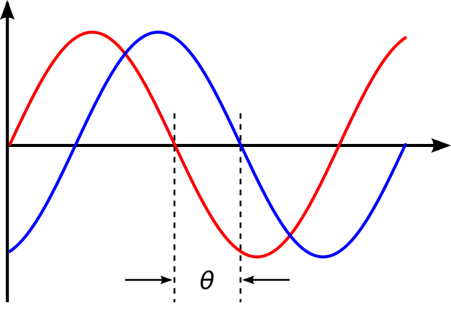

 

### Polarization

Another important quality of electromagnetic waves is polarization.
Polarization describes the direction of the electrical field vector.

If you imagine a vertically aligned dipole antenna (the straight piece
of wire), electrons can only move up and down, not sideways (because
there is no room to move) and thus electrical fields only ever point up
or down, vertically. The field leaving the wire and travelling as a wave
has a strict linear (and in this case, vertical) polarization. If we put
the antenna flat on the ground, we would find horizontal linear
polarization.

 

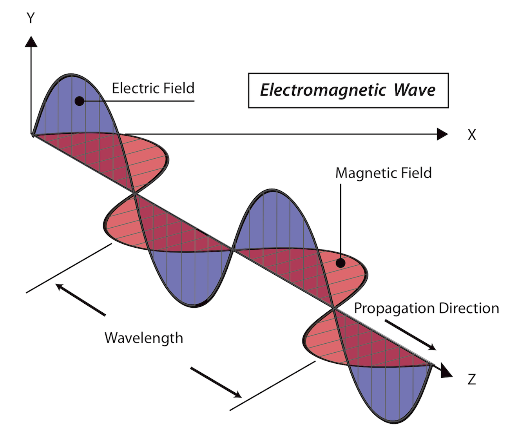

 

Figure RP 3: Vertically polarized electromagnetic wave

 

Linear polarization is just one special case, and is never quite so
perfect: in general, we will always have some component of the field
pointing in other directions too. If we combine two equal dipoles fed
with the same signal, we can generate a circularly polarized wave, in
which the electric field vector keeps rotating perpendicularly to the
wave's trajectory.

The most general case is elliptical polarization, in which the electric
field vector maximum value is not the same in the vertical and
horizontal direction. As one can imagine, polarization becomes important
when aligning antennas. If you ignore polarization, you might have very
little signal even though you have the best antennas. We call this
polarization mismatch.

Much in the same way, polarization may also be used in a smart way, to
keep two wireless links independent and without interference, even
though they might use the same end points (or even share a common
reflector) and therefore the same trajectory: if one link is polarized
vertically and the other horizontally, they will not "see" each other.
This is a convenient way to double data rates over one link using a
single frequency.

The antennas used in this kind of application must be carefully built in
order to reject the "unwanted" polarization, i.e. an antenna meant for
vertical polarization must not receive or transmit any horizontally
polarized signal, and vice versa. We say they must have a high "cross
polarization" rejection.

### The electromagnetic spectrum

Electromagnetic waves span a wide range of frequencies (and,
accordingly, wavelengths). This range of frequencies or wavelengths is
called the electromagnetic spectrum. The part of the spectrum most
familiar to humans is probably light, the visible portion of the
electromagnetic spectrum. Light lies roughly between the frequencies of
7.5\*1014 Hz and 3.8\*1014 Hz, corresponding to wavelengths from circa
400 nm (violet/blue) to 800 nm (red).

We are also regularly exposed to other regions of the electromagnetic
spectrum, including Alternating Current (AC) or grid electricity at
50/60 Hz, AM and FM radio, Ultraviolet (at frequencies higher than those
of visible light), Infrared (at frequencies lower than those of visible
light),

X-Ray radiation, and many others.

 

Radio is the term used for the portion of the electromagnetic spectrum
in which waves can be transmitted by applying alternating current to an
antenna. This is true for the range from 30 kHz to 300 GHz, but in the
more narrow sense of the term, the upper frequency limit would be about
1 GHz, above which we talk of microwaves and millimetric waves.

When talking about radio, many people think of FM radio, which uses a
frequency around 100 MHz. In between radio and infrared we find the
region of microwaves - with frequencies from about 1 GHz to 300 GHz, and
wavelengths from 30 cm to 1 mm.

The most popular use of microwaves might be the microwave oven, which in
fact works in exactly the same region as the wireless standards we are
dealing with. These regions lie within the bands that are being kept
open for general unlicensed use. This region is called the ISM band,
which stands for Industrial, Scientific, and Medical.

Most other parts of the electromagnetic spectrum are tightly controlled
by licensing legislation, with license values being a huge economic
factor. In many countries the right to use portions of the spectrum have
been sold to communications companies for millions of dollars. In most
countries, the ISM bands have been reserved for unlicensed use and
therefore do not have to be paid for when used.

 

 

 

Figure RP 4: The electromagnetic spectrum.

 

The frequencies most interesting to us are 2.400 - 2.495 GHz, which is
used by the 802.11b and 802.11g standards (corresponding to wavelengths
of about 12.5 cm), and 5.150 - 5.850 GHz (corresponding to wavelengths
of about 5 to 6 cm), used by 802.11a. The 802.11n standard can work in
either of these bands.

See the Chapter called WiFi Family for an overview of standards and
frequencies. In addition you can find out more about the Radio portion
of the electromagnetic spectrum in the Chapter called Radio Spectrum.

### Bandwidth

A term you will meet often in radio physics is bandwidth. Bandwidth is
simply a measure of frequency range. If a range of 2.40 GHz to 2.48 GHz
is used by a device, then the bandwidth would be 0.08 GHz (or more
commonly stated as 80 MHz).

It is easy to see that the bandwidth we define here is closely related
to the amount of data you can transmit within it - the more room in
frequency space, the more data you can fit in at a given moment. The
term bandwidth is often used for something we should rather call data
rate, as in “my Internet connection has 1 Mbps of bandwidth”, meaning it
can transmit data at 1 megabit per second. How much exactly you can fit
into a physical signal will depend on the modulation, encoding and other
techniques. For example, 802.11g uses the same bandwidth as 802.11b,
however it fits more data into those same frequency ranges transmitting
up to 5 times more bits per second.

Another example we have mentioned: you may double your data rate by
adding a second link at perpendicular polarization to an existing

radio link. Here, frequency and bandwidth have not changed, however the
data rate is doubled.

### Frequencies and channels

Let us look a bit closer at how the 2.4 GHz band is used in 802.11b. The
spectrum is divided into evenly sized pieces distributed over the band
as individual channels. Note that channels are 22 MHz wide, but are only
separated by 5 MHz.

 

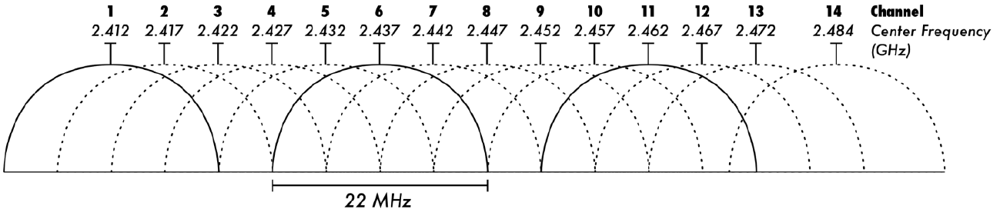

 

Figure RP 5: Channels and centre frequencies for 802.11b.

Note that channels 1, 6, and 11 do not overlap.

### Behaviour of radio waves

There are a few simple rules of thumb that can prove extremely useful
when making first plans for a wireless network:

 

-   •the longer the wavelength, the further it goes; 

-   •the longer the wavelength, the better it travels through and around
    things; 

-   •the shorter the wavelength, the more data it can transport. 

 

All of these rules, simplified as they may be, are rather easy to
understand by example.

 

Longer waves travel further

Waves with longer wavelengths tend to travel further than waves with
shorter wavelengths. As an example, AM radio stations have a much
greater range than FM stations, which use a frequency 100 times higher.
Lower frequency transmitters tend to reach much greater distances than
high frequency transmitters at the same power.

 

Longer waves pass around obstacles

A wave on water which is 5 metres long will not be affected by a 5 mm
piece of wood floating on the water. If instead the piece of wood were
50 metres big (e.g. a ship), it would modify the behavior of the wave.

 

The distance a wave can travel depends on the relationship between the
wavelength of the wave and the size of obstacles in its path of
propagation. It is harder to visualize waves moving “through” solid
objects, but this is the case with electromagnetic waves. Longer
wavelength (and therefore lower frequency) waves tend to penetrate
objects better than shorter wavelength (and therefore higher frequency)
waves.

 

For example, FM radio (88-108 MHz) can travel through buildings and
other obstacles easily, while shorter waves (such as GSM phones
operating at 900 MHz or 1800 MHz) have a harder time penetrating
buildings.

This effect is partly due to the difference in power levels used for FM
radio and GSM, but is also partly due to the shorter wavelength of GSM
signals. At much higher frequencies, visible light does not go through a
wall or even 1 mm of wood - as we all know, from practical experience.

But metal will stop any kind of electromagnetic wave.

Shorter waves can carry more data

The faster the wave swings or beats, the more information it can carry -
every beat or cycle could for example be used to transport a digital
bit, a '0' or a '1', a 'yes' or a 'no'.

So the data rate scales with bandwidth, and can be further enhanced by
advanced modulation and media access techniques such as OFDM, and MIMO
(Multiple Input, Multiple Output).

### The Huygens Principle

There is another principle that can be applied to all kinds of waves,
and which is extremely useful for understanding radio wave propagation.

This principle is known as the Huygens Principle, named after Christiaan
Huygens, Dutch mathematician, physicist and astronomer, 1629 - 1695.

 

Imagine you are taking a little stick and dipping it vertically into a
still lake's surface, causing the water to swing and dance. Waves will
leave the centre of the stick - the place where you dip in - in circles.
Now, wherever water particles are swinging and dancing, they will cause
their neighbor particles to do the same: from every point of
disturbance, a new circular wave will start. This is, in simple form,
the Huygens principle. In the words of wikipedia.org:

“The Huygens' principle is a method of analysis applied to problems of
wave propagation in the far field limit. It recognizes that each point
of an advancing wave front is in fact the centre of a fresh disturbance
and the source of a new train of waves; and that the advancing wave as a
whole may be regarded as the sum of all the secondary waves arising from
points in the medium already traversed”.

 

This view of wave propagation helps better understand a variety of wave
phenomena, such as diffraction.” This principle holds true for radio
waves as well as waves on water, for sound as well as light, but for
light the wavelength is far too short for human beings to actually see
the effects directly.

This principle will help us to understand diffraction as well as Fresnel
zones, and the fact that sometimes we seem to be able to transmit around
corners, with no line of sight.

Let us now look into what happens to electromagnetic waves as they
travel.

### Absorption

When electromagnetic waves go through 'something' (some material), they
generally get weakened or dampened.

How much they lose in power will depend on their frequency and of course
the material.

Clear window glass is obviously transparent for light, while the glass
used in sunglasses filters out quite a share of the light intensity and
most of the ultraviolet radiation.

Often, an absorption coefficient is used to describe a material’s impact
on radiation.

 

For microwaves, the two main absorbent materials are:

 

Metal. Electrons can move freely in metals, and are readily able to
swing and thus absorb the energy of a passing wave.

Water. Microwaves cause water molecules to jostle around, thus taking
away some of the wave’s energy.

 

For the purpose of practical wireless networking, we may well consider
metal and water perfect absorbers: we will not be able to go through
them (although thin layers of water will let some power pass). They are
to microwave what a brick wall is to light.

 

When talking about water, we have to remember that it comes in different
forms: rain, fog and mist, low clouds and so forth, all will be in the
way of radio links. They have a strong influence, and in many
circumstances a change in weather can bring a radio link down.

 

When talking about metal, keep in mind that it may be found in
unexpected places: it may be hidden in walls (for example, as metal
grids in concrete) or be a thin coat on modern types of glass (tinted
glass, colored glass).

However thin the layer of metal, it might be enough to significantly
absorb a radio wave.

 

There are other materials that have a more complex effect on radio
absorption. For trees and wood, the amount of absorption depends on how
much water they contain.

Old dead dry wood is more or less transparent, wet fresh wood will
absorb a lot. Plastics and similar materials generally do not absorb a
lot of radio energy, but this varies depending on the frequency and type
of material.

Lastly, let us talk about ourselves: humans (as well as other animals)
are largely made out of water.

 

As far as radio networking is concerned, we may well be described as big
bags of water, with the same strong absorption.

Orienting an office access point in such a way that its signal must pass
through many people is a key mistake when building office networks.

The same goes for hotspots, cafe installations, libraries, and outdoor
installations.

### Reflection

Just like visible light, radio waves are reflected when they come in
contact with materials that are suited for that: for radio waves, the
main sources of reflection are metal and water surfaces.

The rules for reflection are quite simple: the angle at which a wave
hits a surface is the same angle at which it gets deflected.

 

Note that in the eyes of a radio wave, a dense grid of bars acts just
the same as a solid surface, as long as the distance between bars is
small compared to the wavelength.

 

At 2.4 GHz, a one cm metal grid will act much the same as a metal plate.

 

Although the rules of reflection are quite simple, things can become
very complicated when you imagine an office interior with many many
small metal objects of various complicated shapes.

The same goes for urban situations: look around you in city environment
and try to spot all of the metal objects.

This explains why multipath effects (i.e. signal reaching their target
along different paths, and therefore at different times) play such an
important role in wireless networking.

Water surfaces, with waves and ripples changing all the time,
effectively make for a very complicated reflection object which is more
or less impossible to calculate and predict precisely.

 

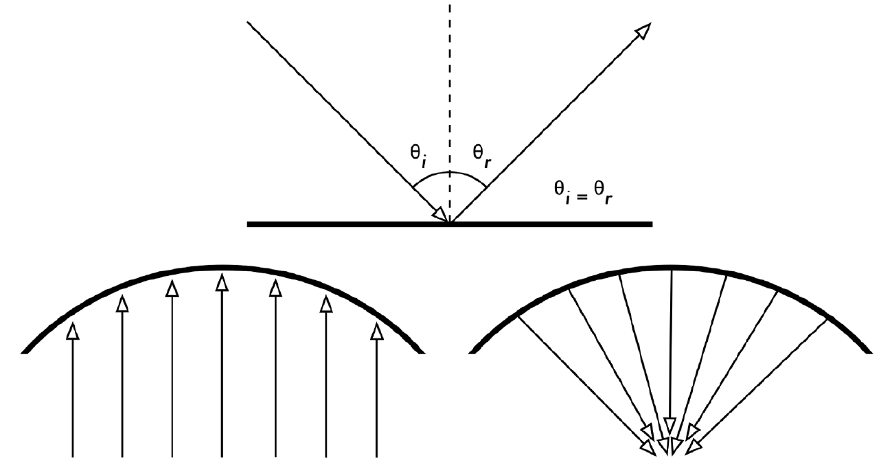

 

Figure RP 6: Reflection of radio waves. The angle of incidence is always
equal to the angle of reflection. A metal parabolic surface uses this
effect to concentrate radio waves spread out over it in a common
direction.

 

We should also add that polarization has an impact: waves of different
polarization in general will be reflected differently.

We use reflection to our advantage in antenna building: e.g. we put huge
parabolas behind our radio transmitter/receiver to collect and bundle
the radio signal into a single point, the focal point.

### Diffraction

Diffraction is the apparent bending of waves when hitting an object.

It is the effect of “waves going around corners”. Imagine a wave on
water traveling in a straight wave front, just like a wave that we see
rolling onto an ocean beach.

Now we put a solid barrier, say a wooden solid fence, in its way to
block it. We cut a narrow slit opening into that wall, like a small
door.

From this opening, a circular wave will start, and it will of course
reach points that are not in a direct line behind this opening, but also
on either side of it. If you look at this wavefront - and it might just
as well be an electromagnetic wave - as a beam (a straight line), it
would be hard to explain how it can reach points that should be hidden
by a barrier.

When modelled as a wavefront, the phenomenon makes sense.

 

 

Figure RP 7: Diffraction through a narrow slit.

 

The Huygens Principle provides one model for understanding this
behavior. Imagine that at any given instant, every point on a wavefront
can be considered the starting point for a spherical “wavelet”.

This idea was later extended by Fresnel, and whether it adequately
describes the phenomenon is still a matter of debate. But for our
purposes, the Huygens model describes the effect quite well.

 

 

Figure RP 8: The Huygens Principle.

 

Through means of the effect of diffraction, waves will “bend” around
corners or spread through an opening in a barrier.

The wavelengths of visible light are far too small for humans to observe
this effect directly.

Microwaves, with a wavelength of several centimeters, will show the
effects of diffraction when waves hit walls, mountain peaks, and other
obstacles. It seems as if the obstruction causes the wave to change its
direction and go around corners.

 

Figure RP 9: Diffraction over a mountain top.

 

Note that diffraction comes at the cost of power: the energy of the
diffracted wave is significantly less than that of the wavefront that
caused it. But in some very specific applications, you can take
advantage of the diffraction effect to circumvent obstacles.

### Interference

Interference is one of the most misunderstood terms and phenonema in
wireless networking.

Interference often gets the blame when we are too lazy to find the real
problem, or when a regulator wants to shut down someone else's network
for business reasons. So, why all the misunderstandings?

It is mostly because different people mean different things though they
are using the same word.

A physicist and a telecommunications engineer will use the word
"Interference" in very different ways. The physicists' view will be
concerned with the "behaviour of waves". The telecommunications engineer
will talk about “... any noise that gets in the way”.

Both views are relevant in wireless, and it is important to be able to
know them both and know the difference. Let us start with the
physicists' view:

When working with waves, one plus one does not necessarily equal two. It
can also result in zero.

 

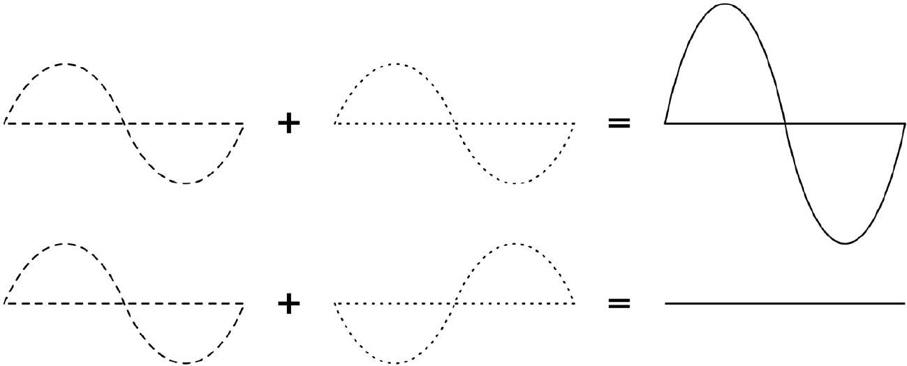

 

Figure RP 10: Constructive and destructive interference.

 

This is easy to understand when you draw two sine waves and add up the
amplitudes. When the phase difference is zero, peak hits peak, and you
will have maximum results (1 + 1 = 2).

This is called constructive interference.

When the phase difference is 180 degrees, or λ/2, peak hits valley, and
you will have complete annihilation ((1 + (-)1 = 0) - destructive
interference.

You can actually try this with waves on water and two little sticks to
create circular waves - you will see that where two waves cross, there
will be areas of higher wave peaks and others that remain almost flat
and calm. In order for whole trains of waves to add up or cancel each
other out perfectly, they have to have the exact same wavelength and a
fixed phase relation.

You can see obvious examples of interference in action when you look at
the way that antennas are arranged in what are called beamforming
arrays, in order to give maximum constructive interference in the
directions where you want the signal, and destructive interference (no
signal) where you want no signal.

Technically, this is achieved by a combination of physical dimensioning
and control of phase shifts.

 

Simplified, imagine that you have three antennas - and you don't want
antenna 3 to pick up signal from antenna 1 and 2. You would then place
antenna 3 at a position where the signals from antennas 1 and 2 cancel
each other out.

Now let us have a look at the way the word interference is typically
used: in a wider sense, for any disturbance through other RF sources,
any noise that might get in our way, e.g. from neighboring channels or
competing providers. So, when wireless networkers talk about
interference they typically talk about all these kinds of disturbance by
other networks, and any other sources of microwave, whether it has
exactly the same frequency and a fixed phase relation or not.
Interference of this kind is one of the main sources of difficulty in
building wireless links, especially in urban environments or closed
spaces (such as a conference space) where many networks may compete for
use of the spectrum.

But, interference of this kind is also often overrated: for example,
imagine you had to build a point to point link that has to cross a
crowded inner city area, before reaching its target on the other side of
the city. Such a highly directional beam will cross the "electric smog"
of the urban centre without any problem. You may imagine this like a
green and a red light beam crossing each other in a 90 degrees angle:
while both beams will overlap in a certain area, the one will not have
any impact on the other at all.

Generally, managing spectrum and coexistence has become a main issue
especially in dense indoor environments and urban areas.

### Line of sight

The term line of sight, often abbreviated as LOS, is quite easy to
understand when talking about visible light: if we can see a point B
from point A where we are, we have line of sight. Simply draw a line
from A to B, and if nothing is in the way, we have line of sight.

Things get a bit more complicated when we are dealing with microwaves.
Remember that most propagation characteristics of electromagnetic waves
scale with their wavelength.

This is also the case for the widening of waves as they travel.

Light has a wavelength of about 0.5 micrometres, microwaves as used in
wireless networking have a wavelength of a few centimetres.

Consequently, their beams are a lot wider - they need more space, so to
speak.

 

 

Note that visible light beams widen just the same, and if you let them
travel long enough, you can see the results despite their short
wavelength. When pointing a well focussed laser at the moon, its beam
will widen to well over 100 metres in radius by the time it reaches the
surface. You can see this effect for yourself using an inexpensive laser
pointer and a pair of binoculars on a clear night. Rather than pointing
at the moon, point at a distant mountain or unoccupied structure (such
as a water tower). The radius of your beam will increase as the distance
increases. This is due to the diffraction.

 

The line of sight that we need in order to have an optimal wireless
connection from A to B is more than just a thin line - its shape is more
like that of a cigar, an ellipsoid. Its width can be described by the
concept of Fresnel zones - see next section for an explanation. You will
also find the abbreviation NLOS, for "non line of sight", which is
mostly used to describe and advertise technologies that allow for
dealing with waves that reach the receiver through multiple trajectories
(multipath) or diffraction. It does not indicate that the single
electromagnetic beam goes "around corners" (other than through
diffraction) or "through obstacles" any better than that of other
technologies. For example, you might call White Space technology NLOS,
as its lower frequencies (longer wavelengths) allow it to permeate
objects and utilize diffraction much better than comparable 2.4 GHz or 5
GHz transmissions.

### Understanding the Fresnel zone

The exact theory of Fresnel (pronounced “Fray-nell”) zones is quite
complicated. However, the concept is quite easy to understand: we know
from the Huygens principle that at each point of a wavefront new
circular waves start, we know that microwave beams widen as they leave
the antenna, we know that waves of one frequency can interfere with each
other. Fresnel zone theory simply looks at a line from A to B, and then
at the space around that line that contributes to what is arriving at
point B. Some waves travel directly from A to B, while others travel on
paths off axis and reach the receiver by reflection.

Consequently, their path is longer, introducing a phase shift between
the direct and indirect beam.

Whenever the phase shift is one half wavelength, you get destructive
interference: the signals cancel.

Taking this approach you find that when the reflected path is less than
half a wavelength longer than the direct path, the reflections will add
to the received signal. Conversely, when the reflected path length
exceeds the direct path by more than one half wavelength, its
contribution will decrease the received power.

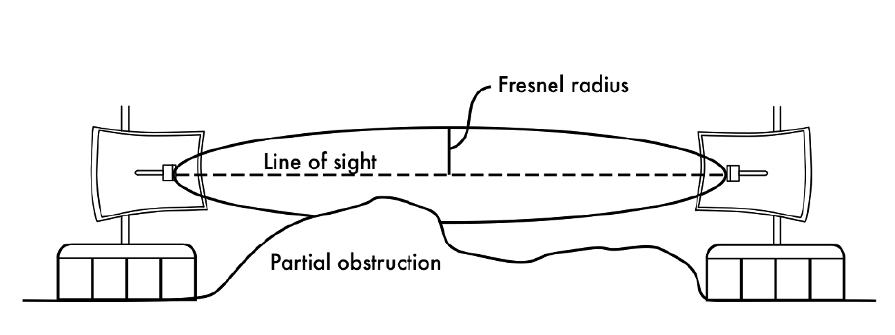

 

Figure RP 11: The Fresnel zone is partially blocked on this link,
although the visual line of sight appears clear.

 

Note that there are many possible Fresnel zones, but we are chiefly
concerned with the first zone, because the contributions from the second
zone are negative. The contributions from the third zone are positive
again, but there is no practical way to take advantage of those without
the penalty incurred in going through the second Fresnel Zone.

If the first Fresnel zone is partially blocked by an obstruction, e.g. a
tree or a building, the signal arriving at the far end would be
diminished. When building wireless links, we therefore need to be sure
that the first zone is kept free of obstructions. In practice, it is not
strictly necessary that the whole of this zone is clear, in wireless
networking we aim to clear about 60 percent of the radius of the first
Fresnel zone.

 

Here is one formula for calculating the radius of the first Fresnel
zone:

 

r = 17.31 ( ( d 1 ∗ d 2 ) ( f ∗ d ) )

 

...where r is the radius of the zone in metres, d1 and d2 are distances
from the obstacle to the link end points in metres, d is the total link
distance in metres, and f is the frequency in MHz.

The first Fresnel zone radius can also be calculated directly from the
wavelength as:

                        r = ( λ ∗ d 1 ∗ d 2 d )

 

with all the variables in metres

 

It is apparent that the maximum value of the first Fresnel zone happens
exactly in the middle of the trajectory and its value can be found
setting d1=d2=d/2 in the preceding formulas. Note that the formulae give
you the radius of the zone, not the height above ground.

To calculate the height above ground, you need to subtract the result
from a line drawn directly between the tops of the two towers.

For example, let’s calculate the size of the first Fresnel zone in the
middle of a 2 km link, transmitting at 2.437 GHz (802.11b channel 6):

 

                        r = 17.31 [ ( 1000 ∗ 1000 ) ( 2437 ∗ 2000 ) ]

 

                        r = 17.31 ( 1000000 4874000 )

 

                          r = 7.84 metres

 

Assuming both of our towers were ten metres tall, the first Fresnel zone
would pass just 2.16 metres above ground level in the middle of the
link.

But how tall could a structure at that point be to block no more than
60% of the first zone?

                          r = 0.6 \* 7.84 metres

                          r = 4.70 metres

 

Subtracting the result from 10 metres, we can see that a structure 5.3
metres tall at the centre of the link would block up to 40% of the first
Fresnel zone.

This is normally acceptable, but to improve the situation we would need
to position our antennas higher up, or change the direction of the link
to avoid the obstacle.

### Power

Any electromagnetic wave carries energy - we can feel that when we enjoy
(or suffer from) the warmth of the sun.

The amount of energy divided by the time during which we measure it is
called power. The power P is measured in W (watts) and is of key
importance for a wireless links to work: you need a certain minimum
power in order for a receiver to make sense of the signal.

 

We will come back to details of transmission power, losses, gains and
radio sensitivity in the chapter called Antennas/Transmission Lines.

 

Here we will briefly discuss how the power P is defined and measured.

The electric field is measured in V/m (potential difference per metre),
the power contained within it is proportional to the square of the
electric field:

 

P \~ E2

 

Practically, we measure the power in watts by means of some form of
receiver, e.g. an antenna and a voltmetre, power metre, oscilloscope,
spectrum analyser or even a radio card and laptop.

Looking at the signal’s power directly means looking at the square of
the signal in volts and dividing by the electrical resistance.

 

Calculating with dB

 

By far the most important technique when calculating power is
calculating with decibels (dB). There is no new physics hidden in this -
it is just a convenient method which makes calculations a lot simpler.

 

The decibel is a dimensionless unit, that is, it defines a relationship
between two measurements of power. It is defined by:

 

dB = 10 \* Log (P1 / P0)

 

where P1 and P0 can be whatever two values you want to compare.
Typically, in our case, this will be some amount of power.

Why are decibels so handy to use? Many phenomena in nature happen to
behave in a way we call exponential.

For example, the human ear senses a sound to be twice as loud as another
one if it has ten times the physical signal power.

 

Another example, quite close to our field of interest, is absorption.
Suppose a wall is in the path of our wireless link, and each metre of
wall takes away half of the available signal. The result would be:

 

                        0 metres = 1 (full signal)

                        1 metre  = 1/2

                        2 metres = 1/4

                        3 metres = 1/8

                        4 metres = 1/16

                        n metres = 1/2n = 2-n

 

This is exponential behaviour.

 

But once we have used the trick of applying the logarithm (log), things
become a lot easier: instead of taking a value to the n-th power, we
just multiply by n. Instead of multiplying values, we just add.

 

Here are some commonly used values that are important to remember:

 

                         +3 dB = double power

                          -3 dB = half the power

                        +10 dB = order of magnitude (10 times power)

                        -10 dB = one tenth power

 

In addition to dimensionless dB, there are a number of definitions that
are based on a certain base value P0. The most relevant ones for us are:

 

                dBm relative to P0 = 1 mW

                dBi relative to an ideal isotropic antenna

 

An isotropic antenna is a hypothetical antenna that evenly distributes
power in all directions.

 

It is approximated by a dipole, but a perfect isotropic antenna cannot
be built in reality. The isotropic model is useful for describing the
relative power gain of a real world antenna.

Another common (although less convenient) convention for expressing
power is in milliwatts. Here are equivalent power levels expressed in
milliwatts and dBm:

 

                        1 mW =  0 dBm

                        2 mW =  3 dBm

                        100 mW = 20 dBm

                          1 W = 30 dBm

 

For more details on dB refer to the dB math lecture of the Wireless
Training kit:
http://wtkit.org/sandbox/groups/wtkit/wiki/820cb/attachments/ebdac/02
-dB\_Math-v1.12\_with-notes.pdf

### Physics in the real world

Don’t worry if the concepts in this chapter seem challenging.
Understanding how radio waves propagate and interact with the
environment is a complex field of study in itself.

Most people find it difficult to understand phenomenon that they can’t
even see with their own eyes.

By now you should understand that radio waves don’t travel only in a
straight, predictable path.

To make reliable communication networks, you will need to be able to
calculate how much power is needed to cross a given distance, and
predict how the waves will travel along the way.

2. TELECOMMUNICATIONS BASICS
----------------------------

 

The purpose of any telecommunications system is to transfer information
from the sender to the receiver by a means of a communication channel.

The information is carried by a signal, which is certain physical
quantity that changes with time.

The signal can be a voltage proportional to the amplitude of the voice,
like in a simple telephone, a sequence of pulses of light in an optical
fibre, or a radio-electric wave irradiated by an antenna.

For analog signals, these variations are directly proportional to some
physical variable like sound, light, temperature, wind speed, etc. The
information can also be transmitted by digital binary signals, that will
have only two values, a digital one and a digital zero. Any analog
signal can be converted into a digital signal by appropriately sampling
and then coding it. The sampling frequency must be at least twice the
maximum frequency present in the signal in order to carry all the
information contained therein. Random signals are the ones that are
unpredictable and can be described only by statistical means.

Noise is a typical random signal, described by its mean power and
frequency distribution. A signal can be characterised by its behaviour
over time or by its frequency components, which constitute its spectrum.
Some examples of signals are shown in Figure TB 1.

 

 

Figure TB 1: Examples of signals

 

Any periodic signal is composed of many sinusoidal components, all of
them multiples of the fundamental frequency, which is the inverse of the
period of the signal. So a signal can be characterised either by a graph
of its amplitude over time, called a waveform, or a graph of of the
amplitudes of its frequency components, called a spectrum.

Figure TB 2: Waveforms, Spectrum and filters

 

Figure TB 2 shows how the same signal can be seen from two different
perspectives. The waveform can be displayed by an instrument called an
oscilloscope, while the spectrum can be displayed by what is called a
Spectrum Analyzer. The spectrum distribution relays very important
information about the signal and allows for the intuitive understanding
of the concept of filtering of electrical signals. In the example shown,
the signal is formed by the superposition of three sinusoidal components
of frequency f1, f2 and f3. If we pass this signal through a device that
will remove f2 and f3, the output is a pure sinusoidal at frequency f1.

We call this operation “Low Pass filtering” because it removes the
higher frequencies. Conversely, we can apply the signal to a “High Pass
Filter”, a device that will remove f1 and f2 leaving only a sinusoidal
signal at the f3 frequency.

Other combinations are possible, giving rise to a variety of filters. No
physical device can transmit all the infinite frequencies of the
radio-electric spectrum, so every device will always perform some extent
of filtering to the signal that goes through it.

The bandwidth of a signal is the difference between the highest and the
lowest frequency that it contains and is expressed in Hz (number of
cycles per second).

While travelling through the communication channel, the signal is
subject to interference caused by other signals and is also affected by
the electrical noise always present in any electrical or optical
component. Intra-channel interference originates in the same channel as
our signal. Co-channel interference is due to the imperfection of the
filters that will let in signals from adjacent channels.

Consequently, the received signal will always be a distorted replica of
the transmitted signal, from which the original information must be
retrieved by appropriate means to combat the effect of interference and
noise. Furthermore, the received signal will be subject to attenuation
and delay that increase with the distance between the transmitter and
the receiver.

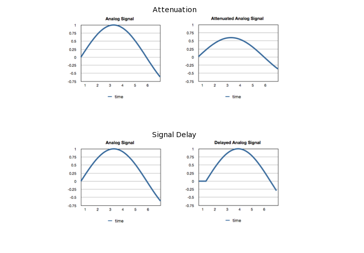

Figure TB 3: Attenuation and delay

 

Although it is relatively simple to restore the amplitude of signal by
means of an electrical amplifier, the components of the amplifier will
add additional noise to the signal, so at very long distances where the
received signal is feeble, the amplifier will produce a signal so
garbled with noise that the information originally transmitted will no
longer be retrievable.

 

One way to address this problem consists in converting the continuous
quantity carrying the information into a sequence of very simple symbols
which can be easier to recognise even at great distance. For instance,
the flag of a ship is a convenient way to distinguish the nationality of
the ship even at distances at which the letters on the hull cannot be
read.

This technique has been extended to carry generalised messages by
assigning different position of flags to every letter of the alphabet,
in an early form of long distance telecommunications by means of digital
or numeric signals.

The limitation of this method is obvious; to be able to distinguish
among, say, 26 symbols corresponding to each letters of the alphabet,
one must be quite close to the communicating ship.

On the other hand, if we code each letter of the alphabet in a sequence
of only two symbols, these symbols can be distinguished at much longer
distance, for example the dot and dashes of the telegraph system.

The process of transforming a continuous analog signal into a
discontinuous digital one is called Analog to Digital Conversion (ADC),
and conversely we must have a Digital to Analog Converter (DAC) at the
receiving end to retrieve the original information.

This is the reason why most modern telecommunication systems use digital
binary signals to convey all sorts of information in a more robust way.
The receiver must only distinguish between two possible symbols, or in
other words between two possible values of the received bit (binary
digit). For instance, the CD has replaced the vinyl record, and analogue
television is being replaced by digital television. Digital signals can
use less bandwidth, as exemplified by the “digital dividend” currently
being harnessed in many countries which consists in bandwidth that has
become available thanks to the transition from analog to digital
transmission in TV broadcasting.

Although in the process of converting from an analog to a digital
information system there is always some loss of information, we can
engineer the system so as to make this loss negligible.

 

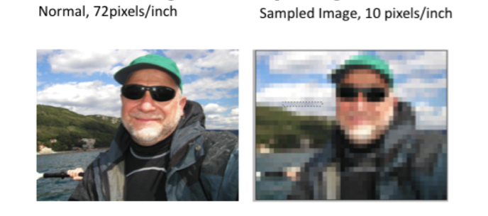

Figure TB 4: Undersampled Image

 

For example, in a digital camera we can choose the number of bits used
to record the image.

The greater the number of bits (proportional to the amount of
megapixels), the better the rendering, but more memory will be used and
longer time to transmit the image will be needed.

So most modern communication systems deal with digital signals, although
the original variable that we want to transmit might be analog, like the
voice. It can be shown that any analog signal can be reconstructed from
discrete samples if the sampling rate is at least twice as high as the
highest frequency content of the signal.

 

 

Figure TB 5: detection of a noisy signal

 

Then each sample is coded in as many bits as necessary to achieve the
desired amount of precision.

These bits can now be efficiently stored or transmitted, since for the
recovery of the information one needs to distinguish among only two
states, and not among the infinite nuances of an analog signal.

 

This is shown in Figure TB 5, where the original data consists of the 0
1 0 1 1 1 0 sequence. The 0's are represented as zero volts and the 1's
as 1 V. As the signal moves towards the receiver, its amplitude will
diminish. This effect is called "attenuation" and is shown in the
figure. Likewise, there will also be a delay as the signal moves from
the transmitter to the receiver, the variability in the delay of the
received signal is called jitter. Attenuation, noise or jitter (or their
combination) if severe enough, can cause a detection error. An amplifier
can be used to overcome the attenuation, but the electrical noise always
present in the system will add to the received signal.

 

The noisy received signal is therefore quite different from the original
signal, but in a digital system we can still recover the information
contained by sampling the received signal at the correct time and
comparing the value at the sampling time with a suitable threshold
voltage. In this example the noise received signal has a peak of 1.8 V,
so we might choose e threshold voltage of 1.1 V. If the received signal
is above the threshold, the detector will output a digital 1, otherwise,
it will output a 0. In this case we can see that because of the effect
of the noise the fifth bit was erroneously detected as a zero.

 

Transmission errors can also occur if the sampling signal period is
different from that of the original data (difference in the clock
rates), or if the receiver clock is not stable enough (jitter).

Any physical system will have an upper limit in the frequencies that
will transmit faithfully (the bandwidth of the system), higher
frequencies will be blocked, so the abrupt rise and fall of the voltage
will be smoothed out as the signal goes through the channel.

Therefore, we must make sure that each of the elements of the system has
enough bandwidth to handle the signal. On the other hand, the greater
the bandwidth of the receiver system, the greater the amount of the
noise that will affect the received signal.

### Modulation

The robustness of the digital signal is also exemplified by the fact
that it was chosen for the first trials of radio transmission. Marconi
showed the feasibility of long distance transmission, but pretty soon
realised that there was a need to share the medium among different
users.

 

This was achieved by assigning different carrier frequencies which were
modulated by each user’s message. Modulation is a scheme to modify the
amplitude, frequency or phase of the carrier according with the
information one wants to transmit. The original information is retrieved
at destination by the corresponding demodulation of the received signal.

 

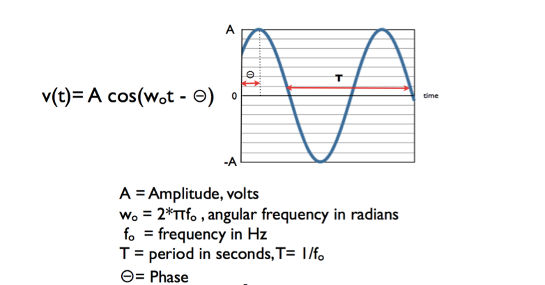

 

Figure TB 6: Sinusoidal Carrier Signal

 

Figure TB 6 shows a carrier signal with Amplitude A, phase θ, and
frequency fo which is the reciprocal of the period T.

 

The combination of different modulation schemes has resulted in a
plethora of modulation techniques depending on which aspect one wants to
optimise: robustness against noise, amount of information transmitted
per second (capacity of the link in bits/second) or spectral efficiency
(number of bits/s per Hertz).

 

For instance, BPSK -Binary Phase Shift Keying- is a very robust
modulation technique but transmits only one bit per symbol, while 256
QAM -Quaternary Amplitude Modulation- will carry 8 bits per symbol, thus
multiplying by a factor of eight the amount of information transmitted
per second, but to correctly distinguish amongst the 256 symbols
transmitted, the received signal must be very strong as compared with
the noise (a very high S/N -Signal/Noise ratio- is required).

The ultimate measure of quality in digital transmission is the BER -Bit
Error Rate- which corresponds to the fraction of erroneously decoded
bits. Typical values of BER range between 10-3 and 10-9.

The modulation also allows us to choose which range of frequency we want
to use for a given transmission. All frequencies are not created equal
and the choice of the carrier frequency is determined by legal,
commercial and technical constraints.

### Multiplexing and duplexing

In general, the sharing of a channel among different users is called
multiplexing.

This is shown in Figure TB 7.

 

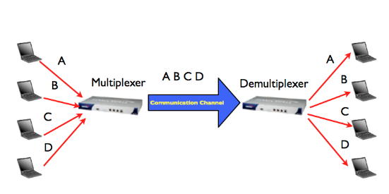

Figure TB 7: Multiplexing

 

Assigning different carrier frequencies to different users is called
FDMA -Frequency Division Multiple Access-.

 

An alternative technique consists in assigning different time slots to
different users, in what is known as TDMA -Time Division Multiple
Access-, or even different codes in CDMA -Code Division Multiple Access-
where the different users are recognised at the receiver by the
particular mathematical code assigned to them. See Figure TB 8.

By using two or more antennas simultaneously, one can take advantage of
the different amount of fading introduced in the different paths to the
receiver establishing a difference among users in what is known as SDMA
- Space Division Multiple Access-, a technique employed in the MIMO
-Multiple Input,Multiple Output- systems that have gained popularity
recently.

 

 

Figure TB 8: Medium Sharing techniques

 

Most communication systems transmit information in both directions, for
instance from the Base Station to the subscriber in what is called the
downlink, and from the subscriber to the base station in the uplink.

To accomplish this, the channel must be shared between the two
directions giving rise respectively to FDD -Frequency Division
Duplexing- and TDD -Time Division Duplexing-.

### Conclusions

The communication system must overcome the noise and interference to
deliver a suitable replica of the signal to the receiver.

 

The capacity of the communication channel in bits/second is proportional
to the bandwidth in Hz and to the logarithm of the S/N ratio.

 

Modulation is used to adapt the signal to the channel and to allow
several signals to share the same channel. Higher order modulation
schemes allow for a higher transmission rate, but require higher S/N
ratio.

 

The channel can be shared by several users that occupy different
frequencies, different time slots, different codes or by taking
advantage of different propagation characteristics in what is called
spatial multiplexing.

 

For more information and slides covering this topic please visit
[http://wtkit.org/groups/wtkit/wiki/820cb/download\_page.html](http://wtkit.org/groups/wtkit/wiki/820cb/download_page.html)

3. LICENSING AND REGULATION
---------------------------

There are a number of areas where national and international laws and
regulations can influence your ability to set up wireless networks.

Since these rules vary from country to country it is impossible to give
an overview of which regulations may apply in your region.

It is also worth noting that there may be a huge difference in which
laws exist, and how they are regulated in practice. In other words there
may be countries where using the 2.4 GHz / 5 GHz spectrum for outdoor
wireless is technically illegal, but where everyone does it anyway.

As a rule of thumb, if other people are building similar networks to
what you intend, contact them and find out what legal issues they may
have run into. If such networks are very widely deployed in your
country, then you probably don't need to worry too much. On the other
hand, it is always advisable to seek local advice, from hardware
vendors, wireless experts or others who have come before you, before
committing time and resources to building a wireless network. Whatever
you do, it is important you take local laws and regulations into
consideration.

### Examples of relevant types of regulation

Each country may have different rules, and each scenario may come across
different types of regulations. The areas where regulations may be
relevant include licenses for using specific radio frequencies, rules
regarding the right to install towers for antennas, the maximum power
allowed and telecom licensing rules limiting your ability to provide
Internet access to others.

 

The types of legal issues that may (or may not) be worth considering
when planning a wireless network include:

 

-   •Spectrum Licensing 

-   •ISP/Telecommunications Licenses 

-   •Tower permits for antennas 

-   •Transmission power and antenna gain limits 

-   •Certification of equipment 

-   •ISP Terms of Use 

 

Spectrum Licensing

Most countries consider RF spectrum as an exclusive property of the
state. The RF spectrum is a national resource, much like water, land,
gas and minerals. Unlike these, however, RF is reusable. The purpose of
spectrum management is to mitigate radio spectrum pollution and maximize
the benefit of usable radio spectrum.

The first sentence of the International Telecommunications Union (ITU)
constitution fully recognises “the sovereign right of each State to
regulate its telecommunication”. Effective spectrum management requires
regulation at national, regional and global levels.

Licensing is an orderly way to manage who, when, where and how spectrum
resource is used. The unlicensed wireless spectrum was set around the
2.4 GHz band.

In June 2003, the ITU made available the 5 GHz band for license-exempt
technology deployment. The 900 MHz band, unlicensed in the United
States, is presently used in Western Europe and in many developing
countries for GSM phones. Each country has the sovereign right to
regulate its telecommunication and to interpret the international Radio
Regulations. Governments define the rules and conditions of the
frequency use.

(From: Wikipedia "Spectrum Management")

 

The technologies described in this book (mostly) use a license-exempt
slice of the spectrum referred to as the ISM (Industrial, Scientific and
Medical radio bands). Radio frequencies in the ISM bands have been used
for communication purposes, although such devices may experience
interference from non-communication sources.

The ISM bands are defined by the ITU-R (ITU's Radiocommunication Sector)
at 2.4 and 5 GHz. Individual countries' use of the bands designated in
these sections may differ due to variations in national radio
regulations. Because communication devices using the ISM bands must
tolerate any interference from ISM equipment, unlicensed operations are
typically permitted to use these bands, since unlicensed operation
typically needs to be tolerant of interference from other devices
anyway.

In the US, the FCC (Federal Communications Commission) first made
unlicensed spread spectrum available in the ISM bands in rules adopted
on May 9, 1985. Many other countries later adopted these FCC
regulations, enabling use of this technology in many countries.

(From: Wikipedia "ISM Band")

ISP/Telecommunications Licenses

In some countries an ISP license would be required before deploying any
network infrastructure for sharing networks over public spaces. In other
countries this would only be required to run commercial networks.

 

Tower permits for antennas

When deploying long-range outdoor networks, it is often necessary to
build a tower for the antenna. Many countries have regulations regarding
the building of such antenna-towers if they are more than 5 or 10 metres
above the roof or ground.

 

Transmission Power limits

When setting transmission power limits, regulatory agencies generally
use the Equivalent Isotropically Radiated Power (EIRP), as this is the
power actually radiated by the antenna element. Power limits can be
imposed on output power of devices as well.

As an example, the FCC enforces certain rules regarding the power
radiated by the antenna element, depending on whether the implementation
is point-to-multipoint (PtMp) or point-to-point (PtP). It also enforces
certain rules regarding the maximum power transmitted by the radio.

When an omnidirectional antenna is used, the FCC automatically considers
the link a PtMP link. In the setup of a 2.4 GHz PtMP link, the FCC
limits the EIRP to 4 Watts and the power limit set for the intentional
radiator is 1 Watt.

 

Things are more complicated in the 5 Ghz band. The Unlicensed National
Information Infrastructure (U-NII) radio band is part of the radio
frequency spectrum used by IEEE-802.11a devices and by many wireless
ISPs. It operates over three ranges:

 

        U-NII Low (U-NII-1): 5.15-5.25 GHz. Regulations require use of
an integrated antenna. Power limited to 50 mW.

        U-NII Mid (U-NII-2): 5.25-5.35 GHz. Regulations allow for a
user-installable antenna, subject to Dynamic Frequency Selection (DFS,
or radar avoidance). Power limited to 250 mW.

        U-NII Worldwide: 5.47-5.725 GHz. Both outdoor and indoor use,
subject to Dynamic Frequency Selection (DFS, or radar avoidance). Power
limited to 250 mW.

This spectrum was added by the FCC in 2003 to "align the frequency bands
used by U-NII devices in the United States with bands in other parts of
the world".

The FCC currently has an interim limitation on operations on channels
which overlap the 5600 - 5650 MHz band.

 

        U-NII Upper (U-NII-3): 5.725 to 5.825 GHz.

Sometimes referred to as U-NII / ISM due to overlap with the ISM band.
Regulations allow for a user-installable antenna. Power limited to 1W.

Wireless ISPs generally use 5.725-5.825 GHz.

(From: Wikipedia "U-NII")

 

For PtP in the 5 GHz band the maximum EIRP allowed is considerable
higher, since a high gain antenna produces a very narrow beam and
therefore the interference caused to other users is considerably less
than in PtMPt topology.

 

Certification of equipment

Governments may require a formal certification that a given radio
equipment comply with specific technical standards and local
regulations.

This is often referred to as homologation, and the process must be done
by an independent laboratory authorised by the government of the
country.

Certified equipment is allowed to operate without an individual license.
It is worth noting that certification may only apply to the original
factory state for radio equipment.

For example, changing the antenna on a wireless access point in the
United States invalidates the FCC Certification.

 

ISP Terms of Use

Many ISP's include in their "Terms of Use" a clause that prohibits users
from sharing an internet connection with other users.

There may also be commercial grade connections that do not have these
limitations.

It is important to note that this is NOT a legal issue, but a clause of
the contract with the ISP, and the repercussions for breaching these is
usually a disconnection of the Internet connection.

 

4. RADIO SPECTRUM
-----------------

### What is the electromagnetic spectrum?

There is not a simple definition of the spectrum. From the technical
viewpoint the spectrum is simply the range of electromagnetic waves that
can be used to transmit information, but from the practical viewpoint
the economic and political aspects, as well as the technology actually
used to convey the information by means of these waves, play pivotal
roles.

As an example, when Marconi in 1902 first spanned the Atlantic with his
“wireless telegraph message”, he used the whole spectrum available at
the time to send a few bits/s over an area of thousands of square
kilometres.

With the spark transmitter used for this achievement that occupied all
the frequencies that the existing receivers were able to understand,
nobody else could use radio for communications on a radius of some 3500
km from the transmitting station in England. So, if other users wanted
to send messages in the same area, they would need to coordinate their
transmissions in different “time slots” in order to share the medium.
This technique is called “TDMA”, Time Division Multiple Access.

 

Users located at distances much greater than 3500 km from Marconi’s
transmitter could use the spectrum again, since the power of the radio
waves decreases as we move farther away from the transmitter. Reusing
the spectrum in different geographical areas is called “SDMA”, Space
Division Multiple Access. Marconi was later able to build a transmitter
that could restrict emissions to just a range of frequencies, and a
receiver that could be “tuned” to a particular frequency range. Now,
many users could transmit simultaneously in the same area (space) and at
the same time. “FDMA”, Frequency Division Multiple Access was borne.
Radio then became a practical means of communications, and the only one
that was available to reach a ship in the open seas. The coordination of
the frequencies allocated to different users was done by national
agencies created to this effect, but since radio waves are not stopped
by national borders, international agreements were needed. The
international organization that had been created to regulate the
transmission of telegrams among different countries was commissioned to
allocate the use of the electromagnetic spectrum.

Nowadays, ITU, International Telecommunications Union, is the oldest
International Organization, tasked with issuing recommendations about
which frequencies to use for which services to its 193 nation members.

 

The use of the spectrum for military applications raised a new issue;
“jamming”, the intentional interference introduced by the enemy to
impede communication. To avoid jamming, a new technique was developed in
which the information to be transmitted was combined with a special
mathematical code; only receivers with the knowledge of that particular
code could interpret the information. The coded signal was transmitted
at low power but using a very wide interval of frequencies to make
jamming more difficult.

 

This technique was later adapted to civilian applications in what is
called “CDMA”, Code Division Multiple Access, one of the flavours of
spread spectrum communication, extensively used in modern communications
systems. In summary, the spectrum can be shared among many users by
assigning different time slots, different frequency intervals, different
regions of space, or different codes. A combination of these methods is
used in the latest cellular systems. Besides issues of sovereignty and
its defence, very strong economic and political interests play a
determinant role in the management of the spectrum, which also needs to
be constantly updated to take advantage of the advances in the
communications technology.

Telecommunications engineers keep finding more efficient ways to
transmit information using time, frequency and space diversity by means
of ever advancing modulation and coding techniques. The goal is to
increase the “spectrum efficiency”, defined as the amount of bits per
second (bit/s) that can be transmitted in each Hz of bandwidth per
square kilometre of area. For example, the first attempts to provide
mobile telephone services were done by using a powerful transmitter,
conveniently located to give coverage to a whole city.

This transmitter (called a Base Station in this context), divided the
allocated frequency band into say, 30 channels. So only 30 conversations
could be held simultaneously in the whole city.

As a consequence, the service was very expensive and only the extremely
wealthy could afford it. This situation prevailed for many years, until
the advances in electronic technology allowed the implementation of a
scheme to take advantage of “Space Diversity”.

Instead of using a single powerful transmitter to cover the whole city,
the area to be serviced was divided into many “cells”, each one served
by a low power transmitter. Now cells that are sufficiently apart can
utilize the same channels without interference, in what is known as
“frequency reuse”. With the cellular scheme, the first 10 channels are
to use frequency band 1, the second 10 channels frequency band 2 and the
remaining 10 channels frequency band 3. This is shown in Figure RS 1, in
which the colours correspond to different frequency bands. Notice that
the colours repeat only at distances far enough to avoid interference.
If we divide the city in say, 50 cells, we can now have 10X50 = 500
simultaneous users in the same city instead of 30. Therefore, by adding
cells of smaller dimensions (specified by lower transmission power) we
can increase the number of available channels until we reach a limit
imposed by the interference.

 

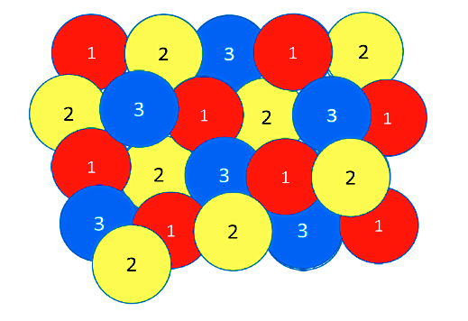

 

Figure RS 1: Cellular sharing of spectrum

 

This example shows that a clever use of existing resources can
dramatically increase its usefulness. Although the main use of the
spectrum is for communication purposes, there are also other uses, like
cooking food in microwave ovens, medical applications, garage door
openers and so on.

So some frequency bands are allocated for these purposes in what is
known as the ISM (Industrial, Scientific and Medical) bands.

This spectrum usage is normally for short distance applications.

A breakthrough occurred in 1985 when the FCC (Federal Commission of
Communications), the agency that oversees the spectrum in the U.S.,
allowed the use of this spectrum for communications applications as
well, provided that the transmission power was kept to a very low level
to minimize interference.

People could freely use these “Unlicensed” bands without previously
applying for a permit, provided that the equipment used had been
certified by an authorized laboratory that ensured compliance with
interference mitigation measures.

Several manufacturers began taking advantage of this opportunity by
offering equipment that could be used to communicate between computers
without the need for cables, and some wireless data networks covering
significant geographic areas were built with them, but the turning point
happened after the 1997 approval of the IEEE (Institute of Electrical
and Electronics Engineers) 802.11 Standard, the basis of what is known
as WiFi.

The existence of a standard that guaranteed the interoperability of
equipment produced by different manufacturers fuelled an impressive
growth of the market, which in turn drove the competition that fostered
a dramatic decrease in the cost of the devices.

In particular, the portion of the ISM band between 2400 and 2483 MHz is
nowadays available in most of the world without the need for previously
applying for a license and is widely used by laptops, tablets, smart
phones and even photographic cameras.

It is important to stress the role of the unlicensed spectrum in the
enormous success of WiFi high speed Internet access.

Many airports, hotels and cafes all over the world offer free WiFi
Internet access on their premises, and low cost wireless community
networks have been built both in rural area and in cities covering
considerable geographic areas, thanks to the availability of free
spectrum.

Mobile phone operators, who have to pay dearly for frequency licenses to
use the spectrum, were quite hostile to this apparently unfair
competition.

But when they started offering smart phones, which make very intensive
use of the Internet, they pretty soon realized that off-loading the
traffic to WiFi was in their best interest, because it relieved the
traffic in their distribution network (known as the backhaul).

So now they encourage their customers to use WiFi wherever it is
available and use the more expensive cellular service only when out of
range of any WiFi Access Point.

This is a remarkable example of the usefulness of the unlicensed
spectrum even to traditional telecommunications operators who often have
lobbied against it.

### How is the spectrum adjudicated?

Currently the main methods to gain access to a given spectrum band are
auctions and the so called “beauty contest”.

The auction method is straightforward; interested parties bid for a
given spectrum chunk; whoever commits the higher sum gets the right to
use the frequencies.

In theory this method guarantees that the adjudication will be
transparent, in practice this has often been circumvented and there have
been instances of powerful commercial interests that acquire frequencies
only to avoid their use by the competition, with the result of highly
valuable spectrum not being used.

Also there is the temptation on the part of governments to use this
method as a means to generate revenues and not necessarily in the best
public interest.

As an example, in the year 2000 there were auctions in several countries
of Europe to adjudicate spectrum for mobile phones, which resulted in a
total income of 100 billion (100 000 000 000) euros to the government
coffers.

 

The “beauty contest” method is for the interested parties to submit
proposals about how they intend to use the spectrum.

A committee of the spectrum regulating agency then decides which of the
proposals better serves the public goals.

This method relies on the objectivity, technical proficiency and honesty
of the members of the deciding committee, which is not always
guaranteed.

In many countries there are rules for spectrum adjudication that call
for the relinquishing of spectrum bands that have been acquired but are
not being used; however their enforcement is often lacking due to the
strong economic interests affected.

 

 

 

Figure RS 2 shows a photograph of a spectrum monitoring vehicle in
Montevideo, Uruguay and Figure RS 3 that of the same kind of equipment
being used in Jakarta, Indonesia.

 

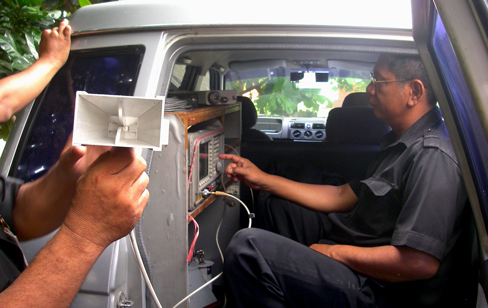

Figure RS 3: The “spectrum Police” at work in Jakarta

 

Note that the open spectrum used in the unlicensed bands cannot prevent
interference issues, especially in very crowded areas, but nevertheless
it has proved a fantastic success for short distance applications in
cities and also for long distance applications in rural areas.

It is therefore advisable to investigate new forms of spectrum
allocation, taking into consideration the needs of many stakeholders and
striking a balance among them.

A dynamic spectrum allocation mechanism seems to be the best choice
given the advances in technology that make this viable nowadays.

As an example, the current method of spectrum allocation is similar to
the railway system, the railroads can be idle a considerable amount of
time, whereas the dynamic spectrum allocation is akin to the freeway
system that can be used at all times by different users.

### Political issues

The importance of the spectrum as a communications enabler cannot be
overstated. Television and radio broadcasting have a strong influence in
shaping public perception of any issue, and have been used overtly for
political propaganda (It has been said that the election of Kennedy as
president of the U.S. was due mainly to his television campaign).

During the cold war, The Voice of America, Moscow Radio and Radio Havana
Cuba were very effective ways to sway a global audience.

 

More recent examples include the influence of CNN and Al Jazeera in the
public interpretation of the Arab Spring. Spectrum used for two way
communications has also been subject to government interventions,
especially in cases of political unrest. On the other hand, economic
interests also play a vital role in broadcasting; the consumer society
relies heavily on radio and television to create artificial needs or to
veer the consumer towards a particular brand. We can conclude that the
electromagnetic spectrum is a natural resource whose usefulness is
heavily conditioned by technological, economic and political factors.

### Explosion in spectrum demand

As the number of tablets and smart phones grows, telecom operators are
trying to get access to new frequency bands, but the traditional way of
adjudicating the spectrum is facing a dead end.

 

Keep in mind that the spectrum is used for radio and television
broadcasts, for satellite communications, for airplane traffic control,
for geolocalisation (Global Postioning Systems-GPS), as well as for
military, police and other governmental purposes. Traditionally, the
demand for additional spectrum has been met thanks to the advances of
electronics that have permitted the use of higher frequencies at an
affordable cost. Higher frequencies are well suited for high speed
transmissions, but they have a limited range and are highly attenuated
by walls and other obstacles as well as by rain.

 

This is exemplified by comparing the coverage of an AM radio
broadcasting station to that of an FM one: the greatest range of the AM
station is due to its use of lower frequencies. On the other hand, FM
stations can make use of higher bandwidths and as consequence can offer
greater audio quality at the expense of a more limited range.

Current cellular operators use even higher frequencies, usually above
800 MHz. Accordingly, the TV broadcasting frequencies are coveted by the
cellular telephone providers, because by using lower frequencies they
will need less base stations, with huge savings in deployment, operation
and maintenance costs. This is why these frequencies are commonly
referred to as “beach front property”.

 

Techniques for more efficient spectrum usage by means of advanced
modulation and coding methods have had the greatest impact in allowing
more bits/s per Hz of bandwidth availability. This, in turn, was made
possible by the great strides in electronics (fabrication of ever
advanced integrated circuits) that now make it economically feasible to
implement the required sophisticated modulation and coding techniques.

 

According to the calculations performed in 1948 by Claude Shannon - the
father of modern telecommunications, a typical telephone line could
carry up to 30 kbit/s. But this was only achieved in the 90's when
integrated circuits implementing the required techniques were actually
built. In particular, the transition to digital terrestrial television
broadcasting, which is more efficient in spectrum usage compared with
analogue transmission, has freed some spectrum in the so called “White
Spaces”, the frequencies that had to be left fallow in between analogue
television channels to prevent interference.

 

 

In traditional analogue TV broadcasting, adjacent channels cannot be
used at the same time, because the signal from one channel will “spill”
over to the two adjacent channels and would cause interference. This is
similar to the central reservation used in freeways to separate the two
directions of traffic in order to prevent collisions. So a “White Space”
must be left between two contiguous analogue TV channels to prevent
interference. Digital TV broadcasting is much more efficient in spectrum
utilization, and several digital TV channels can be accommodated in the
same frequency band formerly used by a single analogue channel without
“spillover” into adjacent channels. So, in places where Analog TV is
replaced by Digital TV a “digital dividend” is being harvested.

In conclusion, the concept of white spaces can be applied to three
different frequency chunks:

 

-   •The spectrum that has been assigned to TV broadcasting but it is
    not currently being used. This applies particularly to developing
    countries, in which there has been no economic incentive for
    broadcaster to use every available TV channel. 

-   •The spectrum that must be left free in between two analogous TV
    channels to prevent interference. 

-   •The spectrum that has been reclaimed as a consequence of the
    transition to digital terrestrial TV, which is more spectrum
    efficient. This currently applies to developed countries, but will
    soon apply to developing countries as well. 

In the last 20 years there has been a tremendous growth in the demand
for more spectrum for mobile communication services, in which data

services are consuming much more bandwidth than voice and the growing
use of video is presenting an additional challenge.

Not surprisingly, telecom operators everywhere are trying to get a
portion of these “White Spaces” allocated to them to fulfill their
needs. Broadcasters, on the other hand, are very reluctant to concede
any spectrum at all to what are now their direct competitors.

### Spectrum scarcity or spectrum hoarding?

Although the available spectrum is currently totally adjudicated in
developed countries, many independent studies have found that the actual
simultaneous usage of the spectrum is a tiny fraction of the total. This
is caused by the way spectrum was originally adjudicated and also
because often spectrum is used intermittently; for instance some TV
broadcasting stations do not transmit 24 hours a day.

As a consequence, a radically new way to use the spectrum has been
suggested; instead of leasing spectrum to a given organization in an
exclusive basis, the new dynamic spectrum management paradigm proposes
to use whatever spectrum is available in a certain place at a certain
time and switch to another frequency whenever interference is detected
in a given band.

An analogy can be made to explain this concept: the current way to
allocate the spectrum is similar to a railroad system; the railroads are
never used 100% of the time, a more efficient use of the same amount of
terrain can be done with a highway in which many different users can
share the same path according to their current needs.

Of course to implement dynamic spectrum access requires new technologies
and new legislation; many vested interests are fighting it alleging the
possibility of interference. The key issue is how to determine when a
particular chunk of spectrum is really being used in a particular place
and how to move quickly to a new frequency band when an existing user
with higher priority is detected. The technology to accomplish this feat
has already being demonstrated and implemented in the new IEEE 802.22
standard recently approved, as well as in others currently being
considered.

### IEE 802.22

Stimulated by the impressive success of WiFi (due mostly to the use of
unlicensed, open spectrum), the IEEE created a working group to address
the requirements of a Wireless Regional Area Network. The challenge was
to develop a technology suitable for long distance transmission that
could be deployed in different countries (with quite different spectrum
allocations), so they focused on the spectrum currently allocated to TV
broadcasting which spans approximately from 50 to 800 MHz. Nowhere is
this spectrum being used in its entirety all the time, so there are
“White Spaces”, fallow regions that could be “re-farmed” and put to use
for bidirectional communications. In rural areas all over the world, but
specially in developing countries there are large portions of spectrum
currently under utilised. It is expected that IEEE 802.22 will enable
dynamic spectrum access in a similar way to IEEE 802.11 (WiFi), allowing
access to open spectrum. Of course not all the spectrum can be liberated
at once, a gradual process is required as the many technical, legal,
economic and political hurdles are solved, but there is no doubt that
this is the trend and that IEE 802.22 paves the way to the future of
spectrum allocation. In order to assess the availability of a given
frequency channel at a given time two methods are being considered:
channel sensing and a database of primary users in a given geographic
location at a given time.

Channel sensing means that prior to an attempt to use a channel, the
base stations will listen to the channel; if it is being used it will
try another one, repeating the procedure until a free channel is found.
This procedure is repeated at regular intervals to account for the
possibility of stations coming alive at any time. This method should
suffice, nevertheless current spectrum holders have successfully lobbied
the regulators to enforce the implementation of the second method, which
is much more complicated and imposes additional complexity and costs in
the consumer equipment.

The second method consists in the building of a database of all the
existing incumbent transmission stations, with their position and
respective coverage area in order to establish an “off limit” zone in a
given channel.

A new station wishing to transmit must first determine its exact
position (so it must have a GPS receiver or other means to determine its
geographic location) and then interrogate the database to ascertain that
its present location is not in the forbidden zone of the channel it is
attempting to use.

To interrogate the database, it must have Internet access by some other
means (ADSL-Asymmetrical Digital Subscriber Loop, Cable, Satellite, or
Cellular), besides the 802.22 radio (which cannot be used until the
channel is confirmed as usable), so this adds a considerable additional
burden to the station hardware which translates into additional cost,
beside the cost of building and maintaining the database.

In the US the FCC (Federal Communications Commission, the spectrum
regulatory agency) has been promoting the building of the database of
registered users and have authorised 10 different private enterprises to
build, operate and maintain such repositories.

Furthermore, field trials of the standard are been conducted. In the UK,
OFCOM (the spectrum regulator) is also conducting IEE 802.22 trials and
concentrating on the database method having ruled out the spectrum
sensing method for interference mitigation. Although IEEE 802.22 is the
formally approved standard that has received the most publicity, there
are several competing candidates that are being explored to leverage the
TV White Spaces to provide two-way communication services, among them:

#### IEEE 802.11af

This amendment takes advantage of the enormous success of IEEE 802.11 by
adapting the same technology to work in the frequency bands allocated to
TV transmission, thus relieving the spectrum crowding of the 2.4 GHz
band and offering greater range due to the use of lower transmission
frequencies. Its details are still being discussed by the corresponding
IEEE 802.11 working group.

#### IEEE 802.16h

This amendment of the 802.16 standard was ratified in 2010 and describes
the mechanism for implementing the protocol in uncoordinated operation,
licensed or license exempt applications. Although most deployments have
been in the 5 GHz band, it can also be applied to the TV band
frequencies and can profit from the significant deployments of WiMAX
(Wireless Microwave Access) systems in many countries.

### Developing countries advantage

It is noteworthy that in developing countries the spectrum allocated to
broadcast television is only partially used. This presents a magnificent
opportunity to introduce wireless data networking services in the
channels that are not currently allocated, and to start reaping the
benefits of 802.22 in a more benign environment, where the spectrum
sensing and agile frequency changing required to share the crowded
spectrum in developed countries can be dispensed with. The usefulness of
the lower frequencies for two-way data communications has been proved by
the the successful deployment of CDMA (Code Division Modulation Access)
cellular systems in the 450 MHz band, right in the middle of the TV
allocated frequencies, in rural areas like the Argentinian Patagonian,
currently served by “Cooperativa Telefonica de Calafate-COTECAL”.
COTECAL offer voice and data services to customers at distances up to 50
km from the Base Station, in the beautiful area shown in the figure
below:

 

 

Figure RS 5: Region served with voice and data services by COTECAL, in
Calafate and El Chalten, Argentina.

 

So there is an opportunity for stakeholders to lobby for the
introduction of TV Band Device based solutions at an early stage, while
the issues of the digital transition are being considered. This will
help ensure that commercial interests of a few do not prevail over the
interests of society at large. Activists/lobbyists should emphasize the
need for transparency in the frequency allocation process and for
accountability of the administration of spectrum in their country or
region.

Also it is important that those who wish to deploy networks gain an
understanding of the real spectrum usage by spectrum holders in each
region of their country. The monitoring of the spectrum requires
expensive instruments with a steep learning curve to use them, but
recently an affordable and easy to use device has become available that
permits analysis of the frequency band between 240 MHz and 960 MHz,
which encompasses the higher part of the TV band. Details of this open
hardware based RF Explorer Spectrum Analyzer for the upper TV band are
at:

[http://www.seeedstudio.com/depot/rf-explorer-model-wsub1g-p-922.html](http://www.seeedstudio.com/depot/rf-explorer-model-wsub1g-p-922.html)

Figure RS 6 shows the RF Explorer for the 2.4 GHz band being used to
test an antenna built by participants of the 2012 ICTP Wireless training
workshop in Trieste, Italy.

 

 

Figure RS 6: Participants from Albania, Nepal, Malawi and Italy testing
an antenna with the RF Explorer Spectrum Analyzer in Trieste, February
2012.

 

This low cost instrument paves the way for a wide involvement of people
in the measurement of the real spectrum usage on their own country which
hopefully can lead to a better spectrum management.

For additional information see:

http://www.apc.org/en/faq/citizens -guide-airwaves

5. ANTENNAS / TRANSMISSION LINES
--------------------------------

The transmitter that generates the RF power to drive the antenna is
usually located at some distance from the antenna terminals. The
connecting link between the two is the RF transmission line. Its purpose
is to carry RF power from one place to another, and to do this as
efficiently as possible. From the receiver side, the antenna is
responsible for picking up any radio signals in the air and passing them
to the receiver with the minimum amount of distortion and maximum
efficiency, so that the radio has its best chance to decode the signal.
For these reasons, the RF cable has a very important role in radio
systems: it must maintain the integrity of the signals in both
directions.

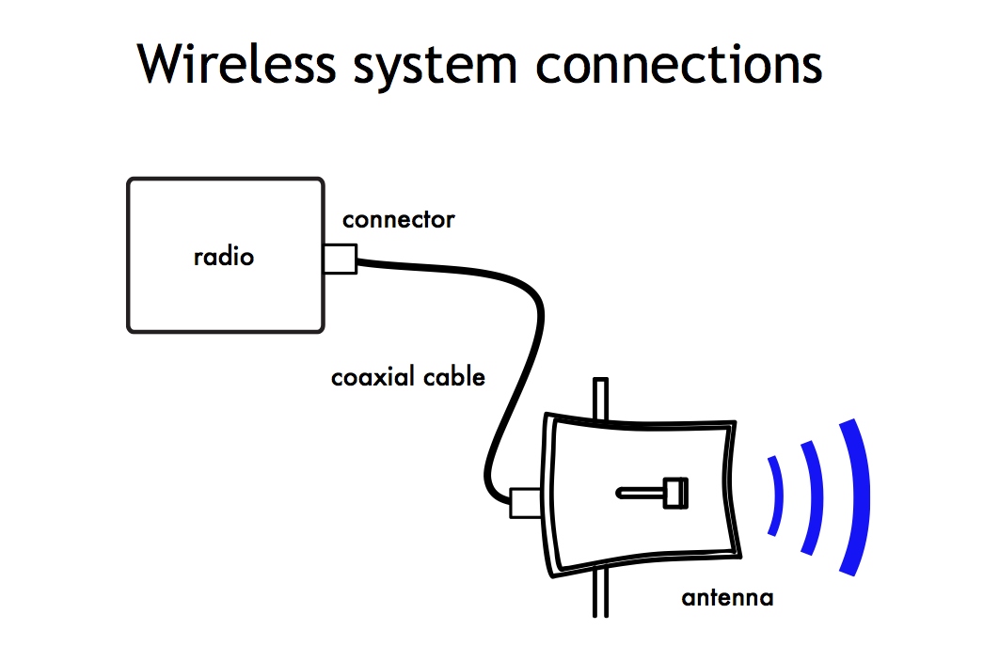

Figure ATL 1: Radio, transmission line and antenna

 

The simplest transmission line one can envisage is the bifilar or twin
lead, consisting of two conductors separated by a dielectric or
insulator. The dielectric can be air or a plastic like the one used for
flat transmission lines used in TV antennas. A bifilar transmission line
open at one end will not radiate because the current in each wire has
the same value but opposite direction, so that the fields created on a
given point at some distance from the line cancel.

 

Figure ATL 2: Bifilar transmission line

 

If we bend the open ends of the transmission line in opposite
directions, the currents will now generate electric fields that are in
phase and reinforce each other and will therefore radiate and propagate
at a distance. We now have an antenna at the end of the transmission
line.

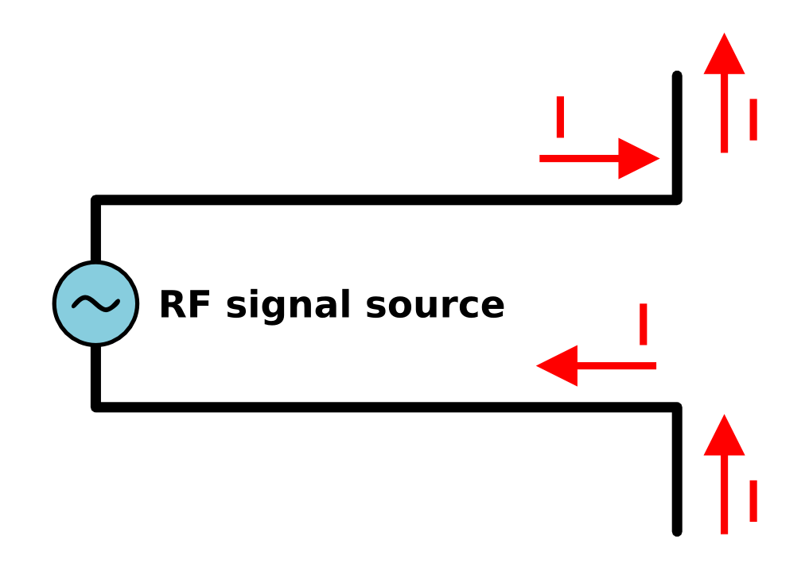

Figure ATL 3: Antenna from transmission line

 

The length of the bent portion of the transmission line will determine
the antenna feature. If this length corresponds to a quarter of a
wavelength we will have a half wave dipole antenna with a gain of 2.15
dBi.

The functioning of the bifilar transmission line just described is
strongly affected by any metal in its proximity, so a better solution is
to confine the electrical fields by means of an external conductor that
shields the internal one. This constitutes a coaxial cable.
Alternatively, a hollow metallic pipe of the proper dimensions will also
effectively carry RF energy in what is known as a waveguide.

### Cables

For frequencies higher than HF the coaxial cables (or coax for short,
derived from the words “of common axis”) are used almost exclusively.
Coax cables have a core conductor wire surrounded by a non-conductive
material called dielectric, or simply insulation.

The dielectric is then surrounded by an encompassing shielding which is
often made of braided wires. The dielectric prevents an electrical
connection between the core and the shielding. Finally, the coax is
protected by an outer casing which is generally made from a PVC
material.

The inner conductor carries the RF signal, and the outer shield prevents
the RF signal from radiating to the atmosphere, and also prevents
outside signals from interfering with the signal carried by the core.
Another interesting fact is that high frequency electrical signal
travels only along the outer layer of a conductor, the inside material
does not contribute to the conduction, hence the larger the central
conductor, the better the signal will flow. This is called the “skin
effect”.

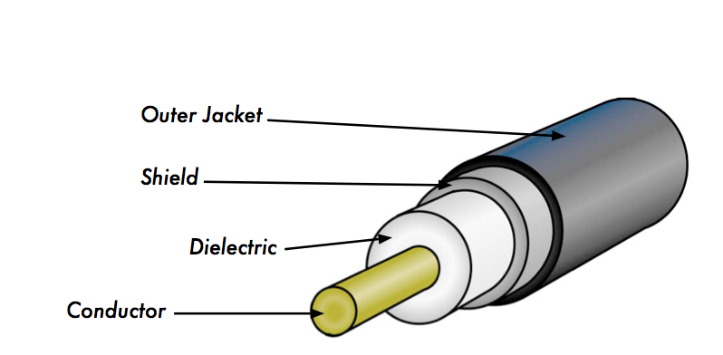

 

Figure ATL 4: Coaxial cable with jacket, shield, dielectric, and core
conductor.

 

Even though the coaxial construction is good at transporting the signal,
there is always resistance to the electrical flow: as the signal travels
along, it will fade away.

This fading is known as attenuation, and for transmission lines it is
measured in decibels per metre (dB/m).

The rate of attenuation is a function of the signal frequency and the
physical construction of the cable itself. As the signal frequency
increases, so does its attenuation.

Obviously, we need to minimise the cable attenuation as much as possible
by keeping the cable very short and using high quality cables.

 

Here are some points to consider when choosing a cable for use with
microwave devices:

 

1.  1.  1.“The shorter the better!” The first rule when you install a
        piece of cable is to try to keep it as short as possible. The
        power loss is not linear, so doubling the cable length means
        that you are going to lose much more than twice the power. In
        the same way, reducing the cable length by half gives you more
        than twice the power at the antenna. The best solution is to
        place the transmitter as close as possible to the antenna, even
        when this means placing it on a tower. 

    2.  2.“The cheaper the worse!” The second golden rule is that any
        money you invest in buying a good quality cable is a bargain.
        Cheap cables can be used at low frequencies, such as VHF.
        Microwaves require the highest quality cables available. 

    3.  3.Avoid RG-58. It is intended for thin Ethernet networking, CB
        or VHF radio, not for microwave. 

    4.  4.Avoid RG-213 or RG-8. They are intended for CB and HF radio.
        In this case even if the diameter is large the attenuation is
        significant due to the cheap insulator used. 

    5.  5.Whenever possible, use the best rated LMR cable or equivalent
        you can find. LMR is a brand of coax cable available in various
        diameters that works well at microwave frequencies. The most
        commonly used are LMR-400 and LMR-600. Heliax cables are also
        very good, but expensive and difficult to use. 

    6.  6.Whenever possible, use cables that are pre-crimped and tested
        in a proper lab. Installing connectors to cable is a tricky
        business, and is difficult to do properly even with the specific
        tools. Never step over a cable, bend it too much, or try to
        unplug a connector by pulling the cable directly. All of these
        behaviours may change the mechanical characteristic of the cable
        and therefore its impedance, short the inner conductor to the
        shield, or even break the line.  

    7.  7.Those problems are difficult to track and recognise and can
        lead to unpredictable behaviour on the radio link. 

    8.  8.For very short distances, a thin cable of good quality maybe
        adequate since it will not introduce too much attenuation. 

 

### Waveguides

Above 2 GHz, the wavelength is short enough to allow practical,
efficient energy transfer by different means. A waveguide is a
conducting tube through which energy is transmitted in the form of
electromagnetic waves. The tube acts as a boundary that confines the
waves in the enclosed space. The Faraday cage phenomenon prevents
electromagnetic effects from being evident outside the guide. The
electromagnetic fields are propagated through the waveguide by means of
reflections against its inner walls, which are considered perfect
conductors. The intensity of the fields is greatest at the center along
the X dimension, and must diminish to zero at the end walls because the
existence of any field parallel to the walls at the surface would cause
an infinite current to flow in a perfect conductor.

The X, Y and Z axis of a rectangular waveguide can be seen in the
following figure:

Figure ATL 5: The X, Y, and Z axis of a rectangular waveguide.

 

There are an infinite number of ways in which the electric and magnetic
fields can arrange themselves in a waveguide for frequencies above the
low cutoff. Each of these field configurations is called a mode. The
modes may be separated into two general groups. One group, designated TM
(Transverse Magnetic), has the magnetic field entirely transverse to the
direction of propagation, but has a component of the electric field in
the direction of propagation. The other type, designated TE (Transverse
Electric) has the electric field entirely transverse, but has a
component of magnetic field in the direction of propagation.

The mode of propagation is identified by the group letters followed by
two subscript numerals. For example, TE 10, TM 11, etc.

The number of possible modes increases with the frequency for a given
size of guide, and there is only one possible mode, called the dominant
mode, for the lowest frequency that can be transmitted. In a rectangular
guide, the critical dimension is X. This dimension must be more than 0.5
λ at the lowest frequency to be transmitted. In practice, the Y
dimension is usually about 0.5 X to avoid the possibility of operation
in other than the dominant mode. Cross-sectional shapes other than the
rectangle can be used, the most important being the circular pipe. Much
the same considerations apply as in the rectangular case. Wavelength
dimensions for rectangular and circular guides are given in the
following table, where X is the width of a rectangular guide and r is
the radius of a circular guide. All figures apply to the dominant mode.

 

Type of guide

Rectangular

Circular

Cutoff wavelength

2X

3.41r

Longest wavelength transmitted with little attenuation

1.6X

3.2r

Shortest wavelength before next mode becomes possible

1.1X

2.8r

 

Energy may be introduced into or extracted from a waveguide by means of
either the electric or magnetic field. The energy transfer typically
happens through a coaxial line. Two possible methods for coupling to a
coaxial line are using the inner conductor of the coaxial line, or
through a loop. A probe which is simply a short extension of the inner
conductor of the coaxial line can be oriented so that it is parallel to
the electric lines of force. A loop can be arranged so that it encloses
some of the magnetic lines of force. The point at which maximum coupling
is obtained depends upon the mode of propagation in the guide or cavity.
Coupling is maximum when the coupling device is in the most intense
field.

If a waveguide is left open at one end, it will radiate energy (that is,
it can be used as an antenna rather than a transmission line).

This radiation can be enhanced by flaring the waveguide to form a
pyramidal horn antenna.

 

There are examples of practical waveguide antennas for WiFi shown in
Appendix A called Antenna Construction.

### Connectors and adapters

Connectors allow a cable to be connected to another cable or to a
component in the RF chain. There are a wide variety of fittings and
connectors designed to go with various sizes and types of coaxial lines.

We will describe some of the most popular ones.

 

BNC connectors were developed in the late 40s. BNC stands for Bayonet
Neill Concelman, named after the men who invented it: Paul Neill and
Carl Concelman.

The BNC product line is a miniature quick connect/disconnect connector.
It features two bayonet lugs on the female connector, and mating is
achieved with only a quarter turn of the coupling nut. BNCs are ideally
suited for cable termination for miniature to subminiature coaxial cable
(RG-58 to RG-179, RG-316, etc.). They are most commonly found on test
equipment and 10base2 coaxial Ethernet cables.

TNC connectors were also invented by Neill and Concelman, and are a
threaded variation of the BNC. Due to the better interconnect provided
by the threaded connector, TNC connectors work well through about 12
GHz. TNC stands for Threaded Neill Concelman.

Type N (again for Neill, although sometimes attributed to “Navy”)
connectors were originally developed during the Second World War. They
are usable up to 18 GHz, and very commonly used for microwave
applications. They are available for almost all types of cable. Both the
plug / cable and plug / socket joints are supposedly waterproof,
providing an effective cable clamp. Nevertheless for outdoor use they
should be wrapped in self agglomerating tape to prevent water from
seeping in.

SMA is an acronym for Sub Miniature version A, and was developed in the
60s. SMA connectors are precision, subminiature units that provide
excellent electrical performance up to 18 GHz. These threaded
high-performance connectors are compact in size and mechanically have
outstanding durability.

The SMB name derives from Sub Miniature B, and it is the second
subminiature design. The SMB is a smaller version of the SMA with
snap-on coupling. It provides broadband capability through 4 GHz with a
snap-on connector design.

MCX connectors were introduced in the 80s.

While the MCX uses identical inner contact and insulator dimensions as
the SMB, the outer diameter of the plug is 30% smaller than the SMB.
This series provides designers with options where weight and physical
space are limited. MCX provides broadband capability though 6 GHz with a
snap-on connector design. In addition to these standard connectors, most
WiFi devices use a variety of proprietary connectors. Often, these are
simply standard microwave connectors with the centre conductor parts
reversed, or the thread cut in the opposite direction. These parts are
often integrated into a microwave system using a short, flexible jumper
called a pigtail that converts the non-standard connector into something
more robust and commonly available.

Some of these connectors include:

RP-TNC. This is a TNC connector with the genders reversed.

U.FL (also known as MHF). This is possibly the smallest microwave
connector currently in wide use. The U.FL/MHF is typically used to
connect a mini-PCI radio card to an antenna or larger connector (such as
an N or TNC) using a thin cable in waht is known as a pigtail.

The MMCX series, which is also called a MicroMate, is one of the
smallest RF connector line and was developed in the 90s. MMCX is a
micro-miniature connector series with a lock-snap mechanism allowing for
360 degrees rotation enabling flexibility.

MC-Card connectors are even smaller and more fragile than MMCX. They
have a split outer connector that breaks easily after just a few
interconnects. Adapters are short, two-sided devices which are used to
join two cables or components which cannot be connected directly. For
example, an adapter can be used to connect an SMA connector to a BNC.

Adapters may also be used to fit together connectors of the same type,
but of different gender.

 

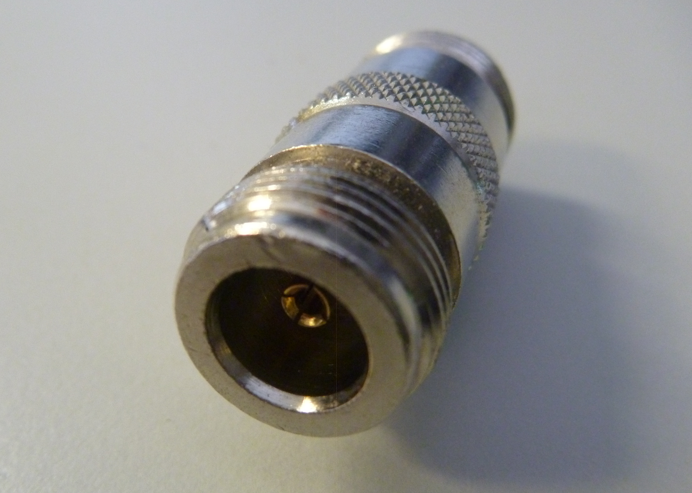

Figure ATL 6: An N female barrel adapter.

 

For example a very useful adapter is the one which enables to join two
Type N connectors, having socket (female) connectors on both sides.

#### Choosing the proper connector

“The gender question.” Most connectors have a well defined gender. Male
connectors have an external housing or sleeve (frequently with an inner
thread) that is meant to surround the body of the female connector. They
normally have a pin that inserts in the corresponding socket of the
female connector, which has a housing threaded on the outer surface or
two bayonet struds protruding from a cylinder. Beware of reverse
polarity connectors, in which the male has an inner socket and the
female an inner pin. Usually cables have male connectors on both ends,
while RF devices (i.e. transmitters and antennas) have female
connectors. Lightning arrestors, directional couplers and line-through
measuring devices may have both male and female connectors. Be sure that
every male connector in your system mates with a female connector.

“Less is best!” Try to minimise the number of connectors and adapters in
the RF chain. Each connector introduces some additional loss (up to a dB
for each connection, depending on the connector!)

“Buy, don’t build!” As mentioned earlier, buy cables that are already
terminated with the connectors you need whenever possible. Soldering
connectors is not an easy task, and to do this job properly is almost
impossible for small connectors as U.FL and MMCX. Even terminating
“Foam” cables is not an easy task. Don’t use BNC for 2.4 GHz or higher.
Use N type connectors (or SMA, SMB, TNC, etc.)

 

Microwave connectors are precision-made parts, and can be easily damaged
by mistreatment. As a general rule, you should rotate the outer sleeve
to tighten the connector, leaving the rest of the connector (and cable)
stationary. If other parts of the connector are twisted while tightening
or loosening, damage can easily occur.

Never step over connectors, or drop connectors on the floor when
disconnecting cables (this happens more often than you may imagine,
especially when working on a mast over a roof).

Never use tools like pliers to tighten connectors. Always use your
hands. When working outside, remember that metals expand at high
temperatures and contract at low temperatures: connector too tight in
the summer can bind or even break in winter.

#### Antennas radiation patterns

Antennas are a very important component of communication systems. By
definition, an antenna is a device used to transform an RF signal
traveling on a transmission line into an electromagnetic wave in free
space. Antennas have a property known as reciprocity, which means that
an antenna will maintain the same characteristics regardless if whether
it is transmitting or receiving. All antennas operate efficiently over a
relatively narrow frequency band. An antenna must be tuned to the same
frequency band of the radio system to which it is connected, otherwise
the reception and the transmission will be impaired. In broadcasting, we
can make do with inefficient receiving antennas, because the
transmitters are very powerful, but in two-way communications we must
have properly sized antennas. When a signal is fed into an antenna, the
antenna will emit radiation distributed in space in a certain way. A
graphical representation of the relative distribution of the radiated
power in space is called a radiation pattern.

### Antenna term glossary

Before we talk about specific antennas, there are a few common terms
that must be defined and explained:

#### Input Impedance

For an efficient transfer of energy, the impedance of the radio,
antenna, and transmission cable connecting them must be the same.
Transceivers and their transmission lines are typically designed for 50
Ω impedance. If the antenna has an impedance different from 50 Ω there
will be a mismatch and reflections will occur unless an impedance
matching circuit is inserted. When any of these components are
mismatched, transmission efficiency suffers.

#### Return loss

Return loss is another way of expressing mismatch. It is a logarithmic
ratio measured in dB that compares the power reflected by the antenna Pr
to the power that is fed into the antenna from the transmission line Pi:

 

Return Loss (in dB) = 10 log10 Pi/Pr

 

While some energy will always be reflected back into the system, a high
return loss will yield unacceptable antenna performance.

The interaction between the wave travelling from the transmitter to the
antenna and the wave reflected by the antenna towards the transmitter
creates what is known as a stationary wave, therefore an alternative way
to measure the impedance mismatch is by means of the Voltage Standing
Wave Ratio (VSWR):

 

Return Loss (in dB) = 20 log10 (VSWR+1 / VSWR-1)

 

In a perfectly matched transmission line, VSWR = 1.

 

In practice, we strive to maintain a VSWR below 2.

#### Bandwidth

The bandwidth of an antenna refers to the range of frequencies FH - FL
over which the antenna can operate correctly. The antenna's bandwidth is

the number of Hz for which the antenna meets certain requirements, like
exhibiting a gain within 3 dB of the maximum gain or a VSWR less than
1.5.

The bandwidth can also be described in terms of percentage of the centre
frequency of the band.

 

Bandwidth = 100 (FH – FL )/FC

 

...where FH is the highest frequency in the band, FL is the lowest
frequency in the band, and FC is the centre frequency in the band.

In this way, bandwidth is constant relative to frequency. If bandwidth
was expressed in absolute units of frequency, it would be different
depending upon the center frequency.

Different types of antennas have different bandwidth limitations.

#### Directivity and Gain

Directivity is the ability of an antenna to focus energy in a particular
direction when transmitting, or to receive energy from a particular
direction when receiving.

If a wireless link uses fixed locations for both ends, it is possible to
use antenna directivity to concentrate the radiation beam in the wanted
direction.

In a mobile application where the transceiver is not fixed, it may be
impossible to predict where the transceiver will be, and so the antenna
should ideally radiate as well as possible in all directions. An
omnidirectional antenna is used in these applications. Gain cannot be
defined in terms of a physical quantity such as the watt or the ohm, but
it is a dimensionless ratio. Gain is given in reference to a standard
antenna.

The two most common reference antennas are the isotropic antenna and the
half-wave dipole antenna.

#### Directivity and Gain

Directivity is the ability of an antenna to focus energy in a particular
direction when transmitting, or to receive energy from a particular
direction when receiving. If a wireless link uses fixed locations for
both ends, it is possible to use antenna directivity to concentrate the
radiation beam in the wanted direction. In a mobile application where
the transceiver is not fixed, it may be impossible to predict where the
transceiver will be, and so the antenna should ideally radiate as well
as possible in all directions. An omnidirectional antenna is used in
these applications. Gain cannot be defined in terms of a physical
quantity such as the watt or the ohm, but it is a dimensionless ratio.
Gain is given in reference to a standard antenna.

The two most common reference antennas are the isotropic antenna and the
half-wave dipole antenna.

The isotropic antenna radiates equally well in all directions. Real
isotropic antennas do not exist, but they provide useful and simple
theoretical antenna patterns with which to compare real antennas. Any
real antenna will radiate more energy in some directions than in others.
Since antennas cannot create energy, the total power radiated is the
same as an isotropic antenna. Any additional energy radiated in the
direction it favours is offset by equally less energy radiated in some
other direction.The gain of an antenna in a given direction is the
amount of energy radiated in that direction compared to the energy an
isotropic antenna would radiate in the same direction when driven with
the same input power. Usually we are only interested in the maximum
gain, which is the gain in the direction in which the antenna is
radiating most of the power, the so called boresight. An antenna gain of
3 dB compared to an isotropic antenna would be written as 3 dBi.

The half-wave dipole can be a useful standard for comparing to other
antennas at one frequency or over a very narrow band of frequencies.

Unlike the isotropic, is very easy to build and sometimes manufacturers
will express the gain with reference to the half-wave dipole instead of
the isotropic. An antenna gain of 3 dB compared to a dipole antenna
would be written as 3 dBd. Since a half-wave dipole has a gain of 2.15
dBi, we can find the dBi gain of any antenna by adding 2.15 to its dBd
gain.

The method of measuring gain by comparing the antenna under test against
a known standard antenna, which has a calibrated gain, is technically
known as a gain transfer technique.

#### Radiation Pattern

The radiation pattern or antenna pattern describes the relative strength
of the radiated field in various directions from the antenna, at a
constant distance. The radiation pattern is a reception pattern as well,
since it also describes the receiving properties of the antenna, as a
consequence of reciprocity. The radiation pattern is three-dimensional,
but usually the published radiation patterns are a two-dimensional slice
of the three-dimensional pattern, in the horizontal and vertical planes.

These pattern measurements are presented in either a rectangular or a
polar format.

The following figure shows a rectangular plot presentation of a typical
ten-element Yagi antenna radiation pattern.

The detail is good but it is difficult to visualize the antenna
behaviour in different directions.

 

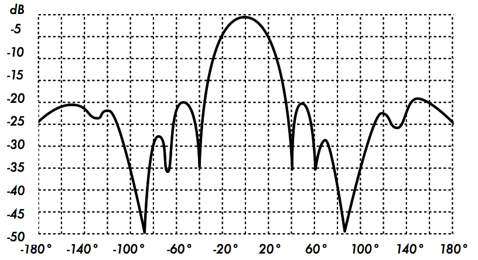

Figure ATL 7: A rectangular plot of the radiation pattern of a Yagi
antenna.

 

Polar coordinate systems are used almost universally.

In the polar-coordinate graph, points are located by projection along a
rotating axis (radius) to an intersection with one of several concentric
circles that represent the correspong gain in dB, referenced to 0 dB at
the outer edge of the plot.

This representation makes it easier to grasp the radial distribution of
the antenna power.

Figure ATL 8 is a polar plot of the same 10 element Yagi antenna.

 

 

Figure ATL 8: The polar radiation pattern plot of the same antenna

 

The field pattern that exists close to the antenna is different from the
one at a distance, which is the one of interest.

The far-field is also called the radiation field.

For radiation pattern measurement it is important to choose a distance
sufficiently large.

The minimum permissible distance depends on the dimensions of the
antenna in relation to the wavelength.

The accepted formula for this distance is:

 

rmin = 2d2 /λ

 

where rmin is the minimum distance from the antenna, d is the largest
dimension of the antenna, and λ is the wavelength.

#### Beamwidth

An antenna's beamwidth is usually understood to mean the half-power
beamwidth. The peak radiation intensity is found, and then the points on
either side of the peak at which the power has reduced by half are
located. The angular distance between the half power points is defined
as the beamwidth. Half the power expressed in decibels is -3 dB, so the
half power beamwidth is sometimes referred to as the 3 dB beamwidth.
Both horizontal and vertical beamwidth are usually considered.

Assuming that most of the radiated power is not divided into sidelobes,
the directive and hence the gain is inversely proportional to the
beamwidth: as the beamwidth decreases, the gain increases. A very high
gain antenna can have a beamwidth of a few degrees and will have to be
pointed very carefully in order not to miss the target. The beamwidth is
defined by the half power points and in turn determines the coverage
area.

Coverage area refers to geographical space “illuminated” by the antenna
and it is roughly defined by the intersection of the beamwidth with the
earth surface. On a base station, it is normally desired to maximise the
coverage area, but sometimes one must resort to “downtilting” the
antenna, either mechanically or electrically, in order to provide
services to customers very close to the base station and therefore below
the beamwidth of a non tilted antenna. This down tilting could be
achieved by mechanically inclining the antenna, but often the beam can
be steered by changing the phase of the signal applied to the different
elements of the antenna in what is known as electrically downtilting.

#### Sidelobes

No antenna is able to radiate all the energy in one preferred direction.
Some is inevitably radiated in other directions. These smaller peaks are
referred to as sidelobes, commonly specified in dB down from the main
lobe. In antenna design, a balance must be struck between gain and
sidelobes.

#### Nulls

In an antenna radiation pattern, a null is a zone in which the effective
radiated power is at a minimum. A null often has a narrow directivity
angle compared to that of the main beam. Thus, the null is useful for
several purposes, such as suppression of interfering signals in a given
direction

#### Polarization

Polarization is defined as the orientation of the electric field of an
electromagnetic wave. The initial polarization of a radio wave is
determined by the antenna. Most antennas are either vertically or
horizontally polarized.

 

 

Figure ATL 9: The electric field is perpendicular to magnetic field,
both of which are perpendicular to the direction of propagation.

 

The polarization of the transmitting and the receiving antenna must
match, or a very big loss will be incurred.

 

Some modern systems take advantage of polarization by sending two
independent signals at the same frequency, separated by the
polarization. Polarization is in general described by an ellipse. Two
special cases of elliptical polarization are linear polarization and
circular polarization.

With linear polarization, the electric field vector stays in the same
plane all the time.

The electric field may leave the antenna in a vertical orientation, a
horizontal orientation, or at some angle between the two.

Vertically polarized radiation is somewhat less affected by reflections
over the transmission path.

Omnidirectional antennas normally have vertical polarization.

Horizontal antennas are less likely to pick up man- made interference,
which ordinarily is vertically polarized.

 

In circular polarization the electric field vector appears to be
rotating with circular motion about the direction of propagation, making
one full turn for each RF cycle. This rotation may be right-hand or
left-hand.

Choice of polarization is one of the design choices available to the RF
system designer.

#### Polarization Mismatch

In order to transfer maximum power between a transmit and a receive
antenna, both antennas must have the same spatial orientation, and the
same polarization sense.

When the antennas are not aligned or do not have the same polarization,
there will be a reduction in power transfer between the two antennas.
This reduction in power transfer will reduce the overall system
efficiency and performance.

When the transmit and receive antennas are both linearly polarized,
physical antenna misalignment will result in a polarization mismatch
loss, which can be determined using the following formula:

 

Loss (dB) = 20 log10(cos θ)

 

...where θ is the difference in the polarization angle between the two
antennas.

For 15° the loss is approximately 0.3 dB, for 30° we lose 1.25 dB, for
45° we lose 3 dB and for 90° we have an infinite loss.

In short, the greater the mismatch in polarization between a
transmitting and receiving antenna, the greater the loss.

 

In the real world, a 90° mismatch in polarization is quite large but not
infinite. Some antennas, such as Yagis or can antennas, can be simply
rotated 90° to match the polarization of the other end of the link.

You can use the polarization effect to your advantage on a
point-to-point link.

Use a monitoring tool to observe interference from adjacent networks,
and rotate one antenna until you see the lowest received signal. Then
bring your link online and orientate the other end to match
polarization.

This technique can sometimes be used to build stable links, even in
noisy radio environments.

Polarization mismatch can be exploited to send two different signals on
the same frequency at the same time, thus doubling the throughput of the
link. Special antennas that have dual feeds can be used for this
purpose. They have two RF connectors that attach to two independent
radios. The real life throughput is somewhat lower than twice the single
antenna throughput because of the inevitable cross polarization
interference.

#### Front-to-back ratio

It is often useful to compare the front-to-back ratio of directional
antennas. This is the ratio of the maximum directivity of an antenna to
its directivity in the opposite direction.

For example, when the radiation pattern is plotted on a relative dB
scale, the front-to-back ratio is the difference in dB between the level
of the maximum radiation in the forward direction and the level of
radiation at 180 degrees from it.

This number is meaningless for an omnidirectional antenna, but it is
quite relevant when building a system with repeaters, in which the
signal sent backward will interfere with the useful signal and must be
minimised.

#### Antenna Aperture

The electrical “aperture” of a receiving antenna is defined as the cross
section of a parabolic antenna that would deliver the same power to a
matched load.

It is easy to see that a parabolic grid has an aperture very similar to
a solid paraboloid.

The aperture of an antenna is proportional to the gain.

By reciprocity, the aperture is the same for a transmitting antenna.

Notice that the concept of aperture is not easily visualised in the case
of a wire antenna in which the physical area is negligible. In this case
the antenna aperture must be derived from the formula of the gain.

### Types of antennas

A classification of antennas can be based on:

#### Frequency and size.

Antennas used for HF are different from antennas used for VHF, which in
turn are different from antennas for microwave. The wavelength is
different at different frequencies, so the antennas must be different in
size to radiate signals at the correct wavelength.

We are particularly interested in antennas working in the microwave
range, especially in the 2.4 GHz and 5 GHz frequencies.

At 2.4 GHz the wavelength is 12.5 cm, while at 5 GHz it is 6 cm.

#### Directivity.

Antennas can be omnidirectional, sectorial or directive. Omnidirectional
antennas radiate roughly the same signal all around the antenna in a
complete 360° pattern.

 

The most popular types of omnidirectional antennas are the dipole and
the ground plane. Sectorial antennas radiate primarily in a specific
area. The beam can be as wide as 180 degrees, or as narrow as 60
degrees.

 

Directional or directive antennas are antennas in which the beamwidth is
much narrower than in sectorial antennas. They have the highest gain and
are therefore used for long distance links.

 

Types of directive antennas are the Yagi, the biquad, the horn, the
helicoidal, the patch antenna, the parabolic dish, and many others.

 

Figure ATL 10: Antenna types

 

Physical construction.

Antennas can be constructed in many different ways, ranging from simple
wires, to parabolic dishes, to coffee cans.

 

When considering antennas suitable for 2.4 GHz WLAN use, another
classification can be used:

 

Application.

Access points tend to make point-to-multipoint networks, while remote
links or backbones are point-to-point. Each of these suggest different
types of antennas for their purpose. Nodes that are used for multipoint
access will likely use omni antennas which radiate equally in all
directions, or several sectorial antennas each focusing into a small
area. In the point-to-point case, antennas are used to connect two
single locations together.

Directive antennas are the primary choice for this application.

A brief list of common type of antennas for the 2.4 GHz frequency is
presented now, with a short description and basic information about
their characteristics.

#### 1/4 wavelength ground plane.

The 1⁄4 wavelength ground plane antenna is very simple in its
construction and is useful for communications when size, cost and ease
of construction are important. This antenna is designed to transmit a
vertically polarized signal. It consists of a 1⁄4 wavelength element as
active element and three or four 1⁄4 wavelength ground elements bent 30
to 45 degrees down. This set of elements, called radials, is known as a
ground plane.

 

 

Figure ATL 11: Quarter wavelength ground plane antenna.

 

This is a simple and effective antenna that can capture a signal equally
from all directions. The gain of this antenna is in the order of 2 - 4
dBi.

#### Yagi-Uda antenna

A basic Yagi or more properly Yagi-Uda antenna consists of a certain
number of straight elements, each measuring approximately half
wavelength. The driven or active element of a Yagi is the equivalent of
a centre-fed, half-wave dipole antenna.

 

Parallel to the driven element, and approximately 0.2 to 0.5 wavelength
on either side of it, are straight rods or wires called reflectors and
directors, or simply passive elements.

A reflector is placed behind the driven element and is slightly longer
than half wavelength; directors are placed in front of the driven
element and are slightly shorter than half wavelength. A typical Yagi
has one reflector and one or more directors.

The antenna propagates electromagnetic field energy in the direction
running from the driven element toward the directors, and is most
sensitive to incoming electromagnetic field energy in this same
direction. The more directors a Yagi has, the greater the gain.

Following is the photo of a Yagi antenna with 5 directors and one
reflector. Yagi antennas are often enclosed in a cylindrical radome to
afford protection from the weather.

 

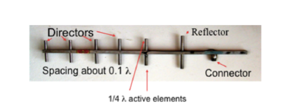

 

Figure ATL 12: Yagi-Uda

 

Yagi antennas are used primarily for Point-to-Point links, have a gain
from 10 to 20 dBi and a horizontal beamwidth of 10 to 20 degrees.

#### Horn

The horn antenna derives its name from the characteristic flared
appearance.

The flared portion can be square, rectangular, cylindrical or conical.

The direction of maximum radiation corresponds with the axis of the
horn.

It is easily fed with a waveguide, but can be fed with a coaxial cable
and a proper transition.

While it is cumbersome to make a horn antenna at home, a cylindrical can
with proper dimensions will have similar characteristics.

 

 

Figure ATL 13: Feed horn made from a food can.

 

Horn antennas are commonly used as the active element in a dish antenna.
The horn is pointed toward the centre of the dish reflector.

The use of a horn, rather than a dipole antenna or any other type of
antenna, at the focal point of the dish minimizes loss of energy around
the edges of the dish reflector.

 

At 2.4 GHz, a simple horn antenna made with a tin can has a gain in the
order of 10 dBi.

#### Parabolic Dish

Antennas based on parabolic reflectors are the most common type of
directive antennas when a high gain is required.

The main advantage is that they can be made to have gain and directivity
as large as required. The main disadvantage is that big dishes are
difficult to mount and are likely to have a large wind load.

Randomes can be used to reduce the wind load or windage, as well as for
weather protection.

 

 

Figure ATL 14: A solid dish antenna.

 

Dishes up to one metre are usually made from solid material.

Aluminum is frequently used for its weight advantage, its durability and
good electrical characteristics.

Windage increases rapidly with dish size and soon becomes a severe
problem. Dishes which have a reflecting surface that uses an open mesh
are frequently used.

These have a poorer front-to-back ratio, but are safer to use and easier
to build.

Copper, aluminum, brass, galvanized steel and steel are suitable mesh
materials.

#### BiQuad

The BiQuad antenna is simple to build and offers good directivity and
gain for Point-to-Point communications. It consists of a two squares of
the same size of 1⁄4 wavelength as a radiating element and of a metallic
plate or grid as reflector. This antenna has a beamwidth of about 70
degrees and a gain in the order of 10-12 dBi. It can be used as
stand-alone antenna or as feeder for a Parabolic Dish.

The polarization is such that looking at the antenna from the front, if
the squares are placed side by side the polarization is vertical.

 

 

Figure ATL 15: The BiQuad.

#### Log Periodic Antennas

Log periodic antennas have moderate gain over a wide frequency band,
They are often used in spectrum analysers for testing purposes and are
also popular as TV receiving antennas since they can efficiently cover
from channel 2 up to channel 14. These antennas are used in White space
devices that require the ability to work in widely different channels.

 

 

Figure ATL 16: Log periodic antenna

#### Other Antennas

Many other types of antennas exist and new ones are created following
advances in technology.

 

Sector or Sectorial antennas: they are widely used in cellular telephony
infrastructure and are usually built adding a reflective plate to one or
more phased dipoles.

Their horizontal beamwidth can be as wide as 180 degrees, or as narrow
as 60 degrees, while the vertical is usually much narrower.

Composite antennas can be built with many Sectors to cover a wider
horizontal range (multisectorial antenna).

Panel or Patch antennas: they are solid flat panels used for indoor
coverage, with a gain up to 23 dBi.

### Reflector theory

The basic property of a perfect parabolic reflector is that it converts
a spherical wave irradiating from a point source placed at the focus
into a plane wave. Conversely, all the energy received by the dish from
a distant source is reflected to a single point at the focus of the
dish. The position of the focus, or focal length, is given by:

 

f = D2 /16 c

 

...where D is the dish diameter and c is the depth of the parabola at
its centre.

 

The size of the dish is the most important factor since it determines
the maximum gain that can be achieved at the given frequency and the
resulting beamwidth. The gain and beamwidth obtained are given by:

 

                      Gain = ((3.14 D)2 / λ2) η

 

Beamwidth = 70 λ / D

 

...where D is the dish diameter and η is the efficiency. The efficiency
is determined mainly by the effectiveness of illumination of the dish by
the feed, but also by other factors. Each time the diameter of a dish is
doubled, the gain is four times or 6 dB greater. If both stations double
the size of their dishes, signal strength can be increased by 12 dB, a
very substantial gain. An efficiency of 50% can be assumed when hand-
building antennas.

 

The ratio f / D (focal length/diameter of the dish) is the fundamental
factor governing the design of the feed for a dish. The ratio is
directly related to the beamwidth of the feed necessary to illuminate
the dish effectively. Two dishes of the same diameter but different
focal lengths require different design of feed if both are to be
illuminated efficiently. The value of 0.25 corresponds to the common
focal-plane dish in which the focus is in the same plane as the rim of
the dish.

The optimum illumination of a dish is a compromise between maximising
the gain and minimising the sidelobes.

### Amplifiers

As mentioned earlier, antennas do not actually create power. They simply
direct all available power into a particular pattern. By using a power
amplifier, you can use DC power to augment your available signal. An
amplifier connects between the radio transmitter and the antenna, and
has an additional cable that connects to a power source.

Amplifiers are available that work at 2.4 GHz, and can add several Watts
of power to your transmission. These devices sense when an attached
radio is transmitting, and quickly power up and amplify the signal. They
then switch off again when transmission ends. When receiving, they also
add amplification to the signal before sending it to the radio.

Unfortunately, simply adding amplifiers will not magically solve all of
your networking problems.

We do not discuss power amplifiers at length in this book because there
are a number of significant drawbacks to using them:

 

-   •They are expensive. Amplifiers must work at relatively wide
    bandwidths at 2.4 GHz, and must switch quickly enough to work for
    Wi- Fi applications. 

-   •They provide no additional directionality. High gain antennas not
    only improve the available amount of signal, but tend to reject
    noise from other directions. Amplifiers blindly amplify both desired
    and interfering signals, and can make interference problems worse.  

-   •Amplifiers generate noise for other users of the band. By
    increasing your output power, you are creating a louder source of
    noise for other users of the unlicensed band. Conversely, adding
    antenna gain will improve your link and can actually decrease the
    noise level for your neighbours. 

-   •Using amplifiers is often illegal. Every country imposes power
    limits on use of unlicensed spectrum. Adding an antenna to a highly
    amplified signal will likely cause the link to exceed legal limits. 

 

Antennas cost far less than amps, and can improve a link simply by
changing the antenna on one end.

 

Using more sensitive radios and good quality cable also helps
significantly on long distance wireless links.

These techniques are unlikely to cause problems for other users of the
band, and so we recommend pursuing them before adding amplifiers.

Many manufacturers offer high power versions of their WiFi radios at
both 2 and 5 GHz, which have a built in amplifiers.

These are better than external amplifiers, but do not assume that it is
always smart to use the high power version, for many application the
standard power coupled with a high gain antenna is actually better.

### Practical antenna designs

The cost of 2.4 GHz antennas has fallen dramatically with the increased
popularity of WiFi. Innovative designs use simpler parts and fewer
materials to achieve impressive gain with relatively little machining.
Unfortunately, availability of good antennas is still limited in some
areas of the world, and importing them can be expensive.

While actually designing an antenna can be a complex and error-prone
process, constructing antennas from locally available components is very
straightforward, and can be a lot of fun.

 

In Appendix A called Antenna Construction we present some practical
antenna designs that can be built for very little money.

### Antenna measurements

Precise antenna instruments require expensive instruments and
installations. It is therefore advisable to obtain the antenna
parameters values directly from a reputable manufacturer.

An anechoic chamber is needed to perform accurate antenna measurements,
otherwise the reflections will cause false readings.

 

Ice affects the performance of all antennas to some degree and the
problem gets more serious at higher frequencies. The impedance of free
space is 377 ohms. If the air immediately surrounding the dipole
elements is replaced by ice which has a lower impedance than air, then
the impedance match and radiation patterns of the antenna will change.

 

These changes become progressively worse as the ice loading increases.

 

Antenna elements are usually encased in a plastic protective housing
(radome). This provides an air space between the elements and ice casing
so that the lower impedance of the ice layer has only a small effect on
the radiators.

 

Detuning is greatly reduced but radiation pattern distortion may still
be encountered (detuning reduces usable antenna bandwidth). For a given
ice thickness, deviation from nominal performance values become worse as
frequency increases.

In areas where severe icing and wet snow are common, it is prudent to
install a full radome over solid parabolic antennas, to use panel
antennas instead of corner reflectors, and to stay away from grid
parabolics.

 

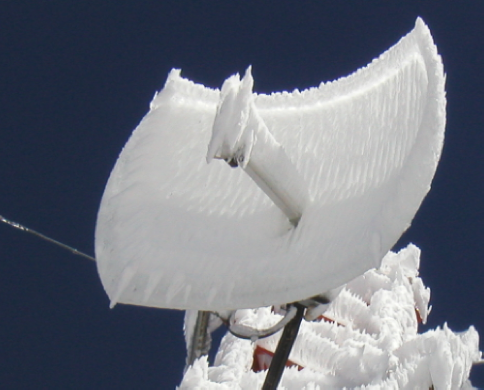

 

Figure ATL 17: Effect of ice on a parabolic grid antenna

 

 

2NETWORKING
===========

6. NETWORKING
-------------

 

Before purchasing equipment or deciding on a hardware platform, you
should have a clear idea of the nature of your communications problem.
Most likely, you are reading this book because you need to connect
computer networks together in order to share resources and ultimately
reach the larger global Internet.

The network design you choose to implement should fit the communications
problem you are trying to solve.

 

Do you need to connect a remote site to an Internet connection in the
centre of your campus? Will your network likely grow to include several
remote sites? Will most of your network components be installed in fixed
locations, or will your network expand to include hundreds of roaming
laptops and other devices?

 

In this chapter, we will review the networking concepts that define
TCP/IP, the primary family of networking protocols currently used on the
Internet.

We will also look at the hardware options that are likely to form the
underlying physical layer of your TCP/IP network and end with some
examples of wireless configurations. This will prepare you very well for
the chapter called Deployment Planning later in this book.

 

TCP/IP refers to the suite of protocols that allow conversations to
happen on the global Internet.

By understanding TCP/IP, you can build networks that will scale to
virtually any size, and will ultimately become part of the global
Internet.

 

This edition of the book now includes an introduction to IPv6 which is
the new numbering system of the Internet.

As it is very likely you will be deploying networks using IPv6, it is
highly recommended you become familiar with how this works and also how
it can work alongside the older IPv4 networks that will continue to
operate on the Internet for some while yet.

### Introduction

Venice, Italy is a fantastic city to get lost in. The roads are mere
foot paths that cross water in hundreds of places, and never go in a
simple straight line. Postal carriers in Venice are some of the most
highly trained in the world, specialising in delivery to only one or two
of the six sestieri (districts) of Venice. This is necessary due to the
intricate layout of that ancient city. Many people find that knowing the
location of the water and the sun is far more useful than trying to find
a street name on a map.

 

Imagine a tourist who happens to find papier-mâché mask as a souvenir,
and wants to have it shipped from the studio in S. Polo, Venezia to
their home in London, United Kingdom. This may sound like an ordinary
(or even trivial) task, but let's look at what actually happens.

 

 

Figure NG 1: Another kind of network mask.

 

The artist first packs the mask into a shipping box and addresses it to
the home of the tourist.

 

They then hand this to a postal employee in Venice, who attaches some
official forms and sends it to a central package processing hub for
international destinations.

 

After several days, the package clears Italian customs and finds its way
onto a flight to the UK, arriving at a central import processing depot
at Heathrow airport. Once it clears through customs, the package is sent
to a distribution point in the city of London, then on to the local
district postal processing centre of Camden where the tourist lives.

The package eventually makes its way onto a delivery van which has a
route that brings it to the correct house on the correct street in
Camden. A member of the family accepts and signs for the package from
the delivery van driver and then leaves it in the home studio of the
tourist who enjoys unpacking it some time later.

 

The sorting clerk at the office in Camden neither knows nor cares about
how to get to the sestiere of S. Polo, Venezia.

His job is simply to accept packages as they arrive, and deliver them to
the correct person in Camden.

Similarly, the postal employee in Venice has no need to worry about how
to get to the correct address in London. His job is to accept packages
from his local neighborhood and forward them to the next closest hub in
the delivery chain.

 

This is very similar to how Internet routing works. A message is split
up into many individual packets, and are labelled with their source and
destination.

The computer then sends these packets to a router, which decides where
to send them next.

 

The router needs only to keep track of a handful of routes (for example,
how to get to the local network, the best route to a few other local
networks, and one route to a gateway to the rest of the Internet). This
list of possible routes is called the routing table.

As packets arrive at the router, the destination address is examined and
compared against its internal routing table.

If the router has no explicit route to the destination in question, it
sends the packet to the closest match it can find, which is often its
own Internet gateway (via the default route).

And the next router does the same, and so forth, until the packet
eventually arrives at its destination.

Packages can only make their way through the international postal system
because we have established a standardised addressing scheme for
packages.

For example, the destination address must be written legibly on the
front of the package, and include all critical information (such as the
recipient's name, street address, city, country, and postal code).
Without this information, packages are either returned to the sender or
are lost in the system. Packets can only flow through the global
Internet because we have agreed on a common addressing scheme and
protocol for forwarding packets.

These standard communication protocols make it possible to exchange
information on a global scale.

 

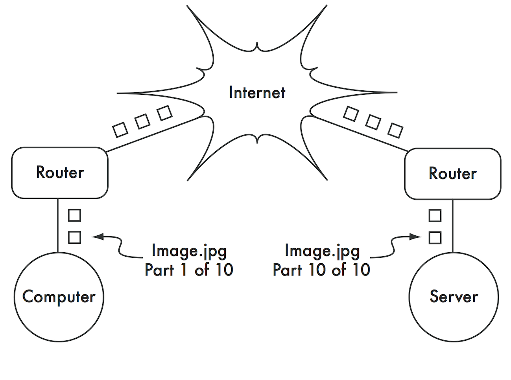

Figure NG 2: Internet networking. Packets are forwarded between routers
until they reach their ultimate destination.

 

### Cooperative communications

Communication is only possible when the participants speak a common
language. But once the communication becomes more complex than a simple
conversation between two people, protocol becomes just as important as
language.

All of the people in an auditorium may speak English, but without a set
of rules in place to establish who has the right to use the microphone,
the communication of an individual’s ideas to the entire room is nearly
impossible. Now imagine an auditorium as big as the world, full of all
of the computers that exist.

Without a common set of communication protocols to regulate when and how
each computer can speak, the Internet would be a chaotic mess where
every machine tries to speak at once. People have developed a number of
communications frameworks to address this problem. The most well-known
of these is the OSI model.

### The OSI model

The international standard for Open Systems Interconnection (OSI) is
defined by the document ISO/IEC 7498-1, as outlined by the International
Standards Organization and the International Electrotechnical
Commission. The full standard is available as publication "ISO/IEC
7498-1:1994," available from
[http://standards.iso.org/ittf/PubliclyAvailableStandards/.](http://standards.iso.org/ittf/PubliclyAvailableStandards/)

The OSI model divides network traffic into a number of layers. Each
layer is independent of the layers around it, and each builds on the
services provided by the layer below while providing new services to the
layer above. The abstraction between layers makes it easy to design
elaborate and highly reliable protocol stacks, such as the ubiquitous
TCP/IP stack. A protocol stack is an actual implementation of a layered
communications framework. The OSI model doesn't define the protocols to
be used in a particular network, but simply delegates each
communications "job" to a single layer within a well-defined hierarchy.

While the ISO/IEC 7498-1 specification details how layers should
interact with each other, it leaves the actual implementation details up
to the manufacturer. Each layer can be implemented in hardware (more
common for lower layers) or software.

As long as the interface between layers adheres to the standard,
implementers are free to use whatever means are available to build their
protocol stack.

 

This means that any given layer from manufacturer A can operate with the
same layer from manufacturer B (assuming the relevant specifications are
implemented and interpreted correctly).

Here is a brief outline of the seven-layer OSI networking model:

 

Layer

Name

Description

7

Application

The Application Layer is the layer that most network users are exposed
to; it is the level at which human communication happens. HTTP, FTP, and
SMTP are all application layer protocols.

The human sits above this layer, interacting with the application.

6

Presentation

The Presentation Layer deals with data representation, before it reaches
the application. This would include HTML, MIME encoding, data
compression, formatting checks, byte ordering, etc.

5

Session

The Session Layer manages the logical communications session between
applications. RPC is an example of a layer five protocol.

4

Transport

The Transport Layer provides a method of reaching a particular service
on a given network node. Examples of protocols that operate at this
layer are TCP, UDP and SCTP. Some protocols at the transport layer (such
as TCP) ensure that all of the data has arrived at the destination, and
is reassembled and delivered to the next layer in the proper order. UDP
is a "connectionless" protocol commonly used for video and audio
streaming and doesnt check arrival of data packets.

3

Network

IP (the Internet Protocol) is the most common Network Layer protocol.
This is the layer where routing occurs. Packets can leave the link local
network and be retransmitted on other networks. Routers perform this
function on a network by having at least two network interfaces, one on
each of the networks to be interconnected. Nodes on the Internet are
reached by their globally unique IP address. Another critical Network
Layer protocol is ICMP, which is a special protocol which provides
various management messages needed for correct operation of IP. This
layer is also sometimes referred to as the Internet Layer.

2

Data Link

Whenever two or more nodes share the same physical medium (for example,
several computers plugged into a hub, or a room full of wireless devices
all using the same radio channel) they use the Data Link Layer to
communicate. Common examples of data link protocols are Ethernet, Token
Ring, ATM, and the wireless networking protocols (IEEE 802.11A/B/G).
Communication on this layer is said to be link-local, since all nodes
connected at this layer communicate with each other directly. This layer
is sometimes known as the Media Access Control (MAC) layer. On Ethernet
networks, nodes are referred to by their MAC address. This is a unique
48-bit number assigned to every networking device when it is
manufactured.

1

Physical

The Physical Layer is the lowest layer in the OSI model, and refers to
the actual physical medium over which communicationstake place. This can
be a copper CAT5 cable, a fibre optic bundle, radio waves, or just about
any other medium capable of transmitting signals. Cut wires, broken
fibre, and RF interference are all physical layer problems.

 

The layers in this model are numbered one through seven, with seven at
the top. This is meant to reinforce the idea that each layer builds
upon, and depends upon, the layers below. Imagine the OSI model as a
building, with the foundation at layer one, the next layers as
successive floors, and the roof at layer seven. If you remove any single
layer, the building will not stand. Similarly, if the fourth floor is on
fire, then nobody can pass through it in either direction.

 

The first three layers (Physical, Data Link, and Network) all happen "on
the network." That is, activity at these layers is determined by the
configuration of cables, switches, routers, and similar devices. A
network switch can only distribute packets by using MAC addresses, so it
need only implement layers one and two. A simple router can route
packets using only their IP addresses, so it needs to implement only
layers one through three. A web server or a laptop computer runs
applications, so it must implement all seven layers. Some advanced
routers may implement layer four and above, to allow them to make
decisions based on the higher-level information content in a packet,
such as the name of a website, or the attachments of an email.

 

The OSI model is internationally recognised, and is widely regarded as
the complete and definitive network model. It provides a framework for
manufacturers and network protocol implementers that can be used to
build networking devices which interoperate in just about any part of
the world. From the perspective of a network engineer or troubleshooter,
the OSI model can seem needlessly complex. In particular, people who
build and troubleshoot TCP/IP networks rarely need to deal with problems
at the Session or Presentation layers. For the majority of Internet
network implementations, the OSI model can be simplified into a smaller
collection of five layers.

### The TCP/IP model

Unlike the OSI model, the TCP/IP model is not an international standard
and its definitions vary. Nevertheless, it is often used as a pragmatic
model for understanding and troubleshooting Internet networks.

The vast majority of the Internet uses TCP/IP, and so we can make some
assumptions about networks that make them easier to understand.

 

The TCP/IP model of networking describes the following five layers:

 

Layer

Name

5

Application

4

Transport

3

Internet

2

Data Link

1

Physical

 

In terms of the OSI model, layers five through seven are rolled into the
topmost layer (the Application layer). The first four layers in both
models are identical.

Many network engineers think of everything above layer four as "just
data" that varies from application to application.

Since the first three layers are interoperable between virtually all
manufacturers' equipment, and layer four works between all hosts using
TCP/IP, and everything above layer four tends to apply to specific
applications, this simplified model works well when building and
troubleshooting TCP/IP networks.

 

We will use the TCP/IP model when discussing networks in this book.

 

The TCP/IP model can be compared to a person delivering a letter to a
city office building.

The person first needs to interact with the road itself (the Physical
layer), pay attention to other traffic on the road (the Data Link
layer), turn at the correct junction to join another road and arrive at
the correct address (the Internet layer), go to the correct floor and
room number (the Transport layer), and finally give it to a receptionist
who can take the letter from there (the Application layer).

 

Once they have delivered the message to the receptionist, the delivery
person is free to go on their way. The five layers can be easily
remembered by using the mnemonic “Please Don’t Look In The Attic,” which
of course stands for “Physical / Data Link / Internet / Transport /
Application.”

 

### The Internet Protocols

TCP/IP is the protocol stack most commonly used on the global Internet.
The acronym stands for Transmission Control Protocol (TCP) and Internet
Protocol (IP), but actually refers to a whole family of related
communications protocols. TCP/IP is also called the Internet protocol
suite, and it operates at layers three and four of the TCP/IP model.

In this discussion, we will focus on version six of the IP protocol
(IPv6) as since 2012 this is the version to deploy in parallel with the
previous version four (IPv4). In 2012, about half of the Internet
content is available with a better user experience by using IPv6.

The previous version is explained in this chapter too because some old
content or old applications (Skype in 2012) still require IPv4. And
indeed many networks that you might have to interconnect to will still
have the legacy IPv4 technology deployed for some years to come.

 

Besides the length of the address, IPv4 and IPv6 are quite similar: they
are connectionless network protocols running on the same data-link layer
(WiFi, Ethernet...) and serving the same transport protocols (TCP, SCTP,
UDP...) In this book, when IP is written without any version, then it
means that it applies to both versions. A dual-stack network is a
network that runs IPv6 and IPv4 and the same time. It is expected that
dual-networks will be the norm at least until 2020 when IPv6-only will
become the norm.

#### IPv6 Addressing

The IPv6 address is a 128-bit number usually written as multiple
hexadecimal numbers. In order to make this address human-readable, it is
written in chunks of 32 bits or 4 hexadecimal numbers separated by a
colon ':'. The hexadecimal number should be written in lowercase but can
also be written in uppercase. An example of an IPv6 address is:

 

2001:0db8:1234:babe:0000:0000:0000:0001

 

This address corresponds to:

 

2001

0db8

1234

babe

0

0

0

1

 

As these addresses are quite long, it is common to remove the leading 0
in each chunk, so, the same address can also be written as:

 

2001:db8:1234:babe:0:0:0:1

 

This address can further be simplified by grouping one block of
consecutive chunks of '0' into the abbreviated form of '::', the same
address becomes then:

 

2001:db8:1234:babe::1

 

There are some specific IPv6 addresses:

 

-   •::1 (or 0000:00000:0000:0000:0000:0000:0000:0001) represents the
    loopback address, this is the node itself when the node wants to
    send packets to itself; 

-   •:: (all zero) is the undetermined address, to be used by a node
    when it does not know its global address, for instance when it
    boots. 

#### IPv6 Prefixes

IPv6 nodes on the same link or network share the same IPv6 prefix, which
is defined as the most-significant part of the IPv6 address. The prefix
length is usually 64 bit on a LAN. So, our usual address of
2001:db8:babe::1 can be written as 2001:db8:1234:babe::1/64 (the prefix
length is added at the end of the address after a '/'). Defining a
prefix length on an address actually splits the address in two parts:
the prefix itself and the interface identifier (IID).

 

2001

0DB8

1234

babe

0

0

0

0

Prefix

  Interface Identifier

 

On a LAN or WLAN, the prefix length must be 64 bits else some protocols
will not work correctly. All nodes on the same LAN or WLAN usually share
the same prefix but their IID must be unique to avoid confusion.

The analogy with a postal address in big cities is that the street name
is the prefix and the house number is the IID.

The prefix length can be different on links that are neither LAN or
WLAN. The network itself is identified by the prefix without any IID but
with the prefix length, for example: 2001:db8:1234:babe::/64

#### IPv4 Addressing

In an IPv4 network, the address is a 32-bit number, normally written as
four 8-bit numbers expressed in decimal form and separated by periods.
Examples of IPv4 addresses are 10.0.17.1, 192.168.1.1, or 172.16.5.23.

 

If you enumerated every possible IPv4 address, they would range from
0.0.0.0 to 255.255.255.255.

This yields a total of more than four billion possible IPv4 addresses
(255 x 255 x 255 x 255 = 4,228,250,625); although many of these are
reserved for special purposes and should not be assigned to hosts.

 

Some IPv4 addresses that are special:

 

-   •127.0.0.1 represents the loopback address (similar to ::1 for
    IPv6); 

-   •0.0.0.0        represents the unspecified address (similar to ::
    for IPv6). 

#### IPv4 Subnets

By applying a subnet mask (also called a network mask, or simply netmask
or even prefix) to an IPv4 address, you can logically define both a host
and the network to which it belongs.

 

Traditionally, subnet masks are expressed using dotted decimal form,
much like an IPv4 address. For example, 255.255.255.0 is one common
netmask. You will find this notation used when configuring network
interfaces, creating routes, etc. However, subnet masks are more
succinctly expressed using CIDR notation, which simply enumerates the
number of bits in the mask after a forward slash (/).

Thus, 255.255.255.0 can be simplified as /24. CIDR is short for
Classless Inter-Domain Routing, and is defined in RFC1518. A subnet mask
determines the size of a given network. Using a /24 netmask, 8 bits are
reserved for hosts (32 bits total - 24 bits of netmask = 8 bits for
hosts). This yields up to 256 possible host addresses (28 = 256). By
convention, the first value is taken as the network address (.0 or
00000000), and the last value is taken as the broadcast address (.255 or
11111111).

This leaves 254 addresses available for hosts on this network.

Subnet masks work by applying AND logic to the 32 bit IPv4 number.

In binary notation, the "1" bits in the mask indicate the network
address portion, and "0" bits indicate the host address portion. A
logical AND is performed by comparing two bits. The result is "1" if
both of the bits being compared are also "1". Otherwise the result is
"0".

Here are all of the possible outcomes of a binary AND comparison between
two bits.

 

Bit 1

Bit 2

Result

0

0

0

0

1

0

1

0

0

1

1

1

 

To understand how a netmask is applied to an IPv4 address, first convert
everything to binary. The netmask 255.255.255.0 in binary contains
twenty-four "1" bits:

255 255 255 0

11111111.11111111.11111111.00000000

When this netmask is combined with the IPv4 address 10.10.10.10, we can
apply a logical AND to each of the bits to determine the network
address.

10.10.10.10: 00001010.00001010.00001010.00001010

255.255.255.0: 11111111.11111111.11111111.00000000

--------------------------------------------------------------------------------------

10.10.10.0: 00001010.00001010.00001010.00000000

This results in the network 10.10.10.0/24.

This network consists of the hosts 10.10.10.1 through 10.10.10.254, with
10.10.10.0 as the network address and 10.10.10.255 as the broadcast
address.

Subnet masks are not limited to entire octets. One can also specify
subnet masks like 255.254.0.0 (or /15 CIDR). This is a large block,
containing 131,072 addresses, from 10.0.0.0 to 10.1.255.255.

It could be further subdivided, for example into 512 subnets of 256
addresses each. The first one would be 10.0.0.0-10.0.0.255, then
10.0.1.0-10.0.1.255, and so on up to 10.1.255.0-10.1.255.255.
Alternatively, it could be subdivided into 2 blocks of 65,536 addresses,
or 8192 blocks of 16 addresses, or in many other ways. It could even be
subdivided into a mixture of different block sizes, as long as none of
them overlap, and each is a valid subnet whose size is a power of two.

While many netmasks are possible, common netmasks include:

 

CIDR

Decimal

\# of Hosts

/30

255.255.255.252

4

/29

255.255.255.248

8

/28

255.255.255.240

16

/27

255.255.255.224

32

/26

255.255.255.192

64

/25

255.255.255.128

128

/24

255.255.255.0

256

/16

255.255.0.0

65 536

/8

255.0.0.0

16 777 216

 

 

With each reduction in the CIDR value the IPv4 space is doubled.
Remember that two IPv4 addresses within each network are always reserved
for the network and broadcast addresses.

 

There are three common netmasks that have special names. A /8 network
(with a netmask of 255.0.0.0) defines a Class A network. A /16
(255.255.0.0) is a Class B, and a /24 (255.255.255.0) is called a Class
C.

These names were around long before CIDR notation, but are still often
used for historical reasons.

In many ways as you can already see IPv6 is easier to plan for than
IPv4.

#### Global IP Addresses

Interconnected networks must agree on an IP addressing plan for IPv6 and
IPv4 addresses.

 

IP addresses must be unique and generally cannot be used in different
places on the Internet at the same time; otherwise, routers would not
know how best to route packets to them.

 

 

Figure NG 3: With unique IP addresses, ambiguous global routing is
impossible. If the PC requests a web page from 2001:db8:1::2, it will
reach the correct server.

 

In order to keep IP addresses unique and globally routable, they are
allocated by a central numbering authority that provides a consistent
and coherent numbering method. This ensures that duplicate addresses are
not used by different networks.

The authority assigns large blocks of consecutive addresses to smaller
authorities, who in turn assign smaller consecutive blocks within these
ranges to other authorities, or to their customers. The groups of
addresses are called subnets or prefixes as we have already mentioned.

A group of related addresses is referred to as an address space.

Both IPv4 and IPv6 addresses are administered by the Internet Assigned
Numbers Authority (IANA, [http://www.iana.org/](http://www.iana.org/)).

IANA has divided these address spaces into large subnets, and these
subnets are delegated to one of the five regional Internet registries
(RIRs), who have been given authority over large geographic areas.

 

IP addresses are assigned and distributed by Regional Internet
Registrars (RIRs) to ISPs. The ISP then allocates smaller IP blocks to
their clients as required. Virtually all Internet users obtain their IP
addresses from an ISP.

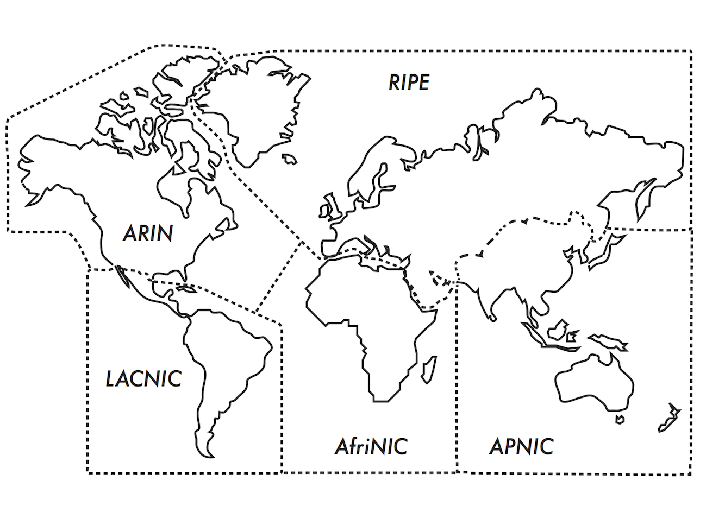

Figure NG 4: Authority for Internet IP address assignments is delegated
to the five Regional Internet Registrars.

 

The five RIRs are:

 

1.  1)African Network Information Centre  

    (AfriNIC, [http://www.afrinic.net](http://www.afrinic.net/)) 

2.  2)Asia Pacific Network Information Centre 

    (APNIC, [http://www.apnic.net](http://www.apnic.net/))  

3.  3)American Registry for Internet Numbers 

    (ARIN, [http://www.arin.net](http://www.arin.net/)) 

4.  4)Regional Latin-American and Caribbean IP Address Registry (LACNIC,
    [http://www.lacnic.net](http://www.lacnic.net/)) 

5.  5)Réseaux IP Européens  

    (RIPE NCC, [http://www.ripe.net](http://www.ripe.net/)) 

     

Your ISP will assign globally routable IP address space to you from the
pool allocated to it by your RIR.

 

The registry system assures that IP addresses are not reused in any part
of the network anywhere in the world.

Once IP address assignments have been agreed upon, it is possible to
pass packets between networks and participate in the global Internet.

The process of moving packets between networks is called routing.

#### Static IP Addresses

A static IP address is an address assignment that never changes.

Static IP addresses are important because servers using these addresses
may have DNS mappings pointing towards them, and typically serve
information to other machines (such as email services, web servers,
etc.).

Blocks of static IP addresses may be assigned by your ISP, either by
request or automatically depending on your means of connection to the
Internet.

#### Dynamic IP Addresses

Dynamic IP addresses are assigned by an ISP for non-permanent nodes
connecting to the Internet, such as a home computer which is on a
dial-up connection or a laptop connecting to a wireless hotspot.

Dynamic IP addresses can be assigned automatically using the Dynamic
Host Configuration Protocol (DHCP), or the Point-to-Point Protocol
(PPP), depending on the type of Internet connection.

 

A node using DHCP first requests an IP address assignment from the
network, and automatically configures its network interface. IP
addresses can be assigned randomly from a pool by your ISP, or might be
assigned according to a policy. IP addresses assigned by DHCP are valid
for a specified time (called the lease time).

 

The node must renew the DHCP lease before the lease time expires. Upon
renewal, the node may receive the same IP address or a different one
from the pool of available addresses.

 

While DHCP works for IPv6 and IPv4, IPv6 has another primary mechanism
which is more commonly used for address assignment - it is called
Stateless Address Auto-Configuration (SLAAC) which is the default on
routers and hosts running IPv6.

 

It does not require a DHCP server; the router sends periodically Router
Advertisement (RA) messages on all connected (W)LAN's which contain the
64-bit prefix to be used on that (W)LAN; hosts then generate their
64-bit interface identifier (usually a random number or a number based
on their MAC address – see further) and build their 128-bit address by
concatenating the 64-bit prefix from the RA and the newly created 64-bit
IID.

 

Dynamic addresses are popular with Internet Service Providers, because
it enables them to use fewer IP addresses than their total number of
customers.

They only need an address for each customer who is active at any one
time.

Globally routable IP addresses cost money, and there is now a shortage
of IPv4 addresses.

Assigning addresses dynamically allows ISPs to save money, and they will
often charge extra to provide a static IP address to their customers.

#### Private IPv4 addresses

Around 2000, it became clear that there would not be enough IPv4
addresses for everyone; this is the reason that IPv6 was specified and
developed.

But there was also a temporary trick as most private networks do not
require the allocation of globally routable, public IPv4 addresses for
every computer in the organisation.

In particular, computers which are not public servers do not need to be
addressable from the public Internet.

Organisations typically use IPv4 addresses from the private address
space for machines on the internal network.

 

There are currently three blocks of private address space reserved by
IANA: 10.0.0.0/8, 172.16.0.0/12, and 192.168.0.0/16.

 

These are defined in RFC1918.

These addresses are not intended to be routed on the Internet, and are
typically unique only within an organisation or group of organisations
that choose to follow the same numbering scheme.

 

 

This means that several distinct organisations can use the same
addresses as long as they never interconnect their networks directly.

 

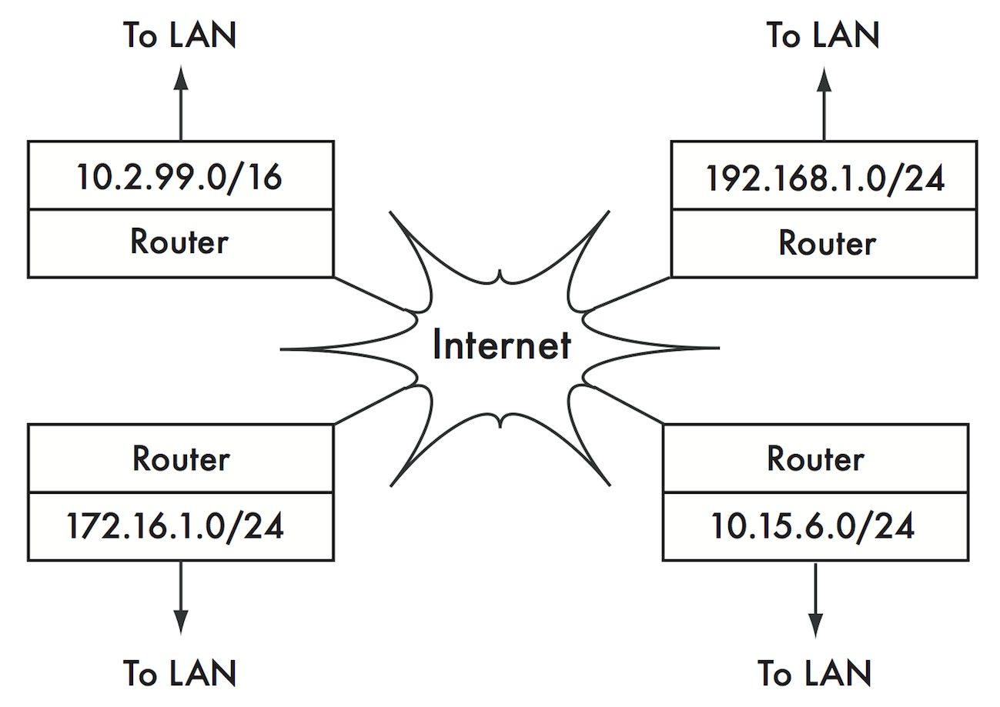

 

Figure NG 5: RFC1918 private addresses may be used within an
organisation, and are not routed on the global Internet.

 

If you ever intend to link together private networks that use RFC1918
address space, be sure to use unique addresses throughout all of the
networks.

 

For example, you might break the 10.0.0.0/8 address space into multiple
Class B networks (10.1.0.0/16, 10.2.0.0/16, etc.).

One block could be assigned to each network according to its physical
location (the campus main branch, field office one, field office two,
dormitories, and so forth).

 

The network administrators at each location can then break the network
down further into multiple Class C networks (10.1.1.0/24, 10.1.2.0/24,
etc.) or into blocks of any other logical size.

 

 

In the future, should the networks ever be linked (either by a physical
connection, wireless link, or VPN), then all of the machines will be
reachable from any point in the network without having to renumber
network devices.

 

Some Internet providers may allocate private addresses like these
instead of public addresses to their customers, although this has
serious disadvantages.

 

Since these addresses cannot be routed over the Internet, computers
which use them are not really "part" of the Internet, and are not
directly reachable from it. In order to allow them to communicate with
the Internet, their private addresses must be translated to public
addresses.

 

This translation process is known as Network Address Translation (NAT),
and is normally performed at the gateway between the private network and
the Internet.

 

We will look at NAT in more detail later on in this chapter.

As there are huge numbers of IPv6 addresses, there is no need for
private IPv6 addresses, although there are Unique Local Addresses (ULA)
that are suitable for non connected networks such as labs.

 

#### Discovering Neighbours

Imagine a network with three hosts: HA, HB, and HC. They use the
corresponding IP addresses A, B and C.

These hosts are part of the same subnet/prefix.

 

For two hosts to communicate on a local network, they must determine
each others' MAC addresses. It is possible to manually configure each
host with a mapping table from IP address to MAC address, but it is
easier to dynamically discover the neighbour's MAC address through
Neighbor Discovery Protocol (NDP) in IPv6 and Address Resolution
Protocol (ARP) in IPv4. NDP and ARP work in a very similar way.

 

 

 

 

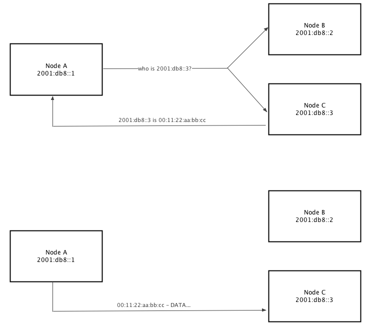

 

Figure NG 6: IPv6 node A, 2001:db8::1 needs to send data to 2001:db8::3
in the same network (2001:db8::/64 prefix). But it must first ask for
the MAC address that corresponds to 2001:db8::3.

 

When using NDP, node A multicasts to some hosts the question,

"Who has the MAC address for the IPv6 2001:db8::3?"

 

When node C sees a Neighbor Solicitation (NS) for an IPv6 address of its
own, it replies with its MAC address with a Neighbor Advertisement (NA)
message.

 

 

 

 

 

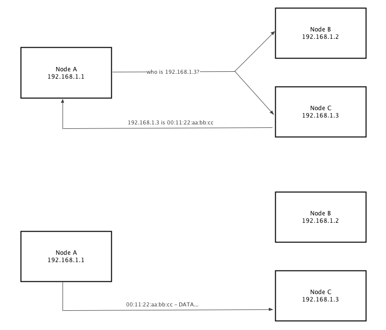

 

Figure NG 7: IPv4 node A, 192.168.1.1, needs to send data to 192.168.1.3
in the same subnet (192.168.1.0/24). But it must first ask the whole
network for the MAC address that corresponds to 192.168.1.3.

 

When using ARP, node A broadcasts to all hosts the question,

"Who has the MAC address for the IPv4 192.168.1.3?"

When node C sees an ARP request for its own IPv4 address, it replies
with its MAC address. Node B will also see the ARP request but will not
reply as 192.168.1.3 is not an address of it. This is very similar to
NDP for IPv6 except that an IPv4 node has only a single IPv4 address.

Also ARP broadcasts the request, this means that it is received by all
IPv4 nodes in the network causing more host CPU utilisation than IPv6
NDP which only multicasts to some hosts.

 

#### IP Routing to non-Neighbours

 

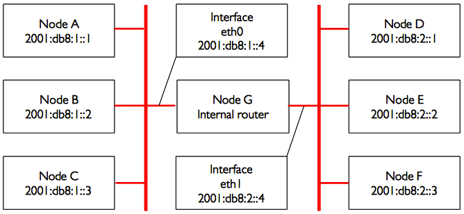

 

Figure NG 8: Two separate IPv6 networks.

 

Consider now another network with 3 nodes, D, E, and F, with the
corresponding IPv6 addresses 2001:db8:2::1, 2001:db8:2::2, and
2001:db8:2::3.

This is another /64 network, but it is not in the same range as the
network on the left hand side.

All three hosts can reach each other directly (first using NDP to
resolve the IPv6 address into a MAC address, and then sending packets to
that MAC address).

Now we will add node G. This node has two network cards (also called
interfaces), with one plugged into each network. The first network card
uses the IPv6 address 2001:db8:1::4, on interface eth0 and the other,
eth1, uses 2001:db8:2::4.

Node G is now link-local to both networks, and can forward packets
between them: node G can route packets between the two networks, it is
therefore called a router or sometimes a gateway.

But what if hosts A, B, and C want to reach hosts D, E, and F? They need
to know that they should use node G and so they will need to add a route
to the other network via host G. For example, hosts A-C would add a
static route via 2001:db8:1::4.

In Linux, this can be accomplished with the following command:

 

\# ip -6 route add 2001:db8:2::/64 via 2001:db8:1::4

 

...and hosts D-F would add the following:

\# ip -6 route add 2001:db8:1::/64 via 2001:db8:2::4

 

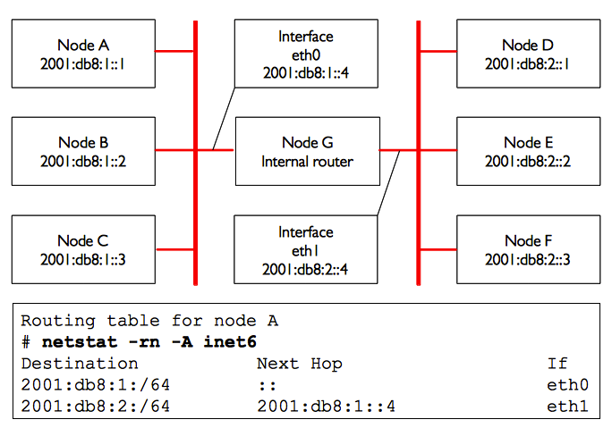

 

Figure NG 9: Node G acts as a router between the two networks, other
hosts use static routes.

 

The result for node A is shown in Figure NG 9.

 

Notice that the route is added via the IPv6 address on host G that is
link-local to the respective network.

 

Host A could not add a route via 2001:db8:2::4, even though it is the
same physical machine as 2001:db8:1::4 (node G), since that IPv6 is not
link-local.

The address of the next hop can be entered either as a global address
(2001:db8:2::4) or as a link-local address (fe80::...); it is usually
easier to configure a static route with a global address.

 

In IPv6, the router G also sends a solicitation and periodically router
advertisements that contain its own link-local address, hence, all nodes
using stateless auto-configuration or DHCP automatically add a default
route via the router link-local address as shown in Figure NG 10.

 

 

 

 

 

Figure NG 10: Node G acts as a router between the two networks, hosts
use stateless address autoconfiguration.

 

This is a very simple routing example, where the destination is only a
single hop away from the source. As networks get more complex, many hops
may need to be traversed to reach the ultimate destination. Since it
isn't practical for every machine on the Internet to know the route to
every other, we make use of a routing entry known as the default route
(also known as the default gateway).

 

When a router receives a packet destined for a network for which it has
no explicit route, the packet is forwarded to its default gateway.

The default gateway is typically the best route out of your network,
usually in the direction of your ISP.

 

An example of a router that uses a default gateway is shown in Figure NG
11. Figure NG 11 shows the routing table (which is the set of all
routes) on the internal router G which includes the two directly
connected networks 2001:db8:1::/64 and 2001:db8:2::/64 as well as a
route to all other hosts on the Internet ::/0.

 

 

A node always uses the most specific route; that is the route with the
longest match to the destination, in Figure NG 11 eth0 will be used for
destination 2001:db8:1::1 (match length /64) rather than the less
specific ::/0 (match length of 0).

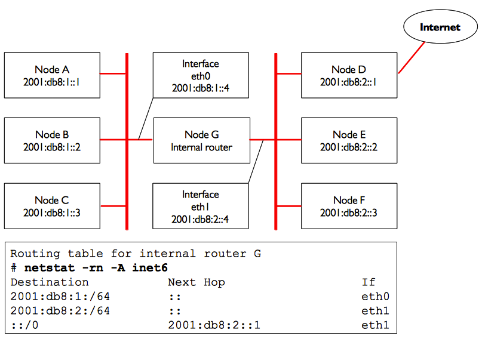

 

Figure NG 11: Node G is the internal router and uses the Internet
router.

 

A route tells the OS that the desired network doesn't lie on the
immediate link-local network, and it must forward the traffic through
the specified router.

 

If host A wants to send a packet to host F, it would first send it to
node G. Node G would then look up host F in its routing table, and see
that it has a direct connection to host F's network.

Finally, host G would resolve the hardware (MAC) address of host F and
forward the packet to it.

 

Routes can be updated manually, or can dynamically react to network
outages and other events.

Some examples of popular dynamic routing protocols are RIP, OSPF, BGP.

 

 

Configuring dynamic routing is beyond the scope of this book, but for
further reading on the subject, see the resources in Appendix F.

IPv4 behaves exactly the same way as depicted in figure NG 12.

 

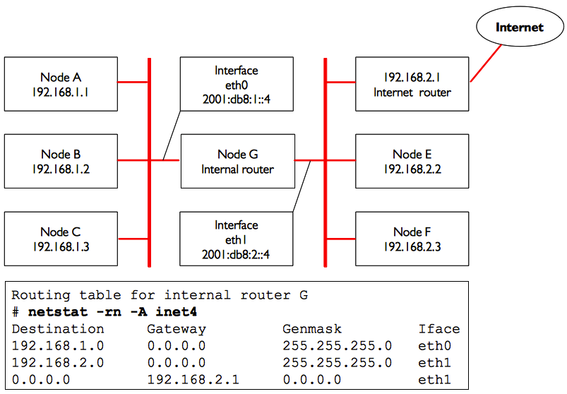

Figure NG 12: Node G is the Internet router on this IPv4 network.

 

As noted before, most networks and the Internet are dual-stack and all
hosts and routers have both IPv4 and IPv6 addresses, this also means
that the nodes will have routes for IPv4 and routes for IPv6. For
instance, the set of all routes on node G of the previous figures will
be:

 

\# netstat -rn -A inet6

 Destination           Next Hop     If

 2001:db8:1:/64         ::        eth0

 2001:db8:2:/64                ::          eth1

 ::/0                        2001:db8:2::1         eth1

 

\# netstat -rn -A inet4

Destination Gateway  Genmask  Iface

 192.168.1.0 0.0.0.0        255.255.255.0           eth0

 192.168.2.0 0.0.0.0       255.255.255.0           eth1

 0.0.0.0    192.168.2.1 0.0.0.0          eth1

#### Network Address Translation (NAT) for IPv4

In order to reach hosts on the Internet, private addresses must be
converted to global, publicly routable IPv4 addresses.

This is achieved using a technique known as Network Address Translation,
or NAT.

A NAT device is a router that manipulates the addresses of packets
instead of simply forwarding them.

On a NAT router, the Internet connection uses one (or more) globally
routed IPv4 addresses, while the private network uses an IPv4 address
from the RFC1918 private address range.

The NAT router allows the global address(es) to be shared with all of
the inside users, who all use private addresses.

It converts the packets from one form of addressing to the other as the
packets pass through it. As far as the network users can tell, they are
directly connected to the Internet and require no special software or
drivers.

They simply use the NAT router as their default gateway, and address
packets as they normally would.

The NAT router translates outbound packets to use the global IPv4
address as they leave the network, and translates them back again as
they are received from the Internet.

 

The major consequence of using NAT is that machines from the Internet
cannot easily reach servers within the organisation without setting up
explicit forwarding rules on the router.

 

Connections initiated from within the private address space generally
have no trouble, although some applications (such as Voice over IPv4 and
some VPN software) can have difficulty dealing with NAT.

 

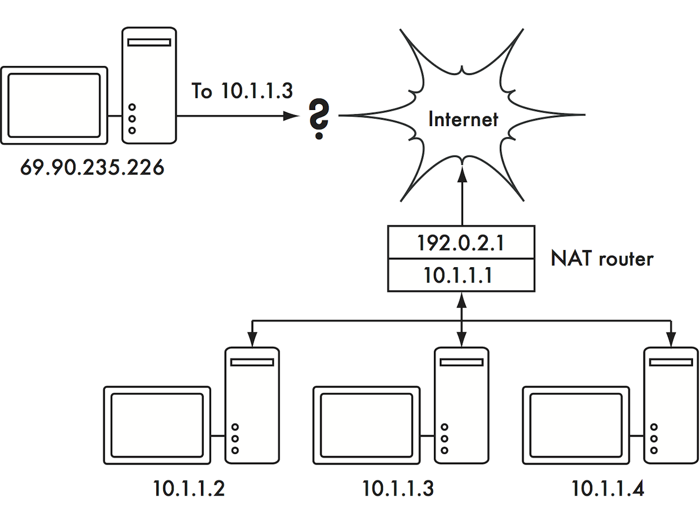

 

Figure NG 13: Network Address Translation allows you to share a single
IPv4 address with many internal hosts, but can make it difficult for
some services to work properly.

 

Depending on your point of view, this can be considered a bug (since it
makes it harder to set up two-way communication) or a feature. RFC1918
addresses should be filtered on the edge of your network to prevent
accidental or malicious RFC1918 traffic entering or leaving your
network.

 

While NAT performs some firewall-like functions, it is not a replacement
for a real firewall as most of the attacks happen now when an internal
user visits some web sites with hostile content (called malware for
malevolent software).

### Internet Protocol Suite

Machines on the Internet use the Internet Protocol (IP) to reach each
other, even when separated by many intermediary machines.

There are a number of protocols that are run in conjunction with IP that
provide features which are as critical to normal operations as IP
itself. Every packet specifies a protocol number that identifies the
packet as one of these protocols.

The most commonly used protocols are the Transmission Control Protocol
(TCP, number 6), User Datagram Protocol (UDP, number 17), and the
Internet Control Message Protocol (ICMP, number 1 for IPv4 and number 58
for IPv6). Taken as a group, these protocols (and others) are known as
the Internet Protocol Suite, or simply TCP/IP for short.

 

The TCP and UDP protocols introduce the concept of port numbers. Port
numbers allow multiple services to be run on the same IP address, and
still be distinguished from each other. Every packet has a source and
destination port number. Some port numbers are well-defined standards,
used to reach well-known services such as email and web servers. For
example, web servers normally listen on TCP port 80 for insecure traffic
and on TCP port 443 for encrypted/secure traffic, NTP time servers
listen on UDP port 123, DNS domain name servers listen on UDP port 53,
and SMTP email servers listen on TCP port 25.

 

When we say that a service "listens" on a port (such as port 80), we
mean that it will accept packets that use its IP as the destination IP
address, and 80 as the destination port.

 

Servers usually do not care about the source IP or source port, although
sometimes they will use them to establish the identity of the other
side.

When sending a response to such packets, the server will use its own IP
as the source IP, and 80 as the source port.

When a client connects to a service, it may use any source port number
on its side that is not already in use, but it must connect to the
proper port on the server (e.g. 80 for web, 25 for email).

 

TCP is a session-oriented protocol with guaranteed and ordered delivery
and transmission control features (such as detection and mitigation of
network congestion, retries, packet reordering and reassembly, etc.).

 

UDP is designed for connectionless streams of information, and does not
guarantee delivery at all, or in any particular order but can be faster
so it is often used for real-time protocols such as for timing, voice or
video.

 

The ICMP protocol is designed for debugging and maintenance on the
Internet.

Rather than port numbers, it has message types, which are also numbers.
Different message types are used to request a simple response from
another computer (echo request), notify the sender of another packet of
a possible routing loop (time exceeded), or inform the sender that a
packet that could not be delivered due to firewall rules or other
problems (destination unreachable).

By now you should have a solid understanding of how computers on the
network are addressed, and how information flows on the network between
them.

 

Now let's take a brief look at the physical hardware that implements
these network protocols.

### Physical hardware

#### Ethernet

Ethernet is the name of the most popular standard for connecting
together computers on a Local Area Network (LAN). It is sometimes used
to connect individual computers to the Internet, via a router, ADSL
modem, or wireless device.

However, if you connect a single computer to the Internet, you may not
use Ethernet at all.

The name comes from the physical concept of the ether, the medium which
was once supposed to carry light waves through free space. The official
standard is called IEEE 802.3.

 

One widely deployed Ethernet standard is called 100baseT also known as
Fast Ethernet.

This defines a data rate of 100 Megabits per second (hence the 100),
running over twisted (hence the T) pair wires, with modular RJ-45
connectors on the end.

 

The network topology is a star, with switches or hubs at the centre of
each star, and end nodes (devices and additional switches) at the edges.
Servers are also connected using Gigabit Ethernet with a rate of 1
Gigabit per second.

Increasingly Gigabit Ethernet is replacing Fast Ethernet in many
networks these days as demand for high volume video and other high data
rate applications become more prevalent.

#### Medium Access Control (MAC) addresses

Every device connected to an Ethernet or WiFi network has a unique MAC
address, assigned by the manufacturer of the network card. It serves as
a unique identifier that enables devices to talk to each other. However,
the scope of a MAC address is limited to a broadcast domain, which is
defined as all the computers connected together by wires, hubs,
switches, and bridges, but not crossing routers or Internet gateways.

MAC addresses are never used directly on the Internet, and are not
transmitted across routers.

MAC addresses for Ethernet and IEEE 802.11 WiFi networks are 48 bits
long and look like this - 00:1c:c0:17:78:8c or 40:6c:8f:52:59:41; for
the latter MAC address, the first 24 bits 40:6c:8f indicates that Apple
assigned this address.

#### Hubs

Ethernet hubs connect multiple twisted-pair Ethernet devices together.
They work at the physical layer (the lowest or first layer).

They repeat the signals received by each port out to all of the other
ports.

Hubs can therefore be considered to be simple repeaters.

Due to this design, only one port can successfully transmit at a time.
If two devices transmit at the same time, they corrupt each other's
transmissions, and both must back off and retransmit their packets
later. This is known as a collision, and each host remains responsible
for detecting and avoiding collisions before transmitting, and
retransmitting its own packets when needed.

 

When problems such as excessive collisions are detected on a port, some
hubs can disconnect (partition) that port for a while to limit its
impact on the rest of the network.

 

While a port is partitioned, devices attached to it cannot communicate
with the rest of the network.

 

Hubs are limited in their usefulness, since they can easily become
points of congestion on busy networks so they are no longer normally
deployed in networks nowadays. Its only important to note that a WiFi
access point acts as a hub on the radio side.

#### Switches

A switch is a device which operates much like a hub, but provides a
dedicated (or switched) connection between ports.

Rather than repeating all traffic on every port, the switch determines
which ports are communicating directly and temporarily connects them
together. There can be several such temporary port connections at the
same time.

Switches generally provide much better performance than hubs, especially
on busy networks with many computers. They are not much more expensive
than hubs, and are replacing them in most situations.

Switches work at the data link layer (the second layer), since they
interpret and act upon the MAC address in the packets they receive. When
a packet arrives at a port on a switch, it makes a note of the source
MAC address, which it associates with that port. It stores this
information in an internal MAC table often known as Content Addressable
Memory (CAM) table. The switch then looks up the destination MAC address
in its MAC table, and transmits the packet only on the matching port. If
the destination MAC address is not found in the MAC table, the packet is
then sent to all of the connected interfaces hoping to reach the right
MAC.

#### Hubs vs. Switches

Hubs are considered to be fairly unsophisticated devices, since they
inefficiently rebroadcast all traffic on every port. This simplicity
introduces both a performance penalty and a security issue. Overall
performance is slower, since the available bandwidth must be shared
between all ports. Since all traffic is seen by all ports, any host on
the network can easily monitor all of the network traffic.

Switches create temporary virtual connections between receiving and
transmitting ports. This yields better performance because many virtual
connections can be made simultaneously. More expensive switches can
switch traffic by inspecting packets at higher levels (at the transport
or application layer), allowing the creation of VLANs, and implementing
other advanced features.

 

A hub can be used when repetition of traffic on all ports is desirable;
for example, when you want to explicitly allow a monitoring machine to
see all of the traffic on the network. Most switches provide monitor
port functionality that enables repeating on an assigned port
specifically for this purpose.

Hubs were once cheaper than switches. However, the price of switches has
reduced dramatically over the years. Therefore, old network hubs should
be replaced whenever possible with new switches.

 

 

Figure NG 14: A hub simply repeats all traffic on every port, while a
switch makes a temporary, dedicated connection between the ports that
need to communicate.

 

Both hubs and switches may offer managed services.

Some of these services include the ability to set the link speed
(10baseT, 100baseT, 1000baseT, full or half-duplex) per port, enable
triggers to watch for network events (such as changes in MAC address or
malformed packets), and usually include port counters for easy bandwidth
accounting.

 

A managed switch that provides upload and download byte counts for every
physical port can greatly simplify network monitoring.

These services are typically available via SNMP, or they may be accessed
via telnet, ssh, a web interface, or a custom configuration tool.

#### Routers and Firewalls

While hubs and switches provide connectivity on a local network segment,
a router's job is to forward packets between different network segments.

A router typically has two or more physical network interfaces.

It may include support for different types of network media, such as
Ethernet, WiFi, optical fibre, DSL, or dial-up.

Routers can be dedicated hardware devices or they can be made from a
standard PC with multiple network cards and appropriate software.

Routers sit at the edge of two or more networks. By definition, they
have one connection to each network, and as border machines they may
take on other responsibilities as well as routing. Many routers have
firewall capabilities that provide a mechanism to filter or redirect
packets that do not fit security or access policy requirements.

They may also provide Network Address Translation (NAT) services for
IPv4.

 

Routers vary widely in cost and capabilities.

The lowest cost and least flexible are simple, dedicated hardware
devices, often with NAT functionality, used to share an Internet
connection between a few computers; well known brands include Linksys,
D-Link, Netgear.

 

The next step up is a software router, which consists of an operating
system running on a standard PC with multiple network interfaces.
Standard operating systems such as Microsoft Windows, Linux, and BSD are
all capable of routing, and are much more flexible than the low-cost
hardware devices; it is often called Internet Connection Sharing.

 

However, they suffer from the same problems as conventional PCs, with
high power consumption, a large number of complex and potentially
unreliable parts, and more involved configuration.

 

The most expensive devices are high-end dedicated hardware routers, made
by companies like Cisco and Juniper.

They tend to have much better performance, more features, and higher
reliability than software routers on PCs.

It is also possible to purchase technical support and maintenance
contracts for them.

 

Most modern routers offer mechanisms to monitor and record performance
remotely, usually via the Simple Network Management Protocol (SNMP),
although the least expensive devices often omit this feature.

#### Other equipment

Figure NG 15: Many DSL modems, cable modems, wireless access points, and
VSAT terminals terminate at an Ethernet jack.

 

Each physical network has an associated piece of terminal equipment. For
example, VSAT connections consist of a satellite dish connected to a
terminal that either plugs into a card inside a PC, or ends at a
standard Ethernet connection. DSL lines use a DSL modem that bridges the
telephone line to a local device, either an Ethernet network or a single
computer via USB. Cable modems bridge the television cable to Ethernet,
or to an internal PC card bus.

 

Standard dialup lines use modems to connect a computer to the telephone,
usually via a plug-in card or serial port. And there are many different
kinds of wireless networking equipment that connect to a variety of
radios and antennas, but nearly always end at an Ethernet jack. The
functionality of these devices can vary significantly between
manufacturers. Some provide mechanisms for monitoring performance, while
others may not.

Since your Internet connection ultimately comes from your ISP, you
should follow their recommendations when choosing equipment that bridges
their network to your Ethernet network.

### Putting it all together

 

Figure NG 16: Internet networking. Each network segment has a router
with two IP addresses, making it “link local” to two different networks.
Packets are forwarded between routers until they reach their ultimate
destination.

 

Once all network nodes have an IP address, they can send data packets to
the IP address of any other node. Through the use of routing and
forwarding, these packets can reach nodes on networks that are not
physically connected to the originating node. This process describes
much of what “happens” on the Internet.

 

In this example, you can see the path that the packets take as Alice
chats with Bob using an instant messaging service.

Each dotted line represents an Ethernet cable, a wireless link, or any
other kind of physical network.

The cloud symbol is commonly used to stand in for “The Internet”, and
represents any number of intervening IP networks.

Neither Alice nor Bob need to be concerned with how those networks
operate, as long as the routers forward IP traffic towards the ultimate
destination.

If it weren’t for Internet protocols and the cooperation of everyone on
the net, this kind of communication would be impossible.

 

In Figure NG 16, Alice is dual-stack and has IPv4 and IPv6 addresses,
and as Bob has only IPv6 addresses, they will communicate by using IPv6
which is the common IP version between them.

### Designing the physical network

It may seem odd to talk about the “physical” network when building
wireless networks.

After all, where is the physical part of the network? In wireless
networks, the physical medium we use for communication is obviously
electromagnetic energy.

But in the context of this chapter, the physical network refers to the
mundane topic of where to put things. How do you arrange the equipment
so that you can reach your wireless clients?

Whether they fill an office building or stretch across many miles,
wireless networks are naturally arranged in these three logical
configurations: point-to-point links, point-to-multipoint links, and
multipoint-to-multipoint clouds. While different parts of your network
can take advantage of all three of these configurations, any individual
link will fall into one of these topologies.

#### Point-to-point

Point-to-point links typically provide an Internet connection where such
access isn’t otherwise available. One side of a point-to-point link will
have an Internet connection, while the other uses the link to reach the
Internet.

 

For example, a university may have a fast frame relay or VSAT connection
in the middle of campus, but cannot afford such a connection for an
important building just off campus. If the main building has an
unobstructed view of the remote site, a point-to-point connection can be
used to link the two together. This can augment or even replace existing
dial-up links. With proper antennas and clear line of sight, reliable
point-to-point links in excess of thirty kilometres are possible.

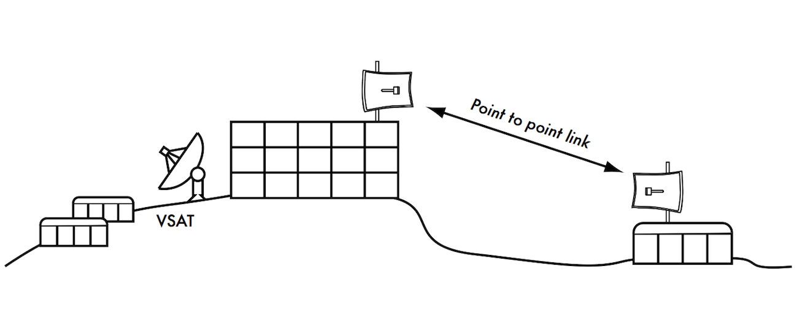

 

Figure NG 17: A point-to-point link allows a remote site to share a
central Internet connection.

 

Of course, once a single point-to-point connection has been made, more
can be used to extend the network even further. If the remote building
in our example is at the top of a tall hill, it may be able to see other
important locations that can’t be seen directly from the central campus.
By installing another point-to-point link at the remote site, another
node can join the network and make use of the central Internet
connection.

Point-to-point links don’t necessarily have to involve Internet access.
Suppose you have to physically drive to a remote weather monitoring
station, high in the hills, in order to collect the data which it
records over time. You could connect the site with a point-to-point
link, allowing data collection and monitoring to happen in realtime,
without the need to actually travel to the site.

Wireless networks can provide enough bandwidth to carry large amounts of
data (including audio and video) between any two points that have a
connection to each other, even if there is no direct connection to the
Internet.

#### Point-to-multipoint

The next most commonly encountered network layout is
point-to-multipoint. Whenever several nodes are talking to a central
point of access, this is a point-to-multipoint application. The typical
example of a point-to-multipoint layout is the use of a wireless access
point that provides a connection to several laptops. The laptops do not
communicate with each other directly, but must be in range of the access
point in order to use the network.

 

Figure NG 18: The central VSAT is now shared by multiple remote sites.
All three sites can also communicate directly at speeds much faster than
VSAT.

 

Point-to-multipoint networking can also apply to our earlier example at
the university. Suppose the remote building on top of the hill is
connected to the central campus with a point-to-point link.

Rather than setting up several point-to-point links to distribute the
Internet connection, a single antenna could be used that is visible from
several remote buildings. This is a classic example of a wide area point
(remote site on the hill) to multipoint (many buildings in the valley
below) connection.

 

Note that there are a number of performance issues with using
point-to-multipoint over very long distance, which will be addressed in
the chapter called Deployment Planning. Such links are possible and
useful in many circumstances, but don’t make the classic mistake of
installing a single high powered radio tower in the middle of town and
expecting to be able to serve thousands of clients, as you would with an
FM radio station. As we will see, two-way data networks behave very
differently than broadcast radio.

#### Multipoint-to-multipoint

The third type of network layout is multipoint-to-multipoint, which is
also referred to as an ad-hoc or mesh network. In a multipoint-to-
multipoint network, there is no central authority. Every node on the
network carries the traffic of every other as needed, and all nodes
communicate with each other directly.

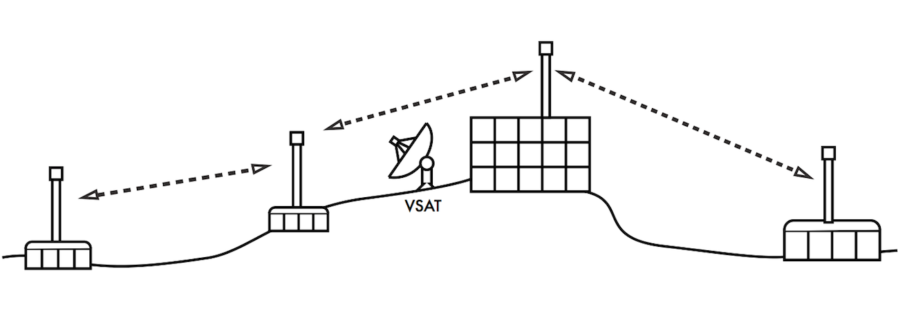

 

Figure NG 19: A multipoint-to-multipoint mesh. Every point can reach
every other at very high speed, or any of them can use the central
access point for a VSAT connection to the Internet.

 

The benefit of this network layout is that even if none of the nodes are
in range of a central access point, they can still communicate with each
other.

Good mesh network implementations are self-healing, which means that
they automatically detect routing problems and fix them as needed.
Extending a mesh network is as simple as adding more nodes.

If one of the nodes in the "cloud" happens to be an Internet gateway,
then that connection can be shared among all of the clients.

 

Several disadvantages of this topology include increased complexity and
lower performance.

 

Security in such a network is also a concern, since every participant
potentially carries the traffic of every other.

Multipoint-to-multipoint networks tend to be difficult to troubleshoot,
due to the large number of changing variables as nodes join and leave
the network.

Multipoint-to-multipoint clouds typically have reduced capacity compared
to point-to-point or point-to-multipoint networks, due to the additional
overhead of managing the network routing and increased contention in the
radio spectrum.

 

Nevertheless, mesh networks are useful in many circumstances.

For more information about them please read the chapter called Mesh
Networking.

#### Use the technology that fits

All of these network designs can be used to complement each other in a
large network, and additionally they can make use of traditional wired
networking techniques whenever possible. Wired networks still often have
higher bandwidth capacity than wireless so should be used whenever
appropriate or affordable.

But looking at the wireless, it is a common practice, for example, to
use a long distance wireless link to provide Internet access to a remote
location, and then set up an access point on the remote side to provide
local wireless access. One of the clients of this access point may also
act as a mesh node, allowing the network to spread organically between
laptop users who all ultimately use the original point-to-point link to
access the Internet.

 

This is just one common scenario for wireless deployments, there are
many others.

 

Now that we have a clear idea of how wireless networks are typically
arranged, we can begin to understand how communication is possible over
such networks.

 

7. WIFI FAMILY
--------------

### IEEE 802: What is it, and why should I care?

The early days of networking only saw wireline networks (if you don't
count the old AT&T Long lines microwave backbone that at one time
crossed the United States) Now many networks are built using both
wireline and wireless solutions. Typically networks based on wires or
more usually these days, fibres have greater capacity than wireless.

But laying fibre is much more expensive and takes time. So often
networks begin as wireless networks and as they grow in use, fibre based
networks start to be deployed. In access networks (those near the
consumers) or in dense urban environments, often wireless is more
practical too. So very importantly as you begin to think about deploying
wireless networks in your local area or community, your network could
form the basis of the future growth of networking in your region.

 

An aspect of wired and wireless networks important to understand is the
various standards that exist today as well as those new standards that
are being developed. Wireless standards are the basis for many wireless
products, ensuring interoperability and useability by those who design,
deploy and manage wireless networks. We touched on this subject already
in the chapter called Radio Spectrum. The Standards used in the vast
majority of the networks come from the IEEE Standard Association's IEEE
802 Working Group. IEEE 802 refers to a family of IEEE standards dealing
with local area networks and metropolitan area networks.

 

More specifically, the IEEE 802 standards are restricted to networks
carrying variable-size packets. (By contrast, in cell relay networks
data is transmitted in short, uniformly sized units called cells). The
number 802 was simply the next free number IEEE could assign, though
“802” is sometimes associated with the date the first meeting was held —
February 1980. The services and protocols specified in IEEE 802 map to
the lower two layers (Data Link and Physical) of the seven-layer OSI
networking reference model. In fact, IEEE 802 splits the OSI Data Link
Layer into two sub-layers named Logical Link Control (LLC) and Media
Access Control (MAC).

 

The IEEE 802 family of standards is maintained by the IEEE 802 LAN/MAN
Standards Committee (LMSC).

The most widely used standards are for the Ethernet family, Token Ring,
Wireless LAN, Bridging and Virtual Bridged LANs.

 

An individual Working group provides the focus for each area and they
are listed in the table below.

 

Name

Description

IEEE 802.1

Bridging and Network Management

IEEE 802.3

Ethernet

IEEE 802.11 a/b/g/n

Wireless LAN (WLAN)

IEEE 802.15

Wireless PAN

IEEE 802.15.1

Bluetooth certification

IEEE 802.15.2

IEEE 802.15 and IEEE 802.11 coexistence

IEEE 802.15.3

High-Rate wireless PAN

IEEE 802.15.4

Low-Rate wireless PAN eg. Zigbee

IEEE 802.15.5

Mesh networking for WPAN

IEEE 802.15.6

Body Area Network

IEEE 802.16

Broadband Wireless Access (basis of WiMAX )

IEEE 802.16.1

Local Multipoint Distribution Service

IEEE 802.18

Radio Regulatory TAG

IEEE 802.19

Coexistence TAG

IEEE 802.20

Mobile Broadband Wireless Access

IEEE 802.21

Media Independent Handoff

IEEE 802.22

Wireless Regional Area Network

IEEE 802.23

Emergency Services Working Group

IEEE 802.24

Smart Grid TAG

IEEE 802.25

Omni-Range Area Network

### The 802.11 standard

The standard we are most interested in is 802.11 as it defines the
protocol for Wireless LAN.

The 802.11 Amendments are so numerous they have in the last few years
started using 2 letters instead of 1. (802.11z - the DLS amendment -

gave way to 802.11aa, ab, ac..., etc)

 

Below is a table of the variants of 802.11, their frequencies and
approximate ranges.

 

802.11

protocol

Release

Freq.

Bandwidth

Data Rate per stream

Approximate indoor range

Approximate outdoor range

 

 

(GHz)

(MHz)

(Mbit/s)

(m)

(ft)

(m)

(ft)

-

Jun 1997

2.4

20

1, 2

20

66

100

330

a

Sep 1999

5

20

6,9,12, 18, 24, 36, 48, 54

35

115

120

390

b

Sep 1999

2.4

20

1, 2, 5.5, 11

35

115

140

460

g

Jun 2003

2.4

20

6,9,12, 18, 24, 36, 48, 54

38

125

140

460

n

Oct 2009

2.4/5

20

7.2, 14.4, 21.7, 28.9, 43.3, 57.8, 65, 72.2

70

230

250

820

40

15, 30, 45, 60 ,90, 120, 135, 150

ac

Nov.2011

5

20

Up to 87.6

 

 

 

 

40

Up to 200

80

Up to 433.3

160

Up to 866.7

 

In 2012 IEEE issued the 802.11-2012 Standard that consolidates all the
previous amendments.

 

The document is freely downloadable from:

[http://standards.ieee.org/findstds/standard/802.11-2012.html](http://standards.ieee.org/findstds/standard/802.11-2012.html)

 

 

 

### Deployment planning for 802.11 wireless networks

Before packets can be forwarded and routed to the Internet, layers one
(the physical) and two (the data link) need to be connected. Without
link local connectivity, network nodes cannot talk to each other and
route packets.

To provide physical connectivity, wireless network devices must operate
in the same part of the radio spectrum.

This means that 802.11a radios will talk to 802.11a radios at around 5
GHz, and 802.11b/g radios will talk to other 802.11b/g radios at around
2.4 GHz.

But an 802.11a device cannot interoperate with an 802.11b/g device,
since they use completely different parts of the electromagnetic
spectrum.

More specifically, wireless interfaces must agree on a common channel.
If one 802.11b radio card is set to channel 2 while another is set to
channel 11, then the radios cannot communicate with each other.

The centre frequencies of each channel for 802.11a and 802b/g are given
in Appendix B: Channel Allocations.

When two wireless interfaces are configured to use the same protocol on
the same radio channel, then they are ready to negotiate data link layer
connectivity. Each 802.11a/b/g device can operate in one of four
possible modes:

 

1.  1.  1.Master mode (also called AP or infrastructure mode) is used to
        create a service that looks like a traditional access point. The
        wireless interface creates a network with a specified name
        (called the SSID) and channel, and offers network services on
        it. While in master mode, wireless interfaces manage all
        communications related to the network (authenticating wireless
        clients, handling channel contention, repeating packets, etc.)
        Wireless interfaces in master mode can only communicate with
        interfaces that are associated with them in managed mode. 

    2.  2.Managed mode is sometimes also referred to as client mode.
        Wireless interfaces in managed mode will join a network created
        by a master, and will automatically change their channel to
        match it. They then present any necessary credentials to the
        master, and if those credentials are accepted, they are said to
        be associated with the master. Managed mode interfaces do not
        communicate with each other directly, and will only communicate
        with an associated master. 

    3.  3.Ad-hoc mode creates a multipoint-to-multipoint network where
        there is no single master node or AP. In ad-hoc mode, each
        wireless interface communicates directly with its neighbours.  

        Nodes must be in range of each other to communicate, and must
        agree on a network name and channel. Ad-hoc mode is often also
        called Mesh Networking and you can find details of this type of
        networking in the chapter called Mesh Networking. 

    4.  4.Monitor mode is used by some tools (such as Kismet) to
        passively listen to all radio traffic on a given channel. When
        in monitor mode, wireless interfaces transmit no data. This is
        useful for analysing problems on a wireless link or observing
        spectrum usage in the local area. Monitor mode is not used for
        normal communications. 

         

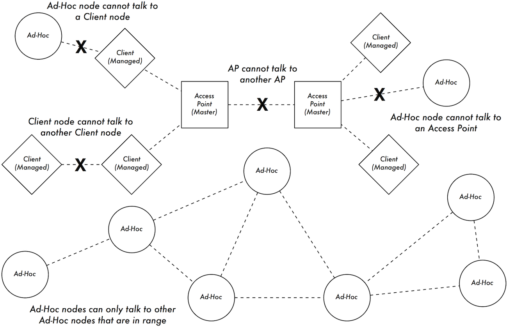

 

Figure WF 1: APs, Clients, and Ad-Hoc nodes.

 

When implementing a point-to-point or point-to-multipoint link, one
radio will typically operate in master mode, while the other(s) operate
in managed mode. In a multipoint-to-multipoint mesh, the radios all
operate in ad-hoc mode so that they can communicate with each other
directly.

 

It is important to keep these modes in mind when designing your network
layout.

Remember that managed mode clients cannot communicate with each other
directly, so it is likely that you will want to run a high repeater site
in master or ad-hoc mode.

Ad-hoc is more flexible but has a number of performance issues as
compared to using the master / managed modes.

### The 802.22 Standard

Did you ever wonder why one of the biggest users of wireless spectrum in
almost any country on earth, never got into the 2 way communications
business? No? Well, you ask, why did the Television Broadcast Industry
never want to do two-way communications.

The simple answer is that this was not the business they were in.

What they did instead was get access to and use of the best "beach
front" spectrum between DC and day light.. and almost for free to boot.

As analogue TV gets replaced by digital TV, some of that beach front
spectrum is being made available for wireless networking. And in parts
of the world where TV has been deployed less extensively, these same
parts of the radio spectrum are available for wireless networking as
well.

The new wireless technology is commonly called TVWS (TV White Spaces)
and although relatively new at the time of writing, this technology is
in many trials for rural broadband wireless.

 

From wikipedia -

IEEE 802.22, known informally as Super Wi-Fi, is a standard for Wireless
Regional Area Networks (WRAN) using white spaces in the TV frequency
spectrum.

The development of the IEEE 802.22 WRAN standard is aimed at using
cognitive radio (CR) techniques to allow sharing of geographically
unused spectrum allocated to the Television Broadcast Service, on a
non-interfering basis, to bring broadband access to hard-to-reach, low
population density areas, typical of rural environments, and is
therefore timely and has the potential for a wide applicability
worldwide.

 

IEEE 802.22 WRANs are designed to operate in the TV broadcast bands
while assuring that no harmful interference is caused to the incumbent
operation, i.e., digital TV and analog TV broadcasting, and low power
licensed devices such as wireless microphones. The standard was finally
published in July 2011.

#### Technology of 802.22 or TVWS

The initial drafts of the 802.22 standard specify that the network
should operate in a point to multipoint topology (p2m). The system will
be formed by Base Stations (BS) and Customer Premise Equipment (CPE).
The CPEs will be attached to a BS via a wireless link.

 

One key feature of the 802.22 WRAN Base Stations is that they will be
capable of performing sensing of available spectrum.

The Institute of Electrical and Electronic Engineers (IEEE), together
with the FCC, in the US, pursued a centralised approach for available
spectrum discovery.

Specifically each Base Station (BS) would be armed with a GPS receiver
which would allow its position to be reported.

This information would be sent back to centralised servers which would
respond with the information about available free TV channels and guard
bands in the area of the Base Station.

 

Other proposals would allow local spectrum sensing only, where the BS
would decide by itself which channels are available for communication.
This is called distributed sensing.

 

The CPEs will be sensing the spectrum and sending periodic reports to
the BS informing it about what they sense. The BS, with the information
gathered, will evaluate whether a change is necessary in the channel
used, or on the contrary, if it should stay transmitting and receiving
in the same one. A combination of these two approaches is also
envisioned.

 

These sensing mechanisms are primarily used to identify if there is an
incumbent transmitting, and if there is a need to avoid interfering with
it. This means that the physical layer must be able to adapt to
different conditions and be flexible in jumping from channel to channel
without errors in transmission or losing clients (CPEs).

 

This flexibility is also required for dynamically adjusting the
bandwidth, modulation and coding schemes. OFDMA (Orthogonal
Frequency-Division Multiple Access) is the modulation scheme for
transmission in up and downlinks. With OFDMA it will be possible to
achieve this fast adaptation needed for the BSs and CPEs.

 

 

By using just one TV channel (a TV channel has a bandwidth of 6 MHz, in
some countries they can be 7 or 8 MHz) the approximate maximum bit rate
is 19 Mbit/s at a 30 km distance.

The speed and distance achieved is not enough to fulfill the
requirements of the standard.

There is a feature called Channel Bonding which deals with this problem.
Channel Bonding uses more than one channel for transmit/receive. This
allows the system to have higher bandwidth which will be reflected in a
better system performance.

### Summary

As we can see the standards for wireline and wireless are mostly
incorporated into the IEEE 802 Working Group.

At the moment the 802.11 family of WiFi standards and equipment are by
far and away the most widely manufactured and deployed in indoor and
outdoor wireless links.

The chapter called Hardware Selection and Configuration looks at
equipment in much more detail.

 

The new 802.22 Standard is expected to play an increasing role in many
rural (and urban) wireless networks. The free-ing up of unlicensed
spectrum currently used by broadcast TV will enable this to happen. As
yet the standards and the various groups involved in this standard are
in their infancy, as are the bodies around the world involved in
spectrum re-allocation. Available equipment is still very new and
deployments are few and far between. In the next 2-3 years it is
anticipated that this will change significantly and the next revision of
this book may well have case studies and deployment information to share
with respect to 802.22 based networks. Meanwhile there is an interesting
project underway in Scotland, United Kingdom which is deploying TVWS
802.22 networks.

 

You can read more about the project here:

[http://www.wirelesswhitespace.org/projects.aspx](http://www.wirelesswhitespace.org/projects.aspx)

 

8. MESH NETWORKING
------------------

### Introduction

Mesh networks are based on multipoint-to-multipoint (m2m) networking. In
the nomenclature of IEEE 802.11, m2m networking is referred to as
'ad-hoc' or 'IBSS' mode.

 

Most wireless networks today are based on point-to-point (p2p) or
point-to-multipoint (p2m) communication.

 

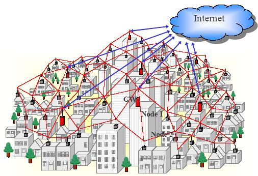

 

Figure MN 1: A metropolitan area mesh network, providing local
connectivity and Internet access via multiple Internet gateways

 

A typical wireless hotspot operates in p2m infrastructure mode - it
consists of an access point (with a radio operating in master mode),
attached to a DSL line or other large scale wired network.

In a hotspot the access point acts as a master station that is
distributing Internet access to its clients.

 

 

 

This hub-and-spoke topology is also typically used for the mobile phone
(2G or 3G) service.

Mobile phones connect to a base station p2m - without the presence of a
base station mobiles can't communicate with each other.

If you make a joke call to a friend that is sitting on the other side of
the table, your phone sends data to the base station of your provider
that may be a mile away - the base station then sends data back to the
phone of your friend.

 

In a remote area without base stations a GSM phone is useless as a
communication device, simply because GSM radios are designed in such a
way that they can not communicate directly with each other.

This is unlike analog radio sets that can communicate m2m with each
other as long as they are within range.

Wireless radio is by default a broadcast medium, and any station which
can transmit and receive could communicate m2m.

 

With regards to the technological challenge, implementing m2m networking
is much more demanding then p2m and p2p.

Strategies to implement channel access coordination are more complex,
for example, there is no central authority to assign transmit time
slots.

 

Because there is no central management, m2m stations need to mutally
agree on cell coordination parameters such as the MAC like cell-id of
the wireless cell.

The fact that 802.11 names the m2m mode of WiFi "ad-hoc" suggests that
the IEEE board thought of a m2m network as a spontaneous, provisional,
sub-optimal solution.

 

Multipoint-to-multipoint communication is actually more versatile and
can be much more efficient than point-to-point or point-to-multipoint
communication: m2m communication includes the ability to communicate p2p
and p2m, because p2p and p2m are just subsets of m2m.

 

 

A network consisting of just two multipoint-to-multipoint capable
devices simply communicates p2p:

 

A--B

 

A network of three mesh-capable devices A, B, C can form a topology like
this, for example:

 

A--B--C

 

Here A can communicate only with B. C can only communicate with B, while
B can communicate with A and C. B actually does communicate p2m. Without
routing, A and C can not communicate with each other in 802.11 ad-hoc
mode.

By adding a routing protocol A can automatically learn that behind B
there is C and vice versa, and that B can be utilised as a communication
relay so all nodes can communicate with each other. In this case B will
act similarly to an access point in 802.11 infrastructure mode. WiFi
cards configured as infrastructure clients can't communicate directly,
so they would always need the access point B as a relay.

If the three devices move around, the topology might become a full mesh,
where every node can communicate with every other node directly:

 

A

/  \\

B----C

 

In this case relaying traffic is not necessary, given that the links are
all good enough. In infrastructure mode, communicating directly is not
possible. All the traffic between clients has to be relayed by the
access point. If we now add D to the little chain topology example, all
devices can communicate with each other if this is a mesh.

 

A--B--C--D

 

On the other hand, this would not be possible if the network is an
infrastructure mode network and B is an access point. C and D would both
be infrastructure clients, and as already mentioned before,
infrastructure clients can not communicate directly with each other.

 

So client D could not join the infrastructure network because it is out
of range of the access point B, while it would be still in the radio
range of client C.

### Bandwidth impact of multi-hop relaying routes

Mesh networks consisting of devices that feature only one radio are a
low cost way to establish a ubiquitous wireless network, but this comes
at a tradeoff. With only one wireless interface in each device, the
radios have to operate on the same channel. Simply sending data through
a routing path going from node A through B to C halves the available
bandwidth. While A is sending data to B, B and C have to remain silent.

While B is forwarding data to C, A has to remain silent as well - and so
on. Note that the same is true if two clients connected to an access
point in infrastructure want to communicate with each other.

 

If we assume that all wireless links in the A-B-C-D mesh chain operate
at the same speed, the communication between A and D would be roughly
1/3 of the speed of a single link, given that A and D can use the
network capacity exclusively. The bandwidth impact can be mitigated or
avoided by using devices with multiple radios, given that they are
operating on different frequencies that don't interfere with each other.

Despite the bandwidth tradeoff, single radio mesh devices still have
their merits. They are cheaper, less complex and consume less power than
multi-radio devices. This can be important if the systems are solar or
wind powered or require a battery backup. If the wireless links in a
three hop network (a chain with 4 nodes like above) operate at 12 Mbit
each, the total end-to-end bandwidth would still offer plenty bandwidth
to saturate a 2 Mbit Internet uplink.

### Summary

Mesh networking extends the range of wireless devices by multi-hop
relaying traffic. By means of dynamic routing, meshes can be self-
healing in case of node failure and grow organically if more nodes are
added. If the mesh nodes have only one radio, the benefit in coverage
comes at the tradeoff of reduced bandwidth. Here is an example of a
currently deployed mesh network. You can find more information about
this deployment at the url
[http://code.google.com/p/afrimesh/](http://code.google.com/p/afrimesh/)

 

 

Figure MN 2: Screenshot of the Villagetelco mesh at Bo-Kaap in Capetown,
South Africa

### Routing protocols for mesh networks

Routing protocols for wireless mesh networks have to be designed with
the challenges of radio communication in mind.

 

Wireless links and the topology of a mesh network are inherently
unstable, devices can go up and down, the available bandwidth varies,
and links are often flawed with packet loss.

A mesh routing protocol should be resilient against routing errors even
if routing protocol messages are delayed or lost.

At the same time the available communication bandwidth and computing
performance of mesh nodes is limited and shouldn't be wasted on protocol
decisions and traffic overhead.

 

In 2005, when the first edition of the WNDW book was written, there were
only few practically usable routing protocols for mesh networks. In
previous editions, this chapter has been focused on OLSR. Back then, the
OLSR daemon wasn't shipped with a working default configuration, so it
was necessary to wade into the depths of the olsrd.conf configuration
file to find out what the best configuration of the routing algorithm
was.

The situation has changed quite a bit since 2005.

There are now a number of mesh protocols and implementations, and all
the implementations which are mentioned in this chapter are readily
available as installation packages for OpenWRT.

Mesh protocol developers are competing in a challenge to deliver the
best mesh routing protocol. There is now a annual competition event for
mesh protocol developers, taking place once a year. It is called
"Battlemesh",
[www.battlemesh.org](http://objavi.booki.cc/tmp/wirelessnetworkinginthedevelopingworld-en-2013.02.13-23.20.02.odtQlyYWy/mesh-networking/www.battlemesh.org)

 

Most mesh routing protocols (BABEL, BATMAN, OLSR, BMX, BMX6) take care
of maintaining the IPv4 and IPv6 routing tables in a mesh node by
adding, updating and deleting routes. These mesh protocols are using
IP-based routing. They are layer 3 mesh protocols, since IP represents
the third layer of the OSI networking layer model.

Batman-adv(anced) is a relatively new protocol that operates on the
second layer of the networking model, hence it is a layer 2 mesh
protocol. To the higher layers (including IP), Batman-adv makes the
whole mesh appear as a switch, where all connections are link-local. A
Batman-adv mesh is transparent for the higher layers of the networking
model.

This simplifies the setup of a mesh network a great deal, since it is
possible to use DHCP, mDNS or MAC bridging with Batman-adv. Batman-adv
is a Linux kernel module, which is shipped with the official Linux
kernel sources. Mesh routing protocols should also manage the
announcement and selection of gateways to external networks like the
Internet. A common problem with gateway selection mechanisms is that the
routing protocol might decide to switch between gateways too often - for
example, because one routing path to one gateway just got slightly
better than the other. This is annoying because it can cause gateway
flapping and results in stateful connection sessions breaking down
frequently. If there is more than one Internet gateway in the mesh,
using an advanced method for gateway selection is strongly recommended.

#### How about 802.11s?

The roadmap of 802.11s is to scale up to 32 nodes. According to
Wikipedia it uses HWMP (Hybrid wireless mesh protocol) as the default
routing protocol, with the option to use other routing protocols. Quote:
"HWMP is inspired by a combination of AODV (RFC 3561[2]) and

tree-based routing". Since 802.11s is relatively new there is not much
practical experience so far.

### Devices and firmware for embedded devices

Not all WiFi devices on the market are suitable for mesh networking.

In 2005, when the first edition of this book was written, one of the
clear hardware recommendations for mesh networking was the Linksys
WRT54G router in combination with the Freifunk firmware.

While the WRT54G(L) is still on the market, it is no longer worth a
recommendation.[1](#ftn1)

 

OpenWRT is a very versatile firmware development environment for
developers and a firmware for advanced Linux users.

The old Freifunk firmware is based on the outdated OpenWRT version
"White Russian". "White Russian" supported only devices with Broadcom
chipsets with a proprietary binary wireless driver and is based on Linux
2.4. It has been ousted by the OpenWRT releases 'Kamikaze' and
'Backfire' (latest release). With 'Kamikaze' and 'Backfire' OpenWRT has
gained support for many different wireless chipsets, CPU architectures
and devices. The next stable release of OpenWRT will be named 'Attitude
Adjustment', which, at the time of writing, is at 'release candidate'
stage. The 'AR7xxx' and 'Atheros' platform ports of 'Attitude
Adjustment' can be considered stable.

The mesh routing protocols mentioned before are all available as
installation packages for OpenWRT.

A few open networking communities have developed their own customised
firmware images with OpenWRT Kamikaze and Backfire.

However they are mostly geared to meet their local preferences and
requirements and support a limited number of devices. Since they are
often localised they might be of limited use for the general public.

OpenWRT has a package management system, which comes to the rescue. It
is typical for OpenWRT to install software packages into the router
after it has been flashed. There is now a meta package named
'luci-freifunk-community', which will automatically convert a stock
OpenWRT image into a community mesh networking firmware.

 

The number of devices that can be converted to a mesh router has
increased dramatically. On the other hand the process of converting a
stock OpenWRT firmware into a mesh firmware via the package management
system is often more error-prone unfortunately.

 

Some manufacturers of WiFi routers are shipping devices that come with
OpenWRT as their factory firmware: Mesh-Potato, Dragino MS- 12, Allnet
0305.

 

 

 

Figure MN 3: Mesh-Potato outdoor mesh WiFi router with VoIP (with one
FXS port to connect analog telephone handsets).
[www.villagetelco.org](http://www.villagetelco.org/)

 

The Mesh-Potato is a low-power outdoor device designed for mesh
networking with an FXS (analog telephone) port, so you can plug an
analog telephone handset in and make telephone calls via the mesh.

The Mesh-Potato is shipped with a mesh firmware that uses the BATMAN
Layer 3 mesh protocol.

A second firmware named SECN (Small enterprise/campus network) is also
available for the Mesh- Potato, which uses the BATMAN-ADV Layer 2 mesh.

But these are not the only devices that should be considered for
purchase.

OpenWRT supports a very broad selection of wireless routers.

Replacing the factory firmware with OpenWRT is often quite easy.

 

Again, the selection of available devices is so diverse that there isn't
a single update method that works for the whole variety of hardware,
which could be described here.

 

The OpenWRT table of supported hardware is huge and it keeps expanding:

[http://wiki.openwrt.org/toh/start](http://wiki.openwrt.org/toh/start)

 

This site should be the place to start before you go and buy devices.

 

At the moment, if you are looking for a router based on a chipset that
supports 802.11n in ad-hoc mode, my recommendation are devices that are
supported by the AR7XXX port of OpenWRT.

 

Note that hardware manufacturers may change the chipsets of the devices
without explicitly stating it. Newer hardware revisions are not
guaranteed to work unless someone has tested and reported it in the
OpenWRT wiki.

 

Notable devices which can be flashed with OpenWRT are the outdoor units
made by Ubiquiti and the SOHO devices made by TP-Link.

 

TP- Link produces several low-cost SOHO devices with Atheros ar71xx
chipsets (802.11n).

The TP-Link MR3220 (802.11n single stream) and MR3420 (802.11n dual
stream) feature a 400 MHz Mips 24kc CPU, one USB 2.0 port, a 4 port 100
Mbit switch, WAN port, 4MB flash and 32MB RAM.

Prices start at around 30US \$.

 

Since the TP-Link devices have a USB 2.0 port it is possible to add
another WiFi interface via USB WiFi dongle.

Actually USB 2.0 adds many opportunities, like adding additional storage
space, audio support, webcams and so on.

 

Figure MN 4:DIY outdoor routers based on PCBs taken from SOHO routers
(Picture showing two devices based on TP-Link WR741 and WR941 and one
based on a Fonera router)

 

Another firmware distribution which initially orginated as an
alternative firmware of the WRT54G is DD-WRT. DD-WRT is a firmware
distribution designed for end-users. It only supports the OLSR routing
protocol.

### Frequently observed problems

The typical problems of multipoint-to-multipoint communication are
either on the physical radio or the MAC layer. The IEEE 802.11
suggestions about multipoint-to-multipoint mode were not up to the task.

The main challenges are:

#### Channel access coordination, namely the hidden node and exposed node problem

Going back to our little mesh with the topology A B C it can happen that
A and C start to send data to B at the same time because they don't
receive each other, resulting in a collision at the location of B.
802.11 has a mechanism to mitigate this: RTS/CTS (request to send, clear
to send)

 

Before a m2m node sends data it requests airtime by sending a short RTS
packet, in order to reserve the channel. It waits until it receives a
CTS signal. So A will send a short RTS packet, and B sends a short CTS
packet. This way C will detect that there will be a transmission of a
hidden node that it shouldn't interfere with.

 

However the current RTS/CTS mechanism of 802.11 works well only for 2
hop routes. On longer routes it can happen that multiple stations send
RTS signals, which results in all the nodes stopping their transmissions
and waiting for a CTS signal. This is called a RTS broadcast storm. For
mesh networks of considerable size it is not recommended to use the
RTS/CTS mechanism.

#### Timer synchronisation

The people designing the 802.11 ad-hoc protocol thought it would be
smart if the WiFi devices would synchronise their MAC timer clocks by
sending time stamps in beacons.

 

However bogus time stamps can occur due to bugs, and they often trigger
race conditions in the hardware, drivers and the 802.11 ad-hoc protocol,
which has not been designed to cope with such issues.

 

Failed attempts to synchronise time stamps often results in cell
splitting (see below). There are some hacks which have been introduced
to overcome the problem.

 

The best solution is to disable timer synchronisation entirely. However
timer synchronisation is often done in the wireless interface hardware
or firmware of a interface.

OpenWRT has a hack to disable timer synchronisation when using Atheros
802.11abg cards that work with the Madwifi driver. If you are using a
recent Linux kernel, certain wireless drivers (namely ath9k) which are
often used for mesh devices are quite robust against timer issues in
ad-hoc mode.

 

However this doesn't help if the WiFi device comes with a closed source
binary firmware which is not prepared to deal gracefully with timer
issues. There is not much we can do about it, other than using
drivers/firmwares/chipsets which are known to work reliably.

#### IBSS cell splitting

This is a typical problem of the way 802.11 suggests implementation of
the m2m mode. Ad-hoc devices may fail to agree on a certain cell-id
(IBSS-ID). If they don't manage to agree on using one certain cell-id,
they are logically separated wireless cells.

This is a real show stopper, because wireless devices will not be able
to communicate with each other. The problem is related to issues with
timer synchronisation. Since Linux 2.6.31 it is possible to manually fix
the IBSS-ID. This feature is also available in OpenWRT.

9. SECURITY FOR WIRELESS NETWORKS
---------------------------------

### Introduction

While unlicensed spectrum provides a huge cost savings to the user, it
has the unfortunate side effect that Denial of Service (DoS) attacks are
trivially simple. By simply turning on a high powered access point,
cordless phone, video transmitter, or other 2.4GHz device, a malicious
person could cause signifi cant problems on the network. Many network
devices are vulnerable to other forms of denial of service attacks as
well, such as disassociation fl ooding and ARP table overfl ows.

There are several categories of individuals who may cause problems on a
wireless network:

#### Unintentional users.

Densely populated areas such as city centres and university campuses can
lead to a density of wireless access points. In these populated areas,
it is common for laptop users to accidentally associate to the wrong
network. Most wireless clients will simply choose any available wireless
network, often the one with the strongest signal, when their preferred
network is unavailable.

The user may then make use of this network as usual, completely unaware
that they may be transmitting sensitive data on someone elses network.

Malicious people may even take advantage of this by setting up access
points in strategic locations, to try to attract unwitting users and
capture their data.

The first step in avoiding this problem is educating your users, and
stressing the importance of connecting only to known and trusted
networks.

Many wireless clients can be configured to only connect to trusted
networks, or to ask permission before joining a new network.

As we will see later in this chapter, users can safely connect to open
public networks by using strong encryption.

#### War drivers.

The “war driving” phenomenon draws its name from the popular 1983 hacker
film, “War Games”.

War drivers are interested in finding the physical location of wireless
networks.

They typically drive around with a laptop, GPS, and omnidirectional
antenna, logging the name and location of any networks they find. These
logs are then combined with logs from other war drivers, and are turned
into graphical maps depicting the wireless “footprint” of a particular
city.

The vast majority of war drivers likely pose no direct threat to
networks, but the data they collect might be of interest to a network
cracker. For example, it might be obvious that an unprotected access
point detected by a war driver is located inside a sensitive building,
such as a government or corporate office.

 

A malicious person could use this information to illegally access the
network there. Arguably, such an AP should never have been set up in the
first place, but war driving makes the problem all the more urgent. As
we will see later in this chapter, war drivers who use the popular
program NetStumbler can be detected with programs such as Kismet.

For more information about war driving, see sites such as:

[http://wigle.net/,](http://wigle.net/)

[http://www.nodedb.com/,](http://www.nodedb.com/)or
[http://www.stumbler.net/.](http://www.stumbler.net/)

#### Rogue access points.

There are two general classes of rogue access points:

 

Those incorrectly installed by legitimate users, and those installed by
malicious people who intend to collect data or do harm to the network.
In the simplest case, a legitimate network user may want better wireless
coverage in their office, or they might find security restrictions on
the corporate wireless network too difficult to comply with.

By installing an inexpensive consumer access point without permission,
the user opens the entire network up to potential attacks from the
inside. While it is possible to scan for unauthorised access points on
your wired network, setting a clear policy that prohibits them is a very
important first step.

The second class of rogue access point can be very difficult to deal
with. By installing a high powered AP that uses the same ESSID as an
existing network, a malicious person can trick people into using their
equipment, and log or even manipulate all data that passes through it.

Again, if your users are trained to use strong encryption, this problem
is significantly reduced.

#### Eavesdroppers.

As mentioned earlier, eavesdropping is a very difficult problem to deal
with on wireless networks. By using a passive monitoring tool (such as
Kismet), an eavesdropper can log all network data from a great distance
away, without ever making their presence known.

Poorly encrypted data can simply be logged and cracked later, while
unencrypted data can be easily read in real time.

 

If you have difficulty convincing others of this problem, you might want
to demonstrate tools such as

Driftnet (http://www.ex-parrot.com/\~chris/driftnet/).

Driftnet watches a wireless network for graphical data, such as GIF and
JPEG files. While other users are browsing the Internet, these tools
simply display all graphics found in a graphical collage. While you can
tell a user that their email is vulnerable without encryption, nothing
drives the message home like showing them the pictures they are looking
at in their web browser. Again, while it cannot be completely prevented,
proper application of strong encryption will discourage eavesdropping.

### Protecting the wireless network

In a traditional wired network, access control is relatively
straightforward: If a person has physical access to a computer or
network hub, they can use (or abuse) the network resources. While
software mechanisms are an important component of network security,
limiting physical access to the network devices is the ultimate access
control mechanism. Simply put, if all terminals and network components
are physically only accessible to trusted individuals, the network can
likely be trusted. The rules change significantly with wireless
networks. While the apparent range of your access point may seem to be
just a few hundred metres, a user with a high gain antenna may be able
to make use of the network from several blocks away.

Should an unauthorised user be detected, is impossible to simply “trace
the cable” back to the users location.

Without transmitting a single packet, a sufficiently talented nefarious
user can capture and log traffic on a wireless network to disk.

This data can later be used to launch a more sophisticated attack
against the network. Never assume that radio waves simply “stop” at the
edge of your property line, or inside your building. Physical security
in wireless networks is limited to preventing compromise of the active
components, cables and power supply.

Where physical access to the network cannot be prevented we have to rely
on electronic means for controlling access to the wireless
infrastructure in order to only allow authorised persons and systems to
use the wireless network. But remember, while a certain amount of access
control and authentication is necessary in any network, you have failed
in your job if legitimate users find it difficult to use the network to
communicate. Lastly, it is usually unreasonable to completely trust all
users of the network, also on wired networks. Disgruntled employees,
uneducated network users, and simple mistakes on the part of honest
users can cause significant harm to network operations. As the network
architect, your goal is to facilitate private communication between
legitimate users of the network and between legitimate users and
services.

 

There's an old saying that the only way to completely secure a computer
is to unplug it, lock it in a safe, destroy the key, and bury the whole
thing in concrete. While such a system might be completely “secure”, it
is useless for communication. When you make security decisions for your
network, remember that above all else, the network exists so that its
users can communicate with each other. Security considerations are
important, but should not get in the way of the network's users.

 

A simple rule-of-thumb as to whether or not the network is getting in
the way of its users is to look at how much time you or other staff
spend on helping people get on the network.

If regular users are repeatedly having problems simply gaining access to
the network, even after they have been provided instruction and training
on how to do so, it's possible that the access procedures are too
cumbersome and a review of them is in order.

Taking all of this into account, our goal is to provide adequate
physical security, control access protect the communication without
sacrificing ease of use.

### Physical security for wireless networks

When installing a network, you are building an infrastructure that
people depend on. Security measures exist to ensure that the network is
reliable. Wireless networks have physical components, such as wires and
boxes, which are easily disturbed. In many installations, people will
not understand the purpose of the installed equipment, or curiosity may
lead them to experiment.

They may not realise the importance of a cable connected to a port.
Someone may unplug an Ethernet cable so that they can connect their
laptop for 5 minutes, or move a switch because it is in their way. A
plug might be removed from a power bar because someone needs that
receptacle. Assuring the physical security of an installation is
paramount. Signs and labels will only be useful to those who can read
your language. Putting things out of the way and limiting access is the
best means to assure that accidents and tinkering do not occur. In your
locality, proper fasteners, ties, or boxes may not be easy to find.

You should be able to find electrical supplies that will work just as
well. Custom enclosures are also easy to manufacture and should be
considered essential to any installation. It is often economical to pay
a mason to make holes and install conduit. PVC can be embedded in cement
walls for passing cable from room to room. This avoids the need to smash
new holes every time a cable needs to be passed. Plastic bags can be
stuffed into the conduit around the cables for insulation. Small
equipment should be mounted on the wall and larger equipment should be
put in a closet or in a cabinet.

#### Switches

Switches, hubs or interior access points can be screwed directly onto a
wall with a wall plug. It is best to put this equipment as high as
possible to reduce the chance that someone will be able to touch the
device or its cables without significant effort.

#### Cables

At the very least, cables should be hidden and fastened. It is possible
to find plastic cable conduit that can be used in buildings. If you
cannot find it, simple cable attachments can be nailed into the wall to
secure the cable.

This will make sure that the cable doesn't hang where it can be snagged,
pinched or cut.

When fastening cable to the wall, it is important to not nail or screw
into the cable itself. The cable contains many tiny wires that the
network data travels over. Nailing through the cable will damage it and
make it useless for transmitting data. Take care also to not overly bend
or twist the cable as this will damage it as well.

It is preferable to bury cables, rather than to leave them hanging
across a yard. Hanging wires might be used for drying clothes, or be
snagged by a ladder, etc. To avoid vermin and insects, use plastic
electrical conduit. The marginal expense will be well worth the trouble.
The conduit should be buried about 30 cm deep, or below the frost level
in cold climates. It is worth the extra investment of buying larger
conduit than is presently required, so that future cables can be run
through the same tubing. Consider labeling buried cable with a "call
before you dig" sign to avoid future accidental outages.

#### Power

It is best to have power bars locked in a cabinet. If that is not
possible, mount the power bar under a desk, or on the wall and use duct
tape (or gaffer tape, a strong adhesive tape) to secure the plug into
the receptacle. On the UPS and power bar, do not leave any empty
receptacles. Tape them if necessary. People will have the tendency to
use the easiest receptacle, so make these critical ones difficult to
use. If you do not, you might find a fan or light plugged into your UPS;
though it is nice to have light, it is nicer to keep your server
running!

#### Water

Protect your equipment from water and moisture. In all cases make sure
that your equipment, including your UPS is at least 30 cm from the
ground, to avoid damage from fl ooding. Also try to have a roof over
your equipment, so that water and moisture will not fall onto it. In
moist climates, it is important that the equipment has proper
ventilation to assure that moisture can be exhausted. Small closets need
to have ventilation, or moisture and heat can degrade or destroy your
gear.

#### Masts

Equipment installed on a mast is often safe from thieves. Nevertheless,
to deter thieves and to keep your equipment safe from winds, it is good
to over-engineer mounts.

Painting equipment a dull white or grey colour reflects the sun and
makes it look plain and uninteresting. Panel antennas are often
preferred because they are much more subtle and less interesting than
dishes. Any installation on walls should be high enough to require a
ladder to reach. Try choosing well-lit but not prominent places to put
equipment. Also avoid antennae that resemble television antennae, as
those are items that will attract interest by thieves, whereas a wifi
antenna will be useless to the average thief.

### Authentication and access control

Talking about authentication a number of related terms like (digital)
identity, authorisation, privacy etc. pop up. So before we get into
authentication proper we need to introduce some terminology, without
trying to be exhaustive.

 

Digital identity is the electronic entity that is a representation of a
physical entity, like a person or a device. Authentication is the
process of verifying the claim that an (electronic) entity is allowed to
act on behalf of a given known (physical) entity. In other words,
authentication is the process of proving that the physical entity
corresponds to a certain electronic one. Authorisation in turn is the
process of establishing the rights of the identity to access certain
resources or to perform certain tasks. Privacy, finally, is a complex
issue but has to do with the right of a person not to have their
personal data and behaviour be known to parties that do not strictly
need it to provide the service the users request. So for example, it is
reasonable for a liquor shop to know that a customer is above a certain
age before selling alocholic drinks, but not to know the name of the
customer, and third parties should not have any knowledge of the
transaction at all. Privacy is of particular concern in a world in which
users increasingly use networks and services outside their home
environment. Without proper attention to privacy aspects it is too easy
to trace a users behaviour and movement.

It is worth mentioning that there is a trade-off between authentication
and privacy. Verifying the identity of a user in itself invades the
user's privacy, the authenticating party knows who is using what
resource at a particular time and location, but the challenge is to
minimise the amount of information about a user and the number of
parties that are privvy to that information.

In the context of this book we are mainly interested in techniques for
controlling access to the network. In other words, we want to be able to
decide who (authenticated identity) gets to access what (authorisation)
without sacrificing privacy.

Authentication is typically done by proof of knowledge of a secret (a
password, a signature), possession of a token or characteristic (a
certificate, a fingerprint) or both. Access control is often needed to
make sure that only authorised users can use the network, to prevent
exhaustion of scarce resources and/or compliance with rules and
regulations. In addition to access controlled networks there may also be
open networks with limited access or for a limited time, but due to the
need for organisations to control access to their scarce resources and
also anti-terrorist laws they become less ubiquitous. Over the years a
number of techniques have been employed to control access to wireless
networks. Subsequently they have been mostly abandoned due to security
or scalability issues as WiFi became increasingly popular.

#### Mac filtering

Access to a WiFi network can be based on the MAC address. This is the
48-bit number assigned by the manufacturer to every wireless and
Ethernet device, and that is supposed to be unique and persistent. By
employing mac filtering on our access points, we can authenticate users
based on their MAC address.

With this feature, the access point keeps an internal table of approved
MAC addresses.

 

When a wireless user tries to associate to the access point, the MAC
address of the client must be on the approved list, or the association
will be denied. Alternatively, the AP may keep a table of known “bad”
MAC addresses, and permit all devices that are not on the list.
Unfortunately, this is not an ideal security mechanism. Maintaining MAC
tables on every device can be cumbersome, requiring all client devices
to have their MAC addresses recorded and uploaded to the APs. Even
worse, MAC addresses can often be changed in software. By observing MAC
addresses in use on a wireless network, a determined attacker can spoof
(impersonate) an approved MAC address and successfully associate to the
AP.

While MAC filtering will prevent unintentional users and even most
curious individuals from accessing the network, MAC filtering alone
cannot prevent attacks from determined attackers.

MAC filters are useful for temporarily limiting access from misbehaving
clients. For example, if a laptop has a virus that sends large amounts
of spam or other traffic, its MAC address can be added to the filter
table to stop the traffic immediately. This will buy you time to track
down the user and fix the problem.

#### Closed networks

Another at one time popular "authentication feature" of WiFi networks is
the so-called closed network mode. In a typical network, APs will
broadcast their ESSID many times per second, allowing wireless clients
(as well as tools such as NetStumbler) to find the network and display
its presence to the user. In a closed network, the AP does not beacon
the ESSID ("hidden ESSID"), and users must know the full name of the
network before the AP will allow association. This prevents casual users
from discovering the network and selecting it in their wireless client.
There are a number of drawbacks to this feature. Forcing users to type
in the full ESSID before connecting to the network is error prone and
often leads to support calls and complaints. Since the network isn’t
obviously present in site survey tools like NetStumbler, this can
prevent your networks from showing up on war driving maps. But it also
means that other network builders cannot easily find your network
either, and specifically won’t know that you are already using a given
channel.

A conscientious neighbour may perform a site survey, see no nearby
networks, and install their own network on the same channel you are
using. This will cause interference problems for both you and your
neighbour.

Finally, using closed networks ultimately adds little to your overall
network security. By using passive monitoring tools (such as Kismet), a
malicious user can detect frames sent from your legitimate clients to
the AP. These frames necessarily contain the network name. The malicious
user can then use this name to associate to the access point, just like
a normal user would. Encryption is probably the best tool we have for
authenticating wireless users. Through strong encryption, we can
uniquely identify a user in a manner that is very difficult to spoof,
and use that identity to determine further network access. Encryption
also has the benefit of adding a layer of privacy by preventing
eavesdroppers from easily watching network traffic. Encryption is the
technique that is used for authenticating users in most current
deployments.

#### WEP

The first widely employed encryption method on WiFi networks was WEP
encryption. WEP stands for Wired Equivalent Privacy, and is supported by
virtually all 802.11a/b/g equipment. Incidentally, this is a complete
misnomer as the privacy that WEP provides is in no way equivalent to
that of wired connections. WEP uses a shared 40-bit key to encrypt data
between the access point and client. The key must be entered on the APs
as well as on each of the clients.

With WEP enabled, wireless clients cannot associate with the AP until
they use the correct key. An eavesdropper listening to a WEP-enabled
network will still see traffic and MAC addresses, but the data payload
of each packet is encrypted.

This provided an authentication mechanism while also adding a bit of
privacy to the network. WEP is definitely not the strongest encryption
solution available.

For one thing, the WEP key is shared between all users. If the key is
compromised (say, if one user tells a friend what the password is, or if
an employee is let go) then changing the password can be prohibitively
difficult, since all APs and client devices need to be changed.

 

This also means that legitimate users of the network can still eavesdrop
on each others’ traffic, since they all know the shared key.

The key itself is often poorly chosen, making offline cracking attempts
feasible. But most importantly, WEP itself is broken, making it very
easy to gain illegal access the network.

So WEP should not be used anymore.

 

For more details about the state of WEP encryption, see these papers:

http://www.isaac.cs.berkeley.edu/isaac/wep-faq.html
[http://www.cs.umd.edu/\~waa/wireless.pdf](http://www.cs.umd.edu/%7Ewaa/wireless.pdf)

#### "Switched" wireless networks

One critical difference between modern switched Ethernet networks and
wireless is that wireless networks are built on a shared medium.

They more closely resemble the old network hubs than modern switches, in
that every computer connected to the network can “see” the traffic of
every other user.

 

To monitor all network traffic on an access point, one can simply tune
to the channel being used, put the network card into monitor mode, and
log every frame.

This data might be directly valuable to an eavesdropper (including data
such as email, voice data, or online chat logs). It may also provide
passwords and other sensitive data, making it possible to compromise the
network even further. WPA and 802.1X are designed to make the wireless
network behave like a switched rather than a shared network.

#### WPA

Another data-link layer authentication protocol is Wi-Fi Protected
Access, or WPA. WPA was created specifically to deal with the known
problems with WEP mentioned earlier. WPA was intended to be a backwards
compatible interim solution while the full standard 802.11i (WPA2) was
developed.

WPA and WPA2 can operate in combination with the 802.1X umbrella
standard for wireless authentication (see below) but also much in the
same mode as WEP, with a shared secret between all clients and the AP,
the so-called Pre Shared Key (PSK) mode (the WiFi Alliance calls WPA-PSK
"WPA Personal", as opposed to "WPA Enterprise" that is used in
combination with 802.1X).

 

Overall, WPA provides significantly better authentication and privacy
than standard WEP, mainly by leveraging the Temporary Key Integrity
Protocol (TKIP) that continuously and automatically changes the keying
material between clients and access points.

Unfortunately precisely the backwards compatibility of TKIP has given
rise to some attack vectors against TKIP that allow for decrypting
certain encrypted packets, that in turn can be manipulated for further
attacks.

 

More information can be found in the following articles:

[http://dl.aircrack](http://dl.aircrack-ng.org/breakingwepandwpa.pdf)-[ng.org/breakingwepandwpa.pdf](http://dl.aircrack-ng.org/breakingwepandwpa.pdf)

http://download.aircrack-ng.org/wiki-files/doc/enhanced\_tkip\_michael.pdf

 

The consequence of these discoveries is that it is wise to move to the
next generation of secure WiFi access protocols: WPA2.

#### WPA2-PSK

WPA2 is the full IEEE 802.11i standard.

 

The main difference with WPA is the use of the Advanced Encryption
System (AES) instead of TKIP a (so far) not broken encryption standard.

 

So the use of WPA2 with AES can be considered secure for now!

### Summary

The major downside of any of these last three authentication methods is
that, regardless of the strength of the encryption, they are still built
upon the notion of a common shared secret between all clients and the
access point.

 

They don't allow for identifying individual users and frankly, a secret
shared by potentially tens of thousands of users can hardly be called a
secret.

 

Another serious problem with wireless networks to which access is
controlled by any of the methods mentioned, is that its users are
relatively anonymous.

 

While it is true that every wireless device includes a unique MAC
address that is supplied by the manufacturer, as mentioned these
addresses can often be changed with software.

And even when the MAC address is known, it can be very difficult to
judge where a wireless user is physically located.

 

Multi-path effects, high-gain antennas, and widely varying radio
transmitter characteristics can make it impossible to determine if a
wireless user is sitting in the next room or is in an apartment building
a mile away.

 

The concerns about security, accountability and scalability have led to
the rise of what is commonly called identity-based networking.

 

#### Identity-based networking

In identity based networking individual users are being authenticated
rather than secrets shared between many users.

 

Typically the authentication system verifies user credentials against
some sort of enterprise database or directory.

Commonly by using the RADIUS protocol, a protocol originally designed
for controlling access to dial-in modem pools but sufficiently versatile
to serve as generic access control protocol for network access.

#### Captive portals

One common authentication tool used on wireless networks is the captive
portal. A captive portal uses a standard web browser to give a wireless
user the opportunity to present login credentials.

It can also be used to present information (such as an Acceptable Use
Policy) to the user before granting further access.

By using a web browser instead of a custom program for authentication,
captive portals work with virtually all laptops and operating systems.
Captive portals are typically used on open networks with no other
authentication methods (such as WEP or MAC filters).

 

To begin, a wireless user opens their laptop browser and is directed to
the portal.

They will then be asked to accept the use policy or answer other
questions such as entering a user name and password, and click on a
“login” button, or perhaps type in numbers from a pre-paid ticket.

 

The user enters their credentials, which are checked by the access point
or another server on the network.

 

All other network access is blocked until these credentials are
verified.

After verification their computer will receive a DHCP lease.

They can then use their web browser to go to any site on the Internet.

 

 

 

 

 

Figure SWN 1: The user requests a web page and is redirected.

 

 

 

 

 

 

Figure SWN 2: The user’s credentials are verified before further network
access is granted. The authentication server can be the access point
itself,another machine on the local network, or a server anywhere on the
Internet.

 

Figure SWN 3: After authenticating, the user is permitted to access the
rest of the network and is typically redirected to the original site

requested - in this case Google.

 

Captive portals provide no encryption for the wireless users, instead
relying on the MAC and IP address of the client as a unique identifier,
which can be spoofed easily, many implementations will therefore require
the user to keep a connection window open. Since they, just like MAC- or
WEP-based, do not provide protection against eavesdropping (they use a
shared medium) and are vulnerable to session hijacking, captive portals
are not a very good choice for networks that need to be locked down to
only allow access from trusted users.

They are much more suited to cafes, hotels, and other public access
locations where casual network users are expected. Another downside of
captive portals is that they rely on the use of a browser for
authentication, which can be very counterintuitive for users that just
try to check their e-mail or send an instant message, not to mention the
fact that many wireless devices like sensors, printers and cameras don't
have a builtin browser.

In public or semi-public network settings, encryption techniques such as
WEP and WPA are effectively useless. There is simply no way to
distribute public or shared keys to members of the general public
without compromising the security of those keys.

 

In these settings, a simple application such as a captive portal
provides a level of service somewhere between completely open and
completely closed. Many vendors and open source projects exist that
provide captive portal capability, to name a few:

-   •CoovaChilli, CoovaAP
    [(http://coova.org/CoovaChilli/),](http://coova.org/CoovaChilli/)))Coova
    is the successor of the no longer actively maintained Chillispot
    project. Coova allows for the use of a RADIUS authentication
    backend. 

-   •WiFidog
    [(http://www.wifidog.org/),](http://www.wifidog.org/)))WiFi
    Dog provides a very complete captive portal authentication package
    in very little space (typically under 30kb). From a user’s
    perspective, it requires no pop-up or javascript support, allowing
    it to work on a wider variety of wireless devices. 

-   •M0n0wall, pfSense
    [(http://m0n0.ch/wall/),](http://m0n0.ch/wall/)))m0n0wall
    is a complete embedded operating system based on FreeBSD. It
    includes a captive portal with RADIUS support, as well as a PHP web
    server. 

 

Many general networking vendors offer some form of integrated captive
portals, e.g. Microtik, Cisco, Aruba, Aptilo.

### 802.1X

In enterprise and campus deployments, the most common wireless network
authentication framework is that based on IEEE 802.1X. 802.1X is a layer
2 protocol that can be used both for wired and wireless network
authentication and in fact comprises a number of technologies. 802.1X
describes the interaction between the client device (supplicant in
802.1X) and the Access Point or Switch (Authenticator) as well as that
between the Access Point or Switch and a backend RADIUS server
(Authentication Server) that in turn verifies user credentials against
an enterprise directory (or flat file for that matter). Finally, 802.1X
describes how to transport user credentials from the supplicant to the
authentication server transparently to the authenticator or any other
device in the path by leveraging the Extensible Authentication Protocol
(EAP).

The encryption between the supplicant and the authenticator can be done
using rotating WEP-keys, WPA with TKIP or WPA2 with AES. For the reasons
mentioned in the paragraph on WEP, WPA-PSK and WPA2-PSK, WPA2 with AES
is highly recommended.

Probably the most interesting feature of the 802.1X is the use of EAP.
EAP defines a generic way of encapsulating credentials and transporting
them from a supplicant (client software) to an authentication server
(RADIUS server). So-called EAP-methods define how specific
authentication methods can be encapsulated into EAP. There are
EAP-methods for all common types of authentication methods like
certificates, SIM-cards, username/password, one-time passwords and
hardware tokens. Due to key or token distribution problems with handing
out tokens or certificates and revocation the vast majority of large
scale deployments use what are called tunnelled EAP- methods:
username/password based authentication using a TLS tunnel to the
authentication server through which the actual username and password are
transmitted. The user identity used for the TLS-envelope is typically of
the form anonymous@domain (this is called the outer identity) whereas
the inner identity (inside the TLS tunnel) is of the form
username@domain. This distinction is particularly interesting for
roaming to other organisations networks. It is possible to transport the
authentication credentials of a user over the Internet while only
revealing the home organisation of the user (the domain part), but that
is the topic of the next paragraph. So what happens in a typical 802.1X
authentication with a tunnelled EAP-method is the following:

 

Figure SWN 4: The use of 802.1X with tunnelled EAP for network access
(courtesy SURFnet)

The client associates with the Access Point (authenticator).

The Access Point requests the client (supplicant) to authenticate.

The client sends an EAP message containing a TLS packet with an outer
identity anonymous@domain and inside the TLS packet username@domain and
the password to the access point over the 802.11 link (EAP over LAN or
EAPoL).

The Access point receives the EAP-message, encapsulates it in RADIUS and
sends it to the organisational RADIUS server (authentication server).

The RADIUS server decapsulates the EAP-message and verifies the user
credntials against some sort of backend like a flat file, an LDAP
directory, Active Directory or something else.

If the credentials are valid the RADIUS server sends back a RADIUS
Access Accept message to the Access Point. The Access Point gives the
client access to the wireless LAN.

The client performs a DHCP request, gets an IP-address and is connected
to the network.

There are a number of tunnelled EAP-methods that essentially work the
same, the differences are in the support in common operating systems,
the vulnarability to dictionary and man-in-the-middle attacks and
whether they require storage of clear-text passwords in the backend.

 

The most widely deployed tunnelled EAP-methods nowadays are EAP-TTLS
(EAP Tunnelled Transport Layer Security) and PEAP (Protected EAP).

There have been incompatible implementations of PEAP due to
disagreements between the proponents of PEAP (Apple, Cisco and
Microsoft) resulting in a large uptake of TTLS. The fact that these
incompatibilities are largely solved and the lack of native support for
TTLS in a number of common OSes (Apple iOS and MS Windows variants) have
resulted in an increase in uptake of PEAP. A newer EAP-method that is
gaining traction is EAP-FAST due to its security properties. EAP-FAST
has also been chosen as the basis for the new to be developed tunnelled
EAP-method (TEAP) that the IETF expects to be the single endorsed one.

### Inter-organisational roaming

RADIUS has the interesting property that RADIUS messages can be proxied
to other RADIUS servers.

That means it is possible for an organisation to allow for each others
users to gain access to the network by authenticating to their home
organisation's RADIUS server.

When the RADIUS server of organisation A receives an authentication
request from
[anonymous@organisationB.org](mailto:anonymous@organisationB.org)it
can forward the request to organisation B's RADIUS-server instead of
verifying the credentials locally. Organisation B's RADIUS server in
turn can verify the credentials and send the access accept back to
organisation A's RADIUS server, that then tells the Access Point to
allow the user access. This so-called federated access allows for the
creation of very scalable and large deployments while at the same time
allowing the individual organisations to apply their own authentication
policies to their users.

 

While RADIUS proxying is certainly possible in captive portal
deployments it definitely shines in an 802.1X/EAP environment.

By using EAP the user credentials can be protected so that only the home
organisation of the user is able to see them.

This way large deployments can be created without the leakage of
credentials and without teaching users to enter their secret credentials
in every website that is thrown up in front of them. As an example,
eduroam, the roaming wireless access federation in education, that
extends the above concept slightly by instead of having direct RADIUS
connections between organisations, it builds a hierarchical system of
national and international RADIUS servers, allowing millions of students
to gain access to over 5000 campus networks in many countries in all
continents with the exception of Antarctica.

 

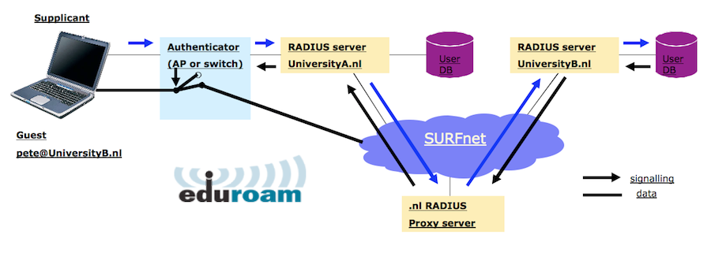

 

Figure SWN 5: The eduroam infrastructure for world-wide roaming in
academia

### End to end encryption

It should be noted that whereas WEP, WPA-PSK and WPA2-PSK are using
encryption techniques to provide access control and protect against
eavesdropping, they only protect the wireless traffic between client and
access point, not on the wired part of the communication path. In order
to protect the communication against unauthorised tampering or
eavesdropping end to end encryption is needed.

Most users are blissfully unaware that their private email, chat
conversations, and even passwords are often sent “in the clear” over
dozens of untrusted networks before arriving at their ultimate
destination on the Internet. However mistaken they may be, users still
typically have some expectation of privacy when using computer networks.
Privacy can be achieved, even on untrusted networks such as public
access points and the Internet. The only proven effective method for
protecting privacy is the use of strong end-to-end encryption. These
techniques work well even on untrusted public networks, where
eavesdroppers are listening and possibly even manipulating data coming
from an access point.

To ensure data privacy, good end-to-end encryption should provide the
following features:

#### Verified authentication of the remote end.

The user should be able to know without a doubt that the remote end is
who it claims to be. Without authentication, a user could give sensitive
data to anyone claiming to be the legitimate service.

#### Strong encryption methods.

The encryption algorithm should stand up to public scrutiny, and not be
easily decrypted by a third party. There is no security in obscurity,
and strong encryption is even stronger when the algorithm is widely
known and subject to peer review.

 

A good algorithm with a suitably large and protected key can provide
encryption that is unlikely to be broken by any effort in our lifetimes
using current technology. Beware of product vendors who assure you that
their proprietary encryption using trade-secret algorithms are better
than open, peer-reviewed ones.

#### Public key cryptography.

While not an absolute requirement for end-to-end encryption, the use of
public key cryptography instead of a shared key can ensure that an
individual's data remains private, even if the key of another user of
the service is compromised. It also solves certain problems with
distributing keys to users over untrusted networks.

#### Data encapsulation.

A good end-to-end encryption mechanism protects as much data as
possible. This can range from encrypting a single email transaction to
encapsulation of all IP traffic, including DNS lookups and other
supporting protocols. Some encryption tools simply provide a secure
channel that other applications can use. This allows users to run any
program they like and still have the protection of strong encryption,
even if the programs themselves dont support it.

 

Be aware that laws regarding the use of encryption vary widely from
place to place.

Some countries treat encryption as munitions, and may require a permit,
escrow of private keys, or even prohibit its use altogether.

Before implementing any solution that involves encryption, be sure to
verify that use of this technology is permitted in your local area.

In the following sections, we'll take a look at some specific tools that
can provide good protection for your user's data.

#### TLS

The most widely available end-to-end encryption technology is Transport
Layer Security, known simply as TLS (or its predecessor SSL: Secure
Sockets Layer).

Built into virtually all web browsers and many other applications, TLS
uses public key cryptography and a trusted public key infrastructure
(PKI) to secure data communications on the web.

Whenever you visit a web URL that starts with https, you are using TLS.

 

The TLS implementation built into web browsers includes a collection of
certificates from organisations called Certificate Authorities (CA).

A CA validates the identity of network users and/or providers and
ensures that they are who they say they are and issues a certificate
saying so.

Rather than doing this by a signed fancy document suitable for framing,
this is done through the exchange of cryptographic keys.

 

As an example, someone wanting a certificate for their website submits a
Certificate Request (CR), encoded ("signed") with a cryptographic key
created specifically for signing the certificate request.

 

They submit this request to the CA, who then "signs" the request with
their own key. These are encoded in the certificate along with the exact
name of the website that the requester wants the certificate to be valid
for.

 

For example,
[WWW.AIPOTU.GOV,](http://WWW.AIPOTU.GOV/)from
a certificate perspective, is not the same as AIPOTU.GOV. Each site
would require its own certificate to present to a browser to do
authenticated HTTPS transactions.

If the owner of AIPOTU.GOV domain only has their certificate issued for
AIPOTU.GOV and not also
[WWW.AIPOTU.GOV,](http://WWW.AIPOTU.GOV/)a
user accessing the "WWW" address will see a warning for an invalid
certificate for that site. This can be confusing to some users and, over
time, lead them to just expect TLS Certificate warnings from their
browser as normal when the truth is completely the opposite case.

 

When you browse to a website that uses TLS, the browser and the server
first exchange certificates.

 

The browser then verifies that the hostname in the certificate provided
by the server matches the DNS hostname that the browser knows the server
by, that the certificate has not expired or been revoked and that it has
been signed by a trusted certificate authority.

The server optionally verifies the validity of the browser's
certificate. If the certificates are approved, both sides then negotiate
a master session key using the previously exchanged certificates to
protect the session that is being established.

 

That key is then used to encrypt all communications until the browser
disconnects.

This kind of data encapsulation is known as a tunnel.

 

Figure SWN 6: Eavesdroppers must break strong encryption to monitor
traffic over an encrypted tunnel. The conversation inside the tunnel is
identical to any other unencrypted conversation.

 

The use of certificates with a PKI not only protects communication
against eavesdroppers but is also used to prevent the so-called Man-in-
the-Middle (MitM) attack. In a MitM attack, a malicious user intercepts
all communication between a client and a server. By presenting
counterfeit certificates to both the client and the server, a malicious
user could carry on two simultaneous encrypted sessions. Since this user
knows the secret on both connections, it is trivial to observe and
manipulate the data being passed between the client and the server.

 

 

Figure SWN 7: The man-in-the-middle effectively controls everything the
user sees, and can record and manipulate all traffic. Without a public
key infrastructure to verify the authenticity of keys, strong encryption
alone cannot protect against this kind of attack.

Use of a good PKI can significantly reduce the chances of this kind of
attack. In order to be successful, the malicious user would have to be
in possession of a certificate signed by a trusted CA that it can
present to the client to accept as authentic.

This is only possible if they can trick the end-user into accepting it
or if the CA is compromised.

 

Certificate Authorities bear a special burden to protect their systems
and network from unauthorised access and malicious users.

If a CA were to be compromised, the attacker who performed the
compromise could conduct MiTM attacks on any of the users trying to
connect to systems with a certificate issued by that CA.

They could also issue counterfeit certificates in response to legitimate
certificate requests, ensuring their ability to intercept or interfere
with encrypted communications between browser users and servers.

While CA compromise was once held to be very unlikely to happen, there
have been a number of incidents at the time of this writing proving this
is no longer the case.

Companies whose primary activity was in acting as a commercial CA have
gone out of business as a result of having their systems compromised and
counterfeit certificates issued under their name.

 

In September 2011, the certificate authority DigiNotar was found to have
been subverted by crackers, forcing all its certificates to be revoked
and sending it into bankruptcy.

 

These compromises were not the result of sophisticated computer
criminals employing exotic sophisticated attacks but simply lapses in
the security of their overall infrastructure and security policies and
procedures.

Finally, it is good to point out that TLS is not only used for web
browsing. Insecure email protocols such as IMAP, POP, and SMTP can be
secured by wrapping them in an TLS tunnel.

 

Most modern email clients support IMAPS and POPS (secure IMAP and POP)
as well as TLS protected SMTP. If your email server does not provide TLS
support, you can still secure it with TLS using a package like Stunnel
[(http://www.stunnel.org/).](http://www.stunnel.org/)))TLS
can be used to effectively secure just about any service that runs over
TCP.

#### SSH

Most people think of SSH as a secure replacement for telnet, just as SCP
and SFTP are the secure counterparts of RCP and FTP.

 

But SSH is much more than an encrypted remote shell. For example, it can
also act as a general purpose encrypting tunnel, or even an encrypting
web proxy.

 

By first establishing an SSH connection to a trusted location near (or
even on) a remote server, insecure protocols can be protected from
eavesdropping and attack.

 

Like TLS, it uses strong public key cryptography to verify the remote
server and encrypt data. Instead of a PKI, it uses a key fingerprint
cache that is checked before a connection is permitted.

It can use passwords and public keys for user authentication, and,
through its support for the Pluggable Authentication Modules (PAM)
system, it can also support other methods of authentication.

 

While this technique may be a bit advanced for many users, network
architects can use SSH to encrypt traffic across untrusted links, such
as wireless point-to-point links.

 

Since the tools are freely available and run over standard TCP, any
educated user can implement SSH connections for themselves, providing
their own end-to-end encryption without administrator intervention.
OpenSSH
[(http://openssh.org/](http://openssh.org/))))is
probably the most popular implementation on Unix-like platforms.

 

Free implementations such as Putty
[(http://www.putty.nl/](http://www.putty.nl/)))and WinSCP
([http://winscp.net/](http://winscp.net/)) are available for Windows.

OpenSSH will also run on Windows under the Cygwin package
[(http://www.cygwin.com](http://www.cygwin.com/))/) These examples will
assume that you are using a recent version of OpenSSH.

 

Figure SWN 8: The SSH tunnel protects web traffic up to the SSH server
itself.

 

To establish an encrypted tunnel from a port on the local machine to a
port on the remote side, use the -L switch. For example, suppose

you want to forward web proxy traffic over an encrypted link to the
squid server at squid.example.net. Forward port 3128 (the default proxy
port) using this command:

 

ssh -fN -g -L3128:squid.example.net:3128 squid.example.net

 

The -fN switches instruct ssh to fork into the background after
connecting.

 

The -g switch allows other users on your local segment to connect to the
local machine and use it for encryption over the untrusted link.

 

OpenSSH will use a public key for authentication if you have set one up,
or it will prompt you for your password on the remote side. You can then
configure your web browser to connect to localhost port 3128 as its web
proxy service.

All web traffic will then be encrypted before transmission to the remote
side. SSH can also act as a dynamic SOCKS4 or SOCKS5 proxy. This allows
you to create an encrypting web proxy, without the need to set up squid.
Note that this is not a caching proxy; it simply encrypts all traffic:

 

ssh -fN -D 8080 remote.example.net

 

Configure your web browser to use SOCKS4 or SOCKS5 on local port 8080,
and away you go.

 

SSH can encrypt data on any TCP port, including ports used for email. It
can even compress the data along the way, which can decrease latency on
low capacity links:

 

ssh -fNCg -L110:localhost:110 -L25:localhost:25 mailhost.example.net

 

The -C switch turns on compression.

 

You can add as many port forwarding rules as you like by specifying the
-L switch multiple times.

Note that in order to bind to a local port less than 1024, you must have
root privileges on the local machine. These are just a few examples of
the flexibility of SSH. By implementing public keys and using the ssh
forwarding agent, you can automate the creation of encrypted tunnels
throughout your wireless network, and protect your communications with
strong encryption and authentication.

#### OpenVPN

OpenVPN is a VPN implementation built on SSL encryption with both a
commercially-licensed and an Open Source "community" edition.

There are OpenVPN client implementations for a wide range of operating
systems including Linux, Window 2000/XP and higher, OpenBSD, FreeBSD,
NetBSD, and Mac OS X. Many users find it easier to understand and
configure than IPSEC VPNs.

OpenVPN has some disadvantages though, such as fairly high latency of
traffic over the VPN tunnel.

Some amount of latency is unavoidable since all encryption/decryption is
done in user space, but using relatively new computers on either end of
the tunnel can minimise this.

While it can use traditional shared keys for authentication, OpenVPN
really shines when used with SSL certificates and a certificate
authority.

OpenVPN has many advantages that make it a good option for providing
end-to-end security. Some of these reasons include:

 

-   •it is based on proven, robust, encryption protocols (SSL and RSA) 

-   •it is relatively easy to configure. It functions across many
    different platforms 

-   •it is well-documented. An Open-Source "Community" version is
    maintained in addition to a for-pay commercial version. 

 

OpenVPN needs to connect to a single TCP or UDP port on the remote side.
Once established, it can encapsulate all data down to the Networking
layer, or even down to the Data-Link layer, if your solution requires
it. You can use it to create robust VPN connections between individual
machines, or simply use it to connect network routers over untrusted
wireless networks.

VPN technology is a complex field, and is a bit beyond the scope of this
section to go into more detail. It is important to understand how VPNs
fit into the structure of your network in order to provide the best
possible protection without opening up your organisation to
unintentional problems.

 

There are many good online resources that deal with installing OpenVPN
on a server and client, we recommend this article from Linux Journal:

[http://www.linuxjournal.com/article/7949](http://www.linuxjournal.com/article/7949)

as well as the official HOWTO:

[http://openvpn.net/howto.html](http://openvpn.net/howto.html)

### Tor & Anonymizers

The Internet is basically an open network based on trust.

 

When you connect to a web server across the Internet, your traffic
passes through many different routers, owned by a great variety of
institutions, corporations and individuals.

In principle, any one of these routers has the ability to look closely
at your data, seeing the source and destination addresses, and quite
often also the actual content of the data.

Even if your data is encrypted using a secure protocol, it is possible
for your Internet provider to monitor the amount of data transferred, as
well as the source and destination of that data.

Often this is enough to piece together a fairly complete picture of your
activities on-line. Privacy and anonymity are important, and closely
linked to each other. There are many valid reasons to consider
protecting your privacy by anonymizing your network traffic.

 

Suppose you want to offer Internet connectivity to your local community
by setting up a number of access points for people to connect to.

Whether you charge them for their access or not, there is always the
risk that people use the network for something that is not legal in your
country or region.

You could plead with the legal system that this particular illegal
action was not performed by yourself, but could have been performed by
anyone connecting to your network. The problem is neatly sidestepped if
it were technically infeasible to determine where your traffic was
actually headed.

 

And what about on-line censorship?

 

Publishing web pages anonymously may also be necessary to avoid
government censorship. There are tools that allow you to anonymize your
traffic in relatively easy ways.

The combination of Tor
([http://www.torproject.org](http://www.torproject.org/)) and Privoxy
([http://www.privoxy.org](http://www.privoxy.org/)) is a powerful way to
run a local proxy server that will pass your Internet traffic through a
number of servers all across the net, making it very difficult to follow
the trail of information.

Tor can be run on a local PC, under Microsoft Windows, Mac OSX, Linux
and a variety of BSD's, where it anonymizes traffic from the browser on
that particular machine.

 

Tor and Privoxy can also be installed on a gateway server, or even a
small embedded access point (such as a Linksys WRT54G) where it provides
anonymity to all network users automatically.

 

Tor works by repeatedly bouncing your TCP connections across a number of
servers spread throughout the Internet, and by wrapping routing
information in a number of encrypted layers (hence the term onion
routing), that get peeled off as the packet moves across the network.

This means that, at any given point in the network, the source and
destination addresses cannot be linked together.

 

This makes traffic analysis extremely difficult.

The need for the Privoxy privacy proxy in connection with Tor is due to
the fact that name server queries (DNS queries) in most cases are not
passed through the proxy server, and someone analysing your traffic
would easily be able to see that you were trying to reach a specific
site (say google.com) by the fact that you sent a DNS query to translate
google.com to the appropriate IP address.

 

Privoxy connects to Tor as a SOCKS4a proxy, which uses hostnames (not IP
addresses) to get your packets to the intended destination. In other
words, using Privoxy with Tor is a simple and effective way to prevent
traffic analysis from linking your IP address with the services you use
online.

 

Combined with secure, encrypted protocols (such as those we have seen in
this chapter), Tor and Privoxy provide a high level of anonymity on the
Internet.

 

 

3PLANNING AND DEPLOYMENT
========================

10. DEPLOYMENT PLANNING
-----------------------

### Estimating capacity

In order to estimate capacity, it is important to understand that a
wireless device’s listed speed (the so called data rate) refers to the
rate at which the radios can exchange symbols, not the useable
throughput you will observe. Throughput is also referred to as channel
capacity, or simply bandwidth (although this term is different from
radio bandwidth!

 

The bandwidth-throughput is measured in Mbps, while the radio bandwidth
is measures in MHz.). For example, a single 802.11g link may use 54 Mbps
radios, but it will only provide up to 22 Mbps of actual throughput. The
rest is overhead that the radios need in order to coordinate their
signals using the 802.11g protocol.

 

Note that throughput is a measurement of bits over time. 22 Mbps means
that in any given second, up to 22 megabits can be sent from one end of
the link to the other. If users attempt to push more than 22 megabits
through the link, it will take longer than one second.

Since the data can’t be sent immediately, it is put in a queue, and
transmitted as quickly as possible.

 

This backlog of data increases the time needed for the most recently
queued bits to the traverse the link.

The time that it takes for data to traverse a link is called latency,
and high latency is commonly referred to as lag.

 

Your link will eventually send all of the queued traffic, but your users
will likely complain as the lag increases.

How much throughput will your users really need?

It depends on how many users you have, and how they use the wireless
link.

Various Internet applications require different amounts of throughput.

 

Application

Requirement/ User

Notes

Text messaging / IM

\< 1 kbps

As traffic is infrequent and asynchronous, IM will tolerate high
latency.

Email

1 to 100 kbps

As with IM, email is asynchronous and intermittent, so it will tolerate
latency. Large attachments, viruses, and spam significantly add to
bandwidth usage.

Note that web email services (such as Yahoo or Hotmail) should be
considered as web browsing, not as email.

Web browsing

50 - 100+ kbps

Web browsers only use the network when data is requested. Communication
Is asynchronous, so a fair amount of lag can be tolerated.

As web browsers request more data (large images, long downloads, etc.)
bandwidth usage will go up significantly.

Streaming audio

96 - 160 kbps

Each user of a streaming audio service will use a constant amount of
relatively large bandwidth for as long as it plays.

It can tolerate some transient latency by using large buffers on the
client. But extended periods of lag will cause audio “skips” or outright
session failures.

Voice over IP (VoIP)

24 - 100+ kbps

As with streaming audio, VoIP commits a constant amount of bandwidth to
each user for the duration of the call. But with VoIP, the bandwidth is
used roughly equally in both directions. Latency on a VoIP connection is
immediate and annoying to users.

Lag greater than a few milliseconds is unacceptable for VoIP.

Streaming video

64 - 200+ kbps

As with streaming audio, some intermittent latency is avoided by using
buffers on the client. Streaming video requires high throughput and low
latency to work properly.

Peer-to-peer file sharing applications

0 - infinite Mbps

While peer to peer applications will tolerate any amount of latency,
they tend to use up all available throughput by transmitting data to as
many clients as possible, as quickly as possible. Use of these
applications will cause latency and throughput problems for all other
network users unless you use careful bandwidth shaping.

To estimate the necessary throughput you will need for your network,
multiply the expected number of users by the requirements of
applications they will probably use.

 

For example, 50 users who are chiefly browsing the web will likely
consume 2.5 to 5 Mbps or more of throughput at peak times, and will
tolerate some latency.

 

On the other hand, 50 simultaneous VoIP users would require 5 Mbps or
more of throughput in both directions with low latency. Since 802.11g
wireless equipment is half duplex (that is, it only transmits or
receives, never both at once) you should accordingly double the required
throughput, for a total of 10 Mbps.

 

Your wireless links must provide that capacity every second, or
conversations will lag.

Since all of your users are unlikely to use the connection at precisely
the same moment, it is common practice to oversubscribe available
throughput by some factor (that is, allow more users than the maximum
available bandwidth can support).

 

Oversubscribing by a factor of 5 to 10 is quite common. In all
likelihood, you will oversubscribe by some amount when building your
network infrastructure.

 

By carefully monitoring throughput throughout your network, you will be
able to plan when to upgrade various parts of the network, and how much
additional resources will be needed.

### Calculating the link budget

Determining if a link is feasible or not is a process called link budget
calculation and can be either performed manually or using specialised
tools.

A basic communication system consists of two radios, each with its
associated antenna, the two being separated by the path to be covered as
shown in following Figure DP 1.

 

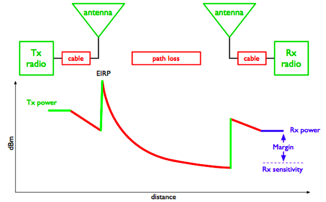

 

Figure DP 1: Components of a Basic Communication System.

 

In order to have a communication between the two, the radios require a
certain minimum signal to be collected by the antennas and presented at
their input ports.

Whether or not signals can be passed between the radios depends on the
characteristics of the equipment and on the diminishment of the signal
due to distance, called path loss. In such a system, some of the
parameters can be modified (the equipment used) while others are fixed
(the distance between the radios). Let’s start by examining the
parameters that can we can modify.

 

​1. The characteristics of the equipment to be considered when
calculating the link budget are:

 

Transmit (TX) Power. It is expressed in milliwatts or in dBm. TX power
is often dependent on the transmission rate.

The TX power of a given device should be specified in the literature
provided by the manufacturer.

 

An example is shown here following, where you can see that using 802.11g
there is a difference of 5 dB in output power when using 6 Mbs or 54
Mbs.

 

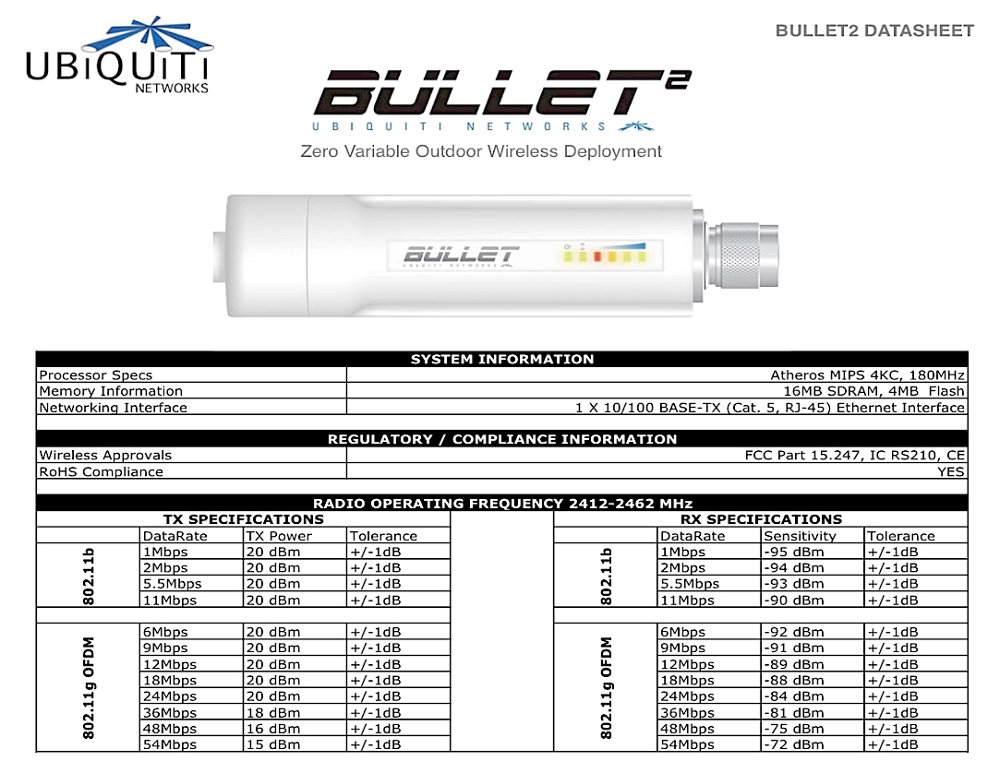

 

Figure DP 2: Ubiquiti Bullet2 Datasheet

 

Antenna Gain.

Antennas are passive devices that create the effect of amplification by
virtue of their physical shape.

Antennas have the same characteristics when receiving and transmitting.
So a 12 dBi antenna is simply a 12 dBi antenna, without specifying if it
is in transmission or reception mode.

Typical values are as follows: parabolic antennas have a gain of 19-24
dBi; omnidirectional antennas have 5- 12 dBi; sectorial antennas have
roughly a 12-15 dBi gain.

 

Minimum Received Signal Level (RSL), or simply, the sensitivity of the
receiver.

The minimum RSL is always expressed as a negative dBm (-dBm) and is the
lowest signal level the radio can distinguish.

The minimum RSL is dependent upon rate, and as a general rule the lowest
rate (1 Mbps) has the greatest sensitivity.

The minimum will be typically in the range of -75 to -95 dBm.

 

Like TX power, the RSL specifications should be provided by the
manufacturer of the equipment.

In the datasheet presented above you can see that there is a 20 dB
difference in receiver sensitivity, with -92 dBm at 6 Mbs and -72 dBm at
54 Mbs. Don’t forget that a difference of 20 dB means a ratio of 100 in
terms of power!

 

Cable Losses. Some of the signal's energy is lost in the cables, the
connectors and other devices, going from the radios to the antennas. T

he loss depends on the type of cable used and on its length.

 

Signal loss for short coaxial cables including connectors is quite low,
in the range of 2-3 dB. It is better to have cables as short as
possible. Equipment now tends to have embedded antennas and thus the
cable length is very short.

 

​2. When calculating the path loss, several effects must be considered.
One has to take into account the free space loss, attenuation and
scattering.

 

Free Space Loss.

Geometric spreading of the wavefront, commonly known as free space loss,
diminishes signal power. Ignoring everything else, the further away the
two radios, the smaller the received signal is due to free space loss.
This is independent of the environment, it depends only on the distance.
This loss happens because the radiated signal energy expands as a
function of the distance from the transmitter.

 

Using decibels to express the loss and using a generic frequency f, the
equation for the Free Space Loss is:

 

Lfsl = 32.4+20\*log10(D)+20\*log10(f)

 

where Lfsl is expressed in dB and D is in kilometres and f is in MHz.

When plotting the free space loss vs the distance, one gets a figure
like the one below. What should be noted is that the difference between
using 2400 MHz and 5300 MHz is 6 dB in terms of free space loss.

So the higher frequency gives a higher free space loss, which is usually
balanced by a higher gain in the parabolic antennas.

 

A parabolic antenna operating at 5 GHz is 6 dB more powerful than one
operating at 2.4 GHz, for the same antenna dimensions.

Having two antennas of 6 dB higher gain on each side, provides a net 6
dB advantage when migrating from 2.4 to 5 GHz.

 

 

Figure DP 3: Free Space Path Loss calculation graph.

 

Attenuation

The second contribution to the path loss is attenuation.

This takes place as some of the power is absorbed when the wave passes
through solid objects such as trees, walls, windows and floors of
buildings.

Attenuation can vary greatly depending upon the structure of the object
the signal is passing through, and it is very difficult to quantify.

 

Scattering

Along the link path, the RF energy leaves the transmitting antenna and
energy spreads out. Some of the RF energy reaches the receiving antenna
directly, while some bounces off the ground. Part of the RF energy which
bounces off the ground reaches the receiving antenna. Since the
reflected signal has a longer way to travel, it arrives at the receiving
antenna later than the direct signal. This effect is called multipath,
or signal dispersion. In some cases reflected signals add together and
cause no problem.

When they add together out of phase, the received signal is almost
worthless. In some cases, the signal at the receiving antenna can be
zeroed by the reflected signals.

This is known as extreme fading, or nulling. There is a simple technique
that is used to deal with multipath, called antenna diversity.

It consists of adding a second antenna to the radio. Multipath is in
fact a very location-specific phenomenon.

 

If two signals add out of phase at one location, they will not add
destructively at a second, nearby location.

If there are two antennas, at least one of them should be able to
receive a useable signal, even if the other is receiving a faded one. In
commercial devices, antenna switching diversity is used: there are
multiple antennas on multiple inputs, with a single receiver.

 

The signal is received through only one antenna at a time.

When transmitting, the radio uses the antenna last used for reception.
The distortion given by multipath degrades the ability of the receiver
to recover the signal in a manner much like signal loss.

Putting all these parameters together leads to the link budget
calculation. If you are using different radios on the two sides of the
link, you should calculate the path loss twice, once for each direction
(using the appropriate TX power, RX power, TX antenna gain, RX antenna
gain for each calculation).

 

Adding up all the gains and subtracting all the losses gives:

 

                TX Power                 Radio 1

                +Antenna Gain                Radio 1

                -Cable Losses                 Radio 1

                +Antenna Gain                Radio 2

                -Cable Losses                 Radio 2

                =Total Gain

 

Subtracting the Path Loss from the Total Gain:

 

Total Gain - Path Loss = Signal Level at receiving side of the link

 

If the resulting signal level is greater than the minimum received
signal level of the receiving radio, then the link is feasible!

The received signal is powerful enough for the radio to use it.

 

Remember that the minimum RSL is always expressed as a negative dBm, so
-56 dBm is greater than -70 dBm.

 

On a given path, the variation in path loss over a period of time can be
large, so a certain margin should be considered.

This margin is the amount of signal above the sensitivity of radio that
should be received in order to ensure a stable, high quality radio link
during bad weather and other atmospheric disturbances.

 

A margin of 10 to 15 dB is fine. To give some space for attenuation and
multipath in the received radio signal, a margin of 20dB should be safe
enough.

 

Once you have calculated the link budget in one direction, repeat the
calculation for the other direction.

Substitute the transmit power for that of the second radio, and compare
the result against the minimum received signal level of the first radio.

 

Example link budget calculation

As an example, we want to estimate the feasibility of a 5 km link, with
one access point and one client radio.

 

-   •The access point is connected to an omni directional antenna with a
    10dBi gain, while the client is connected to a directional antenna
    with 14 dBi gain.  

-   •The transmitting power of the AP is 100 mW (or 20 dBm) and its
    sensitivity is -89 dBm.  

-   •The transmitting power of the client is 30 mW (or 15 dBm) and its
    sensitivity is -82 dBm.  

-   •The cables are short, so we can estimate a loss of 2 dB at each
    side.  

 

Let’s start by calculating the link budget from the AP to the client, as
shown in Figure DP 4.

 

 

 

 

Figure DP 4: Link Budget calculation from AP to client.

 

Adding up all the gains and subtracting all the losses for the AP to
client link gives:

 

                 20 dBm        (TX Power Radio 1)

                +10 dBi                (Antenna Gain Radio 1)

                 -2 dB                (Cable Losses Radio 1)

                +14 dBi                (Antenna Gain Radio 2)

                 -2 dB                (Cable Losses Radio 2)

                 40 dB=        Total Gain

 

The path loss for a 5 km link, considering the free space loss is
-114dB. Subtracting the path loss from the total gain:

 

40 dB - 114 dB = -74 dB

 

Since -74 dB is greater than the minimum receive sensitivity of the
client radio (-82 dBm), the signal level is just enough for the client
radio to be able to hear the access point. There is only 8 dB of margin
(82 dB - 74 dB) which will likely work fine in fair weather, but may not
be enough to protect against extreme weather conditions.

Next we calculate the link from the client back to the access point, as
shown on the next page.

 

Figure DP 5: Link Budget calculation from client to AP.

 

                 15 dBm        (TX Power Radio 2)

                +14 dBi                (Antenna Gain Radio 2)

                -2 dB                (Cable Losses Radio 2)

                +10 dBi                (Antenna Gain Radio 1)

                -2 dB                (Cable Losses Radio 1)

                 35 dB =        Total Gain

 

Obviously, the path loss is the same on the return trip. So our received
signal level on the access point side is:

 

35 dB - 114 dB = -79 dB

 

Since the receive sensitivity of the AP is -89dBm, this leaves us 10dB
of margin (89dB - 79dB). Overall, this link will probably work fine.

By using a 24dBi dish on the client side rather than a 14dBi antenna, we
will get an additional 10dBi of gain on both directions of the link
(remember, antenna gain is reciprocal).

 

A more expensive option would be to use higher power radios on both ends
of the link, but note that adding an amplifier or higher-powered card to
one end generally does not help the overall quality of the link.

 

 

 

#### Tables for calculating link budget

To calculate the link budget, simply approximate your link distance, and
then fill in the following tables:

 

Free Space Path Loss at 2.4 GHz

Distance (m)

100

500

1000

3000

5000

10000

Loss (dB)

80

94

100

110

114

120

 

 

Antenna Gain:

Radio 1 Antenna

+ Radio 2 Antenna

= Total Antenna Gain

 

 

 

Losses:

Radio 1 + Cable Loss (dB)

Radio 2 + Cable Loss (dB)

Free Space Path Loss (dB)

= Total Loss (dB)

 

 

 

 

Link Budget for Radio 1        Radio 2:

Radio 1 TX Power

+ Antenna Gain

- Total Loss

= Signal

\> Radio 2 Sensitivity

 

 

Link Budget for Radio 2        Radio 1:

Radio 2 TX Power

+ Antenna Gain

- Total Loss

= Signal

\> Radio 1 Sensitivity

 

 

If the received signal is greater than the minimum received signal
strength in both directions of the link, as well as any noise received
along the path, then the link is possible.

### Link planning software

While calculating a link budget by hand is straightforward, there are a
number of tools available that will help automate the process. In
addition to calculating free space loss, these tools will take many
other relevant factors into account as well (such as tree absorption,
terrain effects, climate, and even estimating path loss in urban areas).
Most commercial tools are very expensive and are often designed to be
used with specific hardware. In this section we will discuss a free tool
called RadioMobile.

#### RadioMobile

Radio Mobile is a tool for the design and simulation of wireless
systems. It predicts the performance of a radio link by using
information about the equipment and a digital map of the area. It is
public domain software but it is not open source. Radio Mobile uses a
digital terrain elevation model for the calculation of coverage,
indicating received signal strength at various points along the path. It
automatically builds a profile between two points in the digital map
showing the coverage area and first Fresnel zone. An example is shown in
Figure DP 6 below.

 

 

Figure DP 6: Radio Mobile simulation showing a digital terrain elevation
and first Fresnel zone.

 

During the simulation, it checks for line of sight and calculates the
Path Loss, including losses due to obstacles.

It is possible to create networks of different topologies, including net
master/slave, point-to-point, and point-to-multipoint. The software
calculates the coverage area from the base station in a
point-to-multipoint system. It works for systems having frequencies from
100 kHz to 200 GHz. Digital elevation maps (DEM) are available for free
from several sources, and are available for most of the world.

DEMs do not show coastlines or other readily identifiable landmarks, but
they can easily be combined with other kinds of data (such as aerial
photos or topographical charts) in several layers to obtain a more
useful and readily recognisable representation. You can digitise your
own maps and combine them with DEMs. The digital elevation maps can be
merged with scanned maps, satellite photos and Internet map services
(such as Google Maps) to produce accurate prediction plots.

There are two versions of RadioMobile: a version running on Windows and
a version running online via a web interface. Here are the main
differences between the two.

 

Web version:

-   •it can run on any machine (Linux, Mac, Windows, tablet, phone,
    etc) 

-   •it does not require big downloads. As it runs online, data is
    stored on the server and only the necessary data is downloaded. 

-   •it saves sessions. If you run a simulation and login after some
    time, you will still find your simulation and the results. 

-   •it is easier to use, especially for beginners. 

-   •it requires connectivity. It is not possible to run a simulation if
    you are offline. 

-   •as it has been developed for the community of radio amateurs, it
    can work only for certain frequency bands. As an example, it is not
    possible to simulate links at 5.8GHz but only at 5.3GHz. This is
    good enough from a practical point of view, but one has to keep it
    in mind. 

 

Windows version:

-   •it can run offline. Once the maps are downloaded, there is no need
    to be online to run the simulation. 

-   •one can use an external GPS to get the exact position of the
    station. While this is not often used, it could be useful
    sometimes. 

-   •it runs on Windows (it does run in Linux but not directly). 

-   •it requires big downloads. If your bandwidth is limited,
    downloading many maps might be a problem. The online version
    requires smaller downloads. 

-   •It is not user friendly, especially for beginners. 

 

The main RadioMobile webpage, with examples and tutorials, is available
at:
[http://www.cplus.org/rmw/english1.html](http://www.cplus.org/rmw/english1.html)

Follow the instructions to install the software on Windows.

#### RadioMobile online

To use the online version of RadioMobile you must first create an
account. Go to:
[http://www.cplus.org/rmw/rmonline.html](http://www.cplus.org/rmw/rmonline.html)and
create a new account. You will receive a confirmation email in few
minutes and will be ready to go.

Simulating a link requires some steps that require following the menu on
the left, from top to bottom as shown in Figure DP 7 below.

 

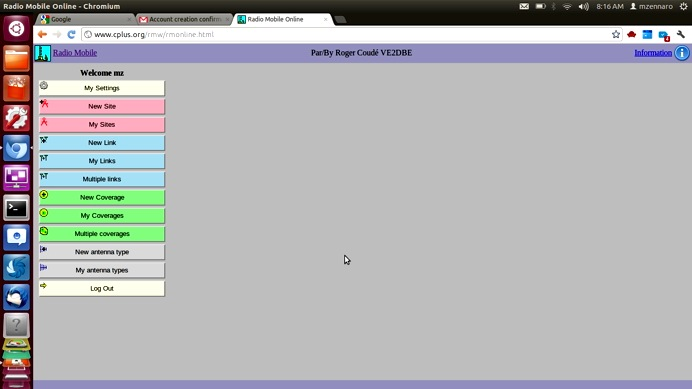

 

Figure DP 7: Preparing to simulate a link using Radio Mobile.

 

The first step is to click on New Site. You will be presented a Map,
similar to Google Maps. You can zoom into the map to find the location
of your first site. Drag the Orange Placemark and place it in the
desired position. Once you are done, click on Submit.

 

Give the location a meaningful name, and click on Add to My Sites. In
this way, you will be able to use this location for the simulation.

Repeat the same process for the second site.

Once you have at least two sites, you can proceed with the next step.
The interface will not allow you to enter directly the coordinates of
the site, so you might want to enter an approximate position for the
cursor and then afterward correct the value of the coordinates in the
table.

The second step involves entering information about the link: the
equipment characteristics, the antennas, etc.

Click on New Link in the menu on the left. Select the two sites from the
drop-down menus. Enter a meaningful name for the link and enter the
information about the equipment use. The sensitivity of the receiver is
expressed in microVolts, while we usually use dBm.

 

To translate from microVolts to dBm, here are some examples:

 

-90dBm is 7.07 microvolts

-85dBm is 12.6 microvolts

-80dBm is 22.4 microvolts

-75dBm is 39.8 microvolts

-70dBm is 70.7 microvolts

 

It is very important to choose a frequency that RadioMobile online can
handle.

Here are the most important frequencies for WiFi links:

 

Use 2300 MHz for 2.4 GHz links and 5825 MHz for 5.8 GHz links.

 

Once you have entered all the information, click on Submit. In a short
time, you will be presented a figure similar to the one below.

 

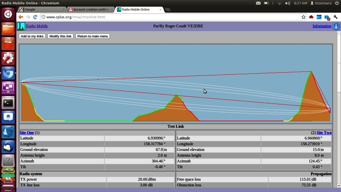

 

Figure DP 8: Output of the simulation.

 

This page has all the necessary information to understand if the link is
feasible or not.

It gives information on: the link length, the azimuth, elevation and
tilt you should give to antennas, the free space loss, the total space
loss including the statistical loss and, most importantly, the received
signal level.

With the receiver sensitivity you entered, you will be presented with
the fade margin and you will be able to determine if the link is
feasible or not. If you are happy with the result, at the top of the
page you should click on Add to my sites and the link will be stored. If
you are not satisfied and want to simulate a different equipment setup,
click on Modify this link.

#### Radio Mobile for Windows in simple steps

This is an abridged guide to start using Radio Mobile after
installation. Every parameter not specified here can be left at the
default value and later modified if needed.

 

Step 1: download the digital elevation maps (DEMs) of your area of
interest. choose SRTM format.

Step 2: create a map. In “File” →” Map properties”, choose the midpoint
of your area of interest as the coordinates for your map and a size in
km large enough to encompass all your points. Use 514X514 pixels for
now. You can add another type of map (like one with roads) to the raw
DEM if you like.

Step 3: Create systems. In “File” →” Network properties” →”Systems”.
Each one is a combination of TX power, RX sensitivity and antenna gain.
Select omni antenna even if your antenna is directional, but insert the
real gain.

Step 4: create units. Each unit has a name and a geographical
position.You can use degrees, minutes, seconds or degrees and fractions,
but make sure to select the proper hemisphere (N or S, E or W).

Step 5: Assign roles: select item “Networks properties” from the menu
“File”. Then go to the tab “Membership” where you will be allowed to
edit the system and role for each unit. Enable each unit in the list
with a checkmark. Assign a name to your network and in the ”parameters”
tab set the minimum and maximum frequency of operation in MHz.

Step 6: View your network on the map. Select “View” →”Show
networks”→”All”

 

Step 7: Obtain the profile and point to point link budget. “Tools”
→”Radio link”. You can switch to the detailed view that gives you a

textual description of the output of the simulation.

Step 8: View coverage: go to “Tools” → “Radio coverage” → “Single polar”
to obtain the coverage of each station. Here the type of antenna becomes
relevant. If it is not an omni you should edit the antenna pattern and
the orientation of the boresight (direction where the beam is pointing).

#### Using Google Earth to obtain an elevation profile

Google Earth is a very popular mapping application. It can be used to
obtain the elevation profile between two points and therefore determine
the existence (or not) of the optical line of sight. The radioelectric
line of sight can be derived from the optical one by adding the effect
of the earth curvature (by using the modified radius of the earth) and
the requirements for clearing the first Fresnel zone.

#### The procedure is the following:

Install Google Earth in your device, launch the application and zoom
into the map so you can see the two points that you want to link.

 

1.  1.In the upper menu, click on "Add path" 

2.  2.Click to set the first point and then for the second point 

3.  3.Give the connection a name ("Link" for example) and click OK in
    the pop-up window 

4.  4.The connection appears in the menu on the left 

5.  5.Right click on the name of the connection ("Link" in our example) 

6.  6.Select "Show elevation profile" 

7.  7.The elevation profile appears at the bottom on the screen 

8.  8.If you move along the profile, you will see a red arrow showing
    where the point is in the map 

### Avoiding noise

The unlicensed ISM and U-NII bands represent a very tiny piece of the
known electromagnetic spectrum. Since this region can be utilised
without paying license fees, many consumer devices use it for a wide
range of applications.

 

Cordless phones, analog video senders, Bluetooth, baby monitors, and
even microwave ovens compete with wireless data networks for use of the
very limited 2.4 GHz band.

These signals, as well as other local wireless networks, can cause
significant problems for long-range wireless links. Here are some steps
you can use to reduce reception of unwanted signals.

 

Increase antenna gain on both sides of a point-to-point link. Antennas
not only add gain to a link, but their increased directionality tends to
reject noise from areas around the link.

 

Two high gain dishes that are pointed at each other will reject noise
from directions that are outside the path of the link. Using
omnidirectional antennas will receive noise from all directions.

 

 

 

Figure DP 9: A single omnidirectional antenna vs. multiple sectorials.

 

Use sectorials instead of using an omnidirectional.

 

By making use of several sectorial antennas, you can reduce the overall
noise received at a distribution point.

 

By staggering the channels used on each sectorial, you can also increase
the available bandwidth to your clients.

Don’t use an amplifier. Amplifiers can make interference issues worse by
indiscriminately amplifying all received signals, including sources of
interference. Amplifiers also cause interference problems for other
nearby users of the band.

 

Use the best available channel. Remember that 802.11b/g channels are 22
MHz wide, but are only separated by 5 MHz.

Perform a site survey, and select a channel that is as far as possible
from existing sources of interference. Remember that the wireless
landscape can change at any time as people add new devices (cordless
phones, other networks, etc.) If your link suddenly has trouble sending
packets, you may need to perform another site survey and pick a
different channel.

 

If possible, use 5.8 GHz. While this is only a short-term solution,
there is currently far more consumer equipment installed in the field
that uses 2.4 GHz. Using 802.11a you will avoid this congestion
altogether.

 

If all else fails, use licensed spectrum. There are places where all
available unlicensed spectrum is actually used. In these cases, it may
make sense to spend the additional money for obtaining the respective
license and deploy equipment that uses a less congested band. For long
distance point-to-point links that require very high throughput and
maximum uptime, this is certainly an option. Of course, these features
come at a much higher price tag compared to unlicensed equipment.

Recently equipment in the 17 GHz and 24 GHz bands have become available.

Although it is considerably more expensive, it also offers much greater
bandwidth, and in many countries these frequencies are unlicensed.

 

To identify sources of noise, you need tools that will show you what is
happening in the air at 2.4 GHz. We will see some examples of these
tools in the chapters called Network Monitoring and Maintenance and
Troubleshooting.

 

 

 

### Repeaters

The most critical component to building long distance network links is
line of sight (often abbreviated as LOS).

Terrestrial microwave systems simply cannot tolerate large hills, trees,
or other obstacles in the path of a long distance link. You must have a
clear idea of the lay of the land between two points before you can
determine if a link is even possible. But even if there is a mountain
between two points, remember that obstacles can sometimes be turned into
assets.

 

Mountains may block your signal, but assuming power can be provided they
also make very good repeater sites.

Repeaters are nodes that are configured to rebroadcast traffic that is
not destined for the node itself. In a mesh network, every node is a
repeater. In a traditional infrastructure network, repeater nodes must
be configured to pass along traffic to other nodes. A repeater can use
one or more wireless devices.

When using a single radio (called a one-arm repeater), overall
efficiency is slightly less than half of the available bandwidth, since
the radio can either send or receive data, but never both at once. These
devices are cheaper, simpler, and have lower power requirements.

 

A repeater with two (or more) radio cards can operate all radios at full
capacity, as long as they are each configured to use non-overlapping
channels.

Of course, repeaters can also supply an Ethernet connection to provide
local connectivity.

Repeaters can be purchased as a complete hardware solution, or easily
assembled by connecting two or more wireless nodes together with
Ethernet cable.

 

When planning to use a repeater built with 802.11 technology, remember
that nodes must be configured for master, managed, or ad-hoc mode.

Typically, both radios in a repeater are configured for master mode, to
allow multiple clients to connect to either side of the repeater. But
depending on your network layout, one or more devices may need to use
ad-hoc or even client mode.

 

Figure DP 10: The repeater forwards packets over the air between nodes
that have no direct line of sight.

 

Typically, repeaters are used to overcome obstacles in the path of a
long distance link. For example, there may be buildings in your path,
but those buildings contain people. Arrangements can often be worked out
with building owners to provide bandwidth in exchange for roof rights
and electricity. If the building owner isn’t interested, tenants on high
floors may be able to be persuaded to install equipment in a window. If
you can’t go over or through an obstacle, you can often go around it.
Rather than using a direct link, try a multi-hop approach to avoid the
obstacle.

 

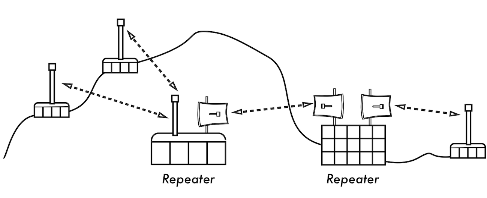

Figure DP 11: No power was available at the top of the hill, but it was
circumvented by using multiple repeater sites around the base.

 

Finally, you may need to consider going backwards in order to go
forwards. If there is a high site available in a different direction,
and that site can see beyond the obstacle, a stable link can be made via
an indirect route.

 

Figure DP 12: Site D could not make a clean link to site A or B, since
site C is in the way and is not hosting a node. By installing a high
repeater, nodes A, B, and D can communicate with each other. Note that
traffic from node D actually travels further away from the rest of the
network before the repeater forwards it along.

### Deployment planning for IPv6

As we mentioned in the chapter called Networking, most regions of the
world have either exhausted or nearly exhausted their IPv4 addresses.
Therefore it is important that you build into your planning the
deployment of IPv6 based networks.

 

It is understood that at the time of writing there are still many sites
and services that are still only available by IPv4.

 

So in order to become a leader in deploying IPv6, you will need to be
able to interconnect with legacy IPv4 networks as well as teach and
guide your users and developers how to handle IPv6 alongside IPv4.

 

By leading the way in deploying IPv6 in your network you will be at the
forefront of the Internet and recognised as someone who is prepared to
be aware of and support the next generation of networking.

 

 

 

 

In preparing for IPv6 here are some steps you can take to help move you
in the right direction -

 

1.  1.Dont buy routers, firewalls and other IP equipment that process
    IPv4 packets in hardware at full speed and only process IPv6 packets
    more slowly in software or worse still dont handle IPv6 at all. The
    vast majority of available network devices support IPv6. RIPE has
    prepared some requirements to be added into any call for tender to
    ensure that IPv6 is included: 

    http://www.ripe.net/ripe/docs/current -ripe-documents/ripe-554 

    You may also look for the IPv6-Ready logo on the data sheets of the
    devices. 

2.  2.When deploying new software, make sure it works over IPv6. 

3.  3.When discussing your backhaul link with a local ISP, check that
    they have deployed or have plans to deploy and offer IPv6 services.
    If not discuss with them how you might co-operate and interconnect
    your IPv6 network with them. The cost of IPv6 should be included in
    the overall cost; this means that you will not pay anything more to
    get IPv6. The Service Level Agreement (SLA) for IPv6 should be
    identical (throughput, latency, incident response time, ...) as for
    IPv4. There are several IPv4/IPv6 transition techniques that can be
    deployed.  

 

Here are some urls that you can read that will give you up to date
information about these -

[http://www.petri.co.il/ipv6](http://www.petri.co.il/ipv6-transition.htm)-[transition.htm](http://www.petri.co.il/ipv6-transition.htm)

[http://en.wikipedia.org/wiki/IPv6\_transition\_mechanisms](http://en.wikipedia.org/wiki/IPv6_transition_mechanisms)

[http://www.6diss.org/tutorials/transitioning.pdf](http://www.6diss.org/tutorials/transitioning.pdf)

 

There is more information about the growth of IPv6 and the lack of
available IPv4 adresses in this article published in late 2012.

http://arstechnica.com/business/2013/01/ipv6-takes-one-step-forward-ipv4-two-steps-back-in-2012/

 

There is also an EC funded project called 6Deploy who offer training and
helpdesk services for network engineers starting their IPv6 deployments.
It is highly recommended that you contact them to discuss your project.

http://www.6deploy.eu/index.php?page=home

11. HARDWARE SELECTION AND CONFIGURATION
----------------------------------------

 

In the last few years, an unprecedented surge of interest in wireless
networking hardware has brought a huge variety of inexpensive equipment
to the market.

So much variety, in fact, that it would be impossible to catalog every
available component. In this chapter, we’ll look at the sort of features
and attributes that are desirable in a wireless component.

### Wired wireless

With a name like “wireless”, you may be surprised at how many wires are
involved in making a simple point-to-point link.

A wireless node consists of many components, which must all be connected
to each other with appropriate cabling.

You obviously need at least one computer connected to an Ethernet
network, and a wireless router or bridge attached to the same network.
Radio components need to be connected to antennas, but along the way
they may need to interface with a lightning arrestor or other device.

 

Many components require power, either via an AC mains line or using a DC
transformer.

All of these components use various sorts of connectors, not to mention
a wide variety of cable types and thicknesses.

Now multiply those cables and connectors by the number of nodes you will
bring online, and you may well be wondering why this stuff is referred
to as “wireless”.

 

The diagram on the next page will give you some idea of the cabling
required for a typical point-to-point link.

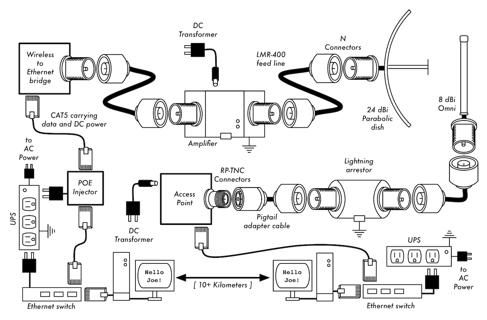

Note that this diagram is not to scale, nor is it necessarily the best
choice of network design. But it will introduce you to many common
interconnects and components that you will likely encounter in the real
world.

 

Figure HW 1: Common Interconnects and Components for a Wireless PtP
link.

 

While the actual components used will vary from node to node, every
installation will incorporate these parts:

 

1.  1.  1.An existing computer or network connected to an Ethernet
        switch. 

    2.  2.A device that connects that network to a wireless device (a
        wireless router, bridge, or repeater). 

    3.  3.An antenna that is connected via feed line, or is integrated
        into the wireless device itself. 

    4.  4.Electrical components consisting of power supplies,
        conditioners, and lightning arrestors. 

 

The actual selection of hardware should be determined by establishing
the requirements for the project, determining the available budget, and
verifying that the project is feasible using the available resources
(including providing for spares and ongoing maintenance costs).

 

As discussed in other chapters of this book, establishing the scope of
your project is critical before any purchasing decisions are made.

### Choosing wireless components

Unfortunately, in a world of competitive hardware manufacturers and
limited budgets, the price tag is the single factor that usually
receives the most attention.

The old saying that “you get what you pay for” often holds true when
buying high tech equipment, but should not be considered an absolute
truth. While the price tag is an important part of any purchasing
decision, it is vital to understand precisely what you get for your
money so you can make a choice that fits your needs.

 

When comparing wireless equipment for use in your network, be sure to
consider these variables:

 

Interoperability. Will the equipment you are considering work with
equipment from other manufacturers? If not, is this an important factor
for this segment of your network? If the gear in question is standard
(such as 802.11b/g), then it will likely interoperate with equipment
from other sources.

 

Range. This is not something inherent in a particular piece of
equipment. A device’s range depends on the antenna connected to it, the
surrounding terrain, the characteristics of the device at the other end
of the link, and other factors.

Rather than relying on a semi- fictional “range” rating supplied by the
manufacturer, it is more useful to know the transmission power of the
radio as well as the antenna gain (if an antenna is included).

 

With this information, you can calculate the theoretical range as done
when looking at link budget calculations as we did in the chapter called
Deployment Planning.

 

Radio sensitivity. How sensitive is the radio device at a given bit
rate? The manufacturer should supply this information, at least at the
fastest and slowest speeds.

This can be used as a measure of the quality of the hardware, as well as
allow you to complete a link budget calculation.

When considering radio sensitivity, a lower number is better.

 

Throughput. Manufacturers consistently list the highest possible bit
rate as the “speed” of their equipment. Keep in mind that the radio
symbol rate (eg. 54 Mbps) is never the actual throughput rating of the
device (eg. about 22 Mbps for 802.11g).

If throughput rate information is not available for the device you are
evaluating, a good rule of thumb is to divide the device “speed” by two,
and subtract 20% or so. When in doubt, perform throughput testing on an
evaluation unit before committing to purchasing a large amount of
equipment that has no official throughput rating.

 

Required accessories. To keep the initial price tag low, vendors often
leave out accessories that are required for normal use. Does the price
tag include all power adapters? For example DC supplies are typically
included; Power over Ethernet injectors typically are not. Double-check
input voltages as well, as equipment is sometimes provided with a US
power supply.

What about pigtails, adapters, cables, antennas, and radio cards? If you
intend to use it outdoors, does the device include a weatherproof case?

 

Availability. Will you be able to easily replace failed components? Can
you order the part in large quantity, should your project require it?
What is the projected life span of this particular product, both in
terms of useful running time in-the-field and likely availability from
the vendor?

 

Power consumption. For remote installations, power consumption is the
most critical issue. If the devices are to be powered with solar panels,
it is very important to select the ones that require the lowest possible
power.

The cost of solar panels and batteries can be much higher than the cost
of wireless devices; so lower power consumption can result in a much
lower overall budget.

 

Other factors. Be sure that other features are provided to meet your
particular needs. For example, does the device include an external
antenna connector? If so, what type is it? Are there user or throughput
limits imposed by software, and if so, what is the cost to increase
these limits?

What is the physical form factor of the device?

Does it support POE as a power source? Does the device provide
encryption, NAT, bandwidth monitoring tools, or other features critical
to the intended network design?

 

By answering these questions first, you will be able to make intelligent
buying decisions when the time comes to choosing networking hardware. It
is unlikely that you will be able to answer every possible question
before buying gear, but if you prioritise the questions and press the
vendor to answer them before committing to a purchase, you will make the
best use of your budget and build a network of components that are well
suited to your needs.

### Commercial vs. DIY solutions

Your network project will almost certainly consist of components
purchased from vendors as well as parts that are sourced or even
fabricated locally. This is a basic economic truth in most areas of the
world. At this stage of human technology, global distribution of
information is quite trivial compared to global distribution of goods.
In many regions, importing every component needed to build a network is
prohibitively expensive for all but the largest budgets.

You can save considerable money in the short term by finding local
sources for parts and labour, and only importing components that must be
purchased.

 

Of course, there is a limit to how much work can be done by any
individual or group in a given amount of time. To put it another way, by
importing technology, you can exchange money for equipment that can
solve a particular problem in a comparatively short amount of time. The
art of building local telecommunications infrastructure lies in finding
the right balance of money to effort needed to be expended to solve the
problem at hand.

 

Some components, such as radios and antenna feed line, are likely far
too complex to consider having them fabricated locally. Other
components, such as antennas and towers, are relatively simple and can
be made locally for a fraction of the cost of importing. Between these
extremes lie the communication devices themselves.

By using off-the-shelf radio cards, motherboards, and other components,
you can build devices that provide features comparable (or even
superior) to most commercial implementations. Combining open hardware
platforms with open source software can yield significant “bang for the
buck” by providing custom, robust solutions for very low cost.

This is not to say that commercial equipment is inferior to a
do-it-yourself solution.

By providing so-called “turn-key solutions”, manufacturers not only save
development time, but they can also allow relatively unskilled people to
install and maintain equipment.

The chief strengths of commercial solutions are that they provide
support and a (usually limited) equipment warranty. They also provide a
consistent platform that tends to lead to very stable, often
interchangeable network installations.

 

If a piece of equipment simply doesn’t work or is difficult to configure
or troubleshoot, a good manufacturer will assist you.

Should the equipment fail in normal use (barring extreme damage, such as
a lightning strike) then the manufacturer will typically replace it.

Most will provide these services for a limited time as part of the
purchase price, and many offer support and warranty for an extended
period for a monthly fee. By providing a consistent platform, it is
simple to keep spares on hand and simply “swap out” equipment that fails
in the field, without the need for a technician to configure equipment
on-site.

Of course, all of this comes at comparatively higher initial cost for
the equipment compared to off-the-shelf components.

From a network architect’s point of view, the three greatest hidden
risks when choosing commercial solutions are vendor lock-in,
discontinued product lines, and ongoing licensing costs.

 

It can be costly to allow the lure of ill-defined new “features” drive
the development of your network.

Manufacturers will frequently provide features that are incompatible
with their competition by design, and then issue marketing materials to
convince you that you simply cannot live without them (regardless of
whether the feature contributes to the solution of your communications
problem).

As you begin to rely on these features, you will likely decide to
continue purchasing equipment from the same manufacturer in the future.

 

This is the essence of vendor lock-in.

If a large institution uses a significant amount of proprietary
equipment, it is unlikely that they will simply abandon it to use a
different vendor.

 

Sales teams know this (and indeed, some rely on it) and use vendor
lock-in as a strategy for price negotiations.

 

When combined with vendor lock-in, a manufacturer may eventually decide
to discontinue a product line, regardless of its popularity. This
ensures that customers, already reliant on the manufacturer’s
proprietary features, will purchase the newest (and nearly always more
expensive) model. The long term effects of vendor lock-in and
discontinued products are difficult to estimate when planning a
networking project, but should be kept in mind.

 

Finally, if a particular piece of equipment uses proprietary computer
code, you may need to license use of that code on an ongoing basis. The
cost of these licenses may vary depending on features provided, number
of users, connection speed, or other factors. If the license fee is
unpaid, some equipment is designed to simply stop working until a valid,
paid-up license is provided! Be sure that you understand the terms of
use for any equipment you purchase, including ongoing licensing fees.

 

By using equipment that supports standards and open source software, you
can avoid some of these pitfalls.

For example, it is very difficult to become locked-in to a vendor that
uses open protocols (such as TCP/IP over 802.11a/b/g). If you encounter
a problem with the equipment or the vendor, you can always purchase
equipment from a different vendor that will interoperate with what you
have already purchased. It is for these reasons that we recommend using
proprietary protocols and licensed spectrum only in cases where the open
equivalent (such as 802.11a/b/g) is not technically feasible.

Likewise, while individual products can always be discontinued at any
time, you can limit the impact this will have on your network by using
generic components.

For example, a particular motherboard may become unavailable on the
market, but you may have a number of PC motherboards on hand that will
perform effectively the same task.

Obviously, there should be no ongoing licensing costs involved with open
source software (with the exception of a vendor providing extended
support or some other service, without charging for the use of the
software itself).

 

There have occasionally been vendors who capitalise on the gift that
open source programmers have given to the world by offering the code for
sale on an ongoing licensed basis, thereby violating the terms of
distribution set forth by the original authors.

It would be wise to avoid such vendors, and to be suspicious of claims
of “free software” that come with an ongoing license fee.

The disadvantage of using open source software and generic hardware is
clearly the question of support.

 

As problems with the network arise, you will need to solve those
problems for yourself. This is often accomplished by consulting free
online resources and search engines, and applying code patches directly.

 

If you do not have team members who are competent and dedicated to
designing a solution to your communications problem, then it can take a
considerable amount of time to get a network project off the ground.

Of course, there is never a guarantee that simply “throwing money at the
problem” will solve it either.

 

While we provide many examples of how to do much of the work yourself,
you may find this work very challenging. You will need to find the
balance of commercial solutions and the do-it-yourself approach that
works for your project.

 

In short, always define the scope of your network first, identify the
resources you can bring to bear on the problem, and allow the selection
of equipment to naturally emerge from the results.

Consider commercial solutions as well as open components, while keeping
in mind the long- term costs of both.

 

When considering which equipment to use, always remember to compare the
expected useful distance, reliability, and throughput, in addition to
the price.

 

And finally, make sure that the radios you purchase operate in an
unlicensed band where you are installing them, or if you must use
licensed spectrum, that you have budget and permission to pay for the
appropriate licenses.

### Professional lightning protection

Lightning is a natural predator of wireless equipment. A map showing the
global distribution of lightning from 1995 to 2003 is shown here
following.

 

 

 

Figure HW 2: Global distribution of lightning from 1995 to 2003

 

 

There are two different ways lightning can strike or damage equipment:
direct hits or induction hits.

 

Direct hits happen when lightning actually hits the tower or antenna.
Induction hits are caused when lightning strikes near the tower.

 

Imagine a negatively charged lightning bolt.

Since like charges repel each other, that bolt will cause the electrons
in the cables to move away from the strike, creating current on the
lines.

This can be much more current than the sensitive radio equipment can
handle.

Either type of strike will usually destroy unprotected equipment.

 

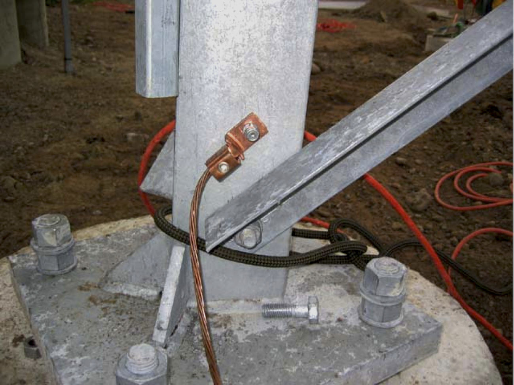

 

Figure HW 3: A tower with a heavy copper grounding wire.

 

Protecting wireless networks from lightning is not an exact science, and
there is no guarantee that a lightning strike will not happen, even if
every single precaution is taken. Many of the methods used will help
prevent both direct and induction strikes.

While it is not necessary to use every single lightning protection
method, using more methods will help further protect the equipment.

The amount of lightning historically observed within a service area will
be the biggest guide to how much needs to be done.

Start at the very bottom of the tower. Remember, the bottom of the tower
is below the ground. After the tower foundation is laid, but before the
hole is backfilled, a ring of heavy braided ground wire should have been
installed with the lead extending above ground surfacing near a tower
leg.

The wire should be American Wire Gauge (AWG) \#4 or thicker.

In addition, a backup ground or earthing rod should be driven into the
ground, and a ground wire run from the rod to the lead from the buried
ring.

It is important to note that not all steel conducts electricity the same
way.

Some types of steel act as better electrical conductors than others, and
different surface coatings can also affect how tower steel handles
electrical current. Stainless steel is one of the worst conductors, and
rust proof coatings like galvanizing or paint lessen the conductivity of
the steel.

For this reason, a braided ground wire is run from the bottom of the
tower all the way to the top. The bottom needs to be properly attached
to the leads from both the ring and the backup ground rod.

The top of the tower should have a lightning rod attached, and the top
of that needs to be pointed. The finer and sharper the point, the more
effective the rod will be.

The braided ground wire from the bottom needs to be terminated at the
grounding of the lightning rod. It is very important to be sure that the
ground wire is connected to the actual metal. Any sort of coating, such
as paint, must be removed before the wire is attached. Once the
connection is made, the exposed area can be repainted, covering the wire
and connectors if necessary to save the tower from rust and other
corrosion.

 

The above solution details the installation of the basic grounding
system. It provides protection for the tower itself from direct hits,
and installs the base system to which everything else will connect.

The ideal protection for indirect induction lightning strikes are gas
tube arrestors at both ends of the cable.

These arrestors need to be grounded directly to the ground wire
installed on the tower if it is at the high end.

The bottom end needs to be grounded to something electrically safe, like
a ground plate or a copper pipe that is consistently full of water. It
is important to make sure that the outdoor lightning arrestor is
weatherproofed.

Many arresters for coax cables are weatherproofed, while many arresters
for CAT5 cable are not. In the event that gas arrestors are not being
used, and the cabling is coax based, then attaching one end of a wire to
the shield of the cable and the other to the ground wire installed on
the towers will provide some protection.

This can provide a path for induction currents, and if the charge is
weak enough, it will not affect the conductor wire of the cable. While
this method is by no means as good a protection as using the gas
arrestors, it is better than doing nothing at all.

### Access Point Configuration

This section will provide a simple procedure for the basic configuration
of WiFi Access Points and Clients by reviewing the main settings and
analysing their effects on the behaviour of the network.

It will also suggest some practical tips and tricks and troubleshooting
advice.

#### Before you start

When you receive some new wireless equipment take some time to get
acquainted with its main features and make sure you:

 

-   •Download or otherwise obtain all user’s manuals and specification
    sheets available for the devices you are going to deploy. 

-   •If you have second-hand devices, be sure to receive full
    information on their current –or last-known– configuration (e.g.
    password, IP addresses, etc.) 

-   •You should already have a plan on hand for the network you are
    going to deploy (including link budget, network topology, channels
    and IP settings). 

-   •Be ready to take written notes of all settings that you are going
    to apply (especially passwords!) 

-   •Make backups of last known good configuration files. 

#### Getting in touch with the device

As a first step, it is important that you learn the meaning of all LEDs
on the device.

The figure below shows the typical front of an Access Point, with
several LEDs lit.

 

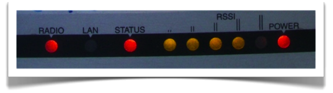

 

Figure HW 4: The front of a typical Access Point.

 

LEDs typically indicate:

 

-   •Presence of power 

-   •Active ports / traffic (yellow/green colour) 

-   •Error status (red colour) 

-   •Received signal strength (LED bars, sometimes multicolour; some
    devices can even be set to light each LED at specific thresholds,
    e.g. Ubiquiti) 

 

Sometimes, different meanings are associated with the same LED, using
different colours and dynamics (e.g. LED is on/off/blinking at different
speeds).

 

You should identify the different ports and interfaces on the device:

 

-   •Radio interfaces, sometimes called WLANs. They should have one or
    more antenna connectors (or non-detachable antennas). 

-   •One or more Ethernet interfaces: 

-   •One or more ports for local network (LAN) 

-   •One port for uplink (also called WAN) 

-   •Power input (5, 6, 7.5, 12V or other, usually DC). It is really
    (really) important that the power supply matches the voltage!
    Sometimes the power is provided to the device through the same UTP
    cable that carries the Ethernet data: this is called
    Power-over-Ethernet (PoE). 

-   •Power button (not always present). 

-   •Reset button (often “hidden” in a small hole, can be pressed using
    a straightened paperclip). 

 

The reset button may have different effects (from a simple restart to a
factory full reset) if pressed briefly vs. for a longer time. It can
take 30 seconds or more to trigger a full reset.

NOTE: to fully reset (i.e. reset to factory settings) a device that is
in an unknown state may be a painful task!

Be sure to keep written notes of critical parameters like the device IP
address and network mask, and the administrator username and password.

The following figure shows a common Linksys Access Point, with the power
input, the network ports, the reset button and two antennas.

 

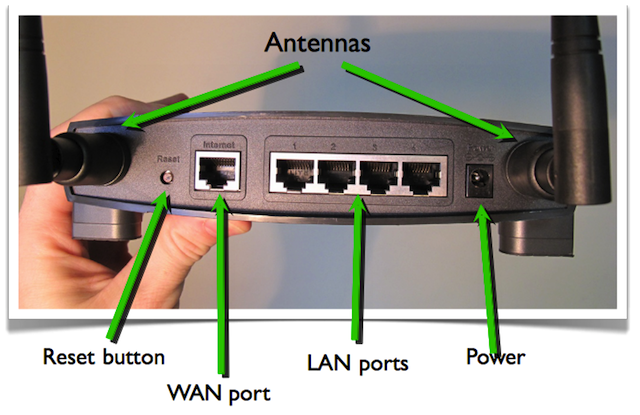

 

Figure HW 5: Linksys Access Point

#### User interfaces

You can interact (i.e. issue commands and change settings) with the
Access Point in several ways, depending on the hardware you are using.
The possible ways are the following:

 

-   •Graphical User Interface (web page) 

-   •Graphical User Interface (proprietary software application) 

-   •Command Line Interface (telnet, ssh) 

-   •Software interface embedded in the system (when the AP/client is a
    computer or smartphone with a display and its own OS) 

 

#### User interfaces: GUI (web page)

This system is used in Linksys, Ubiquiti and most modern Aps.

Once you are connected to the AP, you interact with the device using a
normal browser.

Advantages: it works with most browsers and operating systems

Disadvantages: the static interface does not reflect changes
immediately; poor feedback; can be incompatible with some web browsers;
requires a working TCP/IP configuration. Some recent implementations
(e.g. Ubiquiti, shown below) are very good and use modern dynamic web
features to provide feedback and advanced tools.

 

Figure HW 6: Ubiquiti user interface.

 

#### User interfaces: GUI (software application)

In this case you need a special piece of software to interact with the
device.

This system is used in Mikrotik (called Winbox), Apple (called Airport
Utility), Motorola (called Canopy), many old APs.

 

Advantages: usually powerful and appealing interfaces; allow batch
configuration of multiple devices.

Disadvantages: proprietary solutions; usually available for only one
operating system; software must be installed before starting
configuration.

Mikrotik Winbox, shown below, is a very powerful solution and can manage
large networks.

 

 

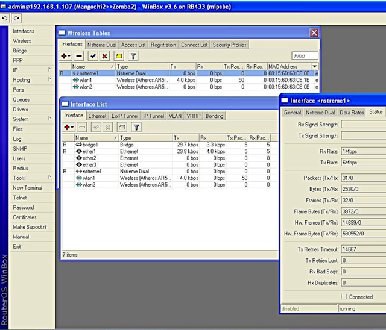

 

Figure HW 7: Mikrotik WinBox.

 

#### User interfaces: Command Line Interface (sometimes called text shell)

In this case you connect to the device using a serial or Ethernet
connection, via telnet or ssh. ssh is much safer than telnet from a
security perspective (the latter should be avoided if possible).

Configuration is performed with commands executed in the host operating
system, usually a flavour of Linux or a proprietary OS, as shown on the
next page.

 

This is system is used by Mikrotik (called RouterOS), Ubiquiti (called
AirOS), high-end APs (Cisco) and embedded PC-based Aps.

 

Advantages: very powerful as it can be scripted.

 

Disadvantages: difficult to learn.

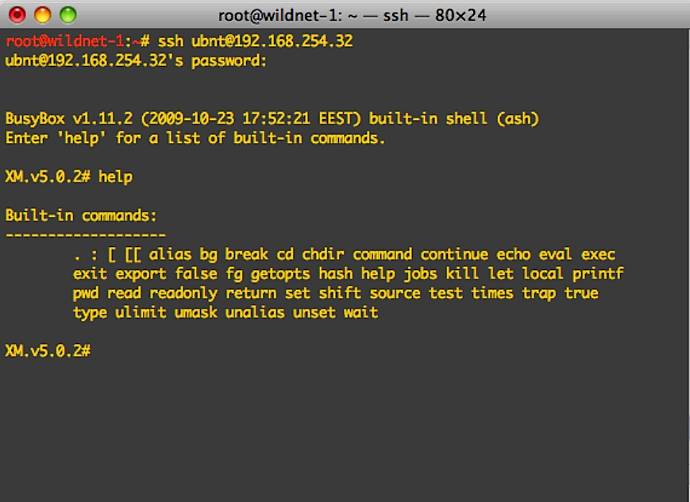

 

Figure HW 8: Command Line Interface.

#### Configure the AP

Before configuring the AP, remember to:

 

-   •Start from a known state, or reset the device to factory settings
    (always a good idea!). 

-   •Connecting to the device via Ethernet is usually easier than via
    wireless. Most devices with a web GUI have a default IP
    configuration on the network 192.168.0.0, but this is not a rule!
    Read the manual. 

-   •If convenient, upgrade the firmware to the latest stable version
    (but be careful!) 

-   •Change the default admin username and password first! 

-   •Change the device name with something that clearly identifies it
    (e.g. something like “AP\_conference\_room\_3” or
    “hotspot\_public\_area”). This will help you to recognise the AP in
    future when you connect to it over the network. 

 

 

-   •Firmware upgrade is often a risky procedure, be sure to adopt all
    precautions before attempting it - such as - connecting the device
    and the computer to a UPS, then do not perform the firmware update
    while doing other tasks on the computer, and check that you have a
    valid firmware binary image, READ THE INSTRUCTIONS CAREFULLY! If the
    procedure fails, you can end up with an unusable device that cannot
    be recovered (the so-called “brick”). 

-   •Remember to write down (and store in a safe place) all these
    settings, especially the admin username/password. 

#### Configure the AP - IP layer

If you are confident with what you are doing, you can perform the IP
configuration after the wireless setup to avoid the reconfiguration and
reconnection of your PC or laptop. But in this way, if you make any
mistake in both the wired and wireless setup, you may end up with an
unreachable AP. We'd strongly advise that you do the critical
configuration steps one at a time, checking the status of the device
after each step.

Remember to write down (and store in a safe place) all IP settings!

 

Configure the Ethernet interface of the AP according to your wired
network setup:

 

-   •IP address/netmask/gateway or DHCP 

-   •DNS address(es) 

-   •Double check the new settings and apply them (sometimes you may
    have to reboot the AP) 

-   •Now you may need to reconfigure your PC/laptop to match the new
    Ethernet setup, and reconnect to the AP. 

#### Configure the AP - physical layer

-   •Configure the mode: master (or access point or base station). The
    device’s mode can usually be configured as: “master” (also called
    “access point” or “base station” or “BS”), “client” (also called
    “managed” or “station” or “client station” or “CPE”), “monitor”,
    “WDS” (Wireless Distribution System), and rarely some other
    variants. 

 

-   •Configure the SSID (Service Set Identifier, the name of the
    wireless network created by the AP, up to 32 characters long): it is
    best to choose a meaningful name. Remember that “security through
    obfuscation is not real security”, so a hidden or fake/random SSID
    does not add much security to your network. 

-   •Configure the wireless channel, according to the local regulations
    and the result of the site survey.  

-   •Do not use a channel that is already occupied by another AP or
    other sources of RF power. You should already have planned the
    channel in advance, during the design phase. The choice of the best
    channel is sometimes a hard task, and you may need to perform a site
    survey with software tools (wireless sniffers) or hardware spectrum
    analysers (like the WiSpy from Metageek and the AirView from
    Ubiquiti). 

-   •Configure the transmit power and network speed (these values may
    also be set to “automatic” in some devices). The value of transmit
    power is also subject to local regulation, check in advance the
    maximum power allowed by law, and try always to use the minimum
    value that fit your needs, in order to avoid interference with other
    networks (yours or others). 

 

The choice of network speed is limited to the values that are part of
802.11a/b/g/n standards (up to 54 Mbps), but some vendors created
extensions to the standards (often called “turbo” modes) of 100 Mbps or
higher. These are non-standard and may not be able to interoperate with
equipment from other vendors.

 

Configuring “backwards compatibility” modes (such as supporting 802.11b
on 802.11g networks) will reduce the overall throughput available to
your fastest clients. The Access Point must send the preamble at a
slower rate for 802.11b clients, and actual communications between the
client and the AP happen at 802.11b speeds. This takes more time, and
slows down the otherwise faster 802.11g clients.

#### Configure the AP – security

Security settings are often a hard choice, and it may be difficult to
balance good protection from unintentional users with easy access for
authorised users.

 

More complex security needs will require a more complex configuration
and additional software.

 

Configure the security features of the network:

 

-   •No encryption (all traffic is in clear) 

-   •WEP (Wired Equivalent Privacy), 40 or 104 bits keys, it is flawed
    and therefore deprecated 

-   •WPA / WPA2 (WiFi Protected Access): PSK, TKIP and EAP 

-   •Enable or disable (hide) the SSID broadcast (“beacon”). Hidden SSID
    and MAC filtering do not add much security, and are hard to maintain
    and a source of troubles for inexperienced users of the network. 

-   •Enable or disable an Access Control List (based on MAC addresses of
    clients). MAC filtering is a weak security measure:– A malicious
    client can capture packets and find out which MAC addresses have the
    right to associate– It can then change its own MAC address to one of
    the accepted ones and “fool” the access point. 

 

For more information about how to design the security of your wireless
network please read the chapter called Security in Wireless Networks.

#### Configure the AP - routing/NAT

Advanced IP layer and routing configuration features are often included
in modern access points. This can include functionality for routing and
Network Address Translation (NAT), in addition to basic bridging.

 

Advanced IP configuration includes:

 

-   •Static routing 

-   •Dynamic routing 

-   •NAT (masquerading, port forwarding) 

-   •Firewalling 

-   •Some APs can also act as file servers and print servers (external
    HD and printers can be connected via USB) 

#### Configure the AP – advanced

A few more advanced settings may be available for your AP, depending on
the model/vendor/firmware/etc.:

 

-   •Beacon interval 

-   •RTS/CTS. RTS/CTS (ready to send, clear to send) mechanism can help
    alleviate the problem of hidden nodes (clients that can “hear” the
    AP but not the other clients, therefore creating interferences). 

-   •Fragmentation. Configuration of the fragmentation can be used to
    increase performance in the case of low signal areas, those with
    marginal coverage, or long links. 

-   •Interference robustness 

-   •Vendor extensions to the WiFi standards 

-   •Other settings for long distance links (10 to 100 kilometres) and
    better security. 

### Configure the client

The client side configuration is much simpler:

 

-   •Configure the mode: client (or managed, station, client station,
    CPE) 

-   •Configure the SSID of the network to be joined 

-   •The channel, speed, and other parameters will be set automatically
    to match the AP 

-   •If WEP or WPA is enabled on the AP, you will have to enter the
    matching password (key) 

-   •Clients may also have additional (often vendor-specific) settings.
    For example, some clients can be configured to associate only with
    an AP with a specified MAC address. 

### Hints - working outdoors

-   •You should try to configure the devices (both APs and clients) well
    in advance and in a comfortable place such as a laboratory. Working
    outdoors is more difficult and may lead to mistakes (“on-site”
    configuration = trouble). 

     

-   •If you must configure devices outdoors, be sure to have enough
    battery charge on your laptop, to carry all the required information
    with you (on paper, not only in electronic format!) and to carry a
    notepad to take notes. Good documentation is paramount for future
    maintenance in the field! 

### Troubleshooting

-   •Organise your work in logical steps and follow them. 

-   •Read the manual, study the meaning of parameters and settings, run
    tests and experiments (don’t be scared!). 

-   •In the case of problems, do a factory reset and try again. 

-   •If the problem persists, try again changing one parameter/setting
    at a time. 

-   •It still doesn’t work? Try to search on the web for relevant
    keywords (name of the device, etc.), search in forums and on
    manufacturer / vendors websites. 

-   •Upgrade the firmware to the latest version. 

-   •If you still have problems try with a different client/AP, to check
    if you have a hardware issue with the original one. 

12. INDOOR INSTALLATION
-----------------------

### Introduction

Previous editions of this book have focused on wide-area outdoor
wireless as a means of connecting communities with each other and to the
Internet. However, with the availability of WiFi access points for a low
price and the proliferation of portable devices that are WiFi capable,
WiFi has become the de facto standard for indoor network access in
Enterprises and schools. This chapter introduces the main focus points
in choosing and installing WiFi networks indoors.

### Preparations

Before installing a wireless LAN it is a good idea to first think things
through a bit:

-   •What is it that you are planning to do with the wireless network?
    Is it an addition to the wired network or a replacement for it? Are
    you going to run applications over the network that are not delay
    tolerant or sensitive to bandwidth variations (like voice and video
    conferencing). 

-   •The main difference between indoor and outdoor wireless is the
    absorption and reflection of radio waves by the building itself.
    What building features do you need to take into account? Do the
    walls have metal, water or heavy concrete in them? Do windows have
    metal in them (e.g. metal coating or metal grids)? Is the building
    long and stretched or compact? 

-   •Do you expect users to be mainly static, or will they move a lot?
    And when they move, is it important to have uninterrupted handover
    (this means, a handover so quick that you will not notice the
    interruption of a voice call)? 

-   •Are there good places to hang the Access Points? Are wired sockets
    and electricity for the APs readily available? Is electricity
    stable? If not, even indoor APs might need stable solar/battery
    power supplies and/or UPS. 

-   •Are there sources of interference, like ad-hoc APs brought in by
    users, bluetooth devices, microwaves? 

### Bandwidth requirements

Step one in designing an indoor wireless network is to determine the
need in terms of the number of concurrent users to support, the number
and type of devices and the type of applications they are running. It is
also important to understand the distribution of the users. Lecture
halls or meeting rooms have different usage patterns than corridors. A
wireless network that is hardly used and that needs to support a low
number of users is easy to deploy and will not run into trouble easily.
The trouble starts when the number of users and their use of the network
increases. This chapter therefore focuses on high-density wireless
networks.

To give you an idea for the bandwidth requirement for some typical
applications:

 

web surfing:

500 - 1000 kb/s

audio:

100 - 1000 kb/s

streaming video:

1 - 4 Mb/s

file sharing:

1 - 8 Mb/s

device backup:

10 - 50 Mb/s

 

Typical installations in an office environment are dimensioned to
support 20-30 users per cell and have about 1 access point per 250-500
square metres, but as mentioned before, depending on characteristics of
the environment this may not be sufficient. In a dense environment there
may be up to 1 device per 20 square metres. Bottom line, you need to
calculate the throughput needed per coverage area.

So if you have let's say 10 users in a 100 square metre area, of which 8
are surfing the web and 2 are watching online video you will need: 8 \*
1000 kb/s + 2 \* 4000 kb/s = 16000 kb/s for the 100 square metre area or
160 kb/s per square metre.

### Frequencies and data rates

The 2.4 GHz and the 5 GHz solutions differ in a few key aspects. The 2.4
GHz band has a better range and less attenuation and is supported in
most devices.

The main downside of the 2.4 GHz band is that there are only 3
non-overlapping channels, which severely limits the the number of access
points that can be placed in a certain area.

This is unfortunate since making smaller cells (formed by having the APs
broadcast with less power) is the easiest way of creating more
throughput per area.

Note: sometimes 4 slightly overlapping channels are advised, but
research shows that in fact this decreases performance. Performance in
general, degrades fast with overlapping channels (co- channel
interference). The 5 GHz band on the other hand has a worse range but
has in most geographies around 20 channels which makes it much easier to
deploy without interference from adjacent channels.

The other important element is the choice of WiFi standard, considering
that average throughput in Mb/s for the most common technologies are:

 

11b:

7.2 Mb/s

11g:

25 Mb/s

11a:

25 Mb/s

11n:

25 - 160 Mb/s

 

It should be noted that performance drops when, for example, both
802.11b and 11g devices are served by the same AP. In a network where
client devices are using a mix of 802.11g and 11b, the AP will shift
down to lower speeds.

5 GHz is a preferred choice for high performance and high density
networks. As you would like to limit the coverage of each AP to one
small well defined area anyway, signal attenuation by walls etc is an
advantage rather than a problem.

The deployment of 2.4 GHz for the majority of devices, combined with 5
GHz for the "important devices" is worth considering too.

### Access Points choice and placement

When it comes to choosing Access Points (APs) for indoor wireless there
are essentially 2 architectural choices: controller based and "fat
clients". Fat clients are stand-alone APs that have all the intelligence
on board to manage a WiFi network (choosing SSIDs, encryption method,
routing/switching etc.). The controller-based solution on the other hand
has APs that implement the minimal functionality to offer a wireless
service along with a central controller that is common for all APs at a
location.

The central controller also has all the intelligence and all traffic
from the APs directed to it.

The choice between one of the two architectures is a trade-off between
cost, ease of management and scalability. In general one can say that
the more complex the environment and the larger the size the more
attractive it becomes to run a controller-based solution.

 

Access Points should in general be placed in the areas with a high
density of users, the signal will probably "leak" sufficiently to also
serve the less dense areas. Unfortunately the overall performance of the
system will mostly be determined by the clients, not the APs, so the
placement of the APs, while important, can only do so much for the
performance of the overall system. Other radio sources in the WiFi bands
have a very strong influence on the performance of the WiFi network, so
in general, if possible the APs should, as much as possible, be isolated
from other radio sources, by using walls, ceilings and people as
"shields".

 

In order to improve performance it is possible to use external antennas.
Omni directional antennas are the most commonly used and they provide a
coverage area roughly circular around the AP. In most indoor cases,
however, APs will be installed on walls, ceilings, or columns, and
omnidirectional antennas are a bad choice, if you look at where the
radio waves are going, and where the users are.

 

So for these cases in which the AP is not at the centre of the area to
be covered, directional antennas are an alternative. Some hotels and
conference halls, for example, place small directional antennas at the
corners of large, open areas or overhead to provide a "canopy" or
"umbrella" of signal coverage in large spaces. Keep in mind that the
many reflections typically encountered in an indoor environment make it
difficult to try to fully control a specific coverage.

 

Access Points can be mounted on the ceiling, on the walls or in
furniture, each with different characteristics. Ceiling mounting gives a
good blanket coverage, wall mounting often gets the APs closer to the
users and APs under tables or chairs or within furniture can use the
natural isolation to create small cells with little interference from
neighbouring APs, but there might be concerns about the possibility of
harmful effects from the radiation emitted.

Lastly, for really demanding high performance networks, APs with smart
adaptive antenna technology might be an option. They come at a price,
but offer the advantage of adapting the radio signal to the locations of
users dynamically - they will direct the radio waves to where they are
needed, at each point in time.

### SSID and Network Architecture

Indoor networks are likely to serve many concurrent users. Larger
complexes like a university campus typically consist of many buildings,
each with their own indoor network, and outdoor networks in between.

 

It is therefore important to make a good plan for your SSIDs.

Note that the SSID defines the broadcast domain on Layer 2 of the
network. SSID planning needs to play together with your Layer 3 network
architecture. If you would like users to roam seamlessly across your
whole wireless network area, within or even beyond one building, then
all APs should offer the same SSID, for example "UniversityWireless", or
"eduroam" for a university that wants to participate in the global
roaming service that eduroam offers.

However, users who stay within one SSID will not require or request a
new DHCP lease, so you will have to accomodate all users within ONE
Layer 3 subnet.

For a large campus, this might require a large flat subnet for all
wireless users.

This is a trade-off situation - you can either have huge subnets with
seamless roaming, or a more manageable subnet architecture with separate
SSIDs such as "Library", "LectureHall", "Cafeteria", ...

### Post Installation

Now that the infrastructure is in place it is important to make sure
that everything works as expected and remains like that. This can be
done in the form of a site survey, measuring signal strengths and
throughput. But in the end the main reason to install a wireless network
is to serve the users of it, so listening to users complaints or issues
is equally important. Demand constantly changes and so does the
state-of-the- art. It is important to keep up to date with user
requirements and match that to planned upgrades of the technology you
are deploying.

13. OUTDOOR INSTALL
-------------------

 

Although WiFi technology was designed for local area networks, its
impact in developing countries is more dramatic in long-distance
applications.

 

In developed countries, fibre optic cables offering large bandwidths
have been installed satisfying the communication needs of most cities.
The penetration of optical fibre in the developing world is not nearly
as great and nowhere near enough to cover the needs. And the cost of its
expansion often does not meet the ROI (Return on Investment) goals of
telcos within a reasonable period of time. Wireless technologies, on the
other hand, have been much more successful in developing countries and
the potential for increasing the penetration using wireless networks is
enormous.

 

Telcos have installed traditional microwave radio links in most
countries. This is a mature technology that offers high reliability and
availability reaching 99.999%. However, these systems cost many
thousands of dollars and require specially trained personnel for
installation.

 

Satellite systems have proved well suited for broadcast traffic like TV
and certain other applications. However, satellite solutions are still
expensive for bidirectional traffic, while WiFi is quite cost effective
in outdoor point to point networks as well as in typical access networks
where a Base Station (BS) is serving many Clients/CPEs (point to
multipoint). In this chapter we will be concentrating on the outdoor
long- distance point to point links.

 

Two significant hurdles had to be overcome before applying WiFi to long
distance: Power budget limitations and timing limitations. The remaining
limitations for using WiFi over long distances are the requirement for
the existence of radio line of sight between the endpoints and the
vulnerability to interference in the unlicensed band. The first
limitation can often be addressed by taking advantage of the terrain
elevations, or by using towers to overcome obstacles such as the
curvature of the earth and to provide Fresnel zone clearance.

For indoor applications, line of sight is not required since the
stations are very close together and most obstacles can be cleared by
reflections on walls, ceiling, etc. But for long distance applications,
line of sight is absolutely critical. The second limitation is less
pronounced in rural areas and can be alleviated by migrating to the less
crowded 5 GHz band.

The power budget issue can be handled by using high gain antennas and
powerful and highly sensitive radios attached directly to the antenna to
avoid RF cable loss. The timing limitation has to do with the media
access techniques. WiFi uses a random access method to share the
communications medium. This makes it subject to collisions, which cannot
be detected over the air, therefore the transmitter relies on receiving
an acknowledgment for every successfully received frame.

If, after a specified amount of time, called the "ACKtimeout", the
acknowledge frame is not received, the transmitter will resend the
frame.

Since the transmitter will not send a new frame until the ACK for the
previous one has been received, the ACKtimeout must be kept short.

This works well in the original scenario intended for WiFi (indoor
networks), in which the propagation time of 33.3 microseconds per
kilometre is negligible, but breaks down for links over a few
kilometres.

 

Although many WiFi devices do not have provisions for modifying the
ACKtimeout, newer equipment meant for outdoor applications (or third
party firmware like Open WRT) will give you this possibility, often by
means of a distance field in the GUI (Graphical User Interface).

Changing this parameter will allow for a reasonable throughput, which
will anyway decrease proportionally to the distance. The contention
window slot-time also needs to be increased to adapt to longer
distances.

Other manufacturers have chosen to move from random access to Time
Division Multiple Access (TDMA) instead. TDMA divides access to a given
channel into multiple time slots, and assigns these slots to each node
on the network. Each node transmits only in its assigned slot, thereby
avoiding collisions. In a point to point link this provides a great
advantage since ACKs are not needed because each station takes turns at
transmitting and receiving.

While this method is much more efficient, it is not compliant with the
WiFi standard, so several manufacturers offer it as an optional
proprietary protocol, alongside the standard WiFi. WiMAX and proprietary
protocols (such as Mikrotik Nstreme, or Ubiquiti Networks AirMAX) use
TDMA to avoid these ACK timing issues.

The 802.11 standard defines the receiver sensitivity as the received
signal level required to guarantee a BER (Bit Error Rate) below 10−5.

This determines the amount of energy per bit required to overcome the
ambient noise plus the noise generated by the receiver itself. As the
number of bits/second transmitted increases, more receiver power will be
needed to provide the same energy per bit. Therefore the receiver
sensitivity decreases as the transmitter rate increases, so to maintain
the same signal/noise ratio as the distance increases the throughput
diminishes, or, alternatively, for longer distances one should choose
lower data rates to compensate for the reduction of the signal strength
with distance.

### What is needed for a long distance link?

There are four aspects that need to be considered to adapt WiFi devices
to long distance: increase the radio dynamic range; increase the antenna
gain; decrease the antenna cable loss; and make provisions for the the
signal propagation time.

 

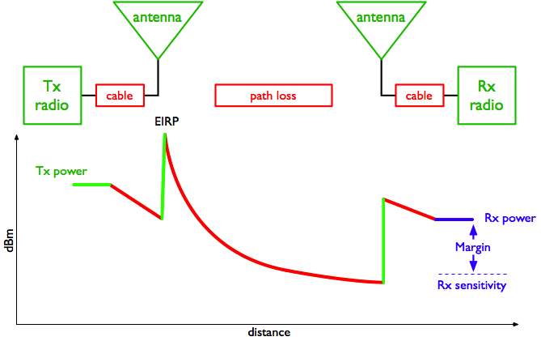

 

Figure OI 1: Power in dBm vs distance in a radio link (Power budget).

 

The graph above shows the power level at each point in a wireless link.

The transmitter provides some amount of power.

A small amount is lost in attenuation between the transmitter and the
antenna in the RF cable or waveguide. The antenna then focuses the
power, providing a gain. At this point, the power is at the maximum
possible value for the link. This value is called the EIRP (Equivalent
Isotropic Radiated Power) since it corresponds to the power that a
transmitter would have to emit if the antenna had no gain.

 

Between the transmitting and receiving antennas there are free space and
environmental losses, which increase with the distance between the link
endpoints. The receiving antenna provides some additional gain. Then
there is a small amount of loss between the receiving antenna and the
receiving radio.

 

If the received amount of energy at the far end is greater than the
receive sensitivity of the radio, the link is possible. Increasing the
transmission power can lead to violations of the regulatory framework of
the country.

Increasing the antenna gain is by far the most effective way to improve
range. Make sure that the radio to be employed has connectors for an
external antenna (some devices have an embedded or otherwise non
removable antenna).

 

Decreasing loss in antenna cables is still an important issue, and the
most radical way to attain it is to place the radio outside, directly
attached to the antenna, employing a weatherproof box. Often this lends
to powering the radio using PoE (Power over Ethernet).

 

Improving the receiver sensitivity implies choosing a model with better
performance, or settle for lower transmission speeds where sensitivity
is higher.

 

Although high gain antennas can be expensive, in many countries one can
find satellite antennas that are no longer being used and can be
modified for the WiFi bands.

 

In a perfect world, we would use the highest gain antennas with the
loudest and most sensitive radios possible. But a number of practical
considerations make this impossible. Amplifiers introduce an additional
point of failure, in addition they might violate maximum power permitted
by local regulations and add noise in reception, so they should be
avoided. High power transmitters are available from many manufacturers
that offer up to 1 W of output power which could be used instead of
amplifiers in those countries where this is legal.

 

In general, it is better to use high gain antennas than high transmitter
power. Greater antenna gain will help both in transmission and reception
making a double impact in the link budget. It will also cause less
interference to other users and receive less interference from other
users and limit multipath effects But a high antenna gain implies a very
narrow beamwidth, which means that special alignment techniques are
required.

### Antenna alignment

For short distances, when the corresponding antenna is visible, the
antenna alignment procedure reduces to pointing the antenna in the
direction of the correspondent, both in the horizontal plane (azimuth)
and in the vertical plane (elevation). This should suffice to establish
the connection. Once the connection is attained a fine adjustment can be
made by reading the RSSL (Receiver Signal Strength Level) in the local
radio. This value is provided by the user interface, and can also be
obtained from programs like netstumbler. The procedure consists of
moving the antenna in the horizontal plane in small steps while reading
the RSSL. Do not touch the antenna when reading, since your body will
affect the measurement. Once satisfied that a maximum value is obtained,
the procedure is repeated in the vertical plane, moving the antenna
first up and then down until a maximum value of received power is
obtained, at which point the bolts that secure the antenna are
tightened. This is all that is needed to aim a client device at an
Access Point or Base Station. If you have a point to point link, the
same procedure should be repeated at the other end of the link.

 

For long distances and when the other end of the link is not visible,
some extra steps are required. First, the horizontal direction (bearing)
to aim the antenna must be obtained from the coordinates of the end
points. Then a compass is used to determine the direction in which the
antenna should be aimed.

Keep in mind that in general there is a difference between the magnetic
bearing measured by the compass and the geographical bearing obtained
from the coordinates of the end points or from a map.

This difference is called the magnetic declination, it can be very
significant in some places and must be accounted for to properly aim the
antenna. Fig. OI 2 shows the 10° difference between the magnetic north
shown by the compass and the geographical or true north indicated by the
brass plate.

 

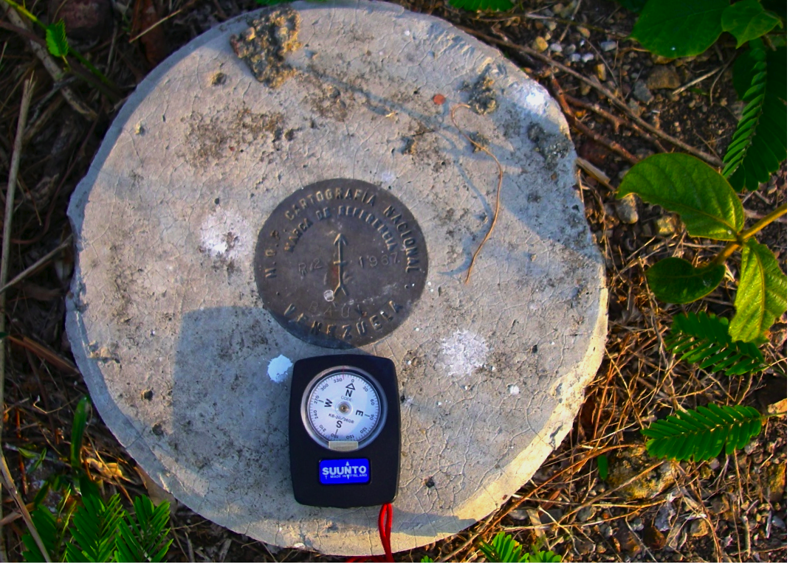

 

Figure OI 2: Difference between Magnetic and Geographical North at El
Baul, Venezuela in 2006.

 

Keep in mind that iron and other magnetic metals will affect the reading
of the compass, so stay away from those when making the measurement. If
the antenna is to be mounted in an steel tower, it might be impossible
to get an accurate reading near it. Instead, one must walk away a
certain distance, use the compass to determine the direction the antenna
must be aimed and then try to locate some easily recognisable object
that can be used as a reference for pointing the antenna at later. Since
the beamwidth of a highly directive antenna might be just a few degrees,
after pointing with the compass we need to do some fine adjustment for
the proper aiming of the antenna by measuring the strength of the
received signal.

Unfortunately the RSSL indicated by the radio software will only work
after a proper packet has been satisfactorily received and decoded, and
this will only happen when the antenna is well aimed.

So we need an instrument that can reveal the strength of the received
signal independently from the modulation that it might have.

The instrument needed for this task is the Spectrum Analyser.

There are a great variety of spectrum analysers on the market, some of
them costing thousands of dollars, but if we are only interested in the
WiFi bands we can make do with some inexpensive solutions like the
following:

 

"RF Explorer" offers inexpensive devices for several frequency bands.

The "RF Explorer model 2.4G" costs 120\$ from

[http://www.seeedstudio.com/depot](http://www.seeedstudio.com/depot/-p-924.html?cPath=174)[/-](http://www.seeedstudio.com/depot/-p-924.html?cPath=174)[p](http://www.seeedstudio.com/depot/-p-924.html?cPath=174)[-](http://www.seeedstudio.com/depot/-p-924.html?cPath=174)[924.htm](http://www.seeedstudio.com/depot/-p-924.html?cPath=174)[l](http://www.seeedstudio.com/depot/-p-924.html?cPath=174)[?](http://www.seeedstudio.com/depot/-p-924.html?cPath=174)[cPath=174](http://www.seeedstudio.com/depot/-p-924.html?cPath=174)

and is a stand alone unit that can measure signals from 2.4 to 2.485
GHz, with a sensitivity of -105 dBm. It has an SMA connector for the
antenna and therefore is well suited for antenna alignment.

 

"WiSpy" is a spectrum analyser in a USB dongle that attaches to a
laptop. You will need the models with SMA RP connector, there is one for
2.4 GHz moderately priced and another one that covers both the 2.4 and
the 5 GHz bands sold for 600\$ at
[www.metageek.net.](http://www.metageek.net/)

 

"Ubiquiti Networks" ,
[www.ubnt.com,](http://www.ubnt.com/)used to
sell USB dongle spectrum analysers for 2.4 GHz at 70\$.

 

Unfortunately they seem to have discontinued this product after
incorporating the spectrum analyser capability in their M series radios.

So when using these radios you can take advantage of their "airView"
alignment tool. In principle one of these inexpensive radios like the
"Bullet M" which comes with a N Male connector can also be used to align
antennas for other radios in both the 2.4 and 5 GHz bands.

Unfortunately the digitally modulated signal transmitted by WiFi radios
is not well suited for antenna alignment, since its power is spread over
the 20 MHz bandwidth. For antenna alignment a single frequency with a
stable output power is required.

This type of signal is produced by a microwave signal generator, but
they are quite expensive.

The "RF Explorer model 2.4G" incorporates a 2.4 GHz signal generator,
but the maximum output power of 1 dBm is not well suited for long
distance antenna pointing.Instead, we have repurposed devices called
"video senders", meant for transmitting video signals, which act as
powerful microwave single frequency signal sources when no modulation is
applied.

They are available for both the 2.4 GHz and the 5 GHz bands with output
power up to 33 dBm. For our purposes it is necessary to buy a model with
an antenna connector, so that we can attach our own antenna.

There are many vendors to choose from, see for instance:
[http://www.lightinthebox.com/Popular/Wifi\_Video\_Transmitter.html](http://www.lightinthebox.com/Popular/Wifi_Video_Transmitter.html)

 

As an example of long distance link using modified WiFi devices, we can
mention an experiment performed in April 2005 in Venezuela between Pico
del Aguila (8.83274638° N, 70.83074570°W,4100 m elevation) and El Baul
(8.957667° N, 68.297528° W, 155 m elevation).

 

Using the Radio Mobile software, we find that the distance to El Baul is
280 km, the azimuth is 97°, the antenna elevation angle is -2.0°, and
the place at which the beam is closest to the ground happens at 246 km,
where it clears 1.7 times the first Fresnel zone at the 2.412 GHz
frequency.

 

Fig. OI 3 shows the output of the program:

 

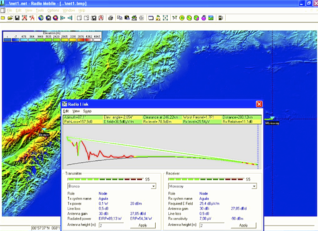

 

Figure OI 3: Profile of a 280 km path over which standard WiFi gear with
OpenWRT firmware which allows for the ACKtimeout increase was used to
transfer files at about 65 kb/s in April 2006 between Pico del Aguila
and El Baul in Venezuela.

 

Notice that the earth curvature is quite apparent, and was overcome
because one of the stations was at 4100 m altitude and the other at

155 m. Frequency was 2412 MHz, output power 100 mW, antenna gain around
30 dBi. Streaming video was successfully transmitted despite the limited
bandwidth.

 

A year later the experiment was repeated with the same WiFi gear but
with commercial 32 dBi antennas at both ends and similar results were
obtained. Then, another type of firmware developed by the TIER group at
UC Berkeley University that implements TDD (Time Division Duplexing) was
tried which showed a remarkable bidirectional throughput of 6 Mbit/s
with standard 802.11b hardware.

Moving the remote site to a 1400 m high hill called Platillon
(9.88905350°N, 67.50552400°W), provided a 380 km testbed over which the
experiment was again successfully repeated as described in the Case
Studies section in this book.

This can be illustrated by using an on-line version of Radio Mobile,
available at
[http://www.cplus.org/rmw/rmonline.htm](http://www.cplus.org/rmw/rmonline.html)l,
which is simpler to use, although it has some limitation as compared
with the downloadable version. One must register in the site, enter the
coordinates of the points over which the radio link has to be
established, the power values for the radios and the antennas gains and
height, and the software will fetch the relevant elevation data required
to perform the simulation of the link.

Keep in mind that only radio amateurs frequency are supported in the web
version, so 2.3 GHz should be used instead of 2.4 GHZ, but the results
are close enough and where validated by the experiment on the field.

 

In Figure OI 4 we show the output of the Radio Mobile on- line for this
experiment that can be replicated by the reader as an exercise.

 

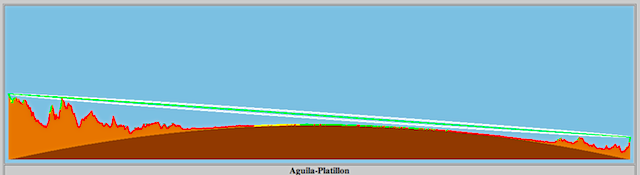

 

Figure OI 4: Profile of a 380 km test at 2.4 GHz performed in April and
August 2007, Venezuela.

 

Notice that the earth curvature is even more noticeable over the 380 km
path, but the height of the end points combined with flat land in
between allows for ample clearance of the first Fresnel zone.

 

Figure OI 5 shows the numerical values of the Radio Mobile on-line
simulation:

 

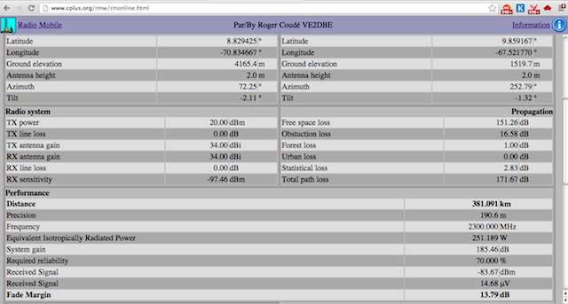

 

Figure OI 5: Results of the Radio Mobile on-line simulation for the 380
km link between Aguila and Platillon.

 

14. OFF-GRID POWER
------------------

### Solar Power

This chapter provides an introduction to standalone photovoltaic
systems. Standalone systems work without connection to an established
power grid. This chapter presents the basic concepts of the generation
and storage of photovoltaic solar energy. We will also provide a method
for designing a solar system with limited access to information and
resources. This chapter only discusses solar systems for the direct
production of electricity (photovoltaic solar energy). Thermal solar
energy systems are beyond the scope of this chapter.

#### Solar Energy

A photovoltaic system is based on the ability of photovoltaic panels to
convert sun radiation directly into electrical energy. The total amount
of solar energy that lights a given area is known as irradiance (G) and
it is measured in watts per square metre (W/m2). The instantaneous
values are normally averaged over a period of time, so it is common to
talk about total irradiance per hour, day or month. The amount of
irradiance that arrives at the surface of the Earth varies due to
natural weather variations and depends on the location. Therefore it is
necessary to work with statistical data based on the "solar history" of
a particular place. For many areas it can be difficult to acquire
detailed information, so we will need to work with approximate values in
this case.

A few organisations produce maps that include average values of daily
global irradiation for different regions. These values are known as peak
sun hours or PSHs. You can use the PSH value for your region to simplify
your calculations. One unit of "peak sun hours" corresponds to a
radiation of 1000 Watts per square metre for the duration of an hour. If
an area has 4 PSH per day in the worst of the months, it means we can
expect a daily irradiation of 4000 Wh/m2. Low resolution PSH
maps/calculation tools are available from a number of online sources
such as: http://www.wunderground.com/calculators/solar.html

For more detailed information, consult a local solar energy vendor or
weather station.

Airports normally record meteorological data including insolation.

#### What about wind power?

It is possible to use a wind generator in place of solar panels when an
autonomous system is being designed for installation on a hill or
mountain. To be effective, the average wind speed over the year should
be at least 3 to 4 metres per second, and the wind generator should be 6
metres higher than other objects within a distance of 100 metres.

A location far away from the coast usually lacks sufficient wind energy
to support a wind powered system.

Generally speaking, photovoltaic systems are more reliable than wind
generators, as sunlight is more available than consistent wind in most
places. On the other hand, wind generators are able to charge batteries
even at night, as long as there is sufficient wind. It is of course
possible to use wind in conjunction with solar power to help cover times
when there is extended cloud cover, or when there is insufficient wind.
In the Highlands and Islands of Scotland there is a project that uses
both solar and wind power generation. See the following link for more
information:
[http://www.wirelesswhitespace.org/projects/wind](http://www.wirelesswhitespace.org/projects/wind-fi-renewable-energy-basestation.aspx)-firenewable-energy-[basestation.aspx](http://www.wirelesswhitespace.org/projects/wind-fi-renewable-energy-basestation.aspx)

For most locations however, the cost of a good wind generator is not
justified by the meagre amount of power it will add to the overall
system. This chapter will therefore focus on the use of solar panels for
generating electricity.

### Photovoltaic system components

A basic photovoltaic system consists of four main components: solar
panel, battery, regulator, and load.

The panel is generating electricity. The battery stores electrical
energy. The regulator protects the battery against excessive charge and
discharge. The load refers to any device that requires electrical power.
It is important to remember that solar panels and batteries produce
direct current (DC). If the range of operational voltage of your
equipment does not fit the voltage supplied by your battery, it will
also be necessary to include some type of converter. If the equipment
that you want to power uses a different DC voltage than the one supplied
by the battery, you will need to use a DC/DC converter. If some of your
equipment requires AC power, you will need to use a DC/AC converter,
also known as an inverter. Every electrical system should also
incorporate various safety devices in the event that something goes
wrong.

These devices include proper wiring, circuit breakers, surge protectors,
fuses, ground rods, lighting arrestors, etc.

#### The solar panel

The solar panel is composed of solar cells that collect solar radiation
and transform it into electrical energy. This part of the system is
sometimes referred to as a solar module or photovoltaic generator.

Solar panel arrays can be made by connecting a set of panels in series
and/or parallel in order to provide the necessary energy for a given
load. The electrical current supplied by a solar panel varies
proportionally to the solar radiation. This will vary according to
climatic conditions, the hour of the day, and the time of the year.

 

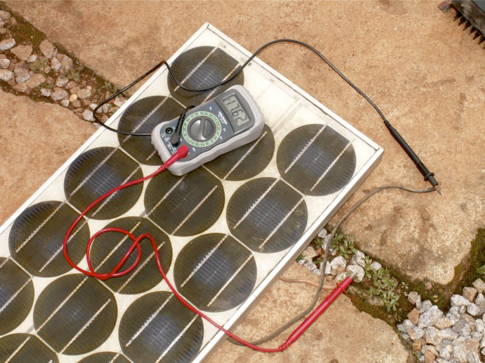

Figure OGP 1: A solar panel

 

Several technologies are used in the manufacture of solar cells.

The most common is crystalline silicon, and can be either
monocrystalline or polycrystalline. Amorphous silicon can be cheaper but
is less efficient at converting solar energy to electricity.  With a
reduced life expectancy and a 6 to 8% transformation efficiency,
amorphous silicon is typically used for low power equipment, such as
portable calculators.

New solar technologies, such as silicon ribbon and thin film
photovoltaics, are currently under development. These technologies
promise higher efficiencies but are not yet widely available.

#### The battery

The battery stores the energy produced by the panels that is not
immediately consumed by the load. This stored energy can then be used
during periods of low solar irradiation. The battery component is also
sometimes called the accumulator. Batteries store electricity in the
form of chemical energy. The most common type of batteries used in solar
applications are maintenance-free lead-acid batteries, also called
recombinant or VRLA (valve regulated lead acid) batteries.

 

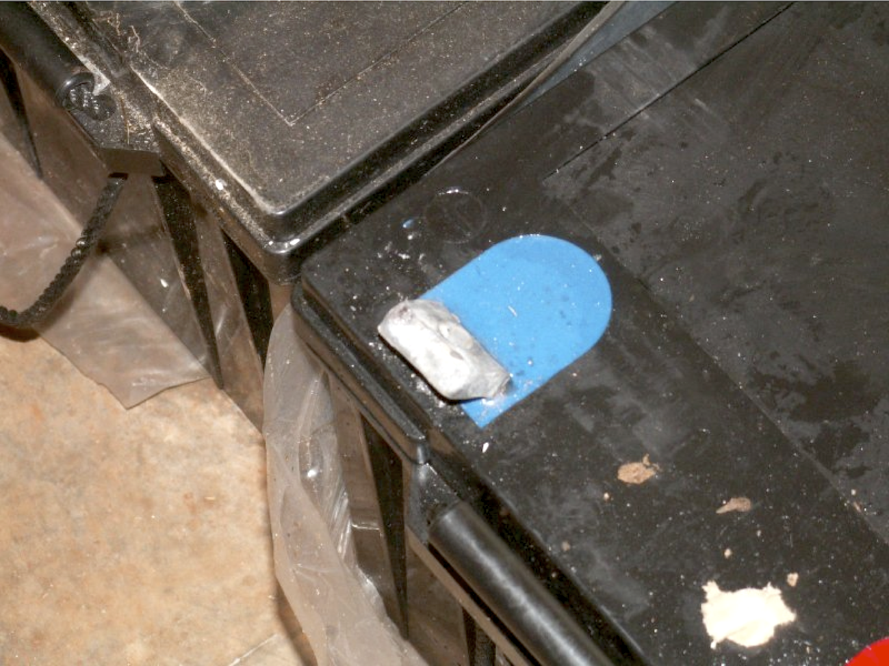

 

Figure OGP 2: A 200 Ah lead-acid battery. The negative terminal was
broken due to weight on the terminals during transportation.

 

Aside from storing energy, sealed lead-acid batteries also serve two
important functions:

-   •They are able to provide an instantaneous power superior to that of
    the array of panels. This instantaneous power is needed to start
    some appliances, such as the motor of a refrigerator or a pump. 

-   •They determine the operating voltage of your installation. 

For a small power installation and where space constraints are
important, other types of batteries (such as NiCd, NiMh, or Li-ion) can
be used.

These types of batteries need a specialised charger/regulator and cannot
directly replace lead-acid batteries.

#### The regulator

The regulator (or more formally, the solar power charge regulator)
assures that the battery is working in appropriate conditions. It avoids
overcharging or overdischarging the battery, both of which are very
detrimental to the life of the battery. To ensure proper charging and
discharging of the battery, the regulator maintains knowledge of the
state of charge (SoC) of the battery. The SoC is estimated based on the
actual voltage of the battery.

By measuring the battery voltage and being programmed with the type of
storage technology used by the battery, the regulator will know the
precise points where the battery would be overcharged or excessively
discharged.

 

Figure OGP 3: A 30 Amp solar charge controller

 

The regulator can include other features that add valuable information
and security control to the equipment. These features include ammeters,
voltmeters, measurement of ampere-hour, timers, alarms, etc. While
convenient, none of these features are required for a working
photovoltaic system.

#### The converter

The electricity provided by the panel array and battery is DC at a fixed
voltage. The voltage provided might not match what is required by your
load. A direct/alternating (DC/AC) converter, also known as inverter,
converts the DC current from your batteries into AC. This comes at the
price of losing some energy during the conversion. If necessary, you can
also use converters to obtain DC at voltage level other than what is
supplied by the batteries. DC/DC converters also lose some energy during
the conversion. For optimal operation, you should design your
solar-powered system so that the generated DC voltage matches the load.

 

 

Figure OGP 4: An 800 Watt DC/AC converter (power inverter)

#### The load

The load is the equipment that consumes the power generated by your
energy system.

The load may include wireless communications equipment, routers,
workstations, lamps, TV sets, VSAT modems, etc.

Although it is not possible to precisely calculate the exact total
consumption of your equipment, it is vital to be able to make a good
estimate.

In this type of system it is absolutely necessary to use efficient and
low power equipment to avoid wasting energy.

#### Putting it all together

The complete photovoltaic system incorporates all of these components.
The solar panels generate power when solar energy is available.

The regulator ensures the most efficient operation of the panels and
prevents damage to the batteries. The battery bank stores collected
energy for later use.

Converters and inverters adapt the stored energy to match the
requirements of your load. Finally, the load consumes the stored energy
to do work.

 

When all of the components are in balance and are properly maintained,
the system will support itself for years.

 

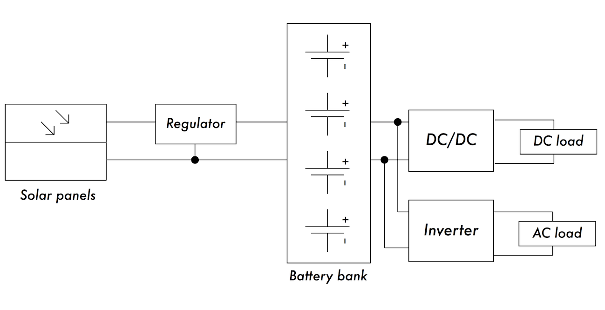

 

Figure OGP 5: A solar installation with DC and AC loads

 

We will now examine each of the individual components of the

photovoltaic system in greater detail.

### The solar panel

An individual solar panel is made of many solar cells.

The cells are electrically connected to provide a particular value of
current and voltage.

The individual cells are properly encapsulated to provide isolation and
protection from humidity and corrosion.

 

Figure OGP 6: The effect of water and corrosion in a solar panel

 

There are different types of modules available on the market, depending
on the power demands of your application. The most common modules are
composed of 32 or 36 solar cells of crystalline silicon. These cells are
all of equal size, wired in series, and encapsulated between glass and
plastic material, using a polymer resin (EVA) as a thermal insulator.

The surface area of the module is typically between 0.1 and 0.5 m2.
Solar panels usually have two electrical contacts, one positive and one
negative.

Some panels also include extra contacts to allow the installation of
bypass diodes across individual cells.

Bypass diodes protect the panel against a phenomenon known as
“hot-spots”. A hot-spot occurs when some of the cells are in shadow
while the rest of the panel is in full sun. Rather than producing
energy, shaded cells behave as a load that dissipates energy. In this
situation, shaded cells can see a significant increase in temperature
(about 85 to 100ºC.)

Bypass diodes will prevent hot-spots on shaded cells, but reduce the
maximum voltage of the panel. They should only be used when shading is
unavoidable. It is a much better solution to expose the entire panel to
full sun whenever possible.

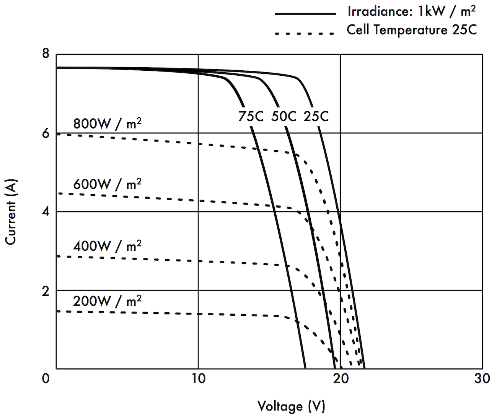

 

Figure OGP 7: Different IV Curves. The current (A) changes with the
irradiance, and the voltage (V) changes with the temperature.

 

The electrical performance of a solar module is represented by the IV
characteristic curve, which represents the current that is provided
based on the voltage generated for a certain solar radiation.

 

The curve represents all the possible values of voltage-current.

The curves depend on two main factors: the temperature and the solar
radiation received by the cells.

For a given solar cell area, the current generated is directly
proportional to solar irradiance (G), while the voltage reduces slightly
with an increase of temperature.

 

A good regulator will try to maximise the amount of energy that a panel
provides by tracking the point that provides maximum power (V x I). The
maximum power corresponds to the knee of the IV curve.

#### Solar Panel Parameters

The main parameters that characterise a photovoltaic panel are:

 

1.  1.  1.  1.Short Circuit Current (ISC): the maximum current provided
            by the panel when the connectors are short circuited. 

        2.  2.Open Circuit Voltage (VOC): the maximum voltage that the
            panel provides when the terminals are not connected to any
            load (an open circuit). This value is normally 22 V for
            panels that are going to work in 12 V systems, and is
            directly proportional to the number of cells connected in
            series. 

        3.  3.Maximum Power Point (Pmax): the point where the power
            supplied by the panel is at maximum, where Pmax = Imax x
            Vmax. 

 

The maximum power point of a panel is measured in Watts (W) or peak
Watts (Wp). It is important not to forget that in normal conditions the
panel will not work at peak conditions, as the voltage of operation is
fixed by the load or the regulator. Typical values of Vmax and Imax
should be a bit smaller than the ISC and VOC.

 

1.  1.  1.  1.Fill Factor (FF): the relation between the maximum power
            that the panel can actually provide and the product ISC .
            VOC. This gives you an idea of the quality of the panel
            because it is an indication of the type of IV characteristic
            curve. The closer FF is to 1, the more power a panel can
            provide. Common values usually are between 0.7 and 0.8. 

        2.  2.Efficiency (η): the ratio between the maximum electrical
            power that the panel can give to the load and the power of
            the solar radiation (pl) incident on the panel. This is
            normally around 10-12%, depending on the type of cells
            (monocrystalline, polycrystalline, amorphous or thin film). 

 

Considering the definitions of point of maximum power and the fill
factor we see that:

η = Pmax / PL = FF . ISC . VOC / PL

 

The values of ISC, VOC, IPmax and VPmax are provided by the manufacturer
and refer to standard conditions of measurement with irradiance G = 1000
W/m2, at sea-level, for a temperature of cells of Tc = 25ºC.

 

The panel parameter values change for other conditions of irradiance and
temperature. Manufacturers will sometimes include graphs or tables with
values for conditions different from the standard. You should check the
performance values at the panel temperatures that are likely to match
your particular installation.

Be aware that two panels can have the same Wp but very different
behaviour in different operating conditions. When acquiring a panel, it
is important to verify, if possible, that their parameters (at least,
ISC and VOC) match the values promised by the manufacturer.

#### Panel parameters for system sizing

To calculate the number of panels required to cover a given load, you
just need to know the current and voltage at the point of maximum power:
IPmax and VPmax.

You should always be aware that the panel is not going to perform under
perfect conditions as the load or regulation system is not always going
to work at the point of maximum power of the panel. You should assume a
loss of efficiency of 5% in your calculations to compensate for this.

#### Interconnection of panels

A solar panel array is a collection of solar panels that are
electrically interconnected and installed on some type of support
structure. Using a solar panel array allows you to generate greater
voltage and current than is possible with a single solar panel. The
panels are interconnected in such a way that the voltage generated is
close to (but greater than) the level of voltage of the batteries, and
that the current generated is sufficient to feed the equipment and to
charge the batteries.

 

Connecting solar panels in series increases the generated voltage.
Connecting panels in parallel increases the current.

The number of panels used should be increased until the amount of power
generated slightly exceeds the demands of your load.

 

It is very important that all of the panels in your array are as
identical as possible. In an array, you should use panels of the same
brand and characteristics because any difference in their operating
conditions will have a big impact on the health and performance of your
system.

 

Even panels that have identical performance ratings will usually display
some variance in their characteristics due to manufacturing processes.

 

The actual operating characteristics of two panels from the same
manufacturer can vary by as much as ±10%.

Whenever possible, it is a good idea to test the real-world performance
of individual panels to verify their operating characteristics before
assembling them into an array.

 

 

Figure OGP 8: Interconnection of panels in parallel. The voltage remains
constant while the current duplicates. (Photo: Fantsuam Foundation,
Nigeria)

#### How to choose a good panel

One obvious metric to use when shopping for solar panels is to compare
the ratio of the nominal peak power (Wp) to the price. This will give
you a rough idea of the cost per Watt for different panels. But there
are a number of other considerations to keep in mind as well.

If you are going to install solar panels in geographical areas where
soiling (from dust, sand, or grit) will likely be a problem, consider
purchasing panels with a low affinity for soil retention.

These panels are made of materials that increase the likelihood that the
panel will be automatically cleaned by wind and rain.

Always check the mechanical construction of each panel. Verify that the
glass is hardened and the aluminum frame is robust and well built. The
solar cells inside the panel can last for more than 20 years, but they
are very fragile and the panel must protect them from mechanical
hazards. Look for the manufacturer's quality guarantee in terms of
expected power output and mechanical construction.

 

Finally, be sure that the manufacturer provides not only the nominal
peak power of the panel (Wp) but also the variation of the power with
irradiation and temperature. This is particularly important when panels
are used in arrays, as variations in the operating parameters can have a
big impact on the quality of power generated and the useful lifetime of
the panels.

### The battery

The battery “hosts” a certain reversible chemical reaction that stores
electrical energy that can later be retrieved when needed. Electrical
energy is transformed into chemical energy when the battery is being
charged, and the reverse happens when the battery is discharged. A
battery is formed by a set of elements or cells arranged in series.
Lead-acid batteries consist of two submerged lead electrodes in an
electrolytic solution of water and sulphuric acid. A potential
difference of about 2 volts takes place between the electrodes,
depending on the instantaneous value of the charge state of the battery.

The most common batteries in photovoltaic solar applications have a
nominal voltage of 12 or 24 volts. A 12 V battery therefore contains 6
cells in series.

The battery serves two important purposes in a photovoltaic system: to
provide electrical energy to the system when energy is not supplied by
the array of solar panels, and to store excess energy generated by the
panels whenever that energy exceeds the load. The battery experiences a
cyclical process of charging and discharging, depending on the presence
or absence of sunlight.

During the hours that there is sun, the array of panels produces
electrical energy. The energy that is not consumed immediately is used
to charge the battery.

During the hours of absence of sun, any demand of electrical energy is
supplied by the battery, thereby discharging it.

These cycles of charge and discharge occur whenever the energy produced
by the panels does not match the energy required to support the load.
When there is sufficient sun and the load is light, the batteries will
charge.

 

Obviously, the batteries will discharge at night whenever any amount of
power is required. The batteries will also discharge when the irradiance
is insufficient to cover the requirements of the load (due to the
natural variation of climatological conditions, clouds, dust, etc.)

 

If the battery does not store enough energy to meet the demand during
periods without sun, the system will be exhausted and will be
unavailable for consumption. On the other hand, oversizing the system
(by adding far too many panels and batteries) is expensive and
inefficient. When designing a stand-alone system we need to reach a
compromise between the cost of components and the availability of power
from the system.

 

One way to do this is to estimate the required number of days of
autonomy. In the case of a telecommunications system, the number of days
of autonomy depends on its critical function within your network design.
If the equipment is going to serve as a repeater and is part of the
backbone of your network, you will likely want to design your
photovoltaic system with an autonomy of up to 5-7 days.

On the other hand, if the solar system is responsible for a providing
energy to client equipment you can probably reduce number of days of
autonomy to two or three. In areas with low irradiance, this value may
need to be increased even more. In any case, you will always have to
find the proper balance between cost and reliability.

#### Types of batteries

Many different battery technologies exist, and are intended for use in a
variety of different applications. The most suitable type for
photovoltaic applications is the stationary battery, designed to have a
fixed location and for scenarios where the power consumption is more or
less irregular. "Stationary" batteries can accommodate deep discharge
cycles, but they are not designed to produce high currents in brief
periods of time.

Stationary batteries can use an electrolyte that is alkaline (such as
Nickel-Cadmium) or acidic (such as Lead-Acid).

Stationary batteries based on Nickel-Cadmium are recommended for their
high reliability and resistance whenever possible. Unfortunately, they
tend to be much more expensive and difficult to obtain than sealed
lead-acid batteries. In many cases when it is difficult to find local,
good and cheap stationary batteries (importing batteries is not cheap),
you will be forced to use batteries targeted to the automobile market.

#### Using car batteries

Automobile batteries are not well suited for photovoltaic applications
as they are designed to provide a substantial current for just few
seconds (when starting then engine) rather than sustaining a low current
for long period of time. This design characteristic of car batteries
(also called traction batteries) results in a shortened effective life
when used in photovoltaic systems. Traction batteries can be used in
small applications where low cost is the most important consideration,
or when other batteries are not available.

 

Traction batteries are designed for vehicles and electric wheelbarrows.
They are cheaper than stationary batteries and can serve in a
photovoltaic installation, although they require very frequent
maintenance. These batteries should never be deeply discharged, because
doing so will greatly reduce their ability to hold a charge. A truck
battery should not be discharged to more than 70% of its total capacity.
This means that you can only use a maximum of 30% of a lead-acid
battery's nominal capacity before it must be recharged.

You can extend the life of a lead-acid battery by using distilled water.
By using a densimeter or hydrometer, you can measure the density of the
battery's electrolyte. A typical battery has specific gravity of 1.28.

Adding distilled water and lowering the density to 1.2 can help reduce
the anode's corrosion, at a cost of reducing the overall capacity of the
battery. If you adjust the density of battery electrolyte, you must use
distilled water, as tap water or well water will permanently damage the
battery.

#### States of charge

There are two special states of charge that can take place during the
cyclic charge and discharge of the battery. They should both be avoided
in order to preserve the useful life of the battery.

 

1.  ​1. Overcharge

Overcharge takes place when the battery arrives at the limit of its
capacity. If energy is applied to a battery beyond its point of maximum
charge, the electrolyte begins to break down.

 

This produces bubbles of oxygen and hydrogen, in a process is known as
gasification. This results in a loss of water, oxidation on the positive
electrode, and in extreme cases, a danger of explosion.

On the other hand, the presence of gas avoids the stratification of the
acid. After several continuous cycles of charge and discharge, the acid
tends to concentrate itself at the bottom of the battery thereby
reducing the effective capacity. The process of gasification agitates
the electrolyte and avoids stratification.

 

Again, it is necessary to find a compromise between the advantages
(avoiding electrolyte stratification) and the disadvantages (losing
water and production of hydrogen). One solution is to allow a slight
overcharge condition every so often. One typical method is to allow a
voltage of 2.35 to 2.4 Volts for each element of the battery every few
days, at 25ºC. The regulator should ensure a periodic and controlled
overcharges.

 

1.  ​2. Overdischarge

In the same way that there is a upper limit, there is also a lower limit
to a battery's state of charge. Discharging beyond that limit will
result in deterioration of the battery. When the effective battery
supply is exhausted, the regulator prevents any more energy from being
extracted from the battery. When the voltage of the battery reaches the
minimum limit of 1.85 Volts per cell at 25°C, the regulator disconnects
the load from the battery.

 

If the discharge of the battery is very deep and the battery remains
discharged for a long time, three effects take place: the formation of
crystallised sulphate on the battery plates, the loosening of the active
material on the battery plate, and plate buckling. The process of
forming stable sulphate crystals is called hard sulphation. This is
particularly negative as it generates big crystals that do not take part
in any chemical reaction and can make your battery unusable.

#### Battery Parameters

The main parameters that characterise a battery are:

 

        Nominal Voltage, VNBat: the most common value being 12 V.

 

        Nominal Capacity, CNBat: the maximum amount of energy that can
be extracted from a fully charged battery. It is expressed in
Ampere-hours (Ah) or Watt-hours (Wh).

The amount of energy that can be obtained from a battery depends on the
time in which the extraction process takes place. Discharging a battery
over a long period will yield more energy compared to discharging the
same battery over a short period. The capacity of a battery is therefore
specified at different discharging times. For photovoltaic applications,
this time should be longer than 100 hours (C100).

 

        Maximum Depth of Discharge, DoDmax: The depth of discharge is
the amount of energy extracted from a battery in a single

discharge cycle, expressed as a percentage. The life expectancy of a
battery depends on how deeply it is discharged in each cycle. The
manufacturer should provide graphs that relate the number of
charge-discharge cycles to the life of the battery. As a general rule
you should avoid discharging a deep cycle battery beyond 50%. Traction
batteries should only be discharged by as little as 30%.

 

        Useful Capacity, CUBat: It is the real (as in usable) capacity
of a battery. It is equal to the product of the nominal capacity and the
maximum DoD. For example, a stationary battery of nominal capacity
(C100) of 120 Ah and depth of discharge of 70% has a useful capacity of
(120 x 0.7) = 84 Ah.

#### Measuring the state of charge of the battery

A sealed lead-acid battery of 12 V provides different voltages depending
on its state of charge. When the battery is fully charged in an open
circuit, the output voltage is about 12.8 V.

The output voltage lowers quickly to 12.6 V when loads are attached. As
the battery is providing constant current during operation, the battery
voltage reduces linearly from 12.6 to 11.6 V depending on the state of
charge.

A sealed lead- acid batteries provides 95% of its energy within this
voltage range. If we make the broad assumption that a fully loaded
battery has a voltage of 12.6 V when "full" and 11.6 V when "empty", we
can estimate that a battery has discharged 70% when it reaches a voltage
of 11.9 V.

 

These values are only a rough approximation since they depend on the
life and quality of the battery, the temperature, etc.

 

State of Charge

12V Battery Voltage

Volts per Cell

100%

12.7

2.12

90%

12.5

2.08

80%

12.42

2.07

70%

12.32

2.05

60%

12.2

2.03

50%

12.06

2.01

40%

11.9

1.98

30%

11.75

1.96

20%

11.58

1.93

10%

11.31

1.89

 

According to this table, and considering that a truck battery should not
be discharged more than 20% to 30%, we can determine that the useful
capacity of a 170 Ah truck battery is 34 Ah (20%) to 51 Ah (30%). Using
the same table, we find that we should program the regulator to prevent
the battery from discharging below 12.3 V.

#### Battery and regulator protection

Thermomagnetic circuit breakers or one time fuses must be used to
protect the batteries and the installation from short circuit and
malfunctions. There are two types of fuses: slow blow, and quick blow.
Slow blow fuses should be used with inductive or capacitive loads where
a high current can occur at power up. Slow blow fuses will allow a
higher current than their rating to pass for a short time. Quick blow
fuses will immediately blow if the current flowing through them is
higher than their rating.

 

The regulator is connected to the battery and the loads, so two
different kinds of protection need to be considered. One fuse should be
placed between the battery and the regulator, to protect the battery
from short-circuit in case of regulator failure. A second fuse is needed
to protect the regulator from excessive load current.

This second fuse is normally integrated into the regulator itself.

 

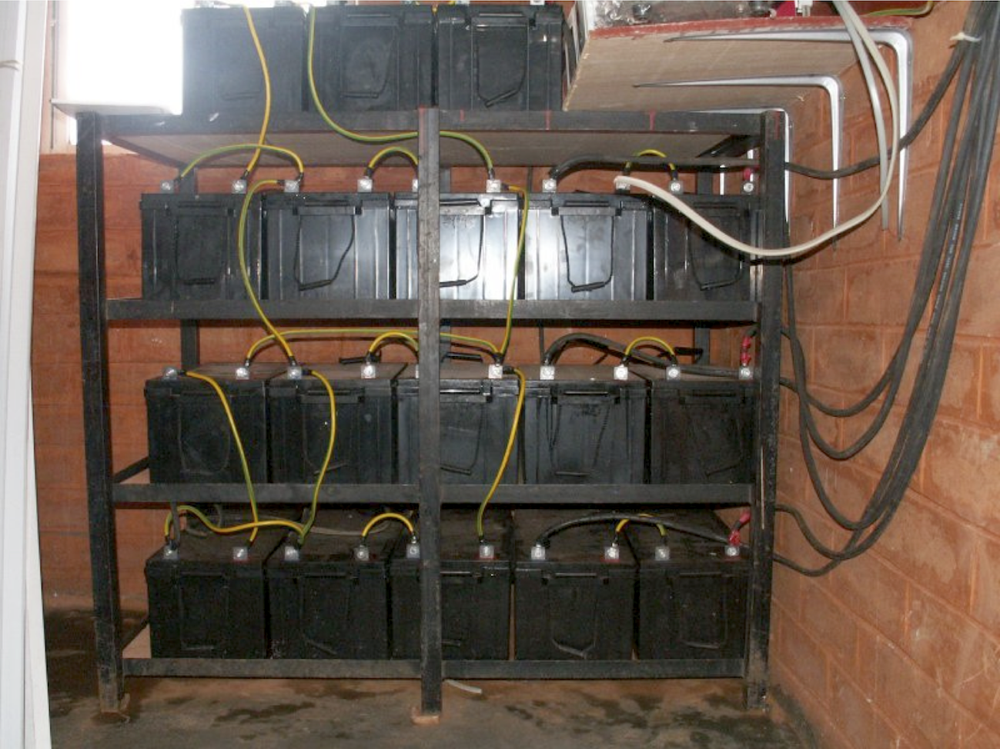

 

Figure OGP 9: A battery bank of 3600 Ah, currents reach levels of 45 A
during charging

 

Every fuse is rated with a maximum current and a maximum usable voltage.
The maximum current of the fuse should be 20% bigger than the maximum
current expected. Even if the batteries carry a low voltage, a short
circuit can lead to a very high current which can easily reach several
hundred amperes.

Large currents can cause fire, damage the equipment and batteries, and
possibly cause electric shock to a human body. If a fuse breaks, never
replace a fuse with a wire or a higher rated fuse. First determine the
cause of the problem, then replace the fuse with another one which has
the same characteristics.

### Temperature effects

The ambient temperature has several important effects on the
characteristics of a battery:

 

-   •The nominal capacity of a battery (that the manufacturer usually
    gives for 25°C) increases with temperature at the rate of about
    1%/°C.  But if the temperature is too high, the chemical reaction
    that takes place in the battery accelerates, which can cause the
    same type of oxidation that takes place during overcharging. This
    will obviously reduce the life expectancy of a battery. This problem
    can be compensated partially in car batteries by using a low density
    of dissolution (a specific gravity of 1.25 when the battery is
    totally charged). 

     

-   •As the temperature is reduced, the useful life of the battery
    increases. But if the temperature is too low, you run the the risk
    of freezing the electrolyte. The freezing temperature depends on the
    density of the solution, which is also related to the state of
    charge of the battery. The lower the density, the greater the risk
    of freezing. In areas of low temperatures, you should avoid deeply
    discharging the batteries (that is, DoDmax is effectively reduced.) 

     

-   •The temperature also changes the relation between voltage and
    charge. It is preferable to use a regulator which adjusts the low
    voltage disconnect and reconnect parameters according to
    temperature. The temperature sensor of the regulator should be fixed
    to the battery using tape or some other simple method. 

-   •In hot areas it is important to keep the batteries as cool as
    possible. The batteries must be stored in a shaded area and never
    get direct sunlight. It's also desirable to place the batteries on a
    small support to allow air to flow under them, thus increase the
    cooling. 

#### How to choose a good battery

Choosing a good battery can be very challenging.

High capacity batteries are heavy, bulky and expensive to import.

 

A 200 Ah battery weighs around 50 kg (120 pounds) and it cannot be
transported as hand luggage.

If you want long-life (as in \> 5 years) and maintenance free batteries
be ready to pay the price.

 

A good battery should always come with its technical specifications,
including the capacity at different discharge rates (C20, C100),
operating temperature, cut-off voltage points, and requirements for
chargers.

 

The batteries must be free of cracks, liquid spillage or any sign of
damage, and battery terminals should be free of corrosion.

As laboratory tests are necessary to obtain complete data about real
capacity and aging, expect lots of low quality batteries (including
fakes) in the local markets. A typical price (not including transport
and import tax) is \$3-4 USD per Ah for 12 V lead-acid batteries.

#### Life expectancy versus number of cycles

Batteries are the only component of a solar system that should be
amortised over a short period and regularly replaced.

You can increase the useful lifetime of a battery by reducing the depth
of discharge per cycle. Even deep cycle batteries will have an increased
battery life if the number of deep discharge (\>30%) cycles is reduced.

If you completely discharge the battery every day, you will typically
need to change it after less than one year. If you use only 1/3 of the
capacity the battery, it can last more than 3 years. It can be cheaper
to buy a battery with 3 times the capacity than to change the battery
every year.

### The charge regulator

The charge regulator is also known as a charge controller, a voltage
regulator, a charge-discharge controller or a charge-discharge and load
controller. The regulator sits between the array of panels, the
batteries, and your equipment or loads.

Remember that the voltage of a battery, although always close to 2 V per
cell, varies according to its state of charge. By monitoring the voltage
of the battery, the regulator prevents overcharging or overdischarging.

Regulators used in solar applications should be connected in series:
they disconnect the array of panels from the battery to avoid
overcharging, and they disconnect the battery from the load to avoid
overdischarging.

The connection and disconnection is done by means of switches which can
be of two types: electromechanical (relays) or solid state (bipolar
transistor, MOSFET). Regulators should never be connected in parallel.

In order to protect the battery from gasification, the switch opens the
charging circuit when the voltage in the battery reaches its high
voltage disconnect (HVD) or cut-off set point. The low voltage
disconnect (LVD) prevents the battery from overdischarging by
disconnecting or shedding the load. To prevent continuous connections
and disconnections the regulator will not connect back the loads until
the battery reaches a low reconnect voltage (LRV).

 

Typical values for a 12 V lead-acid battery are:

 

Voltage Point

Voltage

LVD

11.5

LRV

12.6

Constant Voltage Regulated

14.3

Equalisation

14.6

HVD

15.5

 

The most modern regulators are also able to automatically disconnect the
panels during the night to avoid discharging of the battery.

They can also periodically overcharge the battery to improve its life,
and they may use a mechanism known as pulse width modulation (PWM) to
prevent excessive gassing.

As the peak power operating point of the array of panels will vary with
temperature and solar illumination, new regulators are capable of
constantly tracking the maximum point of power of the solar array. This
feature is known as maximum power point tracking (MPPT).

#### Regulator Parameters

When selecting a regulator for your system, you should at least know the
operating voltage and the maximum current that the regulator can handle.
The operating voltage will be 12, 24, or 48 V. The maximum current must
be 20% bigger than the current provided by the array of panels connected
to the regulator.

 

Other features and data of interest include:

-   •Specific values for LVD, LRV and HVD. 

-   •Support for temperature compensation. The voltage that indicates
    the state of charge of the battery varies with temperature. For that
    reason some regulators are able to measure the battery temperature
    and correct the different cut-off and reconnection values.  

-   •Instrumentation and gauges. The most common instruments measure the
    voltage of the panels and batteries, the state of charge (SoC) or
    Depth of Discharge (DoD). Some regulators include special alarms to
    indicate that the panels or loads have been disconnected, LVD or HVD
    has been reached, etc. 

### Converters

The regulator provides DC power at a specific voltage.

Converters and inverters are used to adjust the voltage to match the
requirements of your load.

#### DC/DC Converters

DC/DC converters transform a continuous voltage to another continuous
voltage of a different value. There are two conversion methods which can
be used to adapt the voltage from the batteries: linear conversion and
switching conversion.Linear conversion lowers the voltage from the
batteries by converting excess energy to heat. This method is very
simple but is obviously inefficient. Switching conversion generally uses
a magnetic component to temporarily store the energy and transform it to
another voltage. The resulting voltage can be greater, less than, or the
inverse (negative) of the input voltage. The efficiency of a linear
regulator decreases as the difference between the input voltage and the
output voltage increases. For example, if we want to convert from 12 V
to 6 V, the linear regulator will have an efficiency of only 50%.

A standard switching regulator has an efficiency of at least 80%.

#### DC/AC Converter or Inverter

Inverters are used when your equipment requires AC power. Inverters chop
and invert the DC current to generate a square wave that is later
filtered to approximate a sine wave and eliminate undesired harmonics.
Very few inverters actually supply a pure sine wave as output. Most
models available on the market produce what is known as "modified sine
wave", as their voltage output is not a pure sinusoid. When it comes to
efficiency, modified sine wave inverters perform better than pure
sinusoidal inverters.

Be aware that not all the equipment will accept a modified sine wave as
voltage input. Most commonly, some laser printers will not work with a
modified sine wave inverter. Motors will work, but they may consume more
power than if they are fed with a pure sine wave. In addition, DC power
supplies tend to warm up more, and audio amplifiers can emit a buzzing
sound.

Aside from the type of waveform, some important features of inverters
include:

        Reliability in the presence of surges. Inverters have two power
ratings: one for continuous power, and a higher rating for peak power.
They are capable of providing the peak power for a very short amount of
time, as when starting a motor. The inverter should also be able to
safely interrupt itself (with a circuit breaker or fuse) in the event of
a short circuit, or if the requested power is too high.

 

        Conversion efficiency. Inverters are most efficient when
providing 50% to 90% of their continuous power rating.

You should select an inverter that most closely matches your load
requirements.

The manufacturer usually provides the performance of the inverter at 70%
of its nominal power.

 

        Battery charging. Many inverters also incorporate the inverse
function: the possibility of charging batteries in the presence of an
alternative source of current (grid, generator, etc). This type of
inverter is known as a charger/inverter.

 

        Automatic fall-over. Some inverters can switch automatically
between different sources of power (grid, generator, solar) depending on
what is available.

 

When using telecommunication equipment, it is best to avoid the use of
DC/AC converters and feed them directly from a DC source. Most
communications equipment can accept a wide range of input voltage.

### Equipment or load

It should be obvious that as power requirements increase, the expense of
the photovoltaic system also increases. It is therefore critical to
match the size of the system as closely as possible to the expected
load.

When designing the system you must first make a realistic estimate of
the maximum consumption.

Once the installation is in place, the established maximum consumption
must be respected in order to avoid frequent power failures.

#### Home Appliances

The use of photovoltaic solar energy is not recommended for
heat-exchange applications (electrical heating, refrigerators, toasters,
etc.).Whenever possible, energy should be used sparingly using low power
appliances.

Here are some points to keep in mind when choosing appropriate equipment
for use with a solar system:

-   •The photovoltaic solar energy is suitable for illumination. In this
    case, the use of halogen light bulbs or fluorescent lamps is
    mandatory. Although these lamps are more expensive, they have much
    better energy efficiency than incandescent light bulbs. LED lamps
    are also a good choice as they are very efficient and are fed with
    DC. 

-   •It is possible to use photovoltaic power for appliances that
    require low and constant consumption (as in a typical case, the TV).
    Smaller televisions use less power than larger televisions. Also
    consider that a black-and-white TV consumes about half the power of
    a colour TV. 

-   •Photovoltaic solar energy is not recommended for any application
    that transforms energy into heat (thermal energy). Use solar heating
    or butane as an alternative. 

-   •Conventional automatic washing machines will work, but you should
    avoid the use of any washing programs that include centrifugal water
    heating. 

-   •If you must use a refrigerators, it should consume as little power
    as possible. There are specialised refrigerators that work on DC,
    although their consumption can be quite high (around 1000 Wh/day). 

     

The estimation of total consumption is a fundamental step in sizing your
solar system. Here is a table that gives you a general idea of the power
consumption that you can expect from different appliances.

 

Equipment

Consumption (Watts)

Portable Computer

30-50

Low Power Lamp

6-10

Router with one radio

4-10

VSAT modem

15-30

PC without LCD

20-30

PC with LCD

200-300

16 port Network switch

6-8

#### Wireless telecommunications equipment

Saving power by choosing the right gear saves a lot of money and
trouble. For example, a long distance link doesn't necessarily need a
strong amplifier that draws a lot of power.

A Wi-Fi card with good receiver sensitivity and a Fresnel zone that is
at least 60% clear will work better than an amplifier, and save power
consumption as well.

A well known saying of radio amateurs applies here, too: the best
amplifier is a good antenna. Further measures to reduce power
consumption include throttling the CPU speed, reducing transmit power to
the minimum value that is necessary to provide a stable link, increasing
the length of beacon intervals, and switching the system off during
times it is not needed.

Most autonomous solar systems work at 12 or 24 volts. Preferably, a
wireless device that runs on DC voltage should be used, operating at the
12 Volts that most lead acid batteries provide.

Transforming the voltage provided by the battery to AC or using a
voltage at the input of the access point different from the voltage of
the battery will cause unnecessary energy loss. A router or access point
that accepts 8-20 Volts DC is perfect.

Most cheap Access Points have a switched mode voltage regulator inside
and will work through such a voltage range without modification or
becoming hot (even if the device was shipped with a 5 or 12 Volt power
supply).

WARNING: Operating your Access Point with a power supply other than the
one provided by your manufacturer will certainly void any warranty, and
may cause damage to your equipment. While the following technique will
typically work as described, remember that should you attempt it, you do
so at your own risk.

 

Open your Access Point and look near the DC input for two relatively big
capacitors and an inductor (a ferrite toroid with copper wire wrapped
around it). If they are present then the device has a switched mode
input, and the maximum input voltage should be somewhat below the
voltage printed on the capacitors. Usually the rating of these
capacitors is 16 or 25 volts.

Be aware that an unregulated power supply has a ripple and may feed a
much higher voltage into your Access Point than the typical voltage
printed on it may suggest. So, connecting an unregulated power supply
with 24 Volts to a device with 25 Volt-capacitors is not a good idea.

Of course, opening your device will void any existing warranty. Do not
try to operate an Access Point at higher voltage if it doesn't have a
switched mode regulator. It will get hot, malfunction, or burn.

Equipment based on traditional Intel x86 CPUs are power hungry in
comparison with RISC-based architectures as ARM or MIPS.

One of the boards with lowest power consumptions is the Soekris platform
that uses an AMD ElanSC520 processor. Another alternative to AMD (ElanSC
or Geode SC1100) is the use of equipment with MIPS processors. MIPS
processors have a better performance than an AMD Geode at the price of
consuming between 20-30% of more energy.

The amount of power required by wireless equipment depends not only on
the architecture but on the number of network interfaces, radios, type
of memory/storage and traffic.

As a general rule, a wireless board of low consumption consumes 2 to 3
W, and a 200 mW radio card consumes as much as 3 W. High power cards
(such as the 400 mW Ubiquiti) consume around 6 W. A repeating station
with two radios can range between 8 and 10 W.

 

Although the standard IEEE 802.11 incorporates a power saving mode (PS)
mechanism, its benefit is not as good as you might hope. The main
mechanism for energy saving is to allow stations to periodically put
their wireless cards to "sleep" by means of a timing circuit.

 

When the wireless card wakes up it verifies if a beacon exists,
indicating pending traffic. The energy saving therefore only takes place
on the client side, as the access point always needs to remain awake to
send beacons and store traffic for the clients. Power saving mode may be
incompatible between implementations from different manufacturers, which
can cause unstable wireless connections. It is nearly always best to
leave power saving mode disabled on all equipment, as the difficulties
created will likely outweigh the meagre amount of saved power.

#### Selecting the voltage

Most low power stand-alone systems use 12 V battery power as that is the
most common operational voltage in sealed lead-acid batteries.

When designing a wireless communication system you need to take into
consideration the most efficient voltage of operation of your equipment.
While the input voltage can accept a wide range of values, you need to
ensure that the overall power consumption of the system is minimal.

#### Wiring

An important component of the installation is the wiring, as proper
wiring will ensure efficient energy transfer. Some good practices that
you should consider include:

-   •Use a screw to fasten the cable to the battery terminal. Loose
    connections will waste power. 

-   •Spread Vaseline or mineral jelly on the battery terminals. Corroded
    connections have an increased resistance, resulting in loss. 

 

Wire size is normally given in American Wire Gauge (AWG).

 

During your calculations you will need to convert between AWG and mm2 to
estimate cable resistance. For example, an AWG \#6 cable has a diameter
of 4.11 mm and can handle up to 55 A.

A conversion chart, including an estimate of resistance and current
carrying capacity, is available in Appendix D: Cables Sizes. Keep in
mind that the current carrying capacity can also vary depending on the
type of insulation and application. When in doubt, consult the
manufacturer for more information.

### Orientation of the panels

Most of the energy coming from the sun arrives in a straight line. The
solar module will capture more energy if it is “facing” the sun,
perpendicular to the straight line between the position of the
installation and the sun. Of course, the sun's position is constantly
changing relative to the earth, so we need to find an optimal position
for our panels. The orientation of the panels is determined by two
angles, the azimuth a and the inclination or elevation ß. The azimuth is
the angle that measures the deviation with respect to the south in the
northern hemisphere, and with respect to the north in the southern
hemisphere. The inclination is the angle formed by the surface of the
module and the horizontal plane.

#### Azimuth

You should have the module turned towards the terrestrial equator
(facing south in the northern hemisphere, and north in the southern) so
that during the day the panel catches the greatest possible amount of
radiation (a = 0o). It is very important that no part of the panels are
ever in shade! Study the elements that surround the panel array (trees,
buildings, walls,

other panels, etc.) to be sure that they will not cast a shadow on the
panels at any time of the day or year. It is acceptable to turn the
panels

±20º towards the east or the west if needed (a = ±20º).

#### Inclination

Once you have fixed the azimuth, the parameter that is key in our
calculations is the inclination of the panel, which we will express as
the angle beta (ß). The maximum height that the sun reaches every day
will vary, with the maximum on the day of the summer solstice and the
minimum on the day of the winter solstice.

 

Ideally, the panels should track this variation, but this is usually not
possible for cost reasons. In installations with telecommunications
equipment it is normal to install the panels at a fixed inclination. In
most telecommunications scenarios the energy demands of the system are
constant throughout the year. Providing for sufficient power during the
"worst month" will work well for the rest of the year.

 

The value of ß should maximise the ratio between the offer and the
demand for energy.

For installations with consistent (or nearly consistent) consumption
throughout the year, it is preferable to optimise the installation to
capture the maximum radiation during "the winter" months.

You should use the absolute value of the latitude of the place (angle F)
increased by 10° (ß = | F | + 10 °).

 

For installations with less consumption during the winter, the value of
the latitude of the place can be used as the solar panel inclination.
This way the system is optimised for the months of spring and autumn (ß
= | F |).

For installations that are only used during summer, you should use the
absolute value of the latitude of the place (angle F) decreased by

10° (ß = | F | - 10°).

 

The inclination of the panel should never be less than 15° to avoid the
accumulation of dust and/or humidity on the panel. In areas where snow
and ice occur, it is very important to protect the panels and to incline
them at an angle of 65° or greater.

If there is a considerable increase in consumption during the summer,
you might consider arranging for two fixed inclinations, one position
for the months of summer and another for the months of winter.

This would require special support structures and a regular schedule for
changing the position of the panels.

### How to size your photovoltaic system

When choosing equipment to meet your power needs, you will need to
determine the following, at a minimum:

 

-   •The number and type of solar panels required to capture enough
    solar energy to support your load. 

-   •The minimum capacity of the battery. The battery will need to store
    enough energy to provide power at night and through days with little
    sun, and will determine your number of days of autonomy. 

     

-   •The characteristics of all other components (the regulator, wiring,
    etc.) needed to support the amount of power generated and stored. 

     

System sizing calculations are important, because unless the system
components are balanced, energy (and ultimately, money) is wasted. For
example, if we install more solar panels to produce more energy, the
batteries should have enough capacity to store the additional energy
produced. If the bank of batteries is too small and the load is not
using the energy as it is generated, then energy must be thrown away. A
regulator of a smaller amperage than needed, or one single cable that is
too small, can be a cause of failure (or even fire) and render the
installation unusable.

 

Never forget that the ability of the photovoltaic energy to produce and
store electrical energy is limited. Accidentally leaving on a light bulb
during the day can easily drain your reserves before nighttime, at which
point no additional power will be available.

The availability of "fuel" for photovoltaic systems (i.e. solar
radiation) can be difficult to predict. In fact, it is never possible to
be absolutely sure that a standalone system is going to be able to
provide the necessary energy at any particular moment. Solar systems are
designed for a certain consumption, and if the user exceeds the planned
limits the provision of energy will fail. The design method that we
propose consists of considering the energy requirements, and based on
them to calculate a system that works for the maximum amount of time so
it is as reliable as possible.

Of course, if more panels and batteries are installed, more energy will
be able to be collected and stored.

 

This increase of reliability will also have an increase in cost.

In some photovoltaic installations (such as the provision of energy for
telecommunications equipment on a network backbone) the reliability
factor is more important that the cost.

In a client installation, low cost is likely to be the most important
factor. Finding a balance between cost and reliability is not a easy
task, but whatever your situation, you should be able to determine what
it is expected from your design choices, and at what price.

The method we will use for sizing the system is known as the method of
the worst month. We simply calculate the dimensions of the standalone
system so it will work in the month in which the demand for energy is
greatest with respect to the available solar energy. It is the worst
month of the year, as this month will have the largest ratio of demanded
energy to available energy.

Using this method, reliability is taken into consideration by fixing the
maximum number of days that the system can work without receiving solar
radiation (that is, when all consumption is made solely at the expense
of the energy stored in the battery.) This is known as the maximum
number of days of autonomy (N), and can be thought of as the number of
consecutive cloudy days when the panels do not collect any significant
amount of energy. When choosing N, it is necessary to know the
climatology of the place, as well as the economic and social relevance
of the installation.

Will it be used to illuminate houses, a hospital, a factory, for a radio
link, or for some other application? Remember that as N increases, so
does the investment in equipment and maintenance.

 

It is also important to evaluate all possible logistics costs of
equipment replacement.

It is not the same to change a discharged battery from an installation
in the middle of a city versus one at the top of a telecommunication
tower that is several hours or days of walking distance. Fixing the
value of N is not an easy task as there are many factors involved, and
many of them cannot be evaluated easily. Your experience will play an
important role in this part of the system sizing. One commonly used
value for critical telecommunications equipment is N = 5, whereas for
low cost client equipment it is possible to reduce the autonomy to N =
3.

 

In Appendix E: Solar Dimensioning, we have included several tables that
will facilitate the collection of required data for sizing the system.
The rest of this chapter will explain in detail what information you
need to collect and explain how to use the method of the "worst month".

### Data to collect

Latitude of the installation. Remember to use a positive sign in the
northern hemisphere and negative in the south.

Solar radiation data. For the method of the "worst month" it is enough
to know just twelve values, one for every month. The twelve numbers are
the monthly average values of daily global irradiation on the horizontal
plane, Gdm(0), in kWh/m2 per day. The monthly value is the sum of the
values of global irradiation for every day of the month, divided by the
number of days of the month.

If you have the data in Joules (J), you can apply the following
conversion:

 

1 J = 2.78 × 10-7 kWh

 

The irradiation data Gdm(0) of many places of the world is gathered in
tables and databases.

You should check for this information from a weather station close to
your implementation site, but do not be surprised if you cannot find the
data in electronic format.

It is a good idea to ask companies that install photovoltaic systems in
the region, as their experience can be of great value.

 

Do not confuse "sun hours" with the number of "peak sun hours".

The number of peak sun hours has nothing to do with the number of hours
without clouds, but refers to the amount of daily irradiation.

A day of 5 hours of sun without clouds does not necessarily have all
those hours with the sun at its zenith.

A peak sun hour is a normalised value of solar radiation of 1000 W/m2 at
25degC. So when we refer to 5 peak sun hours, this implies a daily solar
radiation of 5000 W/m2.

### Electrical characteristics of system components

The electrical characteristics of the components of your system should
be provided by the manufacturer. It is advisable to make your our own
measurements to check for any deviation from the nominal values.
Unfortunately, deviation from promised values can be large and should be
expected.

These are the minimum values that you need to gather before starting
your system sizing:

 

Panels

You need to know the voltage VPmax and the current IPmax at the point of
maximum power in standard conditions.

 

Batteries

Nominal capacity (for 100 hours discharge) CNBat, operational voltage
VNBat, and either the maximum depth of discharge DoDmax or useful
capacity CUBat.

You also need to know the type of battery that you plan to use, whether
sealed lead-acid, gel, AGM, modified traction etc.

The type of battery is important when deciding the cut-off points in the
regulator.

 

Regulator

You need to know the nominal voltage VNReg, and the maximum operational
current ImaxReg.

 

DC/AC Converter/Inverter

If you are going to use a converter, you need to know the nominal
voltage VNConv, instantaneous power PIConv and performance at 70% of
maximum load H70.

 

Equipment or load

It is necessary to know the nominal voltage VNC and the nominal power of
operation PC for every piece of equipment powered by the system.

In order to know the total energy that our installation is going to
consume, it is also very important to consider the average time each
load will be used.

Is it constant? Or will it be used daily, weekly, monthly or annually?

Consider any changes in the usage that might impact the amount of energy
needed (seasonal usage, training or school periods, etc.).

 

Other variables

Aside from the electrical characteristics of the components and load, it
is necessary to decide on two more pieces of information before being
able to size a photovoltaic system.

These two decisions are the required number of days of autonomy and the
operational voltage of the system.

 

N, number of days of autonomy

You need to decide on a value for N that will balance meteorological
conditions with the type of installation and overall costs. It is
impossible to give a concrete value of N that is valid for every
installation, but the next table gives some recommended values.

Take these values as a rough approximation, and consult with an
experienced designer to reach a final decision.

 

Available Sunlight

Domestic Installation

Critical Installation

Very Cloudy

5

10

Variable

4

8

Sunny

3

6

 

VN, nominal voltage of the installation

The components of your system need to be chosen to operate at a nominal
voltage VN. This voltage is usually 12 or 24 Volts for small systems,
and if the total power of consumption surpasses 3 kW, the voltage will
be 48 V. The selection of VN is not arbitrary, and depends on the
availability of equipment. If the equipment allows it, try to fix the
nominal voltage to 12 or 24 V. Many wireless communications boards
accept a wide range of input voltage and can be used without a
converter.

If you need to power several types of equipment that work at different
nominal voltages, calculate the voltage that minimises the overall power
consumption including the losses for power conversion in DC/DC and DC/AC
converters.

### Procedure of calculation

There are three main steps that need to be followed to calculate the
proper size of a system:

 

1.  1.  1.Calculate the available solar energy (the offer). Based on
        statistical data of solar radiation, and the orientation and
        optimal inclination of the solar panels, we can calculate the
        solar energy available.  

        The estimation of solar energy available is done in monthly
        intervals, reducing the statistical data to 12 values. This
        estimation is a good compromise between precision and
        simplicity. 

         

    2.  2.Estimate the required electrical energy (the demand). Record
        the power consumption characteristics of the equipment chosen as
        well as estimated usage.  

        Then calculate the electrical energy required on a monthly
        basis. You should consider the expected fluctuations of usage
        due to the variations between winter and summer, the rainy
        period / dry season, school / vacation periods, etc. The result
        will be 12 values of energy demand, one for each month of the
        year. 

    3.  3.Calculate the ideal system size (the result).  

        With the data from the “worst month”, when the relation between
        the solar demanded energy and the energy available is greatest,
        we calculate: 

-   •The current that the array of panels needs to provide, which will
    determine the minimum number of panels. 

-   •The necessary energy storage capacity to cover the minimum number
    of days of autonomy, which will determine the required number of
    batteries. 

-   •The required electrical characteristics of the regulator. 

-   •The length and the necessary sections of cables for the electrical
    connections. 

#### Required current in the worst month

For each month you need to calculate the value of Im, which is the
maximum daily current that an array of panels operating at nominal
voltage of VN needs to provide, in a day with a irradiation of Gdm for
month "m", for panels with an inclination of ß degrees.

 

The Im(WORST MONTH) will be the largest value of Im, and the system
sizing is based on the data of that worst month.  

The calculations of Gdm(ß) for a certain place can be made based on
Gdm(0) using computer software such as PVSYST
([http://www.pvsyst.com](http://www.pvsyst.com/)/) or PVSOL
[(http://www.solardesign.co.uk/).](http://www.solardesign.co.uk/))

Due to losses in the regulator and batteries, and due to the fact that
the panels do not always work at the point of maximum power, the
required current ImMAX is calculated as:

 

ImMAX = 1.21 Im (WORST MONTH)

 

Once you have determined the worst month, the value of ImMAX, and the
total energy that you require ETOTAL(WORST MONTH) you can proceed to the
final calculations. ETOTAL is the sum of all DC and AC loads, in Watts.
To calculate ETOTAL see Appendix E: Solar Dimensioning.

#### Number of panels

By combining solar panels in series and parallel, we can obtain the
desired voltage and current.

When panels are connected in series, the total voltage is equal to the
sum of the individual voltages of each module, while the current remains
unchanged. When connecting panels in parallel, the currents are summed
together while the voltage remains unchanged.

It is very important, to use panels of nearly identical characteristics
when building an array.

 

You should try to acquire panels with VPmax a bit bigger than the
nominal voltage of the system (12, 24 or 48 V).

 

Remember that you need to provide a few volts more than the nominal
voltage of the battery in order to charge it. If it is not possible to
find a single panel that satisfies your requirements, you need to
connect several panels in series to reach your desired voltage.

The number of panels in series Nps is equal to the nominal voltage of
the system divided by the voltage of a single panel, rounded up to the
nearest integer.

 

Nps = VN / VPmax

 

In order to calculate the number of panels in parallel (Npp), you need
to divide the ImMAX by the current of a single panel at the point of
maximum power Ipmax, rounded up to the nearest integer.

 

Npp = ImMAX / IPmax

 

The total number of panels is the result of multiplying the number of
panels in series (to set the voltage) by the number of panels in
parallel (to set the current).

 

NTOTAL = Nps \* Npp

#### Capacity of the battery or accumulator

The battery determines the overall voltage of the system and needs to
have enough capacity to provide energy to the load when there is not
enough solar radiation.

To estimate the capacity of our battery, we first calculate the required
energy capacity of our system (necessary capacity, CNEC).

 

The necessary capacity depends on the energy available during the "worst
month" and the desired number of days of autonomy (N).

 

CNEC (Ah)= ETOTAL(WORST MONTH)(Wh) / VN(V) \* N

 

The nominal capacity of the battery CNOM needs to be bigger than the
CNEC as we cannot fully discharge a battery.

 

To calculate the size of the battery we need to consider the maximum
depth of discharge (DoD) that the battery allows:

 

CNOM(Ah) = CNEC(Ah) / DoDMAX

 

In order to calculate the number of batteries in series (Nbs), we divide
the nominal voltage of our installation (VN) by the nominal voltage of a
single battery (VNBat):

Nbs = VN / VNBat

#### Regulator

One important warning: always use regulators in series, never in
parallel. If your regulator does not support the current required by
your system, you will need to buy a new regulator with a larger working
current.

For security reasons, a regulator needs to be able to operate with a
current ImaxReg at least 20% greater than the maximum intensity that is
provided by the array of panels:

ImaxReg = 1.2 Npp IPMax

#### DC/AC Inverter

The total energy needed for the AC equipment is calculated including all
the losses that are introduced by the DC/AC converter or inverter.

When choosing an inverter, keep in mind that the performance of the
inverter varies according to the amount of requested power.

An inverter has better performance characteristics when operating close
to its rated power.

 

Using a 1500 Watt inverter to power a 25 Watt load is extremely
inefficient.

 

In order to avoid this wasted energy, it is important to consider not
the peak power of all your equipment, but the peak power of the
equipment that is expected to operate simultaneously.

### Cables

Once you know the numbers of panels and batteries, and type of
regulators and inverters that you want to use, it is necessary to
calculate the length and the thickness of the cables needed to connect
the components together.

The length depends on the location of your the installation. You should
try to minimise the length of the cables between the regulator, panels,
and batteries. Using short cables will minimise lost power and cable
costs.

The thickness chosen is based on the length of the cable and the maximum
current it must carry.

 

The goal is to minimise voltage drops.

In order to calculate the thickness S of the cable it is necessary to
know:

 

-   •the maximum current IMC that is going to circulate in the cable. In
    the case of the panel-battery subsystem, it is ImMAX calculated for
    every month. In the battery-load subsystem it depends on the way
    that the loads are connected; 

-   •the voltage drop (Va-Vb) that we consider acceptable in the cable.
    The voltage drop that results from adding all possible individual
    drops is expressed as a percent of the nominal voltage of the
    installation.  

 

Typical maximum values are:

 

Component

Voltage Drop (%of VN)

Panel Array -\> Battery

1.00%

Battery -\> Converter

1.00%

Main Line

3.00%

Main Line (Illumination)

3.00%

Main Line (Equipment)

5.00%

Typical acceptable voltage drops in cables

 

The section of the cable is determined by Ohm's Law:

 

S(mm2) = r(Ωmm2/m)L(m) ImMAX(A)/ (Va-Vb)(V)

 

where S is the section, r is resistivity (intrinsic property of the
material: for copper, 0.01286 Ωmm2/m), and L the length.

 

S is chosen taking into consideration the cables available in the
market.

 

You should choose the immediately superior section to the one that is
obtained from the formula. For security reasons there are some minimum
values, for the cable that connects the panels and battery, this is a
minimum of 6 mm2. For the other sections, the minimum is 4 mm2.

### Cost of a solar installation

While solar energy itself is free, the equipment needed to turn it into
useful electric energy is not.

 

You not only need to buy equipment to transform the solar energy in
electricity and store it for use, but you must also replace and maintain
various components of the system.

The problem of equipment replacement is often overlooked, and a solar
system is sometimes implemented without a proper maintenance plan.

In order to calculate the real cost of your installation, we include an
illustrative example.

The first thing to do it is to calculate the initial investment costs.

 

Description

Number

Unit Cost

 Subtotal

60W Solar Panel (about \$4/W)

4

\$300

\$1,200

30A Regulator

1

\$100

\$100

Wiring (metres)

25

\$1/metre

\$25z

50 Ah Deep Cycle Batteries

6

\$150

\$900

 

 

Total

\$2,225

The calculation of the investment cost is relatively easy once the
system has been dimensioned.

You just need to add the price for each piece equipment and the labour
cost to install and wire the equipment together.

 

For simplicity, we do not include the costs of transport and
installation but you should not overlook them.

To figure out how much a system will really cost to operate we must
estimate how long each part will last and how often you must replace it.
In accounting terminology this is known as amortisation.

 

Our new table will look like this:

 

Description

Number

Unit Cost

Subtotal

Lifetime(yrs)

Yearly Cost

60W Solar Panel

4

\$300

\$1,200

20

\$60

30A Regulator

1

\$100

\$100

5

\$20

Wiring (metres)

25

\$1/

metre

\$25

10

\$2.50

50Ah Deep cycle batteries

6

\$150

\$900

5

\$180

 

 

Total

\$2,225

Annual Cost

\$262.50

 

As you see, once the first investment has been done, an annual cost of
\$262.50 is expected.

 

The annual cost is an estimation of the required capital per year to
replace the system components once they reach the end of their useful
life.

 

 

 

4MAINTENANCE, MONITORING AND SUSTAINABILITY
===========================================

 

15. MAINTENANCE AND TROUBLESHOOTING
-----------------------------------

### Introduction

How you establish the support infrastructure for your network is as
important as what type of equipment you use. Unlike wired connections,
problems with a wireless network are often invisible, and can require
more skill and more time to diagnose and remedy. Interference, wind, and
new physical obstructions can cause a long-running network to fail. This
chapter details a series of strategies to help you build a team that can
support your network effectively.

We also describe some standard troubleshooting techniques that have
proven successful in solving problems in networks in general.

### Building your team

Every village, company or family has individuals who are intrigued by
technology.

They are the ones found splicing the television cable, re- wiring a
broken television or welding a new piece to a bicycle. These people will
take interest in your network and want to learn as much about it as
possible. Though these people are invaluable resources, you must avoid
imparting all of the specialised knowledge of wireless networking to
only one person.

If your only specialist loses interest or finds better paying work
somewhere else, they take the knowledge with them when they go.

There may also be many ambitious young adults who will be interested and
have the time to listen, help, and learn about the network.

Again, they are very helpful and will learn quickly, but the project
team must focus their attention on those who are best placed to support
the network in the coming months and years.

Young adults and teenagers will go off to university or find employment
taking their knowledge and skills about the network with them.

 

These youngsters may also have little influence in the community, where
an older individual is likely to be more well-known and less impulsive
regarding making decisions that affect the network as a whole.

Even though these individuals might have less time to learn and might
appear to be less interested, their involvement and proper education
about the system can be critical.

Therefore, a key strategy in building a support team is to balance and
to distribute the knowledge among those that are best placed to support
the network for the long term.

You should involve young people, but alongside them involve a mix of
more mature contributors. Find people who are committed to the
community, who have roots in the community, who are motivated to learn
and teach. A complementary strategy is to divide up the duties and
functions, and to document all methodology and procedures. In this way,
people can be trained easily, and substituted with little effort.

On one project the training team selected a bright young university
graduate who had returned to his village. He was very motivated and
learned quickly. Soon he was an expert in IT and networking skills as
well as the local network. He was able to deal with many different
problems, from fixing a PC to rewiring Ethernet cable. Unfortunately,
two months after the project launch he was offered a government job and
left the community. Even a better salary could not keep him, since the
prospect of a stable government job was too appealing. All of the
knowledge about the network and how to support it left with him. The
training team had to return and begin the training again, this time with
local people who were known to be remaining in the village. Although
this retraining took much longer, the community could be assured that
the knowledge and skills would remain in the village for a longer time.

It is often best to find a local partner organisation or a local
manager, and work with them to find the right technical team. Values,
history, local politics, and many other factors will be important to
them, while remaining completely unfathomable to people who are not from
that community. The best approach is to coach your local partner,
providing them with sound criteria, make sure that they understand that
criteria, and set firm boundaries.

Such boundaries should include rules about nepotism and patronage,
considering, of course, your own local situation. It may be impossible
to say that you cannot hire kin, but it is best to provide a means of
checks and balances.

Where a candidate is kin, there should be clear criteria and a second
authority in deciding upon their candidacy.

It is also important that the local partner is given authority and is
not undermined by the project organisers, thus compromising their
ability to manage. They will be best able to judge who will work best
with them.

If they are well educated in this process, then your requirements should
be satisfied. Troubleshooting and support of technology is an abstract
art.

The first time you look at an abstract painting, it may just look to you
like a bunch of random paint splatters. After reflecting on the
composition for a time, you may come to appreciate the work as a whole,
and the “invisible” coherence becomes very real.

The neophyte looking at a wireless network may see the antennas and
wires and computers, but it can take a while for them to appreciate the
point of the “invisible” network. In rural areas, it can often take a
huge leap of understanding before locals will appreciate an invisible
network that is simply dropped into their village. Therefore, a phased
approach is needed to ease people into supporting technology systems.
Again, the best method is involvement.

Once the participants are chosen and committed to the project, involve
them as much as possible. Let them "drive". Give them the cable crimper
or keyboard and show them how to do the work. Even if you do not have
time to explain every detail and even if it will take longer, they need
to be involved physically and see not only what has been done, but how
much work was done.

The scientific method is taught in many schools and universities.

Many people learn about it by the time they reach high-school science
class. Simply put, answers are achieved and problems solved by taking a
set of possibilities, then slowly eliminating them through binary tests
until you are left with one or only a few possibilities.

With those possibilities in mind, you complete the experiment.

You then test to see if the experiment yields something similar to the
expected result. If it did not, you re-calculate your expected result
and try again. A young person you might be thinking of employing in your
project may have been introduced to the concept, but likely will not
have had the opportunity to troubleshoot complex problems.

Even if they are familiar with the scientific method, they might not
think to apply it to resolving real problems. This method is very
effective, although time consuming. It can be sped up by making logical
assumptions. For example, if a long-running access point suddenly stops
working after a storm, you might suspect a power supply related problem
and thus skip most of the procedure.

People charged with supporting technology should be taught how to
troubleshoot using this method, as there will be times when the problem
is neither known nor evident. Simple decision trees or flow charts can
be made that test variables, and then elimination of the variables to
isolate the problem can be suggested.

Of course, these charts should not be followed blindly. It is often
easier to teach this method using a non technological problem first.

For example, have your student develop a problem resolution procedure on
something simple and familiar, like a battery powered television.

Start by sabotaging the television. Give them a battery that is not
charged. Disconnect the aerial. Insert a broken fuse. Test the student,
making it clear that each problem will show specific symptoms, and point
the way as to how to proceed. Once they have fixed the television, have
them apply this procedure to a more complicated problem.

In a network, you can change an IP address, switch or damage cables, use
the wrong SSID, or orient the antenna in the wrong direction. It is
important that they develop a methodology and procedure to resolve these
problems.

### Proper troubleshooting techniques

No troubleshooting methodology can completely cover all problems you
will encounter when working with wireless networks. But often, problems
come down to one of a few common mistakes. Here are a few simple points
to keep in mind that can get your troubleshooting effort working in the
right direction.

 

-   •Don't panic. If you are troubleshooting a system, it means that it
    was working at one time, probably very recently. Before jumping in
    and making changes, survey the scene and assess exactly what is
    broken. If you have historical logs or statistics to work from, all
    the better. If others were using it before it started having
    problems, ask them to help you by having them tell you what was
    happening before it stopped working. Be thorough, but don't make it
    sound like you are accusing them of breaking it.  

    They may have important information that will help you fix things
    and you want them to be on your side. Be sure to collect information
    first, so you can make an informed decision before making changes. 

-   •Make a backup. This applies before you notice problems, as well as
    after. If you make a complicated software change to a system, having
    a backup means that you can quickly restore it to the previous
    settings and start again. When troubleshooting very complex
    problems, having a configuration that “sort-of” works can be much
    better than having a mess that doesnt work at all (and that you cant
    easily restore from memory).  

    Even in a broken configuration, make a backup copy of the parts of
    the system you will be changing before you try to make significant
    changes. If your changes result in an even worse state than when you
    first started working on it, you will at least have a known
    situation to go back to. 

 

-   •Is it plugged in? This step is often overlooked until many other
    avenues are explored. Plugs can be accidentally (or intentionally)
    unplugged very easily. Is the lead connected to a good power source?
    Is the other end connected to your device? Is the power light on? It
    may sound silly, but you will feel even sillier if you spend a lot
    of time checking out an antenna feed line only to realise that the
    AP was unplugged the entire time. Trust me, it happens more often
    than most of us would care to admit. 

 

-   •What was the last thing changed? If you are the only person with
    access to the system, what is the last change you made? If others
    have access to it, what is the last change they made and when? When
    was the last time the system worked? Often, system changes have
    unintended consequences that may not be immediately noticed. Roll
    back that change and see what effect it has on the problem. 

 

-   •Look at date/timestamps on files. Every file on a modern computer
    system has a date & time associated with it showing when it was
    created or last changed. On a properly running system, most of the
    system files will have date/timestamps from months or even years
    ago. If the system or network was running fine until an hour or so
    ago, files which have a timestamp within the past few minutes to an
    hour ago could provide clues about what changed. 

 

-   •The known good. This idea applies to hardware, as well as software.
    A known good is any component that you can replace in a complex
    system to verify that its counterpart is in good, working condition.
    For example, you may carry a tested Ethernet cable in a tool kit. If
    you suspect problems with a cable in the field, you can easily swap
    out the suspect cable with the known good and see if things improve.
    This is much faster and less error-prone than re-crimping a cable,
    and immediately tells you if the change fixes the problem. Likewise,
    you may also pack a backup battery, antenna cable, or a CD-ROM with
    a known good configuration for the system. When fixing complicated
    problems, saving your work at a given point lets you return to it as
    a known good, even if the problem is not yet completely solved. 

 

-   •Determine what still works. This will help you "put a fence around
    the problem". While complex systems like a wireless network can be
    made up of many different components, it is likely that the problem
    is only with a very small number of them. If, for example, somebody
    in a lab complains they can't access the Internet, check to see if
    others in the same lab are experiencing the same problem. Is there
    connectivity in another lab or elsewhere in the building? If the
    problem is just with one user or within one room, you would want to
    concentrate your efforts on the equipment in just that one space. If
    the outage were more widespread, perhaps looking at the equipment
    where your outside connections come in is more appropriate. 

 

-   •Do no harm. If you don't fully understand how a system works, don't
    be afraid to call in an expert. If you are not sure if a particular
    change will damage another part of the system, then either find
    someone with more experience to help you or devise a way to test
    your change without doing damage. Putting a penny in place of a fuse
    may solve the immediate problem, but it may also burn down the
    building. 

 

Your troubleshooting team will need to have good troubleshooting skills,
but may not be competent enough to configure a router from scratch or
crimp a piece of LMR-400.

 

It is often much more efficient to have a number of backup components
on-hand, and train your team to be able to swap out the entire broken
part. This could mean having an access point or router pre-configured
and sitting in a locked cabinet, plainly labelled and stored with backup
cables and power supplies. Your team can swap out the failed component,
and either send the broken part to an expert for repair, or arrange to
have another backup sent in.

Assuming that the backups are kept secure and are replaced when used,
this can save a lot of time for everyone.

### Common network problems

Now we will take a look at some common network problems that you are
almost certain to face.

 

Often, connectivity problems come from failed components, adverse
weather, or simple misconfiguration.

 

Once your network is connected to the Internet or opened up to the
general public, considerable threats will come from the network users
themselves.

 

These threats can range from the benign to the outright malevolent, but
all will have impact on your network if it is not properly configured.
This section looks at some common problems found once your network is in
use.

#### Locally hosted websites

If a university hosts its website locally, visitors to the website from
outside the campus and the rest of the world will compete with the
university's staff for Internet bandwidth.

This includes automated access from search engines that periodically
spider your entire site.

 

One solution to this problem is to use split DNS and mirroring.

The university mirrors a copy of its websites to a server at, say, a
European hosting company, and uses split DNS to direct all users from
outside the university network to the mirror site, while users on the
university network access the same site locally.

 

Figure MT 1: In Example 1, all website traffic coming from the Internet
must traverse the VSAT. In Example 2, the public web site is hosted on a
fast European service, while a copy is kept on an internal server for
very fast local access. This improves the VSAT connection and reduces
load times for web site users.

#### Open proxies

A proxy server should be configured to accept only connections from the
university network, not from the rest of the Internet.

This is because people elsewhere will connect and use open proxies for a
variety of reasons, such as to avoid paying for international bandwidth.
The way to configure this depends on the proxy server you are using. For
example, you can specify the IP address range of the campus network in
your squid.conf file as the only network that can use Squid.

Alternatively, if your proxy server lies behind a border firewall, you
can configure the firewall to only allow internal hosts to connect to
the proxy port.

#### Open relay hosts

An incorrectly configured mail server will be found by unscrupulous
people on the Internet, and be used as a relay host to send bulk email
and spam.

They do this to hide the true source of the spam, and avoid getting
caught. To test for an open relay host, the following test should be
carried out on your mail server (or on the SMTP server that acts as a
relay host on the perimeter of the campus network). Use telnet to open a
connection to port 25 of the server in question.

 

telnet mail.uzz.ac.zz 25

 

Then, if an interactive command-line conversation can take place (for
example, as follows), the server is an open relay host:

 

MAIL FROM: [spammer@waste.com](mailto:spammer@waste.com)

250 OK - mail from

RCPT TO: [innocent@university.ac.zz](mailto:innocent@university.ac.zz)

 250 OK - rcpt to [spammer@waste.com](mailto:spammer@waste.com)

 

Instead, the reply after the first MAIL FROM should be something like:

 

550 Relaying is prohibited.

 

An online tester is available at sites such as
[http://www.mailradar.com/openrelay/](http://www.mailradar.com/openrelay/)or
[http://www.checkor.com/](http://www.checkor.com/)

 

Since bulk emailers have automated methods to find such open relay
hosts, an institution that does not protect its mail systems is almost
guaranteed to be found and abused.

 

Configuring the mail server not to be an open relay consists of
specifying the networks and hosts that are allowed to relay mail through
them in the MTA (eg., Sendmail, Postfix, Exim, or Exchange).

This will likely be the IP address range of the campus network.

 

#### Peer-to-peer networking

Bandwidth abuse through peer-to-peer (P2P) file-sharing programs can be
prevented in the following way.

Make it impossible to install new programs on campus computers. By not
giving regular users administrative access to PC workstations, it is
possible to prevent the installation of bandwidth hungry applications.
Many institutions also standardise on a desktop build, where they
install the required operating system on one PC. They then install all
the necessary applications on it, and configure these in an optimal way.
The PC is also configured in a way that prevents users from installing
new applications. A disk image of this PC is then cloned to all other
PCs using software such as Partition Image (see
[http://www.partimage.org/)](http://www.partimage.org/)))or
Drive Image Pro (see
[http://www.powerquest.com/).](http://www.powerquest.com/))

 

From time to time, users may succeed in installing new software or
otherwise damaging the software on the computer (causing it to hang
often, for example). When this happens, an administrator can simply put
the disk image back, causing the operating system and all software on
the computer to be exactly as specified.

#### Programs that install themselves (from the Internet)

There are programs that automatically install themselves and then keep
on using bandwidth.

Some programs are spyware, which keep sending information about a user's
browsing habits to a company somewhere on the Internet.

 

These programs are preventable to some extent by user education and
locking down PCs to prevent administrative access for normal users. In
other cases, there are software solutions to find and remove these
problem programs, such as Spychecker
[(http://www.spychecker.com/).](http://www.spychecker.com/))

#### Windows updates

Microsoft Windows operating systems assume that a computer with a LAN
connection has a good link to the Internet, and automatically downloads
security patches, bug fixes and feature enhancements from the Microsoft
Web site. This can consume massive amounts of bandwidth on an expensive
Internet link.

 

The two possible approaches to this problem are:

 

-   •Disable Windows updates on all workstation PCs. The security
    updates are very important for servers, but whether workstations in
    a protected private network such as a campus network need them is
    debatable.  

     

-   •Install a Software Update Server. This is a free program from
    Microsoft that enables you to download all the updates from
    Microsoft overnight on to a local server and distribute the updates
    to client workstations from there. In this way, Windows updates need
    not use any bandwidth on the Internet link during the day.
    Unfortunately, all client PCs need to be configured to use the
    Software Update Server for this to have an effect. 

    If you have a flexible DNS server, you can also configure it to
    answer requests for windowsupdate.microsoft.com and direct the
    updater to your update server. This is only a good option for large
    networks, but can save untold amounts of Internet bandwidth. 

#### Programs that assume a high bandwidth link

In addition to Windows updates, many other programs and services assume
that bandwidth is not a problem, and therefore consume bandwidth for
reasons the user might not predict. For example, anti-virus packages
(such as Norton AntiVirus) periodically update themselves automatically
and directly from the Internet. It is better if these updates are
distributed from a local server.

Other programs, such as the RealNetworks video player, automatically
download updates and advertisements, as well as upload usage patterns
back to a site on the Internet. Innocuous looking applets (like
Konfabulator and Dashboard widgets) continually poll Internet hosts for
updated information. These can be low bandwidth requests (like weather
or news updates), or very high bandwidth requests (such as webcams).
These applications may need to be throttled or blocked altogether.

The latest versions of Windows and Mac OS X also have a time
synchronisation service. This keeps the computer clock accurate by
connecting to time servers on the Internet. It is more efficient to
install a local time server and distribute accurate time from there,
rather than to tie up the Internet link with these requests.

#### Worms and viruses

Worms and viruses can generate enormous amounts of traffic. It is
therefore essential that anti-virus protection is installed on all PCs.
Furthermore, user education about executing attachments and responding
to unsolicited email is essential. In fact, it should be a policy that
no workstation or server should run unused services.

A PC should not have shares unless it is a file server; and a server
should not run unnecessary services either.

For example, Windows and Unix servers typically run a web server service
by default. This should be disabled if that server has a different
function; the fewer services a computer runs, the less there is to
exploit.

#### Email forwarding loops

Occasionally, a single user making a mistake can cause a problem. For
example, a user whose university account is configured to forward all
mail to her Yahoo account.

 

The user goes on holiday. All emails sent to her in her absence are
still forwarded to her Yahoo account, which can grow to only 2 MB.

When the Yahoo account becomes full, it starts bouncing the emails back
to the university account, which immediately forwards it back to the
Yahoo account.

An email loop is formed that might send hundreds of thousands of emails
back and forth, generating massive traffic and crashing mail servers.

 

There are features of mail server programs that can recognise loops.
These should be turned on by default.

Administrators must also take care that they do not turn this feature
off by mistake, or install an SMTP forwarder that modifies mail headers
in such a way that the mail server does not recognise the mail loop.

#### Large downloads

A user may start several simultaneous downloads, or download large files
such as 650MB ISO images.

In this way, a single user can use up most of the bandwidth.

The solutions to this kind of problem lie in training, offline
downloading, and monitoring.

 

Offline downloading can be implemented in at least two ways:

 

-   •At the University of Moratuwa, a system was implemented using URL
    redirection. Users accessing ftp:// URLs are served a directory
    listing in which each file has two links: one for normal
    downloading, and the other for offline downloading. If the offline
    link is selected, the specified file is queued for later download
    and the user notified by email when the download is complete. The
    system keeps a cache of recently downloaded files, and retrieves
    such files immediately when requested again. The download queue is
    sorted by file size. Therefore, small files are downloaded first. As
    some bandwidth is allocated to this system even during peak hours,
    users requesting small files may receive them within minutes,
    sometimes even faster than an online download. 

 

-   •Another approach would be to create a web interface where users
    enter the URL of the file they want to download. This is then
    downloaded overnight using a cron job or scheduled task. This system
    would only work for users who are not impatient, and are familiar
    with what file sizes would be problematic for download during the
    working day. 

#### Sending large files

When users need to transfer large files to collaborators elsewhere on
the Internet, they should be shown how to schedule the upload. In
Windows, an upload to a remote FTP server can be done using an FTP
script file, which is a text file containing FTP commands.

#### Users sending each other files

Users often need to send each other large files. It is a waste of
bandwidth to send these via the Internet if the recipient is local. A
file share should be created on the local Windows/Samba/Mac web server,
where a user can put the large file for others to access.

Alternatively, a web front-end can be used for a local web server to
accept a large file and place it in a download area. After uploading it
to the web server, the user receives a URL for the file.

He can then give that URL to his local or international collaborators,
and when they access that URL they can download it.

This is what the University of Bristol has done with their FLUFF system.
The University offers a facility for the upload of large files (FLUFF)
available from http://www.bris.ac.uk/it-services/applications/fluff/

 

There are also tools like SparkleShare
([http://sparkleshare.org/](http://sparkleshare.org/)) and LipSync
([https://github.com/philcryer/lipsync](https://github.com/philcryer/lipsync))
which are Open Source packages that you can install and set up yourself
to do much the same thing.

There are also new online free services such as Google Drive which can
be setup for file sharing and common editing.

 

Consider using rsync
([http://rsync.samba.org/)](http://www.rsync.org/)for those users who
need to send each other the same/similar large files on a regular basis.

The Rsync protocol is a synchronisation rather than a straightforward
file transfer protocol.

Rather than simply sending a file from start to end, it checks with an
rsync server on the destination host to see if the file being sent
already exists.

If it does, both sides compare their copies and the sender transmits
over only the differences to the destination.

 

For example, if a 10 MB database of research data only has 23 KB of new
data vs. the last version, only the 23 KB of changes will be
transmitted.

Rsync can also use the SSH protocol, providing a secure transport layer
for sync actions.

### Trouble tracking and reporting

Troubleshooting is only one half of the task of problem-solving on a
wireless network.

Once a problem has been diagnosed and fixed, it needs to be documented
in a permanent way so that others who work on the network either now or
in the future, will be able to learn from the incident.

 

Keeping a record of problems and incidents that occur is also a good way
to track and fix long-term problems that may occur, say, once every few
months but follow a definite pattern.

 

You can also reduce the complexity and frustration of troubleshooting a
problem if you keep a log of every change made to the network.

 

The Logbook is where you and your team write down every change made to a
system, along with the date and time the change was made. For example:

 

23 July 10:15AM Changed default route on host alpha from 123.45.67.89 to
123.56.78.1 because upstream ISP moved our gateway.

 

As your network grows, consider installing a trouble-tracking system
like JIRA or Bugzilla to help better keep track of who is working on
what problem and what happened during that work. This provides a history
of what was worked on and how it was fixed and also provides an orderly
method for assigning tasks and helping to prevent things like two people
stepping on each other's work while they both try to fix the same
problem.

 

Trouble-ticketing systems are a subject that would fill an entire
separate book, so we will only mention them briefly here to make you
aware of them. They can also be quite complex to set up, so for simple
networks, a logbook will do.

 

16. NETWORK MONITORING
----------------------

### Introduction

Network monitoring is the use of logging and analysis tools to
accurately determine traffic flows, utilisation, and other performance
indicators on a network.

Good monitoring tools give you both hard numbers and graphical aggregate
representations of the state of the network. This helps you to visualise
precisely what is happening, so you know where adjustments may be
needed.

These tools can help you answer critical questions, such as:

 

-   •What are the most popular services used on the network?  

-   •Who are the heaviest network users? 

-   •What other wireless channels are in use in my area? 

-   •Are users installing wireless access points on my private wired
    network?  

-   •At what time of the day is the network most utilised? 

-   •What sites do your users frequent? 

-   •Is the amount of inbound or outbound traffic close to the available
    network capacity? 

-   •Are there indications of an unusual network situation that is
    consuming bandwidth or causing other problems? 

-   •Is our Internet Service Provider (ISP) providing the level of
    service that we are paying for?  

 

This should be answered in terms of available bandwidth, packet loss,
latency, and overall availability.

And perhaps the most important question of all:

 

-   •Do the observed traffic patterns fit our expectations? 

 

Monitoring and metrics tools are vitally important programs to have on
hand to check on the health of your network and diagnose/troubleshoot
problems.

Throughout previous chapters in this book we've mentioned or given brief
examples of using certain tools for specific tasks like configuration
and setup, troubleshooting, gathering statistics and metrics data about
the health of your network, etc.

This section discusses some of these tools in a more detailed manner. It
should be noted that this is by no means an exhaustive list of all the
tools available for wired and wireless networks. It is also important to
realise that diagnostic and monitoring tools change just like all other
software and hardware does. Staying up to date on the latest versions,
bugs in existing versions, new tools in the field, etc. can be an almost
full-time job in itself.

For this book, where we've found that a certain tool is no longer being
actively maintained between the previous edition and this one, we have
left it out of this text. The tools discussed in this section are all
being currently developed as of this writing, but it is left as an
exercise to the reader to determine if a particular tool is suitable for
their situation.

### Network monitoring example

Let's look at how a typical system administrator can make good use of
network monitoring tools.

#### An effective network monitoring example

For the purposes of example, let's assume that we are in charge of a
network that has been running for three months. It consists of 50
computers and three servers: email, web, and proxy servers. While
initially things are going well, users begin to complain of slow network
speeds and an increase in spam emails. As time goes on, computer
performance slows to a crawl (even when not using the network), causing
considerable frustration in your users. With frequent complaints and
very low computer usage, the Board is questioning the need for so much
network hardware. The Board also wants evidence that the bandwidth they
are paying for is actually being used. As the network administrator, you
are on the receiving end of these complaints.

How can you diagnose the sudden drop in network and computer performance
and also justify the network hardware and bandwidth costs?

#### Monitoring the LAN (local traffic)

To get an idea of exactly what is causing the slow down, you should
begin by looking at traffic on the local LAN.

There are several advantages to monitoring local traffic:

 

1.  1.Troubleshooting is greatly simplified. Viruses can be detected and
    eliminated. 

2.  2.Malicious users can be detected and dealt with. 

3.  3.Network hardware and resources can be justified with real
    statistics. 

 

Assume that all of the switches support the Simple Network Management
Protocol (SNMP). SNMP is an application-layer protocol designed to
facilitate the exchange of management information between network
devices. By assigning an IP address to each switch, you are able to
monitor all the interfaces on that switch, observing the entire network
from a single point. This is much easier than enabling SNMP on all
computers in a network. By using a free tool such as MRTG,
[http://oss.oetiker.ch/mrtg](http://oss.oetiker.ch/mrtg/)/, you can
monitor each port on the switch and present data graphically, as an
aggregate average over time.

The graphs are accessible from the web, so you are able to view the
graphs from any machine at anytime. With MRTG monitoring in place, it
becomes obvious that the internal LAN is swamped with far more traffic
than the Internet connection can support, even when the lab is
unoccupied. This is a pretty clear indication that some of the computers
are infested with a network virus. After installing good anti-virus and
anti-spyware software on all of the machines, the internal LAN traffic
settles down to expected levels. The machines run much more quickly,
spam emails are reduced, and the users' morale quickly improves.

#### Monitoring the WAN (external traffic)

In addition to watching the traffic on the internal LAN, you need to
demonstrate that the bandwidth the organisation is paying for is
actually what they are getting from their ISP. You can achieve this by
monitoring external traffic. External traffic is generally classified as
anything sent over a Wide Area Network (WAN). Anything received from (or
sent to) a network other than your internal LAN also qualifies as
external traffic.

The advantages of monitoring external traffic include:

Internet bandwidth costs are justified by showing actual usage, and
whether that usage agrees with your ISP's bandwidth charges.

Future capacity needs are estimated by watching usage trends and
predicting likely growth patterns. Intruders from the Internet are
detected and filtered before they can cause problems.

Monitoring this traffic is easily done with the use of MRTG on an SNMP
enabled device, such as a router. If your router does not support SNMP,
then you can add a switch between your router and your ISP connection,
and monitor the port traffic just as you would with an internal LAN.

### Detecting network outages

With monitoring tools in place, you now have an accurate measurement of
how much bandwidth the organisation is using.

This measurement should agree with your ISP's bandwidth charges.

It can also indicate the actual throughput of your connection if you are
using close to your available capacity at peak times. A "flat top" graph
is a fairly clear indication that you are operating at full capacity.

The following figure NM 1 shows flat tops in peak outbound traffic in
the middle of every day except Sunday. It is clear that your current
Internet connection is overutilised at peak times, causing network lag.

After presenting this information to the Board, you can make a plan for
further optimising your existing connection (by upgrading your proxy
server and using other techniques in this book) and estimate how soon
you will need to upgrade your connection to keep up with the demand.

This is also an excellent time to review your operational policy with
the Board, and discuss ways to bring actual usage in line with that
policy.

 

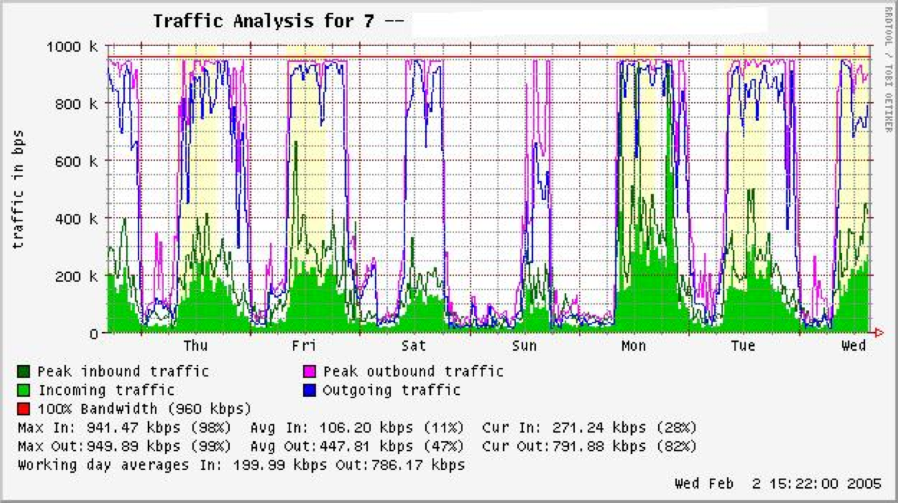

Figure NM 1: A graph with a "flat top" is one indication of
overutilisation.

 

Later in the week, you receive an emergency phone call in the evening.
Apparently, no one in the lab can browse the web or send email. You rush
to the lab and hastily reboot the proxy server, with no results.
Browsing and email are still broken. You then reboot the router, but
there is still no success. You continue eliminating the possible fault
areas one by one until you realise that the network switch is off - a
loose power cable is to blame. After applying power, the network comes
to life again.

 

How can you troubleshoot such an outage without such time consuming
trial and error? Is it possible to be notified of outages as they occur,
rather than waiting for a user to complain? One way to do this is to use
a program such as Nagios
[(http://www.nagios.org/)](http://www.nagios.org/)))that
continually polls network devices and notifies you of outages. Nagios
will report on the availability of various machines and services, and
will alert you to machines that have gone down. In addition to
displaying the network status graphically on a web page, it will send
notifications via SMS or email, alerting you immediately when problems
arise.

 

With good monitoring tools in place, you will be able to justify the
cost of equipment and bandwidth by effectively demonstrating how it is
being used by the organisation.

You are notified automatically when problems arise, and you have
historical statistics of how the network devices are performing. You can
check the current performance against this history to find unusual
behaviour, and head off problems before they become critical. When
problems do come up, it is simple to determine the source and nature of
the problem. Your job is easier, the Board is satisfied, and your users
are much happier.

### Monitoring your network

Managing a network without monitoring is similar to driving a vehicle
without a speedometer or a fuel gauge.

 

How do you know how fast you are going? Is the car consuming fuel as
efficiently as promised by the dealers? If you do an engine overhaul
several months later, is the car any faster or more efficient than it
was before?

Similarly, how can you pay for an electricity or water bill without
seeing your monthly usage from a meter? You must have an account of your
network bandwidth utilisation in order to justify the cost of services
and hardware purchases, and to account for usage trends.

There are several benefits to implementing a good monitoring system for
your network:

 

-   •Network budget and resources are justified. Good monitoring tools
    can demonstrate without a doubt that the network infrastructure
    (bandwidth, hardware, and software) is suitable and able to handle
    the requirements of network users. 

     

-   •Network intruders are detected and filtered. By watching your
    network traffic, you can detect attackers and prevent access to
    critical internal servers and services. 

     

-   •Network viruses are easily detected. You can be alerted to the
    presence of network viruses, and take appropriate action before they
    consume Internet bandwidth and destabilise your network. 

     

-   •Troubleshooting of network problems is greatly simplified. Rather
    than attempting "trial and error" to debug network problems, you can
    be instantly notified of specific problems. Some kinds of problems
    can even be repaired automatically. 

     

-   •Network performance can be highly optimised. Without effective
    monitoring, it is impossible to fine tune your devices and protocols
    to achieve the best possible performance. 

     

-   •Capacity planning is much easier. With solid historical performance
    records, you do not have to "guess" how much bandwidth you will need
    as your network grows. 

     

-   •Proper network usage can be enforced. When bandwidth is a scarce
    resource, the only way to be fair to all users is to ensure that the
    network is being used for its intended purpose. 

     

 Fortunately, network monitoring does not need to be an expensive
undertaking. There are many freely available open source tools that will
show you exactly what is happening on your network in considerable
detail. This section will help you identify many invaluable tools and
how best to use them.

#### The dedicated monitoring server

While monitoring services can be added to an existing network server, it
is often desirable to dedicate one machine (or more, if necessary) to
network monitoring. Some applications (such as ntop
[http://www.ntop.org/)](http://www.ntop.org/)))require
considerable resources to run, particularly on a busy network.

 

But most logging and monitoring programs have modest RAM and storage
requirements, typically with little CPU power required. Since open
source operating systems (such as Linux or BSD) make very efficient use
of hardware resources, this makes it possible to build a very capable
monitoring server from recycled PC parts. There is usually no need to
purchase a brand new server to relegate to monitoring duties.

 

The exception to this rule is in very large installations.

If your network includes more than a few hundred nodes, or if you
consume more than 50 Mbps of Internet bandwidth, you will likely need to
split up monitoring duties between a few dedicated machines.

 

This depends largely on exactly what you want to monitor.

If you are attempting to account for all services accessed per MAC
address, this will consume considerably more resources than simply
measuring network flows on a switch port.

But for the majority of installations, a single dedicated monitoring
machine is usually enough.

While consolidating monitoring services to a single machine will
streamline administration and upgrades, it can also ensure better
ongoing monitoring.

 

For example, if you install monitoring services on a web server, and
that web server develops problems, then your network may not be
monitored until the problem is resolved. To a network administrator, the
data collected about network performance is nearly as important as the
network itself.

 

Your monitoring should be robust and protected from service outages as
well as possible.

Without network statistics, you are effectively blind to problems with
the network.

 

#### Where does the server fit in your network?

If you are only interested in collecting network flow statistics from a
router, you can do this from just about anywhere on the LAN.

This provides simple feedback about utilisation, but cannot give you
comprehensive details about usage patterns.

 

Figure NM 2 below shows a typical MRTG graph generated from the Internet
router.

While the inbound and outbound utilisation are clear, there is no detail
about which computers, users, or protocols are using bandwidth.

 

 

Figure NM 2: Polling the edge router can show you the overall network
utilisation, but you cannot break the data down further into machines,
services, and users.

 

For more detail, the dedicated monitoring server must have access to
everything that needs to be watched.

Typically, this means it must have access to the entire network.

To monitor a WAN connection, such as the Internet link to your ISP, the
monitoring server must be able to see the traffic passing through the
edge router.

To monitor a LAN, the monitoring server is typically connected to a
monitor port on the switch. If multiple switches are used in an
installation, the monitoring server may need a connection to all of
them.

That connection can either be a physical cable, or if your network
switches support it, a VLAN specifically configured for monitoring
traffic.

 

 

If monitor port functionality is not available on your switch, the
monitoring server may be installed between your internal LAN and the
Internet. While this will work, it introduces a single point of failure
for the network, as the network will fail if the monitoring server
develops a problem. It is also a potential performance bottleneck, if
the server cannot keep up with the demands of the network.

Figure NM 4: By inserting a network monitor between the LAN and your
Internet connection, you can observe all network traffic.

 

A better solution is to use a simple network hub (not a switch) which
connects the monitoring machine to the internal LAN, external router,
and the monitoring machine.

While this does still introduce an additional point of failure to the
network (since the entire network will be unreachable if the hub dies),
hubs are generally considered to be much more reliable than routers.

They are also very easily replaced should they fail.

 

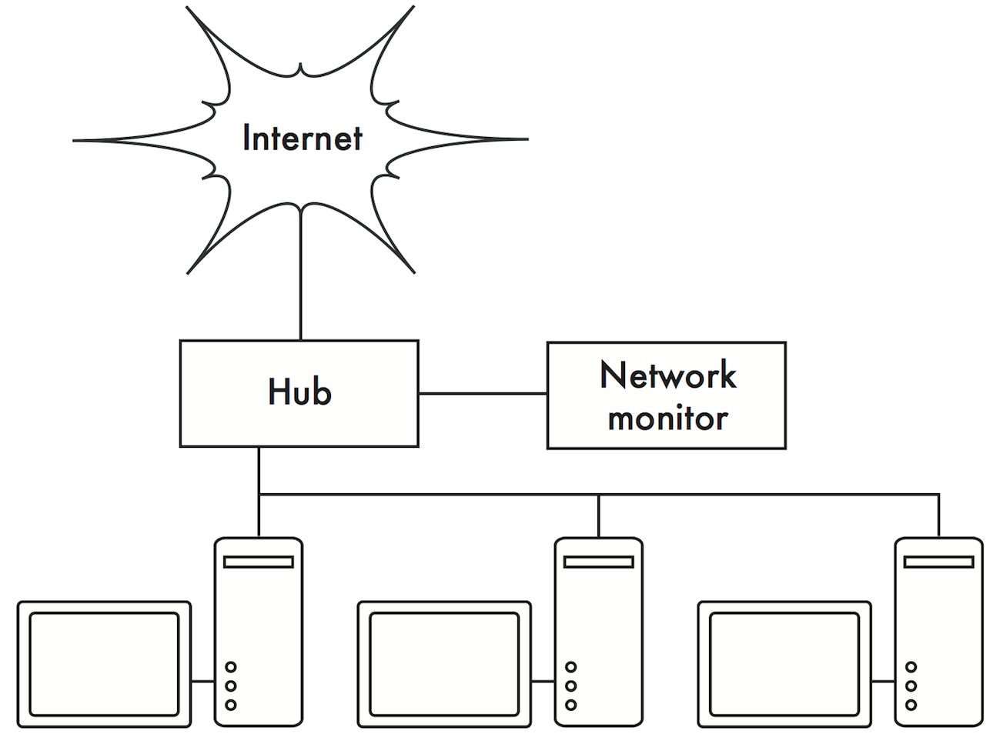

 

Figure NM 5: If your switch does not provide monitor port functionality,
you can insert a network hub between your Internet router and the LAN,
and connect the monitoring server to the hub.

 

Once your monitoring server is in place, you are ready to start
collecting data.

#### What to monitor

It is possible to plot just about any network event and watch its value
on a graph over time. Since every network is slightly different, you
will have to decide what information is important in order to gauge the
performance of your network.

Here are some important indicators that many network administrators will
typically track.

Wireless statistics

-   •Received signal and noise from all backbone nodes  

-   •Number of associated stations 

-   •Detected adjacent networks and channels  

-   •Excessive retransmissions 

-   •Radio data rate, if using automatic rate scaling 

Switch statistics

-   •Bandwidth usage per switch port  

-   •Bandwidth usage broken down by protocol 

-   •Bandwidth usage broken down by MAC address  

-   •Broadcasts as a percentage of total packets  

-   •Packet loss and error rate 

Internet statistics

-   •Internet bandwidth use by host and protocol  

-   •Proxy server cache hits 

-   •Top 100 sites accessed  

-   •DNS requests 

-   •Number of inbound emails / spam emails / email bounces  

-   •Outbound email queue size 

-   •Availability of critical services (web servers, email servers,
    etc.).  

-   •Ping times and packet loss rates to your ISP 

-   •Status of backups 

System health statistics

-   •Memory usage  

-   •Swap file usage 

-   •Process count / zombie processes  

-   •System load 

-   •Uninterruptible Power Supply (UPS) voltage and load  

-   •Temperature, fan speed, and system voltages 

-   •Disk SMART status  

-   •RAID array status 

 

You should use this list as a suggestion of where to begin. As your
network matures, you will likely find new key indicators of network
performance, and you should of course track those as well.

There are many freely available tools that will show you as much detail
as you like about what is happening on your network.

You should consider monitoring the availability of any resource where
unavailability would adversely affect your network users.

Don't forget to monitor the monitoring machine itself, for example its
CPU usage and disk space, in order to receive advance warning if it
becomes overloaded or faulty. A monitoring machine that is low on
resources can affect your ability to monitor the network effectively.

### Types of monitoring tools

We will now look at several different classes of monitoring tools.

1.  1.Network detection tools listen for the beacons sent by wireless
    access points, and display information such as the network name,
    received signal strength, and channel. 

     

2.  2.Spot check tools are designed for troubleshooting and normally run
    interactively for short periods of time. A program such as ping may
    be considered an active spot check tool, since it generates traffic
    by polling a particular machine. 

     

3.  3.Passive spot check tools include protocol analysers, which inspect
    every packet on the network and provide complete detail about any
    network conversation (including source and destination addresses,
    protocol information, and even application data). 

     

4.  4.Trending tools perform unattended monitoring over long periods,
    and typically plot the results on a graph. 

     

5.  5.Throughput testing tools tell you the actual bandwidth available
    between two points on a network. 

     

6.  6.Realtime monitoring tools perform similar monitoring, but notify
    administrators immediately if they detect a problem. Intrusion
    detection tools watch for undesirable or unexpected network traffic,
    and take appropriate action (typically denying access and/or
    notifying a network administrator). 

 

 

 

 

### Network detection

The simplest wireless monitoring tools simply provide a list of
available networks, along with basic information (such as signal
strength and channel). They let you quickly detect nearby networks and
determine if they are in range or are causing interference.

#### The built-in client.

All modern operating systems provide built-in support for wireless
networking. This typically includes the ability to scan for available
networks, allowing the user to choose a network from a list. While
virtually all wireless devices are guaranteed to have a simple scanning
utility, functionality can vary widely between implementations. These
tools are typically only useful for configuring a computer in a home or
office setting.

They tend to provide little information apart from network names and the
available signal to the access point currently in use.

 

Netstumbler
([http://www.wirelessdefence.org/Contents/NetstumblerMain.ht](http://www.wirelessdefence.org/Contents/NetstumblerMain.htm)m).
This is the most popular tool for detecting wireless networks using
Microsoft Windows. It supports a variety of wireless cards, and is very
easy to use. It will detect open and encrypted networks, but cannot
detect “closed” wireless networks. It also features a signal/noise meter
that plots radio receiver data as a graph over time. It also integrates
with a variety of GPS devices, for logging precise location and signal
strength information.

This makes Netstumbler a handy tool to have for an informal site survey.

Macstumbler
([http://www.macstumbler.co](http://www.macstumbler.com/)m/). While not
directly related to the Netstumbler, Macstumbler provides much of the
same functionality but for the Mac OS X platform. It works with all
Apple Airport cards.

### Spot check tools

What do you do when the network breaks? If you can’t access a web page
or email server, and clicking the reload button doesn’t fix the problem,
then you’ll need to be able to isolate the exact location of the
problem.

These tools will help you to determine just where a connection problem
exists.

 

This section is simply an introduction to commonly used troubleshooting
tools.

For more discussion of common network problems and how to diagnose them,
see the chapter called Maintenance and Troubleshooting.

#### ping

Just about every operating system (including Windows, Mac OS X, and of
course Linux and BSD) includes a version of the ping utility. It uses
ICMP packets to attempt to contact a specified host, and tells you how
long it takes to get a response.

 

Knowing what to ping is just as important as knowing how to ping. If you
find that you cannot connect to a particular service in your web browser
(say, [http://yahoo.com/),](http://yahoo.com/)))you
could try to ping it:

 

\$ ping yahoo.com

 

PING yahoo.com (66.94.234.13): 56 data bytes

 

64 bytes from 66.94.234.13: icmp\_seq=0 ttl=57 time=29.375 ms

64 bytes from 66.94.234.13: icmp\_seq=1 ttl=56 time=35.467 ms

64 bytes from 66.94.234.13: icmp\_seq=2 ttl=56 time=34.158 ms

\^C

 

--- yahoo.com ping statistics ---

 

3 packets transmitted, 3 packets received, 0% packet loss

 

round-trip min/avg/max/stddev = 29.375/33.000/35.467/2.618 ms

 

Hit control-C when you are finished collecting data.

If packets take a long time to come back, there may be network
congestion.

If return ping packets have an unusually low Time To Live (TTL), you may
have routing problems between your machine and the remote end. But what
if the ping doesn’t return any data at all?

If you are pinging a name instead of an IP address, you may be running
into DNS problems.

 

Try pinging an IP address on the Internet. If you can’t reach it, it’s a
good idea to see if you can ping your default router:

 

\$ ping 69.90.235.230

 

PING 69.90.235.230 (69.90.235.230): 56 data bytes

 

64 bytes from 69.90.235.230: icmp\_seq=0 ttl=126 time=12.991 ms

64 bytes from 69.90.235.230: icmp\_seq=1 ttl=126 time=14.869 ms

64 bytes from 69.90.235.230: icmp\_seq=2 ttl=126 time=13.897 ms

\^C

 

--- 216.231.38.1 ping statistics ---

 

3 packets transmitted, 3 packets received, 0% packet loss

 

round-trip min/avg/max/stddev = 12.991/13.919/14.869/0.767 ms

 

If you can’t ping your default router, then chances are you won’t be
able to get to the Internet either. If you can’t even ping other IP
addresses on your local LAN, then it’s time to check your connection. If
you’re using Ethernet, is it plugged in? If you’re using wireless, are
you connected to the proper wireless network, and is it in range?

While it is generally accurate to assume that a machine that does not
respond to a ping is likely to be down or cut off from the network this
is not always 100% the case.

Particularly on a WAN or the Internet itself, it is also possible that
some router/firewall between you and the target host(even the target
itself) is blocking pings. If you find a machine is not responding to
pings, try another well-known service like ssh or http.

If you can reach the target through either of these services then you
know the machine is up and simply blocking pings. It is also worth
noting that different systems treat ping differently. The classic UNIX
ping utility sends an ICMP ECHO protocol packet to the target host. Some
network devices will respond to a ping automatically regardless of
whether ICMP is being blocked further up the protocol stack.

This can also be misleading because it can indicate a host is up when
actually all that's really going on is that the NIC (Network Interface
Card) is powered and the machine itself is not actually up and running.

As we stated above, it's always good to check connectivity with multiple
methods. Network debugging with ping is a bit of an art, but it is
useful to learn. Since you will likely find ping on just about any
machine you will work on, it’s a good idea to learn how to use it well.

#### traceroute and mtr

[http://www.bitwizard.nl/mtr](http://www.bitwizard.nl/mtr/)[/](http://www.bitwizard.nl/mtr/)

As with ping, traceroute is found on most operating systems (it’s called
tracert in some versions of Microsoft Windows). By running traceroute,
you can find the location of problems between your computer and any
point on the Internet:

 

\$ traceroute -n google.com

 

traceroute to google.com (72.14.207.99), 64 hops max, 40 byte packets

 

1 10.15.6.1 4.322 ms 1.763 ms 1.731 ms

 

2 216.231.38.1 36.187 ms 14.648 ms 13.561 ms

 

3 69.17.83.233 14.197 ms 13.256 ms 13.267 ms

 

4 69.17.83.150 32.478 ms 29.545 ms 27.494 ms

 

5 198.32.176.31 40.788 ms 28.160 ms 28.115 ms

 

6 66.249.94.14 28.601 ms 29.913 ms 28.811 ms

 

7 172.16.236.8 2328.809 ms 2528.944 ms 2428.719 ms

 

8 \* \* \*

 

The -n switch tells traceroute not to bother resolving names in DNS, and
makes the trace run more quickly. You can see that at hop seven, the
round trip time shoots up to more than two seconds, while packets seem
to be discarded at hop eight.

 

This might indicate a problem at that point in the network.

If this part of the network is in your control, it might be worth
starting your troubleshooting effort there.

My TraceRoute (mtr) is a handy program that combines ping and traceroute
into a single tool. By running mtr, you can get an ongoing average of
latency and packet loss to a single host, instead of the momentary
snapshot that ping and traceroute provide.

 

My traceroute [v0.69]

 

tesla.rob.swn (0.0.0.0) (tos=0x0 psize=64 bitpat Sun Jan 8 20:01:26
2006)

 

Keys: Help Display mode Restart statistics Order of fields quit

 

Packets        

Pings

Host

Loss%

Snt

Last

Avg

Best

Wrst

StDev

​1. gremlin.rob.swn

0.0%

4

1.9

2.0

1.7

2.6

0.4

​2. er1.sea1.speakeasy.net

0.0%

4

15.5

14.0

12.7

15.5

1.3

​3. 220.ge-0-1-0.cr2.sea1.

Speakeasy.net

0.0%

4

11.0

11.7

10.7

14.0

1.6

​4. fe-0-3-0.cr2.sfo1.

speakeasy.net

0.0%

4

36.0

34.7

28.7

38.1

4.1

​5. bas1-m.pao.yahoo.com

0.0%

4

27.9

29.6

27.9

33.0

2.4

​6. so-1-1-0.pat1.dce.

yahoo.com

0.0%

4

89.7

91.0

89.7

93.0

1.4

​7. ae1.p400.msr1.dcn.

yahoo.com  

0.0%

4

91.2

93.1

90.8

99.2

4.1

​8. ge5-2.bas1-m.dcn.

yahoo.com

0.0%

4

89.3

91.0

89.3

93.4

1.9

9.w2.rc.vip.dcn.yahoo.com

0.0%

3

91.2

93.1

90.8

99.2

4.1

 

The data will be continuously updated and averaged over time.

As with ping, you should hit control-C when you are finished looking at
the data. Note that you must have root privileges to run mtr.

While these tools will not reveal precisely what is wrong with the
network, they can give you enough information to know where to continue
troubleshooting.

### Protocol analysers

Network protocol analysers provide a great deal of detail about
information flowing through a network, by allowing you to inspect
individual packets. For wired networks, you can inspect packets at the
data-link layer or above. For wireless networks, you can inspect
information all the way down to individual 802.11 frames. Here are
several popular (and free) network protocol analysers:

#### Kismet

[http://www.kismetwireless.net](http://www.kismetwireless.net/)[/](http://www.kismetwireless.net/)

Kismet is a powerful wireless protocol analyser for many platforms
including Linux, Mac OS X, and even the embedded OpenWRT Linux
distribution. It works with any wireless card that supports passive
monitor mode.

In addition to basic network detection, Kismet will passively log all
802.11 frames to disk or to the network in standard PCAP format, for
later analysis with tools like Wireshark. Kismet also features
associated client information, AP hardware fingerprinting, Netstumbler
detection, and GPS integration.

Since it is a passive network monitor, it can even detect “closed”
wireless networks by analysing traffic sent by wireless clients.

You can run Kismet on several machines at once, and have them all report
over the network back to a central user interface. This allows for
wireless monitoring over a large area, such as a university or corporate
campus. Since Kismet uses the radio card's passive monitor mode, it does
all of this without transmitting any data.

Kismet is an invaluable tool for diagnosing wireless network problems.

#### KisMAC

[http://kisma](http://kismac-ng.org/)c-ng.org

Exclusively for the Mac OS X platform, KisMAC does much of what Kismet
can do, but with a slick Mac OS X graphical interface. It is a passive
scanner that will log data to disk in PCAP format compatible with
Wireshark. It supports passive scanning with AirportExtreme cards as
well as a variety of USB wireless adapters.

#### tcpdump

[http://www.tcpdump.org/](http://www.tcpdump.org/)

tcpdump is a command-line tool for monitoring network traffic.

It does not have all the bells and whistles of wireshark but it does use
fewer resources. Tcpdump can capture and display all network protocol
information down to the link layer. It can show all of the packet
headers and data received, or just the packets that match particular
criteria.

Packets captured with tcpdump can be loaded into wireshark for visual
analysis and further diagnostics. This is very useful if you wish to
monitor an interface on a remote system and bring the file back to your
local machine for analysis. The tcpdump tool is available as a standard
tool in Unix derivatives (Linux, BSD, and Mac OS X). There is also a
Windows port called WinDump available at
[http://www.winpcap.org/windump](http://www.winpcap.org/windump/)/

#### Wireshark

[http://www.wireshark.org](http://www.wireshark.org/)/

Formerly known as Ethereal, Wireshark is a free network protocol
analyser for Unix and Windows.

 

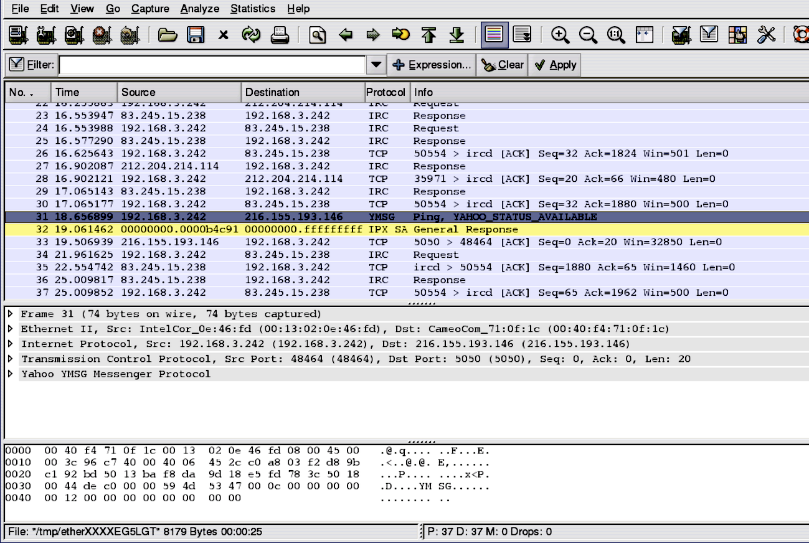

 

Figure NM 6: Wireshark (formerly Ethereal) is a powerful network
protocol analyser that can show you as much detail as you like about any
packet.

Wireshark allows you to examine data from a live network or from a
capture file on disk, and interactively browse and sort the captured
data.

 

Both summary and detailed information is available for each packet,
including the full header and data portions.

 

Wireshark has several powerful features, including a rich display filter
language and the ability to view the reconstructed stream of a TCP
session.

It can be daunting to use for first time users or those that are not
familiar with the OSI layers.

It is typically used to isolate and analyse specific traffic to or from
an IP address, but it can be also used as a general purpose fault
finding tool.

For example, a machine infected with a network worm or virus can be
identified by looking for the machine that is sending out the same sort
of TCP/IP packets to large groups of IP addresses.

### Trending tools

Trending tools are used to see how your network is used over a long
period of time. They work by periodically monitoring your network
activity, and displaying a summary in a human-readable form (such as a
graph). Trending tools collect data as well as analyse and report on it.

 

Below are some examples of trending tools. Some of them need to be used
in conjunction with each other, as they are not stand-alone programs.

#### MRTG

[http://oss.oetiker.ch/mrtg](http://oss.oetiker.ch/mrtg/)/

The Multi Router Traffic Grapher (MRTG) monitors the traffic load on
network links using SNMP. MRTG generates graphs that provide a visual
representation of inbound and outbound traffic.

These are typically displayed on a web page.

 

MRTG can be a little confusing to set up, especially if you are not
familiar with SNMP.

But once it is installed, MRTG requires virtually no maintenance, unless
you change something on the system that is being monitored (such as its
IP address).

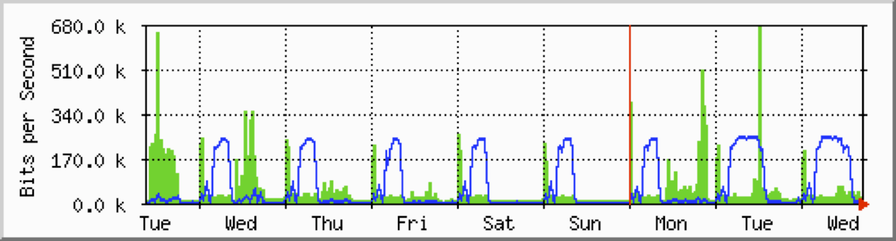

 

Figure NM 7: MRTG is probably the most widely installed network flow
grapher.

#### RRDtool

RRD is short for Round Robin Database. RRD is a database that stores
information in a very compact way that does not expand over time.
RRDtool refers to a suite of tools that allow you to create and modify
RRD databases, as well as generate useful graphs to present the data.

It is used to keep track of time-series data (such as network bandwidth,
machine room temperature, or server load average) and can display that
data as an average over time.

 

Note that RRDtool itself does not contact network devices to retrieve
data. It is merely a database manipulation tool.

You can use a simple wrapper script (typically in shell or Perl) to do
that work for you. RRDtool is also used by many full featured front-ends
that present you with a friendly web interface for configuration and
display. RRD graphs give you more control over display options and the
number of items available on a graph as compared to MRTG.

 

 

Figure NM 8: RRDtool gives you a lot of flexibility in how your
collected network data may be displayed.

 

RRDtool is included in virtually all modern Linux distributions, and can
be downloaded from
[http://oss.oetiker.ch/rrdtool](http://oss.oetiker.ch/rrdtool/)/

#### ntop

For historical traffic analysis and usage, you will certainly want to
investigate ntop.

This program builds a detailed real-time report of observed network
traffic, displayed in your web browser. It integrates with rrdtool, and
makes graphs and charts visually depicting how the network is being
used.

On very busy networks, ntop can use a lot of CPU and disk space, but it
gives you extensive insight into how your network is being used. It runs
on Linux, BSD, Mac OS X, and Windows.

 

Some of its more useful features include:

 

Traffic display can be sorted by various criteria (source, destination,
protocol, MAC address, etc.).

 

Traffic statistics grouped by protocol and port number.

 

An IP traffic matrix which shows connections between machines Network
flows for routers or switches that support the NetFlow protocol Host
operating system identification, P2P traffic, identification, numerous
graphical charts, Perl, PHP, and Python API.

 

ntop is available from
[http://www.ntop.org/](http://www.ntop.org/)and
is available for most operating systems.

It is often included in many of the popular Linux distributions,
including RedHat, Debian, and Ubuntu.

 

While it can be left running to collect historical data, ntop can be
fairly CPU intensive, depending on the amount of traffic observed.

 

If you are going to run it for long periods you should monitor the CPU
utilisation of the monitoring machine.

 

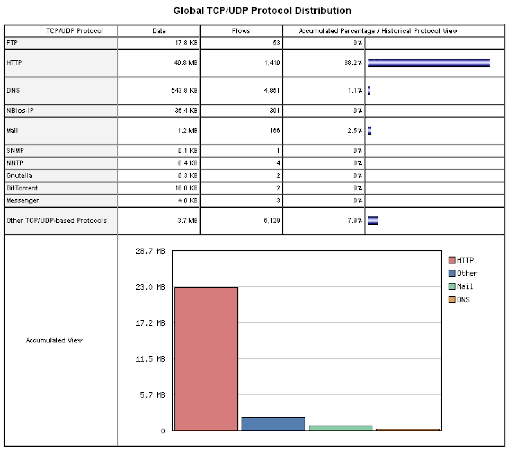

 

Figure NM 9: ntop displays a wealth of information about how your
network is utilised by various clients and servers.

 

The main disadvantage of ntop is that it does not provide instantaneous
information, only long-term totals and averages.

This can make it difficult to use to diagnose a problem that starts
suddenly.

#### Cacti

[http://www.cacti.net](http://www.cacti.net/)/

Cacti is a front-end for RRDtool. It stores all of the necessary
information to create graphs in a MySQL database. The front-end is
written in PHP.

Cacti does the work of maintaining graphs, data sources, and handles the
actual data gathering.

There is support for SNMP devices, and custom scripts can easily be
written to poll virtually any conceivable network event.

 

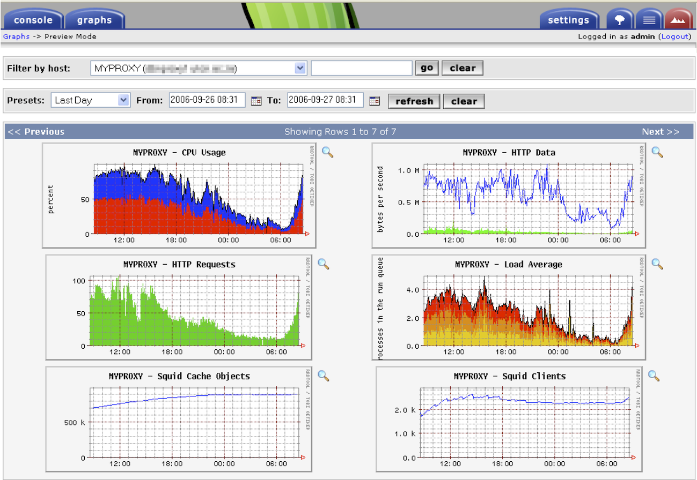

 

Figure NM 10: Cacti can manage the polling of your network devices, and
can build very complex and informative visualisations of network
behaviour.

 

Cacti can be somewhat confusing to configure, but once you work through
the documentation and examples, it can yield very impressive graphs.

There are hundreds of templates for various systems available on the
cacti website, and the code is under rapid development.

#### NetFlow

NetFlow is a protocol for collecting IP traffic information invented by
Cisco. From the Cisco website:

 

Cisco IOS NetFlow efficiently provides a key set of services for IP
applications, including network traffic accounting, usage-based network
billing, network planning, security, Denial of Service monitoring
capabilities, and network monitoring.

 

NetFlow provides valuable information about network users and
applications, peak usage times, and traffic routing.

 

Cisco routers can generate NetFlow information which is available from
the router in the form of UDP packets. NetFlow is also less CPU-
intensive on Cisco routers than using SNMP. It also provides more
granular information than SNMP, letting you get a more detailed picture
of port and protocol usage.This information is collected by a NetFlow
collector that stores and presents the data as an aggregate over time.

 

By analysing flow data, one can build a picture of traffic flow and
traffic volume in a network or on a connection. There are several
commercial and free NetFlow collectors available. Ntop is one free tool
that can act as a NetFlow collector and probe. Another is Flowc (see
below). It can also be desirable to use Netflow as a spot check tool, by
just looking at a quick snapshot of data during a network crisis. Think
of NetFlow as an alternative to SNMP for Cisco devices. For more
information about NetFlow, see
[http://en.wikipedia.org/wiki/Netflow](http://en.wikipedia.org/wiki/Netflow).

#### Flowc

[http://netacad.kiev.ua/flowc](http://netacad.kiev.ua/flowc/)/. Flowc is
an open source NetFlow collector (see NetFlow above). It is lightweight
and easy to configure. Flowc uses a MySQL database to store aggregated
traffic information. Therefore, it is possible to generate your own
reports from the data using SQL, or use the included report generators.
The built-in report generators produce reports in HTML, plain text or a
graphical format.

 

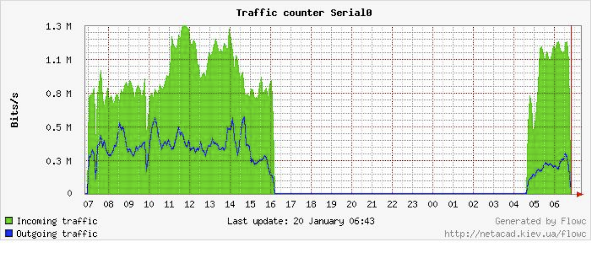

 

Figure NM 11: A typical flow chart generated by Flowc.

 

The large gap in data probably indicates a network outage.

Trending tools typically will not notify you of outages, but merely log
the occurrence.

To be notified when network problems occur, use a realtime monitoring
tool such as Nagios.

#### SmokePing

[http://oss.oetiker.ch/smokeping](http://oss.oetiker.ch/smokeping/)/.
SmokePing is a deluxe latency measurement tool written in Perl.

It can measure, store and display latency, latency distribution and
packet loss all on a single graph.

SmokePing uses the RRDtool for data storage, and can draw very
informative graphs that present up to the minute information on the
state of your network connection.

 

It is very useful to run SmokePing on a host with good connectivity to
your entire network.

Over time, trends are revealed that can point to all sorts of network
problems.

Combined with MRTG or Cacti, you can observe the effect that network
congestion has on packet loss and latency.

 

SmokePing can optionally send alerts when certain conditions are met,
such as when excessive packet loss is seen on a link for an extended
period of time. An example of SmokePing in action is shown in Figure NM
12.

 

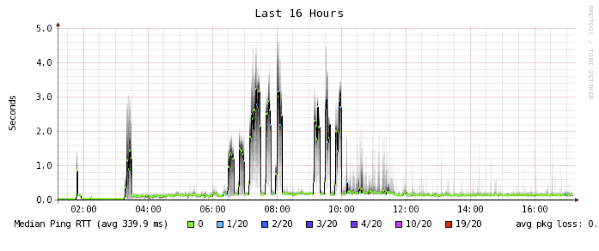

 

Figure NM 12: SmokePing can simultaneously display packet loss and
latency spreads in a single graph.

 

#### EtherApe

[http://etherape.sourceforge.net](http://etherape.sourceforge.net/)[/](http://etherape.sourceforge.net/)

EtherApe displays a graphical representation of network traffic. Hosts
and links change size depending on the amount of traffic sent and
received. The colours change to represent the protocol most used. As
with wireshark and tcpdump, data can be captured "off the wire" from a
live network connection or read from a tcpdump capture file. EtherApe
doesn't show quite as much detail as ntop, but its resource requirements
are much lighter.

#### iptraf

[http://iptraf.seul.org](http://iptraf.seul.org/)/

IPTraf is a lightweight but powerful LAN monitor. It has an ncurses
interface and runs in a command shell. IPTraf takes a moment to measure
observed traffic, and then displays various network statistics including
TCP and UDP connections, ICMP and OSPF information, traffic flows, IP
checksum errors, and more. It is a simple to use program that uses
minimal system resources. While it does not keep historical data, it is
very useful for displaying an instantaneous usage report.

 

Figure NM 13: iptraf's statistical breakdown of traffic by port.

 

#### Argus

[http://qosient.com/argus](http://qosient.com/argus/)/.

Argus stands for Audit Record Generation and Utilisation System. Argus
is also the name of the mythological Greek god who had hundreds of eyes.

 

From the Argus website:

Argus generates flow statistics such as connectivity, capacity, demand,
loss, delay, and jitter on a per transaction basis. Argus can be used to
analyse and report on the contents of packet capture files or it can run
as a continuous monitor, examining data from a live interface;
generating an audit log of all the network activity seen in the packet
stream.

Argus can be deployed to monitor individual end-systems, or an entire
enterprises network activity. As a continuous monitor, Argus provides
both push and pull data handling models, to allow flexible strategies
for collecting network audit data. Argus data clients support a range of
operations, such as sorting, aggregation, archival and reporting. Argus
consists of two parts: a master collector that reads packets from a
network device, and a client that connects to the master and displays
the usage statistics. Argus runs on BSD, Linux, and most other UNIX
systems.

#### NeTraMet

[http://www.caida.org/tools/measurement/netramet](http://www.caida.org/tools/measurement/netramet/)/

NeTraMet is another popular flow analysis tool. Like Argus,

NeTraMet consists of two parts: a collector that gathers statistics via
SNMP, and a manager that specifies which flows should be watched.

Flows are specified using a simple programming language that defines the
addresses used on either end, and can include Ethernet, IP, protocol
information, or other identifiers. NeTraMet runs on DOS and most UNIX
systems, including Linux and BSD.

### Throughput testing

How fast can the network go?

What is the actual usable capacity of a particular network link?

You can get a very good estimate of your throughput capacity by flooding
the link with traffic and measuring how long it takes to transfer the
data.

 

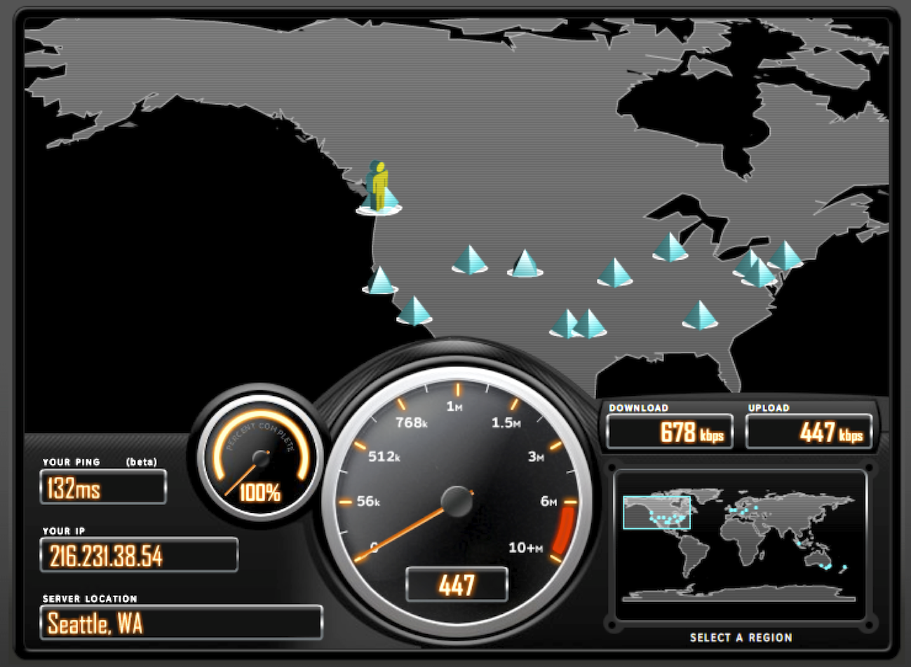

 

Figure NM 14: Tools such as this one from SpeedTest.net are pretty, but
don't always give you an accurate picture of network performance.

 

While there are web pages available that will perform a “speed test” in
your browser (such as
[http://www.dslreports.com/stest](http://www.dslreports.com/stest)or
[http://speedtest.net](http://speedtest.net/)/),

these tests are increasingly inaccurate as you get further from the
testing source. Even worse, they do not allow you to test the speed of a
given link, but only the speed of your link to a particular site on the
Internet.

Here are a few tools that will allow you to perform throughput testing
on your own networks.

#### ttcp

Now a standard part of most Unix-like systems, ttcp is a simple network
performance testing tool.

One instance is run on either side of the link you want to test.

The first node runs in receive mode, and the other transmits:

 

node\_a\$ ttcp -r -s

node\_b\$ ttcp -t -s node\_a

ttcp-t: buflen=8192, nbuf=2048, align=16384/0, port=5001 tcp -\> node\_a

ttcp-t: socket

ttcp-t: connect

ttcp-t: 16777216 bytes in 249.14 real seconds = 65.76 KB/sec +++

ttcp-t: 2048 I/O calls, msec/call = 124.57, calls/sec = 8.22

ttcp-t: 0.0user 0.2sys 4:09real 0% 0i+0d 0maxrss 0+0pf 7533+0csw

 

After collecting data in one direction, you should reverse the transmit
and receive partners to test the link in the other direction. It can
test UDP as well as TCP streams, and can alter various TCP parameters
and buffer lengths to give the network a good workout. It can even use a
user-supplied data stream instead of sending random data. Remember that
the speed readout is in kilobytes, not kilobits. Multiply the result by
8 to find the speed in kilobits per second. The only real disadvantage
to ttcp is that it hasn’t been developed in years. Fortunately, the code
has been released in the public domain and is freely available. Like
ping and traceroute, ttcp is found as a standard tool on many systems.

#### iperf

[http://iperf.sourceforge.net/.](http://iperf.sourceforge.net/)Much like
ttcp, iperf is a command line tool for estimating the throughput of a
network connection. It supports many of the same features as ttcp, but
uses a “client” and “server” model instead of a “receive” and “transmit”
pair.

To run iperf, launch a server on one side and a client on the other:

 

node\_a\$ iperf -s

node\_b\$ iperf -c node\_a

------------------------------------------------------------

Client connecting to node\_a, TCP port 5001

TCP window size: 16.0 KByte (default)

------------------------------------------------------------

[ 5] local 10.15.6.1 port 1212 connected with 10.15.6.23 port 5001

[ ID] Interval Transfer  Bandwidth

[ 5] 0.0-11.3 sec 768 KBytes         558 Kbits/sec

The server side will continue to listen and accept client connections on
port 5001 until you hit control-C to kill it. This can make it handy
when running multiple test runs from a variety of locations.

The biggest difference between ttcp and iperf is that iperf is under
active development, and has many new features (including IPv6 support).
This makes it a good choice as a performance tool when building new
networks.

#### bing

http://fgouget.free.fr/bing/indx-en.shtml

Rather than flood a connection with data and see how long the transfer
takes to complete, bing attempts to estimate the available throughput of
a point-to-point connection by analysing round trip times for various
sized ICMP packets. While it is not always as accurate as a flood test,
it can provide a good estimate without transmitting a large number of
bytes.

Since bing works using standard ICMP echo requests, it can estimate
available bandwidth without the need to run a special client on the
other end, and can even attempt to estimate the throughput of links
outside your network. Since it uses relatively little bandwidth, bing
can give you a rough idea of network performance without running up the
charges that a flood test would certainly incur.

### Realtime tools and intrusion detection

It is desirable to find out when people are trying to break into your
network, or when some part of the network has failed.

Because no system administrator can be monitoring a network all the
time, there are programs that constantly monitor the status of the
network and can send alerts when notable events occur.

 

The following are some open source tools that can help perform this
task.

#### Snort

Snort (http://www.snort.org/) is a packet sniffer and logger which can
be used as a lightweight network intrusion detection system.

It features rule-based logging and can perform protocol analysis,
content searching, and packet matching.

 

It can be used to detect a variety of attacks and probes, such as
stealth port scans, CGI attacks, SMB probes, OS fingerprinting attempts,
and many other kinds of anomalous traffic patterns.

Snort has a real-time alert capability that can notify administrators
about problems as they occur with a variety of methods.

Installing and running Snort is not trivial, and depending on the amount
of network traffic, will likely require a dedicated monitoring machine
with considerable resources.

Fortunately, Snort is very well documented and has a strong user
community.

By implementing a comprehensive Snort rule set, you can identify
unexpected behaviour that would otherwise mysteriously eat up your
Internet bandwidth.

See [http://snort.org/docs/](http://snort.org/docs/) for an extensive
list of installation and configuration resources.

#### Apache: mod\_security

ModSecurity ([http://www.modsecurity.org](http://www.modsecurity.org/)/)
is an open source intrusion detection and prevention engine for web
applications.

This kind of security tool is also known as a web application firewall.

ModSecurity increases web application security by protecting web
applications from known and unknown attacks.

It can be used on its own, or as a module in the Apache web server
(http://www.apache.org/).

 

There are several sources for updated mod\_security rules that help
protect against the latest security exploits.

 

One excellent resource is GotRoot, which maintains a huge and frequently
updated repository of rules:

[http://www.atomicorp.com/wiki/index.php/Atomic\_ModSecurity\_Rules](http://www.atomicorp.com/wiki/index.php/Atomic_ModSecurity_Rules)

 

Web application security is important in defending against attacks on
your web server, which could result in the theft of valuable or personal
data, or in the server being used to launch attacks or send spam to
other Internet users. As well as being damaging to the Internet as a
whole, such intrusions can seriously reduce your available bandwidth.

#### Nagios

Nagios ([http://nagios.org](http://nagios.org/)/) is a program that
monitors hosts and services on your network, notifying you immediately
when problems arise.

It can send notifications via email, SMS, or by running a script, and
will send notifications to the relevant person or group depending on the
nature of the problem.

Nagios runs on Linux or BSD, and provides a web interface to show
up-to-the-minute system status.

Nagios is extensible, and can monitor the status of virtually any
network event.

It performs checks by running small scripts at regular intervals, and
checks the results against an expected response.

This can yield much more sophisticated checks than a simple network
probe.

For example, ping may tell you that a machine is up, and nmap may report
that a TCP port responds to requests, but Nagios can actually retrieve a
web page or make a database request, and verify that the response is not
an error.

 

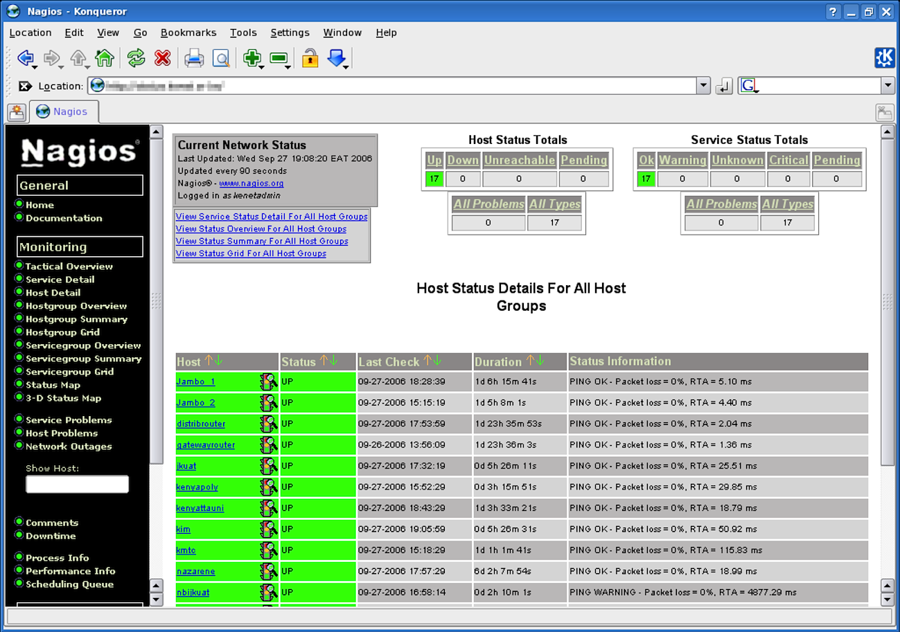

 

Figure NM 15: Nagios keeps you informed the moment a network fault or
service outage occurs.

 

Nagios can even notify you when bandwidth usage, packet loss, machine
room temperature, or other network health indicator crosses a particular
threshold.

This can give you advance warning of network problems, often allowing
you to respond to the problem before users have a chance to complain.

#### Zabbix

Zabbix ([http://www.zabbix.org](http://www.zabbix.org/)/) is an open
source realtime monitoring tool that is something of a hybrid between
Cacti and Nagios.

It uses a SQL database for data storage, has its own graph rendering
package, and performs all of the functions you would expect from a
modern realtime monitor (such as SNMP polling and instant notification
of error conditions). Zabbix is released under the GNU General Public
License.

### Other useful tools

There are thousands of free network monitoring tools that fill very
specialised needs. Here are a few of our favourites that don't quite fit
into the above categories.

#### ngrep

Ngrep provides most of GNU grep's pattern matching features, but applies
them to network traffic. It currently recognises IPv4 and IPv6, TCP,
UDP, ICMP, IGMP, PPP, SLIP, FDDI, Token Ring, and much more. As it makes
extensive use of regular expression matches, it is a tool suited to
advanced users or those that have a good knowledge of regular
expressions. You don't necessarily need to be a regex expert to be able
to make basic use of ngrep. For example, to view all packets that
contain the string GET (presumably HTTP requests), try this:

 

\# ngrep -q GET

 

Pattern matches can be constrained further to match particular
protocols, ports, or other criteria using BPF filters. This is the
filter language used by common packet sniffing tools, such as tcpdump
and snoop. To view GET or POST strings sent to destination port 80, use
this command line:

 

\# ngrep -q 'GET|POST' port 80

 

By using ngrep creatively, you can detect anything from virus activity
to spam email. You can download ngrep at
[http://ngrep.sourceforge.net](http://ngrep.sourceforge.net/)/.

#### nmap/Zenmap

nmap is a network diagnostic tool for showing the state and availability
of network ports on a network interface. A common use is to scan a
network host on a TCP/IP network for what ports are open, thereby
allowing one to create a "map" of the network services that the machine
provides. The nmap tool does this by sending specially crafted packets
to a target network host and noticing the response(s). For example, a
web server with an open port 80 but no running web server will respond
differently to an nmap probe than one that not only has the port open
but is running httpd.

Similarly, you will get a different response to a port that is simply
shut off vs. one that is open on a host but blocked by a firewall.

Over time, nmap has evolved from being a simple port-scanner to
something that can detect OS versions, network drivers, the type of NIC
hardware being used by an interface, driver versions, etc. In addition
to scanning individual machines, it can also scan entire networks of
hosts. This does mean that nmap is potentially also useful by malicious
network users as a way to "scope out" a system before attacking it. Like
many diagnostic tools, nmap can be used for good or ill and network
administrators would do well to be aware of both sides. The nmap tool is
released under the GPL license and the latest version can be found at
[http://www.nmap.or](http://www.nmap.org/)g.

#### Zenmap

Zenmap is a cross-platform GUI for nmap which runs under Linux, Windows,
Mac OS X, BSD, etc. and can be downloaded from the nmap.org site as
well.

#### netcat

Somewhat between nmap and tcpdump, netcat is another diagnostic tool for
poking and prodding at ports and connections on a network. It takes its
name from the UNIX cat(1) utility, which simply reads out whatever file
you ask it to. Similarly, netcat reads and writes data across any
arbitrary TCP or UDP port. The netcat utility is not a packet analyser
but works on the data(payload) contained in the packets.

For example, here is how to run a very simple 1-line, 1-time web server
with netcat:

 

{ echo -ne "HTTP/1.0 200 OK\\r\\n\\r\\n"; cat some.file; } | nc -l 8080

The file some.file will be sent to the first host that connects to port
8080 on the system running netcat.

The -l command tells netcat to "listen" on port 8080 and wait until it
gets a connection.

Once it does, it stops blocking, reads the data off the pipe and sends
it to the client connected on port 8080. Some other good examples of
netcat usage can be found in the Wikipedia entry for netcat:

[https://secure.wikimedia.org/wikipedia/en/wiki/Netcat\#Examples](https://secure.wikimedia.org/wikipedia/en/wiki/Netcat#Examples)

You can download the latest version of netcat from

[http://nc110.sourceforge.net/](http://nc110.sourceforge.net/)

It is available under a Permissive Free Software License.

### What is normal?

If you are looking for a definitive answer as to what your traffic
patterns should look like, you are going to be disappointed.

There is no absolute right answer to this question, but given some work
you can determine what is normal for your network.

While every environment is different, some of the factors that can
influence the appearance of your traffic patterns are:

 

-   •The capacity of your Internet connection 

-   •The number of users that have access to the network 

-   •The social policy (byte charging, quotas, honour system, etc.).  

-   •The number, types, and level of services offered 

-   •The health of the network (presence of viruses, excessive
    broadcasts, routing loops, open email relays, denial of service
    attacks, etc.).  

-   •The competence of your computer users 

-   •The location and configuration of control structures (firewalls,
    proxy servers, caches, and so on) 

     

This is not a definitive list, but should give you an idea of how a wide
range of factors can affect your bandwidth patterns.

 

With this in mind, let's look at the topic of baselines.

### Establishing a baseline

Since every environment is different, you need to determine for yourself
what your traffic patterns look like under normal situations. This is
useful because it allows you to identify changes over time, either
sudden or gradual. These changes may in turn indicate a problem, or a
potential future problem, with your network.

For example, suppose that your network grinds to a halt, and you are not
sure of the cause. Fortunately, you have decided to keep a graph of
broadcasts as a percentage of the overall network traffic. If this graph
shows a sudden increase in the amount of broadcast traffic, it may mean
that your network has been infected with a virus.

Without an idea of what is "normal" for your network (a baseline), you
would not be able to see that the number of broadcasts had increased,
only that it was relatively high, which may not indicate a problem.

Baseline graphs and figures are also useful when analysing the effects
of changes made to the network. It is often very useful to experiment
with such changes by trying different possible values. Knowing what the
baseline looks like will show you whether your changes have improved
matters, or made them worse.

 

 

Figure NM 16: By collecting data over a long period of time, you can
predict the growth of your network and make changes before problems
develop.

 

In Figure NM 16, we can see the effect of the implementation of delay
pools on Internet utilisation around the period of May.

If we did not keep a graph of the line utilisation, we would never know
what the effect of the change over the long term was.

When watching a total traffic graph after making changes, don't assume
that just because the graph does not change radically that your efforts
were wasted. You might have removed frivolous usage from your line only
to have it replaced by genuine legitimate traffic.

You could then combine this baseline with others, say the top 100 sites
accessed or the average utilisation by your top twenty users, to
determine if habits have simply changed. As we will see later, MRTG,
RRDtool, and Cacti are excellent tools you can use to keep a baseline.

 

 

Figure NM 17: The traffic trend at Aidworld logged over a single day.

 

Figure NM 17 shows traffic on an Aidworld firewall over a period of 24
hours. There is nothing apparently wrong with this graph, but users were
complaining about slow Internet access.

Figure NM 18 shows that the upload bandwidth use (blue) was higher
during working hours on the last day than on previous days. A period of
heavy upload usage started every morning at 03:00, and was normally
finished by 09:00, but on the last day it was still running at 16:30.
Further investigation revealed a problem with the backup software, which
ran at 03:00 every day.

 

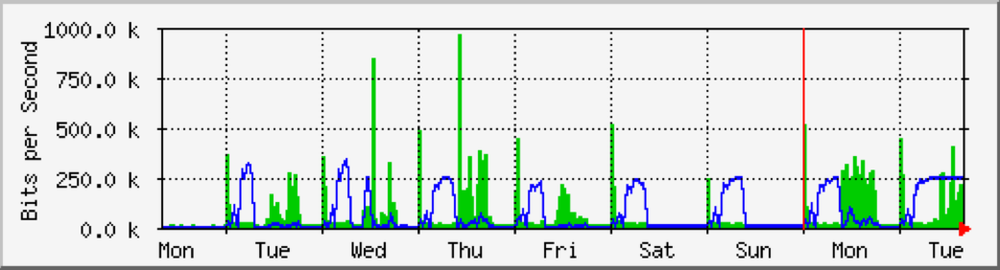

 

Figure NM 18: The same network logged over an entire week reveals a
problem with backups, which caused unexpected congestion for network
users.

 

Figure NM 19 shows measurements of latency on the same connection as
measured by the program called SmokePing. The position of the dots shows
the average latency, while the grey smoke indicates the distribution of
latency (jitter).

The colour of the dots indicates the number of lost packets. This graph
over a period of four hours does not help to identify whether there are
any problems on the network.

 

 

Figure NM 19: Four hours of jitter and packet loss.

 

The next graph (Figure NM 20) shows the same data over a period of 16
hours.

This indicates that the values in the graph above are close to the
normal level (baseline), but that there were significant increases in
latency at several times during the early morning, up to 30 times the
baseline value.

This indicates that additional monitoring should be performed during
these periods to establish the cause of the high latency to avoid
problems such as the backup not completing in the future.

 

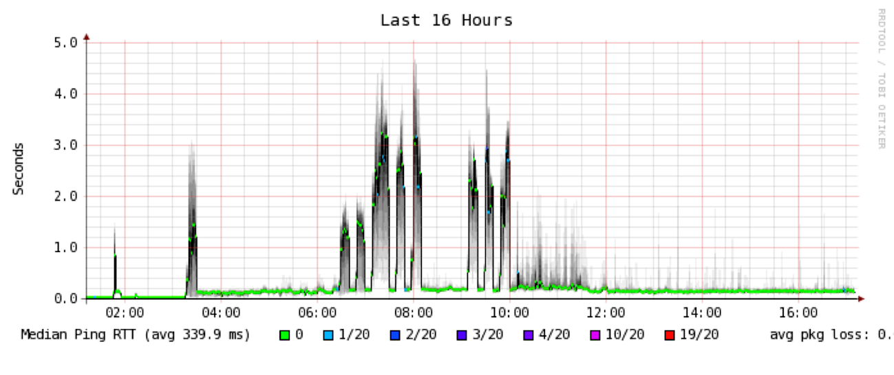

 

Figure NM 20: A higher spread of jitter is revealed in the 16 hour log.

 

Figure NM 21 shows that Tuesday was significantly worse than Sunday or
Monday for latency, especially during the early morning period.

This might indicate that something has changed on the network.

 

Figure NM 21: Zooming out to the week long view reveals a definite
repetition of increased latency and packet loss in the early morning
hours.

 

#### How do I interpret the traffic graph?

In a basic network flow graph (such as that generated by the network
monitor tool MRTG), the green area indicates inbound traffic, while the
blue line indicates outbound traffic.

 

Inbound traffic is traffic that originates from another network
(typically the Internet) and is addressed to a computer inside your
network. Outbound traffic is traffic that originates from your network,
and is addressed to a computer somewhere on the Internet.

 

Depending on what sort of network environment you have, the graph will
help you understand how your network is actually being used. For
example, monitoring of servers usually reveals larger amounts of
outbound traffic as the servers respond to requests (such as sending
mail or serving web pages), while monitoring client machines might
reveal higher amounts of inbound traffic to the machines as they receive
data from the servers.

 

 

Figure NM 22: The classic network flow graph. The green area represents
inbound traffic, while the blue line represents outbound traffic. The
repeating arcs of outbound traffic show when the nightly backups have
run.

 

Traffic patterns will vary with what you are monitoring. A router will
normally show more incoming traffic than outgoing traffic as users
download data from the Internet. An excess of outbound traffic that is
not transmitted by your network servers may indicate a peer-to-peer
client, unauthorised server, or even a virus on one or more of your
clients. There are no set metrics that indicate what outgoing traffic to
incoming traffic should look like.It is up to you to establish a
baseline to understand what normal network traffic patterns look like on
your network.

#### Detecting network overload

Figure NM 23 shows traffic on an overloaded Internet connection.

 

Figure NM 23: Flat-topped graphs indicate overloading of available
bandwidth.

The most apparent sign of overloading is the flat tops on outbound
traffic during the middle of every day.

Flat tops may indicate overloading, even if they are well below the
maximum theoretical capacity of the link.

In this case it may indicate that you are not getting as much bandwidth
from your service provider as you expect.

#### Measuring 95th percentile

The 95th percentile is a widely used mathematical calculation to
evaluate regular and sustained utilisation of a network pipe.

Its value shows the highest consumption of traffic for a given period.

 

Calculating the 95th percentile means that 95% of the time the usage is
below a certain amount, and 5% of the time usage is above that amount.

The 95th percentile is a good guideline to show bandwidth that is
actually used at least 95% of the time.

 

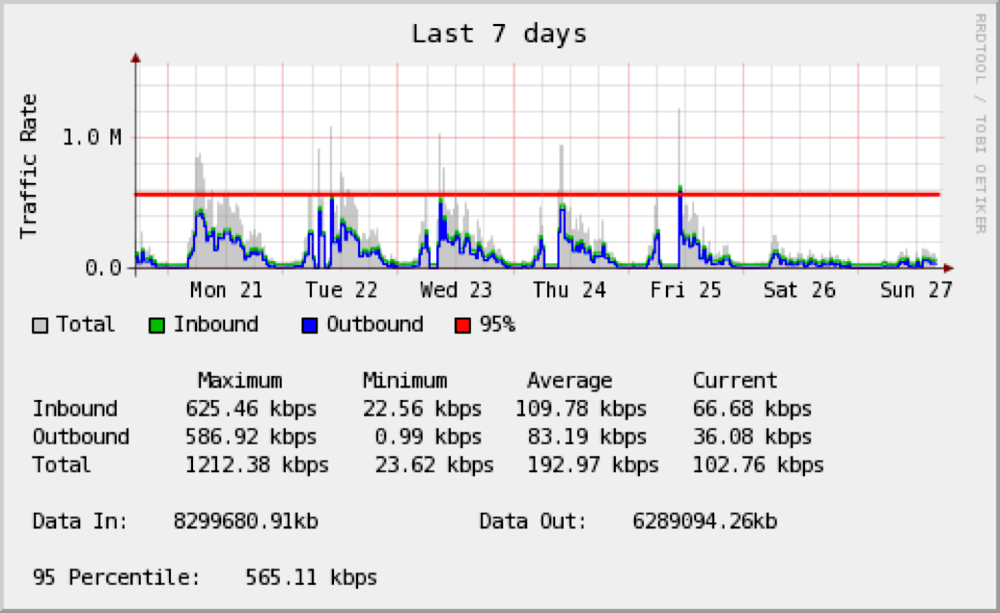

 

Figure NM 24: The horizontal line shows the 95th percentile amount.

 

MRTG and Cacti will calculate the 95th percentile for you.

This is a sample graph of a 960 kbps connection.

The 95th percentile came to 945 kbps after discarding the highest 5% of
traffic.

### Monitoring RAM and CPU usage

By definition, servers provide critical services that should always be
available. Servers receive and respond to client machine requests,
providing access to services that are the whole point of having a
network in the first place. Therefore, servers must have sufficient
hardware capabilities to accommodate the work load. This means they must
have adequate RAM, storage, and processing power to accommodate the
number of client requests. Otherwise, the server will take longer to
respond, or in the worst case, may be incapable of responding at all.
Since hardware resources are finite, it is important to keep track of
how system resources are being used. If a core server (such as a proxy
server or email server) is overwhelmed by requests, access times become
slow.

This is often perceived by users as a network problem. There are several
programs that can be used to monitor resources on a server. The simplest
method on a Windows machine is to access the Task Manager using the Ctrl
Alt + Del keys, and then click on the Performance tab. On a Linux or BSD
box, you can type top in a terminal window. To keep historical logs of
such performance, MRTG or RRDtool can also be used.

 

 

Figure NM 25: RRDtool can show arbitrary data, such as memory and CPU
usage, expressed as an average over time.

Mail servers require adequate space, as some people may prefer to leave
their email messages on the server for long periods of time.

The messages can accumulate and fill the hard disk, especially if quotas
are not in use.

If the disk or partition used for mail storage fills up, the mail server
cannot receive mail. If that disk is also used by the system, all kinds
of system problems may occur as the operating system runs out of swap
space and temporary storage.

File servers need to be monitored, even if they have large disks.

Users will find a way to fill any size disk more quickly than you might
think.

Disk usage can be enforced through the use of quotas, or by simply
monitoring usage and telling people when they are using too much.

Nagios can notify you when disk usage, CPU utilisation, or other system
resources cross a critical threshold.

 

If a machine becomes unresponsive or slow, and measurements show that a
system resource is being heavily used, this may be an indication that an
upgrade is required. If processor usage constantly exceeds 60% of the
total, it may be time to upgrade the processor. Slow speeds could also
be as a result of insufficient RAM. Be sure to check the overall usage
of CPU, RAM, and disk space before deciding to upgrade a particular
component.

A simple way to check whether a machine has insufficient RAM is to look
at the hard disk light.

When the light is on constantly, it usually means that the machine is
constantly swapping large amounts of data to and from the disk.

This is known as thrashing, and is extremely bad for performance.

 

It can usually be fixed by investigating which process is using the most
RAM, and killing or reconfiguring that process. Failing that, the system
needs more RAM. You should always determine whether it is more cost
effective to upgrade an individual component or purchase a whole new
machine. Some computers are difficult or impossible to upgrade, and it
often costs more to replace individual components than to replace the
entire system. Since the availability of parts and systems varies widely
around the world, be sure to weigh the cost of parts vs. whole systems,
including shipping and taxes, when determining the cost of upgrading.

### Summary

In summary in this chapter we've tried to give you an insight into how
to monitor your network and computing resources cost effectively and
efficiently. We've introduced many of our favourite tools to assist you.
Many of them are tried and tested by many network operators.

Hopefully you have understood the importance of monitoring to enable you
to both justify upgrades when necessary to those funding the upgrades,
plus minimise the impact of problems as they occur.

The end result is keeping your network and computing resources healthy
and keeping all of your users happy with the service you are providing
them.

17. ECONOMIC SUSTAINABILITY
---------------------------

 

### Introduction

Achieving long-term sustainability is perhaps the most difficult goal
when designing and operating wireless networks. The prohibitive cost of
Internet connectivity in many countries, particularly those who are
heavily regulated by the government, imposes a substantial operating
expense that makes these networks sensitive to economic fluctuations and
necessitates innovation to attain viability.

 

Substantial progress in the use of wireless networks for rural
communications has been accomplished over the past few years, due in
large part to technological breakthroughs.

 

Long-distance links have been constructed, high bandwidth designs are
possible and secure means to access networks are available. In contrast,
there have been fewer successes with the development of sustainable
business models for wireless networks, particularly for remote areas.

 

Based on experiences and observations of existing networks, as well as
knowledge from entrepreneurial development best practices, this chapter
will focus on documenting methods for building sustainable wireless
networks.

 

In the past decade, there has been tremendous growth in Internet access
across the world. Most cities now have wireless or DSL networks and
fibre optic connections to the Internet, which is a substantial
improvement.

Nevertheless, outside urban areas, Internet access is still a formidable
challenge. There is little wired infrastructure beyond principal cities
in many countries. Therefore, wireless remains one of the few choices
for providing affordable Internet access.

 

There are now proven models for rural access using wireless. This book
was written for those wishing to connect their communities.

The models described here are smaller in scale and use affordable
designs.

Our aim is to provide examples of how wireless networks can be designed
to expand sustainable access where large telecommunications operators
have not yet installed their networks into areas that would otherwise
not be economically feasible by traditional models.

 

Two common misconceptions must be dispelled. First, many people assume
that there is one preferred business model that will work in every
community, and the key to success is to find that one “eureka” solution.

 

In practice, this is not the case. Each community, town or village is
different. There is no prescribed model that meets the needs of all
areas. Despite the fact that some places may be similar in economic
terms, the characteristics of a sustainable business model vary from
community to community.

 

Although one model may work in one village, another village nearby may
not possess the same necessary qualities for this model to be
sustainable. In this circumstance, other innovative models must be
customised to fit the context of this particular community.

 

Another misconception is that sustainability has the same definition for
all people. Although this term generally means that a system is built to
persist indefinitely, this chapter focuses more on the discussion of the
economic conditions (financial and managerial) than other aspects of
sustainability. Also, instead of the horizon being indeterminate, it
centres on a time period of five years – the period in which these ICT
infrastructure and wireless technologies are expected to be useful.

 

Thus, the term sustainability will be used to encapsulate a system
designed to persist for approximately five years. As we explained
earlier in the book, wireless networks in local communities often
stimulate the growth of connectivity and usage, and the installation of
fibre begins to become a reality.

 

So creating a sustainable model for your wireless network may lead to
growth of other networks and installation of longer term greater
bandwidth fibre links.

Wireless will then likely continue to co-habit alongside fibre in your
network as it grows in size and reach.

When determining and implementing the best model for a wireless network,
several key factors will help to ensure its success.

 

This chapter is not meant to be a guide for managing sustainable
wireless networks.

 

Rather, this is a “how-to” guide seeking to present an approach that
will enable you to find the model that best fits your situation.

 

The tools and information contained within this chapter will help people
starting wireless networks to ask the right questions and gather the
necessary data to define the most appropriate components of their model.
Keep in mind that determining the best model is not a sequential process
where each step is followed until completion.

In fact, the process is ongoing and iterative.

 

All of the steps are integrally connected to each other, and often you
will revisit steps several times as you progress.

### Create a mission statement

 What do you want to accomplish by setting up your network?

 

It seems like a simple question. However, many wireless networks are
installed without a clear vision of what they are doing and what they
hope to accomplish in the future. The first step involves documenting
this vision with the input of your entire team or staff.

 

-   •What is the purpose of the wireless network?  

-   •Who does the network seek to serve?  

-   •What does the network do to address the community’s needs and to
    create value?  

-   •What are the principles that guide the network?  

 

A good mission statement expresses the purpose of your network in a
concise, meaningful way while articulating your values and services.

Above all, your mission provides a vision of the aspirations for your
wireless network.

 

It is important that every team member working to build the wireless
network is included in the process of developing your mission, which
helps create further buy-in. It will garner support and commitment not
only from your staff, but also from customers, partners and donors,
which will further your overall objectives.

 

In the dynamic world of technology, the needs of customers and the best
way to satisfy those needs change rapidly; therefore, the development of
your mission is an ongoing process.

After defining the initial mission with your team, you must conduct
research to determine whether this first conception is aligned with the
realities of your environment. Based on an analysis of the external
environment and your internal competencies, you must constantly modify
the mission throughout the life-cycle of the wireless network.

### Evaluate the demand for potential offerings

The next step in deriving your business model involves assessing the
community’s demand for the network’s products and services. First,
identify the individuals, groups and organisations in the community that
have a need for information and would benefit from the wireless
network’s offerings. Potential users could consist of a wide variety of
individuals and organisations that include, but are not limited to:

 

-   •Farmers’ associations and cooperatives  

-   •Women’s groups 

-   •Schools and universities  

-   •Businesses and local entrepreneurs  

-   •Health clinics and hospitals  

-   •Religious groups 

-   •International and local non-governmental organizations (NGOs) Local
    and national government agencies 

-   •Radio stations 

-   •Organisations in the tourist industry 

 

Once you establish a list of all the potential user groups of the
network, you must determine their needs for access to information and
communication. Often, people confuse services with needs.

A farmer may need to gather information on market prices and climatic
conditions to improve his crop yield and sales. Perhaps the way in which
he gets this information is through the Internet; however, the farmer
could also receive this information through SMS over a mobile phone or
through Voice over Internet Protocol (VoIP). It is important to
differentiate between needs and services because there may be various
ways to satisfy the farmer’s needs. Your wireless network should look
for the best way to fulfill the farmer’s needs, thereby creating value
at the lowest cost for the user.

When assessing the needs of the community, it is important to figure out
where the network can bring the most value to its users.

For instance, in the small town of Douentza, Mali, a telecentre manager
evaluated the potential benefits of establishing a wireless network
through discussions with several local organisations. He interviewed one
local NGO that discussed its need to send monthly reports to its
headquarters office in Bamako. At that time, there was no Internet
access in Douentza. In order to email a copy of the report, the NGO sent
one of its employees to Mopti once a month, resulting in transportation
and lodging costs, as well as the opportunity cost of having the
employee out of the office for several days each month.

When the telecentre manager calculated the total monthly costs incurred
by the NGO, he was able to demonstrate the value of an Internet
connection through cost savings to the organisation.

Assistance from key partners may also be necessary to secure
sustainability for your wireless network. During this phase, you should
connect with potential partners and explore mutually beneficial
collaborations.

You can evaluate the demand in your community by contacting your
potential customers and asking questions directly or through surveys,
focus groups, interviews or town hall meetings. Conducting research
through a review of statistical documentation, industry reports,
censuses, magazines, newspapers and other secondary data sources will
also help to give you a better picture of your local environment.

The goal of this data collection is to obtain a thorough understanding
of the demand for information and communication in your community so
that the network being created responds to those needs.

Often, wireless networks that do not succeed forget this key step.

Your entire network should be based on the demand in the community.

If you set up a wireless network in which the community does not find
value or cannot afford its services, it will ultimately fail.

### Establish appropriate incentives

Often, there is little economic incentive for subsistence-based economic
participants to access the Internet.

In addition, the cost of acquiring a computer or mobile smart phone,
learning to use it, and getting an Internet connection far outweighs the
economic returns that it can provide.

There has recently been some development of applications that address
this lack of incentive, such as market information systems, quality
standards imposed by importing countries, and commodities exchanges.
Internet access becomes an obvious advantage in situations where knowing
the day-to-day prices of products can make a significant difference in
income. Establishing appropriate economic incentives is paramount to the
success of the network. The network must provide economic value to its
users in a way that outweighs its costs, or it must be cheap enough that
its costs are marginal and affordable to its users. It is crucial to
design a network with viable economic uses and with costs that are less
than the economic value provided by it.

Additionally, to create a proper incentive structure, you must involve
the community in the creation of the network from the beginning of the
project, making sure that this initiative is organic and not imposed
from the outside.

To begin, you should try to answer the following questions:

 

1.  1.  1.What economic value can this network generate for the local
        economy and for whom? 

    2.  2.How much perceivable economic value can be generated? 

    3.  3.Can present impediments be overcome to allow the achievement
        of these economic returns? 

 

By answering these questions, the network will be able to clearly
articulate its value proposition for its users. For example, “By using
this network you can improve your margins on commodity sales by 2%,” or
“Internet access will allow you to save \$X in phone charges and
transportation costs per month.” You must figure out how your network
can improve efficiencies, reduce costs, or increase revenues for these
customers.

For example, if providing market information for the local maize
industry, the network should be located near to where farmers bring
their crop for sale to merchants.

Your network would then likely need to tie-into market information
systems, providing daily price sheets (\$1 each), or terminals to
sellers and merchants (\$2/hr). Your network might also provide the
means for farmers to read about new techniques and to buy new products.
You might also provide wireless connections to merchants and rent them
thin-client terminals for Internet access.

If the market was small, you might be able to reduce costs by limiting
access to images and other bandwidth intensive services. Again, knowing
how much value your network will create for these merchants will allow
you to gauge how much they will be able to afford for your services.

### Research the regulatory environment for wireless

The regulatory environment for wireless networks also affects the type
of business model that can be implemented.

First, research whether any organisation has the right to use 2.4 GHz
frequencies without a license.

In most situations, 2.4 GHz is free to use worldwide; however, some
countries restrict who can operate a network or require expensive
licenses to do so.

So although wireless networks might be legal in a country, the operator
of a network might have to acquire a license to use 2.4 GHz frequencies,
which renders this usage prohibitive for anyone other than established
Internet Service Providers who have sufficient cash flow to pay the
license fees. This restriction makes it difficult for small communities
to share a wireless network with other potentially interested parties or
organisations.

Other countries are more permissive with no such restrictions on
wireless networks, so the possibility to share Internet connectivity in
small communities is a viable solution.

The lesson is to do your research at the onset, ensuring your network
will comply with the laws of the country and local community. Some
project managers have been forced to shut down their wireless networks
simply because they were unknowingly breaking the law.

You should also check into the legality of Voice over Internet Protocol
(VoIP) services.

In some countries there are complicated rules surrounding VoIP. The
rules for VoIP services and VoIP gateways vary a lot so please check in
your own country what is legally allowed. You can start by checking
wikipedia -
[http://en.wikipedia.org/wiki/Voice\_over\_I](http://en.wikipedia.org/wiki/Voice_over_IP)P

### Analyse the competition

The next phase in the evaluation of your community involves an analysis
of the wireless network’s competition. Competitors include organisations
that provide similar products and services (e.g., another wireless
Internet Service provider or WISP), organisations viewed as substitutes
or alternatives to the products and services your network provides
(e.g., a cybercafé), and organisations defined as new entrants to the
wireless market.

Once you have identified your competitors, you should research them
thoroughly. You can obtain information about your competitors through
the Internet, telephone calls, their advertisements and marketing
materials, surveys of their customers and visits to their site. Create a
file for each competitor. The competitive information you gather can
include a list of services (including price and quality information),
their target clients, customer service techniques, reputation,
marketing, etc.

Be sure to collect anything that will help you determine how to position
your network in the community.

It is important to evaluate your competition for many reasons. First, it
helps you determine the level of market saturation. Knowing what already
exists will allow you to determine how your network can contribute value
to the community. In addition, analysing the competition can stimulate
innovative ideas for your service offerings. Is there something that you
can do better than the competitors to make your services more
effectively fit the needs of the community?

Finally, by analysing your competitors from the customers’ point of view
and understanding their strengths and weaknesses, you can determine your
competitive advantages in the community.

Competitive advantages are those which cannot be easily replicated by
the competition.

For example, a wireless network that can exclusively offer a faster
Internet connection than a competitor is a competitive advantage.

### Determine initial and recurring costs and pricing

When you are planning to set up and operate your wireless network, you
must determine the resources needed to start your project and the
recurring operating costs. Start-up costs include everything you must
purchase to start your wireless network.

 

These expenses can range from the initial investment you make in
hardware, access to towers and so on plus equipment for access points,
hubs, switches, cables, solar equipment, UPS, etc. to the costs to
register your organisation as a legal entity.

Recurring costs are what you must pay to continue to operate your
wireless network, including the cost of Internet access, telephones,
loans, electricity, salaries, office rental fees, equipment maintenance
and repairs, and regular investments to replace malfunctioning or
obsolete equipment.

Every piece of equipment will eventually break down or become outdated
at some point, and you should set aside extra money for this purpose.

 

An advisable and very common method to deal with this is to take the
price of the device and divide it by the period of time you estimate
that it will last.

This process is called depreciation. Here is an example. An average
computer is supposed to last for two to five years. If the initial cost
to purchase the computer was \$1,000 USD, and you will be able to use
the computer for five years, your annual depreciation will be \$200 USD.
In other words, you will lose \$16.67 USD every month so that you can
eventually replace this computer. To make your project sustainable, it
is of fundamental importance that you save the money to compensate for
the depreciation of equipment each month.

Keep these savings until you finally have to spend them for equipment
replacement. Some countries have tax laws that determine the period of
depreciation for different types of devices.

In any case, you should try to be very realistic about the life-cycle of
all the implemented gear and plan for their depreciation carefully.

It is important to research all your start-up costs in advance, and make
realistic estimations of your recurring expenses.

It is always better to over-budget for expenses than to under-budget.

 

With every wireless project, there are always unforeseen costs,
especially during the first year of operations as you learn how to
better manage your network. Following, is a non-exhaustive list of
categories of costs that you should include, both in start-up phase and
for your recurring costs, just to give you an idea of how to get started
on calculating your costs:-

### Categories of Costs

Labour costs -

-   •Check ups (analyses) and consultancies 

-   •Development costs for programming, testing, integration etc.  

-   •Installation costs 

-   •Recruiting costs 

-   •Training costs (introduction and on-going) 

-   •Handling costs / salaries for employees or freelancers, including
    yourself  

-   •Equipment maintenance staff costs 

-   •Software support staff costs  

-   •Security personnel 

 

Non-labour costs -

-   •Acquisition and production costs (for hardware like PCs, VSAT,
    radio link equipment and software)  

-   •Ancillary equipment (e.g., switches, cables and cabling, generator,
    UPS, etc.) 

-   •Data protection and security 

-   •Start-up inventory (chairs, tables, lighting, curtains, tiles and
    carpeting) 

-   •Premises costs (new building, modification, air conditioning,
    electrical wiring and boxes, security grills)  

-   •Legal costs, such as business registration 

-   •Initial license costs (VSAT) 

-   •Initial marketing costs (flyers, stickers, posters, opening party) 

-   •Operating costs for hardware and operating systems (Internet
    access, telephone, etc.)  

-   •Rent or leasing rates (for tower space for example) 

-   •Depreciation of hardware and equipment  

-   •License fees 

-   •Consumables and office supplies (e.g., data media, paper, binds,
    clips)  

-   •Operational costs to maintain data protection and security 

-   •Insurance premiums 

-   •Costs for energy and to ensure power supply 

-   •Loan payments, capital costs for paying back your setup costs 

-   •Costs for advertising 

-   •Local fees 

-   •Legal and accounting services 

     

To improve your chances of sustainability, it is generally best to
maintain the lowest cost structure for your network.

 

In other words, keep your expenses as low as possible.

Take time to thoroughly research all of your suppliers, particularly the
ISPs, and shop around for the best deals on quality service. Once again,
be certain that what you purchase from suppliers corresponds with the
demand in the community.

Before installing an expensive VSAT, ensure there is a sufficient number
of individuals and organisations in your community willing and able to
pay for using it.

Depending upon demand for information access and ability to pay, an
alternative method of connectivity may be more appropriate. Do not be
afraid to think outside the box and be creative when determining the
best solution.

 

Keeping your costs down should not be at the cost of quality. Because
low-quality equipment is more likely to malfunction, you could be
spending more on maintenance in the long run.

The amount of money you will spend to maintain your ICT infrastructure
is hard to guess. The larger and more complicated your infrastructure
becomes, the more financial and labour resources you must allocate for
its maintenance.

Many times this relation is not linear but exponential. If you have a
quality problem with your equipment once it is rolled out, it can cost
you an enormous amount of money to fix it. Concurrently, your sales will
decrease because the equipment is not up and running.

There is an interesting example of a major wireless Internet Service
Provider (WISP) who had more than 3,000 access points in operation for a
while. However, the WISP never managed to break-even because it had to
spend too much money to maintain all the access points.

In addition, the company underestimated the short life-cycle of such
devices. ICT hardware tends to get cheaper and better as time goes on.
As soon as the company had invested time and money to install the
version of expensive first generation 802.11b access points, the new “g”
standard was created.

New competitors designed better and cheaper access points and offered
faster Internet access for less money. Finally the first WISP was forced
to close down the company, although it was initially the market leader.

Keep in mind the rapid advancement and changes in technology and think
about how and when it may be time for you to reinvest in newer and
cheaper (or better) devices to keep your infrastructure competitive and
up-to-date. As mentioned before, it is highly important that you save
enough to be able to do so, when necessary.

 

Once you have identified and mapped out your costs, you should also
determine what and how to charge for your services. This is a
complicated and time-consuming process to do correctly. These key tips
will assist when making pricing decisions:

 

-   •Calculate the prices you charge so that you cover all costs to
    provide the service, including all recurring expenses  

-   •Examine the prices of your competitors. 

-   •Evaluate what your customers are willing and able to pay for your
    services, and make sure your prices correspond with these 

 

It is absolutely essential to make a financial plan before you start to
find out if your project can be sustainable.

### Secure the financing

Once you have determined your initial and recurring costs and created
your financial plan, you know how much financing you will need to run a
successful wireless network.

The next step is to research and secure the appropriate amount of money
to start up and run your wireless network.

The most traditional method of receiving funding for wireless networks
is through grants given by donors. A donor typically will contribute
funding and other types of donations to an organisation or consortium of
organisations to help them manage projects or support causes.

Because this funding is provided in the form of grants or other
donations, it is not expected to be repaid by the organisations
implementing the wireless projects or by the project’s beneficiaries.

Such donors include large international organisations like the United
Nations (UN) and various specialised UN agencies like the United Nations
Development Program (UNDP) and United Nations Educational, Scientific
and Cultural Organization (UNESCO). Government agencies that specialise
in international development, such as the United States Agency for
International Development (USAID), the United Kingdom’s Department for
International Development (DFID), and the Canadian International
Development Agency (CIDA), are also considered donors. Large foundations
like the Gates Foundation and the Soros Foundation and private
commercial companies are other types of donors.

 

Typically, receiving funding involves a competitive or a non-competitive
process. The non-competitive process is more infrequent, so we will
focus on the competitive process at a very high level. Most donors have
complicated procedures surrounding the distribution of funding. During
the competitive bid process, the donor creates a request for proposal
(RFP) or a request for application (RFA), which solicits various
non-governmental organisations, private companies and their partners to
submit proposals outlining their plans for projects within the
constraints of the donors’ objectives and guidelines.

In response to this RFP or RFA, NGOs and other organisations compete
through the submittal of their proposals, which are then evaluated by
the donors based on specific established criteria. Finally, the donor
organisation selects the most appropriate and highest ranking proposal
to fund the project.

Sometimes donors also supply funding to support an organisation’s
operations, but this type of funding is more unusual than the
competitive bid process for a specific project.

 

Another way of accessing the necessary funds to start and maintain a
wireless network is through microfinance, or the provision of loans,
savings and other basic financial services to the world’s poorest
people. Pioneered in the 1970’s by organisations like ACCION
International and Grameen Bank, microcredit, a type of microfinance,
enables entrepreneurs to receive loans in small amounts of money to
start up small enterprises.

Despite the fact that often individuals lack many of the traditional
qualifications needed to obtain loans like verifiable credit, collateral
or steady employment, microcredit programs have been highly successful
in many countries.

Typically, the process involves an individual or a group completing and
submitting a loan application in the hopes of receiving a loan, and the
lender, the individual or organisation that provides the loan, giving
money on condition that it is returned with interest.

 

The use of microcredit to fund wireless networks does pose one
constraint. Usually, microcredit involves very small sums of money.
Unfortunately, because a large amount of capital is needed to purchase
the initial equipment for wireless network set up, sometimes a
microcredit loan is not sufficient.

However, there have been many successful applications of microcredit
that have brought technology to communities. An example includes the
story of village phone operators. These entrepreneurs use their
microcredit loans to purchase mobile phones and phone credits.

They then rent the use of their mobile phones to community members on a
per-call basis and earn enough money to repay their debt and make a
profit for themselves and their families.

 

Another mechanism for getting funding to start a wireless network is
angel funding. Angel investors are normally wealthy individuals that
provide capital for business start-up in exchange for a high rate of
return on their investment.

Because the ventures in which they invest are start ups and, therefore,
often high risk, angel investors tend to expect different things in
addition to their return.

Many expect a Board position and maybe a role in the organisation.

Some angels want to have a stake in the company, while others prefer
shares in the company that can be easily redeemable at face value, thus
providing a clear exit for the investor.

To protect their investments, angels frequently ask the businesses not
to make certain key decisions without their approval. Because of the
high risk involved in developing markets, it is often challenging to
find angel investors to help setup a wireless network, but not
impossible.

The best way to find potential investors is through your social network
and through research online.

### Evaluate the strengths and weaknesses of the internal situation

A network is only as good as the people who work and operate it.

The team you put in place can mean the difference between success and
failure.

That is why it is important to reflect on your team’s qualifications and
skills, including those of staff and volunteers, in comparison to the
competencies needed for a wireless project.

First, make a list of all the competencies needed to run a wireless
project successfully. Capacity areas should include technology, human
resources, accounting, marketing, sales, negotiation, legal, and
operations, among others. Afterwards, identify local resources to
fulfill these skills.

Map your team’s skill sets to the competencies needed, and identify key
gaps. One tool often used to assist with this self-evaluation is an
analysis of strengths, weaknesses, opportunities and threats, called
SWOT.

 

To conduct this analysis, specify your internal strengths and
weaknesses, and elaborate upon the external opportunities and threats in
your community. It is important to be realistic and honest about what
you do well and what you are lacking.

Be sure to distinguish between where your organisation is at the
beginning of this endeavour from where it could be in the future. Your
strengths and weaknesses allow you to evaluate your capacities
internally and better understand what your organisation can do, as well
as its limits.

 

By understanding your strengths and weaknesses and comparing them to
those of your competitors, you can determine your competitive advantages
in the market.

You can also note the areas where you can improve. Opportunities and
threats are external, which enable you to analyse real world conditions
and how these conditions influence your network.

 

The diagram on the next page will help you in creating your own SWOT
analysis for your organisation.

Be sure to respond to the questions asked and list your strengths,
weaknesses, opportunities and threats in the spaces designated.

 

 

Strengths

Weaknesses

What do you do well?

What unique resources can you draw on? What do others see as your
strengths?

What could you improve?

Where do you have fewer resources than others?

What are others likely to see as weaknesses?

Opportunities

Threats

What good opportunities are open to you? What trends could you take
advantage of? How can you turn your strengths into opportunities?

What trends could harm you? What is your competition doing?

What threats do your weaknesses expose you to?

### Putting it all together

Once you have gathered all of the information, you are ready to put
everything together and decide upon the best model for the wireless
network in your community. Based on the results of your external and
internal analyses, you must refine your mission and service offerings.
All of the factors that you researched in the preceding steps come into
play when determining your overall strategy. It is essential to employ a
model that capitalises on opportunities and works within the constraints
of the local environment.

To do this, you must often find innovative solutions to attain
sustainability. By exploring several examples and discussing the
components of the models implemented in those instances, you will better
understand how to arrive at an appropriate model.

In the distant jungles of the Democratic Republic of Congo, there is a
rural hospital in a village called Vanga in the province of Bandundu. It
is so remote that patients travel for weeks to get there often through a
combination of travel by foot and by river.

This village, founded by Baptist missionaries in 1904, has served as a
hospital for many years.

Although it is extremely remote, it is renowned for being an excellent
facility and has had the support of German and American missionaries who
have kept this facility in operation.

In 2004, a project sponsored by USAID established a telecentre in this
village to help improve education in this isolated community; this
Internet facility was also heavily used by the educated class in the
community – the hospital's staff.

The centre had been a great boon to the community, offering access to
the world's knowledge and even providing consultation with distant
colleagues in Switzerland, France and Canada.

The centre required near total subsidisation to operate and cover its
costs, and funding was to end by 2006.

Although the centre added great value to the community, it did have some
shortcomings, primarily technical, economic, and political issues that
limited its sustainability.

 

A study was commissioned to consider options for its future.

After reviewing the centre’s cost structure, it was determined that it
needed to cut its costs and look for new ways to increase its revenues.

 

The largest expenses were electricity and Internet access; therefore,
creative models needed to be constructed to reduce the telecentre’s
costs and provide access in a way that was sustainable.

 

 

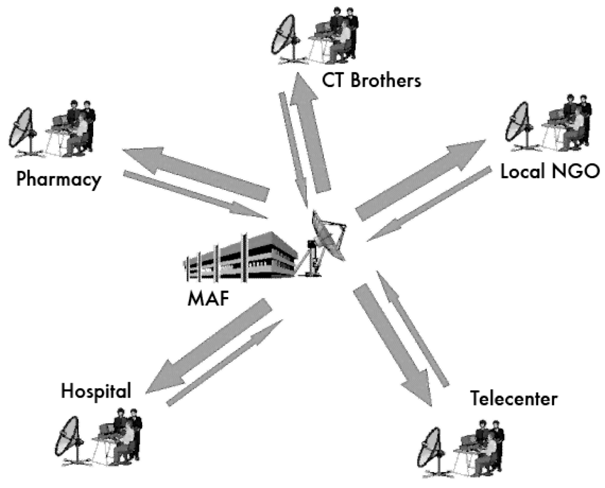

 

Figure ES 1: Shared Internet over wireless

 

 

In this instance, a traditional VSAT had been used for connectivity.

However, there was a unique way of accommodating local community groups’
limited ability to pay for Internet services. Various organisations in
the community shared this Internet access through a local wireless
network; this meant that they also shared the costs associated with the
VSAT connection and local wireless network. This model led to greater
sustainability for everyone. In Vanga, several organisations, including
a hospital, a pharmacy, several missionary groups, a community resource
centre, and some non-profit organisations, had a need for Internet
access and the means to pay for it. This arrangement enabled the network
of organisations to have a higher quality connection at a lower cost.
Additionally, one organisation in the village had the capacity and
willingness to manage several aspects of the network’s operations,
including the billing and payment collection, technical maintenance and
general business operations of the entire network.

Therefore, this model worked well in Vanga because it had been tailored
to meet community demand and leverage local economic resources.

 

 

Figure ES 2: DakNet's roaming access point

 

Another example of a model adapted to fit the local context is that of
First Mile Solutions’ DakNet. This model has been deployed in villages
in India, Cambodia, Rwanda, and Paraguay. By taking into account the
limited buying power of villagers, this model addresses their
communication needs in an innovative way.

In the DakNet model, there is a franchise that exists in the country,
and local entrepreneurs are recruited and trained to operate kiosks
equipped with Wi-Fi antennas.

Using pre-paid cards, villagers are able to asynchronously send and
receive emails, texts, and voice mails, conduct web searches, and
participate in e-commerce. Afterwards, these communications are stored
in the local kiosk’s server. When a bus or motorcycle with a mobile
access point drives past a kiosk, the vehicle automatically receives the
kiosk’s stored data and delivers any incoming data.

Once the vehicle reaches a hub with Internet connectivity, it processes
all requests, relaying emails, messages, and shared files. DakNet
integrates both mobile access and franchise models to bring value to
people in remote villages. For such a model to be sustainable, several
key conditions need to be present.

First, a franchise organisation must exist to provide financial and
institutional support, including an initial investment, working capital
for certain recurring costs, advice on start-up practices, management
training, standardised processes, reporting mechanisms, and marketing
tools.

Additionally, this model requires a highly motivated and dynamic
individual in the village, with the appropriate skills to manage a
business and willingness to accept certain requirements of the franchise
organisation. Because these entrepreneurs are often asked to commit
their own resources to the start-up costs, they need to have sufficient
access to financial resources.

Finally, to ensure this model will sustain itself, there should be
sufficient demand for information and communication and few competitors
in the community.

### Conclusion

No single business model will enable wireless networks to be sustainable
in all environments; different models must be used and adapted as the
circumstances dictate. Every community has unique characteristics, and
sufficient analysis must be conducted at the onset of a project to
determine the most appropriate model. This analysis should consider
several key factors in the local environment, including community
demand, competition, costs, economic resources, etc. Although
appropriate planning and execution will maximise the chances of making
your network sustainable, there are no guarantees of success. However,
by using the methods detailed in this chapter, you will help to ensure
that your network brings value to the community in a way that
corresponds with the users’ needs.

 

 

5GLOSSARY
=========

Glossary
--------

0 - 9

802.11. While 802.11 is a wireless protocol in its own right, 802.11 is
often used to refer to a family of wireless networking protocols used
mainly for local area networking. Three popular variants include
802.11b, 802.11g, and 802.11a. See also: Wi-Fi.

A

AC see Alternating Current

access point (AP). A device that creates a wireless network that is
usually connected to a wired Ethernet network. See also: CPE, master
mode

accumulator. Another name for a battery.

ad-hoc mode. A radio mode used by 802.11 devices that allows the
creation of a network without an access point. Mesh networks often use
radios in ad-hoc mode. See also: managed mode, master mode, monitor mode

Address Resolution Protocol (ARP). A protocol widely used on Ethernet
networks to translate IP addresses into MAC addresses.

address space. A group of IP addresses that all reside within the same
logical subnet.

advertised window. The portion of a TCP header that specifies how many
additional bytes of data the receiver is prepared to accept.

Alternating Current (AC). An electrical current which varies over time
in a cyclic manner. AC current is typically used for lighting and
appliances. See also: Direct Current

amortization. An accounting technique used to manage the expected cost
of replacement and obsolescence of equipment over time.

amplifier. A device used to increase the transmitted power of a wireless
device.

amplitude. The distance from the center of a wave to the extreme of one
of its peaks.

anchor clients. Business clients of a subscription system who are
reliable and can be considered low-risk.

AND logic. A logical operation that only evaluates as true if all of the
items being compared also evaluate as true. See also: OR logic.

anonymizing proxy. A network service that hides the source or
destination of communications. Anonymizing proxies can be used to
protect people's privacy and to reduce an organization's exposure to
legal liability for the actions of its users.

anonymity. In computer networks, communications that cannot be linked to
a unique individual are said to be anonymous. The trade-off of anonymity
versus accountability in communications is an ongoing debate online, and
rules about anonymous communications vary widely around the world. See
also: authenticated

antenna diversity. A technique used to overcome multipath interference
by using two or more physically separated receiving antennas.

antenna gain. The amount of power concentrated in the direction of
strongest radiation of an antenna, usually expressed in dBi. Antenna
gain is reciprocal, which means that the effect of gain is present when
transmitting as well as receiving.

antenna pattern. A graph that describes the relative strength of a
radiated field in various directions from an antenna. See also:
rectangular plot, polar plot, linear polar coordinates, logarithmic
polar coordinates

AP see Access Point

application layer. The topmost layer in the OSI and TCP/IP network
models.

Argus see Audit Record Generation and Utilization System

ARP see Address Resolution Protocol

associated. An 802.11 radio is associated to an access point when it is
ready to communicate with the network. This means that it is tuned to
the proper channel, in range of the AP, using the correct SSID and other
authentication parameters, etc.

at. A Unix facility that allows timed, one-shot execution of programs.
See also: cron

attenuation. The reduction of available radio power as it is absorbed
along a path, such as through trees, walls, buildings, or other objects.
See also: free space loss, scattering

Audit Record Generation and Utilization System (Argus). An open source
network monitoring tool used for tracking flows between hosts. Argus is
available from http://www.qosient.com/argus .

authenticated. A network user that has proven their identity to a
service or device (such as an access point) beyond a shadow of a doubt,
usually by some means of cryptography. See also: anonymity

azimuth. The angle that measures deviation with respect to the south in
the northern hemisphere, and with respect to the north in the southern
hemisphere. See also: inclination

B

bandwidth. A measure of frequency ranges, typically used for digital
communications. The word bandwidth is also commonly used interchangeably
with capacity to refer to the theoretical maximum data rate of a digital
communications line. See also: capacity, channel, throughput

battery. A device used to store energy in a photovoltaic system. See
also: solar panel, regulator, load, converter, inverter

beamwidth. The angular distance between the points on either side of the
main lobe of an antenna, where the received power is half that of the
main lobe. The beamwidth of an antenna is usually stated for both the
horizontal and vertical planes.

benchmarking. Testing the maximum performance of a service or device.
Benchmarking a network connection typically involves flooding the link
with traffic and measuring the actual observed throughput, both on
transmit and receive.

BGAN see Broadband Global Access Network

BNC connector. A coaxial cable connector that uses a "quick-connect"
style bayonet lug. BNC connectors are typically found on 10base2 coaxial
Ethernet.

bridge. A network device that connects two networks together at the data
link layer. Bridges do not route packets at the network layer. They
simply repeat packets between two link-local networks. See also: router
and transparent bridging firewall.

bridge-utils. A Linux software package that is required for creating
802.1d Ethernet bridges. http://bridge.sourceforge.net/

Broadband Global Access Network (BGAN). One of several standards used
for satellite Internet access. See also: Digital Video Broadcast (DVB-S)
and Very Small Aperture Terminal (VSAT).

broadcast address. On IP networks, the broadcast IP address is used to
send data to all hosts in the local subnet. On Ethernet networks, the
broadcast MAC address is used to send data to all machines in the same
collision domain.

bypass diodes. A feature found on some solar panels that prevents the
formation of hot-spots on shaded cells, but reduces the maximum voltage
of the panel.

C

CA see Certificate Authority

Cacti (http://www.cacti.net/). A popular web-based monitoring tool
written in PHP.

capacity. The theoretical maximum amount of traffic provided by a
digital communications line. Often used interchangeably with bandwidth.

captive portal. A mechanism used to transparently redirect web browsers
to a new location. Captive portals are often used for authentication or
for interrupting a user's online session (for example, to display an
Acceptable Use Policy).

cell. Solar panels are made up of several individual cells, which are
electrically connected to provide a particular value of current and
voltage. Batteries are also made up of individual cells connected in
series, each of which contributes about 2 volts to the battery.

Certificate Authority. A trusted entity that issues signed cryptographic
keys. See also: Public Key Infrastructure, SSL

channel capacity. The maximum amount of information that can be sent
using a given bandwidth. See also: bandwidth, throughput, data rate

channel. A well defined range of frequencies used for communications.
802.11 channels use 22 MHz of bandwidth, but are only separated by 5
MHz. See also: Appendix B.

CIDR see Classless Inter-Domain Routing

CIDR notation. A method used to define a network mask by specifying the
number of bits present. For example, the netmask 255.255.255.0 can be
specified as /24 in CIDR notation.

circular polarization. An electro-magnetic field where the electric
field vector appears to be rotating with circular motion about the
direction of propagation, making one full turn for each RF cycle. See
also: horizontal polarization, vertical polarization

Class A, B, and C networks. For some time, IP address space was
allocated in blocks of three different sizes. These were Class A (about
16 million addresses), Class B (about 65 thousand addresses), and Class
C (255 addresses). While CIDR has replaced class-based allocation, these
classes are often still referred to and used internally in organizations
using private address space. See also: CIDR notation.

Classless Inter-Domain Routing. CIDR was developed to improve routing
efficiency on the Internet backbone by enabling route aggregation and
network masks of arbitrary size. CIDR replaces the old class-based
addressing scheme. See also: Class A, B, and C networks.

client. An 802.11 radio card in managed mode. Wireless clients will join
a network created by an access point, and automatically change the
channel to match it. See also: access point, mesh

closed network. An access point that does not broadcast its SSID, often
used as a security measure.

coax. A round (coaxial) cable with a center wire surrounded by a
dielectric, outer conductor, and tough insulating jacket. Antenna cables
are usually made of coax. Coax is short for "of common axis".

collision. On an Ethernet network, a collision occurs when two devices
connected to the same physical segment attempt to transmit at the same
time. When collisions are detected, devices delay retransmission for a
brief, randomly selected period.

conductor. A material that easily allows electric or thermal energy to
flow through without much resistance. See also: dielectric, insulator

connectionless protocol. A network protocol (such as UDP) that requires
no session initiation or maintenance. Connectionless protocols typically
require less overhead than session oriented protocols, but do not
usually offer data protection or packet reassembly. See also: session
oriented protocol.

consistent platform. Maintenance costs can be reduced by using a
consistent platform, with the same hardware, software, and firmware for
many components in a network.

constructive interference. When two identical waves merge and are in
phase, the amplitude of the resulting wave is twice that of either of
the components. This is called constructive interference. See also:
destructive interference

controls. In NEC2, controls define the RF source in an antenna model.
See also: structure

converter. A device used to convert DC signals into a different DC or AC
voltage. See also: inverter

CPE see Customer Premises Equipment

cron. A Unix facility that allows timed and repeated execution of
programs. See also: at

Customer Premises Equipment. Network equipment (such as a router or
bridge) that is installed at a customer's location.

D

data link layer. The second layer in both the OSI and TCP/IP network
models. Communications at this layer happen directly between nodes. On
Ethernet networks, this is also sometimes called the MAC layer.

data rate. The speed at which 802.11 radios exchange symbols, which is
always higher than the available throughput. For example, the nominal
data rate of 802.11g is 54 Mbps, while the maximum throughput is about
20 Mbps). See also: throughput

dB see decibel

DC see Direct Current

DC/AC Converter. A device that converts DC power into AC power, suitable
for use with many appliances. Also known as an inverter.

DC/DC Converter. A device that changes the voltage of a DC power source.
See also: linear conversion, switching conversion

decibel (dB). A logarithmic unit of measurement that expresses the
magnitude of power relative to a reference level. Commonly used units
are dBi (decibels relative to an isotropic radiator) and dBm (decibels
relative to a milliwatt).

default gateway. When a router receives a packet destined for a network
for which it has no explicit route, the packet is forwarded to the
default gateway. The default gateway then repeats the process, possibly
sending the packet to its own default gateway, until the packet reaches
its ultimate destination.

default route.  A network route that points to the default gateway.

Denial of Service (DoS). An attack on network resources, usually
achieved by flooding a network with traffic or exploiting a bug in an
application or network protocol.

depreciation. An accounting method used to save money to cover the
eventual break down of equipment.

destructive interference. When two identical waves merge and are exactly
out of phase, the amplitude of the resulting wave is zero. This is
called destructive interference. See also: constructive interference

DHCP see Dynamic Host Configuration Protocol

dielectric. A non-conductive material that separates conducting wires
inside a cable.

Digital Elevation Map (DEM). Data that represents the height of terrain
for a given geographic area. These maps are used by programs such as
Radio Mobile to model electromagnetic propagation.

Digital Video Broadcast (DVB-S). One of several standards used for
satellite Internet access. See also: Broadband Global Access Network
(BGAN) and Very Small Aperture Terminal (VSAT).

dipole antenna. The simplest form of omnidirectional antenna.

Direct Current (DC). An electrical current which remains constant over
time. DC current is typically used for network equipment, such as access
points and routers. See also: Alternating Current

Direct Sequence Spread Spectrum (DSSS). The radio modulation scheme used
by 802.11b.

directional antenna. An antenna that radiates very strongly in a
particular direction. Examples of directional antennas include the yagi,
dish, and waveguide antennas. See also: omnidirectional antenna,
sectorial antenna

directivity. The ability of an antenna to focus energy in a particular
direction when transmitting, or to receive energy from a particular
direction when receiving.

diversity see antenna diversity

DNS see Domain Name Service

DNS caching. By installing a DNS server on your local LAN, DNS requests
for an entire network may be cached locally, improving response times.
This technique is called DNS caching.

dnsmasq. An open source caching DNS and DHCP server, available from
http://thekelleys.org.uk/

Domain Name Service (DNS). The widely used network protocol that maps IP
addresses to names.

dominant mode. The lowest frequency that can be transmitted by a
waveguide of a given size.

DoS see Denial of Service

DSSS see Direct Sequence Spread Spectrum

DVB-S see Digital Video Broadcast.

Dynamic Host Configuration Protocol (DHCP). A protocol used by hosts to
automatically determine their IP address.

E

eavesdropper. Someone who intercepts network data such as passwords,
email, voice data, or online chat.

edge. The place where one organization's network meets another. Edges
are defined by the location of the external router, which often acts as
a firewall.

electromagnetic spectrum. The very wide range of possible frequencies of
electromagnetic energy. Parts of the electromagnetic spectrum include
radio, microwave, visible light, and X rays.

electromagnetic wave. A wave that propagates through space without the
need for a propagating medium. It contains an electric and a magnetic
component. See also: mechanical wave

elevation see inclination

end span injectors. An 802.3af Power over Ethernet device that provides
power via the Ethernet cable. An Ethernet switch that provides power on
each port is an example of an end span injector. See also: mid span
injectors

end-to-end encryption. An encrypted connection negotiated by both ends
of a communications session. End-to-end encryption can provide stronger
protection than link layer encryption when used on untrusted networks
(such as the Internet).

EtherApe. An open source network visualization tool. Available at
http://etherape.sourceforge.net/

Ethereal see Wireshark.

Extended Service Set Identifier (ESSID). The name used to identify an
802.11 network. See also: closed network

external traffic. Network traffic that originates from, or is destined
for, an IP address outside your internal network, such as Internet
traffic.

F

firestarter. A graphical front-end for configuring Linux firewalls
available from http://www.fs-security.com/.

filter. The default table used in the Linux netfilter firewall system is
the filter table. This table is used for determining traffic that should
be accepted or denied.

firewall. A router that accepts or denies traffic based on some
criteria. Firewalls are one basic tool used to protect entire networks
from undesirable traffic.

flush. To remove all entries in a routing table or netfilter chain.

forwarding. When routers receive packets that are destined for a
different host or network, they send the packet to the next router
closest to its ultimate destination. This process is called forwarding.

forwarding loops. A routing misconfiguration where packets are forwarded
cyclically between two or more routers. Catastrophic network failure is
prevented by using the TTL value on every packet, but forwarding loops
need to be resolved for proper network operations.

free space loss. Power diminished by geometric spreading of the
wavefront, as the wave propagates through space. See also: attenuation,
free space loss, Appendix C

frequency. The number of whole waves that pass a fixed point in a period
of time. See also: wavelength, Hertz

front-to-back ratio. The ratio of the maximum directivity of an antenna
to its directivity in the opposite direction.

full duplex. Communications equipment that can send and receive at the
same time (such as a telephone). See also: half duplex

fwbuilder. A graphical tool that lets you create iptables scripts on a
machine separate from your server, and then transfer them to the server
later. http://www.fwbuilder.org/

G

gain. The ability of a radio component (such as an antenna or amplifier)
to increase the power of a signal. See also: decibel

gain transfer. Comparing an antenna under test against a known standard
antenna, which has a calibrated gain.

gasification. The production bubbles of oxygen and hydrogen that occurs
when a battery is overcharged.

globally routable. An address issued by an ISP or RIR that is reachable
from any point on the Internet. In IPv4, there are approximately four
billion possible IP addresses, although not all of these are globally
routable.

H

half duplex. Communications equipment that can send or receive, but
never both at once (such as a handheld radio). See also: full duplex.

Heliax. High quality coaxial cable that has a solid or tubular center
conductor with a corrugated solid outer conductor which enables it to
flex. See also: coax

Hertz (Hz). A measure of frequency, denoting some number of cycles per
second.

HF (High-Frequency). Radio waves from 3 to 30 MHz are referred to as HF.
Data networks can be built on HF that operate at very long range, but
with very low data capacity.

hop. Data that crosses one network connection. A web server may be
several hops away from your local computer, as packets are forwarded
from router to router, eventually reaching their ultimate destination.

horizontal polarization. An electromagnetic field with the electric
component moving in a linear horizontal direction. See also: circular
polarization, vertical polarization

hot-spot. In wireless networks, a hot-spot is a location that provides
Internet access via Wi-Fi, typically by use of a captive portal. In
photovoltaic systems, a hot-spot occurs when a single cell in a solar
panel is shaded, causing it to act as a resistive load rather than to
generate power.

hub. An Ethernet networking device that repeats received data on all
connected ports. See also: switch.

Huygens principle. A wave model that proposes an infinite number of
potential wavefronts along every point of an advancing wavefront.

Hz see Hertz

I

IANA see Internet Assigned Numbers Authority

ICMP see Internet Control Message Protocol

ICP see Inter-Cache Protocol

impedance. The quotient of voltage over current of a transmission line,
consisting of a resistance and a reactance. The load impedance must
match the source impedance for maximum power transfer (50Ω for most
communications equipment).

inbound traffic. Network packets that originate from outside the local
network (typically the Internet) and are bound for a destination inside
the local network. See also: outbound traffic.

inclination. The angle that marks deviation from a horizontal plane. See
also: azimuth

infrastructure mode see master mode

insulator see dielectric

Inter-Cache Protocol (ICP). A high performance protocol used to
communicate between web caches.

Internet Assigned Numbers Authority (IANA). The organization that
administers various critical parts of Internet infrastructure, including
IP address allocation, DNS root name servers, and protocol service
numbers.

Internet Control Message Protocol (ICMP). A Network Layer protocol used
to inform nodes about the state of the network. ICMP is part of the
Internet protocol suite. See also: Internet protocol suite.

Internet layer see network layer

Internet Protocol (IP). The most com-mon network layer protocol in use.
IP defines the hosts and networks that make up the global Internet.

Internet protocol suite (TCP/IP). The family of communication protocols
that make up the Internet. Some of these protocols include TCP, IP,
ICMP, and UDP. Also called the TCP/IP protocol suite, or simply TCP/IP.

Intrusion Detection System (IDS). A program that watches network
traffic, looking for suspicious data or behavior patterns. An IDS may
make a log entry, notify a network administrator, or take direct action
in response to undesirable traffic.

inverter see DC/AC Converter

IP see Internet Protocol

iproute2. The advanced routing tools package for Linux, used for traffic
shaping and other advanced techniques. Available from
http://linux-net.osdl.org/

iptables. The primary command used to manipulate netfilter firewall
rules.

irradiance. The total amount of solar energy that lights a given area,
in W/m2

ISM band. ISM is short for Industrial, Scientific, and Medical. The ISM
band is a set of radio frequencies set aside by the ITU for unlicensed
use.

isotropic antenna. A hypothetical antenna that evenly distributes power
in all directions, approximated by a dipole.

IV characteristic curve. A graph that represents the current that is
provided based on the voltage generated for a certain solar radiation.

K

knetfilter. A graphical front-end for configuring Linux firewalls.
Available from http://venom.oltrelinux.com/

known good. In troubleshooting, a known good is any component that can
be substituted to verify that its counterpart is in good, working
condition.

L

lag. Common term used to describe a network with high latency.

lambda (λ) see wavelength

LAN see Local Area Network

latency. The amount of time it takes for a packet to cross a network
connection. It is often (incorrectly) used interchangeably with Round
Trip Time (RTT), since measuring the RTT of a wide-area connection is
trivial compared to measuring the actual latency. See also: Round Trip
Time.

lead-acid batteries. Batteries consisting of two submerged lead
electrodes in an electrolytic solution of water and sulfuric acid. See
also: stationary batteries

lease time. In DHCP, IP addresses are assigned for a limited period of
time, known as the lease time. After this time period expires, clients
must request a new IP address from the DHCP server.

Line of Sight (LOS). If a person standing at point A has an unobstructed
view of point B, then point A is said to have a clear Line of Sight to
point B.

linear polar coordinates. A graph system with equally spaced, graduated
concentric circles representing an absolute value on a polar projection.
Such graphs are typically used to represent antenna radiation patterns.
See also: logarithmic polar coordinates

linear conversion. A DC voltage conversion method that lowers the
voltage by converting excess energy to heat. See also: switching
conversion

linear polarization. An electro-magnetic wave where the electric field
vector stays in the same plane all the time. The electric field may
leave the antenna in a vertical orientation, a horizontal orientation,
or at some angle between the two. See also: vertical polarization,
horizontal polarization

link budget. The amount of radio energy available to overcome path
losses. If the available link budget exceeds the path loss, minimum
receive sensitivity of the receiving radio, and any obstacles, then
communications should be possible.

link layer encryption. An encrypted connection between link-local
devices, typically a wireless client and an access point. See also:
end-to-end encryption

link-local. Network devices that are connected to the same physical
segment communicate with each other directly are said to be link-local.
A link-local connection cannot cross a router boundary without using
some kind of encapsulation, such as a tunnel or a VPN.

listen. Programs that accept connections on a TCP port are said to
listen on that port.

load. Equipment in a photovoltaic system that consumes energy. See also:
battery, solar panel, regulator, converter, inverter

Local Area Network (LAN). A network (typically Ethernet) used within an
organization. The part of a network that exists just behind an ISP's
router is generally considered to be part of the LAN. See also: WAN.

logarithmic polar coordinates. A graph system with logarithmically
spaced, graduated concentric circles representing an absolute value on a
polar projection. Such graphs are typically used to represent antenna
radiation patterns. See also: linear polar coordinates

long fat pipe network. A network connection (such as VSAT) that has high
capacity and high latency. In order to achieve the best possible
performance, TCP/IP must be tuned to match the traffic on such links.

LOS see Line of Sight

M

MAC layer see data link layer

MAC address. A unique 48 bit number assigned to every networking device
when it is manufactured. The MAC address is used for link-local
communications.

MAC filtering. An access control method based on the MAC address of
communicating devices.

MAC table. A network switch must keep track of the MAC addresses used on
each physical port, in order to efficiently distribute packets. This
information is kept in a table called the MAC table.

maintenance-free lead-acid batteries see lead-acid batteries

Man-In-The-Middle (MITM). A network attack where a malicious user
intercepts all communications between a client and a server, allowing
information to be copied or manipulated.

managed hardware. Networking hardware that provides an administrative
interface, port counters, SNMP, or other interactive features is said to
be managed.

managed mode. A radio mode used by 802.11 devices that allows the radio
to join a network created by an access point. See also: master mode,
ad-hoc mode, monitor mode

master browser. On Windows networks, the master browser is the computer
that keeps a list of all the computers, shares and printers that are
available in Network Neighborhood or My Network Places.

master mode. A radio mode used by 802.11 devices that allows the radio
to create networks just as an access point does. See also: managed mode,
ad-hoc mode, monitor mode

match condition. In netfilter, a match condition specifies the criteria
that determine the ultimate target for a given packet. Packets may be
matched on MAC address, source or destination IP address, port number,
data contents, or just about any other property.

Maximum Depth of Discharge (DoDmax). The amount of energy extracted from
a battery in a single discharge cycle, expressed as a percentage.

Maximum Power Point (Pmax). The point where the power supplied by a
solar panel is at maximum.

MC-Card. A very small microwave connector found on Lucent / Orinoco /
Avaya equipment.

mechanical wave. A wave caused when some medium or object is swinging in
a periodic manner. See also: electromagnetic wave

Media Access Control layer see data link layer

mesh. A network with no hierarchical organization, where every node on
the network carries the traffic of every other as needed. Good mesh
network implementations are self-healing, which means that they
automatically detect routing problems and fix them as needed.

message types. Rather that port numbers, ICMP traffic uses message types
to define the type of information being sent. See also: ICMP.

method of the worst month. A method for calculating the dimensions of a
standalone photovoltaic system so it will work in the month in which the
demand for energy is greatest with respect to the available solar
energy. It is the worst month of the year, as this month with have the
largest ratio of demanded energy to available energy.

MHF see U.FL

microfinance. The provision of small loans, savings and other basic
financial services to the world’s poorest people.

mid span injectors. A Power over Ethernet device inserted between an
Ethernet switch and the device to be powered. See also: end span
injectors

milliwatts (mW). A unit of power representing one thousandth of a Watt.

MITM see Man-In-The-Middle

​MMCX. A very small microwave connector commonly found on equipment
manufactured by Senao and Cisco.

monitor mode. A radio mode used by 802.11 devices not normally used for
communications that allows the radio passively monitor radio traffic.
See also: master mode, managed mode, ad-hoc mode

monitor port. On a managed switch, one or more monitor ports may be
defined that receive traffic sent to all of the other ports. This allows
you to connect a traffic monitor server to the port to observe and
analyze traffic patterns.

Multi Router Traffic Grapher (MRTG). An open source tool used for
graphing traffic statistics. Available from http://oss.oetiker.ch/mrtg/

multipath. The phenomenon of reflections of a signal reaching their
target along different paths, and therefore at different times.

multipoint-to-multipoint see mesh

mW see milliwatt

My TraceRoute (mtr). A network diagnostic tool used as an alternative to
the traditional traceroute program. http://www.bitwizard.nl/mtr/. See
also: traceroute / tracert.

N

N connector. A sturdy microwave connector commonly found on outdoor
networking components, such as antennas and outdoor access points.

Nagios (http://nagios.org/) A realtime monitoring tool that logs and
notifies a system administrator about service and network outages.

NAT see Network Address Translation

nat. The table used in the Linux netfilter firewall system to configure
Network Address Translation.

NEC2 see Numerical Electromagnetics Code

NetBIOS. A session layer protocol used by Windows networking for file
and printer sharing. See also: SMB.

netfilter. The packet filtering framework in modern Linux kernels is
known as netfilter. It uses the iptables command to manipulate filter
rules. http://netfilter.org/

netmask (network mask). A netmask is a 32-bit number that divides the 16
million available IP addresses into smaller chunks, called subnets. All
IP networks use IP addresses in combination with netmasks to logically
group hosts and networks.

NeTraMet. An open source network flow analysis tool available from
freshmeat.net/projects/netramet/

network address. The lowest IP number in a subnet. The network address
is used in routing tables to specify the destination to be used when
sending packets to a logical group of IP addresses.

Network Address Translation (NAT). NAT is a networking technology that
allows many computers to share a single, globally routable IP address.
While NAT can help to solve the problem of limited IP address space, it
creates a technical challenge for two-way services, such as Voice over
IP.

network detection. Network diagnostic tools that display information
about wireless networks, such as the network name, channel, and
encryption method used.

network layer. Also called the Internet layer. This is the third layer
of the OSI and TCP/IP network models, where IP operates and Internet
routing takes place.

network mask see netmask

ngrep. An open source network security utility used to find patterns in
data flows. Available for free from http://ngrep.sourceforge.net/

node. Any device capable of sending and receiving data on a network.
Access points, routers, computers, and laptops are all examples of
nodes.

Nominal Capacity (CN). The maximum amount of energy that can be
extracted from a fully charged battery. It is expressed in Ampere-hours
(Ah) or Watt-hours (Wh).

Nominal Voltage (VN). The operating voltage of a photovoltaic system,
typically 12 or 24 volts.

ntop. A network monitoring tool that provides extensive detail about
connections and protocol use on a local area network.
 http://www.ntop.org/

null. In an antenna radiation pattern, a null is a zone in which the
effective radiated power is at a minimum.

nulling. A specific case of multipath interference where the signal at
the receiving antenna is zeroed by the destructive interference of
reflected signals.

number of days of autonomy (N). The maximum number of days that a
photovoltaic system can operate without significant energy received from
the sun.

Numerical Electromagnetics Code (NEC2). A free antenna modeling package
that lets you build an antenna model in 3D, and then analyze the
antenna’s electromagnetic response.
[http://www.nec2.org/](http://www.nec2.org/)

O

OFDM see Orthogonal Frequency Division Multiplexing

omnidirectional antenna. An antenna that radiates almost equally in
every direction in the horizontal plane. See also: directional antenna,
sectorial antenna

one-arm repeater. A wireless repeater that only uses a single radio, at
significantly reduced throughput. See also: repeater

onion routing. A privacy tool (such as Tor) that repeatedly bounces your
TCP connections across a number of servers spread throughout the
Internet, wrapping routing information in a number of encrypted layers.

OR logic. A logical operation that evaluates as true if any of the items
being compared also evaluate as true. See also: AND logic.

Orthogonal Frequency Division Multiplexing (OFDM)

OSI network model. A popular model of network communications defined by
the ISO/IEC 7498-1 standard. The OSI model consists of seven
interdependent layers, from the physical through the application. See
also: TCP/IP network model.

outbound traffic. Network packets that originate from the local network
and are bound for a destination outside the local network (typically
somewhere on the Internet). See also: inbound traffic.

overcharge. The state of a battery when charge is applied beyond the
limit of the battery's capacity. If energy is applied to a battery
beyond its point of maximum charge, the electrolyte begins to break
down. Regulators will allow a small amount of overcharge time to a
battery to avoid gasification, but will remove power before the battery
is damaged.

overdischarge. Discharging a battery beyond its Maximum Depth of
Discharge, which results in deterioration of the battery.

oversubscribe. To allow more users than the maximum available bandwidth
can support.

P

packet. On IP networks, messages sent between computers are broken into
small pieces called packets. Each packet includes a source, destination,
and other routing information that is used to route it to its ultimate
destination. Packets are reassembled again at the remote end by TCP (or
another protocol) before being passed to the application.

packet filter. A firewall that operates at the Internet layer by
inspecting source and destination IP addresses, port numbers, and
protocols. Packets are either permitted or discarded depending on the
packet filter rules.

partition. A technique used by network hubs to limit the impact of
computers that transmit excessively.  Hubs will temporarily remove the
abusive computer (partition it) from the rest of the network, and
reconnect it again after some time. Excessive partitioning indicates the
presence of an excessive bandwidth consumer, such as a peer-to-peer
client or network virus.

passive POE injector see Power over Ethernet

path loss. Loss of radio signal due to the distance between
communicating stations.

Peak Sun Hours (PSH). Average value of daily irradiation for a given
area.

photovoltaic generator see solar panel

photovoltaic solar energy. The use of solar panels to collect solar
energy to produce electricity. See also: thermal solar energy

photovoltaic system. An energy system that generates electrical energy
from solar radiation and stores it for later use. A standalone
photovoltaic system does this without any connection to an established
power grid. See also: battery, solar panel, regulator, load, converter,
inverter

physical layer. The lowest layer in both the OSI and TCP/IP network
models. The physical layer is the actual medium used for communications,
such as copper cable, optic fiber, or radio waves.

pigtail. A short microwave cable that converts a non-standard connector
into something more robust and commonly available.

ping. A ubiquitous network diagnostic utility that uses ICMP echo
request and reply messages to determine the round trip time to a network
host. Ping can be used to determine the location of network problems by
"pinging" computers in the path between the local machine and the
ultimate destination.

PKI see Public Key Infrastructure

plomb. A heavy piece of metal buried in the earth to improve a ground
connection.

PoE see Power over Ethernet

point-to-multipoint. A wireless network where several nodes connect back
to a central location. The classic example of a point-to-multipoint
network is an access point at an office with several laptops using it
for Internet access. See also: point-to-point, multipoint-to-multipoint

point-to-point. A wireless network consisting of only two stations,
usually separated by a great distance. See also: point-to-multipoint,
multipoint-to-multipoint

Point-to-Point Protocol (PPP). A network protocol typically used on
serial lines (such as a dial-up connection) to provide IP connectivity.

polar plot. A graph where points are located by projection along a
rotating axis (radius) to an intersection with one of several concentric
circles. See also: rectangular plot

polarization. The direction of the electric component of an
electro-magnetic wave as it leaves the transmitting antenna. See also:
horizontal polarization, vertical polarization, circular polarization

polarization mismatch. A state where a transmitting and receiving
antenna do not use the same polarization, resulting in signal loss.

policy. In netfilter, the policy is the default action to be taken when
no other filtering rules apply. For example, the default policy for any
chain may be set to ACCEPT or DROP.

port counters. Managed switches and routers provide statistics for each
network port called port counters. These statistics may include inbound
and outbound packet and byte counts, as well as errors and
retransmissions.

power. The amount of energy in a certain amount of time.

Power over Ethernet (PoE). A technique used to supply DC power to
devices using the Ethernet data cable. See also: end span injectors, mid
span injectors

PPP see Point to Point Protocol

presentation layer. The sixth layer of the OSI networking model. This
layer deals with data representation, such as MIME encoding or data
compression.

private address space. A set of reserved IP addresses outlined in
RFC1918. Private address space is frequently used within an
organization, in conjunction with Network Address Translation (NAT). The
reserved private address space ranges include 10.0.0.0/8, 172.16.0.0/12,
and 192.168.0.0/16. See also: NAT.

Privoxy (http://www.privoxy.org/). A web proxy that provides anonymity
through the use of filters. Privoxy is often used in conjunction with
Tor.

proactive routing. A mesh implementation where every node knows about
the existence of every other node in the mesh cloud as well as which
nodes may be used to route traffic to them. Each node maintains a
routing table covering the whole mesh cloud. See also: reactive routing

protocol analyzer. A diagnostic program used to observe and disassemble
network packets. Protocol analyzers provide the greatest possible detail
about individual packets.

protocol stack. A set of network protocols that provide interdependent
layers of functionality. See also: OSI network model and TCP/IP network
model.

PSH see Peak Sun Hours

Public key cryptography. A form of encryption used by SSL, SSH, and
other popular security programs. Public key cryptography allows
encrypted information to be exchanged over an untrusted network without
the need to distribute a secret key.

Public Key Infrastructure (PKI). A security mechanism used in
conjunction with public key cryptography to prevent the possibility of
Man-In-The-Middle attacks. See also: certificate authority

Q

quick blow. A type of fuse that immediately blows if the current flowing
through it is higher than their rating. See also: slow blow

R

radiation pattern see antenna pattern.

radio. The portion of the electromagnetic spectrum in which waves can be
generated by applying alternating current to an antenna.

reactive routing. A mesh implementation where routes are computed only
when it is necessary to send data to a specific node. See also:
proactive routing

realtime monitoring. A network monitoring tool that performs unattended
monitoring over long periods, and notifies administrators immediately
when problems arise.

reciprocity. An antenna's ability to maintain the same characteristics
regardless if whether it is transmitting or receiving.

recombinant batteries see lead-acid batteries

rectangular plot. A graph where points are located on a simple grid. See
also: polar plot

Regional Internet Registrars (RIR). The 4 billion available IP addresses
are administered by the IANA. The space has been divided into large
subnets, which are delegated to one of the five regional Internet
registries, each with authority over a large geographic area.

regulator. The component of a photovoltaic system that assures that the
battery is working in appropriate conditions. It avoids overcharging or
undercharging the battery, both of which are very detrimental to the
life of the battery. See also: solar panel, battery, load, converter,
inverter

repeater. A node that is configured to rebroadcast traffic that is not
destined for the node itself, often used to extend the useful range of a
network.

Request for Comments (RFC). RFCs are a numbered series of documents
published by the Internet Society that document ideas and concepts
related to Internet technologies. Not all RFCs are actual standards, but
many are either approved explicitly by the IETF, or eventually become de
facto standards. RFCs can be viewed online at http://rfc.net/.

return loss. A logarithmic ratio measured in dB that compares the power
reflected by the antenna to the power that is fed into the antenna from
the transmission line. See also: impedance

reverse polarity (RP). Proprietary microwave connectors, based on a
standard connector but with the genders reversed. The RP-TNC is probably
the most common reverse polarity connector, but others (such as RP-SMA
and RP-N) are also commonplace.

RF transmission line. The connection (typically coax, Heliax, or a
waveguide) between a radio and an antenna.

RIR see Regional Internet Registrars

Round Trip Time (RTT). The amount of time it takes for a packet to be
acknowledged from the remote end of a connection. Frequently confused
with latency.

rogue access points. An unauthorized access point incorrectly installed
by legitimate users, or by a malicious person who intends to collect
data or do harm to the network.

Round Robin Database (RRD). A database that stores information in a very
compact way that does not expand over time. This is the data format used
by RRDtool and other network monitoring tools.

router. A device that forwards packets between different networks. The
process of forwarding packets to the next hop is called routing.

routing. The process of forwarding packets between different networks. A
device that does this is called a router.

routing table. A list of networks and IP addresses kept by a router to
determine how packets should be forwarded. If a router receives a packet
for a network that is not in the routing table, the router uses its
default gateway. Routers operate at the Network Layer. See also: bridge
and default gateway.

RP see Reverse Polarity

RP-TNC. A common proprietary version of the TNC microwave connector,
with the genders reversed. The RP-TNC is often found on equipment
manufactured by Linksys.

RRD see Round Robin Database

RRDtool. A suite of tools that allow you to create and modify RRD
databases, as well as generate useful graphs to present the data.
RRDtool is used to keep track of time-series data (such as network
bandwidth, machine room temperature, or server load average) and can
display that data as an average over time. RRDtool is available from
http://oss.oetiker.ch/rrdtool/

rsync (http://rsync.samba.org/). An open source incremental file
transfer utility used for maintaining mirrors.

RTT see Round Trip Time

S

SACK see Selective Acknowledgment

scattering. Signal loss due to objects in the path between two nodes.
See also: free space loss, attenuation

sectorial antenna. An antenna that radiates primarily in a specific
area. The beam can be as wide as 180 degrees, or as narrow as 60
degrees. See also: directional antenna, omnidirectional antenna

Secure Sockets Layer (SSL). An end-to-end encryption technology built
into virtually all web browsers. SSL uses public key cryptography and a
trusted public key infrastructure to secure data communications on the
web. Whenever you visit a web URL that starts with https, you are using
SSL.

Selective Acknowledgment (SACK). A mechanism used to overcome TCP
inefficiencies on high latency networks, such as VSAT.

Server Message Block (SMB). A network protocol used in Windows networks
to provide file sharing services. See also: NetBIOS.

Service Set ID (SSID) see Extended Service Set Identifier

session layer. Layer five of the OSI model, the Session Layer manages
logical connections between applications.

session oriented protocol. A network protocol (such as TCP) that
requires initialization before data can be exchanged, as well as some
clean-up after data exchange has completed. Session oriented protocols
typically offer error correction and packet reassembly, while
connectionless protocols do not. See also: connectionless protocol.

shared medium. A link-local network where every node can observe the
traffic of every other node.

Shorewall (http://shorewall.net/). A configuration tool used for setting
up netfilter firewalls without the need to learn iptables syntax.

sidelobes. No antenna is able to radiate all the energy in one preferred
direction. Some is inevitably radiated in other directions. These
smaller peaks are referred to as sidelobes.

signal generator. A transmitter that emits  continuously at a specific
frequency.

Simple Network Management Protocol (SNMP). A protocol designed to
facilitate the exchange of management information between network
devices. SNMP is typically used to poll network switches and routers to
gather operating statistics.

site-wide web cache. While all modern web browsers provide a local data
cache, large organizations can improve efficiency by installing a
site-wide web cache, such as Squid. A site-wide web cache keeps a copy
of all requests made from within an organization, and serves the local
copy on subsequent requests. See also: Squid.

slow blow. A fuse that allows a current higher than its rating to pass
for a short time. See also: quick blow

SMA. A small threaded microwave connector.

SMB see Server Message Block

SmokePing. A latency measurement tool that measures, stores and displays
latency, latency distribution and packet loss all on a single graph.
SmokePing is available from http://oss.oetiker.ch/smokeping/

SNMP see Simple Network Management Protocol

Snort (http://www.snort.org/). A very popular open source intrusion
detection system. See also: Intrusion Detection System.

SoC see State of Charge

solar module see solar panel

solar panel. The component of a photovoltaic system used to convert
solar radiation into electricity. See also: battery, regulator, load,
converter, inverter

solar panel array. A set of solar panels wired in series and/or parallel
in order to provide the necessary energy for a given load.

solar power charge regulator see regulator

spectrum see electromagnetic spectrum

spectrum analyzer. A device that provides a visual representation of the
electromagnetic spectrum. See also: Wi-Spy

Speed. A generic term used to refer to the responsiveness of a network
connection. A "high-speed" network should have low latency and more than
enough capacity to carry the traffic of its users. See also: bandwidth,
capacity, and latency.

split horizon DNS. A technique used to serve different answers to DNS
requests based on the source of the request. Split horizon is used to
direct internal users to a different set of servers than Internet users.

spoof. To impersonate a network device, user, or service.

spot check tools. Network monitoring tools that are run only when needed
to diagnose a problem. Ping and traceroute are examples of spot check
tools.

Squid. A very popular open source web proxy cache. It is flexible,
robust, full-featured, and scales to support networks of nearly any
size. http://www.squid-cache.org/

SSID see Extended Service Set Identifier

SSL see Secure Sockets Layer

standalone photovoltaic system see photovoltaic system

State of Charge (SoC). The amount of charge present in a battery,
determined by the current voltage and type of battery.

stateful inspection. Firewall rules that are aware of the the state
associated with a given packet. The state is not part of the packet as
transmitted over the Internet, but is determined by the firewall itself.
New, established, and related connections may all be taken into
consideration when filtering packets. Stateful inspection is sometimes
called connection tracking.

stationary batteries. Batteries designed to have a fixed location and in
scenarios where the power consumption is more or less irregular.
Stationary batteries can accommodate deep discharge cycles, but they are
not designed to produce high currents in brief periods of time. See
also: lead-acid batteries

structure. In NEC2, a numerical description of where the different parts
of the antenna are located, and how the wires are connected up. See
also: controls

subnet mask see netmask

subnets. A subset of a range of IP networks, defined by netmasks.

switch. A network device that provides a temporary, dedicated connection
between communicating devices. See also: hub.

switching conversion. A DC voltage conversion method that uses a
magnetic component to temporarily store the energy and transform it to
another voltage. Switching conversion is much more efficient than linear
conversion.

T

target. In netfilter, the action to be taken once a packet matches a
rule.  Some possible netfilter targets include  ACCEPT, DROP, LOG, and
REJECT.

TCP see Transmission Control Protocol

TCP acknowledgment spoofing

TCP window size. The TCP parameter that defines how much data that may
be sent before an ACK packet is returned from the receiving side. For
instance, a window size of 3000 would mean that two packets of 1500
bytes each will be sent, after which the receiving end will either ACK
the chunk or request retransmission.

TCP/IP see Internet protocol suite

TCP/IP network model. A popular simplification of the OSI network model
that is used with Internet networks. The TCP/IP model consists of five
interdependent layers, from the physical through the application. See
also: OSI network model.

tcpdump. A popular open source packet capture and analysis tool
available at http://www.tcpdump.org/. See also: WinDump and Wireshark.

Temporal Key Integrity Protocol (TKIP). An encryption protocol used in
conjunction with WPA to improve the security of a communications
session.

thermal solar energy. Energy collected from the sun in the form of heat.
See also: photovoltaic solar energy

thrashing. The state when a computer has exhausted the available RAM and
must use the hard disk for temporary storage, greatly reducing system
performance.

throughput. The actual amount of information per second flowing through
a network connection, disregarding protocol overhead.

throughput testing tools. Tools that measure the actual bandwidth
available between two points on a network.

Time To Live (TTL). A TTL value acts as a deadline or emergency brake to
signal a time when the data should be discarded. In TCP/IP networks, the
TTL is a counter that starts at some value (such as 64) and is
decremented at each router hop. If the TTL reaches zero, the packet is
discarded. This mechanism helps reduce damage caused by routing loops.
In DNS, the TTL defines the amount of time that a particular zone record
should be kept before it must be refreshed. In Squid, the TTL defines
how long a cached object may be kept before it must be again retrieved
from the original website.

TKIP see Temporal Key Integrity Protocol

TNC connector. A common, sturdy threaded microwave connector.

Tor (http://www.torproject.org/). An onion routing tool that provides
good protection against traffic analysis.

traceroute / tracert. A ubiquitous network diagnostic utility often used
in conjunction with ping to determine the location of network problems.
The Unix version is called traceroute, while the Windows version is
tracert. Both use ICMP echo requests with increasing TTL values to
determine which routers are used to connect to a remote host, and also
display latency statistics. Another variant is tracepath, which uses a
similar technique with UDP packets. See also: mtr.

traction batteries see lead-acid batteries

Transmission Control Protocol (TCP). A session oriented protocol that
operates at the Transport Layer, providing packet reassembly, congestion
avoidance, and reliable delivery. TCP is an integral protocol used by
many Internet applications, including HTTP and SMTP. See also: UDP.

transmission power. The amount of power provided by the radio
transmitter, before any antenna gain or line losses.

transparent bridging firewall. A firewall technique that introduces a
bridge that selectively forwards packets based on firewall rules. One
benefit of a transparent bridging firewall is that it does not require
an IP address. See also: bridge.

transparent cache. A method of implementing a site-wide web cache that
requires no configuration on the web clients. Web requests are silently
redirected to the cache, which makes the request on behalf of the
client. Transparent caches cannot use authentication, which makes it
impossible to implement traffic accounting at the user level. See also:
site-wide web cache, Squid.

transparent proxy. A caching proxy installed so that users’ web requests
are automatically forwarded to the proxy server, without any need to
manually configure web browsers to use it.

transport layer. The third layer of the OSI and TCP/IP network models,
which provides a method of reaching a particular service on a given
network node. Examples of protocols that operate at this layer are TCP
and UDP.

trending. A type of network monitoring tool that performs unattended
monitoring over long periods, and plots the results on a graph. Trending
tools allow you to predict future behavior of your network, which helps
you plan for upgrades and changes.

TTL see Time To Live

tunnel. A form of data encapsulation that wraps one protocol stack
within another. This is often used in conjunction with encryption to
protect communications from potential eavesdroppers, while eliminating
the need to support encryption within the application itself. Tunnels
are often used conjunction with VPNs.

U

U.FL. A very tiny microwave connector commonly used on mini-PCI radio
cards.

UDP see User Datagram Protocol

unintentional users. Laptop users who accidentally associate to the
wrong wireless network.

Unshielded Twisted Pair (UTP). Cable used for 10baseT and 100baseT
Ethernet, consisting of four pairs of twisted wires.

Useful Capacity (Cu ). The usable capacity of a battery, equal to the
product of the Nominal Capacity and the Maximum Depth of Discharge.

User Datagram Protocol (UDP). A connectionless protocol (at the
transport layer) commonly used for video and audio streaming.

UTP see Unshielded Twisted Pair

V

valve regulated lead acid battery (VRLA) see lead-acid batteries

vertical polarization. An electro-magnetic field with the electric
component moving in a linear vertical direction. Most wireless consumer
electronic devices use vertical polarization. See also: circular
polarization, vertical polarization

Very Small Aperture Terminal (VSAT). One of several standards used for
satellite Internet access. VSAT is the most widely deployed satellite
technology used in Africa. See also: Broadband Global Access Network
(BGAN) and Digital Video Broadcast (DVB-S).

video sender. A 2.4 GHz video transmitter that can be used as an
inexpensive signal generator.

Virtual Private Network (VPN). A tool used to join two networks together
over an untrusted network (such as the Internet). VPNs are often used to
connect remote users to an organization's network when traveling or
working from home. VPNs use a combination of encryption and tunneling to
secure all network traffic, regardless of the application being used.
See also: tunnel.

VoIP (Voice over IP). A technology that provides telephone-like features
over an Internet connection. Examples of popular VoIP clients include
Skype, Gizmo Project, MSN Messenger, and iChat.

VPN see Virtual Private Network.

VRLA see valve regulated lead acid battery

VSAT see Very Small Aperture Terminal

Very Small Aperture Terminal (VSAT). One of several standards used for
satellite Internet access. VSAT is the most widely deployed satellite
technology used in Africa. See also: Broadband Global Access Network
(BGN) and Digital Video Broadcast (DVB-S).

W

WAN see Wide Area Network

War drivers. Wireless enthusiasts who are interested in finding the
physical location of wireless networks.

wavelength. The distance measured from a point on one wave to the
equivalent part of the next, for example from the top of one peak to the
next. Also known as lambda (λ).

WEP see Wired Equivalent Privacy

wget. An open source command line tool for downloading web pages.
http://www.gnu.org/software/wget/

Wi-Fi. A marketing brand owned by the Wi-Fi Alliance that is used to
refer to various wireless networking technologies (including 802.11a,
802.11b, and 802.11g). Wi-Fi is short for Wireless Fidelity.

Wi-Fi Protected Access (WPA). A fairly strong link layer encryption
protocol supported by most modern Wi-Fi equipment.

Wi-Spy. An inexpensive 2.4 GHz spectrum analysis tool available from
http://www.metageek.net/.

Wide Area Network (WAN). Any long distance networking technology. Leased
lines, frame relay, DSL, fixed wireless, and satellite all typically
implement wide area networks. See also: LAN.

wiki. A web site that allows any user to edit the contents of any page.
One of the most popular public wikis is http://www.wikipedia.org/

window scale. A TCP enhancement defined by RFC1323 that allows TCP
window sizes larger than 64KB.

WinDump. The Windows version of tcpdump. It is available from
http://www.winpcap.org/windump/

Wired Equivalent Privacy (WEP). A somewhat secure link layer encryption
protocol supported by virtually all 802.11a/b/g equipment.

Wireless Fidelity see Wi-Fi.

wireshark. A free network protocol analyzer for Unix and Windows.
http://www.wireshark.org/

WPA see Wi-Fi Protected Access

Z

Zabbix (http://www.zabbix.org/) A realtime monitoring tool that logs and
notifies a system administrator about service and network outages.

 

 

6APPENDICES
===========

 

APPENDIX A: ANTENNA CONSTRUCTION
--------------------------------

### Guidelines for building some simple types of antennas

### Collinear omni

This antenna is very simple to build, requiring just a piece of wire, an
N socket and a square metallic plate. It can be used for indoor or
outdoor point-to-multipoint short distance coverage.

The plate has a hole drilled in the middle to accommodate an N type
chassis socket that is screwed into place.

The wire is soldered to the centre pin of the N socket and has coils to
separate the active phased elements.

Two versions of the antenna are possible: one with two phased elements
and two coils and another with four phased elements and four coils. For
the short antenna the gain will be around 5 dBi, while the long one with
four elements will have 7 to 9 dBi of gain.

We are going to describe how to build the long antenna only.

#### Parts list and tools required

-   •One screw-on N-type female connector 

-   •50 cm of copper or brass wire of 2 mm of diameter  

-   •10x10 cm or greater square metallic plate 

-   •Ruler  

-   •Pliers  

-   •File 

-   •Soldering iron and solder 

-   •Drill with a set of bits for metal (including a 15 mm diameter bit)
     

-   •A piece of pipe or a drill bit with a diameter of 1 cm 

-   •Vice or clamp  

-   •Hammer 

-   •
    
     
    Spanner or monkey wrench 

Figure AC 1: 10 cm x 10 cm aluminum plate.

#### Construction

Straighten the wire using the vice.

 

Figure AC 2: Make the wire as straight as you can.

 

With a marker, draw a line at 2.5 cm starting from one end of the wire.
On this line, bend the wire at 90 degrees with the help of the vice and
of the hammer.

 

Figure AC 3: Gently tap the wire to make a sharp bend.

 

Draw another line at a distance of 3.6 cm from the bend.

Using the vice and the hammer, bend once again the wire over this second
line at 90 degrees, in the opposite direction to the first bend but in
the same plane. The wire should look like a ‘Z’.

 

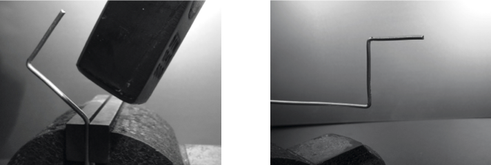

Figure AC 4: Bend the wire into a “Z” shape.

 

We will now twist the ‘Z’ portion of the wire to make a coil with a
diameter of 1 cm. To do this, we will use the pipe or the drill bit and
curve the wire around it, with the help of the vice and of the pliers.

 

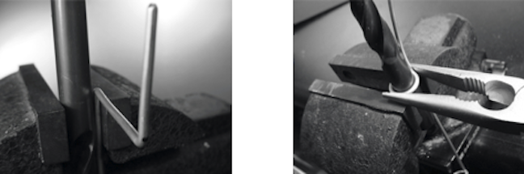

Figure AC 5: Bend the wire around the drill bit to make a coil.

 

The coil will look like this:

 

Figure AC 6: The completed coil.

 

You should make a second coil at a distance of 7.8 cm from the first
one. Both coils should have the same turning direction and should be
placed on the same side of the wire.

Make a third and a fourth coil following the same procedure, at the same
distance of 7.8 cm one from each other.

 

Trim the last phased element at a distance of 8.0 cm from the fourth
coil.

 

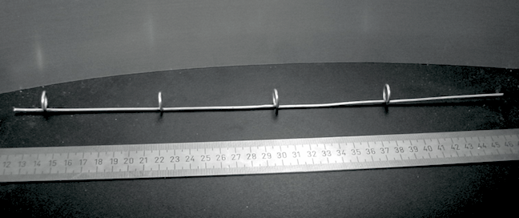

Figure AC 7: Try to keep it as straight possible.

 

If the coils have been made correctly, it should now be possible to
insert a pipe through all the coils as shown.

 

Figure AC 8: Inserting a pipe can help to straighten the wire.

 

With a marker and a ruler, draw the diagonals on the metallic plate,
finding its centre.

With a small diameter drill bit, make a pilot hole at the centre of the
plate. Increase the diameter of the hole using bits with an increasing
diameter.

 

 

Figure AC 9: Drilling the hole in the metal plate.

 

The hole should fit the N connector exactly. Use a file if needed.

 

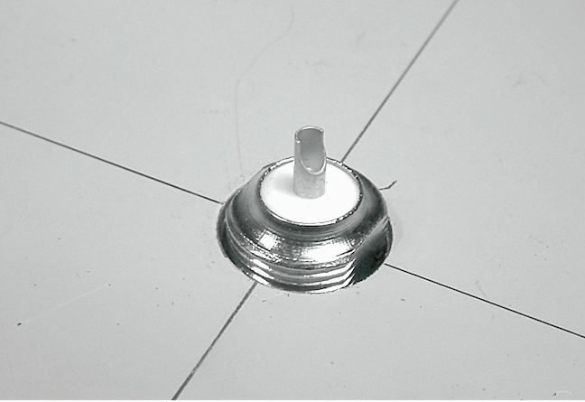

Figure AC 10: The N connector should fit snugly in the hole.

 

To have an antenna impedance of 50 Ohms, it is important that the
visible surface of the internal insulator of the connector (the white
area around the central pin) is at the same level as the surface of the
plate.

 

For this reason, cut 0.5 cm of copper pipe with an external diameter of
2 cm, and place it between the connector and the plate.

 

Figure AC 11: Adding a copper pipe spacer helps to match the impedance
of the antenna to 50 Ohms.

 

Screw the nut to the connector to fix it firmly on the plate using the
spanner.

 

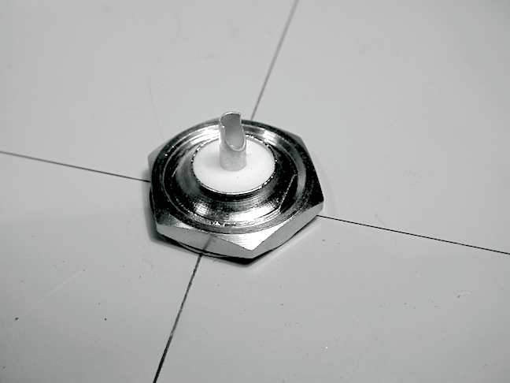

 

Figure AC 12: Secure the N connector tightly to the plate.

 

Smooth with the file the side of the wire which is 2.5 cm long, from the
first coil. Tin the wire for around 0.5 cm at the smoothed end helping
yourself with the vice.

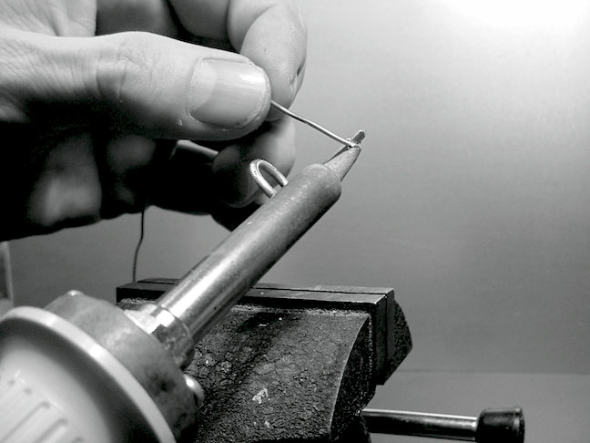

 

Figure AC 13: Add a little solder to the end of the wire to “tin” it
prior to soldering.

 

With the soldering iron, tin the central pin of the connector. Keeping
the wire vertical with the pliers, solder its tinned side in the hole of
the central pin. The first coil should be at 3.0 cm from the plate.

 

Figure AC 14: The first coil should start 3.0 cm from the surface of the
plate.

 

We are now going to stretch the coils extending the total vertical
length of the wire. Using the vice and the pliers, you should pull the
cable so that the final length of the coil is of 2.0 cm.

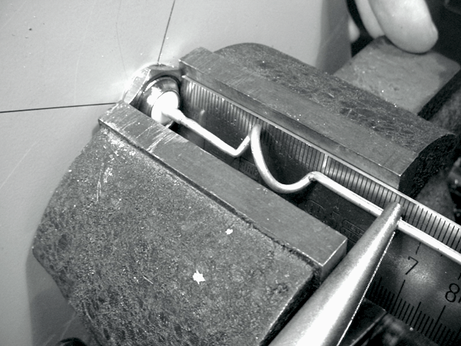

 

Figure AC 15: Stretching the coils. Be very gentle and try not to scrape
the surface of the wire with the pliers.

 

Repeat the same procedure for the other three coils, stretching their
length to 2.0 cm.

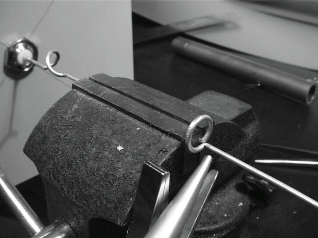

Figure AC 16: Repeat the stretching procedure for all of the remaining
coils.

 

 

At the end the antenna should measure 42.5 cm from the plate to the top.

 

 

 

Figure AC 17: The finished antenna should be 42.5 cm from the plate to
the end of the wire.

 

If you have a spectrum analyzer with a tracking generator and a
directional coupler, you can check the curve of the reflected power of
the antenna.

 

The following picture shows the display of the spectrum analyzer.

 

Figure AC 18: A spectrum plot of the reflected power of the collinear
omni.

 

If you intend to use this antenna outside, you will need to weatherproof
it. The simplest method is to enclose the whole thing in a large piece
of PVC pipe closed with caps. Cut a hole at the bottom for the
transmission line, and seal the antenna shut with silicone or PVC glue.

### Cantenna

The waveguide antenna, sometimes called a Cantenna, uses a tin can as a
waveguide and a short wire soldered on an N connector as a probe for
coaxial-cable-to-waveguide transition. It can be easily built at just
the price of the connector, recycling a food, juice, or other tin can.
It is a directional antenna, useful for short to medium distance
point-to-point links. It may be also used as a feeder for a parabolic
dish or grid.

 

Not all cans are good for building an antenna because there are
dimensional constraints.

 

​1. The acceptable values for the diameter D of the feed are between
0.60 and 0.75 wavelength in air at the design frequency. At 2.44 GHz the
wavelength λ is 12.2 cm, so the can diameter should be in the range of
7.3 - 10 cm.

 

​2. The length L of the can preferably should be at least 0.75 λG ,
where λG is the guide wavelength and is given by:

 

λG = λ/(sqrt(1 - (λ / 1.706D)2))

 

For D = 7.3 cm, we need a can of at least 56.4 cm, while for D = 9.2 cm
we need a can of at least 14.8 cm. Generally the smaller the diameter,
the longer the can should be. For our example, we will use oil cans that
have a diameter of 8.3 cm and a height of about 21 cm.

​3. The probe for coaxial cable to waveguide transition should be
positioned at a distance S from the bottom of the can, given by:

 

S = 0.25 λG

 

Its length should be 0.25 λ, which at 2.44 GHz corresponds to 3.05 cm.

 

 

Figure AC 19: Dimensional constraints on the cantenna

 

The gain for this antenna will be in the order of 10 to 14 dBi, with a
beamwidth of around 60 degrees.

 

Figure AC 20: The finished cantenna.

#### Parts list

-   •one screw-on N-type female connector 

-   •4 cm of copper or brass wire of 2 mm of diameter  

-   •an oil can of 8.3 cm of diameter and 21 cm of height 

     

 

Figure AC 21: Parts needed for the cantenna.

#### Tools required

-   •Can opener  

-   •Ruler  

-   •Pliers 

-   •File 

-   •Soldering iron  

-   •Solder 

-   •Drill with a set of bits for metal (with a 1.5 cm diameter bit)  

-   •Vice or clamp 

-   •Spanner or monkey wrench  

-   •Hammer 

-   •Punch 

#### Construction

With the can opener, carefully remove the upper part of the can.

 

 

Figure AC 22: Be careful of sharp edges when opening the can.

 

The circular disk has a very sharp edge. Be careful when handling it!

Empty the can and wash it with soap. If the can contained pineapple,
cookies, or some other tasty treat, have a friend serve the food.

 

With the ruler, measure 6.2 cm from the bottom of the can and draw a
point. Be careful to measure from the inner side of the bottom. Use a
punch (or a small drill bit or a Phillips screwdriver) and a hammer to
mark the point. This makes it easier to precisely drill the hole. Be
careful not to change the shape of the can doing this by inserting a
small block of wood or other object in the can before tapping it.

 

 

With a small diameter drill bit, make a hole at the centre of the plate.
Increase the diameter of the hole using bits with an increasing
diameter. The hole should fit exactly the N connector.

Use the file to smooth the border of the hole and to remove the painting
around it in order to ensure a better electrical contact with the
connector.

 

 

Figure AC 24: Carefully drill a pilot hole, then use a larger bit to
finish the job.

 

Smooth with the file one end of the wire. Tin the wire for around 0.5 cm

at the same end helping yourself with the vice.

 

Figure AC 25: Tin the end of the wire before soldering.

 

With the soldering iron, tin the central pin of the connector.

Keeping the wire vertical with the pliers, solder its tinned side in the
hole of the central pin.

 

 

Figure AC 26: Solder the wire to the gold cup on the N connector.

 

Insert a washer and gently screw the nut onto the connector.

Trim the wire at 3.05 cm measured from the bottom part of the nut.

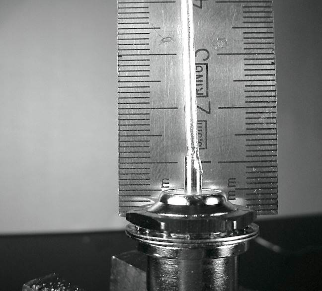

 

Figure AC 27: The length of the wire is critical.

 

Unscrew the nut from the connector, leaving the washer in place.

Insert the connector into the hole of the can.

Screw the nut on the connector from inside the can.

 

 

Use the pliers or the monkey wrench to screw firmly the nut on the
connector. You are done!

 

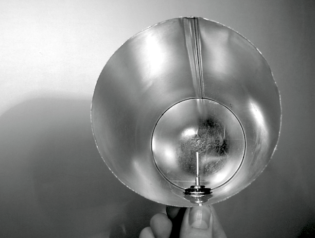

 

Figure AC 29: Your finished cantenna.

 

As with the other antenna designs, you should make a weatherproof
enclosure for the antenna if you wish to use it outdoors. PVC works well
for the can antenna. Insert the entire can in a large PVC tube, and seal
the ends with caps and glue.

You will need to drill a hole in the side of the tube to accommodate the
N connector on the side of the can.

### Cantenna as dish feed

As with the USB dongle parabolic, you can use the cantenna design as a
feeder for a parabolic reflector thus attaining a significantly higher
gain. Mount the can on the parabolic with the opening of the can pointed
at the centre of the dish. Use the technique described in the USB dongle
antenna example (watching signal strength changes over time) to find the
optimum location of the can for the dish you are using.

By using a well-built cantenna with a properly tuned parabolic, you can
achieve an overall antenna gain of 30dBi or more. As the size of the
parabolic increases, so does the potential gain and directivity of the
antenna. With very large parabolas, you can achieve significantly higher
gain.

### NEC2

NEC2 stands for Numerical Electromagnetics Code (version 2) and is a
free antenna modeling package. NEC2 lets you build an antenna model in
3D, and then analyses the antenna’s electromagnetic response. It was
developed more than ten years ago and has been compiled to run on many
different computer systems. NEC2 is particularly effective for analysing
wire-grid models, but also has some surface patch modeling capability.

The antenna design is described in a text file, and then the model is
built using this text description. An antenna described in NEC2 is given
in two parts: its structure and a sequence of controls.

The structure is simply a numerical description of where the different
parts of the antenna are located, and how the wires are connected up.
The controls tell NEC where the RF source is connected.

Once these are defined, the transmitting antenna is then modelled.
Because of the reciprocity theorem the transmitting gain pattern is the
same as the receiving one, so modelling the transmission characteristics
is sufficient to understand the antenna's behaviour completely.

A frequency or range of frequencies of the RF signal must be specified.
The next important element is the character of the ground. The
conductivity of the earth varies from place to place, but in many cases
it plays a vital role in determining the antenna gain pattern.

To run NEC2 on Linux, install the NEC2 package from the URL below. To
launch it, type nec2 and enter the input and output filenames. It is
also worth installing the xnecview package for structure verification
and radiation pattern plotting. If all went well you should have a file
containing the output. This can be broken up into various sections, but
for a quick idea of what it represents a gain pattern can be plotted
using xnecview. You should see the expected pattern, horizontally
omnidirectional, with a peak at the optimum angle of takeoff. Windows
and Mac versions are also available.

 

The advantage of NEC2 is that we can get an idea of how the antenna
works before building it, and how we can modify the design in order to
get the maximum gain. It is a complex tool and requires some research to
learn how to use it effectively, but it is an invaluable tool for
antenna designers.

NEC2 is available from [http://www.nec2.org/](http://www.nec2.org/)

APPENDIX B: CHANNEL ALLOCATIONS
-------------------------------

The following tables list the channel numbers and centre frequencies
used for 802.11a and 802.11b/g.

Note that while all of these frequencies are in the unlicensed ISM and
 U-NII bands, not all channels are available in all countries. Many
regions impose restrictions on output power and indoor / outdoor use on
some channels.

These regulations are rapidly changing, so always check your local
regulations before transmitting. Note that these tables show the center
frequency for each channel. Channels are 22MHz wide in 802.11b/g, and
20MHz wide in 802.11a.

802.11b / g

Channel \#

Center Frequency (GHz)

Channel \#

Center Frequency (GHz)

1

2.412

8

2.447

2

2.417

9

2.452

3

2.422

10

2.457

4

2.427

11

2.462

5

2.432

12

2.467

6

2.437

13

2.472

7

2.442

14

2.484

802.11a

Channel

Center Frequency (GHz)

34

5.170

36

5.180

38

5.190

40

5.200

42

5.210

44

5.220

46

5.230

48

5.240

52

5.260

56

5.280

60

5.300

64

5.320

149

5.745

153

5.765

157

5.785

161

5805

 

APPENDIX C: PATH LOSS
---------------------

 

 

 

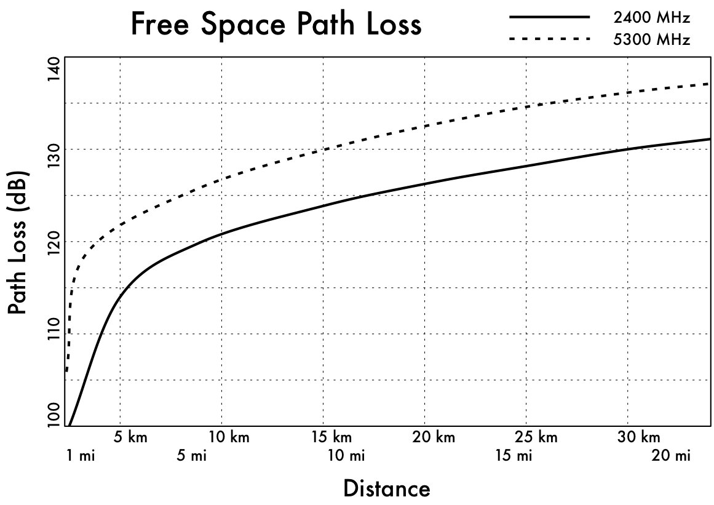

 

APPENDIX D: CABLE SIZES
-----------------------

 

Wire gauge, diameter, current capacity, and resistance at 20°C. These
values can vary from cable to cable. When in doubt, consult the
manufacturer's specifications.

 

AWG Gauge

Diameter (mm)

Ohms / Meter

Max Amperes

0000

11.68

0.000161

302

000

10.40.00

0.000203

239

00

9.27

0.000256

190

0

8.25

0.000322

150

1

7.35

0.000406

119

2

6.54

0.000513

94

3

5.83

0.000646

75

4

5.19

0.000815

60

5

4.62

0.001028

47

6

4.11

0.001296

37

7

3.67

0.001634

30

8

3.26

0.002060

24

9

2.91

0.002598

19

10

2.59

0.003276

15

APPENDIX E: SOLAR DIMENSIONING
------------------------------

Use these tables to collect the necessary data to estimate the required
size of your solar energy system.

General Data

Site Name

 

Site Latitude (°)

 

Irradiation Data

Gdm(0), in kWh / m2 per day)

Jan

Feb

Mar

Apr

May

Jun

Jul

Aug

Sep

Oct

Nov

Dec

 

 

 

 

 

 

 

 

 

 

 

 

Worst Irradiation Month

 

Reliability and System Operational Voltage

Days of Autonomy (N)

 

Nominal Voltage (VNEquip)

 

Component Characteristics

Solar Panels

Voltage @ Maximum Power (Vpmax)

 

Current @ Maximum Power (Ipmax)

 

Panel Type/Model and Power (Wp)

 

Batteries

Nominal Capacity @ 100 H (CNBat)

 

Nominal Voltage (VNBat)

 

Maximum Depth of Discharge (DoDMAX)

or Usable Capacity (CUBat)

 

Regulator

Nominal Voltage (VNReg)

 

Maximum Current (ImaxReg)

 

DC/AC Inverter (if needed)

Nominal Voltage (VNConv)

 

Instantaneous Power (PIConv)

 

Performance @ 70% Load

 

Loads

Estimated Energy Consumed by the Loads (DC)

Month of Greatest Consumption

 

Description

\# of Units

x Nominal Power

x Usage

Hours / Day

= Energy

(Wh/day)

 

 

 

 

 

 

 

 

 

 

 

 

 

 

 

 

 

 

 

 

ETOTAL DC

 

Estimated Energy Consumed by the Loads (AC)

Month of Greatest Consumption

 

Description

\# of Units

x Nominal Power

x Usage

Hours / Day

= Energy

(Wh/day)

 

 

 

 

 

 

 

 

 

 

 

 

 

 

 

 

 

 

 

 

ETOTAL AC (before converter)

 

ETOTAL AC (after converter) = ETOTAL AC / 70%

 

### Finding the Worst Month

Site Name

 

Site Latitude (°)

 

Nominal Voltage of the Installation VN

 

(Month)

J

F

M

A

M

J

J

A

S

O

N

D

Inclination ß

 

 

 

 

 

 

 

 

 

 

 

 

Gdm (ß) (kWh/m2 × day)

 

 

 

 

 

 

 

 

 

 

 

 

ETOTAL (DC) (Wh/day)

 

 

 

 

 

 

 

 

 

 

 

 

ETOTAL (AC) (Wh/day)

 

 

 

 

 

 

 

 

 

 

 

 

ETOTAL (AC + DC)=

 

 

 

 

 

 

 

 

 

 

 

 

Im (A) = ETOTAL (Wh/day) × 1kW/m2/ (Gdm(ß) x VN)

 

 

 

 

 

 

 

 

 

 

 

 

Worst Month Summary

Worst Month

 

Im (A)

 

ImMAX (A) = 1.21 x Im

 

ETOTAL (AC + DC)

 

### Final Calculations

Panels

Panels in Series (NPS)

NPS = VN / VPmax =

 

Panels in Parallel (NPP)

NPP = ImMAX / IPmax =

 

Total Number of Panels

NTOT = NPS x NPP =

 

Batteries

Necessary Capacity (CNEC)

ETOTAL(WORST MONTH) / VN x N

 

Nominal Capacity (CNOM)

CNEC / DoDMAX

 

Number of Batteries in Series (NBS)

VN / VNBAT

 

Cables

 

Panels \> Batteries

Batteries \> Converter

Main Line

Voltage Drop (Va - Vb)

 

 

 

Thickness (Section)

r x L x ImMAX / (Va - Vb)

 

 

 

For cable thickness computation, r = 0.01286 Ω mm2/m (for copper) and L
is the length in metres.

APPENDIX F: RESOURCES
---------------------

 

We recommend these resources for learning more about the various aspects
of wireless networking.

#### Antennas And Antenna Design

Free antenna designs,
[http://www.freeantennas.com/](http://www.freeantennas.com/)

Hyperlink Tech, [http://hyperlinktech.com/](http://hyperlinktech.com/)

Pasadena Networks LLC,
[http://www.wlanparts.com/](http://www.wlanparts.com/)

SuperPass, [http://www.superpass.com/](http://www.superpass.com/)

Unofficial NEC2 code archives,
[http://www.nec2.org/](http://www.nec2.org/)

USB WiFi dish designs,
[http://www.usbwifi.orcon.net.nz/](http://www.usbwifi.orcon.net.nz/)

#### Network Troubleshooting Tools

Bing throughput measurement
tool,[http://fgouget.free.fr/bing/inde](http://fgouget.free.fr/bing/index-en.shtml)x-en.shtml

Cacti network monitoring package,
[http://www.cacti.net/](http://www.cacti.net/)

DSL Reports bandwidth speed tests,
[http://www.dslreports.com/stest](http://www.dslreports.com/stest)
EtherApe network traffic monitor,
[http://etherape.sourceforge.net/](http://etherape.sourceforge.net/)

Flowc open source NetFlow collector,
[http://netacad.kiev.ua/flowc/](http://netacad.kiev.ua/flowc/)

iptraf network diagnostic tool,
[http://iptraf.seul.org/](http://iptraf.seul.org/)

My TraceRoute network diagnostic tool,
[http://www.bitwizard.nl/mtr/](http://www.bitwizard.nl/mtr/)

Nagios network monitoring and event notification tool,

[http://www.nagios.org/](http://www.nagios.org/)

NetFlow, the Cisco protocol for collecting IP traffic information,
[http://en.wikipedia.org/wiki/Netflow](http://en.wikipedia.org/wiki/Netflow)

ngrep network security utility for finding patterns in data flows,
[http://ngrep.sourceforge.net/](http://ngrep.sourceforge.net/)

Network monitoring implementation guides and tutorials,
[http://wiki.debian.org/Network\_Monitoring](http://wiki.debian.org/Network_Monitoring)

Ntop network monitoring tool,
[http://www.ntop.org/](http://www.ntop.org/)

SoftPerfect network analysis tools,
[http://www.softperfect.com/](http://www.softperfect.com/)

Squid transparent http proxy HOWTO,
[http://tldp.org/HOWTO/TransparentProxy.html](http://tldp.org/HOWTO/TransparentProxy.html)

Wireshark network protocol analyzer,
[http://www.wireshark.org/](http://www.wireshark.org/)

MRTG, [http://oss.oetiker.ch/mrtg/](http://oss.oetiker.ch/mrtg/)

rrdtool,
[http://oss.oetiker.ch/rrdtool/](http://oss.oetiker.ch/rrdtool/)

Smokeping,
[http://oss.oetiker.ch/smokeping/](http://oss.oetiker.ch/smokeping/)

Argus, [http://qosient.com/argus/](http://qosient.com/argus/)

Netramet,
[http://www.caida.org/tools/measurement/netramet/](http://www.caida.org/tools/measurement/netramet/)

Snort, [http://www.snort.org/](http://www.snort.org/)

Mod Security, [http://www.modsecurity.org/](http://www.modsecurity.org/)

Apache, [http://www.apache.org/](http://www.apache.org/)

Zabbix, [http://www.zabbix.org/](http://www.zabbix.org/)

ngrep, [http://ngrep.sourceforge.net/](http://ngrep.sourceforge.net/)

nmap, [http://www.nmap.org](http://www.nmap.org/)

netcat, [http://nc110.sourceforge.net/](http://nc110.sourceforge.net/)

#### Security

AntiProxy http proxy circumvention tools and information,
[http://www.antiproxy.com/](http://www.antiproxy.com/)

Anti-spyware tools,
[http://www.spychecker.com/](http://www.spychecker.com/)

Driftnet network monitoring utility,
[http://www.ex](http://www.ex-parrot.com/%7Echris/driftnet/)[parrot.com/\~chris/driftnet/](http://www.ex-parrot.com/%7Echris/driftnet/)

Introduction to OpenVPN,
[http://www.linuxjournal.com/article/7949](http://www.linuxjournal.com/article/7949)

Linux security and admin software,
[http://www.linux.org/apps/all/Networking/Security\_/\_Admin.html](http://www.linux.org/apps/all/Networking/Security_/_Admin.html)

OpenSSH secure shell and tunneling tool,
[http://openssh.org/](http://openssh.org/)

OpenVPN encrypted tunnel setup guide,
[http://openvpn.net/howto.html](http://openvpn.net/howto.html) Privoxy
filtering web proxy, [http://www.privoxy.org/](http://www.privoxy.org/)

PuTTY SSH client for Windows,
[http://www.putty.nl/](http://www.putty.nl/)

Sawmill log analyzer, [http://www.sawmill.net/](http://www.sawmill.net/)

Security of the WEP algorithm,
http://www.isaac.cs.berkeley.edu/isaac/wep-faq.html

Stunnel Universal SSL Wrapper,
[http://www.stunnel.org/](http://www.stunnel.org/)

TOR onion router,
[http://www.torproject.org/](http://www.torproject.org/)

Weaknesses in the Key Scheduling Algorithm of RC4,
[http://www.crypto.com/papers/others/rc4\_ksaproc.ps](http://www.crypto.com/papers/others/rc4_ksaproc.ps)

Windows SCP client, [http://winscp.net/](http://winscp.net/)

Your 802.11 Wireless Network has No Clothes,
[http://www.cs.umd.edu/\~waa/wireless.pdf](http://www.cs.umd.edu/%7Ewaa/wireless.pdf)

ZoneAlarm personal firewall for Windows,
[http://www.zonelabs.com/](http://www.zonelabs.com/)

Logging, [http://wigle.net](http://wigle.net/)/,
[http://www.nodedb.com](http://www.nodedb.com/)/,

or [http://www.stumbler.net](http://www.stumbler.net/)/.
[http://www.isaac.cs.berkeley.edu/isaac/we](http://www.isaac.cs.berkeley.edu/isaac/wep-faq.html)p-[faq.html](http://www.isaac.cs.berkeley.edu/isaac/wep-faq.html)
[http://www.cs.umd.edu/\~waa/wireless.pdf](http://www.cs.umd.edu/%7Ewaa/wireless.pdf)

[http://dl.aircrack](http://dl.aircrack-ng.org/breakingwepandwpa.pdf)-[ng.org/breakingwepandwpa.pdf](http://dl.aircrack-ng.org/breakingwepandwpa.pdf)

[http://download.aircrac](http://download.aircrack-ng.org/wiki-files/doc/enhanced_tkip_michael.pdf)k[ng.org/wiki](http://download.aircrack-ng.org/wiki-files/doc/enhanced_tkip_michael.pdf)[files/doc/enhanced\_tkip\_michael.pdf](http://download.aircrack-ng.org/wiki-files/doc/enhanced_tkip_michael.pdf)

Captive Portals, CoovaChilli, CoovaAP
([http://coova.org/CoovaChilli](http://coova.org/CoovaChilli/)/) WiFidog
([http://www.wifidog.org](http://www.wifidog.org/)/)

M0n0wall, pfSense ([http://m0n0.ch/wall](http://m0n0.ch/wall/)/)

Putty, [http://www.putty.nl/](http://www.putty.nl/)

Win SCP, [http://winscp.net/](http://winscp.net/)

Cygwin, [http://www.cygwin.com/](http://www.cygwin.com/)

OpenVPN Journal,
[http://www.linuxjournal.com/article/7949](http://www.linuxjournal.com/article/7949)

Tor, [http://www.torproject.org/](http://www.torproject.org/)

Spychecker, [http://www.spychecker.com/](http://www.spychecker.com/)

#### Bandwidth Optimisation

Cache hierarchies with Squid,

http://squid-docs.sourceforge.net/latest/html/c2075.html

dnsmasq caching DNS and DHCP server,
[http://www.thekelleys.org.uk/dnsmasq/doc.html](http://www.thekelleys.org.uk/dnsmasq/doc.html)

Enhancing International World Wide Web Access in Mozambique Through the
Use of Mirroring and Caching Proxies,
[http://www.isoc.org/inet97/ans97/cloet.htm](http://www.isoc.org/inet97/ans97/cloet.htm)

Fluff file distribution utility,
[http://www.bristol.ac.uk/fluff/](http://www.bristol.ac.uk/fluff/)

Linux Advanced Routing and Traffic Control HOWTO,
[http://lartc.org/](http://lartc.org/)

Microsoft Internet Security and Acceleration Server,
[http://www.microsoft.com/isaserver/](http://www.microsoft.com/isaserver/)

Microsoft ISA Server Firewall and Cache resource site,
[http://www.isaserver.org/](http://www.isaserver.org/)

Optimising Internet Bandwidth in Developing Country Higher Education,
[http://www.inasp.info/pubs/bandwidth/index.html](http://www.inasp.info/pubs/bandwidth/index.html)

Planet Malaysia blog on bandwidth management,
[http://planetmy.com/blog](http://planetmy.com/blog/?p=148)/?[p=148](http://planetmy.com/blog/?p=148)

RFC 3135: Performance Enhancing Proxies Intended to Mitigate
Link-Related Degradations,
[http://www.ietf.org/rfc/rfc3135](http://www.ietf.org/rfc/rfc3135)

Squid web proxy cache, http://squid-cache.org/

#### Mesh Networking

Freifunk OLSR mesh firmware for the Linksys WRT54G,
[http://www.freifunk.net/wiki/FreifunkFirmware](http://www.freifunk.net/wiki/FreifunkFirmware)

MIT Roofnet Project,
[http://pdos.csail.mit.edu/roofnet/doku.php](http://pdos.csail.mit.edu/roofnet/doku.php)

OLSR mesh networking daemon,
[http://www.olsr.org/](http://www.olsr.org/)

AirJaldi Mesh Router,
[http://drupal.airjaldi.com/node/9](http://drupal.airjaldi.com/node/9)

Open WRT,
[http://wiki.openwrt.org/toh/start](http://wiki.openwrt.org/toh/start)

Village Telco,
[www.villagetelco.org](http://objavi.booki.cc/tmp/wirelessnetworkinginthedevelopingworld-en-2013.02.13-23.20.02.odtQlyYWy/appendix-e/www.villagetelco.org)

#### Wireless Operating Systems And Drivers

DD-WRT wireless router OS,http://www.dd-wrt.com/

HostAP wireless driver for the Prism 2.5 chipset,
[http://hostap.epitest.fi/](http://hostap.epitest.fi/)

m0n0wall wireless router OS,
[http://m0n0.ch/wall/](http://m0n0.ch/wall/)

MadWiFi wireless driver for the Atheros chipset,
[http://madwifi.org/](http://madwifi.org/) Metrix Pyramid wireless
router OS,
[http://code.google.com/p/pyramidlinux/](http://code.google.com/p/pyramidlinux/)

OpenWRT wireless router OS for Linksys access points,
[http://openwrt.org/](http://openwrt.org/)

Tomato wireless router OS for Linksys access points,
[http://www.polarcloud.com/tomato](http://www.polarcloud.com/tomato)

#### Wireless Tools

Chillispot captive portal,
[http://www.chillispot.info/](http://www.chillispot.info/)

Interactive Wireless Network Design Analysis Utilities,
[http://www.qsl.net/n9zia/wireless/page09.ht](http://www.qsl.net/n9zia/wireless/page09.htm)ml

KisMAC wireless monitor for Mac OS X, http://kismac-ng.org/

Kismet wireless network monitoring tool,
[http://www.kismetwireless.net/](http://www.kismetwireless.net/)

MacStumbler wireless network detection tool for Mac OS X,
[http://www.macstumbler.com/](http://www.macstumbler.com/)

NetStumbler wireless network detection tool for Windows,
[http://www.wirelessdefence.org/Contents/NetstumblerMain.htm](http://www.wirelessdefence.org/Contents/NetstumblerMain.htm)

Netspot wireless network detection for Mac OS X,
[http://www.netspotapp.com/](http://www.netspotapp.com/)

PHPMyPrePaid prepaid ticketing system,
[http://sourceforge.net/projects/phpmyprepaid/](http://sourceforge.net/projects/phpmyprepaid/)

RadioMobile radio performance modeling tool,

[http://www.cplus.org/rmw/](http://www.cplus.org/rmw/)

Radio Mobile online,
[http://www.cplus.org/rmw/rmonline.html](http://www.cplus.org/rmw/rmonline.html)

Wellenreiter wireless network detection tool for Linux,
[http://sourceforge.net/projects/wellenreiter/](http://sourceforge.net/projects/wellenreiter/)

WiFiDog captive portal,
[http://www.wifidog.org/](http://www.wifidog.org/)

Proxim,
[http://www.proxim.com/technology](http://www.proxim.com/technology)

WiSpy spectrum analysis tool,
[http://www.metageek.net/](http://www.metageek.net/)

Spectrum Analyser,
http://www.seeedstudio.com/depot/rf-explorer-model-wsub1g-p-922.html?cPath=174

"RF Explorer model 2.4G",

http://www.seeedstudio.com/depot/-p-924.htmlcPath=174

VideoSend.
[http://www.lightinthebox.com/Popular/Wifi\_Video\_Transmitter.html](http://www.lightinthebox.com/Popular/Wifi_Video_Transmitter.html)

#### General Wireless Related Information

Homebrew wireless hardware designs,
[http://www.w1ghz.org/](http://www.w1ghz.org/)

Linksys wireless access point information,
[http://linksysinfo.org/](http://linksysinfo.org/)

Linksys WRT54G resource guide,
[http://seattlewireless.net/index.cgi/LinksysWrt54g](http://seattlewireless.net/index.cgi/LinksysWrt54g)

Ronja optical data link hardware,
[http://ronja.twibright.com/](http://ronja.twibright.com/)

SeattleWireless community wireless group,
[http://seattlewireless.net/](http://seattlewireless.net/)

SeattleWireless Hardware comparison page,
[http://www.seattlewireless.net/HardwareComparison](http://www.seattlewireless.net/HardwareComparison)

Stephen Foskett's Power Over Ethernet (PoE) Calculator,
[http://www.gweep.net/\~sfoskett/tech/poecalc.html](http://www.gweep.net/%7Esfoskett/tech/poecalc.html)

White Spaces project,
[http://www.wirelesswhitespace.org/projects.aspx](http://www.wirelesswhitespace.org/projects.aspx)

#### General Computing Tools

File sharing, [http://sparkleshare.org](http://sparkleshare.org/),
[https://github.com/philcryer/lipsyn](https://github.com/philcryer/lipsync)c,
[http://rsync.samba.org/](http://rsync.samba.org/)

Open Relay testing,
[http://www.mailradar.com/openrelay](http://www.mailradar.com/openrelay/),
[http://www.checkor.com/](http://www.checkor.com/)

Disk imaging, [http://www.partimage.org](http://www.partimage.org/),
[http://www.powerquest.com/](http://www.powerquest.com/)

#### Networking Services And Training

Wireless Toolkit,
[http://wtkit.org/groups/wtkit/wiki/820cb/download\_page.html](http://wtkit.org/groups/wtkit/wiki/820cb/download_page.html)

wire.less.dk consultancy and services,
[http://wire.less.dk/](http://wire.less.dk/)

Wireless Lab and training at ICTP,
[http://wireless.ictp.it/](http://wireless.ictp.it/)

WirelessU, [http://wirelessu.org/](http://wirelessu.org/)

Network Startup Resource Center, Oregon,
[http://www.nsrc.org/](http://www.nsrc.org/)

Inveneo, [http://www.inveneo.org/](http://www.inveneo.org/)

6Deploy (EC FP7 project),
[http://www.6deploy.org](http://www.6deploy.org/)

Association for Progressive Communications wireless connectivity
projects, [http://www.apc.org/wireless/](http://www.apc.org/wireless/)

International Network for the Availability of Scientific Publications,
[http://www.inasp.info/](http://www.inasp.info/)

Makere University, Uganda, [http://mak.ac.ug/](http://mak.ac.ug/)

Access Kenya ISP,
[http://www.accesskenya.com/](http://www.accesskenya.com/)

Broadband Access Ltd. wireless broadband carrier,
[http://www.blue.co.ke/](http://www.blue.co.ke/)

Virtual IT outsourcing,
[http://www.virtualit.biz/](http://www.virtualit.biz/)

Collection of looking glasses,
[http://www.traceroute.org/](http://www.traceroute.org/)

#### Regional Internet Registrars

IANA, [http://www.iana.org/](http://www.iana.org/)

AfriNIC, [http://www.afrinic.net/](http://www.afrinic.net/)

APNIC, [http://www.apnic.net/](http://www.apnic.net/)

ARIN, [http://www.arin.net/](http://www.arin.net/)

LACNIC, [http://www.lacnic.net/](http://www.lacnic.net/)

RIPE NCC, [http://www.ripe.net/](http://www.ripe.net/)

#### IPv6 Transitioning

http://www.petri.co.il/ipv6-transition.htm

[http://www.6diss.org/tutorials/transitioning.pdf](http://www.6diss.org/tutorials/transitioning.pdf)

http://arstechnica.com/business/2013/01/ipv6-takes-one-step-forward-ipv4-two-steps-back-in-2012/

http://www.6deploy.eu/index.php?page=home

RIPE IPv6 transiton,
[http://www.ipv6actnow.org/](http://www.ipv6actnow.org/)

Test your IPv6,
[http://te](http://test-ipv6.org/)t-[ipv6.org](http://test-ipv6.org/)

IPv6 Deployment status, [http://6lab.cisco.com](http://6lab.cisco.com/)

#### Dynamic Routing Protocols

http://www.ciscopress.com/store/routing-tcp-ip-volume-i-ccie-professional-development-9781578700417?w\_ptgrevartcl=Dynamic%20Routing%20Protocols\_24090

[http://www.ciscopress.com/articles/article.as](http://www.ciscopress.com/articles/article.asp?p=24090&amp;seqNum=5)p?[p=24090&seqNum=5](http://www.ciscopress.com/articles/article.asp?p=24090&amp;seqNum=5)
[http://ptgmedia.pearsoncmg.com/images/9781587132063/samplechapter/](http://ptgmedia.pearsoncmg.com/images/9781587132063/samplechapter/1587132060_03.pdf)[1587132060\_03.pdf](http://ptgmedia.pearsoncmg.com/images/9781587132063/samplechapter/1587132060_03.pdf)

http://www.inetdaemon.com/tutorials/internet/ip/routing/dyamic\_vs\_static.shtml
https://learningnetwork.cisco.com/docs/DOC-7985

OSPF Design guide:
[http://www.cisco.com/warp/public/104/1.pdf](http://www.cisco.com/warp/public/104/1.pdf)

#### Solar Panel Design

Low resolution PSH maps/calculation tools,

[http://re.jrc.ec.europa.eu/pvgis/apps4/pvest.ph](http://re.jrc.ec.europa.eu/pvgis/apps4/pvest.php)p?map=africa&lang=en

Highlands And Islands project,

[http://www.wirelesswhitespace.org/projects/wind-fi-renewable-energy-basestation.aspx](http://www.wirelesswhitespace.org/projects/wind-fi-renewable-energy-basestation.aspx)

PVSYST, [http://www.pvsyst.com/](http://www.pvsyst.com/)

Solar Design,
[http://www.solardesign.co.uk/](http://www.solardesign.co.uk/)

#### Miscellaneous Links

Cygwin Linux-like environment for Windows,
[http://www.cygwin.com/](http://www.cygwin.com/) Graphviz network graph
visualization tool, [http://www.graphviz.org/](http://www.graphviz.org/)
ICTP bandwidth simulator,
[http://wireless.ictp.trieste.it/simulator/](http://wireless.ictp.trieste.it/simulator/)
ImageMagick image manipulation tools and libraries,
[http://www.imagemagick.org/](http://www.imagemagick.org/)

NodeDB war driving map database,
[http://www.nodedb.com/](http://www.nodedb.com/)

Partition Image disk utility for Linux,
[http://www.partimage.org/](http://www.partimage.org/)

RFC 1918: Address Allocation for Private Internets,
[http://www.ietf.org/rfc/rfc1918](http://www.ietf.org/rfc/rfc1918)

Rusty Russell's Linux Networking Concepts,

http://www.netfilter.org/documentation/HOWTO/networkig-concepts-HOWTO.html

Ubuntu Linux, [http://www.ubuntu.com/](http://www.ubuntu.com/)

VoIP-4D Primer,
[http://www.it46.se/voip4d/voip4d.php](http://www.it46.se/voip4d/voip4d.php)

wget web utility for Windows,
[http://users.ugent.be/\~bpuype/wget/](http://users.ugent.be/%7Ebpuype/wget/)

ISO Standard,
[http://standards.iso.org/ittf/PubliclyAvailableStandards](http://standards.iso.org/ittf/PubliclyAvailableStandards/)

 

 

 

 

 

 

 

 

 

 

 

 

#### Books

802.11 Networks: The Definitive Guide, 2nd Edition. Matthew Gast,
O’Reilly Media. ISBN \#0-596-10052-3

 

802.11 Wireless Network Site Surveying and Installation. Bruce
Alexander, Cisco Press. ISBN \#1-587-05164-8

 

The ARRL UHF/Microwave Experimenter’s Manual. American Radio Relay
League. ISBN \#0-87259-312-6

 

Building Wireless Community Networks, 2nd Edition. Rob Flickenger,
O’Reilly Media. ISBN \#0-596-00502-4

 

Deploying License-Free Wireless Wide-Area Networks. Jack Unger, Cisco
Press. ISBN \#1-587-05069-2

 

Wireless Hacks, 2nd Edition. Rob Flickenger and Roger Weeks, O’Reilly
Media. ISBN \#0-596-10144-9

 

IPv6 Security (Cisco Press Networking Technology). Scott Hogg, Eric
Vyncke, Cisco Press. ISBN \# 1587055945

 

LAN Switch Security: What Hackers Know About Your Switches. Eric Vyncke
and Christopher Paggen. ISBN \#1587052563

 

 Building the Mobile Internet. Mark Grayson, Kevin Shatzkamer, Klaas
Wierenga. ISBN \# 1587142430

 

7CASE STUDIES
=============

1.   

Case Studies - Introduction
---------------------------

 

No matter how much planning goes into building a link or node location,
you will inevitably have to jump in and actually install something. This
is the moment of truth that demonstrates just how accurate your
estimates and predictions prove to be.

 

It is a rare day when everything goes precisely as planned. Even after
you install your 1st, 10th, or 100th node, you will still find that
things do not always work out as you might have intended. This section
describes some of our more memorable and recent network projects.
Whether you are about to embark on your first wireless project or you
are an old hand at this, it is reassuring to remember that there is
always more to learn and even the experts who have contributed to this
book still learn from each field project they are involved in!

 

Below are a few last minute tips and thoughts before we embark on
telling you about our latest field adventures.

### Equipment enclosures

Cheap plastics are often easy to find, but they maybe made of poor
materials and are thin, thus mostly unsuitable for enclosing equipment.
PVC tubing is far more resilient and is made to be waterproof.

In West Africa, the most common PVC is found in plumbing, sized from
90mm to 220mm. Sometimes Access Points can fit into such tubing, and
with end-caps that are torched-on or glued, they can make very robust
waterproof enclosures.

They also have the added benefit of being aerodynamic and uninteresting
to passers-by. The resulting space left around the equipment assures
adequate air circulation.

Also, it is often best to leave an exhaust hole at the bottom of the PVC
enclosure, although in one instance ants decided to nest 25 metres above
ground inside the PVC holding the access point. A wire mesh cover made
from locally available screen material was used to secure the exhaust
hole from infestations.

### Antenna masts

Recovering used materials for use to build antenna masts is a good plan.
Local metal workers may already be familiar with how to make

television masts from scrap metal. A few quick adaptations and these
same masts can be re-purposed for wireless networks.

 

The typical mast is the 5 metre pole, comprised of a single 30mm
diameter pipe which is then planted into cement. It's best to construct
the mast in two parts, with a removable mast that fits into a base which
is slightly larger in diameter. Alternatively, the mast may be made with
arms that can be securely cemented into a wall.

 

This type of mast can be augmented by several metres with the use of guy
lines.

To steady the pole, plant three lines 120 degrees apart, forming an
angle of at least 33 degrees with the tower.

 

Details of how to earth the mast can be found in the chapter called
Hardware Selection and Configuration.

### Involve the local community

Community involvement is imperative in assuring the success and
sustainability of a project. Involving the community in a project can be
the greatest challenge, but if the community is not involved the
technology will not serve their needs, nor will it be accepted.
Moreover, a community might be afraid and could subvert an initiative.
Regardless of the complexity of the undertaking, a successful project
needs support and buy-in from those it will serve.

 

Take your time and be selective in finding the right people for your
project. No other decision will affect your project more than having
effective, trusted local people on your team.

 

In addition, take note of key players in an institution, or community.
Identify those people who are likely to be opponents and proponents of
your project. As early as possible, attempt to earn the support of the
potential proponents and to diffuse the opponents.

 

This is a difficult task and one that requires intimate knowledge of the
institution or community.

If the project does not have a local ally, the project must take time to
acquire this knowledge and trust from the community.

 

Do not try to introduce a technology to a community without
understanding which applications will serve the community.

 

When gathering information, verify the facts that you are given. Most
often, local partners who trust you will be very frank, honest, and
helpful.

 

When looking at payment methods for your new wireless service, pre-paid
services are ideal, as they do not require a legal contract. Commitment
is assured by the investment of funds before service is given.

 

Buy-in also requires that those involved invest in the project
themselves. A project should ask for reciprocal involvement from the
community.

 

Above all, the “no-go” option should always be evaluated. If a local
ally and community buy-in cannot be had, the project should consider
choosing a different community or beneficiary.

 

There must be a negotiation; equipment, money, and training cannot be
gifts. The community must be involved and they too must contribute.

### Now read on

In the next chapters of this section you will find some of our projects
described, which hopefully you will find useful to learn from.

 

We havent included Case Studies from earlier versions of this book
except for the one in Venezuela which was extremely instrumental in
establishing the viability of long distance outdoor point to point links
for rural connectivity.

One Case Study not included in this section but undertaken by Inveneo
who are working closely with the team involved in writing this book can
be found at the following URL. Led by Andris Bjornson who is Inveneo's
CTO, there is some very useful information in his writeup of the
project.

http://www.inveneo.org/90km-wireless-link-for-mfangano-island/

We hope you now enjoy reading each of the Case Studies following this
intro. You will see who was involved and of course their profile is
included in the Acknowledgements of this book.

 

All of the authors have been involved in field deployments and also
monitor our Facebook page which you can find here.

 

[https://www.facebook.com/groups/wirelessu](https://www.facebook.com/groups/wirelessu/?fref=ts)

 

So as you begin to plan your next deployment, please do post any
questions you have for the experts to respond to.

 

Case Study: Long Distance 802.11 in Venezuela
---------------------------------------------

 

### Introduction

Although this Case Study is several years old now, we have left it in
this version of the book as it still to this day is the longest ever
successful point to point outdoor 802.11 test. Here you will find the
pioneering work of those who are still authoring this book. And in fact
some of the preparation work involved in the setup of this test is still
relevant for those planning long distance outdoor links. Enjoy reading!

### Background

Thanks to a favourable topography, Venezuela already had some long range
WLAN links, like the 70 km long operated by Fundacite Mérida between
Pico Espejo and Canagua.

 

To test the limits of the WiFi technology, it is necessary to find a
path with an unobstructed line of sight and a clearance of at least 60%
of the first Fresnel zone.

 

While looking at the terrain in Venezuela, in search of a stretch with
high elevation at the ends and low ground in between, I first focused in
the Guayana region. Although plenty of high grounds are to be found, in
particular the famous "tepuys" (tall mesas with steep walls), there were
always obstacles in the middle ground. My attention shifted to the
Andes, whose steep slopes (rising abruptly from the plains) proved
adequate for the task. For several years, I have been travelling through
sparsely populated areas due to my passion for mountain biking. In the
back of my head, I kept a record of the suitability of different spots
for long distance communications.

Pico del Aguila is an outstanding place for long distance communication.
It has an altitude of 4100 m and is about a two hour drive from my home
town of Mérida. For the other end, I finally located the town of El
Baúl, in Cojedes State.

Using the free software Radio Mobile

(available at
[http://www.cplus.org/rmw/english1.html](http://www.cplus.org/rmw/english1.html))I
found that there was no obstruction of the first Fresnel zone, over a
280 km path between Pico del Aguila and El Baúl.

### Action Plan

Once satisfied with the existence of a suitable trajectory, we looked at
the equipment needed to achieve the goal.

We have been using Orinoco cards for a number of years.

Sporting an output power of 15 dBm and receive threshold of -84 dBm,
they are robust and trustworthy. The free space loss at 280 km is 149
dB. So, we would need 30 dBi antennas at both ends and even that would
leave very little margin for other losses.

 

On the other hand, the Linksys WRT54G wireless router runs Linux.

The Open Source community has written several firmware versions for it
that allow for complete customisation of every transmission parameter.

In particular, OpenWRT firmware allows for the adjustment of the
acknowledgment time of the MAC layer, as well as the output power.
Another firmware, DD-WRT, has a GUI interface and a very convenient site
survey utility.

 

Furthermore, the Linksys can be located closer to the antenna than a
laptop.

So, we decided to go with a pair of these boxes. One was configured as
an AP (access point) and the other as a client. The WRT54G can operate
at 100 mW output power with good linearity, and can even be pushed up to
200 mW.

But at this value, non linearity is very severe and spurious signals are
generated, which should be avoided.

Although this is consumer grade equipment and quite inexpensive, after
years of using it, we felt confident that it could serve our purpose.

Of course, we kept a spare set handy just in case.

 

By setting the output power to 100 mW (20 dBm), we could obtain a 5dB
advantage compared with the Orinoco card.

Therefore, we settled for a pair of WRT54Gs.

### Pico del Aguila Site Survey

On January 15, 2006, I went to Pico Águila to check out the site that
Radio Mobile had reported as suitable.

The azimuth towards El Baúl is 86°, but since the magnetic declination
is 8° 16’, our antenna should be pointed to a magnetic bearing of 94°.

 

Unfortunately, when I looked towards 94°, I found the line of sight
obstructed by an obstacle that had not been shown by the software, due
to the limited resolution of the digital elevation maps that are freely
available.

 

I rode my mountain bike for several hours examining the surrounding area
looking for a clear path towards the East. Several promising spots were
identified, and for each of them I took photos and recorded the
coordinates with a GPS for later processing with the Radio Mobile
software.

 

This led me to refine my path selection, resulting in the one depicted
in Figure CsLD 1 using Google Earth:

 

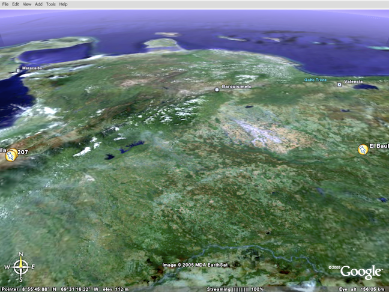

 

Figure CsLD 1: View of the 280 km link. Maracaibo’s Lake is to the West,
and the Peninsula of Paraguaná is to the North.

 

The radio profile obtained with Radio Mobile is shown in Figure CsLD 2:

 

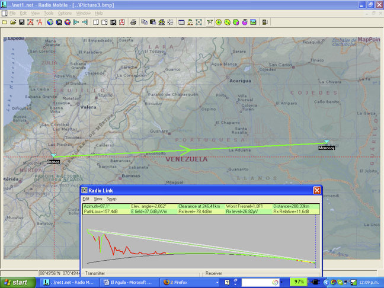

 

Figure CsLD 2: Map and profile of the proposed path between Pico Aguila,
and Morrocoy Hill, near the town of El Baúl.

 

The details of the wireless link are displayed in Figure CsLD 3:

 

 

Figure CsLD 3: Propagation details of the 280 km link.

In order to achieve a reasonable margin of some 12 dB for the link, we
needed antennas with at least 30 dBi gain at each end.

### Antennas

High gain antennas for the 2.4 GHz band were not available in Venezuela.

The import costs are considerable, so we decided instead to recycle
parabolic reflectors (formerly used for a satellite service) and replace
the feed with one designed for 2.4 GHz. We proved the concept with an 80
cm dish. The gain was way too low, so we tried an offset fed 2.4 m
reflector. This offered ample gain, albeit with some difficulties in the
aiming of the 3.5° beam. The 22.5° offset meant that the dish appeared
to be pointing downwards when it was horizontally aligned.

 

Several tests were performed using various cantennas and a 12 dBi Yagi
as a feed. We pointed the antenna at a base station of the university
wireless network that was located 11 km away on a 3500m mountain. The
test site sits at 2000m and therefore the elevation angle is 8°. Because
of the offset feed, we pointed the dish 14° downward, as can be seen in
the following picture:

 

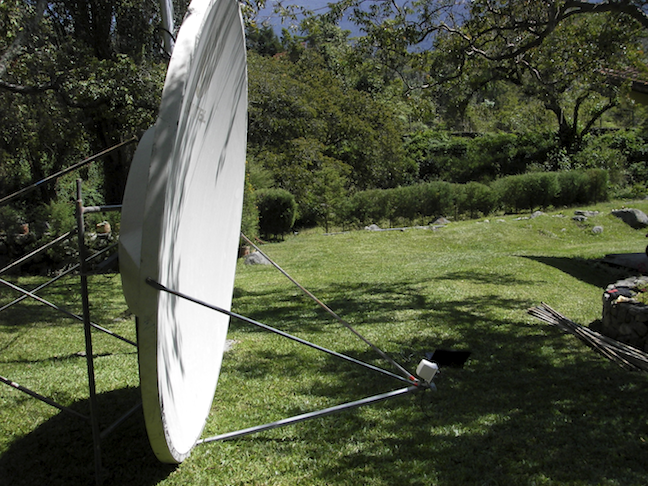

 

Figure CsLD 4: 2.4 m offset fed reflector with a 12 dBi antenna at its
focus, looking 14° down. The actual elevation is 8° up.

We were able to establish a link with the base station at Aguada, but
our efforts to measure the gain of the setup using Netstumbler were not
successful. There was too much fluctuation on the received power values
of live traffic.

For a meaningful measurement of the gain, we needed a signal generator
and a spectrum analyser. These instruments were also required for the
field trip in order to align the antennas properly.

 

While waiting for the required equipment, we looked for an antenna to be
used at the other end, and also a pointing system better suited to the
narrow radio beam of a high gain antenna.

In February 2006, I travelled to Trieste to participate in the annual
wireless training event that I have been attending since 1996. While
there, I mentioned the project to my colleague Carlo Fonda, who was
immediately thrilled and eager to participate.

 

The collaboration between the Latin American Networking School (EsLaRed)
and the Abdus Salam International Centre for Theoretical Physics (ICTP)
goes back to 1992, when the first Networking School was held in Mérida
with ICTP support.

Since then, members of both institutions have collaborated on several
activities. Some of these include an annual training school on wireless
networking (organized by ICTP) and another on computer networks
(organized by EsLaRed) that are hosted in several countries throughout
Latin America.

 

Accordingly, it was not difficult to persuade Professor Sandro
Radicella, the head of the Aeronomy and Radio Propagation Laboratory at
ICTP, to support Carlo Fonda’s trip in early April to Venezuela in order
to participate in the experiment.

Back at home, I found a 2.75 m parabolic central fed mesh antenna at a
neighbours house. Mr. Ismael Santos graciously lent his antenna for the
experiment.

 

Figure CsLD 5 shows the disassembly of the mesh reflector.

 

 

 

 

Figure CsLD 5: Carlo and Ermanno disassembling the satellite dish
supplied by Mr. Ismael Santos.

 

We exchanged the feed for a 2.4 GHz one, and aimed the antenna at a
signal generator that was located on top of a ladder some 30 m away.

With a spectrum analyser, we measured the maximum of the signal and
located the focus. We also pinpointed the boresight for both the central
fed and the offset antennas. This is shown in Figure CsLD 6:

 

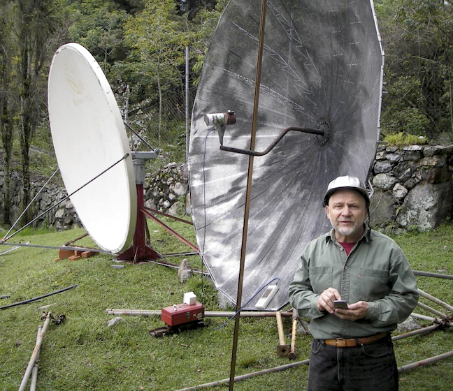

Figure CsLD 6: Finding the focus of the antennas with the 2.4 GHz feed

 

We also compared the power of the received signal with the output of a
commercial 24 dBi antenna. This showed a difference of 8 dB, which led
us to believe that the overall gain of our antenna was about 32 dBi. Of
course, there is some uncertainty about this value. We were receiving
reflected signals, but the value agreed with the calculation from the
antenna dimension.

### El Baùl Site Survey

Once we were satisfied with the proper functioning and aim of both
antennas, we decided to do a site survey at the other end of the El Baúl
link. Carlo Fonda, Gaya Fior and Ermanno Pietrosemoli reached the site
on April 8th. The following day, we found a hill (south of the town)
with two telecom towers from two cell phone operators and one belonging
to the Major of El Baúl. The hill of Morrocoy is some 75 m above the
surrounding area, about 155 m above sea level. It provides an
unobstructed view towards El Aguila. There is a dirt road to the top, a
must for our purpose, given the weight of the antenna.

#### Performing the experiment

On Wednesday April 12th, Javier Triviño and Ermanno Pietrosemoli
travelled towards Baúl with the offset antenna loaded on top of a four-
wheel drive truck. Early in the morning of April 13th, we installed the
antenna and pointed it at a compass bearing of 276°, given that the
declination is 8° and therefore the true Azimuth is 268°. At the same
time, the other team (composed by Carlo Fonda and Gaya Fior from ICTP,
with assistance of Franco Bellarosa, Lourdes Pietrosemoli and José
Triviño) rode to the previously surveyed area at Pico del Aguila in a
Bronco truck that carried the 2.7 m mesh antenna.

 

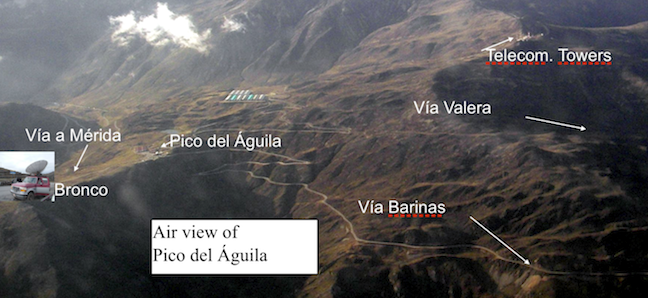

Figure CsLD 7: Pico del Águila and surrounds map with Bronco truck.

 

Poor weather is common at altitudes of 4100 m above sea level. The
Aguila team was able to install and point the mesh antenna before the
fog and sleet began. Figure CsLD 8 shows the antenna and the rope used
as an aid in aiming the 3° radio beam.Power for the signal generator was
supplied from the truck by means of a 12 V DC to 120 V AC inverter. At
11 A.M in El Baúl, we were able to observe a -82 dBm signal at the
agreed upon 2450 MHz frequency using the spectrum analyser. To be sure
we had found the proper source, we asked Carlo to switch off the signal.
Indeed, the trace on the spectrum analyser showed only noise. This
confirmed that we were really seeing the signal that originated some 280
km away. After turning the signal generator on again, we performed a
fine tuning in elevation and azimuth at both ends. Once we were
satisfied that we had attained the maximum received signal, Carlo
removed the signal generator and replaced it with a Linksys WRT54G
wireless router configured as an access point. Javier substituted the
spectrum analyser on our end for another WRT54G configured as a client.

 

Figure CsLD 8: Aiming the antenna at el Águila.

 

At once, we started receiving "beacons" but ping packets did not get
through. This was expected, since the propagation time of the radio wave
over a 300 km link is 1 ms. It takes at least 2 ms for an acknowledgment
to reach the transmitter. Fortunately, the OpenWRT firmware allows for
adjusting the ACK timing. After Carlo adjusted for the 3 orders of
magnitude increase in delay above what the standard WiFi link expects,
we began receiving packets with a delay of about 5 ms.

 

Figure CsLD 9: El Baúl antenna installation. Actual elevation was 1°
upward, since the antenna has an offset of 22.5°.

 

We proceeded to transfer several PDF files between Carlo’s and Javier’s
laptops. The results are shown in Figure CsLD 10.

 

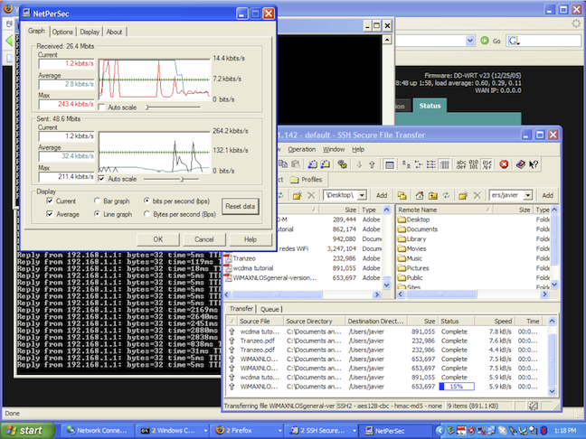

 

Figure CsLD 10: Screenshot of Javier’s laptop showing details of PDF
file transfer from Carlo’s laptop 280 km away, using two WRT54G wireless
routers, no amplifiers.

 

Note the ping time of a few milliseconds.

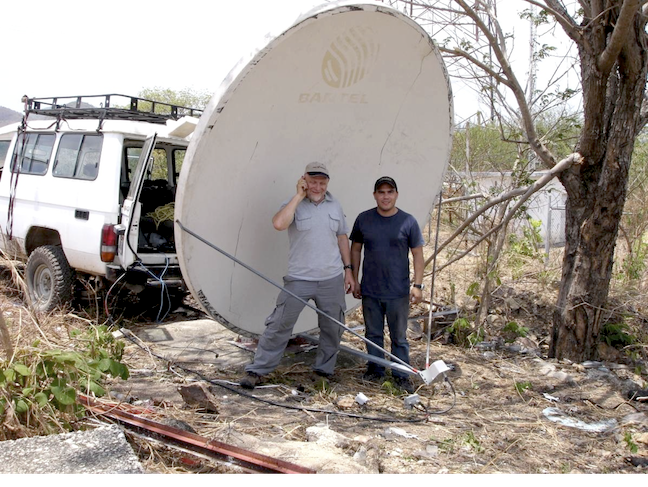

 

Figure CsLD 11: Javier Triviño (right) and Ermanno Pietrosemoli beaming
from the El Baúl antenna.

 

 

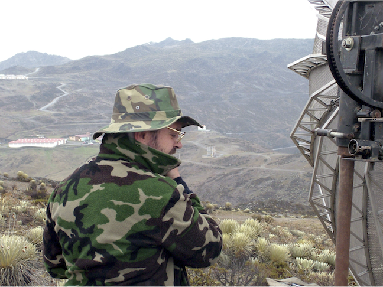

 

Figure CsLD 12: Carlo Fonda at the Aguila Site

### Mérida, Venezuela, 17 April 2006.

 

One year after performing the experiment just described, we found the
time and resources to repeat it.

We used commercial 30 dBi antennas, and also a couple of wireless
routers which had been modified by the TIER group led by Dr. Eric Brewer
of Berkeley University.

 

The purpose of the modification of the standard WiFi MAC is to make it
suitable for long distance applications by replacing the CSMA Media
Access Control with TDMA. The latter is better suited for long distance
point-to-point links since it does not require the reception of ACKs.

This eliminates the need to wait for the 2 ms round trip propagation
time on a 300 km path.

 

On April 28th, 2007, a team formed by Javier Triviño, José Torres and
Francisco Torres installed one of the antennas at El Aguila site. The
other team, formed by Leonardo González V., Leonardo González G.,
Alejandro González and Ermanno Pietrosemoli, installed the other antenna
at El Baúl.

 

A solid link was quickly established using the Linksys WRT54G routers.
This allowed for video transmission at a measured throughput of 65 kbps.
With the TDMA routers, the measured throughput was 3 Mbps in each
direction.

 

This produced the total of 6 Mbps as predicted by the simulations done
at Berkeley.

### Can we do better?

Thrilled by these results, which pave the way for really inexpensive
long distance broadband links, the second team moved to another location
previously identified at 382 km from El Aguila, in a place called
Platillón. Platillón is 1500 m above sea level and there is an
unobstructed first Fresnel zone towards El Aguila (located at 4200 m
above sea level).

 

 

 

The proposed path is shown in Figure CsLD 13:

 

 

Figure CsLD 13: Map and profile of the 380 km path.

 

 

Again, the link was quickly established with the Linksys and the TIER
supplied routers.

 

The Linksys link showed approximately 1% packet loss, with an average
round trip time of 12 ms.

The TIER equipment showed no packet loss, with unidirectional
propagation times of 1 ms.

This allowed for video transmission, but the link was not stable.

 

We noticed considerable signal fluctuations that often interrupted the
communication.

However, when the received signal was about -78 dBm, the measured
throughput was a total of 6 Mbps bidirectional with the TIER routers
implementing TDMA.

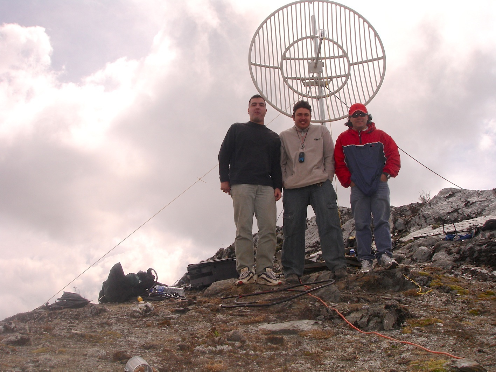

 

Figure CsLD 14: The team at el Aguila, José Torres (left), Javier
Triviño (centre) and Francisco Torres (right).

 

Although further tests must be conducted to ascertain the limits for
stable throughput, we are confident that Wi-Fi has a great potential for
long distance broadband communication. It is particularly well suited
for rural areas were the spectrum is still not crowded and interference
is not a problem, provided there is good radio line of sight.

### Acknowledgments

We wish to express our gratitude to Mr. Ismael Santos for lending the
mesh antenna to be installed at El Aguila and to Eng. Andrés
Pietrosemoli for supplying the special scaffolding joints used for the
installation and transportation of the antennas.

 

We'd also like to thank the Abdus Salam International Centre of
Theoretical Physics for supporting Carlo Fonda’s trip from Italy to
Venezuela.

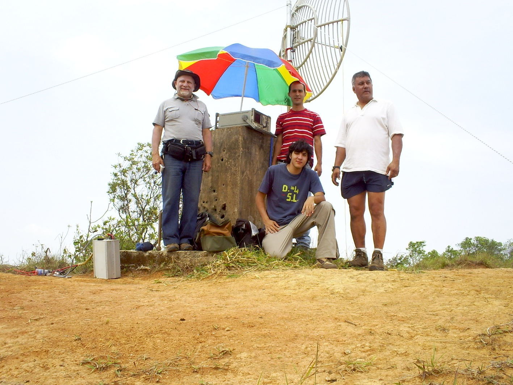

 

Figure CsLD 15: The team at Platillon. From left to right: Leonardo
González V., Leonardo González G., Ermanno Pietrosemoli and Alejandro
González.

 

The 2006 experiment was performed by Ermanno Pietrosemoli, Javier
Triviño from EsLaRed, Carlo Fonda, and Gaya Fior from ICTP. With the
help of Franco Bellarosa, Lourdes Pietrosemoli, and José Triviño.

For the 2007 experiments, Dr. Eric Brewer from Berkeley University
provided the wireless routers with the modified MAC for long distance,
as well as enthusiastic support through his collaborator, Sonesh Surana.
RedULA, CPTM, Dirección de Servicios ULA Universidad de los Andes and
Fundacite Mérida contributed to this trial.

The second experiment work was funded by Canada's IDRC. References:

Fundación Escuela Latinoamericana de Redes, Latin American Networking
School, [http://www.eslared.org.ve/](http://www.eslared.org.ve/)

Abdus Salam International Centre for Theoretical Physics,

[http://wireless.ictp.it/](http://wireless.ictp.it/)

OpenWRT Open Source firmware for Linksys,

[http://openwrt.org/](http://openwrt.org/)
[www.idrc.ca](http://objavi.booki.cc/tmp/wirelessnetworkinginthedevelopingworld-en-2013.02.13-23.20.02.odtQlyYWy/case-study-long-distance-80211-in-venezuela/www.idrc.ca)

Fundacite Mérida,

[http://www.fundacit](http://www.fundacite-merida.gob.ve/)e-[merida.gob.ve/](http://www.fundacite-merida.gob.ve/)

--Ermanno Pietrosemoli

Case Study: Pisces Project
--------------------------

Solar Powered Wifi Links in Micronesia

By Bruce Baikie and Laura Hosman, assisted in the field by Marco Zennaro
and Ermanno Pietrosemoli from Ictp.

 

Two long-distance, solar-powered wireless point to point connections
were set up in the Micronesian Region of the Pacific in early August
2012 as part of the Pacific Island Schools Connectivity, Education, and
Solar (PISCES) Project
([http://www.piscespacific.org/livesite](http://www.piscespacific.org/livesite/)[/](http://www.piscespacific.org/livesite/)),a
multi-partnered endeavour focused on training and local capacity
building vis-à-vis solar-powered information and communications
technology (ICT) within the Pacific region.

 

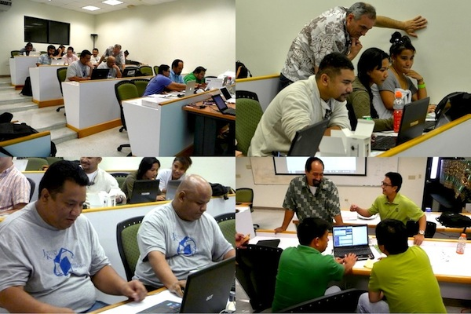

Figure CSP 1 : Hands On Training

 

The first half of the PISCES project was a hands-on training workshop on
Solar-powered long-distance WiFi technology at the University of Guam.

The workshop focused on WiFi technology, standards, solar power, site
surveys, project safety, and link planning tools. The workshop provided
plenty of opportunities for hands-on experiences, with each afternoon’s
activity consisting of a one-to-three hour lab in which students
actualised the practical information from the morning’s lecture. On the
final day, the students set up a solar powered point to point high
bandwidth link in the Centre for Island Sustainability, replacing an
older, slower link to the Internet.

 

Fig. CSP 2: A new faster Internet connection for the Centre for Island
Sustainability

 

For the second half of the PISCES project, the team travelled to Chuuk,
one of the Federated States of Micronesia (FSM), and installed both a
solar-powered long distance WiFi Internet connection and a
Solar-Computer-Lab-in-a-Box at a primary school on a previously un-
connected island, Udot, in the Chuuk lagoon.

 

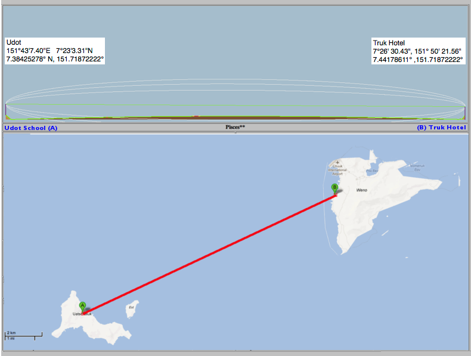

 

Figure CSP 3 : The Internet connection for the Udot School originated
from Chuuk’s main Island, Weno, 15 km away.

 

Figure CSP 4 : Mounting the pole mast in Udot

 

The Ubiquiti Networks WiFi hardware installed in Weno was mounted on the
3rd story roof of the Truk Stop Hotel, which offered the height
necessary for line-of-sight to provide connectivity across the Chuuk
Lagoon to Udot Island.

 

The single-level school on Udot required a 40-foot (12 m) pole mast on
which to mount the Ubiquiti Networks WIFI antenna/radio.

 

Local community members joined in to help when the heft of the pole mast
proved too heavy for the PISCES team to raise alone.

With team members on each island, the antennas were lined up and
connected to each other.

 

The network was then routed through a local DSL Internet connection to
provide Internet connectivity to the school, and the surrounding local
community.

 

Each WiFi unit is powered with a solar photovoltaic system, which
consists of a 30 watt solar panel from SolarLand USA, solar charge
controller with Power over Ethernet, and 38 amp hours of battery back
up.

 

 

 

Figure CSP 5 : Udot

 

The unique Solar-Computer-Lab-in-a-Box deployed at Udot school was
developed by students at Illinois Institute of Technology.

This turnkey computer lab is designed to be as close to plug-and-play as
possible for off-grid environments.

It includes six Intel Classmate laptops, solar panels and mounting gear,
a charge controller, wiring, and laptop security equipment, all
contained within a uniquely-designed and ready-to-ship box that
straightforwardly transforms into the computer lab’s table.

 

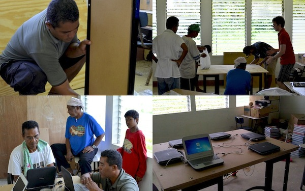

 

Figure CSP 6

 

 

The PISCES Project received funding support from Google, the Pacific
Telecommunications Council, and the Internet Society.

 

In addition to the Partners mentioned above, PISCES Project partners
include:

 

-   •University of Guam 

-   •Illinois Institute of Technology 

-   •Green WiFi, Inveneo 

-   •iSolutions 

-   •International Centre for Theoretical Physics (ICTP) 

-   •University of California, Berkeley’s TIER research group. 

Case Study: University Of Ghana campus wireless network
-------------------------------------------------------

### Introduction

 

The University of Ghana is one of six public universities and the
premier university in Ghana with a student population of about 41,000.
With the growing number of students and faculty it was obvious that we
could not continue expanding our computer labs to facilitate learning
and research, since we had limited space and limited funds to equip
these computer labs.

 

The solution was to go wireless so that any student with his/her laptop
could access the network. This however could not be achieved immediately
due the status of the network at the time. It was a big flat, un-managed
network, with lots of problems - IP conflicts, rogue DHCP severs, large
broadcast domains just to mention a few.

 

Because the IT unit was not providing a wireless service to the
community, users became impatient and started connecting their own
wireless routers to the network. This made network management even more
difficult. It became obvious that if we did not provide a wireless
service to the user community, they would find their own way of doing
it.

 

Our first step in addressing the problem was to redesign our network
from a flat network to a more structured one with core, distribution and
access layers.

 

This brought a lot of stability to the network. Because of the managed
switches, identifying problems became much easier too. The structured
wired network gave us a good foundation to build a wireless network that
complements the wired network and meets the growing needs of our users.

 

### Wifi setup and installation

A number of factors were considered in determining the type of Access
Point (AP) to deploy. Some of these were:

-    

-   •Cost 

-   •Support 

-   •Management 

-   •Security 

     

Because of the size of our network we decided to go for an Enterprise
Solution which would make management much easier. Due to the high cost
of these Enterprise Solutions (\$600 per Access Point and above + cost
of the controller ) we ended up in a long debate over which product to
use for the WiFi implementation.

 

We consulted NSRC (the Network Startup Resource Center at University of
Oregon) who were also looking into affordable and scalable wireless
solutions and they pointed us to Ubiquiti UniFi which costs about \$80
per Access Point and has a free software controller. Together with NSRC
personnel we did a survey and ran a successful pilot with 10 Access
Points. Because of the cost, functionality, manageability and ease of
deployment, University of Ghana decided to scale up from the pilot using
Ubiquiti UniFi Access Points and the network quickly grew from 10 Access
Points to 90.

 

For security, UniFi APs support both WPA Personal and WPA Enterprise
which allows users to authenticate with a radius server. In addition to
all of the deployment advantages of Ubiquiti, we found that there was a
large UniFi user community that provided good technical help in the
event of problems.

 

AP Setup

Initial AP setup and configuration involved connecting an AP to a
network switch port in the same vlan as the controller server.

The AP goes through adoption when connected; this allows the new AP to
register itself with the controller for management. After initial setup,
the AP is then connected to the designated department’s wireless vlan on
a switch.

IP Addressing

Private IP addressing was adopted for the wireless network on campus.
There are on average 25 /24 wireless subnets in departments, faculties,
school and college.

 

Bandwidth

Bandwidth allocation to the wireless network is 10% of the University’s
STM1 bandwidth.

Current growing wireless users coupled with growing emerging
applications will require more bandwidth to give a good browsing
experience.

 

Security/Authentication

Users and APs authenticate with a radius server using 802.1x. Both
student and staff account details are stored in a Mysql database. The
campus wireless network exists in separate vlans from the wired for easy
identification and management.

### Connecting to the UG campus wireless network

The University Of Ghana Campus Wireless Network has three major
Networks/SSIDs - STAFF, STUDENT, GUEST.

 

1.  STAFF

This SSID/Network is available to active staff of the University.

Staff are required to authenticate with their staff ID and PIN as
username and password respectively to login.

 

1.  STUDENT

This SSID/Network is available to students of the University who have
registered for a given academic year. Students authenticate with their
student ID and PIN as username and password respectively to login.

 

1.  GUEST

This SSID/Network is available to guests who visit the University within
a period of time.

Guests are required to request authentication account details from the
IT department by submitting their details.

### Pictures of our project and installation

Figure CSG 1: Our campus

 

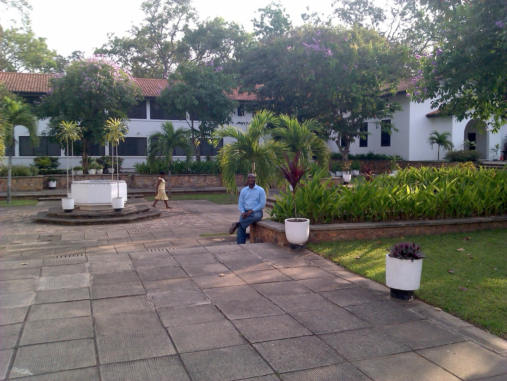

Figure CSG 2: Our campus

 

Figure CSG 3: A classroom

 

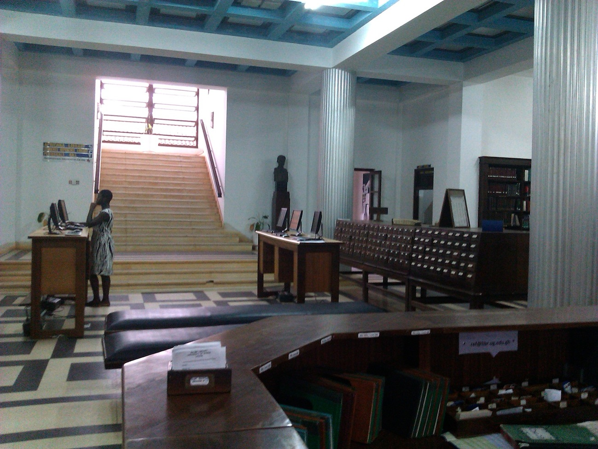

Figure CSG 4: The library

 

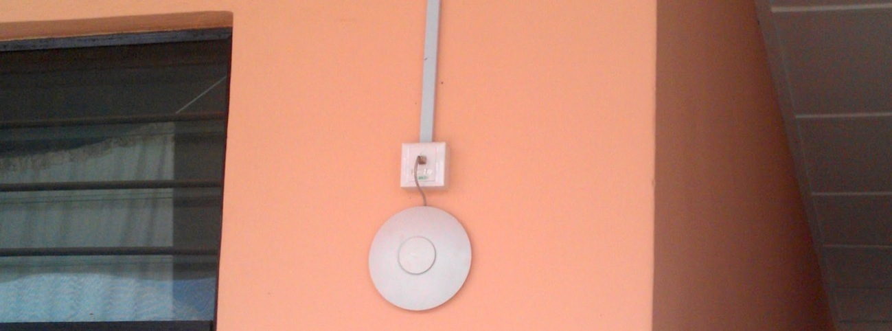

 

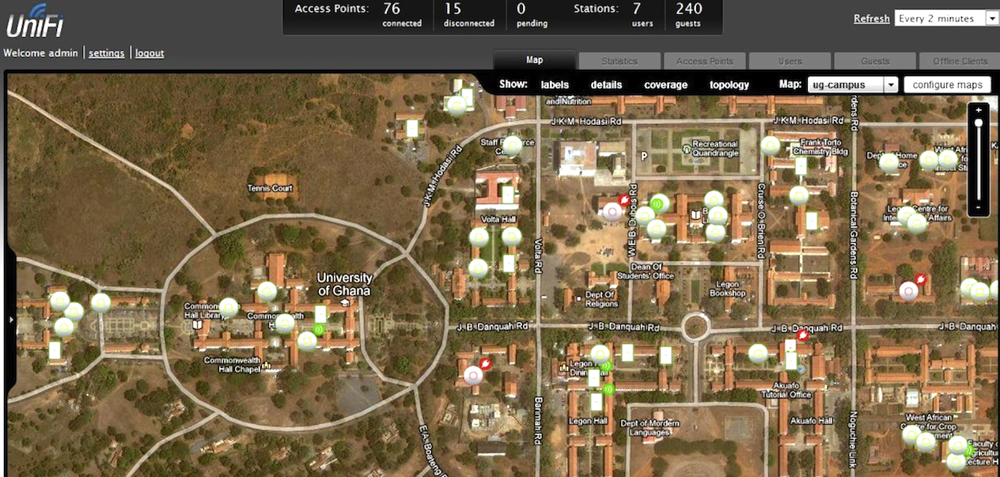

Figure CSG 6: Layout of University of Ghana campus with AP's.

 

Figure CSG 7: With UniFi we are able to simulate the coverage of the
wireless signal as shown above.

 

 

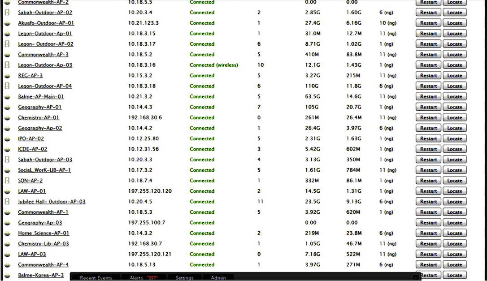

Figure CSG 9: Above are statistics per Access Point.

 

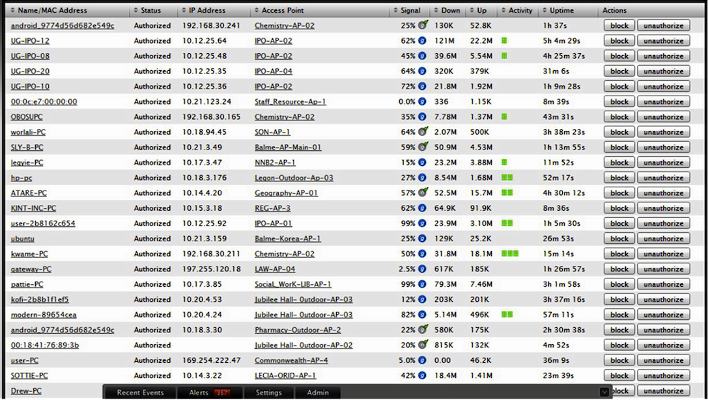

Figure CSG 10: We are also able to get statistics per user from the
controller.

 

### Challenges we faced

One of our main challenges was getting a good Cat5 cable for the
installation. In addition it was somewhat challenging to get the cable
to the right location since the buildings were not designed with this in
mind.

Bandwidth is also a challenge but we are trying to limit peer-to-peer
activity on the network using cyberoam.

### Next steps

We (the IT Department of the University of Ghana) operate the wireless
network ourselves. We have immediate plans to expand the wireless
network until we get as much coverage of our campus buildings as we can.
This will then reduce the need for our students to setup their own APs
making our job managing the network much easier!

 

Author: Emmanuel Togo, Head of the Networking Unit of the University of
Ghana's Computing Systems (UGCS).

 

Case Study: Airjaldi's Garhwal Network, India
---------------------------------------------

 

### Introduction

In version 2 of this book we included a case study about the Dharamsala
Community Wireless Mesh Network. Following on from this original
deployment in the subsequent years, a new set of networks and a
commercial wireless ISP has emerged in the same region led by the same
people. Here we describe one of their major projects.

### Airjaldi’s Garhwal Network:

Working Towards Technical and Economic Viability in the Himalayan Range

 

About Rbb/Airjaldi

Rural Broadband Pvt. Ltd., is a leading innovator and implementer of
technically and economically viable connectivity solutions for rural
areas. We design, build and operate broadband networks in rural areas in
India. Incorporated in India in 2009, RBB presently owns and operates
networks in the Indian states of Himachal Pradesh, Uttarakhand,
Jharkhand, and Karnataka. RBB uses AirJaldi as a brand name for its
network and other connectivity-related initiatives.

The company’s activities are carried out from our management office in
Delhi, our operations office in Dharamsala, Himachal Pradesh and offices
in each network location.

Our diverse team includes local Indian villagers, Tibetan refugees,
skilled professionals from metropolitan areas in India and people from
outside India.

We believe that rural networks need to be technically viable – they need
to provide a quality and consistency of services that is at the very
least similar to that offered anywhere else.

They also need to be economically sustainable – they need to be able to
stand on their own within a relatively short period of time (around 18
months) while offering clients services at reasonable prices.

Further, we are strong advocates of an all-inclusive “retail ecosystem”
approach – once we reach an area, we seek to connect all clients who are
in need of connectivity, regardless of the size of their operation or
package demand. We aspire to make all our clients pay for their
connectivity, although subsidies are offered to selected clients, mainly
those dedicated to social and developmental causes and showing financial
need.

 

RBB works closely with AirJaldi Research and Innovation, a
non-for-profit (section 25) enterprise registered in India. Created in
2007, AirJaldi Research & Innovation identifies suitable and affordable
networking solutions for rural areas, tests them in real-life
environments and shares its learning with like-minded organizations and
individuals. AirJaldi also operates a training and capacity-building
centre in Dharamsala, where network operators and activists can acquire
the skills to build and manage rural wireless networks.

 

Most of our deployment team members have been trained by AirJaldi
Research and Innovation.

Team members normally take the basic one-month “Wireless 108” and the
more advanced “Wireless 216” courses offered at the AirJaldi Network
Academy. After an additional 3-month internship where they work under
the close supervision of senior team members in one of our networks,
they are enrolled as permanent team members.

 

### The Airjaldi Garhwal Network – Vital Statistics

Date of initiation/inception | January 2010

Size/spread | about 100 km, ranging from the Dehradun valley to the
heights of Tehri Garwal Mountains (height of about 2,000 metres).
Primary clients | Micro banking enterprise, Schools, Community based
Organizations, Business and Private users

Longest link | 55 Km.

Population density | 169/km (in comparison: Delhi: 9,294/km; Overall
India: 363/km; USA: 33.7/km)

 

 

### Realities, needs

The Tehri and Pauri Garhwal districts of Uttarakhand, which stretches
from the Himalayan peaks of Thalaiya Sagar, Jonli and the Gangotri group
to the Dheradun Valley and Rishikesh, are one of India’s most
mountainous areas. Renowned for its many religious temples, located on
the banks of the River Ganges and on hilltops leading to the Himalayan
range, the region is known for its rugged beauty. This ruggedness is
however also a cause for the relative poverty of the region: its
inhabitants live mostly in small villages separated from each other by
tall mountains and deep valleys. The main local sources of income are
subsistence agriculture and cottage industries. Many work outside the
region, in large cities, in the plains and in military and government
services across India.

 

In 2009, KGFS Rural Services[1](#ftn2), a micro-banking institution
affiliated with IFMR Trust[2](#ftn3), decided to set up operations in
this hilly area. Their aim was to reach potential clients in the
villages of Tehri and Pauri who until then had little or no access to
regular banking services and were also considered “barely bankable” by
most banks.

Using population density mapping, KGFS sought locations for its bank
branches at the centre of “catchment areas” reaching about 10,000
people. It soon became clear to KGFS that, having solved the density and
accessibility pre-requisites, they were faced with severe connectivity
limitations, as most of their proposed locations had no Internet
infrastructure. initial deployment of VSATs and use of local ADSL
services proved expensive, slow and prone to breakdowns.

That was when we received a call from IFMR’s IT team, asking if we’d be
interested in proposing a connectivity solution for their first 15
branches.

 

The initial deployment: approach, design, deployment

When responding to the call, as we do with similar requests, AirJaldi
forms its response based on information on the following network
essentials:

how far is the closest available backhaul location (the place from where
we can avail access to the Internet cloud) from the proposed deployment
area?

Our surveys suggested that there were relatively few backhaul locations
in the area.

Most were located in Dehradun and neighbouring towns (see Figure CSD 1).
Reaching from there to the proposed deployment area proved problematic.
After much effort we located a backhaul “drop” at a BTS in the town of
Narrandar Nagar (see Figure CSD 1). Although very close to some of the
branches, there was no line of site from the drop to any of the
branches. This led us to come up with a somewhat counter-intuitive
solution: use the Narrandar Nagar location as backhaul to connect a
Network Operation Center (NOC) that will be placed in the valley below,
where better LoS to favourable mountain tops for potential relays was
available.

 

 

Figure CSD 1: Garhwal Network Backhaul, NOC and some IFMR branches, 2009

 

Can we propose a deployment plan that is technically solid but at the
same time affordable to the “anchor client” [3](#ftn4) and additional
future clients?

Our initial survey of the area consisted of collecting latitude and
longitude data of proposed branch locations, identification of possible
relay locations, assessment of overall client potential in the area and
assessment of the public infrastructure of the area.

 

We were not surprised to find that the branches were mostly located in
valleys (easier access for clients, close to roads) and separated from
each other by high mountain ranges preventing direct LoS between them.

Power supply to relays promised to be a challenge – most potential relay
locations were either away from the grid or located at weak points where
power was at times down for days and wild power fluctuations caused
routers to “hang” or burn when power spikes hit them.

 

Having decided that we will pursue this deployment, our deployment team
had to make sense of it all.

The solution we reached was based on placing solar-powered relays on as
few strategic locations as possible.

 

This led to additional field surveys, involving hours of preliminary
office research using topographic maps, Google Earth and other tools,
followed by days of trekking to identified locations in order to see if
a location could be secured through a rent deal, and the safety and
integrity of the relay guaranteed by the land owners.

 

What is the overall client potential in the area and will it be
sufficient to, at a minimal level, ensure that the network is
economically self-sustainable within around 18 months?

Client potential did not seem bright as well.

Besides the proposed bank branches we found few additional clients –
mainly schools and other organizations.

 

We were sure that the client base will grow in time, but had to find a
way to ensure viability in a relatively short time.

We decided to extend the network to more densely-populated areas at the
foothills of the Garhwal range.

 The actual deployment work began in October 2009.

After around two months of deployment work, the core network was ready.

Its size was around 50x70km.

It provided connectivity to 15 bank branches and around five schools and
institutions in the valley.

Most of its stand-alone relays were solar-powered and its longest
single-hop link was 54 km.

 

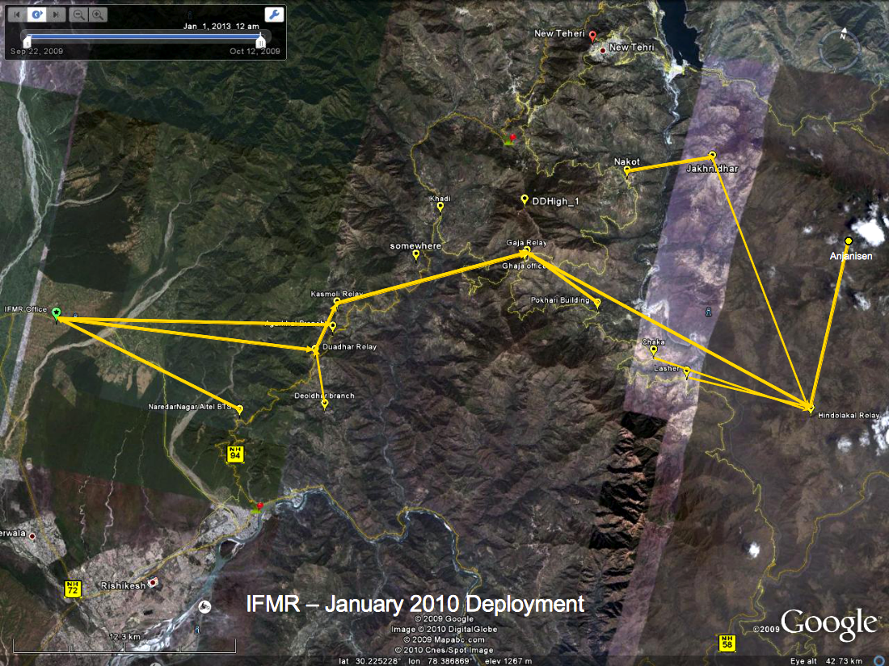

 

Figure CSD 3: Field survey in the Garhwal region

 

 

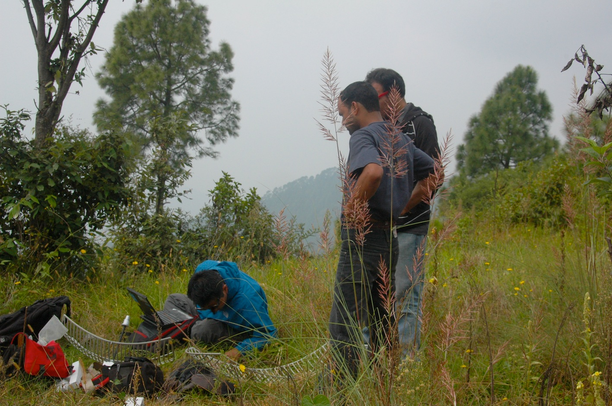

Figure CSD 5: Preparing for relay installation, Kumaon Network

 

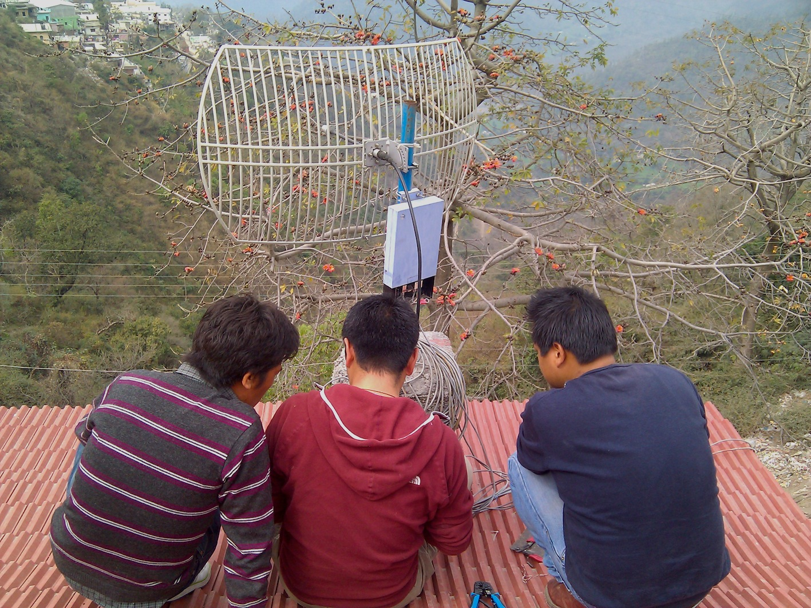

 

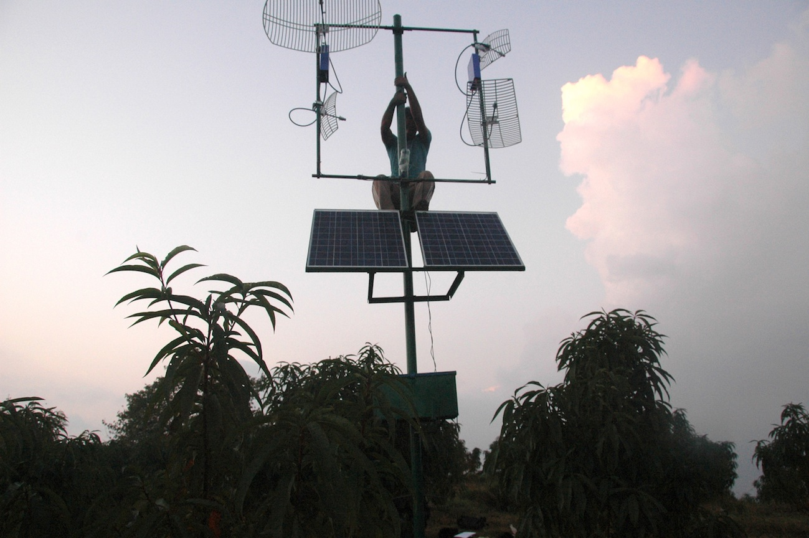

Figure CSD 7: Last touches to solar relay, Kumaon Network

 

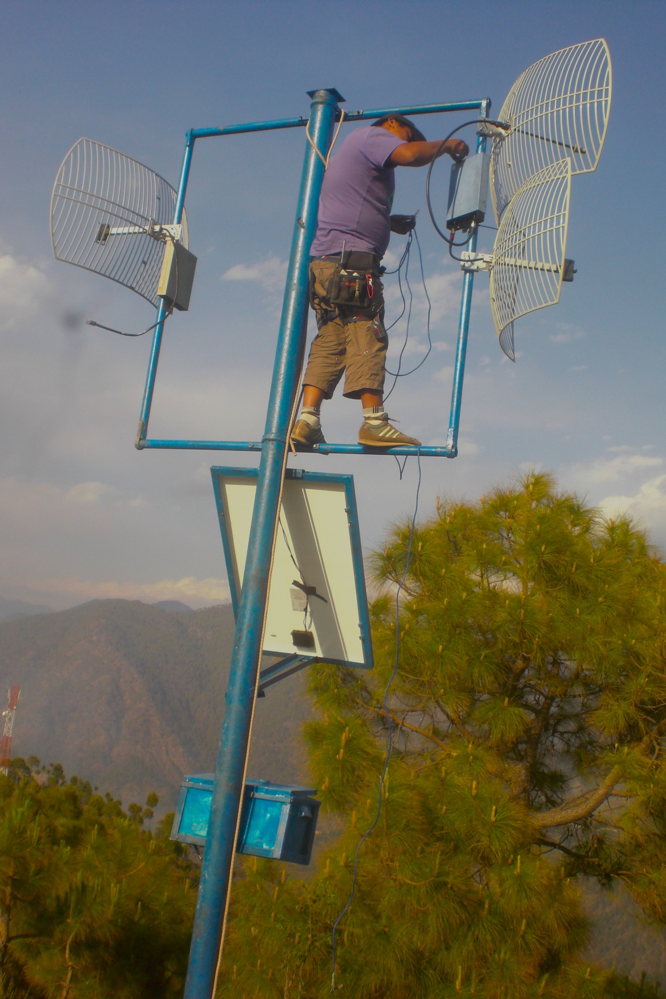

Figure CSD 8: Backhaul Relay, Garhwal Network

 

 

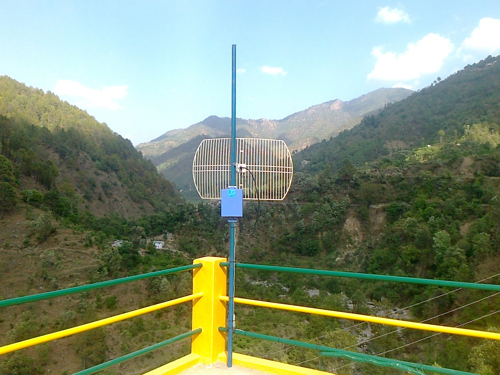

Figure CSD 10: Client Relay, Kangra Valley Network

 

Three years on – operation, economic viability, challenges and
responses.

Three years on, the present network still caters to the initial 15
branches and original clients. It has also grown significantly. Its
present size is around 120x100 km.

Travel time between our NOC/Office to its furthest reaches takes around
seven hours (!), and the number of clients on the mountain ranges and
valley has grown significantly. In its ongoing efforts to maintain this
challenging network, our team has had to deal with land slides, snow,
rain and thunder storms, wild elephants, leopards (yes!) and of course
clients for whom much of this mattered little when their line is down.

We are very proud of the fact that our average uptime in our years of
operation in the area exceeds 95% and that the network has attracted
much attention and praise from its users, other Internet players and the
media.

 

This said, challenges still abound and the struggle to keep it all
running is still very much an ongoing effort. The main challenges we
faced since the inception of the network are:

 

Energy – power is still a major challenge. The grid-provision is erratic
and problematic. Using the grid as the power source for our relays (even
with battery backup) has led to burnt routers and hours of travel to
troubleshoot links drained of their power backup after the line went
down.

 

Solar power, on the other hand, although almost trouble-free[4](#ftn5)
is however still costly.

Bearing the capital costs for these relays ourselves stretches a
challenging economic proposition even further, while having clients pay
the full costs for a relay limits the type of clients who can avail our
connections.

 

Relays – a good relay is one that is placed in a location covering as
much space as possible. In the Garhwal area, this means mountain tops.
These places are normally and naturally hard to get to and quite
isolated. Building, maintenance and security in these sites is an
ongoing challenge. At the time of writing we are busy rebuilding a relay
whose solar panels, battery, charger and other equipment were stolen.

Some of our new connections have proven to be so challenging as to
require a relay for each new locations, clearly not an easy economic
proposition.

 

Size – as proud as we are in the size of the network, a travel distance
of over 10 hours between its to extreme points is stretching out team,
who move mostly on bikes, to the limit, with some trouble-shooting trips
lasting over two days on account of travel.

 

Economic viability – the dual mountain-valley/sparse population-high
density model, which is an implicit a cross-subsidy has proven
successful, but has not fully solved the challenge of economic viability
in marginal mountainous areas. Our responses to these challenges evolve
constantly. Present observations and steps implemented include:

 

Energy – we have learnt that solar-powered relays are the only real
option for the Garhwal network (as for many other locations).

In trying to rationalize the costs for clients we have limited our
deployment to private/small business clients to clusters where a minimum
of 10 clients with a demand of at least 1Mbps per client can be
identified within a 5-6 month period. A lower density means higher
prices and is usually requested by clients for whose operations
connectivity is essential.

We have also begun to offer a “payment spread for time commitment”
deals: clients pay for the cost of equipment and relays (or their share
of it) over a period of time, if they agree to a contractual lock-in
period of over two years.

 

Relays – the best location is not necessarily the one with the best
coverage ONLY, but one that present an optimal combination of
visibility, security, accessibility and price. In certain cases this
means a higher number of relays, but we believe that on the whole this
is a cheaper and more rational option.

 

Size – a simple solution to the size problem would be to break the
network to smaller sub or autonomous network. We are using this approach
in other networks, where the size limit is considered by a role of thumb
of a max. of three hour travel to a site.

This however makes little sense in a sparse network such as the upper
Garhwal reaches.

The compromise solution we came across was placement of “staging posts”
in strategic network junctions.

Essentially, these “posts” are storage spaces where equipment is kept in
sufficient quantities to serve a defined catchment area.

While not saving the travel time, it allows our team to move quickly
without having to carry along heavy and bulky equipment. The evolution
of a staging post to an operational base will come when keeping a team
of two people at such a location could be justified by its client
density and revenues.

 

Economic viability – AirJaldi’s over-arching goal is to reach un-served
and under-served areas with high quality internet connectivity. As such,
the cross-subsidy model is justified as a partial solution to the
challenges faced by many aspiring rural internet providers lacking the
skills or desire to build networks of the scale of the Garhwal network.

 

That is however cannot be the only economic avenue for deployment in
such challenging environments.

Our attempts to increase the viability of “mountain provision” include
aggressive pricing of higher bandwidth packages – the marginal cost for
higher bandwidth is relatively low, allowing us higher marginal revenues
while still being able to offer very reasonable deals for such packages.

This stands in major contrast to the non-scalable dongle and VSAT
solutions that are often the alternatives to our services in these
areas. At the other end of the spectrum, we have begun offering limited
time/bandwidth packages.

Although more expensive on a per-unit basis, these packages are
appealing to clients who wish to limit their consumption to their
economic willingness to pay.

 

Future plans include introduction of “4-C”: local centers where users
can utilize bandwidth for Classroom setup (online individual learning,
live teaching to a classroom etc.) Cinema (watching films or other
online content at a local center), Café (internet café where people can
use individual computers) and Connectivity (through local hotspot in the
area of the center or through connectivity deals to houses and offices
sold at the Café).

### Summary

The Garhwal network was created in response to a request from an “anchor
client”, a micro-banking enterprise for whom connectivity was a
necessary condition for a successful implementation of its vision of
rural banking. AirJaldi responded to the deployment challenge with the
hope of ensuring high-quality and high-availability broadband internet
connection and long-term economic sustainability. These objectives were
reached through a combination of carful deployment planning, utilization
of natural topographic assets, expansion of the network from the
sparsely-populated mountain terrains to the more densely inhabited
Dherdun valley, and aggressive pricing on higher bandwidth packages.
Future plans include further expansion of the network, “thickening” of
the client density in existing areas and enriching of packages and
services offered by AirJaldi.

 

Case Study: Open Technology Institute
-------------------------------------

### Red Hook initiative Wifi & Tidepools

Red Hook Initiative WiFi is a collaboratively designed mesh network.

It provides Internet access to the Red Hook section of Brooklyn, NY, and
serves as a platform for developing local applications and services.

Red Hook Initiative has built the network in partnership with the Open
Technology Institute, putting human-centered design and community
engagement at the core of the project.

The community expanded the network significantly following a natural
disaster in the Fall of 2012.

 

Key aspects

1.  1.Main network anchors are trusted community organizations. 

2.  2.Solid relationship with technical support provider from outside
    the community. 

3.  3.Community-led design process emphasizes local needs and enhances
    engagement. 

4.  4.Rapid prototyping of applications designed for the local area
    network. 

### History of the network

Beginning in Fall 2011, the Red Hook Initiative (RHI), a Brooklyn
non-profit focused on creating social change through youth engagement,
approached the Open Technology Institute about collaborating on a
community wireless network. RHI wanted a way to communicate with the
residents immediately around its community center. OTI was initially
unable to support the effort directly, but introduced Anthony Schloss,
RHI Media Programs Coordinator, to Jonathan Baldwin, a Parsons School of
Design graduate student who had been experimenting with wireless mesh as
a local digital platform.

 

 

Figure CsOTI 1: Red Hook West Houses - public housing buildings

 

Red Hook is the northwestern corner of Brooklyn, jutting out into the
Hudson Bay. It is cut off from the rest of the borough by the Gowanus
Expressway, which carries traffic from points south into lower
Manhattan.

 

The neighborhood is home to approximately 5000 residents of Red Hook
Houses public housing and other low income areas near an expressway, as
well as a gentrifying section with many small businesses closer to the
water.

 

Many industrial sites, an Ikea and a number of public parks fill out the
area.

 

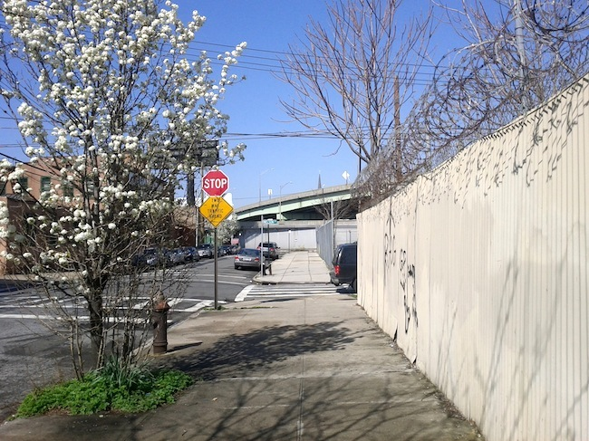

 

Figure CsOTI 2: Walking from RHI Offices to Gowanus Expressway

 

 

Figure CsOTI 3: Gowanus Expressway which divides the Red Hook
neighborhood from the rest of Brooklyn.

 

RHI WiFi’s initial plan was to provide wireless access to the Internet
in and around RHI’s building, which is near the expressway and the Red
Hook Houses.

 

Schloss and Baldwin installed a Ubiquiti Nanostation on the roof and a
Linksys router inside the building, connected via ethernet.

They connected the Linksys router to the center’s modem. This
installation provided an opportunity to prototype early versions of RHI
WiFi local applications. When residents or visitors to RHI connected to
the wireless access point named “Red Hook Initiative WiFi,”they were
directed to a website on a local server.

On this website was a “Shout Box,” a local digital message board
allowing everyone to leave a comment or a note behind and participate in
the project.

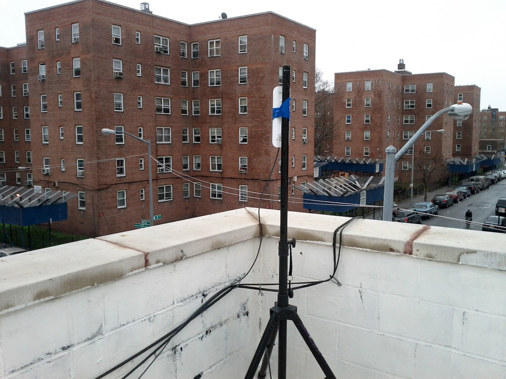

 

Figure CsOTI 4: First RHI WiFi node (Ubiquiti Nanostation) installed on
the rooftop of the building that houses the RHI offices.

 

In March of 2012, Baldwin and Schloss installed an additional Ubiquiti
Nanostation on the roof of an apartment building overlooking Coffey Park
and much of the rest of the neighborhood.

 

A resident of the building with social ties to RHI donated the
electricity and rooftop access.

 

With this vantage point on the neighborhood, the possibility of a
wireless network connecting public spaces began to take shape.

 

Initially, the Coffey Park wireless access point was not connected to
the Internet, but was connected to a GuruPlug Server.

The basic, low power server hosted a local web page on the network and a
“Shout Box” similar to the one running in RHI.

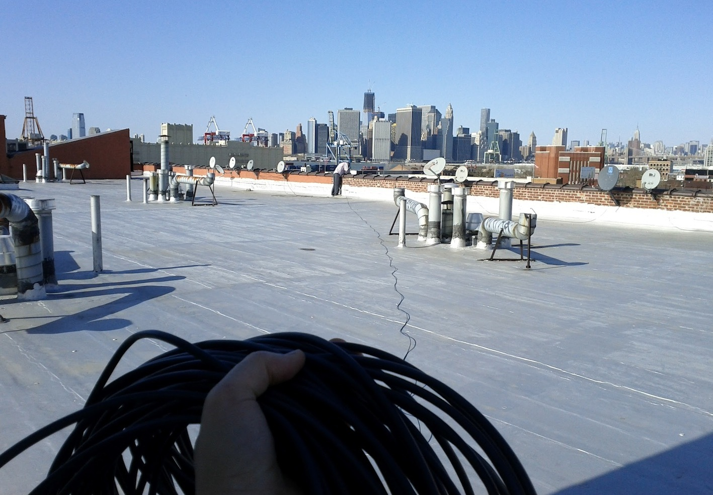

 

Figure CsOTI 5: Running cable to install a node on the roof of an
apartment building north of Coffey Park.

 

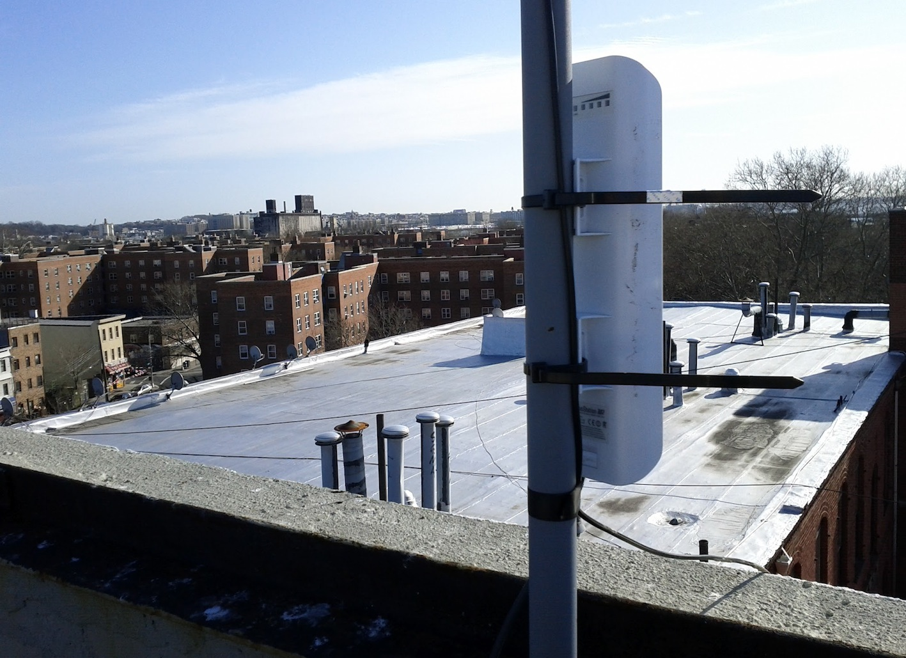

 

Figure CsOTI 6: Node installed on the roof of an apartment building.

RHI WiFi uses OTI’s Commotion Wireless firmware running on Ubiquiti
routers.

Commotion is a free and open-source communication tool that uses mobile
phones, computers, and other wireless devices to create decentralized
mesh networks.

 

Most importantly, Commotion allows network development to occur
dynamically and organically - so the community can decide where and how
the network should grow.

 

Commotion networks are sustainable without a connection to the Internet,
which makes them resilient to outages; they can distribute access to
applications hosted on local servers or on the routers themselves.

### Social software and growth of the network

Based on research into community wireless networks around the world,
Baldwin had identified a need for social software that would add value
and a distinct identity to the community wireless network, specifically
to:

 

-   •Spark civic and community engagement by addressing local needs,
    interests and culture.  

-   •Foster trust, interdependence, and reciprocity throughout the
    community. 

-   •Merge digital and physical community spaces. 

-   •Ensure that people know about mesh / have software installed before
    a communication outage occurs. 

 

Schloss and Baldwin began working with participants in RHI’s established
media programs on a collaborative, human-centered design process that
called upon the knowledge and interests of local residents.

 

Throughout the first year, Baldwin and Schloss held workshops with
community members to determine local needs and gather design ideas for
Tidepools, developed by Baldwin for piloting on the RHI network.
Tidepools is an open-source customizable local mapping platform built
using Javascript, LeafletJS, PHP and MongoDB.

Baldwin designed it for local communication, placemaking, and organizing
around events, issues, and community assets.

 

Figure CsOTI 7: Workshop to identify local needs for RHI WiFi network.
(Photo by Becky Kazansky).

 

 

Figure CsOTI 8: Tidepools map of RHI WiFi network.

 

 

The community workshops produced ideas for local applications that would
address specific needs identified by the community.

 

The needs identified in the community workshops were:

 

-   •Access to the Internet (at home, via mobile, and at neighborhood
    kiosks). 

-   •Accountable community participation (FAQs, electronic bulletin
    boards, SMS enabled features).  

-   •Access to resources (employment and skills sharing).  

-   •Local Information System (historical archive, landmarks).  

-   •Multilingual (Spanish, Arabic and Tagalog).  

-   •Playful interface to promote exploration. 

     

In the summer of 2012, Baldwin joined OTI’s staff, and OTI brought
additional tech expertise to the collaboration along with experience
closing digital divides and developing community-controlled
infrastructure.

 

The organization’s experience in Detroit and Philadelphia provided
guidance on how to collaborate with communities that have been socially,
geographically and technologically isolated within cities.

 

During the months following the initial tests of the local network, OTI
and RHI focused on realizing three initial applications that would use
the Tidepools platform and run over the local wireless network:

 

-   •Where’s the B61 Bus? - An application for accessing real-time bus
    locations and arrival times using data from the Metropolitan Transit
    Authority’s BusTime API (launched October 9, 2012). 

-   •Stop & Frisk Survey - A survey application that residents can use
    to document police interactions in Red Hook and improve public
    safety (launched October 17, 2012). 

-   •RHI Radio - An online radio station, streaming content produced by
    the Youth Radio Group at RHI (under development). 

     

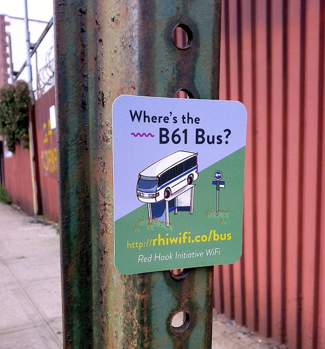

 

Figure CsOTI 10-11: Mobile user interface for "Where's the B61 Bus?"
application.

 

### Expansion after superstorm Sandy

On October 29, 2012, Superstorm Sandy devastated low-lying Red Hook
along with much of the surrounding region. Amid power outages and
flooding, the need for access to communications systems for information
about what was happening and where help was needed became crucial.

The RHI building was one of the few locations that had managed to keep
power and, as a result, RHI WiFi had stayed up through the storm.

In the days immediately following the storm, up to 300 people per day
were accessing the network to communicate with loved ones, learn what
was happening in the rest of the city, and seek recovery assistance. “We
immediately saw communications as one of the critical needs in the
community,” says Tony Schloss. “We wanted it to be as easy as possible
for people to contact their networks to find housing, gain access to
information, and report their safety status.” Text messaging was the
most widely – and in some cases the only – means of communication for
neighborhood residents after the storm, so in a matter of days, OTI
developed RHI Status - an SMS to Map plugin for Tidepools using the
Tropo Application Programming Interface (API) for handling SMS messages
and the Google Geocoding API for handling natural language addresses.
RHI Status provided a means for residents to text their location and
needs to a contact number, which automatically maps the information in
Tidepools with threaded discussion so others in the community can
respond.

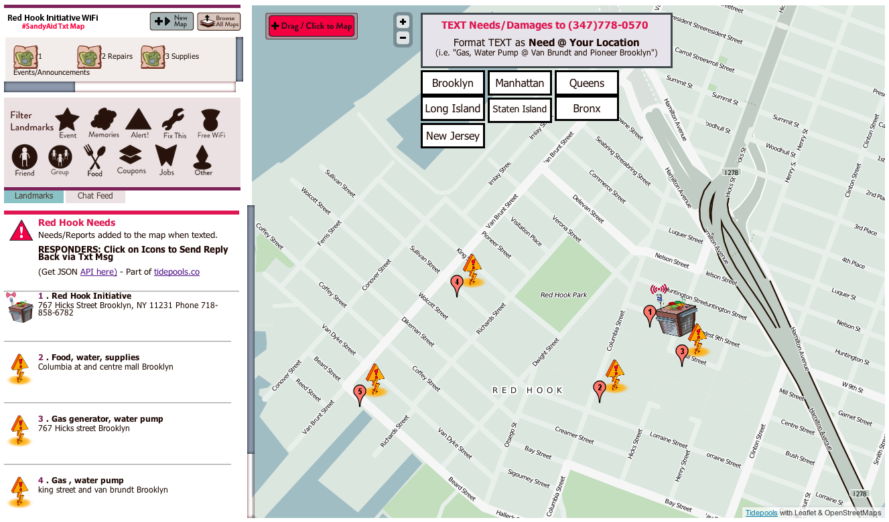

Figure CsOTI 12: Screenshot of RHI/Status application, which plots SMS
messages on a Tidepools map.

 

As recovery progressed, Frank Sanborn, a Federal Emergency Management
Administration (FEMA) Innovation Fellow, reached out to RHI about
expanding the network to further support recovery efforts in Red Hook.
Sanborn recruited volunteers from NYC Mesh and HacDC, a Washington, DC
based hackerspace, and coordinated with the International Technology
Disaster Resource Center (ITDRC).

OTI already had a store of routers at RHI from before the storm.

With technical direction from OTI and operating according to the goals
established by RHI, the team set up a FEMA satellite link on the roof of
RHI and installed a Commotion router on the roof of an auto body shop
down the block from RHI.

Previously, the owner of the shop had been reluctant to host a router,
as he did not see a benefit in doing so. However, as the community
rallied in response to the crisis, the auto body shop became a key link
between the Internet gateway at RHI and the router overlooking Coffey
Park, which had by then become an important aid distribution point for
Red Hook.

Although the satellite uplink was offered for only 30 days and provided
modest bandwidth, the mesh network could distribute the Internet
connection to key locations where residents, first responders, and
recovery volunteers needed it most.

 

As the community came together to respond to the storm, the need to grow
this resilient communications infrastructure became clear.

 

With power and water still off in much of Red Hook in the following
month, many local organizations and residents reached out to help.
Brooklyn Fiber, a local Internet service provider (ISP), volunteered an
additional gateway to RHI WiFi.

 

To add the gateway into the mesh, OTI, RHI and Brooklyn Fiber installed
a 5 GHz Ubiquiti Nanostation Loco router running AirOS (to receive the
fiber signal), and a Ubiquiti Nanostation running Commotion (as a
wireless access point), on the 3rd floor of the Visitation Church
Rectory on the west side of Coffey Park.

The church was also without power at the time, but the team installed an
uninterruptible power supply that could run the routers for 12 hours at
a time.

 

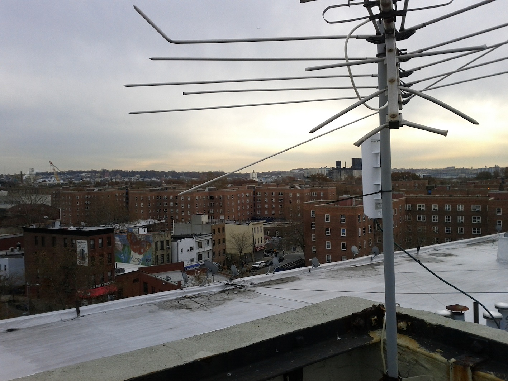

 

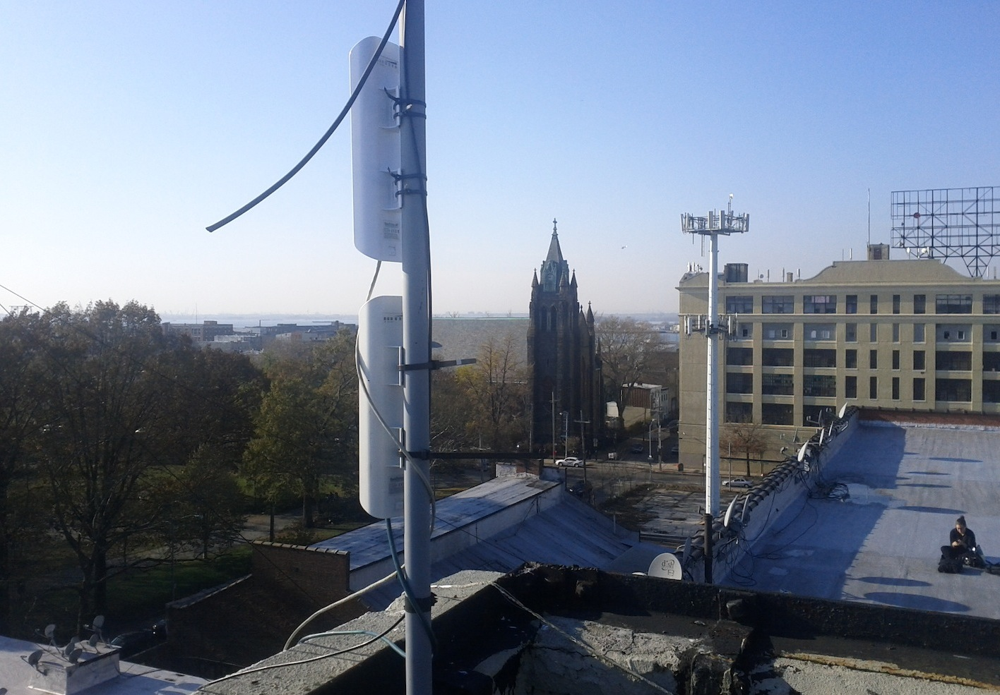

Figure CsOTI 14: Rooftop node installed after Superstorm Sandy.

 

Since the storm, RHI WiFi has supported approximately 100 users per week
even without promotion of the resource.

 

Data collected by Commotion on current DHCP leases, as well as the
Google Analytics on the landing webpage, show that residents appear to
be primarily connecting using Android devices and Apple iPod Touches.

 

In addition, many residents use the computer workstations in the RHI
media lab as well as the wireless available in RHI. RHI is serving as
both a physical and social anchor for the wireless network, driving
digital adoption, educating the neighborhood, and coordinating relief
efforts.

 

 

Figure CsOTI 15: RHI WiFi network map. Base map (c) Google Maps 2013.

 

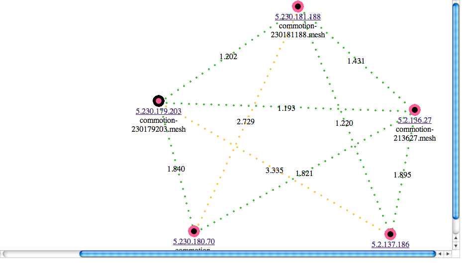

 

Figure CsOTI 16: Mesh network topology viewed in OLSRViz.

 

Figure CsOTI 17: Mesh network topology viewed in OLSRViz.

 

### Sustainability & future goals

RHI will continue to develop the project with the goal of supporting
community-wide recovery from Superstorm Sandy.

 

With support from New York City Workforce Development funding, RHI and
OTI are launching a training program in January 2013 to engage
neighborhood residents in maintaining and growing the wireless network.

Modeled on the “Digital Stewards” curriculum developed by OTI and Allied
Media Projects in Detroit, Michigan, the curriculum will train young
adults to install new routers, maintain existing ones, and promote
adoption of the RHI WiFi network throughout Red Hook.

 

The RHI Digital Stewards will prioritize additional public spaces for
network expansion and work with other residents to design new, local
applications.

 

OTI will continue to assist in the development of the applications and
support the engineering of the network in close collaboration with the
community.

 

### Cost of the network

Donated labor from local residents and technologist. Institutional
support from RHI and OTI. Hardware (\~\$50 to \~\$85 each router).

Installation (3-5 work hours for two people per site).

Bandwidth (donated by RHI, Brooklyn Fiber, and FEMA).

Training program for local residents to maintain and expand network as
part of a municipal employment program.

### Lessons learned

Having relationships and anchor wireless nodes in place prior to a
disaster facilitates rapid network deployment through:

 

1.  -   •Already-established relationships with key community
        stakeholders. 

1.  -   •A heightened level of technological literacy in the community. 

1.  -   •Pre-positioned wireless network equipment in the neighborhood. 

 

The most challenging investment is in the initial organizing and design
phase before any value is realized.

Community-designed applications add value to a local network, even at a
small scale.

### Related articles & websites

RELEASE:

New Community-Tech Tool to Help in Sandy's Aftermath

[http://oti.newamerica.net/pressroom/2012/release\_new\_community\_tech\_tool\_to\_help\_in\_sandys\_aftermath](http://oti.newamerica.net/pressroom/2012/release_new_community_tech_tool_to_help_in_sandys_aftermath)

What Sandy Has Taught Us About Technology, Relief and Resilience

[http://www.forbes.com/sites/deannazandt/2012/11/10/wha](http://www.forbes.com/sites/deannazandt/2012/11/10/what-sandy-has-taught-us-about-technology-relief-and-resilience/)[t](http://www.forbes.com/sites/deannazandt/2012/11/10/what-sandy-has-taught-us-about-technology-relief-and-resilience/)[-](http://www.forbes.com/sites/deannazandt/2012/11/10/what-sandy-has-taught-us-about-technology-relief-and-resilience/)[sand](http://www.forbes.com/sites/deannazandt/2012/11/10/what-sandy-has-taught-us-about-technology-relief-and-resilience/)[y-](http://www.forbes.com/sites/deannazandt/2012/11/10/what-sandy-has-taught-us-about-technology-relief-and-resilience/)[ha](http://www.forbes.com/sites/deannazandt/2012/11/10/what-sandy-has-taught-us-about-technology-relief-and-resilience/)[s-](http://www.forbes.com/sites/deannazandt/2012/11/10/what-sandy-has-taught-us-about-technology-relief-and-resilience/)[taught](http://www.forbes.com/sites/deannazandt/2012/11/10/what-sandy-has-taught-us-about-technology-relief-and-resilience/)[-](http://www.forbes.com/sites/deannazandt/2012/11/10/what-sandy-has-taught-us-about-technology-relief-and-resilience/)[u](http://www.forbes.com/sites/deannazandt/2012/11/10/what-sandy-has-taught-us-about-technology-relief-and-resilience/)[s](http://www.forbes.com/sites/deannazandt/2012/11/10/what-sandy-has-taught-us-about-technology-relief-and-resilience/)[-](http://www.forbes.com/sites/deannazandt/2012/11/10/what-sandy-has-taught-us-about-technology-relief-and-resilience/)[abou](http://www.forbes.com/sites/deannazandt/2012/11/10/what-sandy-has-taught-us-about-technology-relief-and-resilience/)[t](http://www.forbes.com/sites/deannazandt/2012/11/10/what-sandy-has-taught-us-about-technology-relief-and-resilience/)[-](http://www.forbes.com/sites/deannazandt/2012/11/10/what-sandy-has-taught-us-about-technology-relief-and-resilience/)[technology](http://www.forbes.com/sites/deannazandt/2012/11/10/what-sandy-has-taught-us-about-technology-relief-and-resilience/)[-](http://www.forbes.com/sites/deannazandt/2012/11/10/what-sandy-has-taught-us-about-technology-relief-and-resilience/)[relie](http://www.forbes.com/sites/deannazandt/2012/11/10/what-sandy-has-taught-us-about-technology-relief-and-resilience/)[f](http://www.forbes.com/sites/deannazandt/2012/11/10/what-sandy-has-taught-us-about-technology-relief-and-resilience/)[-](http://www.forbes.com/sites/deannazandt/2012/11/10/what-sandy-has-taught-us-about-technology-relief-and-resilience/)[and](http://www.forbes.com/sites/deannazandt/2012/11/10/what-sandy-has-taught-us-about-technology-relief-and-resilience/)[-](http://www.forbes.com/sites/deannazandt/2012/11/10/what-sandy-has-taught-us-about-technology-relief-and-resilience/)[resilience/](http://www.forbes.com/sites/deannazandt/2012/11/10/what-sandy-has-taught-us-about-technology-relief-and-resilience/)

A Community Wireless Mesh Prototype in Detroit, MI

[http://www.newamerica.net/node/34925](http://www.newamerica.net/node/34925)

 

Tidepools

[http://tidepools.co](http://tidepools.co/)

[http://www.animalnewyork.com/2012/tidepool](http://www.animalnewyork.com/2012/tidepools-a-social-networktool-in-the-service-of-the-community/)[s](http://www.animalnewyork.com/2012/tidepools-a-social-networktool-in-the-service-of-the-community/)[-](http://www.animalnewyork.com/2012/tidepools-a-social-networktool-in-the-service-of-the-community/)[a](http://www.animalnewyork.com/2012/tidepools-a-social-networktool-in-the-service-of-the-community/)[-](http://www.animalnewyork.com/2012/tidepools-a-social-networktool-in-the-service-of-the-community/)[socia](http://www.animalnewyork.com/2012/tidepools-a-social-networktool-in-the-service-of-the-community/)[l](http://www.animalnewyork.com/2012/tidepools-a-social-networktool-in-the-service-of-the-community/)[-](http://www.animalnewyork.com/2012/tidepools-a-social-networktool-in-the-service-of-the-community/)[networktoo](http://www.animalnewyork.com/2012/tidepools-a-social-networktool-in-the-service-of-the-community/)[l](http://www.animalnewyork.com/2012/tidepools-a-social-networktool-in-the-service-of-the-community/)[-](http://www.animalnewyork.com/2012/tidepools-a-social-networktool-in-the-service-of-the-community/)[i](http://www.animalnewyork.com/2012/tidepools-a-social-networktool-in-the-service-of-the-community/)[n](http://www.animalnewyork.com/2012/tidepools-a-social-networktool-in-the-service-of-the-community/)[-](http://www.animalnewyork.com/2012/tidepools-a-social-networktool-in-the-service-of-the-community/)[th](http://www.animalnewyork.com/2012/tidepools-a-social-networktool-in-the-service-of-the-community/)[e](http://www.animalnewyork.com/2012/tidepools-a-social-networktool-in-the-service-of-the-community/)[-](http://www.animalnewyork.com/2012/tidepools-a-social-networktool-in-the-service-of-the-community/)[servic](http://www.animalnewyork.com/2012/tidepools-a-social-networktool-in-the-service-of-the-community/)[e](http://www.animalnewyork.com/2012/tidepools-a-social-networktool-in-the-service-of-the-community/)[-](http://www.animalnewyork.com/2012/tidepools-a-social-networktool-in-the-service-of-the-community/)[o](http://www.animalnewyork.com/2012/tidepools-a-social-networktool-in-the-service-of-the-community/)[f-](http://www.animalnewyork.com/2012/tidepools-a-social-networktool-in-the-service-of-the-community/)[th](http://www.animalnewyork.com/2012/tidepools-a-social-networktool-in-the-service-of-the-community/)[e](http://www.animalnewyork.com/2012/tidepools-a-social-networktool-in-the-service-of-the-community/)[-](http://www.animalnewyork.com/2012/tidepools-a-social-networktool-in-the-service-of-the-community/)[community/](http://www.animalnewyork.com/2012/tidepools-a-social-networktool-in-the-service-of-the-community/)

http://wlan-si.net/en/blog/2012/05/26/introducing-tidepools-social-wifi

[http://www.core77.com/blog/social\_design/a\_communit](http://www.core77.com/blog/social_design/a_community-owned_map_accessed_via_mesh_networks_23319.asp)y-[owned\_map\_accessed\_via\_mesh\_networks\_23319.asp](http://www.core77.com/blog/social_design/a_community-owned_map_accessed_via_mesh_networks_23319.asp)

[http://www.jrbaldwin.com/tidepoolswifi/](http://www.jrbaldwin.com/tidepoolswifi/)

 

Stop & Frisk App

[http://animalnewyork.com/2012/](http://animalnewyork.com/2012/stop-and-frisk-app-from-red-hook-initiative/)stop-and-frisk-app-launched-by-red-hook-initiative

http://www.dnainfo.com/new-york/20121017/red-hook/stop-and-frisk-app-launched-by-red-hook-initiative

 

Red Hook

[http://www.nycgovparks.org/parks/redhookpark/history](http://www.nycgovparks.org/parks/redhookpark/history)

 

 

 

 

 

[1](#body_ftn1). While the WRT54GL is still available on the market, at
prices of 60 US-\$ it is overpriced. The WRT54G revision 4.0 was sold as
WRT54GL revision 1.0 by Linksys in 2005, after Linksys had introduced
the WRT54G revision 5.0, which wasn't Linux compatible anymore. The
WRT54G revision 5.0 has only half the flash storage and RAM capacity.
The WRT54G model is the WiFi router with the longest production
lifetime. For the money you need to spend on a Linksys WRT54GL in 2011
you can buy two or three similar devices from other brands that are
faster in terms of CPU and data rate.

[1](#body_ftn2)       
[http://ruralchannels.ifmr.co.in/kgf](http://ruralchannels.ifmr.co.in/kgfs-model/what-is-a-kgfs/)[s](http://ruralchannels.ifmr.co.in/kgfs-model/what-is-a-kgfs/)[-](http://ruralchannels.ifmr.co.in/kgfs-model/what-is-a-kgfs/)[model/wha](http://ruralchannels.ifmr.co.in/kgfs-model/what-is-a-kgfs/)[t](http://ruralchannels.ifmr.co.in/kgfs-model/what-is-a-kgfs/)[-](http://ruralchannels.ifmr.co.in/kgfs-model/what-is-a-kgfs/)[i](http://ruralchannels.ifmr.co.in/kgfs-model/what-is-a-kgfs/)[s](http://ruralchannels.ifmr.co.in/kgfs-model/what-is-a-kgfs/)[-](http://ruralchannels.ifmr.co.in/kgfs-model/what-is-a-kgfs/)[a](http://ruralchannels.ifmr.co.in/kgfs-model/what-is-a-kgfs/)[-](http://ruralchannels.ifmr.co.in/kgfs-model/what-is-a-kgfs/)[kgfs/](http://ruralchannels.ifmr.co.in/kgfs-model/what-is-a-kgfs/)

 [http://www.ifmr.co.in/](http://www.ifmr.co.in/)

[3](#body_ftn4) Each of our networks has one or more clients which are
referred to as “anchor clients”. The term denotes their role as the
first clients in a network, and the ones that contribute mostly to its
initial economic feasibility.

[4](#body_ftn5) The monsoon months, with their very heavy rains and
perpetually overcast skies create limiting charging conditions, and have
forced us to equip most of our relay with extra charging capacity, which
further increases the costs of relays
